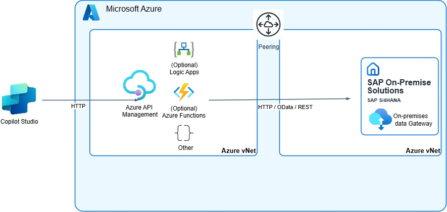

# Azure API Management and virtual network peering

> [!IMPORTANT]
> When you're consuming SAP APIs and interfaces, always ensure that your usage complies with [SAP's API policy](https://help.sap.com/doc/sap-api-policy/latest/en-US/API_Policy_latest.pdf). If you have questions about permitted API usage in your specific scenario, check with your SAP contact or account team.

Many customers are running their SAP Systems on Azure, either operating it by themselves or in a setup of RISE and SAP S/4HANA Cloud Private Edition.

In both cases, the fact that the SAP system is running in an Azure virtual network enables other Azure services to connect to the SAP system without the need to go over the internet. Different virtual networks can be connected or peered so that internal IP addresses of the SAP system can be exposed to other Azure services.

The most often used Azure services for this scenario are Azure Logic Apps and Azure API Management. SAP customers can use API Management to not only expose their APIs in a secure and managed way, but also expose them as Model Context Protocol (MCP) servers (currently in preview). In addition, sophisticated authentication flows to enable single sign-on (SSO) and principal propagation are documented and tested with many customers.

> [!NOTE]
> The setup also works if your SAP system isn't running on Azure. In this case, you can still use API Management, but virtual network peering isn't possible. You need to combine this setup with a proxy like the [on-premises data gateway](./architecture-on-premises-data-gateway.md).

For more information, see [Set up Microsoft Entra ID, Azure API Management, and SAP for SSO from SAP OData connector](/power-platform/sap/connect/entra-id-apim-oauth).

## Setup and configuration

To use API Management with a peered virtual network where your SAP System is running, you need to deploy (*inject*) your API Management instance in a subnet within a non-internet-routable network to which you control access. This network has to be peered with the network where your SAP system is running.

For more information, see:

* [Quickstart: Create a new Azure API Management instance by using the Azure portal](/azure/api-management/get-started-create-service-instance)
* [Use a virtual network to secure inbound or outbound traffic for Azure API Management](/azure/api-management/virtual-network-concepts#virtual-network-injection-classic-tiers)
* [Azure virtual network peering](/azure/virtual-network/virtual-network-peering-overview)
* [Connectivity with SAP RISE](/azure/sap/workloads/rise-integration-network)

### Agent and Copilot development

You can use the connectivity via API Management to consume any HTTP-based services from the SAP system. Most likely, these services are SAP OData services.

The [SAP OData connector in Copilot Studio](/power-platform/sap/connect/sap-odata-connector) can consume these services. Pro-code solutions (for example, [Microsoft 365 Agents Toolkit]((/microsoftteams/platform/toolkit/add-resource)) in Visual Studio Code) can also consume them.

### Integration and connectivity infrastructure

You have to [define the APIs](/azure/api-management/add-api-manually), which should be exposed via API Management from the SAP system first. You can do this task manually or by using OData or OpenAPI specifications.

You can also apply policies that enable SSO and principal propagation to the SAP back-end system. For more information, see:

* [Policy for Azure API Management for SSO](https://github.com/Azure/api-management-policy-snippets/blob/master/examples/Request%20OAuth2%20access%20token%20from%20SAP%20using%20AAD%20JWT%20token.xml)
* [End-to-end SSO setup](https://github.com/hobru/Single-Sign-On-with-Power-Platform-and-SAP)

### Proxy and connectivity

One of the main benefits of this setup is that you don't need an extra proxy. API Management acts as this proxy and ensures that your SAP system is behind a firewall in a private network.

### Back-end systems and data sources

For available SAP OData and REST APIs, check the [SAP Business Accelerator Hub](https://api.sap.com/).

If no fitting APIs are available, you can create your own services by using the [ABAP RESTful Application Programming Model](https://help.sap.com/docs/abap-cloud/abap-rap/creating-odata-service) or the SAP Gateway Service Builder.
