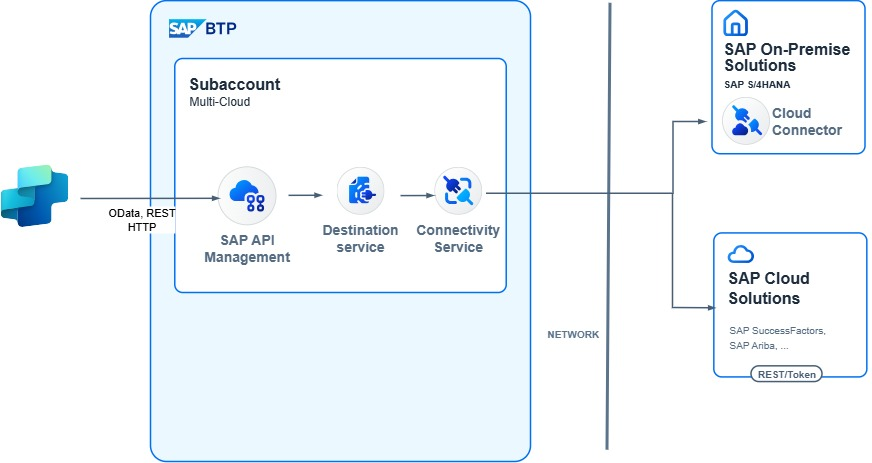

# SAP Business Technology Platform with SAP API Management and SAP Cloud Connector

> [!IMPORTANT]
> When you're consuming SAP APIs and interfaces, always ensure that your usage complies with [SAP's API policy](https://help.sap.com/doc/sap-api-policy/latest/en-US/API_Policy_latest.pdf). If you have questions about permitted API usage in your specific scenario, check with your SAP contact or account team.

Many customers who want to build a Microsoft Copilot agent connected to SAP already have SAP Business Technology Platform (BTP) in place. The benefit of that scenario is that integrations with the SAP back-end system (often on-premises) are already established through SAP Cloud Connector.

Whether you're using Microsoft Copilot Studio, Microsoft Foundry, or the Microsoft 365 Agents Toolkit, the connectivity to the services from your SAP back-end system are exposed via SAP BTP services. These services include SAP API Management, SAP Integration Suite, or a custom-developed SAP app proxy.

This combination enables these teams to work together:

* SAP team, for managing SAP BTP and access to the SAP system
* Microsoft team, for building the Copilot agent

In most cases, the Copilot agent calls a REST-based API (OData, REST, or SOAP). This API is exposed and protected via services on SAP BTP. The authentication can happen here so that you can use true single sign-on (SSO) and principal propagation scenarios.

SAP BTP then forwards the request via SAP Cloud Connector to the SAP back-end system.

This architecture depicts only one path. You can use multiple variations for the connection.

## Setup and configuration

In this scenario, in most cases, SAP BTP is in place and SAP Cloud Connector is already installed.

### Agent and Copilot development

In Copilot Studio, use the SAP OData connector or the HTTP connector to connect to the service exposed on SAP BTP. You can either use the connectors directly from Copilot Studio or use a Power Automate flow to add extra logic before or after calling the API.

By using the SAP OData connector, you can also implement SSO from Microsoft Entra ID to SAP BTP.

For more information, see:

* [Get started with the SAP OData connector](/power-platform/sap/connect/sap-odata-connector)
* [What is Microsoft Power Platform integration with SAP?](/power-platform/sap/explore/power-platform-and-sap-integration)
* [Power Platform + SAP: Updates via SAP OData services](https://youtu.be/mez5qIZmrfM?si=b22hyxSTlspy-HR_)

### Authentication

In most cases, the expectation from users who are using Copilot is that a principal propagation is in place. This setup means that the user who is signed in to Copilot is also the user who is authenticated in the SAP back-end system. The use of principal propagation ensures that auditing and activity traces in the SAP system are tracked in the user context. It also ensures that the user can access only the data that they're allowed to access.

For all integration scenarios via SAP BTP, principal propagation flows are documented. For more information, see:

* [Principal propagation in a multi-cloud solution between Microsoft Azure and SAP, Part IV](https://community.sap.com/t5/technology-blog-posts-by-members/principal-propagation-in-a-multi-cloud-solution-between-microsoft-azure-and/ba-p/13519225)
* [Power Platform + SAP OData - Single Sign-On](https://youtu.be/NSE--fVLdUg?si=eYnXYX5DLuyMwuY3)

### Integration and connectivity infrastructure

The easiest way to expose APIs from your SAP back-end system is via SAP Integration Suite. The example in this article uses SAP API Management. The policy of the API proxy can also be enhanced to support the principal propagation flow in enabling SSO from the Copilot agent to the SAP back-end system.

For more information, see:

* [Principal Propagation via Entra ID](https://api.sap.com/policytemplate/Principal_Propagation_via_Entra_ID)
* [SuccessFactors Principal Propagation via Entra ID](https://api.sap.com/policytemplate/SuccessFactors_Principal_Propagation_via_Entra_Id)

### Proxy and connectivity

When you're connecting to a public-facing SAP system (for example, SAP SuccessFactors or SAP S/4HANA Cloud Public Edition), the SAP API Management solution can connect directly to the back-end system.

If the SAP system is behind a firewall (for example, running on-premises), you can use [SAP Cloud Connector](https://help.sap.com/docs/connectivity/sap-btp-connectivity-cf/cloud-connector) to link your on-premises system with SAP API Management.

### Back-end systems and data sources

For available SAP OData and REST APIs, check the [SAP Business Accelerator Hub](https://api.sap.com/).

If no fitting APIs are available, you can create your own services by using the [ABAP RESTful Application Programming Model](https://help.sap.com/docs/abap-cloud/abap-rap/creating-odata-service) or the SAP Gateway Service Builder.
