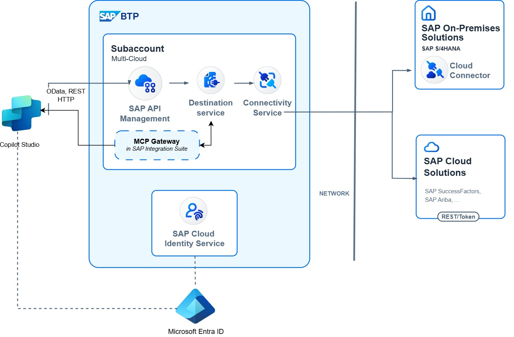
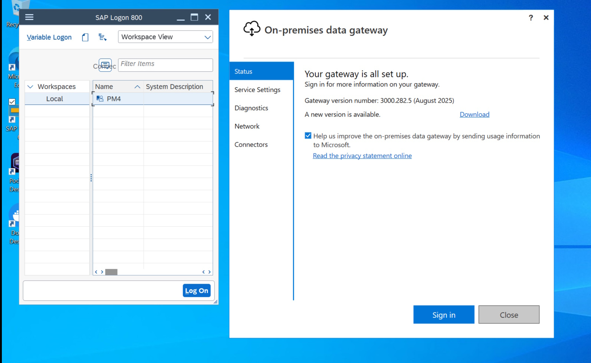
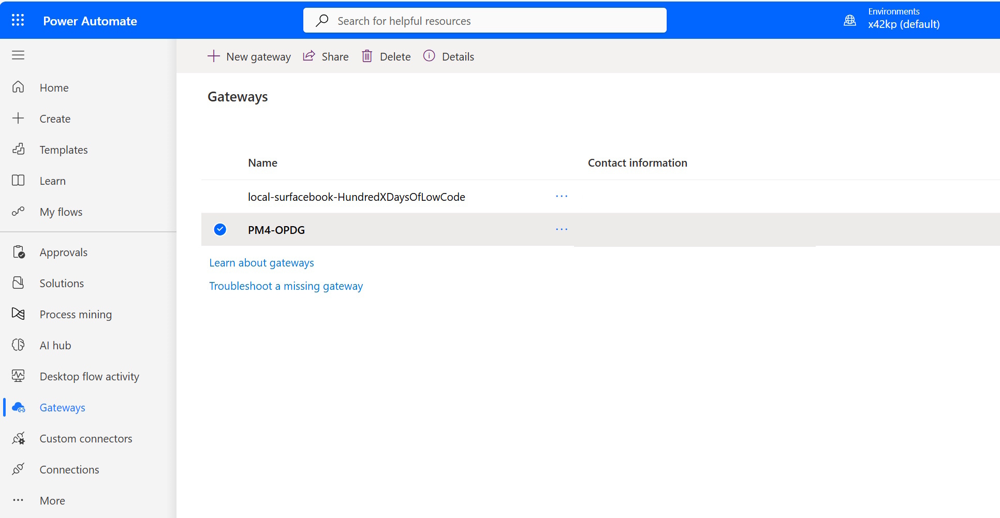
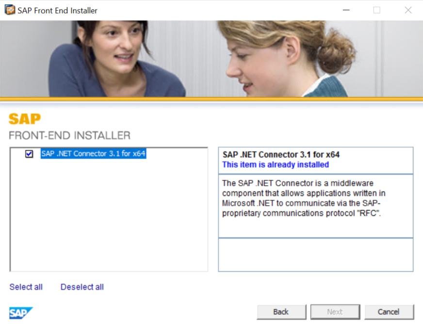
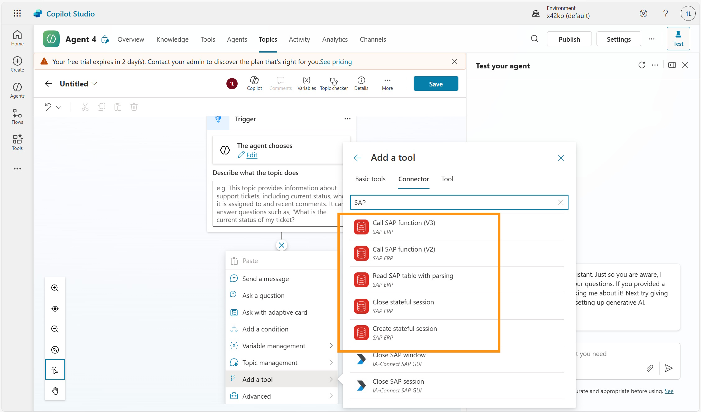
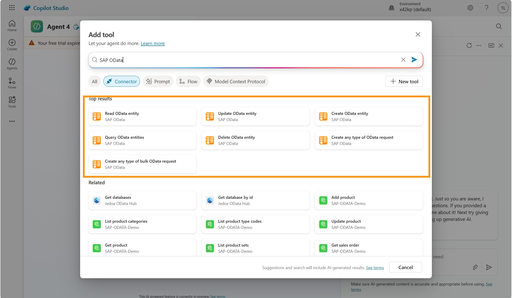

# Leverage on-premises data gateway with access to BAPI / RFCs and OData services

> [!Important]
> When consuming SAP APIs and interfaces, always ensure your usage complies with [SAP's API Policy](https://help.sap.com/doc/sap-api-policy/latest/en-US/API_Policy_latest.pdf). Please check with your SAP contact or account team if you have questions about permitted API usage in your specific scenario.

## Why would you use this scenario?
Many customers come from the Power Platform and SAP integration and have already created Power BI Reports, Power Apps and Power Automate flows connecting to SAP systems. 

Often BAPIs and RFC are used to fetch and update information in the SAP system. In order to do that, the on-premises data gateway together with the SAP .NET Connector have to be used. 

Similar like the SAP Cloud Connector, the on-premises data gateway enables the access to the SAP system from Power Platform and Copilot Studio, even if there are firewalls in place. 

This setup can be used if you want to connect to BAPIs/RFC or are also using other SAP integration from the Power Platform. 

## Setup and configuration
To enable access to the SAP backend system, the on-premises data gateway has to be installed on a Windows server, which has access to your SAP system. This could be your client on which also the SAP GUI is running (which isn't recommended for a production use) or a dedicated machine that is connected to the SAP system.

During the installation you have to log in with a user from your Power Platform environment to establish the trust and connection with this environment. Afterwards the gateway and connection status can be seen in your environment. 

In addition to the on-premises data gateway, the SAP .NET Connector has to be installed as well, if you want to integrate with BAPIs and RFCs. The SAP .NET Connector translates the incoming HTTP requests in the DIAG protocol used by SAPs proprietary APIs. 

* [Download on-premises data Gateway](https://www.microsoft.com/en-us/download/details.aspx?id=53127&msockid=08f9467b101a6a152949535411a26b2f) 

### Agent and Copilot development 
For this setup, Copilot agents are most likely developed using Copilot Studio, which has access not only to the on-premises data gateway, but also comes with several SAP ERP Connectors, that provide access to the BAPIs and RFCs exposed by the SAP System. 

> [!Note]
> Although we see SAP and the on-premises data gateway mainly used for BAPI and RFCs, you can also use it to expose SAP OData services.  

### Authentication
With BAPIs and RFC an authentication using Kerberos and X.509 certificates is possible. This enables users to authenticate to  Copilot Studio with their "normal" Entra-ID credentials and then access their SAP system with the propagated user credentials. 

* [Set up Microsoft Entra ID with Kerberos for SSO](/power-platform/sap/connect/entra-id-kerberos)
* [Set up Microsoft Entra ID with certificates for SSO](/power-platform/sap/connect/entra-id-certs)

### Integration and connectivity infrastructure
Typically SAP systems have already plenty of BAPIs and RFCs enabled by default. You can test the APIs using transaction SE37 in the SAP GUI. No other exposure is typically required.  

### Proxy / connectivity
As outlined above the on-premises data gateway together with the SAP .NET Connector have to be configured and the gateway has to be connected to the correct region and environment in the Power Platform. 

### Backend systems and data sources
Since BAPIs & RFCs have been around for a long time, almost all SAP ERP systems can be connected. 
Non "classic" SAP systems, like SAP SuccessFactors, SAP Ariba, SAP Concur and also newer system like SAP S/4HANA Public Cloud don't support BAPIs and RFCs. For these systems SAP OData services or other REST based integrations are more suitable. 

