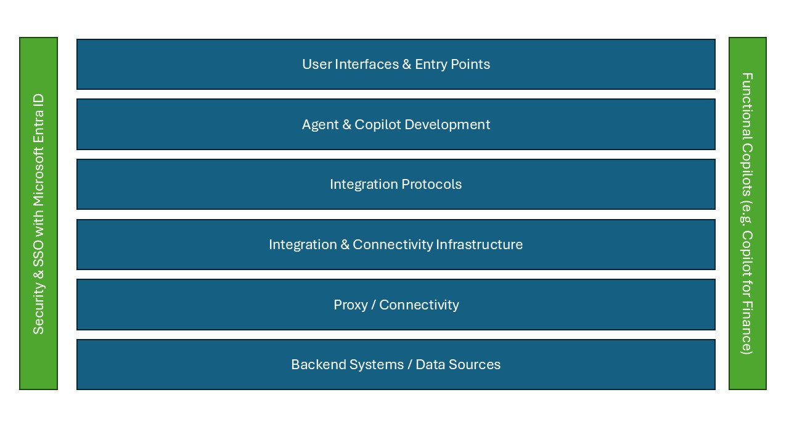
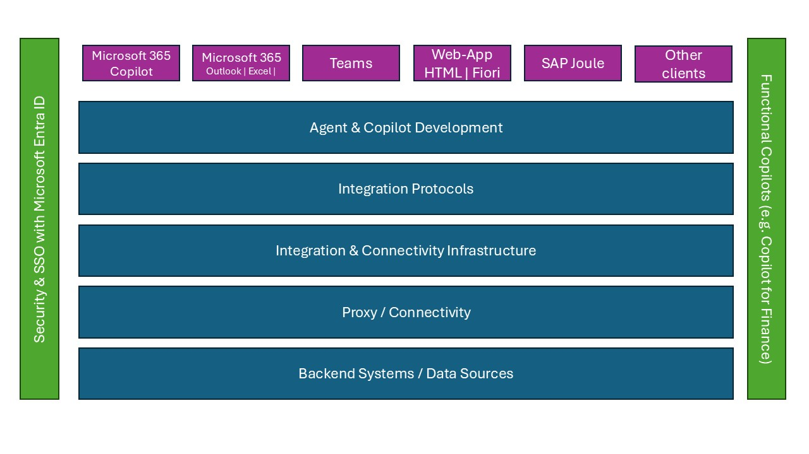
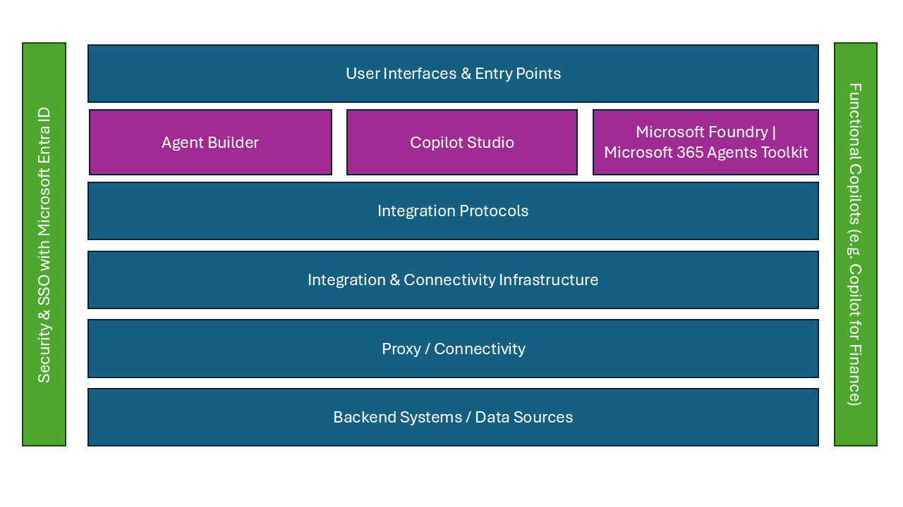
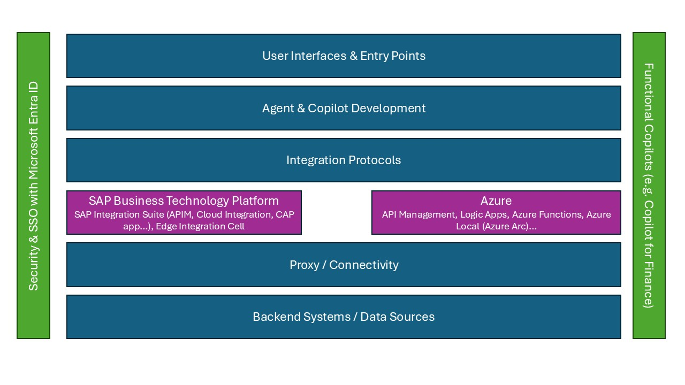
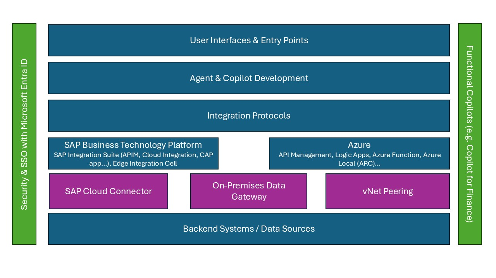

# Copilot Studio with SAP

> [!IMPORTANT]
> When you're consuming SAP APIs and interfaces, always ensure that your usage complies with [SAP's API policy](https://help.sap.com/doc/sap-api-policy/latest/en-US/API_Policy_latest.pdf). If you have questions about permitted API usage in your specific scenario, check with your SAP contact or account team.

Developing Microsoft Copilot agents with SAP data depends on the infrastructure, architecture, and components that are available in your landscape. This article provides an overview on:

* What options are available.
* Why you would choose one option over another.
* How you can start implementing these integrations.

## Considerations for building an agent

With such a wide range of available tools and frameworks, deciding which ones to use can be challenging. The following considerations can help you identify the right choices for your scenario:

* For business users who have little or no software development experience, Agent Builder in Microsoft 365 Copilot Chat provides a way to create simple declarative agents that automate everyday tasks. This approach can empower users across an organization to benefit from AI agents with minimal impact on IT.
* If business users have sufficient technical skills to build low-code solutions by using Microsoft Power Platform technologies, Copilot Studio enables them to combine those skills with their business domain knowledge and build agent solutions. These solutions can extend the capabilities of Microsoft 365 Copilot or add agentic functionality to common channels like Microsoft Teams, Slack, or Messenger.
* When an organization needs more complex extensions to Microsoft 365 Copilot capabilities, professional developers can use the Microsoft 365 Agents SDK to build agents that target the same channels as Copilot Studio.
* To develop agentic solutions that use Azure back-end services with a wide choice of models, custom storage and search services, and integration with Microsoft Foundry Tools, professional developers should use Foundry Agent Service.
* Developers can use the Microsoft Agent Framework to develop single, standalone agents or build multi-agent solutions that use various orchestration patterns.

## High-level architecture

When you're building Copilot agents (whether they're integrated in Microsoft 365 Copilot or autonomous agents) for SAP, there are multiple options. On a high level, the agents use the following components:

* User interfaces and entry points
* Agent and Copilot development
* Integration protocols
* Integration and connectivity infrastructure
* Proxy and connectivity
* Back-end systems and data sources

Microsoft and SAP provide a wide range of integration options. The choice of which integration flow to use depends on the approach and available skill set, but also on the existing setup that you have in place:

* Are you using SAP Business Technology Platform?
* Do you use Azure Integration Services?
* Is your SAP system already running on Azure?

These questions and others can influence the recommended integration architecture.

### User interfaces and entry points

Although the adoption of autonomous agents is growing, many agents are still accessed by a human and need to appear somewhere. One goal of Copilot agents for SAP is that the user should be able to stay within their flow of work. In many cases, this flow of work is a Microsoft 365 application (such as Outlook, Teams, or Excel). But it can also be another website, a collaboration tool, or (almost) anything else.

#### Microsoft 365 Copilot

For Copilot, the [Microsoft 365 Copilot](https://www.microsoft.com/en-us/microsoft-365/copilot) application gives you access to all your Microsoft 365 data and access to your agents.

Another place to use your apps is in the various Microsoft 365 applications. You can open Copilot (and your agents) directly from:

* **Outlook**. For example, you just received an email from a customer who's asking for the latest status of an order.
* **Excel**. For example, you're working on a long list of sales orders and you need to ask your Copilot agent whether there's an update to the status of the orders.

#### Teams

Because a lot of collaboration happens in Microsoft Teams, it's important to highlight that Copilot agents can also run in Teams. You can add them to ongoing conversations and meetings, and you can interact with them directly. Think of a discussion that you have with your manager and how an agent can help you receive the latest information from your SAP SuccessFactors system about the goals defined there.

#### Websites

Copilot agents can also run on websites. They can help and guide a user on where to go, or provide answers without the need to find the right site. You can also achieve this integration in an SAP Fiori launchpad or in SAP Build Work Zone. Such an agent can help you look up products in your SAP system or help a supplier (in the supplier's portal) check the status of the latest invoice.

#### SAP Joule

SAP and Microsoft offer a dedicated, bidirectional integration of SAP Joule and Microsoft 365 Copilot. Via this integration, Microsoft 365 Copilot can also be integrated within Joule. This integration doesn't currently extend to custom-built agents (like agents built from Copilot Studio), but it allows users to access SAP features directly via an SAP Joule agent.

### Agent and Copilot development

Depending on the skill set and complexity of the Copilot agent that you want to build, Microsoft offers various tools to get you started. They range from no-code tools like Agent Builder to pro-code tools like the Microsoft 365 Agents Toolkit in Visual Studio Code.

#### Agent Builder

Agent Builder is a low-code tool within Microsoft Copilot Studio for creating agents by using natural language or manual configuration. It's designed for business users, IT professionals, and developers alike.

Agent Builder enables the rapid development of agents that can automate workflows, answer questions, and integrate with Microsoft 365 apps and enterprise systems. With built-in support for knowledge sources, templates, and extensibility, it simplifies the creation of customized AI experiences that enhance productivity and streamline business processes.

The use of knowledge sources allows users to enrich the agent with SAP-specific information. In the context of SAP, the focus is on read-only scenarios.

#### Copilot Studio

Microsoft Copilot Studio is a powerful, low-code platform that enables organizations to build, customize, and deploy AI-powered agents tailored to their unique business needs.

Copilot Studio offers seamless integration across Microsoft 365 and a vast library of more than 1,000 prebuilt connectors. These connectors include enterprise systems like SAP, ServiceNow, Salesforce, and Dataverse. With Copilot Studio, users can automate complex workflows, access real-time data, and deliver intelligent, context-aware experiences.

Whether you're streamlining operations, enhancing customer service, or empowering employees with self-service tools, Copilot Studio provides the flexibility and scalability to bring AI into every corner of your business.

#### Microsoft 365 Agents Toolkit

[Microsoft 365 Agents Toolkit](/microsoft-365/developer/overview-m365-agents-toolkit) is a suite of tools for building enterprise-ready agents and apps that work across Microsoft 365 Copilot, Teams, Office, web, and other messaging channels. It's an evolution of Teams Toolkit.

The following table provides an overview of the tools and their features:

| Capability | Agent Builder | Copilot Studio | Foundry |
| --- | --- | --- | --- |
| Knowledge grounding | Built-in retrieval-augmented generation (RAG) tied to enterprise contents (SharePoint, Microsoft 365 documents, and Bing search) | Flexible data connections to organization data (Microsoft 365 and connectors to other enterprise data) | Comprehensive retrieval integration with security, either built in or through own APIs/vector index |
| User interfaces | Microsoft 365 Copilot Chat surfaced with Microsoft 365 Copilot experiences like in Teams | Microsoft 365 Copilot Chat plus embedded in Microsoft 365/custom apps and chat | Bring-your-own-UI next to integration with Microsoft 365 Copilot and Microsoft 365 Apps |
| Foundation models | Built-in large language models (LLMs); same models behind Microsoft 365 Copilot, such as GPT-4 or other managed models | Configurable models (bring-your-own-model through Foundry) plus agent-specific fine-tuning | Maximum model flexibility (Foundry model catalog, custom models, and fine-tuning models) |
| Prebuilt tools | Minimal toolset for RAG from connected knowledge sources | Large tool library through prebuilt connectors to extend agent actions | Extensive and extensible tool integrations (Microsoft tools, connectors to lines of business, and custom) |
| Tool use via Model Context Protocol (MCP) | Not supported for users | Available through Microsoft Marketplace with prebuilt 1P/3P MCP servers | Full MCP support for prebuilt 1P/3P MCP servers and custom MCP servers |
| Memory and learning | Short-term memory within the same chat session | Short-term memory of the session | Extensive stateful short/long-term memory |
| Integrated retrieval | Not persistent across sessions | Extensible with external storage | Integrated retrieval |
| Orchestrator and multi-agent systems | Not supported (only a single standalone agent) | Multi-agent orchestration with an orchestrator pattern plus connected agents | Built-in multi-agent orchestration that supports various conversational patterns |

### Integration protocols

Depending on the kind of back-end system and the available skills, you can connect to your SAP system by using various protocols:

* The OData protocol has become an open standard and is used not only by all SAP Fiori applications, but also across the broader SAP stack (for example, SAP SuccessFactors and SAP Ariba). The latest SAP products (for example, SAP S/4HANA private cloud and public cloud) are supported. Older SAP systems (such as SAP ECC) can expose OData services by using SAP Gateway. Finally, programming models like RAP and CAP make the development of new OData services easier.

* The BAPI and RFC interfaces have been around since the 1990s. SAP teams typically have a lot of knowledge, and thousands of (custom) BAPIs and RFCs are available in customers' SAP systems. Through the use of dedicated connectors, these APIs can still be consumed in Copilot experiences.

* SOAP and other REST services can also expose SAP data and be consumed via the development tools. In some cases, a custom connector can be developed to proxy complex interaction patterns with the SAP system.

* MCP provides a new way to expose APIs in a standardized way. Similar to OData services, any MCP client can consume services exposed as MCP servers.  

#### OData

OData is the main protocol for transactional SAP applications. Applications like SAP Fiori, SAP ECC, SAP S/4HANA, SAP SuccessFactors, SAP Ariba, SAP Concur, and more support OData. The [SAP Business Accelerator Hub](https://api.sap.com/) lists thousands of out-of-the-box OData services. The [SAP Fiori Reference App Library](https://fioriappslibrary.hana.ondemand.com/sap/fix/externalViewer/) shows other OData services that are available and that SAP supports out of the box.

If no out-of-the-box OData service is available, you can create custom [Core Data Services views](https://learning.sap.com/courses/basic-abap-programming/working-with-cds-view_c289f74d-675e-4084-9d90-5635958ec604) (via [RAP](https://pages.community.sap.com/topics/abap/rap) or [CAP](https://developers.sap.com/tutorials/introduction..html)) to expose other OData services.

These OData services can't only be consumed in a Copilot scenario. But due to the standardization, thousands of clients (including Microsoft Excel and Power BI) provide out-of-the-box support to consume OData services.

In addition, OData supports the latest authentication protocols, like OAuth and SAML.

For Copilot scenarios, there's common support across all tools:

* Agent Builder supports OData services via the knowledge source functionality. Users can use SAP systems as a knowledge source.
* Copilot Studio has a dedicated SAP OData connector, which supports all create, read, update, and delete (CRUD) operations that the underlying SAP OData services support. Detailed documentation about implementing single sign-on and principal propagation to multiple SAP systems is also available.
* Microsoft Foundry supports OData services both via a low-code connector and via pro-code development extensions.
* Through the Agents Toolkit, developers can use multiple libraries to connect to OData services.

#### BAPI and RFC

Copilot Studio provides a proven [SAP ERP connector](/power-platform/sap/roles-guidance/power-platform-app-maker#using-sap-rfcs-and-bapis) for BAPIs and RFCs. Users can use it to connect to older systems. Support uses the on-premises data gateway (OPDG) together with [SAP Connector for Microsoft .NET](https://support.sap.com/en/product/connectors/msnet.html), which has to be downloaded with an S-User.  

The SAP ERP connector in Copilot Studio also supports single sign-on and principal propagation via Kerberos and X.509 certificates.

#### HTTP (SOAP and REST)

Many older or acquired SAP systems support SOAP and REST services. These protocols are supported via an HTTP connector or a custom connector in Copilot Studio. Other HTTP and HTTPS protocols are also supported via these connectors.

For pro-code integrations via Foundry or the Agents Toolkit, you can make HTTP or HTTPS calls via commonly available packages.

#### Automation with SAP GUI in Power Automate Desktop

You can use Power Automate Desktop to build end-to-end automation that ranges from simple to highly sophisticated. For more information, see [Use low-code RPA with SAP GUI in Power Automate Desktop](/power-automate/guidance/rpa-sap-playbook/action-based-sap-gui-automation-manually-overview).

#### MCP

MCP, the [Model Context Protocol](https://github.com/modelcontextprotocol), is an open protocol that enables seamless integration between LLM applications (like Copilot) and external data sources and tools. In contrast to the simple API-based integration mentioned earlier, an MCP-based integration enables the Copilot to identify and create the required payload to retrieve data from the SAP system in a dynamic and efficient way.

Hundreds of open-source MCP servers are already available. The [Azure MCP registry](https://mcp.azure.com/) provides a list of curated MCP servers and offers customers the possibility of creating their own in-house MCP servers. You can use tools like [Azure API Management](/azure/api-management/export-rest-mcp-server) to create new MCP servers from existing APIs.

### Integration and connectivity infrastructure

Whether customers want to have one single point of entry or control access to the back-end system, they can use an integration and connectivity layer to route the calls from Copilot to the SAP back-end system.

SAP Business Technology Platform and Azure Integration Services are two common components in these integrations.

#### SAP Business Technology Platform

Many customers already have services like SAP API Management or SAP Integration Suite as part of SAP Business Technology Platform. SAP Business Technology Platform is then often already connected to SAP back-end systems, which simplifies the connection from Copilot to SAP.

All Copilot tools can use APIs that are exposed via SAP Business Technology Platform. When you use [SAP Cloud Connector](#sap-cloud-connector), even SAP systems behind firewalls can be accessed in a secure way. By using tools like SAP API Management, you can use other features like throttling or quota handling, or you can perform authentication steps.  

#### Azure Integration Services

Azure provides several tools to integrate with back-end systems like SAP. Most prominent in the Copilot Studio scenario are Azure API Management and Azure Logic Apps. Both provide a way to connect to APIs (in the case of Logic Apps, both HTTPs and BAPIs) and control access to the SAP system.

If your SAP system is also running on Azure, you can further secure the connectivity by using virtual network peering.

### Proxies and connectivity

In many cases, a firewall helps protect the SAP system. With a firewall in place, access from the internet (for example, from Microsoft 365 Copilot) isn't possible directly. Instead, you need to install a proxy.

#### SAP Cloud Connector

For many SAP customers, SAP Business Technology Platform with either SAP Integration Suite or a simple app router is already in place. In this case, SAP Cloud Connector is probably used to bridge the firewall protection and connect to the SAP system (either on-premises or in a cloud).

#### On-premises data gateway

The on-premises data gateway (OPDG) has been around for many years, mainly in the context of Power Platform. You can use the OPDG to bridge the firewall protection and to translate the SAP DIAG protocol used by BAPIs and RFCs into HTTP calls that Copilot Studio and Power Platform can use.

If you want to use BAPIs or RFCs, you have to install the OPDG along with SAP Connector for Microsoft .NET. (An SAP user ID is required.) You can then access the SAP system behind a firewall and use BAPIs or RFCs in your system.

If you want to connect to OData services behind a firewall, you can use the OPDG (like SAP Cloud Connector) to do that.

#### Virtual network peering

If you're running your SAP system on Azure (either native or on RISE), you can also benefit from peering your virtual networks with Azure. This peering allows Azure API Management to access the SAP system without the need for an extra proxy like SAP Cloud Connector or the OPDG. The SAP system doesn't have to expose any IP to the internet, but Azure API Management (or other Azure services) can access the SAP system via internal IPs.

This setup not only provides the best security, but also reduces the number of hops and latency.

### Back-end systems and data sources

The tools and protocols mentioned earlier are indifferent to the back-end system. The integration of Copilot with SAP ranges from SAP S/4HANA public cloud systems (using OData) to old SAP R/3 systems that can expose their data via either RFC/BAPI or a standalone SAP Gateway that exposes an OData service.

Authentication options vary, depending on the protocol and application. Here's an overview of integration options:

| Application | Potential protocols | Authentication |
| --- | --- | --- |
| R/3, SAP ECC | BAPI/RFC | SAP UID, Kerberos |
| S/4HANA on-premises, native, private cloud | BAPI/RFC, OData | SAP UID, Kerberos |
| S/4HANA public cloud | OData | OAuth |
| SAP SuccessFactors | OData, HTTPS | OAuth |

## Recommended integration patterns

The following list provides an overview of reference architectures. There isn't only one architecture, because it depends on your existing infrastructure and what components you're using. In the simplest form (for a first percentage of completion), you can use Copilot Studio and the SAP OData connector to connect directly to your SAP system in the cloud ([Option #1](https://github.com/MicrosoftDocs/azure-docs-pr/compare/architecture-demo.md?expand=1).

* Are you running your SAP system on Azure and RISE? Do you have a good in-house Azure practice? See [Azure API Management and virtual network peering](architecture-apim-virtual-network.md).
* Do you want to use BAPI or RFC? See [On-premises data gateway with access to BAPIs, RFCs, and OData services](architecture-on-premises-data-gateway.md).
* Are you already using SAP Business Technology Platform, and have you  connected your SAP back-end system to it? See [SAP Business Technology Platform with SAP API Management and SAP Cloud Connector](architecture-business-technology-platform-api.md).
