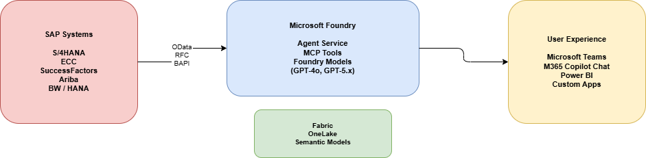

# Foundry AI and SAP overview

> [!IMPORTANT]
> When you're consuming SAP APIs and interfaces, always ensure that your usage complies with [SAP's API policy](https://help.sap.com/doc/sap-api-policy/latest/en-US/API_Policy_latest.pdf). If you have questions about permitted API usage in your specific scenario, check with your SAP contact or account team.

SAP systems are the operational backbone of many enterprises. Organizations use them for managing financials, supply chain, procurement, HR, and more. With Microsoft Foundry, organizations can transform these systems of record into AI-powered systems of intelligence by building enterprise-grade agents that reason over SAP data and take action across business processes.

This article covers how Foundry and the broader Microsoft AI stack integrate with SAP to enable agentic AI scenarios.

## AI innovation layers for SAP

Microsoft offers three complementary layers for bringing AI to SAP environments:

| Layer | What it provides | Tools |
| --- | --- | --- |
| Use out of the box | Prebuilt AI experiences across SAP and Microsoft apps | Joule (SAP), Microsoft 365 Copilot |
| Extend with custom agents | Company-specific agents with low-code or pro-code development | Microsoft Copilot Studio, Microsoft 365 Agents SDK |
| Build enterprise AI solutions | Full AI platform for advanced agents, custom models, and orchestration | Foundry, Copilot Studio |

These layers aren't mutually exclusive. Most organizations use a combination, depending on the business process and complexity involved.

## Integration patterns

There are three primary patterns for connecting AI agents to SAP data, as described in the following sections.

You can combine these patterns. For example, an agent might use direct API calls for real-time purchase order (PO) status checks, a Microsoft Fabric data agent for spend analysis dashboards, and Model Context Protocol (MCP) tools for multistep approval workflows. Such an agent can do all of these things within the same Copilot experience.

### Direct API consumption

The Copilot Studio or Foundry agent calls SAP OData or REST APIs in real time via HTTP connectors or plugins. The response is displayed in Microsoft Teams or Copilot.

- **Best for:** Simple lookups, transactional queries, real-time status checks.
- **Pros:** Real-time data, simple setup, no data pipeline needed.
- **Cons:** Limited to what the API exposes; not ideal for complex analytics or historical comparisons.

### Data lake and semantic model

SAP data is extracted into Microsoft Fabric (Fabric pipeline or Dataflow Gen2) and a lakehouse. The data is modeled as a semantic model. Copilot agents consume the data via Fabric data agents.

- **Best for:** Complex analytics, historical trends, cross-source reporting, dashboards.
- **Pros:** Rich analytics, governed data, combination of SAP with non-SAP sources, support for Power BI dashboards.
- **Cons:** Not real time (batch/scheduled), requires Fabric setup.

### MCP tools

Agents connect to SAP back ends via MCP protocol (JSON-RPC 2.0), MCP servers (for example, a FastAPI back end), and SAP APIs (OData, RFC, BAPI). MCP servers are lightweight tool endpoints that expose SAP functions as callable tools for AI agents.

- **Best for:** Multistep workflows, combining multiple SAP operations in one agent, agentic scenarios.
- **Pros:** Flexibility, support for complex orchestration, natural language interaction with SAP.
- **Cons:** Requires building and hosting MCP server endpoints.

## Agent scenarios for SAP

### Finance: Record to report

A CFO financial assistant that queries SAP financial data and triggers actions:

- Query general ledger (GL) accounts, cost centers, and profit centers by using natural language.
- Detect duplicate transactions across fiscal periods.
- Analyze variance reports and profitability.
- Trigger approval workflows and notify finance teams via Microsoft Teams.
- Post accounting documents via BAPIs (`BAPI_ACC_DOCUMENT_POST`, `BAPI_ACC_DOCUMENT_CHECK`).

### Procurement: Procure to pay

Agents that provide procurement insights and streamline purchasing workflows:

- Query SAP Ariba operational reporting APIs for purchase requisitions.
- Analyze spend by supplier, category, and region.
- Monitor purchase order (PO) status, pending approvals, and supplier payments.
- Combine Ariba data with S/4HANA procurement data in Fabric for unified spend analysis.

### HR: Hire to retire

SAP SuccessFactors integration for employee self-service and HR operations:

- Query Employee Central data (background, work history, team info).
- Create and manage Family and Medical Leave Act (FMLA) requests.
- Surface leave summaries and balances in natural language.
- Integrate with the Microsoft 365 Copilot Employee Self-Service agent.

### SAP Center of Expertise assistant

A multifunction agent for SAP operations and development teams:

- Explain ABAP code snippets.
- Check stock levels and compare inventory across plants.
- Query customer balances and outstanding amounts.
- Combine finance, procurement, and technical SAP functions in a single agent.

### Finance shared services

AI-enabled process automation for complex financial accounting workflows:

- Conduct monthly accruals posting, bank reconciliation, and intercompany settlement.
- Execute AI-driven procedures to replace manual job sheets.
- Conduct multi-agent orchestration: SAP agent, per-to-peer agent, data agent, and finance expert agent.
- Integrate with SAP BAPIs for document posting and workflow completion.

## Multi-agent orchestration

A key pattern emerging from enterprise deployments is *multi-agent orchestration*. In that process, Microsoft 365 Copilot acts as the front end and orchestrates multiple specialized agents:

| Agent | Role |
| --- | --- |
| SAP agent | Transactional access to SAP systems (OData, RFCs, BAPIs) |
| Fabric data agent | Analytical data from semantic models in Fabric |
| Microsoft 365 agent | Access to emails, chats, documents, and calendar |
| Custom agents | ServiceNow, Salesforce, Workday, or any other system |

Users interact through a single natural language interface in Teams or Microsoft 365 Copilot Chat. The orchestrator routes requests to the appropriate agent.

## Architecture and data flow

A typical architecture that combines Foundry and SAP uses multiple data paths.

### SAP data sources

| Source type | Examples |
| --- | --- |
| Core Data Services (CDS) views | CDS views that expose SAP business data |
| OData APIs | S/4HANA, SuccessFactors, Ariba REST/OData services |
| Tables | MARA, VBAK, BKPF, Z-tables via SAP Table connector |
| BAPIs/RFCs | Function modules for transactional operations |
| Raw files | PDF, XML, Excel, text documents from SAP systems |

### Business Process Solutions

Microsoft provides prebuilt data templates for common SAP business processes through Business Process Solutions (BPS):

| Process | Scope |
| --- | --- |
| Finance (record to report) | Trial balance, year-to-date financial statements, profitability analysis, accounts payable (AP) aging, accounts receivable (AR) aging |
| Procurement (procure to pay) | Spend analysis (360 view, trends, category analysis, tail spend) |
| Sales (order to cash) | Opportunity overview, pipeline health, revenue insights |

Data templates for manufacturing and supply-chain processes are in the planning stage.

BPS provides prebuilt data mappings from SAP and non-SAP systems. These mappings are integrated with Fabric open mirroring for data acquisition. BPS also provides prebuilt Power BI dashboards to deliver consistent, accurate business data to Copilot agents.

## Governance and security

Foundry includes a control plane for governing the full AI lifecycle:

- **Observability**. Complete signals-management layer for monitoring agent performance and behavior.
- **Controls**. Content safety filters, prompt injection protection, grounding validation.
- **Evaluations**. Continuous, fleet-wide governance with automated quality checks.
- **Security**. Enterprise-grade compliance with Microsoft Security integrations, role-based access, and data privacy controls.

## Links and resources

- [Microsoft Foundry](https://ai.azure.com/)
- [Copilot Studio](https://www.microsoft.com/en-us/microsoft-copilot/microsoft-copilot-studio)
- [Business Process Solutions in Fabric](/azure/sap/business-process-solutions/about-business-process-solutions)
- [Model Context Protocol (MCP)](https://modelcontextprotocol.io/)
- [Employee Self-Service agent](/microsoft-365/copilot/employee-self-service/overview)
- [Integrate SuccessFactors with Employee Self-Service](/microsoft-365/copilot/employee-self-service/sapsuccessfactors)
