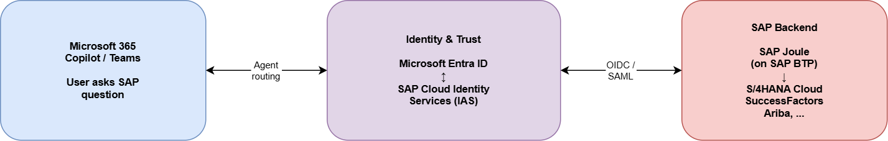

# Joule and Microsoft 365 Copilot integration

SAP Joule and Microsoft 365 Copilot provide a bidirectional integration. Users can access SAP capabilities directly from within Microsoft 365 Copilot and Microsoft Teams without the need to build a custom agent. This article covers what the integration does, how to set it up, and how to troubleshoot it.

> [!NOTE]
> This integration is a managed SAP and Microsoft feature. It's different from building custom Copilot agents (by using Copilot Studio or Microsoft Foundry) that access SAP data. For custom agent scenarios, see [Copilots with SAP](../copilot-studio/copilot-with-sap-overview.md).

## What is the Joule and Copilot integration?

The integration brings SAP's digital assistant, Joule, into the Microsoft 365 Copilot experience. Through this integration:

- *Users in Microsoft 365 Copilot or Teams* can ask SAP-related questions (for example "@Joule Show me open purchase orders that are past their expected delivery dates"). The request is routed to SAP Joule for processing.
- *Users in SAP Joule* can use Microsoft 365 context when using Joule (for example, "Find all 2026 emails from Fabrikam, Inc.").

The integration is based on a trust relationship between SAP Cloud Identity Services and Microsoft Entra ID. SAP handles the natural language processing for SAP-specific tasks. Microsoft handles the Copilot or Teams user experience.

## Key scenarios and use cases

| Scenario | Example |
| --- | --- |
| HR self-service | Copilot: "@Joule What is my remaining leave balance?"   The question is routed to Joule and answered from SAP SuccessFactors. |
| Procurement | Copilot: "@Joule What is the estimated delivery date for PO 4500005674?"   Joule retrieves data from SAP S/4HANA Cloud. |
| Finance | Copilot: "@Joule What is the status of invoice 4500001234?"   The question is answered from SAP S/4HANA Cloud. |
| Sales | Joule: "Find emails for product Rocket8000 from Wily@fabrikam.com." |
| Finance | Joule: "Find all emails from customers about late payments." |
| Supply chain | Joule: "Find Teams chats about inbound delivery delays to plant 2300 related to the recent hurricane." |

> [!IMPORTANT]
> The integration currently supports standard scenarios provided by SAP Joule and Microsoft 365 Copilot. It doesn't extend to custom-built agents (for example, agents built in Copilot Studio).

## Supported SAP applications

The following SAP applications support the Joule integration with Microsoft 365 Copilot. Check [SAP's documentation](https://help.sap.com/docs/joule/integrating-joule-with-sap/integrating-joule-with-microsoft-365-copilot) for the latest list.

- SAP S/4HANA Cloud, private cloud edition
- SAP S/4HANA Cloud, public edition
- SAP SuccessFactors
- SAP Ariba (selected scenarios)
- Other SAP cloud applications that Joule supports

## Prerequisites

Before you set up the integration, ensure that you have:

- A Microsoft 365 Copilot license for users and the corresponding SAP licenses for Joule.
- A SAP Business Technology Platform (BTP) account with Identity Authentication Service (IAS) in SAP Cloud Identity Services configured.
- SAP Joule enabled for your SAP applications.
- A Microsoft Entra ID tenant with admin access.
- Network connectivity between SAP BTP and Microsoft Entra ID (typically over the internet).

## Architecture overview

The integration follows a trust-based architecture.

### Key components

- **Microsoft Entra ID**. Authenticates the Microsoft 365 user and establishes trust with SAP Cloud Identity Services.
- **SAP Cloud Identity Services (IAS)**. Acts as the identity proxy on the SAP side. It maps the Microsoft user to an SAP user.
- **SAP Joule (on BTP)**. As the user interface, routes the user request to Copilot and receives the result back in Joule.
- **Microsoft 365 Copilot or Teams**. As the user interface, routes SAP-related requests (by using the prompt tag "@Joule") to the Joule agent and receives the result back in Copilot.

### Identity flow

1. The user asks an SAP-related question in Microsoft 365 Copilot or Teams by using the "@Joule" tag (for example, "@Joule Show me open sales orders for Fabrikam, Inc.").
2. The user's identity is federated from Microsoft Entra ID and SAP Cloud Identity Services.
3. SAP Cloud Identity Services maps the user to the corresponding SAP user.
4. Joule processes the request against the SAP back-end application.
5. The response is returned to the user in Copilot or Teams.

## Setup and configuration

### Step 1: Configure SAP Cloud Identity Services

1. Set up SAP Cloud Identity Services (IAS) as the identity provider for your SAP BTP subaccount.
2. Establish a trust relationship between SAP IAS and Microsoft Entra ID.
3. Configure user mapping (Microsoft Entra ID user to SAP user).

For a detailed guide, see [Configuring SAP Cloud Identity Services and Microsoft Entra ID for Joule](https://community.sap.com/t5/technology-blog-posts-by-sap/configuring-sap-cloud-identity-services-and-microsoft-entra-id-for-joule/ba-p/14105743).

### Step 2: Configure Microsoft Entra ID

1. Register the SAP Joule application in Microsoft Entra ID.
2. Configure the necessary API permissions and consent.
3. Set up the enterprise application for single sign-on.

### Step 3: Enable Joule Agent in Copilot or Teams

1. Enable the Joule agent in the Microsoft 365 admin center or Teams admin center.
2. Assign the agent to the relevant users or groups.
3. Test the integration by asking an SAP-related question in Copilot or Teams.

For a detailed guide, see [Enable Microsoft Copilot and Teams to Pass Requests to Joule](https://community.sap.com/t5/technology-blog-posts-by-sap/enable-microsoft-copilot-and-teams-to-pass-requests-to-joule/ba-p/14109137).

For an end-to-end walkthrough, see [SAP Discovery Center Mission: Integrate Joule and Microsoft 365 Copilot](https://discovery-center.cloud.sap/missiondetail/4741/5025/).

## Limitations and known issues

- The integration is limited to *SAP Joule's built-in capabilities*. Custom skills or agents built in Copilot Studio aren't routed through this integration. For a full list, check out the [SAP Joule capabilities](https://help.sap.com/doc/1b82af8383e2443eaa95a034a70beb1b/CLOUD/en-US/c0bb884c3e27438695f4750b547aac77.pdf).
- User mapping between Microsoft Entra ID and SAP must be correctly configured. Mismatches cause authentication errors.
- Accessible Joule capabilities depend on the SAP applications and Joule skills enabled in your landscape.

For the latest known issues and fixes, check [SAP Note 3722273](https://me.sap.com/notes/3722273).

To troubleshoot your configuration, run the [Joule-Copilot Integration Validation Tool](https://github.com/microsoft/joule-copilot-integration-validation-tool).

## Troubleshooting

| Symptom | Possible cause | Resolution |
| --- | --- | --- |
| Joule agent not visible in Copilot/Teams | Agent not enabled in admin center | Enable via Microsoft 365 or Teams admin center |
| Authentication error when routing to Joule | Trust relationship misconfigured | Verify trust and user mapping between IAS and Entra ID |
| "No SAP data found" response | User not mapped to SAP user | Check user provisioning in SAP Cloud Identity Services |
| Timeout or no response | Network/connectivity issue | Check BTP connectivity and service health |

For more information, see the SAP troubleshooting guide: [Joule: Monitoring and Troubleshooting](http://help.sap.com/docs/joule/serviceguide/troubleshooting).

## Related content

- [Integrating Joule with Microsoft 365 Copilot](https://help.sap.com/docs/joule/integrating-joule-with-sap/integrating-joule-with-microsoft-365-copilot) (official documentation)
- [Configuring SAP Cloud Identity Services and Microsoft Entra ID for Joule](https://community.sap.com/t5/technology-blog-posts-by-sap/configuring-sap-cloud-identity-services-and-microsoft-entra-id-for-joule/ba-p/14105743) (blog post)
- [Enable Microsoft Copilot and Teams to Pass Requests to Joule](https://community.sap.com/t5/technology-blog-posts-by-sap/enable-microsoft-copilot-and-teams-to-pass-requests-to-joule/ba-p/14109137) (blog post)
- [SAP Discovery Center: Integrate Joule and Microsoft 365 Copilot](https://discovery-center.cloud.sap/missiondetail/4741/5025/)
- [SAP Note 3722273: Joule and MS Copilot Integration](https://me.sap.com/notes/3722273)
- [Joule: Monitoring and Troubleshooting](http://help.sap.com/docs/joule/serviceguide/troubleshooting)
