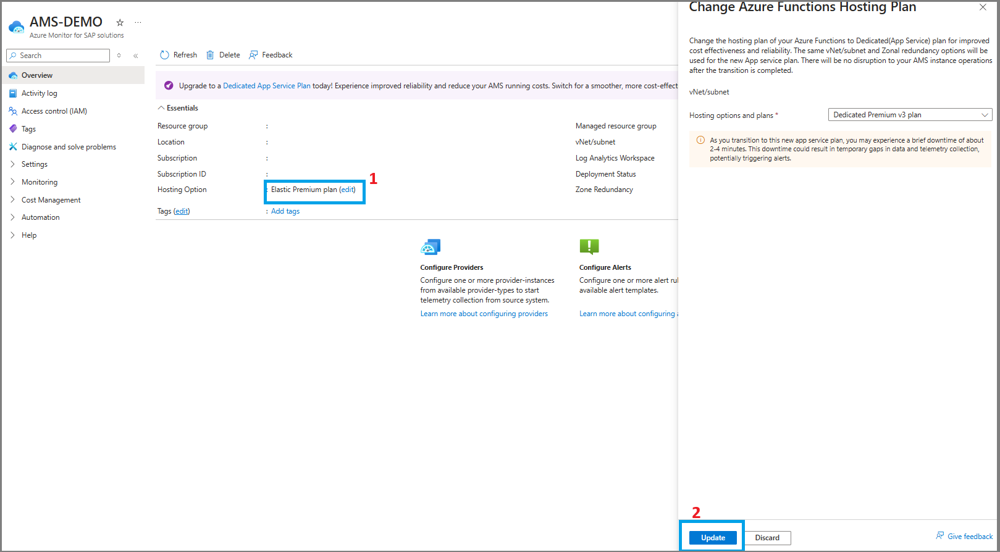
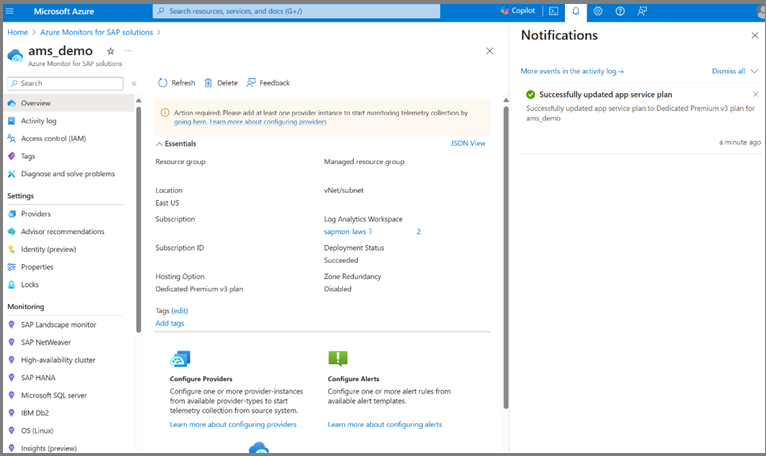

# Enable Dedicated Hosting Plan

One of the features of Azure Monitor for SAP solutions is that it uses an Azure function to collect and process the data from your SAP systems. The service deploys and manages the Azure function, so you don't need to configure or maintain it. However, you may want to optimize the cost and reliability of the Azure function based on your monitoring needs and usage patterns. 

This new feature allows you to switch the hosting plan of the Azure function that is used inside of Azure Monitor for SAP solutions. With this feature, you can migrate to the dedicated plan for the Azure functions. The hosting plan of the Azure function determines how the function app is scaled and billed.

The Dedicated hosting plan has a significant improvement in cost and scaling efficiency when used on AMS

## Prerequisites
Ensure there are no locks on monitor subnet's Resource Group

## Steps to enable dedicated hosting plan
1.	Navigate to Overview Section of the AMS monitor. Verify the hosting option is Elastic Premium. Then click on Edit Option.
 

2.	Navigate to the popup that opens click on Update and then Confirm.
 

3.	When deployment succeeds, Hosting plan is updated in overview section.

## Steps to revert to Elastic Plan on unhealthy AMS
If the deployment fails with code FunctionAppRestoreFailed or if restoration to Elastic Premium Plan is needed after multiple failure, then follow the below steps to revert to Elastic Premium Plan.
### Prerequisite
Ensure the storage account has public network access:
1. Go to the storage account in the AMS managed resource group.
2. Go to the security and networking tab, then click on the networking tab.
3. Go to the public network access, ensure the 'enabled from all networks' option is selected.
### Steps to follow:
1.	[Install Azure CLI](https://go.microsoft.com/fwlink/?linkid=2297461).
2.	Set the subscription by running `az account set --subscription "<Subscription Name>"` 
3.	To install Workloads CLI extension, run `az extension add --name workloads` 
5.	Execute az monitor create with required properties as per your AMS.\
`az workloads monitor create -g <rg-name> -n <ams_name> -l <location> --app-location <app-location> --managed-rg-name <managed_rg_name> --monitor-subnet <subnet_arm_id> --routing-preference <routing_preference> --identity type=None`
6.	Monitor is restored once operation completes.

