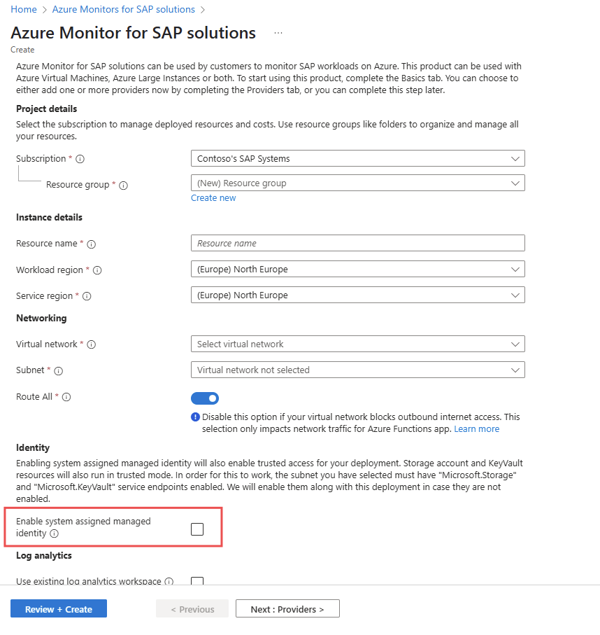

# Enabling private endpoints for AMS resources
One of the challenges for customers is that the key vault and storage account that are created as part of the Azure Monitor for SAP solutions Managed Resource Group have their public access enabled. Customers want to disable this public access to be security compliant, but blocking the public access on these resources can lead to functional issues within AMS.
With this feature, you can use the system-assigned identity of the Azure Monitor for SAP solutions resource and our service will use trusted access mode to interact with the key vault and storage account. Using this feature, you can then block public access and only allow traffic from AMS subnet on your key vault and storage account in AMS managed resource group.
This feature provides more security and control over your AMS resources, as you can limit the access to the key vault and storage account to the AMS service and subnet only and prevent any unauthorized or malicious access from outside.

## Prerequisites and steps to enable trusted access using System Assigned Managed Identity
To use the trusted access using MSI feature, you need to meet the following prerequisites and follow the steps below:
* Migrate to Dedicated app service plan: [Follow steps here](https://go.microsoft.com/fwlink/?linkid=2306196)
> [!Note]
> Migrating to dedicated app service plan is a mandatory step to avoid having function app scaling issues after storage account's public access is disabled.

> [!Important]
> Trusted access feature is supported only if the "ROUTE ALL" is enabled during the monitor creation.

## Steps to follow while creating new AMS
1. Log in to the Azure portal and create a new Azure Monitor for SAP solutions resource.
2. Fill in the required fields, such as the name, description, etc.
3. Under the Networking section, have the 'Route all' option enabled.
4. Under the Identity section, select Enable System Assigned Managed Identity.

5. Click on Save to create the monitor instance.
6. Create all the providers that are needed.

## Steps to follow for existing AMS
1. Log in to the Azure portal and navigate to your Azure Monitor for SAP solutions resource.
2. Migrate to Dedicated app service plan: [Follow steps here](https://go.microsoft.com/fwlink/?linkid=2306196)
3. Go to the identity tab and enable the system assigned identity and wait for the operation to complete and monitor should be in succeeded state after the operation.

## Disable Identity on existing AMS
* Go to Identity tab for AMS and disable the identity and save.
