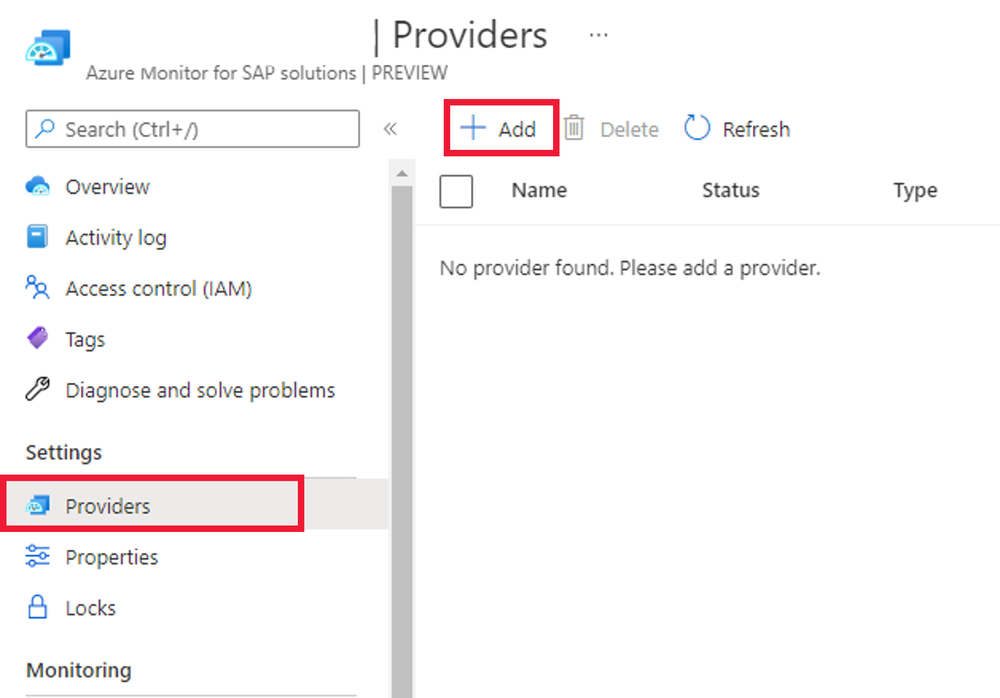
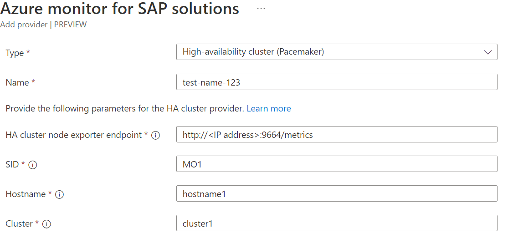

# Create high-availability cluster provider for Azure Monitor for SAP solutions

In this how-to guide, you learn how to create a high-availability (HA) Pacemaker cluster provider for Azure Monitor for SAP solutions. You install the HA agent and then create the provider for Azure Monitor for SAP solutions.

## Prerequisites

- An Azure subscription.
- An existing Azure Monitor for SAP solutions resource. To create an Azure Monitor for SAP solutions resource, see the [quickstart for the Azure portal](quickstart-portal.md) or the [quickstart for PowerShell](quickstart-powershell.md).

## Install an HA agent

Before you add providers for HA (Pacemaker) clusters, install the appropriate agent for your environment in each cluster node.

For SUSE-based clusters, install **ha_cluster_provider** in each node. For more information, see the [HA cluster exporter installation guide](https://github.com/ClusterLabs/ha_cluster_exporter#installation). Supported SUSE versions include SLES for SAP 12 SP3 and later versions.

For RHEL-based clusters, install **performance co-pilot (PCP)** and the **pcp-pmda-hacluster** subpackage in each node. For more information, see the [PCP HACLUSTER agent installation guide](https://access.redhat.com/articles/6139852). Supported RHEL versions include 8.2, 8.4, and later versions.

For RHEL-based Pacemaker clusters, also install [PMProxy](https://access.redhat.com/articles/6139852) in each node.

### Install an HA cluster exporter on RHEL

1. Install the required packages on the system.

    ```bash
    yum install pcp pcp-pmda-hacluster
    ```

1. Enable and start the required PCP Collector Services.

    ```bash
    systemctl enable pmcd
    ```

    ```bash
    systemctl start pmcd
    ```

1. Install and enable the HA cluster PMDA. Replace `$PCP_PMDAS_DIR` with the path where `hacluster` is installed. Use the `find` command in Linux to find the path.

    ```bash
    cd $PCP_PMDAS_DIR/hacluster
    ```

    ```bash
    ./Install
    ```

1. Enable and start the `pmproxy` service.

    ```bash
    systemctl enable pmproxy
    ```

    ```bash
    systemctl start pmproxy
    ```

1. Data is then collected in the system by PCP. You can export the data by using `pmproxy` at `http://<SERVER-NAME-OR-IP-ADDRESS>:44322/metrics?names=ha_cluster`. Replace `<SERVER-NAME-OR-IP-ADDRESS>` with your server name or IP address.

## Prerequisites to enable secure communication

To [enable TLS 1.2 or higher](enable-tls-azure-monitor-sap-solutions.md), follow the steps in [this article](https://github.com/ClusterLabs/ha_cluster_exporter#tls-and-basic-authentication).

## Create a provider for Azure Monitor for SAP solutions

1. Sign in to the [Azure portal](https://portal.azure.com).
1. Go to the Azure Monitor for SAP solutions service.
1. Open your Azure Monitor for SAP solutions resource.
1. On the resource's menu, under **Settings**, select **Providers**.
1. Select **Add** to add a new provider.

    

1. For **Type**, select **High-availability cluster (Pacemaker)**.
1. (Optional) Select **Enable secure communication** and choose a certificate type.
1. Configure providers for each node of the cluster by entering the endpoint URL for **HA Cluster Exporter Endpoint**.

    1. For SUSE-based clusters, enter `http://<IP-address>:9664/metrics`.

        

    1. For RHEL-based clusters, enter `http://<'IP address'>:44322/metrics?names=ha_cluster`.

        

1. Enter the system identifiers, host names, and cluster names. For the system identifier, enter a unique SAP system identifier for each cluster. For the hostname, the value refers to an actual hostname in the VM. Use `hostname -s` for SUSE- and RHEL-based clusters.

1. Select **Add provider** to save.

1. Continue to add more providers as needed.

1. Select **Review + create** to review the settings.

1. Select **Create** to finish creating the resource.

## Troubleshooting

Use the following troubleshooting steps for common errors.

### Unable to reach the Prometheus endpoint

When the provider settings validation operation fails with the code `PrometheusURLConnectionFailure`:

1. Restart the HA cluster exporter agent.

    ```bash
    systemctl start pmproxy
    ```

1. Reenable the HA cluster exporter agent.

    ```bash
    systemctl enable pmproxy
    ```

1. Verify that the Prometheus endpoint is reachable from the subnet that you provided when you created the Azure Monitor for SAP solutions resource.

## Next steps

> [!div class="nextstepaction"]
> [Learn about Azure Monitor for SAP solutions provider types](providers.md)
