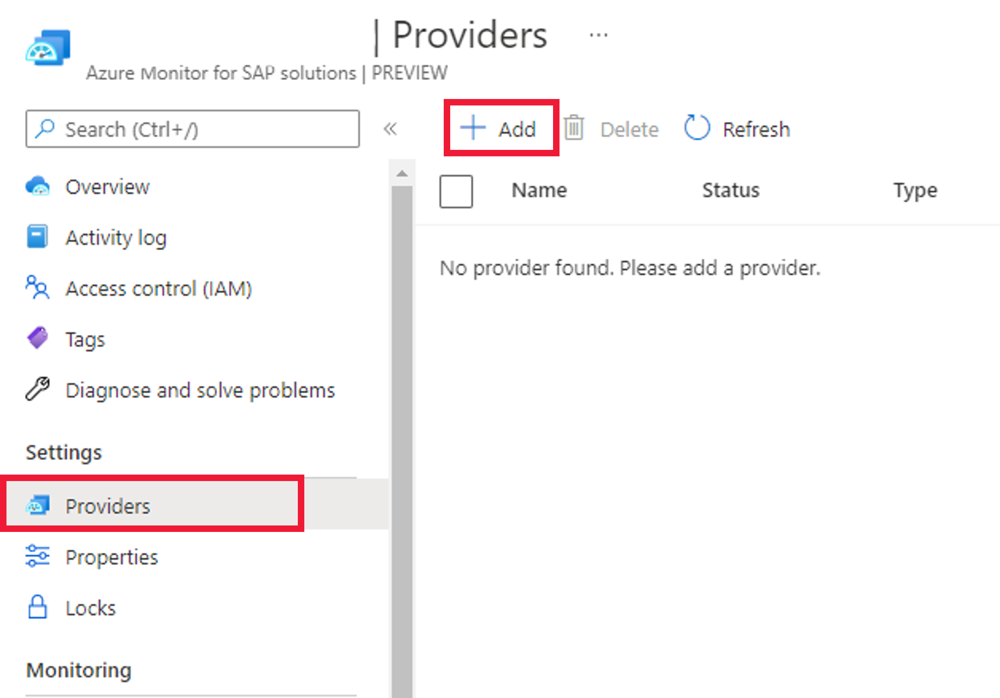
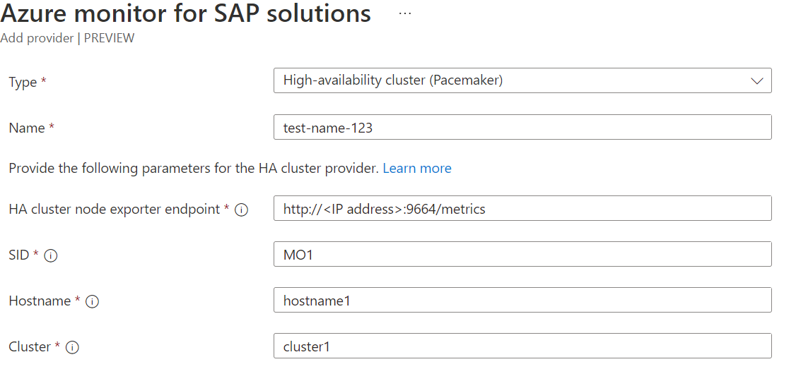
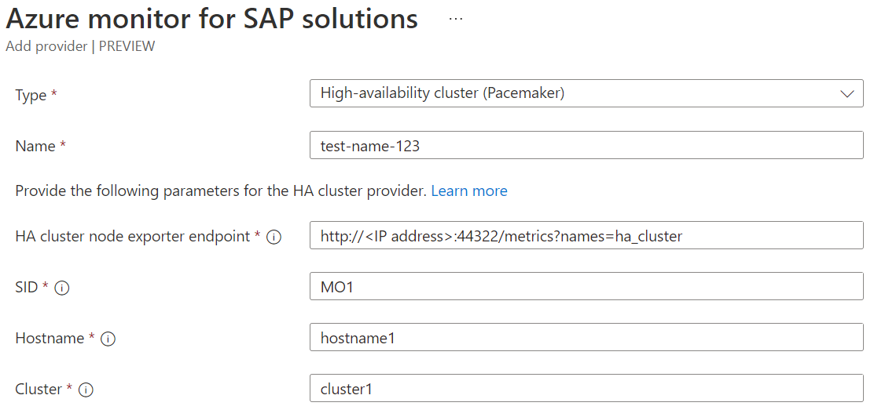

# Create a high-availability cluster provider for Azure Monitor for SAP solutions

[Azure Monitor for SAP solutions](about-azure-monitor-sap-solutions.md) lets you monitor SAP landscapes running on Azure. A high-availability (HA) Pacemaker cluster provider collects metrics from your cluster nodes so you can track cluster health and resource status.

In this article, you install the HA agent on each cluster node and then create the provider in Azure Monitor for SAP solutions.

## Prerequisites

- An Azure subscription.
- An existing Azure Monitor for SAP solutions resource. To create an Azure Monitor for SAP solutions resource, see the [quickstart for the Azure portal](quickstart-portal.md) or the [quickstart for PowerShell](quickstart-powershell.md).

## Install an HA agent

Before you add providers for HA (Pacemaker) clusters, install the appropriate agent for RHEL or SUSE in each cluster node.

For SUSE-based clusters, install `ha_cluster_provider` in each node. For more information, see the [HA cluster exporter installation guide](https://github.com/ClusterLabs/ha_cluster_exporter#installation). Supported SUSE versions include SLES for SAP 12 SP3 and later versions.

For RHEL-based clusters, install Performance Co-Pilot (PCP) and the `pcp-pmda-hacluster` subpackage in each node. For more information, see the [PCP HACLUSTER agent installation guide](https://access.redhat.com/articles/6139852). Supported RHEL versions include 8.2, 8.4, and later versions.

### Install an HA cluster exporter

# [SUSE](#tab/suse)

1. Install the required packages for the Prometheus cluster exporter.

   ```bash
   sudo zypper install prometheus-ha_cluster_exporter
   ```

1. Enable and start the Prometheus cluster exporter service.

   ```bash
   sudo systemctl start prometheus-ha_cluster_exporter
   ```

   ```bash
   sudo systemctl enable prometheus-ha_cluster_exporter
   ```

1. The `ha_cluster_exporter` collects data. Export the data by using the URL `http://<ip-address>:9664/metrics`. To check that the metrics are accessible on the server where `ha_cluster_exporter` is installed, run the following command:

   ```bash
   curl http://localhost:9664/metrics
   ```

# [RHEL](#tab/rhel)

1. Install the required packages for PCP.

   ```bash
   sudo yum install pcp pcp-pmda-hacluster
   ```

1. Enable and start the required PCP collector services.

   ```bash
   sudo systemctl start pmcd
   ```

   ```bash
   sudo systemctl enable pmcd
   ```

1. Install and enable the HA cluster PMDA. Replace `$PCP_PMDAS_DIR` with the path where `hacluster` is installed. Use the `find` command in Linux to find the path. The path is usually `/var/lib/pcp/pmdas`.

   ```bash
   cd $PCP_PMDAS_DIR/hacluster
   ```

   ```bash
   sudo ./Install
   ```

1. Enable and start the `pmproxy` service.

   ```bash
   sudo systemctl start pmproxy
   ```

   ```bash
   sudo systemctl enable pmproxy
   ```

1. PCP collects data. Export the data by using `pmproxy` at the URL `http://<ip-address>:44322/metrics?names=ha_cluster`. To check that the metrics are accessible on the server where `hacluster` is installed, run the following command:

   ```bash
   curl http://localhost:44322/metrics?names=ha_cluster
   ```

---

## Enable secure communication (optional)

To [enable TLS 1.2 or higher](enable-tls-azure-monitor-sap-solutions.md), follow the steps described in the [HA cluster exporter TLS and basic authentication guide](https://github.com/ClusterLabs/ha_cluster_exporter#tls-and-basic-authentication).

## Create a provider for Azure Monitor for SAP solutions

After you install the HA agent on each cluster node, create a provider in Azure Monitor for SAP solutions to start collecting cluster metrics.

1. Sign in to the [Azure portal](https://portal.azure.com).
1. Go to the Azure Monitor for SAP solutions service.
1. Open your Azure Monitor for SAP solutions resource.
1. On the resource menu, under **Settings**, select **Providers**.
1. Select **Add** to add a new provider.

   

1. For **Type**, select **High-availability cluster (Pacemaker)**.
1. (Optional) Select **Enable secure communication** and choose a certificate type.
1. Configure providers for each node of the cluster by entering the endpoint URL for **HA Cluster Exporter Endpoint**.

   1. For SUSE-based clusters, enter `http://<IP-address>:9664/metrics`.

      

   1. For RHEL-based clusters, enter `http://<IP-address>:44322/metrics?names=ha_cluster`.

      

1. Enter the following values:

   - **SID**: The SAP system ID.
   - **Hostname**: The SAP hostname of the virtual machine. Run `hostname -s` on SUSE or RHEL servers to get the hostname.
   - **Cluster**: A custom name that identifies the SAP system cluster. This name appears in the workbook for metrics and doesn't need to match the cluster name configured on the server.

1. Under **Prerequisite check (Preview) - highly recommended**, select **Start test**. This test validates connectivity from the Azure Monitor for SAP solutions subnet to the SAP source system and identifies any errors that you must address before you create the provider.
1. Select **Create** to finish creating the provider.
1. Repeat these steps for each server in the cluster. Create a provider for each server to see all metrics in the workbook.

## Troubleshoot common errors

Use the following steps to resolve common errors.

### Unable to reach the Prometheus endpoint

When the provider settings validation operation fails with the code `PrometheusURLConnectionFailure`:

1. Restart the HA cluster exporter agent.

   ```bash
   sudo systemctl start pmproxy
   ```

1. Re-enable the HA cluster exporter agent.

   ```bash
   sudo systemctl enable pmproxy
   ```

1. Check that the Prometheus endpoint is reachable from the subnet that you provided when you created the Azure Monitor for SAP solutions resource.

## Next steps

> [!div class="nextstepaction"]
> [Learn about Azure Monitor for SAP solutions provider types](providers.md)
