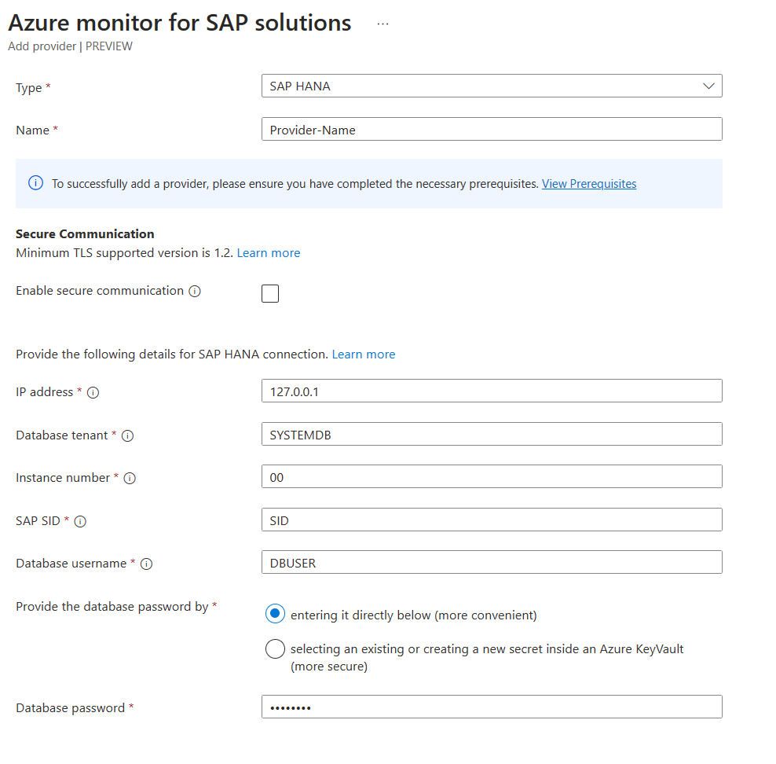

# Configure SAP HANA provider for Azure Monitor for SAP solutions

In this how-to guide, you learn how to configure an SAP HANA provider for Azure Monitor for SAP solutions through the Azure portal.

## Prerequisite to enable secure communication

To [enable TLS 1.2 higher](enable-tls-azure-monitor-sap-solutions.md) for the SAP HANA provider, follow the steps in [this SAP document](https://www.sap.com/documents/2018/11/b865eb91-287d-0010-87a3-c30de2ffd8ff.html).

## Prerequisites

- An Azure subscription.
- An existing Azure Monitor for SAP solutions resource. To create an Azure Monitor for SAP solutions resource, see the [quickstart for the Azure portal](quickstart-portal.md) or the [quickstart for PowerShell](quickstart-powershell.md).

## Configure SAP HANA provider

1. Sign in to the [Azure portal](https://portal.azure.com).
1. Search for and select **Azure Monitors for SAP solutions** in the search bar.
1. On the Azure Monitor for SAP solutions service page, select **Create**.
1. On the Azure Monitor for SAP solutions creation page, enter your basic resource information on the **Basics** tab.
1. On the **Providers** tab:
    1. Select **Add provider**.
    1. On the creation pane, for **Type**, select **SAP HANA**.
    
       
    1. Optionally, select **Enable secure communication** and choose the certificate type from the dropdown menu.
    1. For **IP address**, enter the IP address or hostname of the server that runs the SAP HANA instance that you want to monitor. If you're using a hostname, make sure there's connectivity within the virtual network.
    1. For **Database tenant**, enter the HANA database that you want to connect to. We recommend that you use **SYSTEMDB** because tenant databases don't have all monitoring views.
    1. For **Instance number**, enter the instance number of the database (0-99). The SQL port is automatically determined based on the instance number.
    1. For **Database username**, enter the dedicated SAP HANA database user. This user needs the **MONITORING** or **BACKUP CATALOG READ** role assignment. For nonproduction SAP HANA instances, use **SYSTEM** instead.
    1. For **Database password**, enter the password for the database username. You can either enter the password directly or use a secret inside Azure Key Vault.
1. Save your changes to the Azure Monitor for SAP solutions resource.

> [!Note]
> Azure Monitor for SAP solutions supports HANA 2.0 SP6 and later versions. Legacy HANA 1.0 is not supported. 

## Next steps

> [!div class="nextstepaction"]
> [Learn about Azure Monitor for SAP solutions provider types](providers.md)
