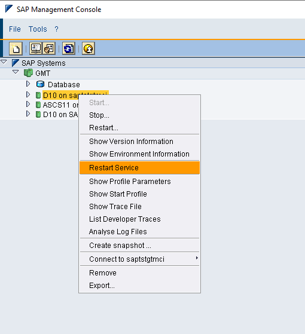

# Configure SAP NetWeaver for Azure Monitor for SAP solutions 

In this how-to guide, you'll learn to configure the SAP NetWeaver provider for use with *Azure Monitor for SAP solutions*.

User can select between the two connection types when configuring SAP Netweaver provider to collect information from SAP system. Metrics are collected by using

- **SAP Control** - The SAP start service provides multiple services, including monitoring the SAP system. Both versions of Azure Monitor for SAP solutions use **SAP Control**, which is a SOAP web service interface that exposes these capabilities. The **SAP Control** interface [differentiates between protected and unprotected web service methods](https://wiki.scn.sap.com/wiki/display/SI/Protected+web+methods+of+sapstartsrv). It's necessary to unprotect some methods to use Azure Monitor for SAP solutions with NetWeaver.
- **SAP RFC** - Azure Monitor for SAP solutions also provides ability to collect additional information from the SAP system using Standard SAP RFC. It's available only as part of Azure Monitor for SAP solution.

You can collect the below metric using SAP NetWeaver Provider

- SAP system and application server availability (for example Instance process availability of dispatcher,ICM,Gateway,Message server,Enqueue Server,IGS Watchdog) (SAP Control)
- Work process usage statistics and trends (SAP Control)
- Enqueue Lock statistics and trends (SAP Control)
- Queue usage statistics and trends (SAP Control)
- SMON Metrics (**transaction code - /SDF/SMON**) (RFC)
- SWNC Workload, Memory, Transaction, User, RFC Usage (**transaction code - St03n**) (RFC)
- Short Dumps (**transaction code - ST22**) (RFC)
- Object Lock (**transaction code - SM12**) (RFC)
- Failed Updates (**transaction code - SM13**) (RFC)
- System Logs Analysis (**transaction code - SM21**) (RFC)
- Batch Jobs Statistics (**transaction code - SM37**) (RFC)
- Outbound Queues (**transaction code - SMQ1**) (RFC)
- Inbound Queues (**transaction code - SMQ2**) (RFC)
- Transactional RFC (**transaction code - SM59**) (RFC)
- STMS Change Transport System Metrics (**transaction code - STMS**) (RFC)


## Prerequisites

- An Azure subscription.
- An existing Azure Monitor for SAP solutions resource. To create an Azure Monitor for SAP solutions resource, see the [quickstart for the Azure portal](quickstart-portal.md) or the [quickstart for PowerShell](quickstart-powershell.md).

## Configure NetWeaver for Azure Monitor for SAP solutions

To configure the NetWeaver provider for the current Azure Monitor for SAP solutions version, you'll need to:

1. [Prerequisite - Unprotect methods for metrics](#prerequisite-unprotect-methods-for-metrics)
1. [Prerequisite to enable RFC metrics ](#prerequisite-to-enable-rfc-metrics)
1. [Add the NetWeaver provider](#adding-netweaver-provider)

Refer to troubleshooting section to resolve any issue faced while adding the SAP NetWeaver Provider.

### Prerequisite unprotect methods for metrics

This step is **mandatory** when configuring SAP NetWeaver Provider. To fetch specific metrics, you need to unprotect some methods in each SAP instance:

1. Open an SAP GUI connection to the SAP server.
1. Sign in with an administrative account.
1. Execute transaction **RZ10**.
1. Select the appropriate profile (recommended Instance Profile).
1. Select **Extended Maintenance**  &gt;  **Change**.
1. Select the profile parameter `service/protectedwebmethods`.
1. Change the value to:    
    ```Value field 
    SDEFAULT -GetQueueStatistic -ABAPGetWPTable -EnqGetStatistic -GetProcessList -GetEnvironment -ABAPGetSystemWPTable
1. Select **Copy**.
1. Select **Profile** &gt; **Save** to save the changes.   
1. Restart the **SAPStartSRV** service on each instance in the SAP system. Restarting the services doesn't restart the entire system. This process only restarts **SAPStartSRV** (on Windows) or the daemon process (in Unix or Linux).

    You must restart **SAPStartSRV** on each instance of the SAP system for the SAP Control web methods to be unprotected. These read-only SOAP APIs are required for the NetWeaver provider to fetch metric data from the SAP system. Failure to unprotect these methods results in empty or missing visualizations on the NetWeaver metric workbook.

    1. On Windows systems, use the SAP Microsoft Management Console (MMC) or SAP Management Console (MC) to restart the service. Right-click each instance. Then, choose **All Tasks** &gt; **Restart Service**.
  
       
    2. On Linux systems, use the following commands to restart the host. Replace `<instance number>` with your SAP system's instance number.
    
    ```Command to restart the service 
    sapcontrol -nr <instance number> -function RestartService
    ```    
    3. Repeat the previous steps for each instance profile (or) you can restart the SAP system in lower environments as another option.
    
#### PowerShell script to unprotect web methods
    
You can refer to the [link](https://github.com/Azure/Azure-Monitor-for-SAP-solutions-preview/tree/main/Provider_Pre_Requisites/SAP_NetWeaver_Pre_Requisites/Windows) 
to unprotect the web-methods in the SAP Windows virtual machine.

### Prerequisite to enable RFC metrics

RFC metrics are only supported for **AS ABAP applications** and do not apply to SAP JAVA systems. This step is **mandatory** when the connection type selected is **SOAP+RFC**. 
Below steps need to be performed as a pre-requisite to enable RFC

1. **Create or upload role** in the SAP NW ABAP system. Azure Monitor for SAP solutions requires this role to connect to SAP. The role uses the least privileged access. Download and unzip [Z_AMS_NETWEAVER_MONITORING.zip](https://github.com/MicrosoftDocs/azure-docs-pr/files/12528831/Z_AMS_NETWEAVER_MONITORING.zip)


    1. Sign in to your SAP system.
    1. Use the transaction code **PFCG** &gt; select on **Role Upload** in the menu.
    1. Upload the **Z_AMS_NETWEAVER_MONITORING.SAP** file from the ZIP file.
    1. Select **Execute** to generate the role. (ensure the profile is also generated as part of the role upload)

     **Transport to import role in SAP System** 
    
    You can also refer to the [link](https://github.com/Azure/Azure-Monitor-for-SAP-solutions-preview/tree/main/Provider_Pre_Requisites/SAP_NetWeaver_Pre_Requisites/SAP%20Role%20Transport) to import role in PFCG and generate profile for successfully configuring Netweaver provider for your SAP system.
    
3. **Create and authorize a new RFC user**.
    1. Create an RFC user.
    1. Assign the role **Z_AMS_NETWEAVER_MONITORING** to the user. It's the role that you uploaded in the previous section.

4. **Enable SICF Services** to access the RFC via the SAP Internet Communication Framework (ICF)
    1. Go to transaction code **SICF**.
    1. Go to the service path `/default_host/sap/bc/soap/`.
    1. Activate the services **wsdl**, **wsdl11** and **RFC**.

It's also recommended to check that you enabled the ICF ports.

4. **SMON** - Enable **SMON** to monitor the system performance.Make sure the version of **ST-PI** is **SAPK-74005INSTPI**.   
   You'll see empty visualization as part of the workbook when it isn't configured.

    1. Enable the **SDF/SMON** snapshot service for your system. Turn on daily monitoring. For instructions, see [SAP Note 2651881](https://userapps.support.sap.com/sap/support/knowledge/2651881).
    2. Configure **SDF/SMON** metrics to be aggregated every minute.
    3. Recommended scheduling **SDF/SMON** as a background job in your target SAP client each minute.
    4. If you notice empty visualization as part of the workbook tab "System Performance - CPU and Memory (/SDF/SMON)", please apply the below SAP note:     
        1. Release 740 SAPKB74006-SAPKB74025 - Release 755 Until SAPK-75502INSAPBASIS. For specific support package versions please refer to the SAP NOTE.- [SAP Note 2246160](https://launchpad.support.sap.com/#/notes/2246160).
        2. If the metric collection does not work with the above note then please try - [SAP Note 3268727](https://launchpad.support.sap.com/#/notes/3268727)       

6. **To enable secure communication**

   To [enable TLS 1.2 or higher](enable-tls-azure-monitor-sap-solutions.md) with SAP NetWeaver provider please execute steps mentioned on this [SAP document](https://help.sap.com/docs/ABAP_PLATFORM_NEW/e73bba71770e4c0ca5fb2a3c17e8e229/4923501ebf5a1902e10000000a42189c.html?version=201909.002)

    **Check if SAP systems are configured for secure communication using TLS 1.2 or higher**

    1.	Go to transaction RZ10.
    2.	Open DEFAULT profile, select Extended Maintenance and click change.
    3.	Below configuration is for TLS1.2 the bit mask will be 544: PFS. If TLS version is higher, then bit mask will be greater than 544.

    

    **Check HTTPS port to be provided during the create provide process**
    1.	Go to transaction SMICM.
    2.	Choose from the menu GOTO -> Services.
    3.	Verify if HTTPS protocol is in Active status.

    

### Adding NetWeaver provider

Ensure all the prerequisites are successfully completed. To add the NetWeaver provider:

1. Sign in to the [Azure portal](https://portal.azure.com).
1. Go to the Azure Monitor for SAP solutions service page.
1. Select **Create** to open the resource creation page.
1. Enter information for the **Basics** tab.
1. Select the **Providers** tab. Then, select **Add provider**.
1. Configure the new provider:
    1. For **Type**, select **SAP NetWeaver**.
    2. For **Name**, provide a unique name for the provider
    3. For **System ID (SID)**, enter the three-character SAP system identifier.
    4. For **Application Server**, enter the IP address or the fully qualified domain name (FQDN) of the SAP NetWeaver system to monitor. For example, `sapservername.contoso.com` where `sapservername` is the hostname and  `contoso.com` is the domain. If you're using a hostname, make sure there's connectivity from the virtual network that you used to create the Azure Monitor for SAP solutions resource.
    5. For **Instance number**, specify the instance number of SAP NetWeaver (00-99)
    6. For **Connection type** - select either [SOAP](#prerequisite-unprotect-methods-for-metrics) + [RFC](#prerequisite-to-enable-rfc-metrics) or [SOAP](#prerequisite-unprotect-methods-for-metrics) based on the metric collected (refer above section for details)
    7. For **SAP client ID**, provide the SAP client identifier.
    8. For **SAP ICM HTTP Port**, enter the port that the ICM is using, for example, 80(NN) where (NN) is the instance number.
    9. For **SAP username**, enter the name of the user that you created to connect to the SAP system.
    10. For **SAP password**, enter the password for the user.
    11. For **Host file entries**, provide the DNS mappings for all SAP VMs associated with the SID
        Enter **all SAP application servers and ASCS** host file entries in **Host file entries**. Enter host file mappings in comma-separated format. The expected format for each entry is IP address, FQDN, hostname. For example: **192.X.X.X sapservername.contoso.com sapservername,192.X.X.X sapservername2.contoso.com sapservername2**.
       To determine all SAP hostnames associated with the SID, Sign in to the SAP system using the `sidadm` user. Then, run the following command (or) you can leverage the script below to generate the hostfile entries.

        Command to find a list of instances associated with a given SID

         ```bash
             /usr/sap/hostctrl/exe/sapcontrol -nr <instancenumber>  -function GetSystemInstanceList
         ```
             
     **Scripts to generate hostfile entries** 
    
    We highly recommend following the detailed instructions in the [link](https://github.com/Azure/Azure-Monitor-for-SAP-solutions-preview/tree/main/Provider_Pre_Requisites/SAP_NetWeaver_Pre_Requisites/GenerateHostfileMappings) for generating hostfile entries. These entries are crucial for the successful creation of the Netweaver provider for your SAP system.

## Troubleshooting for SAP Netweaver Provider

### Common issues while adding Netweaver Provider.

1. **Unable to reach the SAP hostname. ErrorCode: SOAPApiConnectionError**

    1. Check the input hostname, instance number, and host file mappings for the hostname provided.
    2. Follow the instruction for determining the [hostfile entries](#adding-netweaver-provider) Host file entries section.
    3. Ensure the NSG/firewall is not blocking the port – 5XX13 or 5XX14. (XX - SAP Instance Number)
    4. Check if AMS and SAP VMs are in the same vNet or are attached using vNet peering.

       If not attached, see the following [link](/azure/virtual-network/tutorial-connect-virtual-networks-portal) to connect vNets:  
   
2. **Check for unprotected updated rules. ErrorCode: SOAPWebMethodsValidationFailed**

    After you restart the SAP service, check that your updated rules are applied to each instance.
    
    1. When Signing in to the SAP system as `sidadm`. Run the following command. Replace `<instance number>` with your system's instance number.
    
        ```Command to list unprotectedmethods
        sapcontrol -nr <instance number> -function ParameterValue service/protectedwebmethods
        ```
    
    1. When signing in as non SIDADM user. Run the following command, replace `<instance number>` with your system's instance number, `<admin user>` with your administrator username, and `<admin password>` with the password.
    
        ```Command to list unprotectedmethods
        sapcontrol -nr <instance number> -function ParameterValue service/protectedwebmethods -user "<admin user>" "<admin password>"
        ```

    1. Review the output. Ensure in the output you see the name of methods **GetQueueStatistic ABAPGetWPTable EnqGetStatistic GetProcessList GetEnvironment ABAPGetSystemWPTable**

    1. Repeat the previous steps for each instance profile.
       

    To validate the rules, run a test query against the web methods. Replace the `<hostname>` with your hostname, `<instance number>` with your SAP instance number, and the method name with the appropriate method.

      ```powershell
      $SAPHostName = "<hostname>"
      $InstanceNumber = "<instance number>"
      $Function = "ABAPGetWPTable"
      [System.Net.ServicePointManager]::ServerCertificateValidationCallback = {$true}
      $sapcntrluri = "https://" + $SAPHostName + ":5" + $InstanceNumber + "14/?wsdl"
      $sapcntrl = New-WebServiceProxy -uri $sapcntrluri -namespace WebServiceProxy -class sapcntrl
      $FunctionObject = New-Object ($sapcntrl.GetType().NameSpace + ".$Function")
      $sapcntrl.$Function($FunctionObject)
     ```

3. **Ensuring the Internet communication Framework port is open. ErrorCode: RFCSoapApiNotEnabled**  

    1. Sign in to the SAP system
    2. Go to transaction code **SICF**.
    3. Navigate to the service path `/default_host/sap/bc/soap/`.
    3. Right-click the ping service and choose **Test Service**. SAP starts your default browser.
    4. If the port can't be reached, or the test fails, open the port in the SAP VM.
    
        1. For Linux, run the following commands. Replace `<your port>` with your configured port.
    
            ```bash
            sudo firewall-cmd --permanent --zone=public --add-port=<your port>/TCP
            ```
            ```bash
            sudo firewall-cmd --reload
            ```
        1. For Windows, open Windows Defender Firewall from the Start menu. Select **Advanced settings** in the side menu, then select **Inbound Rules**. To open a port, select **New Rule**. Add your port and set the protocol to TCP.
           
### Common issues with the metric collection and possible solutions

1. SMON metrics
   
    Refer to the SMON section in the [prerequisite](#prerequisite-to-enable-rfc-metrics)

2. Batch job metrics
   
    If you notice empty visualization as part of the workbook tab "Application Performance -Batch Jobs (SM37)", please apply the below SAP note
    [SAP Note 2469926](https://launchpad.support.sap.com/#/notes/2469926) in your SAP System.
    
    After you apply this OSS note you need to execute the RFC function module - BAPI_XMI_LOGON_WS with the following parameters:
    
    This function module has the same parameters as BAPI_XMI_LOGON but stores them in the table BTCOPTIONS.
    
    INTERFACE = XBP
    VERSION = 3.0
    EXTCOMPANY = TESTC
    EXTPRODUCT = TESTP

4. SWNC metrics

   To ensure a successful retrieval of the SWNC metrics, it is essential to confirm that both the SAP system and the operating system (OS) have synchronized times.

## Next steps

> [!div class="nextstepaction"]
> [Learn about Azure Monitor for SAP solutions provider types](providers.md)
