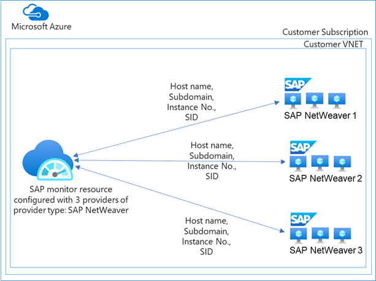
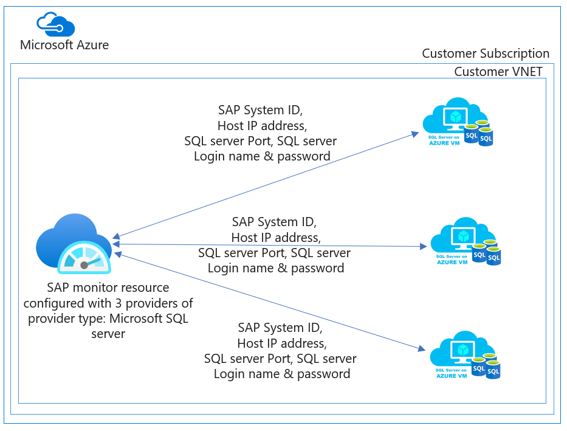
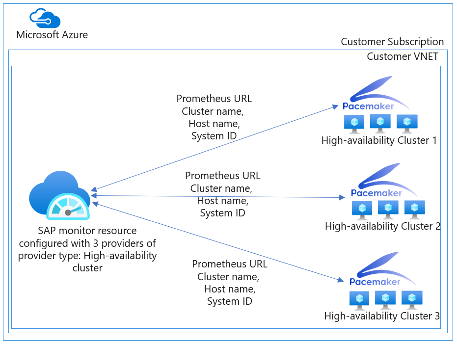
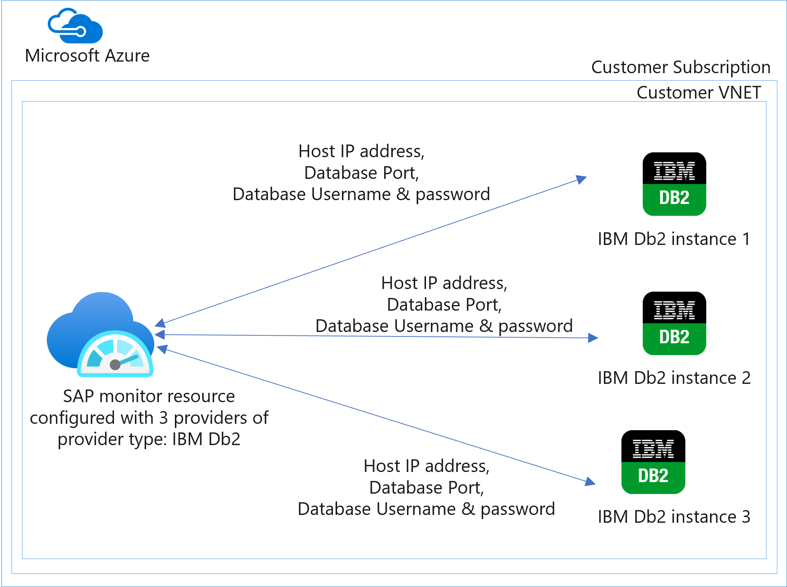

# What are providers in Azure Monitor for SAP solutions?

In the context of Azure Monitor for SAP solutions, a *provider* contains the connection information for a corresponding component and helps to collect data from there. There are multiple provider types. For example, an SAP HANA provider is configured for a specific component within the SAP landscape, like an SAP HANA database. You can configure an Azure Monitor for SAP solutions resource (also known as an SAP monitor resource) with multiple providers of the same type or multiple providers of multiple types.

You can choose to configure different provider types for data collection from the corresponding component in their SAP landscape. For example, you can configure one provider for the SAP HANA provider type, another provider for the high-availability cluster provider type, and so on.

You can also configure multiple providers of a specific provider type to reuse the same SAP monitor resource and associated managed group. For more information, see [Manage Azure Resource Manager resource groups by using the Azure portal](../../azure-resource-manager/management/manage-resource-groups-portal.md).

We recommend that you configure at least one provider when you deploy an Azure Monitor for SAP solutions resource. By configuring a provider, you start data collection from the corresponding component for which the provider is configured.

If you don't configure any providers at the time of deployment, the Azure Monitor for SAP solutions resource is still deployed, but no data is collected. You can add providers after deployment through the SAP monitor resource in the Azure portal. You can add or delete providers from the SAP monitor resource at any time.

## Provider type: SAP NetWeaver

You can configure one or more providers of the provider type SAP NetWeaver to enable data collection from the SAP NetWeaver layer. The Azure Monitor for SAP solutions NetWeaver provider uses the existing:

- [SAPControl Web service](https://www.sap.com/documents/2016/09/0a40e60d-8b7c-0010-82c7-eda71af511fa.html) interface to retrieve the appropriate information.
- SAP RFC ability to collect more information from the SAP system by using Standard SAP RFC.

With the SAP NetWeaver provider, you can get the:

- SAP system and application server availability (for example, instance process availability of Dispatcher, ICM, Gateway, Message Server, Enqueue Server, IGS Watchdog) (SAPOsControl).
- Work process usage statistics and trends (SAPOsControl).
- Enqueue lock statistics and trends (SAPOsControl).
- Queue usage statistics and trends (SAPOsControl).
- SMON metrics (**Tcode - /SDF/SMON**) (RFC).
- SWNC workload, memory, transaction, user, RFC usage (**Tcode - St03n**) (RFC).
- Short dumps (**Tcode - ST22**) (RFC).
- Object lock (**Tcode - SM12**) (RFC).
- Failed updates (**Tcode - SM13**) (RFC).
- System logs analysis (**Tcode - SM21**) (RFC).
- Batch jobs statistics (**Tcode - SM37**) (RFC).
- Outbound queues (**Tcode - SMQ1**) (RFC).
- Inbound queues (**Tcode - SMQ2**) (RFC).
- Transactional RFC (**Tcode - SM59**) (RFC).
- STMS Change Transport System metrics (**Tcode - STMS**) (RFC).

Configuring the SAP NetWeaver provider requires:

For SOAP web methods:
   - Fully qualified domain name (FQDN) of the SAP Web Dispatcher or the SAP application server.
   - SAP system ID, Instance no.
   - Host file entries of all SAP application servers that get listed via the SAPcontrol `GetSystemInstanceList` web method.

For SOAP+RFC:
   - FQDN of the SAP Web Dispatcher or the SAP application server.
   - SAP system ID, Instance no.
   - SAP client ID, HTTP port, SAP username and password for login.
   - Host file entries of all SAP application servers that get listed via the SAPcontrol `GetSystemInstanceList` web method.

For more information, see [Configure SAP NetWeaver for Azure Monitor for SAP solutions](provider-netweaver.md).

## Provider type: SAP HANA

You can configure one or more providers of the provider type **SAP HANA** to enable data collection from the SAP HANA database. The SAP HANA provider connects to the SAP HANA database over the SQL port. The provider pulls data from the database and pushes it to the Log Analytics workspace in your subscription. The SAP HANA provider collects data every minute from the SAP HANA database.

With the SAP HANA provider, you can see the:

- Underlying infrastructure usage.
- SAP HANA host status.
- SAP HANA system replication.
- SAP HANA backup data.
- Fetching services.
- Network throughput between the nodes in a scaleout system.
- SAP HANA long-idling cursors.
- SAP HANA long-running transactions.
- Checks for configuration parameter values.
- SAP HANA uncommitted write transactions.
- SAP HANA disk fragmentation.
- SAP HANA statistics server health.
- SAP HANA high memory usage service.
- SAP HANA blocking transactions.

Configuring the SAP HANA provider requires the:
- Host IP address.
- HANA SQL port number.
- SYSTEMDB username and password.

We recommend that you configure the SAP HANA provider against SYSTEMDB. However, you can configure more providers against other database tenants.

For more information, see [Configure SAP HANA provider for Azure Monitor for SAP solutions](provider-hana.md).

## Provider type: SQL Server

You can configure one or more SQL Server providers to enable data collection from [SQL Server on virtual machines](https://azure.microsoft.com/services/virtual-machines/sql-server/). The SQL Server provider connects to SQL Server over the SQL port. It then pulls data from the database and pushes it to the Log Analytics workspace in your subscription. Configure SQL Server for SQL authentication and for signing in with the SQL Server username and password. Set the SAP database as the default database for the provider. The SQL Server provider collects data every 60 seconds up to every hour from the SQL Server.

With the SQL Server provider, you can get the:
- Underlying infrastructure usage.
- Top SQL statements.
- Top largest table.
- Problems recorded in the SQL Server error log.
- Blocking processes and others.

Configuring SQL Server provider requires the:
- SAP system ID.
- Host IP address.
- SQL Server port number.
- SQL Server username and password.

 For more information, see [Configure SQL Server for Azure Monitor for SAP solutions](provider-sql-server.md).

## Provider type: High-availability cluster

You can configure one or more providers of the provider type *high-availability cluster* to enable data collection from the Pacemaker cluster within the SAP landscape. The high-availability cluster provider connects to Pacemaker by using the [ha_cluster_exporter](https://github.com/ClusterLabs/ha_cluster_exporter) for **SUSE**-based clusters and by using [Performance co-pilot](https://access.redhat.com/articles/6139852) for **RHEL**-based clusters. Azure Monitor for SAP solutions then pulls data from the cluster and pushes it to the Log Analytics workspace in your subscription. The high-availability cluster provider collects data every 60 seconds from Pacemaker.

With the high-availability cluster provider, you can get the:

 - Cluster status represented as a roll-up of node and resource status.
 - Location constraints.
 - Trends.
 - [Others](https://github.com/ClusterLabs/ha_cluster_exporter/blob/master/doc/metrics.md).

To configure a high-availability cluster provider, two primary steps are involved:

1. Install [ha_cluster_exporter](provider-ha-pacemaker-cluster.md) in *each* node within the Pacemaker cluster.

   You have two options for installing `ha_cluster_exporter`:

   - Use Azure Automation scripts to deploy a high-availability cluster. The scripts install [ha_cluster_exporter](https://github.com/ClusterLabs/ha_cluster_exporter) on each cluster node.
   - Do a [manual installation](https://github.com/ClusterLabs/ha_cluster_exporter#manual-clone--build).

1. Configure a high-availability cluster provider for *each* node within the Pacemaker cluster.

   To configure the high-availability cluster provider, the following information is required:

   - **Name**: A name for this provider. It should be unique for this Azure Monitor for SAP solutions instance.
   - **Prometheus endpoint**: `http://<servername or ip address>:9664/metrics`.
   - **SID**: For SAP systems, use the SAP SID. For other systems (for example, NFS clusters), use a three-character name for the cluster. The SID must be distinct from other clusters that are monitored.
   - **Cluster name**: The cluster name used when you're creating the cluster. You can find the cluster name in the cluster property `cluster-name`.
   - **Hostname**: The Linux hostname of the virtual machine (VM).

  For more information, see [Create a high-availability cluster provider for Azure Monitor for SAP solutions](provider-ha-pacemaker-cluster.md).

## Provider type: OS (Linux)

You can configure one or more providers of the provider type OS (Linux) to enable data collection from a BareMetal or VM node. The OS (Linux) provider connects to BareMetal or VM nodes by using the [Node_Exporter](https://github.com/prometheus/node_exporter) endpoint. It then pulls data from the nodes and pushes it to the Log Analytics workspace in your subscription. The OS (Linux) provider collects data every 60 seconds for most of the metrics from the nodes.

With the OS (Linux) provider, you can get the:

   - CPU usage and CPU usage by process.
   - Disk usage and I/O read and write.
   - Memory distribution, memory usage, and swap memory usage.
   - Network usage and the network inbound and outbound traffic details.

To configure an OS (Linux) provider, two primary steps are involved:

1. Install [Node_Exporter](https://github.com/prometheus/node_exporter) on each BareMetal or VM node.
   You have two options for installing [Node_Exporter](https://github.com/prometheus/node_exporter):
      - For automated installation with Ansible, use [Node_Exporter](https://github.com/prometheus/node_exporter) on each BareMetal or VM node to install the OS (Linux) provider.
      - Do a [manual installation](https://prometheus.io/docs/guides/node-exporter/).

1. Configure an OS (Linux) provider for each BareMetal or VM node instance in your environment.
   To configure the OS (Linux) provider, the following information is required:
      - **Name**: A name for this provider that's unique to the Azure Monitor for SAP solutions instance.
      - **Node Exporter endpoint**: Usually `http://<servername or ip address>:9100/metrics`.

Port 9100 is exposed for the `Node_Exporter` endpoint.

For more information, see [Configure Linux provider for Azure Monitor for SAP solutions](provider-linux.md).

> [!Warning]
> Make sure `Node-Exporter` keeps running after the node reboot.

## Provider type: IBM Db2

You can configure one or more IBM Db2 providers to enable data collection from IBM Db2 servers. The Db2 Server provider connects to the database over a specific port. It then pulls data from the database and pushes it to the Log Analytics workspace in your subscription. The Db2 Server provider collects data every 60 seconds up to every hour from the Db2 Server.

With the IBM Db2 provider, you can get the:

- Database availability.
- Number of connections.
- Logical and physical reads.
- Waits and current locks.
- Top 20 runtime and executions.

Configuring the IBM Db2 provider requires the:
- SAP system ID.
- Host IP address.
- Database name.
- Port number of the Db2 Server to connect to.
- Db2 Server username and password.

For more information, see [Create IBM Db2 provider for Azure Monitor for SAP solutions](provider-ibm-db2.md).

## Next steps

Learn how to deploy Azure Monitor for SAP solutions from the Azure portal.

> [!div class="nextstepaction"]
> [Deploy Azure Monitor for SAP solutions by using the Azure portal](./quickstart-portal.md)
