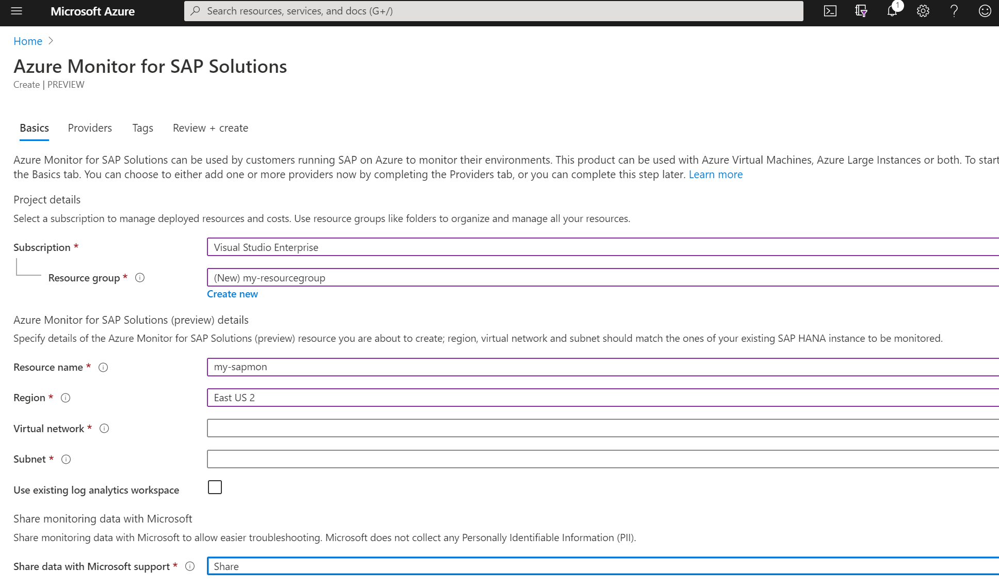

# Quickstart: deploy Azure Monitor for SAP solutions in Azure portal (preview)

[!INCLUDE [Azure Monitor for SAP solutions public preview notice](./includes/preview-azure-monitor.md)]

Get started with Azure Monitor for SAP solutions by using the [Azure portal](https://azure.microsoft.com/features/azure-portal) to deploy Azure Monitor for SAP solutions resources and configure providers.

This content applies to both versions of the service, Azure Monitor for SAP solutions and Azure Monitor for SAP solutions (classic).

## Prerequisites

- If you don't have an Azure subscription, create a [free](https://azure.microsoft.com/free/) account before you begin.

- Setup [Network](https://learn.microsoft.com/en-au/azure/sap/monitor/set-up-network/) before creating Azure Monitor.

## Create Azure Monitor for SAP solutions monitoring resource

1. Sign in to the [Azure portal](https://portal.azure.com).

2. In Azure **Search**, select **Azure Monitor for SAP solutions**.

 

3. On the **Basics** tab, provide the required values.
	
	 1. **Subscription** Add relevant Azure subscription details 
	 2. **Resource Group** Create a new or Select an existing Resource Group under the given subscription
	 3. **Resource Name** Enter the name for Azure Monitor for SAP solutions
	 4. **Workload Region** is the region where the monitoring resources are created, make sure to select a region that is same as your virtual network.
	 5. **Service Region** is where proxy resource gets created which manages monitoring resources deployed in the workload region. Service region is automatically selected based on your Workload Region selection.
	 6. For **Virtual Network** field select a virtual network, which has connectivity to your SAP systems for monitoring.
	 7. For the **Subnet** field, select a subnet that has connectivity to your SAP systems. You can use an existing subnet or create a new subnet. Make sure that you select a subnet, which is an **IPv4/25 block or larger**.
	 8. For **Log Analytics Workspace**, you can use an existing Log Analytics workspace or create a new one. If you create a new workspace, it will be created inside the managed resource group along with other monitoring resources.
    9. When entering **Managed resource group** name, make sure to use a unique name. This name is used to create a resource group, which will contain all the monitoring resources. Managed Resource Group name cannot be changed once the resource is created.

    

    

4. On the **Providers** tab, you can start creating providers along with the monitoring resource. You can also create providers later by navigating to the **Providers** tab in the Azure Monitor for SAP solutions resource. 

   Refer each of the provider specifications [here](https://learn.microsoft.com/en-au/azure/sap/monitor/provider-netweaver)
5. On the **Tags** tab, you can add tags to the monitoring resource. Make sure to add all the mandatory tags in case you have a tag policy in place.
6. On the **Review + create** tab, review the details and click **Create**.

## Create Azure Monitor for SAP solutions (classic) monitoring resource

1. Sign in to the [Azure portal](https://portal.azure.com).

1. In Azure **Marketplace** or **Search**, select **Azure Monitor for SAP solutions (classic)**.

   

1. On the **Basics** tab, provide the required values. 
	  
	1. **Subscription** Add relevant Azure subscription details 
	1. **Resource Group** Create a new or Select an existing Resource Group under the given subscription.
	1. **Resource Name** Enter the name for Azure Monitor for SAP solutions.
	1. **Region** is the region where the monitoring resources are created, make sure to select a region that is same as your virtual network.
	1. For **Virtual Network** field select a virtual network, which has connectivity to your SAP systems for monitoring.
	1. For the **Subnet** field, select a subnet that has connectivity to your SAP systems. You can use an existing subnet or create a new subnet. Make sure that you select a subnet, which is an **IPv4/25 block or larger**.

   

     
   > [!IMPORTANT]
   > Selecting **Share** for **Share data with Microsoft support** enables our support teams to help you with troubleshooting. This feature is available only for Azure Monitor for SAP solutions (classic)

## Next steps

Learn more about Azure Monitor for SAP solutions.

> [!div class="nextstepaction"]
> [Configure Azure Monitor for SAP solutions Providers](provider-netweaver.md)
