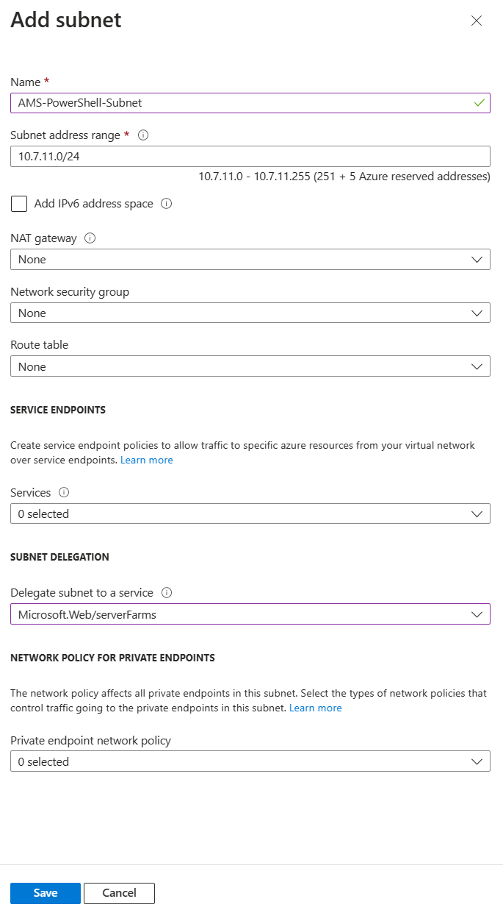
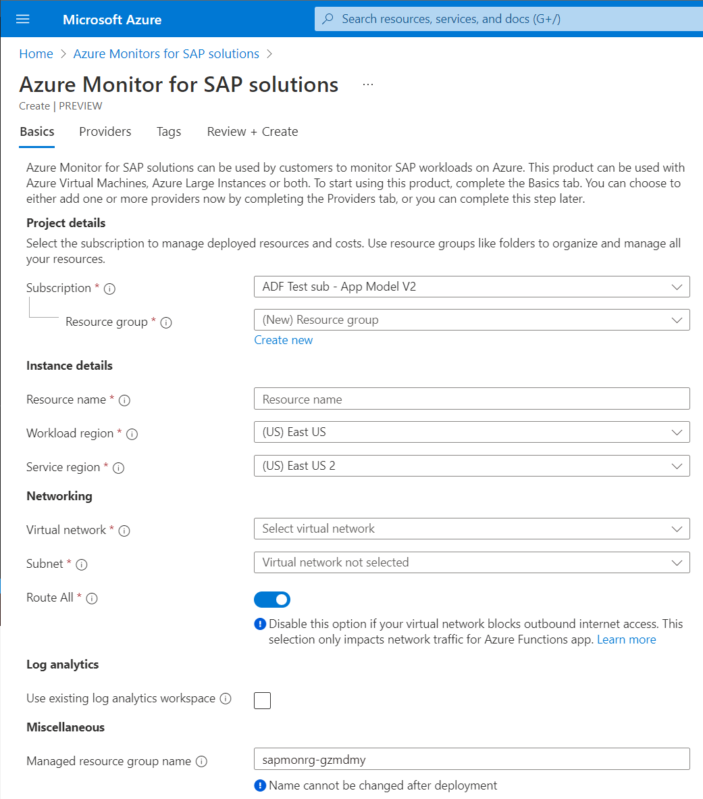

# Quickstart: Deploy Azure Monitor for SAP solutions by using the Azure portal

In this quickstart, you get started with Azure Monitor for SAP solutions by using the [Azure portal](https://azure.microsoft.com/features/azure-portal) to deploy resources and configure providers.

## Prerequisites

- If you don't have an Azure subscription, create a [free account](https://azure.microsoft.com/free/) before you begin.
- [Set up a network](./set-up-network.md) before you create an Azure Monitor instance.
- Create or choose a virtual network for Azure Monitor for SAP solutions that has access to the source SAP system's virtual network.
- Create a subnet with an address range of IPv4/25 or larger in the virtual network that's associated with Azure Monitor for SAP solutions, with subnet delegation assigned to **Microsoft.Web/serverFarms**.

   > [!div class="mx-imgBorder"]
   > 

## Create a monitoring resource for Azure Monitor for SAP solutions

1. Sign in to the [Azure portal](https://portal.azure.com).

2. In the search box, search for and select **Azure Monitor for SAP solutions**.

3. On the **Basics** tab, provide the required values:

   1. For **Subscription**, add the Azure subscription details.
   2. For **Resource group**, create a new resource group or select an existing one under the subscription.
   3. For **Resource name**, enter the name for the Azure Monitor for SAP solutions instance.
   4. For **Workload region**, select the region where the monitoring resources are created. Make sure that it matches the region for your virtual network.
   5. **Service region** is where your proxy resource is created. The proxy resource manages monitoring resources deployed in the workload region. The service region is automatically selected based on your **Workload region** selection.
   6. For **Virtual network**, select a virtual network that has connectivity to your SAP systems for monitoring.
   7. For **Subnet**, select a subnet that has connectivity to your SAP systems. You can use an existing subnet or create a new one. It must be an IPv4/25 block or larger.
   8. For **Log analytics**, you can use an existing Log Analytics workspace or create a new one. If you create a new workspace, it's created inside the managed resource group along with other monitoring resources.
   9. For **Managed resource group name**, enter a unique name. This name is used to create a resource group that will contain all the monitoring resources. You can't change this name after the resource is created.

   > [!div class="mx-imgBorder"]
   > 

4. On the **Providers** tab, you can start creating providers along with the monitoring resource. You can also create providers later by going to the **Providers** tab in the Azure Monitor for SAP solutions resource.

5. On the **Tags** tab, you can add tags to the monitoring resource. Make sure to add all the mandatory tags if you have a tag policy in place.

6. On the **Review + create** tab, review the details and select **Create**.

## Create a provider in Azure Monitor for SAP solutions

To create a provider, see the following articles:

- [SAP NetWeaver provider creation](provider-netweaver.md)
- [SAP HANA provider creation](provider-hana.md)
- [Microsoft SQL Server provider creation](provider-sql-server.md)
- [IBM Db2 provider creation](provider-ibm-db2.md)
- [Operating system provider creation](provider-linux.md)
- [High-availability provider creation](provider-ha-pacemaker-cluster.md)

## Next steps

Learn more about Azure Monitor for SAP solutions.

> [!div class="nextstepaction"]
> [Configure Azure Monitor for SAP solution providers](provider-netweaver.md)
