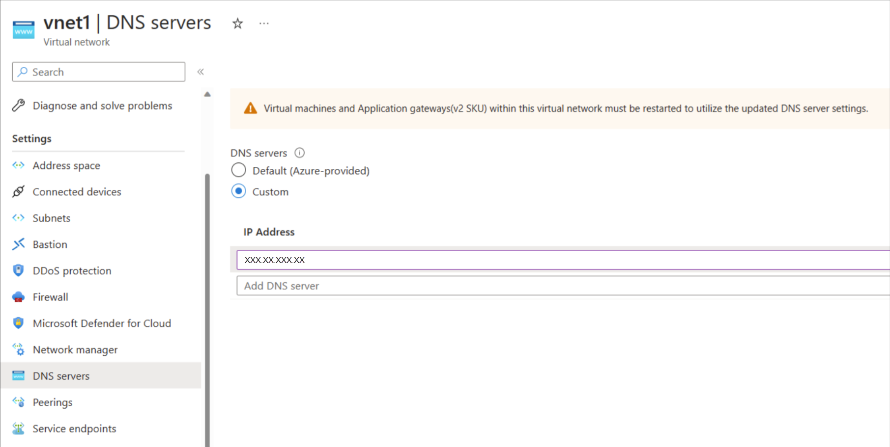
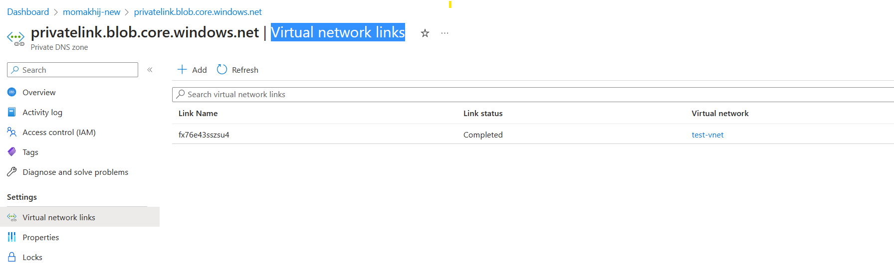

# Set up a network for Azure Monitor for SAP solutions

In this how-to guide, you learn how to configure an Azure virtual network so that you can deploy Azure Monitor for SAP solutions. You learn how to:

- [Create a new subnet](#create-a-new-subnet) for use with Azure Functions.
- [Set up outbound internet access](#configure-outbound-internet-access) to the SAP environment that you want to monitor.

## Create a new subnet

Azure Functions is the data collection engine for Azure Monitor for SAP solutions. You must create a new subnet to host Azure Functions.

[Create a new subnet](../../azure-functions/functions-networking-options.md#subnets) with an **IPv4/25** block or larger because you need at least 100 IP addresses for monitoring resources.
After you successfully create a subnet, verify the following steps to ensure connectivity between the Azure Monitor for SAP solutions subnet and your SAP environment subnet:

- If both the subnets are in different virtual networks, do a virtual network peering between the virtual networks.
- If the subnets are associated with user-defined routes, make sure the routes are configured to allow traffic between the subnets.
- If the SAP environment subnets have network security group (NSG) rules, make sure the rules are configured to allow inbound traffic from the Azure Monitor for SAP solutions subnet.
- If you have a firewall in your SAP environment, make sure the firewall is configured to allow inbound traffic from the Azure Monitor for SAP solutions subnet.

For more information, see how to [integrate your app with an Azure virtual network](../../app-service/overview-vnet-integration.md).

## Use Custom DNS for your virtual network

This section only applies if you're using Custom DNS for your virtual network. Add the IP address 168.63.129.16, which points to Azure DNS Server. This arrangement resolves the storage account and other resource URLs that are required for proper functioning of Azure Monitor for SAP solutions.

> [!div class="mx-imgBorder"]
> 

## Configure outbound internet access

In many use cases, you might choose to restrict or block outbound internet access to your SAP network environment. However, Azure Monitor for SAP solutions requires network connectivity between the [subnet that you configured](#create-a-new-subnet) and the systems that you want to monitor. Before you deploy an Azure Monitor for SAP solutions resource, you must configure outbound internet access or the deployment fails.

There are multiple methods to address restricted or blocked outbound internet access. Choose the method that works best for your use case:

- [Use the Route All feature in Azure Functions](#use-route-all)
- [Use service tags with an NSG in your virtual network](#use-service-tags)
- [Use a private endpoint for your subnet](#use-a-private-endpoint)

### Use Route All

**Route All** is a [standard feature of virtual network integration](../../azure-functions/functions-networking-options.md#virtual-network-integration) in Azure Functions, which is deployed as part of Azure Monitor for SAP solutions. Enabling or disabling this setting only affects traffic from Azure Functions. This setting doesn't affect any other incoming or outgoing traffic within your virtual network.

You can configure the **Route All** setting when you create an Azure Monitor for SAP solutions resource through the Azure portal. If your SAP environment doesn't allow outbound internet access, disable **Route All**. If your SAP environment allows outbound internet access, keep the default setting to enable **Route All**.

You can only use this option before you deploy an Azure Monitor for SAP solutions resource. It's not possible to change the **Route All** setting after you create the Azure Monitor for SAP solutions resource.

### Allow inbound traffic

If you have NSG or User-Defined Route rules that block inbound traffic to your SAP environment, you must modify the rules to allow the inbound traffic. Also, depending on the types of providers you're trying to add, you must unblock a few ports, as shown in the following table.

| Provider type                  | Port number                                                         |
|------------------------------------|---------------------------------------------------------------------|
| Prometheus OS                      |  9100                                                               |
| Prometheus HA Cluster on RHEL      |  44322                                                              |
| Prometheus HA Cluster on SUSE      |  9100                                                               |
| SQL Server                         |  1433  (can be different if you aren't using the default port)     |
| DB2 Server                         |  25000 (can be different if you aren't using the default port)     |
| SAP HANA DB                        |  3\<instance number\>13, 3\<instance number\>15                         |
| SAP NetWeaver                      |  5\<instance number\>13, 5\<instance number\>15                         |

### Use service tags

If you use NSGs, you can create Azure Monitor for SAP solutions-related [virtual network service tags](../../virtual-network/service-tags-overview.md) to allow appropriate traffic flow for your deployment. A service tag represents a group of IP address prefixes from a specific Azure service.

You can use this option after you deploy an Azure Monitor for SAP solutions resource.

1. Find the subnet associated with your Azure Monitor for SAP solutions managed resource group:
      1. Sign in to the [Azure portal](https://portal.azure.com).
      1. Search for or select the Azure Monitor for SAP solutions service.
      1. On the **Overview** page for Azure Monitor for SAP solutions, select your Azure Monitor for SAP solutions resource.
      1. On the managed resource group's page, select the Azure Functions app.
      1. On the app's page, select the **Networking** tab. Then select **VNET Integration**.
      1. Review and note the subnet details. You need the subnet's IP address to create rules in the next step.
1. Select the subnet's name to find the associated NSG. Note the NSG's information.
1. Set new NSG rules for outbound network traffic:
      1. Go to the NSG resource in the Azure portal.
      1. On the NSG's menu, under **Settings**, select **Outbound security rules**.
      1. Select **Add** to add the following new rules:

    | Priority | Name                | Port | Protocol | Source | Destination      | Action |
    |--------------|--------------------------|----------|--------------|------------|----------------------|------------|
    | 450          | allow_monitor            | 443      | TCP          |  Azure Functions subnet           | Azure Monitor         | Allow      |
    | 501          | allow_keyVault           | 443      | TCP          |  Azure Functions subnet           | Azure Key Vault        | Allow      |
    | 550          | allow_storage            | 443      | TCP          |   Azure Functions subnet          | Storage              | Allow      |
    | 600          | allow_azure_controlplane | 443      | Any          |   Azure Functions subnet          | Azure Resource Manager | Allow      |
    | 650      | allow_ams_to_source_system | Any  | Any   |  Azure Functions subnet | Virtual network or comma-separated IP addresses of the source system | Allow      |
    | 660          | deny_internet            | Any      | Any          | Any        | Internet             | Deny       |
    
The Azure Monitor for SAP solution's subnet IP address refers to the IP of the subnet associated with your Azure Monitor for SAP solutions resource. To find the subnet, go to the Azure Monitor for SAP solutions resource in the Azure portal. On the **Overview** page, review the **vNet/subnet** value.

For the rules that you create, **allow_vnet** must have a lower priority than **deny_internet**. All other rules also need to have a lower priority than **allow_vnet**. The remaining order of these other rules is interchangeable.

### Use a private endpoint

You can enable a private endpoint by creating a new subnet in the same virtual network as the system that you want to monitor. No other resources can use this subnet. It's not possible to use the same subnet as Azure Functions for your private endpoint.

To create a private endpoint for Azure Monitor for SAP solutions:

1. Create an Azure Private DNS zone to contain the private endpoint records. Follow the steps in [Create a private DNS zone](../../dns/private-dns-getstarted-portal.md) to create a private DNS zone. Make sure to link the private DNS zone to the virtual networks that contain your SAP system and Azure Monitor for SAP solutions resources.

      > [!div class="mx-imgBorder"]
      > 

1. Create a subnet in the virtual network that will be used for the private endpoint. Note the subnet ID and private IP address for these subnets.
1. To find the resources in the Azure portal, go to your Azure Monitor for SAP solutions resource.
1. On the **Overview** page for the Azure Monitor for SAP solutions resource, select the **Managed resource group**.

#### Create a key vault endpoint

Follow the steps in [Create a private endpoint for Azure Key Vault](../../key-vault/general/private-link-service.md) to configure the endpoint and test the connectivity to a key vault.

#### Create a storage endpoint

It's necessary to create a separate private endpoint for each Azure Storage account resource, including the queue, table, storage blob, and file. If you create a private endpoint for the storage queue, it's not possible to access the resource from systems outside the virtual networking, including the Azure portal. Other resources in the same storage account are accessible.

Repeat the following process for each type of storage subresource (table, queue, blob, and file):

1. On the storage account's menu, under **Settings**, select **Networking**.
1. Select the **Private endpoint connections** tab.
1. Select **Create** to open the endpoint creation page.
1. On the **Basics** tab, enter or select all required information.
1. On the **Resource** tab, enter or select all required information. For the **Target sub-resource**, select one of the subresource types (table, queue, blob, or file).
1. On the **Virtual Network** tab, select the virtual network and the subnet that you created specifically for the endpoint. It's not possible to use the same subnet as the Azure Functions app.

      > [!div class="mx-imgBorder"]
      > 

1. On the **DNS** tab, for **Integrate with private DNS zone**, select **Yes**.
1. On the **Tags** tab, add tags if necessary.
1. Select **Review + create** to create the private endpoint.
1. After the deployment is complete, go back to your storage account. On the **Networking** page, select the **Firewalls and virtual networks** tab.
    1. For **Public network access**, select **Enable from all networks**.
    1. Select **Apply** to save the changes.
1. Make sure to create private endpoints for all storage subresources (table, queue, blob, and file).

#### Create a Log Analytics endpoint

It's not possible to create a private endpoint directly for a Log Analytics workspace. To enable a private endpoint for this resource, connect the resource to an [Azure Monitor Private Link Scope (AMPLS)](../../azure-monitor/logs/private-link-security.md). Then, you can create a private endpoint for the AMPLS resource.

If possible, create the private endpoint before you allow any system to access the Log Analytics workspace through a public endpoint. Otherwise, you must restart the function app before you can access the Log Analytics workspace through the private endpoint.

Select a scope for the private endpoint:

1. Go to the Log Analytics workspace in the Azure portal.
1. In the resource menu, under **Settings**, select **Network isolation**.
1. Select **Add** to create a new AMPLS setting.
1. Select the appropriate scope for the endpoint. Then select **Apply**.

Create the private endpoint:

1. Go to the AMPLS resource in the Azure portal.
1. On the resource menu, under **Configure**, select **Private Endpoint connections**.
1. Select **Private Endpoint** to create a new endpoint.
1. On the **Basics** tab, enter or select all required information.
1. On the **Resource** tab, enter or select all required information.
1. On the **Virtual Network** tab, select the virtual network and the subnet that you created specifically for the endpoint. It's not possible to use the same subnet as the function app.
1. On the **DNS** tab, for **Integrate with private DNS zone**, select **Yes**. If necessary, add tags.
1. Select **Review + create** to create the private endpoint.

Configure the scope:

1. Go to the Log Analytics workspace in the Azure portal.
1. On the resource's menu, under **Settings**, select **Network Isolation**.
1. Under **Virtual networks access configuration**:
    1. Set **Accept data ingestion from public networks not connected through a Private Link Scope** to **No**. This setting disables data ingestion from any system outside the virtual network.
    1. Set **Accept queries from public networks not connected through a Private Link Scope** to **Yes**. This setting allows workbooks to display data.
1. Select **Save**.

If you enable a private endpoint after any system accessed the Log Analytics workspace through a public endpoint, restart the function app before you move forward. Otherwise, you can't access the Log Analytics workspace through the private endpoint.

1. Go to the Azure Monitor for SAP solutions resource in the Azure portal.
1. On the **Overview** page, select the name of the **Managed resource group**.
1. On the managed resource group's page, select the function app.
1. On the function app's **Overview** page, select **Restart**.

Find and note important IP address ranges:

1. Find the Azure Monitor for SAP solutions resource's IP address range.
    1. Go to the Azure Monitor for SAP solutions resource in the Azure portal.
    1. On the resource's **Overview** page, select the **vNet/subnet** to go to the virtual network.
    1. Note the IPv4 address range, which belongs to the source system.
1. Find the IP address range for the key vault and storage account.
    1. Go to the resource group that contains the Azure Monitor for SAP solutions resource in the Azure portal.
    1. On the **Overview** page, note the **Private endpoint** in the resource group.
    1. On the resource group's menu, under **Settings**, select **DNS configuration**.
    1. On the **DNS configuration** page, note the **IP addresses** for the private endpoint.
1. Find the subnet for the Log Analytics private endpoint.
    1. Go to the private endpoint created for the AMPLS resource.
    1. On the private endpoint's menu, under **Settings**, select **DNS configuration**.
    1. On the **DNS configuration** page, note the associated IP addresses.
    1. Go to the Azure Monitor for SAP solutions resource in the Azure portal.
    1. On the **Overview** page, select the **vNet/subnet** to go to that resource.
    1. On the virtual network page, select the subnet that you used to create the Azure Monitor for SAP solutions resource.

Add outbound security rules:

1. Go to the NSG resource in the Azure portal.
1. On the NSG menu, under **Settings**, select **Outbound security rules**.
1. Add the following required security rules.

    | Priority | Description |
    | -------- | ------------- |
    | 550 | Allow the source IP for making calls to a source system to be monitored. |
    | 600 | Allow the source IP for making calls to an Azure Resource Manager service tag. |
    | 650 | Allow the source IP to access the key vault resource by using a private endpoint IP. |
    | 700 | Allow the source IP to access storage account resources by using a private endpoint IP. (Include IPs for each of the storage account subresources: table, queue, file, and blob.)  |
    | 800 | Allow the source IP to access a Log Analytics workspace resource by using a private endpoint IP.  |

### DNS configuration for private endpoints

After you create the private endpoints, you need to configure DNS to resolve the private endpoint IP addresses. You can use either Azure Private DNS or custom DNS servers. For more information, see [Configure DNS for private endpoints](../../private-link/private-endpoint-dns.md).

## Next steps

- [Quickstart: Set up Azure Monitor for SAP solutions through the Azure portal](quickstart-portal.md)
- [Quickstart: Set up Azure Monitor for SAP solutions with PowerShell](quickstart-powershell.md)
