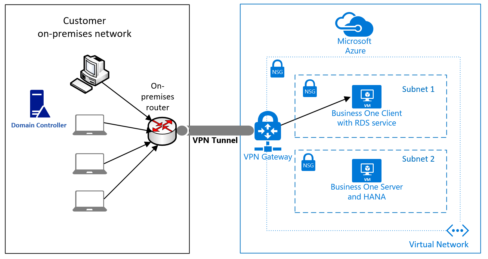

# SAP Business One on Azure Virtual Machines
This document provides guidance to deploy SAP Business One on Azure Virtual Machines. The documentation is not a replacement for installation documentation of Business one for SAP. The documentation should cover basic planning and deployment guidelines for the Azure infrastructure to run Business One applications on.

Business One supports two different databases:
- SQL Server - see [SAP Note #928839 - Release Planning for Microsoft SQL Server](https://launchpad.support.sap.com/#/notes/928839)
- SAP HANA - for exact SAP Business One support matrix for SAP HANA, checkout  the [SAP Product Availability Matrix](https://support.sap.com/pam)

Regarding SQL Server, the basic deployment considerations as documented in the [Azure Virtual Machines DBMS deployment for SAP NetWeaver](./dbms-guide-general.md) applies. for SAP HANA, considerations are mentioned in this document.

## Prerequisites
To use this guide, you need basic knowledge of the following Azure components:

- [Azure virtual machines on Windows](../../virtual-machines/windows/tutorial-manage-vm.md)
- [Azure virtual machines on Linux](../../virtual-machines/linux/tutorial-manage-vm.md)
- [Azure networking and virtual networks management with PowerShell](../../virtual-machines/windows/tutorial-virtual-network.md)
- [Azure networking and virtual networks with CLI](../../virtual-machines/linux/tutorial-virtual-network.md)
- [Manage Azure disks with the Azure CLI](../../virtual-machines/linux/tutorial-manage-disks.md)

Even if you are interested in business One only, the document [Azure Virtual Machines planning and implementation for SAP NetWeaver](./planning-guide.md) can be a good source of information.

The assumption is that you as the instance deploying SAP Business One are:

- Familiar with installing SAP HANA on a given infrastructure like a VM
- Familiar installing the SAP Business One application on an infrastructure like Azure VMs
- Familiar with operating SAP Business One and the DBMS system chosen
- Familiar with deploying infrastructure in Azure

All these areas will not be covered in this document.

Besides Azure documentation you should be aware of main SAP Notes, which refer to Business One or which are central Notes from SAP for business One:

- [528296 - General Overview Note for SAP Business One Releases and Related Products](https://launchpad.support.sap.com/#/notes/528296)
- [2216195 - Release Updates Note for SAP Business One 9.2, version for SAP HANA](https://launchpad.support.sap.com/#/notes/2216195)
- [2483583 - Central Note for SAP Business One 9.3](https://launchpad.support.sap.com/#/notes/2483583)
- [2483615 - Release Updates Note for SAP Business One 9.3](https://launchpad.support.sap.com/#/notes/2483615)
- [2483595 - Collective Note for SAP Business One 9.3 General Issues](https://launchpad.support.sap.com/#/notes/2483595)
- [2027458 - Collective Consulting Note for SAP HANA-Related Topics of SAP Business One, version for SAP HANA](https://launchpad.support.sap.com/#/notes/2027458)

## Business One Architecture
Business One is an application that has two tiers:

- A client tier with a 'fat' client
- A database tier that contains the database schema for a tenant

A better overview which components are running in the client part and which parts are running in the server part is documented in [SAP Business One Administrator's Guide](https://help.sap.com/doc/601fbd9113be4240b81d74626439cfa9/10.0/en-US/AdministratorGuide_SQL.pdf) 

Since there is heavy latency critical interaction between the client tier and the DBMS tier, both tiers need to be located in Azure when deploying in Azure. it is usual that the users then RDS into one or multiple VMs running an RDS service for the Business One client components.

### Sizing VMs for SAP Business One

Regarding the sizing of the client VM(s), the resource requirements are documented by SAP in the document [SAP Business One Hardware Requirements Guide](https://help.sap.com/doc/bfa9770d12284cce8509956dcd4c5fcb/9.3/en-US/B1_Hardware_Requirements_Guide.pdf). For Azure, you need to focus and calculate with the requirements stated in chapter 2.4 of the document.

As Azure virtual machines for hosting the Business One client components and the DBMS host, only VMs that are SAP NetWeaver supported are allowed. To find the list of SAP NetWeaver supported Azure VMs, read [SAP Note #1928533](https://launchpad.support.sap.com/#/notes/1928533).

Running SAP HANA as DBMS backend for Business One, only VMs, which are listed for Business on HANA in the [HANA certified IaaS platform list](https://www.sap.com/dmc/exp/2014-09-02-hana-hardware/enEN/#/solutions?filters=v:deCertified;ve:24;iaas;v:120) are supported for HANA. The Business One client components are not affected by this stronger restriction for the SAP HANA as DBMS system.

### Operating system releases to use for SAP Business One

In principle, it is always best to use the most recent operating system releases. Especially in the Linux space, new Azure functionality was introduced with different more recent minor releases of Suse and Red Hat. On the Windows side, using Windows Server 2016 is highly recommended.

## Deploying infrastructure in Azure for SAP Business One
In the next few chapters, the infrastructure pieces that matter for deploying SAP.

### Azure network infrastructure
The network infrastructure you need to deploy in Azure depends on whether you deploy a single Business One system for yourself. Or whether you are a hoster who hosts dozens of Business One systems for customers. There also might be slight changes in the design on whether how you connect to Azure. Going through different possibilities, one design where you have a VPN connectivity into Azure and where you extend your Active Directory through [VPN](../../vpn-gateway/vpn-gateway-about-vpngateways.md) or [ExpressRoute](../../expressroute/expressroute-introduction.md) into Azure.

The simplified configuration presented introduces several security instances that allow to control and limit routing. It starts with 

- The router/firewall on the customer on-premises side.
- The next instance is the [Azure Network Security Group](../../virtual-network/network-security-groups-overview.md) that you can use to introduce routing and security rules for the Azure VNet that you run your SAP Business one configuration in.
- In order to avoid that users of Business One client can as well see the server that runs the Business One server, which runs the database, you should separate the VM hosting the Business one client and the business one server in two different subnets within the VNet.
- You would use Azure NSG assigned to the two different subnets again in order to limit access to the Business one server.

A more sophisticated version of an Azure network configuration is based on the Azure [documented best practices of hub and spoke architecture](/azure/architecture/reference-architectures/hybrid-networking/hub-spoke). The architecture pattern of hub and spoke would change the first simplified configuration to one like this:

For cases where the users are connecting through the internet without any private connectivity into Azure, the design of the network in Azure should be aligned with the principles documented in the Azure reference architecture for [DMZ between Azure and the Internet](/azure/architecture/reference-architectures/dmz/secure-vnet-dmz).

### Business One database server
For the database type, SQL Server and SAP HANA are available. Independent of the DBMS, you should read the document [Considerations for Azure Virtual Machines DBMS deployment for SAP workload](./dbms-guide-general.md) to get a general understanding of DBMS deployments in Azure VMs and the related networking and storage topics.

Though emphasized in the specific and generic database documents already, you should make yourself familiar with:

- [Manage the availability of Windows virtual machines in Azure](../../virtual-machines/availability.md) and [Manage the availability of Linux virtual machines in Azure](../../virtual-machines/availability.md)
- [SLA for Virtual Machines](https://azure.microsoft.com/support/legal/sla/virtual-machines/v1_8/)

These documents should help you to decide on the selection of storage types and high availability configuration.

In principle you should:

- Use Premium SSDs over Standard HDDs. To learn more about the available disk types, see our article [Select a disk type](../../virtual-machines/disks-types.md)
- Use Azure Managed disks over unmanaged disks
- Make sure that you have sufficient IOPS and I/O throughput configured with your disk configuration
- Combine /hana/data and /hana/log volume in order to have a cost efficient storage configuration

#### SQL Server as DBMS
For deploying SQL Server as DBMS for Business One, go along the document [SQL Server Azure Virtual Machines DBMS deployment for SAP NetWeaver](./dbms-guide-sqlserver.md). 

Rough sizing estimates for the DBMS side for SQL Server are:

| Number of users | vCPUs | Memory | Example VM types |
| --- | --- | --- | --- |
| up to 20 | 4 | 16 GB | D4s_v3, E4s_v3 |
| up to 40 | 8 | 32 GB | D8s_v3, E8s_v3 |
| up to 80 | 16 | 64 GB | D16s_v3, E16s_v3 |
| up to 150 | 32 | 128 GB | D32s_v3, E32s_v3 |

The sizing listed above should give an idea where to start with. It may be that you need less  or more resources, in which case an adaption on Azure is easy. A change between VM types is possible with just a restart of the VM.

#### SAP HANA as DBMS
Using SAP HANA as DBMS the following sections you should follow the considerations of the document [SAP HANA on Azure operations guide](./hana-vm-operations.md).

For high availability and disaster recovery configurations around SAP HANA as database for Business One in Azure, you should read the documentation [SAP HANA high availability for Azure virtual machines](./sap-hana-availability-overview.md) and the documentation pointed to from that document.

For SAP HANA backup and restore strategies, you should read the document [Backup guide for SAP HANA on Azure Virtual Machines](../../backup/sap-hana-db-about.md) and the documentation pointed to from that document.

 
### Business One client server
For these components storage considerations are not the primary concern. nevertheless, you want to have a reliable platform. Therefore, you should use Azure Premium Storage for this VM, even for the base VHD. Sizing the VM, with the data given in [SAP Business One Hardware Requirements Guide](https://help.sap.com/doc/bfa9770d12284cce8509956dcd4c5fcb/9.3/en-US/B1_Hardware_Requirements_Guide.pdf). For Azure, you need to focus and calculate with the requirements stated in chapter 2.4 of the document. As you calculate the requirements, you need to compare them against the following documents to find the ideal VM for you:

- [Sizes for Windows virtual machines in Azure](../../virtual-machines/sizes.md)
- [SAP Note #1928533](https://launchpad.support.sap.com/#/notes/1928533)

Compare number of CPUs and memory needed to what is documented by Microsoft. Also keep network throughput in mind when choosing the VMs.