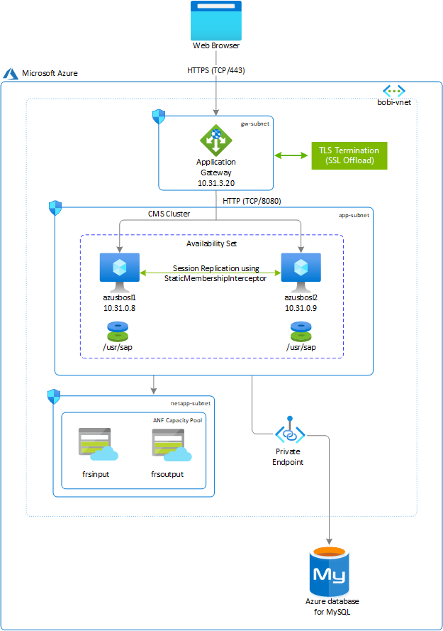
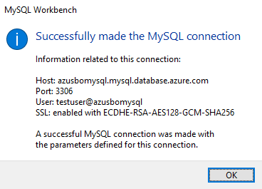
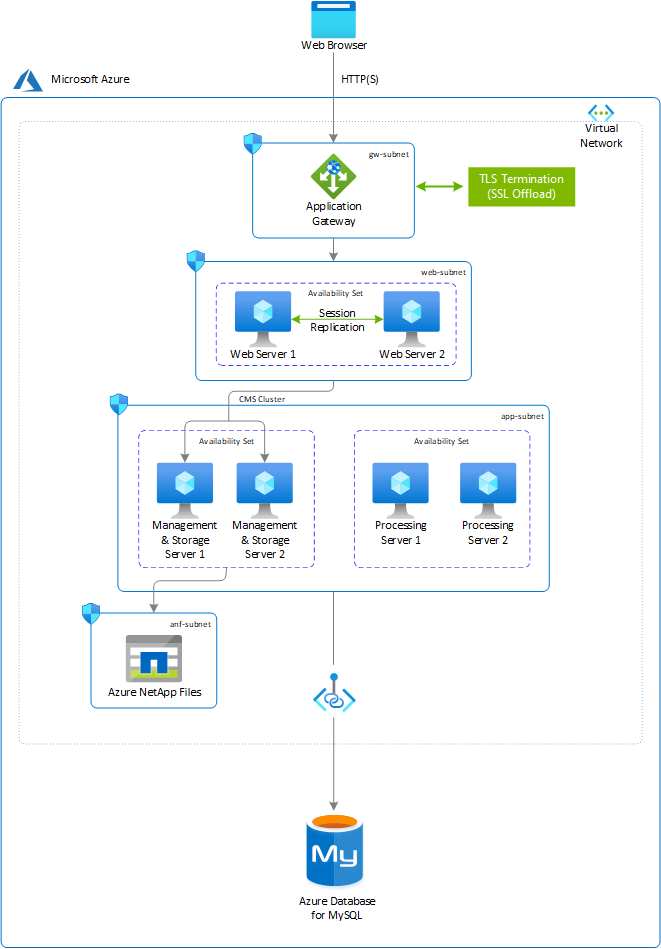
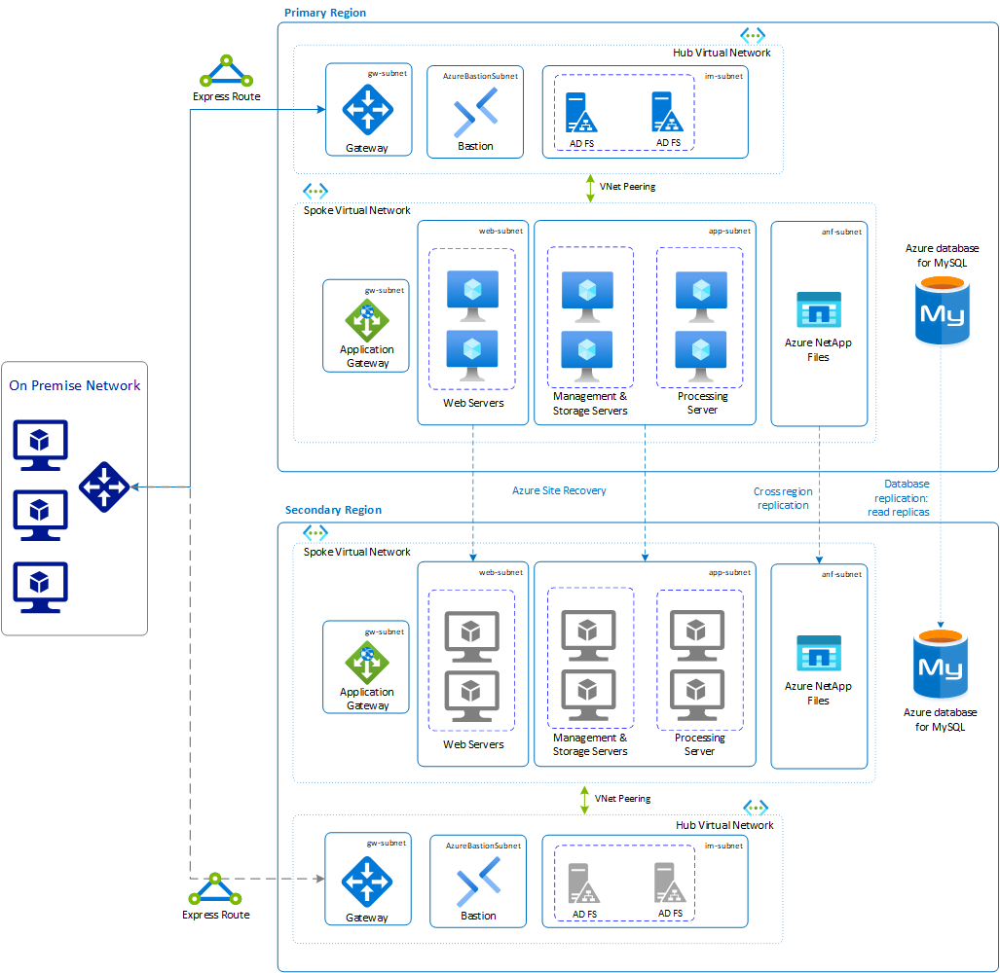

# SAP BusinessObjects BI platform deployment guide for Linux on Azure

This article describes the strategy to deploy SAP BusinessObjects BI (BOBI) platform on Azure for Linux. In this example, you configure two virtual machines with premium solid-state drive (SSD) managed disks as the install directory. You use Azure Database for MySQL for your CMS database, and you share Azure NetApp Files for your file repository server across both servers. On both virtual machines, you install the default Tomcat Java web application and BI platform application together. To load-balance user requests, you use Azure Application Gateway with native TLS/SSL offloading capabilities.

This type of architecture is effective for small deployments or non-production environments. For large deployments or production environments, you can have separate hosts for your web application. You can also have multiple BOBI application hosts, allowing the server to process more information.



Here's the product version and file system layout for this example:

- SAP BusinessObjects platform 4.3
- SUSE Linux Enterprise Server 12 SP5
- Azure Database for MySQL (Version: 8.0.15)
- MySQL C API Connector - libmysqlclient (Version: 6.1.11)

| File system        | Description                                                                                                               | Size (GB)             | Owner  | Group  | Storage                    |
|--------------------|---------------------------------------------------------------------------------------------------------------------------|-----------------------|--------|--------|----------------------------|
| /usr/sap           | The  file system for installation of the SAP BOBI instance, the default Tomcat web application, and the database drivers (if necessary). | SAP sizing guidelines | bl1adm | sapsys | Managed premium disk - SSD |
| /usr/sap/frsinput  | The mount directory is for the shared files across all BOBI hosts that will be used as the input file repository directory.  | Business need         | bl1adm | sapsys | Azure NetApp Files         |
| /usr/sap/frsoutput | The mount directory is for the shared files across all BOBI hosts that will be used as the output file repository directory | Business need         | bl1adm | sapsys | Azure NetApp Files         |

> [!IMPORTANT]
>
> While the setup of the SAP BusinessObjects platform is explained using Azure NetApp Files, you could use NFS on Azure Files as the input and output file repository.

## Deploy Linux virtual machine via Azure portal

In this section, you create two virtual machines with the Linux operating system image for the SAP BOBI platform. The high-level steps to create the virtual machines are as follows:

1. Create a [resource group](../../azure-resource-manager/management/manage-resource-groups-portal.md#create-resource-groups).

2. Create a [virtual network](../../virtual-network/quick-create-portal.md#create-a-virtual-network).

   - Don't use a single subnet for all Azure services in the SAP BI platform deployment. Based on SAP BI platform architecture, you need to create multiple subnets. In this deployment, you create three subnets: one each for the application, the file repository store, and Application Gateway.
   - In Azure, Application Gateway and Azure NetApp Files must always be on a separate subnet. For more information, see [Azure Application Gateway](../../application-gateway/configuration-overview.md) and [Guidelines for Azure NetApp Files network planning](../../azure-netapp-files/azure-netapp-files-network-topologies.md).

3. Select the suitable [availability options](./sap-high-availability-architecture-scenarios.md#comparison-of-different-deployment-types-for-sap-workload) depending on your preferred system configuration within an Azure region, whether it involves spanning across zones, residing within a single zone, or operating in a zone-less region.

4. Create virtual machine 1, called **(azusbosl1)**.

   - You can either use a custom image or choose an image from Azure Marketplace. For more information, see [Deploying a VM from the Azure Marketplace for SAP](https://github.com/MicrosoftDocs/azure-docs/blob/main/articles/sap/workloads/deployment-guide.md#scenario-1-deploying-a-vm-from-the-azure-marketplace-for-sap) or [Deploying a VM with a custom image for SAP](https://github.com/MicrosoftDocs/azure-docs/blob/main/articles/sap/workloads/deployment-guide.md#scenario-2-deploying-a-vm-with-a-custom-image-for-sap).

5. Create virtual machine 2, called **(azusbosl2)**.
6. Add one premium SSD disk. You'll use it as your SAP BOBI Installation directory.

## Provision Azure NetApp Files

Before you continue with the setup for Azure NetApp Files, familiarize yourself with the  [Azure NetApp Files documentation](../../azure-netapp-files/azure-netapp-files-introduction.md).

Azure NetApp Files is available in several [Azure regions](https://azure.microsoft.com/global-infrastructure/services/?products=netapp). Check to see whether your selected Azure region offers Azure NetApp Files.

Use [Azure NetApp Files availability by Azure Region](https://azure.microsoft.com/global-infrastructure/services/?products=netapp&regions=all) to check the availability of Azure NetApp Files by region.

### Deploy Azure NetApp Files resources

The following instructions assume that you've already deployed your [Azure virtual network](../../virtual-network/virtual-networks-overview.md). The Azure NetApp Files resources, and the VMs where the Azure NetApp Files resources will be mounted, must be deployed in the same Azure virtual network or in peered Azure virtual networks.

1. [Create an Azure NetApp Files account](../../azure-netapp-files/azure-netapp-files-create-netapp-account.md) in your selected Azure region.

2. [Set up an Azure NetApp Files capacity pool](../../azure-netapp-files/azure-netapp-files-set-up-capacity-pool.md). The SAP BI platform architecture presented in this article uses a single Azure NetApp Files capacity pool at the Premium service level. For SAP BI File Repository Server on Azure, we recommend using an Azure NetApp Files Premium or Ultra [service Level](../../azure-netapp-files/azure-netapp-files-service-levels.md).

3. [Delegate a subnet to Azure NetApp Files](../../azure-netapp-files/azure-netapp-files-delegate-subnet.md).

4. Deploy Azure NetApp Files volumes by following the instructions in [Create an NFS volume for Azure NetApp Files](../../azure-netapp-files/azure-netapp-files-create-volumes.md).

   You can deploy the volumes as NFSv3 and NFSv4.1, because both protocols are supported for the SAP BOBI platform. Deploy the volumes in their respective Azure NetApp Files subnets. The IP addresses of the Azure NetApp Files volumes are assigned automatically.

Keep in mind that the Azure NetApp Files resources and the Azure VMs must be in the same Azure virtual network or in peered Azure virtual networks. For example, *azusbobi-frsinput* and *azusbobi-frsoutput* are the volume names, and *nfs://10.31.2.4/azusbobi-frsinput* and *nfs://10.31.2.4/azusbobi-frsoutput* are the file paths for the Azure NetApp Files volumes.

- Volume azusbobi-frsinput (nfs://10.31.2.4/azusbobi-frsinput)
- Volume azusbobi-frsoutput (nfs://10.31.2.4/azusbobi-frsoutput)

### Important considerations

As you're creating your Azure NetApp Files for SAP BOBI platform file repository server, be aware of the following considerations:

- The minimum capacity pool is 4 tebibytes (TiB). The capacity pool size can be increased in 1 TiB increments.
- The minimum volume size is 100 gibibytes (GiB).
- Azure NetApp Files and all virtual machines where the Azure NetApp Files volumes will be mounted must be in the same Azure virtual network, or in [peered virtual networks](../../virtual-network/virtual-network-peering-overview.md) in the same region. Azure NetApp Files access over virtual network peering in the same region is supported. Azure NetApp Files access over global peering isn't currently supported.
- The selected virtual network must have a subnet that is delegated to Azure NetApp Files.
- The throughput and performance characteristics of an Azure NetApp Files volume is a function of the volume quota and service level, as documented in [Service level for Azure NetApp Files](../../azure-netapp-files/azure-netapp-files-service-levels.md). While sizing the SAP Azure NetApp volumes, make sure that the resulting throughput meets the application requirements.
- With the Azure NetApp Files [export policy](../../azure-netapp-files/azure-netapp-files-configure-export-policy.md), you can control the allowed clients, the access type (for example, read-write or read only).
- The Azure NetApp Files feature isn't zone-aware yet. Currently, the feature isn't deployed in all availability zones in an Azure region. Be aware of the potential latency implications in some Azure regions.
- Azure NetApp Files volumes can be deployed as NFSv3 or NFSv4.1 volumes. Both protocols are supported for the SAP BI platform applications.

## Configure file systems on Linux servers

The steps in this section use the following prefix:

**[A]**: The step applies to all hosts.

### Format and mount the SAP file system

1. **[A]** List all attached disks.

    ```bash
    sudo lsblk
    NAME   MAJ:MIN RM  SIZE RO TYPE MOUNTPOINT
    sda      8:0    0   30G  0 disk
    ├─sda1   8:1    0    2M  0 part
    ├─sda2   8:2    0  512M  0 part /boot/efi
    ├─sda3   8:3    0    1G  0 part /boot
    └─sda4   8:4    0 28.5G  0 part /
    sdb      8:16   0   32G  0 disk
    └─sdb1   8:17   0   32G  0 part /mnt
    sdc      8:32   0  128G  0 disk
    sr0     11:0    1  628K  0 rom  
    # Premium SSD of 128 GB is attached to virtual machine, whose device name is sdc
    ```

2. **[A]** Format the block device for /usr/sap.

    ```bash
    sudo mkfs.xfs /dev/sdc
    ```

3. **[A]** Create the mount directory.

    ```bash
    sudo mkdir -p /usr/sap
    ```

4. **[A]** Get the UUID of the block device.

    ```bash
    sudo blkid

    # It will display information about block device. Copy UUID of the formatted block device

    /dev/sdc: UUID="0eb5f6f8-fa77-42a6-b22d-7a9472b4dd1b" TYPE="xfs"
    ```

5. **[A]** Maintain the file system mount entry in /etc/fstab.

    ```bash
    sudo echo "UUID=0eb5f6f8-fa77-42a6-b22d-7a9472b4dd1b /usr/sap xfs defaults,nofail 0 2" >> /etc/fstab
    ```

6. **[A]** Mount the file system.

    ```bash
    sudo mount -a
    
    sudo df -h
    
    Filesystem                     Size  Used Avail Use% Mounted on
    devtmpfs                       7.9G  8.0K  7.9G   1% /dev
    tmpfs                          7.9G   82M  7.8G   2% /run
    tmpfs                          7.9G     0  7.9G   0% /sys/fs/cgroup
    /dev/sda4                       29G  1.8G   27G   6% /
    tmpfs                          1.6G     0  1.6G   0% /run/user/1000
    /dev/sda3                     1014M   87M  928M   9% /boot
    /dev/sda2                      512M  1.1M  511M   1% /boot/efi
    /dev/sdb1                       32G   49M   30G   1% /mnt
    /dev/sdc                       128G   29G  100G  23% /usr/sap
    ```

### Mount the Azure NetApp Files volume

1. **[A]** Create mount directories.

   ```bash
   sudo mkdir -p /usr/sap/frsinput
   sudo mkdir -p /usr/sap/frsoutput
   ```

2. **[A]** Configure the client operating system to support NFSv4.1 Mount (only applicable if using NFSv4.1).

   If you're using Azure NetApp Files volumes with NFSv4.1 protocol, run the following configuration on all VMs where Azure NetApp Files NFSv4.1 volumes need to be mounted.

   In this step, you need to verify NFS domain settings. Make sure that the domain is configured as the default Azure NetApp Files domain (`defaultv4iddomain.com`), and that the mapping is set to `nobody`.

   ```bash
   sudo cat /etc/idmapd.conf
   # Example
   [General]
   Domain = defaultv4iddomain.com
   [Mapping]
   Nobody-User = nobody
   Nobody-Group = nobody
   ```

   > [!Important]
   > Make sure to set the NFS domain in /etc/idmapd.conf on the VM to match the default domain configuration on Azure NetApp Files (`defaultv4iddomain.com`). If there's a mismatch, then the permissions for files on Azure NetApp Files volumes that are mounted on the VMs will be displayed as `nobody`.

   Verify `nfs4_disable_idmapping`. It should be set to `Y`. To create the directory structure where `nfs4_disable_idmapping` is located, run the mount command. You won't be able to manually create the directory under /sys/modules, because access is reserved for the kernel / drivers.

   ```bash
   # Check nfs4_disable_idmapping
   cat /sys/module/nfs/parameters/nfs4_disable_idmapping

   # If you need to set nfs4_disable_idmapping to Y
   mkdir /mnt/tmp
   mount -t nfs -o sec=sys,vers=4.1 10.31.2.4:/azusbobi-frsinput /mnt/tmp
   umount /mnt/tmp

   echo "Y" > /sys/module/nfs/parameters/nfs4_disable_idmapping

   # Make the configuration permanent
   echo "options nfs nfs4_disable_idmapping=Y" >> /etc/modprobe.d/nfs.conf
   ```

3. **[A]** Add mount entries.

   If you're using NFSv3:

   ```bash
   sudo echo "10.31.2.4:/azusbobi-frsinput /usr/sap/frsinput  nfs   rw,hard,rsize=65536,wsize=65536,vers=3" >> /etc/fstab
   sudo echo "10.31.2.4:/azusbobi-frsoutput /usr/sap/frsoutput  nfs   rw,hard,rsize=65536,wsize=65536,vers=3" >> /etc/fstab
   ```

   If you're using NFSv4.1:

   ```bash
   sudo echo "10.31.2.4:/azusbobi-frsinput /usr/sap/frsinput  nfs   rw,hard,rsize=65536,wsize=65536,vers=4.1,sec=sys" >> /etc/fstab
   sudo echo "10.31.2.4:/azusbobi-frsoutput /usr/sap/frsoutput  nfs   rw,hard,rsize=65536,wsize=65536,vers=4.1,sec=sys" >> /etc/fstab
   ```

4. **[A]** Mount NFS volumes.

   ```bash
   sudo mount -a
   
   sudo df -h
   
   Filesystem                     Size  Used Avail Use% Mounted on
   devtmpfs                       7.9G  8.0K  7.9G   1% /dev
   tmpfs                          7.9G   82M  7.8G   2% /run
   tmpfs                          7.9G     0  7.9G   0% /sys/fs/cgroup
   /dev/sda4                       29G  1.8G   27G   6% /
   tmpfs                          1.6G     0  1.6G   0% /run/user/1000
   /dev/sda3                     1014M   87M  928M   9% /boot
   /dev/sda2                      512M  1.1M  511M   1% /boot/efi
   /dev/sdb1                       32G   49M   30G   1% /mnt
   /dev/sdc                       128G   29G  100G  23% /usr/sap
   10.31.2.4:/azusbobi-frsinput   101T   18G  100T   1% /usr/sap/frsinput
   10.31.2.4:/azusbobi-frsoutput  100T  512K  100T   1% /usr/sap/frsoutput
   ```

## Configure Azure Database for MySQL

This section provides details on how to provision Azure Database for MySQL by using the Azure portal. It also provides instructions on how to create the CMS and audit databases for the SAP BOBI platform, and a user account to access the database.

The guidelines are applicable only if you're using Azure Database for MySQL. For other databases, refer to the SAP or database-specific documentation for instructions.

### Create a database

Sign in to the Azure portal, and follow the steps in [Quickstart: Create an Azure Database for MySQL server by using the Azure portal](../../mysql/quickstart-create-mysql-server-database-using-azure-portal.md). Here are a few points to note while you're provisioning Azure Database for MySQL:

- Select the same region for Azure Database for MySQL as where your SAP BI platform application servers are running.

- Choose a supported database version, based on the [Product Availability Matrix (PAM) for SAP BI](https://support.sap.com/pam) specific to your SAP BOBI version.

- In **compute+storage**, select **Configure server**, and select the appropriate pricing tier based on your sizing output.

- **Storage Autogrowth** is enabled by default. Keep in mind that [storage](../../mysql/concepts-pricing-tiers.md#storage) can only be scaled-up, not down.

- By default, **Back up Retention Period** is seven days. You can [optionally configure](../../mysql/howto-restore-server-portal.md#set-backup-configuration) it up to 35 days.

- Backups of Azure Database for MySQL are locally redundant by default. If you want server backups in geo-redundant storage, select **Geographically Redundant** from **Backup Redundancy Options**.

>[!Important]
>Changing the [Backup Redundancy Options](../../mysql/concepts-backup.md#backup-redundancy-options) after server creation isn't supported.

>[!Note]
>The private link feature is only available for Azure Database for MySQL servers in the General Purpose or Memory Optimized pricing tiers. Ensure that the database server is in one of these pricing tiers.

### Configure Azure Private Link

In this section, you create a private link that allows SAP BOBI virtual machines to connect to Azure Database for MySQL through a private endpoint. Azure Private Link brings Azure services inside your private virtual network.

1. Select the database created in the previous section.
2. Go to **Security** > **Private endpoint connections**.
3. In **Private endpoint connections**, select **Private endpoint**.
4. Select **Subscription** > **Resource group** > **Location**.
5. Enter the **Name** of the private endpoint.
6. In the **Resource** section, specify the following:
   - Resource type: Microsoft.DBforMySQL/servers
   - Resource: MySQL database created in the previous section
   - Target sub-resource: mysqlServer
7. In the **Networking** section, select the **Virtual network** and **Subnet** on which the SAP BOBI application is deployed.
   > [!NOTE]
   > If you have a network security group (NSG) enabled for the subnet, it will be disabled for private endpoints on this subnet only. Other resources on the subnet will still have NSG enforcement.
8. For **Integrate with private DNS zone**, accept the **default (yes)**.
9. Select your **private DNS zone** from the dropdown list.
10. Select **Review+Create**, and create a private endpoint.

For more information, see [Private Link for Azure Database for MySQL](../../mysql/concepts-data-access-security-private-link.md).

### Create the CMS and audit databases

1. Download and install MySQL Workbench from [MySQL website](https://dev.mysql.com/downloads/workbench/). Make sure you install MySQL Workbench on the server that can access Azure Database for MySQL.

2. Connect to the server by using MySQL Workbench. Follow the instructions in [Get connection information](../../mysql/connect-workbench.md#get-connection-information). If the connection test is successful, you get following message:

   

3. In the SQL query tab, run the following query to create a schema for the CMS and audit databases.

   ```sql
   # Here cmsbl1 is the database name of CMS database. You can provide the name you want for CMS database.
   CREATE SCHEMA `cmsbl1` DEFAULT CHARACTER SET utf8;

   # auditbl1 is the database name of Audit database. You can provide the name you want for CMS database.
   CREATE SCHEMA `auditbl1` DEFAULT CHARACTER SET utf8;
   ```

4. Create a user account to connect to the schema.

   ```sql
   # Create a user that can connect from any host, use the '%' wildcard as a host part
   CREATE USER 'cmsadmin'@'%' IDENTIFIED BY 'password';
   CREATE USER 'auditadmin'@'%' IDENTIFIED BY 'password';

   # Grant all privileges to a user account over a specific database:
   GRANT ALL PRIVILEGES ON cmsbl1.* TO 'cmsadmin'@'%' WITH GRANT OPTION;
   GRANT ALL PRIVILEGES ON auditbl1.* TO 'auditadmin'@'%' WITH GRANT OPTION;

   # Following any updates to the user privileges, be sure to save the changes by issuing the FLUSH PRIVILEGES
   FLUSH PRIVILEGES;
   ```

5. To check the privileges and roles of the MySQL user account:

   ```sql
   USE sys;
   SHOW GRANTS for 'cmsadmin'@'%';
   +------------------------------------------------------------------------+
   | Grants for cmsadmin@%                                                  |
   +------------------------------------------------------------------------+
   | GRANT USAGE ON *.* TO `cmsadmin`@`%`                                   |
   | GRANT ALL PRIVILEGES ON `cmsbl1`.* TO `cmsadmin`@`%` WITH GRANT OPTION |
   +------------------------------------------------------------------------+
   
   USE sys;
   SHOW GRANTS FOR 'auditadmin'@'%';
   +----------------------------------------------------------------------------+
   | Grants for auditadmin@%                                                    |
   +----------------------------------------------------------------------------+
   | GRANT USAGE ON *.* TO `auditadmin`@`%`                                     |
   | GRANT ALL PRIVILEGES ON `auditbl1`.* TO `auditadmin`@`%` WITH GRANT OPTION |
   +----------------------------------------------------------------------------+
   ```

### Install MySQL C API connector on a Linux server

For the SAP BOBI application server to access a database, it requires database client drivers. To access the CMS and audit databases, you must use the MySQL C API Connector for Linux. An ODBC connection to the CMS database isn't supported. This section provides instructions on how to set up MySQL C API Connector on Linux.

1. Refer to [MySQL drivers and management tools compatible with Azure Database for MySQL](../../mysql/concepts-compatibility.md). Check for the **MySQL Connector/C (libmysqlclient)** driver in the article.

2. To download drivers, see [MySQL Product Archives](https://downloads.mysql.com/archives/c-c/).

3. Select the operating system and download the shared component rpm package of MySQL Connector. In this example, mysql-connector-c-shared-6.1.11 connector version is used.

4. Install the connector in all SAP BOBI application instances.

   ```bash
   # Install rpm package
   SLES: sudo zypper install <package>.rpm
   RHEL: sudo yum install <package>.rpm
   ```

5. Check the path of libmysqlclient.so.

   ```bash
   # Find the location of libmysqlclient.so file
   whereis libmysqlclient

   # sample output
   libmysqlclient: /usr/lib64/libmysqlclient.so
   ```

6. Set `LD_LIBRARY_PATH` to point to the `/usr/lib64` directory for the user account that will be used for installation.

   ```bash
   # This configuration is for bash shell. If you are using any other shell for sidadm, kindly set environment variable accordingly.
   vi /home/bl1adm/.bashrc
   
   export LD_LIBRARY_PATH=/usr/lib64
   ```

## Server preparation

The steps in this section use the following prefix:

**[A]**: The step applies to all hosts.

1. **[A]** Based on the flavor of Linux (SLES or RHEL), you need to set kernel parameters and install required libraries. Refer to the "System requirements" section in [Business Intelligence Platform Installation Guide for Unix](https://help.sap.com/viewer/65018c09dbe04052b082e6fc4ab60030/4.3).

2. **[A]** Ensure that the time zone on your machine is set correctly. In the Installation Guide, see [Additional Unix and Linux requirements](https://help.sap.com/viewer/65018c09dbe04052b082e6fc4ab60030/4.3/46b143336e041014910aba7db0e91070.html).

3. **[A]** Create user account (**bl1**adm) and group (sapsys) under which the software's background processes can run. Use this account to run the installation and the software. The account doesn't require root privileges.

4. **[A]** Set the user account (**bl1**adm) environment to use a supported UTF-8 locale, and ensure that your console software supports UTF-8 character sets. To ensure that your operating system uses the correct locale, set the `LC_ALL` and `LANG` environment variables to your preferred locale in your (**bl1**adm) user environment.

   ```bash
   # This configuration is for bash shell. If you are using any other shell for sidadm, kindly set environment variable accordingly.
   vi /home/bl1adm/.bashrc

   export LANG=en_US.utf8
   export LC_ALL=en_US.utf8
   ```

5. **[A]** Configure user account (**bl1**adm).

   ```bash
   # Set ulimit for bl1adm to unlimited
   root@azusbosl1:~> ulimit -f unlimited bl1adm
   root@azusbosl1:~> ulimit -u unlimited bl1adm

   root@azusbosl1:~> su - bl1adm
   bl1adm@azusbosl1:~> ulimit -a

   core file size          (blocks, -c) unlimited
   data seg size           (kbytes, -d) unlimited
   scheduling priority             (-e) 0
   file size               (blocks, -f) unlimited
   pending signals                 (-i) 63936
   max locked memory       (kbytes, -l) 64
   max memory size         (kbytes, -m) unlimited
   open files                      (-n) 1024
   pipe size            (512 bytes, -p) 8
   POSIX message queues     (bytes, -q) 819200
   real-time priority              (-r) 0
   stack size              (kbytes, -s) 8192
   cpu time               (seconds, -t) unlimited
   max user processes              (-u) unlimited
   virtual memory          (kbytes, -v) unlimited
   file locks                      (-x) unlimited
   ```

6. Download and extract media for SAP BusinessObjects BI platform from SAP Service Marketplace.

## Installation

Check the locale for user account **bl1**adm on the server:

```bash
bl1adm@azusbosl1:~> locale
LANG=en_US.utf8
LC_ALL=en_US.utf8
```

Go to the media of SAP BOBI platform, and run the following command with **bl1**adm user:

```bash
./setup.sh -InstallDir /usr/sap/BL1
```

Follow the [SAP BOBI platform](https://help.sap.com/viewer/product/SAP_BUSINESSOBJECTS_BUSINESS_INTELLIGENCE_PLATFORM) Installation Guide for Unix, specific to your version. Here are a few points to note while you're installing the SAP BOBI platform:

- On **Configure Product Registration**, you can either use a temporary license key for SAP BusinessObjects Solutions from SAP Note [1288121](https://launchpad.support.sap.com/#/notes/1288121), or you can generate a license key in SAP Service Marketplace.

- On **Select Install Type**, select **Full** installation on the first server (`azusbosl1`). For the other server (`azusbosl2`), select **Custom / Expand**, which will expand the existing BOBI setup.

- On **Select Default or Existing Database**, select **configure an existing database**, which will prompt you to select CMS and audit databases. Select **MySQL** for these database types.

  You can also select **No auditing database**, if you don’t want to configure auditing during installation.

- On **Select Java Web Application Server screen**, select appropriate options based on your SAP BOBI architecture. In this example, we have selected option 1, which installs a tomcat server on the same SAP BOBI platform.

- Enter CMS database information in **Configure CMS Repository Database - MySQL**. The following example shows input for CMS database information for a Linux installation. Azure Database for MySQL is used on default port 3306.
  
  

- (Optional) Enter audit database information in **Configure Audit Repository Database - MySQL**. The following example shows input for audit database information for a Linux installation.

  

- Follow the instructions and enter required inputs to complete the installation.

For multi-instance deployment, run the installation setup on a second host (`azusbosl2`). For  **Select Install Type**, select **Custom / Expand**, which will expand the existing BOBI setup.

In Azure Database for MySQL, a gateway redirects the connections to server instances. After the connection is established, the MySQL client displays the version of MySQL set in the gateway, not the actual version running on your MySQL server instance. To determine the version of your MySQL server instance, use the `SELECT VERSION();` command at the MySQL prompt. For more details, see [Supported Azure Database for MySQL server versions](../../mysql/concepts-supported-versions.md).


```sql
# Run direct query to the database using MySQL Workbench

select version();

+-----------+
| version() |
+-----------+
| 8.0.15    |
+-----------+
```

## Post-installation

After a multi-instance installation of the SAP BOBI platform, you need to perform additional, post-configuration steps, to support application high availability.

### Configure the cluster name

In a multi-instance deployment of the SAP BOBI platform, you want to run several CMS servers together in a cluster. A cluster consists of two or more CMS servers working together against a common CMS system database. If a node that is running on CMS fails, a node with another CMS will continue to service BI platform requests. By default in the SAP BOBI platform, a cluster name reflects the hostname of the first CMS that you install.

To configure the cluster name on Linux, follow the instructions in the [SAP Business Intelligence Platform Administrator Guide](https://help.sap.com/viewer/2e167338c1b24da9b2a94e68efd79c42/4.3). After configuring the cluster name, follow SAP Note [1660440](https://launchpad.support.sap.com/#/notes/1660440) to set the default system entry on the CMC or BI launchpad sign-in page.

### Configure input and output filestore location to Azure NetApp Files

Filestore refers to the disk directories where the actual SAP BusinessObjects files are. The default location of file repository server for the SAP BOBI platform is located in the local installation directory. In a multi-instance deployment, it's important to set up the filestore on a shared storage, such as Azure NetApp Files. This allows access to the filestore from all storage tier servers.

1. If you haven't already created NFS volumes, create them in Azure NetApp Files. (Follow the instructions in the earlier section "Provision Azure NetApp Files.")

2. Mount the NFS volume. (Follow the instructions in the earlier section "Mount the Azure NetApp Files volume.")

3. Follow SAP Note [2512660](https://launchpad.support.sap.com/#/notes/0002512660) to change the path of file repository (both input and output).

### Session replication in Tomcat clustering

Tomcat supports clustering two or more application servers for session replication and failover. SAP BOBI platform sessions are serialized, so a user session can fail over seamlessly to another instance of Tomcat, even when an application server fails.

For example, suppose a user is connected to a web server that fails while the user is navigating a folder hierarchy in a SAP BI application. With a correctly configured cluster, the user can continue navigating the folder hierarchy without being redirected to the sign-in page.

See SAP Note [2808640](https://launchpad.support.sap.com/#/notes/2808640) for steps to configure Tomcat clustering by using multicast. Note that Azure, however, doesn't support multicast. So to make the Tomcat cluster work in Azure, you must use [StaticMembershipInterceptor](https://tomcat.apache.org/tomcat-8.0-doc/config/cluster-interceptor.html#Static_Membership) (SAP Note [2764907](https://launchpad.support.sap.com/#/notes/2764907)). For more information, see the blog post [Tomcat Clustering using Static Membership for SAP BusinessObjects BI Platform](https://blogs.sap.com/2020/09/04/sap-on-azure-tomcat-clustering-using-static-membership-for-sap-businessobjects-bi-platform/).

### Load-balancing web tier of SAP BI platform

In a SAP BOBI multi-instance deployment, Java Web Application servers (web tier) are running on two or more hosts. To distribute the user load evenly across web servers, you can use a load balancer between end users and web servers. In Azure, you can either use Azure Load Balancer or Azure Application Gateway to manage traffic to your web application servers. Details about each offering are explained in following section.

#### Azure Load Balancer

[Azure Load Balancer](../../load-balancer/load-balancer-overview.md) is a high performance, low latency layer 4 (TCP, UDP) load balancer. It distributes traffic among healthy virtual machines (VMs). A load balancer health probe monitors a specified port on each VM, and only distributes traffic to an operational VM. You can either choose a public load balancer or an internal load balancer, depending on whether or not you want SAP BI platform accessible from the internet. It's zone redundant, ensuring high-availability across availability zones.

In the following diagram, refer to the Internal Load Balancer section. The web application server runs on port 8080, the default Tomcat HTTP port, which will be monitored by health probe. Any incoming request that comes from end users is redirected to the web application servers (`azusbosl1` or `azusbosl2`). Load Balancer doesn’t support TLS/SSL termination (also known as TLS/SSL offloading). If you're using Load Balancer to distribute traffic across web servers, use Standard Load Balancer.

> [!NOTE]
> When VMs without public IP addresses are placed in the pool of internal (no public IP address) Standard Load Balancer, there will be no outbound internet connectivity, unless you perform additional configuration to allow routing to public end points. For more information, see [Public endpoint connectivity for Virtual Machines using Azure Standard Load Balancer in SAP high-availability scenarios](high-availability-guide-standard-load-balancer-outbound-connections.md).


#### Azure Application Gateway

[Azure Application Gateway](../../application-gateway/overview.md) provides Application Delivery Controller (ADC) as a service. This service is used to help the application to direct user traffic to one or more web application servers. It offers various layer 7 load-balancing capabilities, such as TLS/SSL offloading, web application firewall (WAF), and cookie-based session affinity.

In SAP BI platform, Application Gateway directs application web traffic to the specified resources, either `azusbosl1` or `azusbos2`. You assign a listener to a port, create rules, and add resources to a pool. In the following diagram, Application Gateway has a private IP address (10.31.3.20) that acts as an entry point for users. It also handles incoming TLS/SSL (HTTPS - TCP/443) connections, decrypts the TLS/SSL, and passes on the unencrypted request (HTTP - TCP/8080) to the servers. It simplifies operations to maintain just one TLS/SSL certificate on Application Gateway.


To configure Application Gateway for a SAP BOBI web server, see the blog post [Load Balancing SAP BOBI Web Servers using Azure Application Gateway](https://blogs.sap.com/2020/09/17/sap-on-azure-load-balancing-web-application-servers-for-sap-bobi-using-azure-application-gateway/).

> [!NOTE]
> Azure Application Gateway is preferable to load balance the traffic to a web server. It provides helpful features, such as SSL offloading, centralized SSL management to reduce encryption and decryption overhead on the server, a round-robin algorithm to distribute traffic, WAF capabilities, and high availability.

## SAP BOBI platform reliability on Azure

SAP BOBI platform includes different tiers, which are optimized for specific tasks and operations. When a component from any one tier becomes unavailable, a SAP BOBI application either becomes inaccessible or limited in its functionality. Make sure that each tier is designed to be reliable, to keep the application operational without any business disruption.

This guide explores how features native to Azure, in combination with the SAP BOBI platform configuration, improves the availability of SAP deployment. This section focuses on the following options:

- **Backup and restore:** It's a process of creating periodic copies of data and applications to a separate location. You can restore or recover to a previous state if the original data or applications are lost or damaged.

- **High availability:** A highly available platform has at least two of everything within an Azure region, to keep the application operational if one of the servers becomes unavailable.
- **Disaster recovery:** It's a process of restoring your application functionality if there's any catastrophic loss, such as an entire Azure region becoming unavailable because of some natural disaster.

Implementation of this solution varies based on the nature of the system setup in Azure. Tailor you backup/restore, high availability, and disaster recovery solutions according to your business requirements.

## Backup and restore

Backup and restore is an essential component of any business disaster recovery strategy. To develop a comprehensive strategy for SAP BOBI platform, identify the components that lead to system downtime or disruption in the application. In the SAP BOBI platform, backup of following components are vital to protect the application:

- SAP BOBI installation directory (Managed Premium Disks)
- File repository server (Azure NetApp Files or Azure Premium Files)
- CMS database (Azure Database for MySQL or a database on Azure Virtual Machines)

The following section describes how to implement a backup and restore strategy for each of these components.

### Backup and restore for SAP BOBI installation directory

In Azure, the simplest way to back up application servers and all the attached disks is by using [Azure Backup](../../backup/backup-overview.md). It provides independent and isolated backups to guard against unintended destruction of the data on your VMs. Backups are stored in a recovery services vault, with built-in management of recovery points. Configuration and scaling are simple, backups are optimized, and you can easily restore when you need to.

As part of backup process, a snapshot is taken, and the data is transferred to the vault with no impact on production workloads. For more information, see [Snapshot consistency](../../backup/backup-azure-vms-introduction.md#snapshot-consistency). You can also choose to back up a subset of the data disks in your VM, by using the selective disks backup and restore functionality. For more information, see [Azure VM Backup](../../backup/backup-azure-vms-introduction.md) and [FAQs - Backup Azure VMs](../../backup/backup-azure-vm-backup-faq.yml).

### Backup and restore for file repository server

Based on your SAP BOBI deployment on Linux, you can use Azure NetApp Files as the filestore of your SAP BOBI platform. Choose from the following options for backup and restore based on the storage you use for filestore.

- **Azure NetApp Files:** You can create on-demand snapshots, and schedule automatic snapshots by using snapshot policies. Snapshot copies provide a point-in-time copy of your volume. For more information, see [Manage snapshots by using Azure NetApp Files](../../azure-netapp-files/azure-netapp-files-manage-snapshots.md).

- If you have created a separate NFS server, make sure you implement the backup and restore strategy for the same server.

### Backup and restore for CMS and audit databases

On Linux VMs, the CMS and audit databases can run on any of the supported databases. For more information, see the [support matrix](businessobjects-deployment-guide.md#support-matrix). It's important that you adopt the backup and restore strategy based on the database used for the CMS and audit data store.

- Azure Database for MySQL automatically creates server backups, and stores them in user-configured, locally redundant or geo-redundant storage. Azure Database for MySQL takes backups of the data files and the transaction log. Depending on the supported maximum storage size, it either takes full and differential backups (4 TB max storage servers), or snapshot backups (up to 16 TB max storage servers). These backups allow you to restore a server at any point in time within your configured backup retention period. The default backup retention period is seven days, which you can [optionally configure](../../mysql/howto-restore-server-portal.md#set-backup-configuration) up to three days. All backups are encrypted by using AES 256-bit encryption. These backup files aren't user-exposed and can't be exported. These backups can only be used for restore operations in Azure Database for MySQL. You can use [mysqldump](../../mysql/concepts-migrate-dump-restore.md) to copy a database. For more information, see [Backup and restore in Azure Database for MySQL](../../mysql/concepts-backup.md).

- For a database installed on an Azure virtual machine, you can use standard backup tools or [Azure Backup](../../backup/sap-hana-db-about.md) for supported databases. You can also use supported third-party backup tools that provide an agent for backup and recovery of all SAP BOBI platform components.

## High availability

*High availability* refers to a set of technologies that can minimize IT disruptions by providing business continuity of applications and services. It does so through redundant, fault-tolerant, or failover-protected components inside the same datacenter. In our case, the datacenters are within one Azure region. For more information, see [High-availability architecture and scenarios for SAP](sap-high-availability-architecture-scenarios.md).

Based on the sizing result of the SAP BOBI platform, you need to design the landscape and determine the distribution of BI components across Azure Virtual Machines and subnets. The level of redundancy in the distributed architecture depends on the recovery time objective (RTO) and recovery point objective (RPO) that you need for your business. SAP BOBI platform includes different tiers, and components on each tier should be designed to achieve redundancy. For example:

- Redundant application servers, like BI application servers and web server.
- Unique components, like CMS database, file repository server, and Load Balancer.

The following sections describe how to achieve high availability on each component of the SAP BOBI platform.

### High availability for application servers

You can achieve high availability for application servers by employing redundancy. To do this, configure multiple instances of BI and web servers in various Azure VMs.

To reduce the impact of downtime due to [planned and unplanned events](./sap-high-availability-architecture-scenarios.md#planned-and-unplanned-maintenance-of-virtual-machines), it's a good idea to follow the [high availability architecture guidance](./sap-high-availability-architecture-scenarios.md).

For more information, see [Manage the availability of Linux virtual machines](../../virtual-machines/availability.md).

> [!IMPORTANT]
>
> - The concepts of Azure availability zones and Azure availability sets are mutually exclusive. You can deploy a pair or multiple VMs into either a specific availability zone or an availability set, but you can't do both.
> - If you planning to deploy across availability zones, it is advised to use [flexible scale set with FD=1](./virtual-machine-scale-set-sap-deployment-guide.md) over standard availability zone deployment.

### High availability for a CMS database

If you're using Azure Database for MySQL for your CMS and audit databases, you have a locally redundant, high availability framework by default. You just need to select the region, and service inherent high availability, redundancy, and resiliency capabilities, without needing to configure any additional components. If the deployment strategy for the SAP BOBI platform is across availability zones, then you need to make sure you achieve zone redundancy for your CMS and audit databases. For more information, see [High availability in Azure Database for MySQL](../../mysql/concepts-high-availability.md) and [High availability for Azure SQL Database](/azure/azure-sql/database/high-availability-sla).

For other deployments for the CMS database, see the high availability information in the [DBMS deployment guides for SAP Workload](dbms-guide-general.md).

### High availability for filestore

Filestore refers to the disk directories where contents like reports, universes, and connections are stored. It's shared across all application servers of that system. So you must make sure that it's highly available, along with other SAP BOBI platform components.

For SAP BOBI platform running on Linux, you can choose [Azure Premium Files](../../storage/files/storage-files-introduction.md) or [Azure NetApp Files](../../azure-netapp-files/azure-netapp-files-introduction.md) for file shares that are designed to be highly available and highly durable in nature. For more information, see [Redundancy](../../storage/files/storage-files-planning.md#redundancy) for Azure Files.

Note that this file share service isn't available in all regions. See [Products available by region](https://azure.microsoft.com/global-infrastructure/services/) to find up-to-date information. If the service isn't available in your region, you can create an NFS server from which you can share the file system to the SAP BOBI application. But you'll also need to consider its high availability.

### High availability for Load Balancer

To distribute traffic across a web server, you can either use Azure Load Balancer or Azure Application Gateway. The redundancy for either of these can be achieved based on the SKU you choose for deployment.

- For Azure Load Balancer, redundancy can be achieved by configuring Standard Load Balancer as zone-redundant. For more information, see [Standard Load Balancer and Availability Zones](../../load-balancer/load-balancer-standard-availability-zones.md).

- For Application Gateway, high availability can be achieved based on the type of tier selected during deployment.
  - v1 SKU supports high-availability scenarios when you've deployed two or more instances. Azure distributes these instances across update and fault domains to ensure that instances don't all fail at the same time. You achieve redundancy within the zone.
  - v2 SKU automatically ensures that new instances are spread across fault domains and update domains. If you choose zone redundancy, the newest instances are also spread across availability zones to offer zonal failure resiliency. For more details, see [Autoscaling and Zone-redundant Application Gateway v2](../../application-gateway/application-gateway-autoscaling-zone-redundant.md).

### Reference high availability architecture for SAP BOBI platform

The following diagram shows the setup of SAP BOBI platform running on Linux server. The architecture showcases the use of different services, like Azure Application Gateway, Azure NetApp Files, and Azure Database for MySQL. These services offer built-in redundancy, which reduces the complexity of managing different high availability solutions.

Notice that the incoming traffic (HTTPS) is load-balanced by using Azure Application Gateway v1/v2 SKU, which is highly available when deployed on two or more instances. Multiple instances of the web server, management servers, and processing servers are deployed in separate VMs to achieve redundancy. Azure NetApp Files has built-in redundancy within the datacenter, so your Azure NetApp Files volumes for the file repository server will be highly available. The CMS database is provisioned on Azure Database for MySQL, which has inherent high availability. For more information, see [High availability in Azure Database for MySQL](../../mysql/concepts-high-availability.md).



The preceding architecture provides insight on how a SAP BOBI deployment on Azure can be done. But it doesn't cover all possible configuration options. You can tailor your deployment based on your business requirements.

In several Azure regions, you can use availability zones. This means you can take advantage of an independent supply of power source, cooling, and network. It enables you to deploy an application across two or three availability zones. If you want to achieve high availability across availability zones, you can deploy SAP BOBI platform across these zones, making sure that each component in the application is zone redundant.

## Disaster recovery

This section explains the strategy to provide disaster recovery protection for a SAP BOBI platform running on Linux. It complements the [Disaster Recovery for SAP](../../site-recovery/site-recovery-sap.md) document, which represents the primary resources for the overall SAP disaster recovery approach. For SAP BOBI, refer to SAP Note [2056228](https://launchpad.support.sap.com/#/notes/2056228), which describes the following methods to implement a disaster recovery environment safely.

- Fully or selectively using lifecycle management or federation to promote and distribute the content from the primary system.
- Periodically copying over the CMS and file repository server contents.

This guide focuses on the second option. It won't cover all possible configuration options for disaster recovery, but does cover a solution that features native Azure services in combination with a SAP BOBI platform configuration.

> [!IMPORTANT]
>
> - The availability of each component in the SAP BOBI platform should be factored in the secondary region, and you must thoroughly test the entire disaster recovery strategy.
> - In case where your SAP BI platform is configured with [flexible scale set](./virtual-machine-scale-set-sap-deployment-guide.md) with FD=1, then you need to use [PowerShell](../../site-recovery/azure-to-azure-powershell.md) to set up Azure Site Recovery for disaster recovery. Currently, it's the only method available to configure disaster recovery for VMs deployed in scale set.

### Reference disaster recovery architecture for SAP BOBI platform

This reference architecture is running a multi-instance deployment of the SAP BOBI platform, with redundant application servers. For disaster recovery, you should fail over all the components of the SAP BOBI platform to a secondary region. In the following diagram, Azure NetApp Files is used as the filestore, Azure Database for MySQL as the CMS and audit repository, and Azure Application Gateway as the load balancer. The strategy to achieve disaster recovery protection for each component is different, and these differences are described in the following sections.



### Load balancer

A load balancer is used to distribute traffic across web application servers of the SAP BOBI platform. On Azure, you can either use Azure Load Balancer or Azure Application Gateway for this purpose. To achieve disaster recovery for the load balancer services, you need to implement another Azure Load Balancer or Azure Application Gateway on the secondary region. To keep the same URL after a disaster recovery failover, you need to change the entry in the DNS, pointing to the load-balancing service running on the secondary region.

### VMs running web and BI application servers

Use [Azure Site Recovery](../../site-recovery/site-recovery-overview.md) to replicate VMs running web and BI application servers on the secondary region. It replicates the servers and all it's attached managed disk to the secondary region, so that when disasters and outages occur you can easily fail over to your replicated environment and continue working. To start replicating all the SAP application VMs to the Azure disaster recovery datacenter, follow the guidance in [Replicate a virtual machine to Azure](../../site-recovery/azure-to-azure-tutorial-enable-replication.md).

### File repository servers

Filestore is a disk directory where the actual files, like reports and BI documents, are stored. It's important that all the files in the filestore are in sync to a disaster recovery region. Based on the type of file share service you use for SAP BOBI platform running on Linux, the appropriate disaster recovery strategy needs to be adopted to sync the content.

- **Azure NetApp Files** provides NFS and SMB volumes, so you can use any file-based copy tool to replicate data between Azure regions. For more information on how to copy a volume in another region, see [FAQs About Azure NetApp Files](../../azure-netapp-files/faq-data-migration-protection.md#how-do-i-create-a-copy-of-an-azure-netapp-files-volume-in-another-azure-region).

  You can use Azure NetApp Files cross-region replication, currently in [preview](https://azure.microsoft.com/blog/azure-netapp-files-cross-region-replication-and-new-enhancements-in-preview/). Only changed blocks are sent over the network in a compressed, efficient format. This minimizes the amount of data required to replicate across the regions, saving data transfer costs. It also shortens the replication time, so you can achieve a smaller RPO. For more information, see [Requirements and considerations for using cross-region replication](../../azure-netapp-files/cross-region-replication-requirements-considerations.md).

- **Azure premium files** only support locally redundant (LRS) and zone redundant storage (ZRS). For the disaster recovery strategy, you can use [AzCopy](../../storage/common/storage-use-azcopy-v10.md) or [Azure PowerShell](/powershell/module/az.storage/) to copy your files to another storage account in a different region. For more information, see [Disaster recovery and storage account failover](../../storage/common/storage-disaster-recovery-guidance.md).

   > [!Important]
   > SMB Protocol for Azure Files is generally available, but NFS Protocol support for Azure Files is currently in preview. For more information, see [NFS 4.1 support for Azure Files is now in preview](https://azure.microsoft.com/blog/nfs-41-support-for-azure-files-is-now-in-preview/).

### CMS database

The CMS and audit databases in the disaster recovery region must be a copy of the databases running in primary region. Based on the database type, it's important to copy the database to the disaster recovery region based on the RTO and RPO that your business requires.

#### Azure Database for MySQL

Azure Database for MySQL provides multiple options to recover a database if there's a disaster. Choose an appropriate option that works for your business.

- Enable cross-region read replicas to enhance your business continuity and disaster recovery planning. You can replicate from the source server to up to five replicas. Read replicas are updated asynchronously by using MySQL's binary log replication technology. Replicas are new servers that you manage similar to regular servers in Azure Database for MySQL. For more information, see [Read replicas in Azure Database for MySQL](../../mysql/concepts-read-replicas.md).

- Use the geo-restore feature to restore the server by using geo-redundant backups. These backups are accessible even when the region on which your server is hosted is offline. You can restore from these backups to any other region, and bring your server back online.

  > [!NOTE]
  > Geo-restore is only possible if you provisioned the server with geo-redundant backup storage. Changing the **Backup Redundancy Options** after server creation isn't supported. For more information, see [Backup redundancy](../../mysql/concepts-backup.md#backup-redundancy-options).

The following table shows the recommendation for disaster recovery of each tier used in this example.

| SAP BOBI platform tiers   | Recommendation                                                                                           |
|---------------------------|----------------------------------------------------------------------------------------------------------|
| Azure Application Gateway | Parallel setup of Application Gateway on a secondary region.                                             |
| Web application servers   | Replicate by using Azure Site Recovery.                                                                  |
| BI application servers    | Replicate by using Site Recovery.                                                                        |
| Azure NetApp Files        | File-based copy tool to replicate data to a secondary region, or by using cross-region replication.      |
| Azure Database for MySQL  | Cross-region read replicas, or restore backup from geo-redundant backups.                                |

## Next steps

- [Set up disaster recovery for a multi-tier SAP app deployment](../../site-recovery/site-recovery-sap.md)
- [Azure Virtual Machines planning and implementation for SAP](planning-guide.md)
- [Azure Virtual Machines deployment for SAP](deployment-guide.md)
- [Azure Virtual Machines DBMS deployment for SAP](./dbms-guide-general.md)
