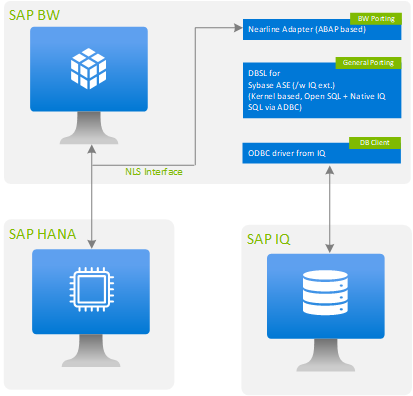

# SAP BW NLS implementation guide with SAP IQ on Azure

Over the years, customers running the SAP Business Warehouse (BW) system see an exponential growth in database size, which increases compute cost. To achieve the right balance of cost and performance, customers can use near-line storage (NLS) to migrate historical data.

The NLS implementation based on SAP IQ is the standard method by SAP to move historical data from a primary database (SAP HANA or AnyDB). The integration of SAP IQ makes it possible to separate frequently accessed data from infrequently accessed data, which makes less resource demand in the SAP BW system.

This guide provides guidelines for planning, deploying, and configuring SAP BW NLS with SAP IQ on Azure. This guide covers common Azure services and features that are relevant for SAP IQ NLS deployment and doesn't cover any NLS partner solutions.

This guide doesn't replace SAP's standard documentation on NLS deployment with SAP IQ. Instead, it complements the official installation and administration documentation.

## Solution overview

In an operative SAP BW system, the volume of data increases constantly because of business and legal requirements. The large volume of data can affect the performance of the system and increase the administration effort, which results in the need to implement a data-aging strategy.

If you want to keep the amount of data in your SAP BW system without deleting, you can use data archiving. The data is first moved to archive or near-line storage and then deleted from the SAP BW system. You can either access the data directly or load it back as required, depending on how the data has been archived.

SAP BW users can use SAP IQ as a near-line storage solution. The adapter for SAP IQ as a near-line solution is delivered with the SAP BW system. With NLS implemented, frequently used data is stored in an SAP BW online database (SAP HANA or AnyDB). Infrequently accessed data is stored in SAP IQ, which reduces the cost to manage data and improves the performance of the SAP BW system. To ensure consistency between online data and near-line data, the archived partitions are locked and are read-only.

SAP IQ supports two types of architecture: simplex and multiplex. In a simplex architecture, a single instance of an SAP IQ server runs on a single virtual machine. Files might be located on a host machine or on a network storage device.

> [!IMPORTANT]
> For the SAP NLS solution, only simplex architecture is available and evaluated by SAP.



In Azure, the SAP IQ server must be implemented on a separate virtual machine (VM). We don't recommend installing SAP IQ software on an existing server that already has other database instances running, because SAP IQ uses complete CPU and memory for its own usage. One SAP IQ server can be used for multiple SAP NLS implementations.

## Support matrix

The support matrix for an SAP IQ NLS solution includes:

- **Operating system**: SAP IQ is certified at the operating system level only. You can run an SAP IQ certified operating system in an Azure environment as long as it's compatible to run on Azure infrastructure. For more information, see [SAP note 2133194](https://launchpad.support.sap.com/#/notes/2133194).

- **SAP BW compatibility**: Near-line storage for SAP IQ is released only for SAP BW systems that already run under Unicode. [SAP note 1796393](https://launchpad.support.sap.com/#/notes/1796393) contains information about SAP BW.

- **Storage**: In Azure, SAP IQ supports premium managed disks (Windows and Linux), Azure shared disks (Windows only), and Azure NetApp Files (Linux only).

For more up-to-date information based on your SAP IQ release, see the [Product Availability Matrix](https://userapps.support.sap.com/sap/support/pam).

## Sizing

Sizing of SAP IQ is confined to CPU, memory, and storage. You can find general sizing guidelines for SAP IQ on Azure in [SAP note 1951789](https://launchpad.support.sap.com/#/notes/1951789). The sizing recommendation that you get by following the guidelines needs to be mapped to certified Azure virtual machine types for SAP. [SAP note 1928533](https://launchpad.support.sap.com/#/notes/1928533) provides the list of supported SAP products and Azure VM types.

The SAP IQ sizing guide and sizing worksheet mentioned in [SAP note 1951789](https://launchpad.support.sap.com/#/notes/1951789) were developed for the native usage of an SAP IQ database. Because they don't reflect the resources for the planning of an SAP IQ database, you might end up with unused resources for SAP NLS.

## Azure resources

### Regions

If you're already running your SAP systems on Azure, you've probably identified your region. SAP IQ deployment must be in the same region as your SAP BW system for which you're implementing the NLS solution.

To determine the architecture of SAP IQ, you need to ensure that the services required by SAP IQ, like Azure NetApp Files (NFS for Linux only), are available in that region. To check the service availability in your region, see the [Products available by region](https://azure.microsoft.com/global-infrastructure/services/) webpage.

### Deployment options

To achieve redundancy of SAP systems in an Azure infrastructure, your application needs to be deployed in either flexible scale set, availability zones, or availability sets. Although you can achieve SAP IQ high availability by using the SAP IQ multiplex architecture, the multiplex architecture doesn't meet the requirements of the NLS solution.

To achieve high availability for the SAP IQ simplex architecture, you need to configure a two-node cluster with a custom solution. The two-node SAP IQ cluster can be deployed in flexible scale set with FD=1, availability zones or availability sets. However, it is advised to configure zone redundant storage when setting up a highly available solution across availability zones.

### Virtual machines

Based on SAP IQ sizing, you need to map your requirements to Azure virtual machines. This approach is supported in Azure for SAP products. [SAP note 1928533](https://launchpad.support.sap.com/#/notes/1928533) is a good starting point that lists supported Azure VM types for SAP products on Windows and Linux.

Beyond the selection of only supported VM types, you also need to check whether those VM types are available in specific regions. You can check the availability of VM types on the [Products available by region](https://azure.microsoft.com/global-infrastructure/services/) webpage. To choose the pricing model, see [Azure virtual machines for SAP workload](planning-guide.md#azure-virtual-machines-for-sap-workload).

> [!TIP]
> For production systems, we recommend that you use E-Series virtual machines because of their core-to-memory ratio.

### Storage

Azure Storage has various storage types available for customers. You can find details about them in the article [What disk types are available in Azure?](../../virtual-machines/disks-types.md).

Some of the storage types in Azure have limited use for SAP scenarios, but other types are well suited or optimized for specific SAP workload scenarios. For more information, see the [Azure Storage types for SAP workload](planning-guide-storage.md) guide. It highlights the storage options that are suited for SAP.

For SAP IQ on Azure, you can use the following Azure storage types. The choice depends on your operating system (Windows or Linux) and deployment method (standalone or highly available).

- Azure managed disks

  A [managed disk](../../virtual-machines/managed-disks-overview.md) is a block-level storage volume that Azure manages. You can use managed disks for SAP IQ simplex deployment. Various types of managed disks are available, but we recommend that you use [premium SSDs](../../virtual-machines/disks-types.md#premium-ssds) for SAP IQ.

- Azure shared disks

  [Shared disks](../../virtual-machines/disks-shared.md) are a new feature for Azure managed disks that allow you to attach a managed disk to multiple VMs simultaneously. Shared managed disks don't natively offer a fully managed file system that can be accessed through SMB or NFS. You need to use a cluster manager like a [Windows Server failover cluster](https://github.com/MicrosoftDocs/windowsserverdocs/blob/master/WindowsServerDocs/failover-clustering/failover-clustering-overview.md) (WSFC), which handles cluster node communication and write locking.
  
  To deploy a highly available solution for an SAP IQ simplex architecture on Windows, you can use Azure shared disks between two nodes that WSFC manages. An SAP IQ deployment architecture with Azure shared disks is discussed in the article [Deploy SAP IQ NLS HA solution using Azure shared disk on Windows Server](https://techcommunity.microsoft.com/t5/running-sap-applications-on-the/deploy-sap-iq-nls-ha-solution-using-azure-shared-disk-on-windows/ba-p/2433089).

- Azure NetApp Files

  SAP IQ deployment on Linux can use [Azure NetApp Files](../../azure-netapp-files/azure-netapp-files-introduction.md) as a file system (NFS protocol) to install a standalone or a highly available solution. This storage offering isn't available in all regions. For up-to-date information, see the [Products available by region](https://azure.microsoft.com/global-infrastructure/services/) webpage. SAP IQ deployment architecture with Azure NetApp Files is discussed in the article [Deploy SAP IQ-NLS HA solution using Azure NetApp Files on SUSE Linux Enterprise Server](https://techcommunity.microsoft.com/t5/running-sap-applications-on-the/deploy-sap-iq-nls-ha-solution-using-azure-netapp-files-on-suse/ba-p/1651172).

The following table lists the recommendations for each storage type based on the operating system:

| Storage type        | Windows | Linux |
| ------------------- | ------- | ----- |
| Azure managed disks | Yes     | Yes   |
| Azure shared disks  | Yes     | No    |
| Azure NetApp Files  | No      | Yes   |

### Networking

Azure provides a network infrastructure that allows the mapping of all scenarios that can be realized for an SAP BW system that uses SAP IQ as near-line storage. These scenarios include connecting to on-premises systems, connecting to systems in different virtual networks, and others. For more information, see [Microsoft Azure networking for SAP workloads](https://github.com/MicrosoftDocs/azure-docs/blob/main/articles/sap/workloads/planning-guide.md#microsoft-azure-networking).

## [Deploy SAP IQ on Windows](#tab/sapiq-windows)

### Windows server preparation and installation

To prepare servers for NLS implementation with SAP IQ on Windows, you can get the most up-to-date information in [SAP note 2780668 - SAP First Guidance - BW NLS Implementation with SAP IQ](https://launchpad.support.sap.com/#/notes/0002780668). It has comprehensive information about prerequisites for SAP BW systems, SAP IQ file-system layout, installation, post-configuration tasks, and SAP BW NLS integration with SAP IQ.

### High-availability deployment on Windows

SAP IQ supports both a simplex and a multiplex architecture. For the NLS solution, only simplex server architecture is available and evaluated. Simplex is a single instance of an SAP IQ server running on a single virtual machine.

Technically, you can achieve SAP IQ high availability by using a multiplex server architecture, but the multiplex architecture doesn't meet the requirements of the NLS solution. For simplex server architecture, SAP doesn't provide any features or procedures to run SAP IQ in a high-availability configuration.

To set up SAP IQ high availability on Windows for simplex server architecture, you need to set up a custom solution that requires extra configuration, like a Windows Server failover cluster and shared disks. One such custom solution for SAP IQ on Windows is described in detail in [Deploy SAP IQ NLS HA solution using Azure shared disk on Windows Server](https://techcommunity.microsoft.com/t5/running-sap-applications-on-the/deploy-sap-iq-nls-ha-solution-using-azure-shared-disk-on-windows/ba-p/2433089).

### Backup and restore for system deployed on Windows

In Azure, you can schedule SAP IQ database backup as described in [SAP IQ Administration: Backup, Restore, and Data Recovery](https://help.sap.com/viewer/a893f37e84f210158511c41edb6a6367/16.1.4.7/5b8309b37f4e46b089465e380c24df59.html). SAP IQ provides the following types of database backups. You can find details about each backup type in [Backup Scenarios](https://help.sap.com/viewer/a893f37e84f210158511c41edb6a6367/16.1.4.7/a880dc1f84f21015af84f1a6b629dd7a.html).

- **Full backup**: It makes a complete copy of the database.
- **Incremental backup**: It copies all transactions since the last backup of any type.
- **Incremental since full backup**: It backs up all changes to the database since the last full backup.
- **Virtual backup**: It copies all of the database except the table data and metadata from the SAP IQ store.

Depending on your SAP IQ database size, you can schedule your database backup from any of the backup scenarios. But if you're using SAP IQ with the NLS interface delivered by SAP, you might want to automate the backup process for an SAP IQ database. Automation ensures that the SAP IQ database can always be recovered to a consistent state without loss of data that's moved between the primary database and the SAP IQ database. For details on setting up automation for SAP IQ near-line storage, see [SAP note 2741824 - How to setup backup automation for SAP IQ Cold Store/Near-line Storage](https://launchpad.support.sap.com/#/notes/2741824).

For a large SAP IQ database, you can use virtual backups. For more information, see [Virtual Backups](https://help.sap.com/viewer/a893f37e84f210158511c41edb6a6367/16.1.4.7/a880672184f21015a08dceedc7d19776.html), [Introduction Virtual Backup in SAP Sybase IQ](https://wiki.scn.sap.com/wiki/display/SYBIQ/Introduction+Virtual+BackUp+(+general++back+up+method+)+in+SAP+Sybase+IQ). Also see [SAP note 2461985 - How to Backup Large SAP IQ Database](https://launchpad.support.sap.com/#/notes/0002461985).

If you're using a network drive (SMB protocol) to back up and restore an SAP IQ server on Windows, be sure to use the UNC path for backup. Three backslashes (`\\\`) are required when you're using a UNC path for backup and restore:

```sql
BACKUP DATABASE FULL TO '\\\sapiq.internal.contoso.net\sapiq-backup\backup\data\<filename>'
```

## [Deploy SAP IQ on Linux](#tab/sapiq-linux)

### Linux server preparation and installation

To prepare servers for NLS implementation with SAP IQ on Linux, you can get the most up-to-date information in [SAP note 2780668 - SAP First Guidance - BW NLS Implementation with SAP IQ](https://launchpad.support.sap.com/#/notes/0002780668). It has comprehensive information about prerequisites for SAP BW systems, SAP IQ file-system layout, installation, post-configuration tasks, and SAP BW NLS integration with SAP IQ.

### High-availability deployment on Linux

SAP IQ supports both a simplex and a multiplex architecture. For the NLS solution, only simplex server architecture is available and evaluated. Simplex is a single instance of an SAP IQ server running on a single virtual machine.

Technically, you can achieve SAP IQ high availability by using a multiplex server architecture, but the multiplex architecture doesn't meet the requirements of the NLS solution. For simplex server architecture, SAP doesn't provide any features or procedures to run SAP IQ in a high-availability configuration.

To set up SAP IQ high availability on Linux for simplex server architecture, you need to set up a custom solution that requires extra configuration, like Pacemaker. One such custom solution for SAP IQ on Linux is described in detail in [Deploy SAP IQ-NLS HA solution using Azure NetApp Files on SUSE Linux Enterprise Server](https://techcommunity.microsoft.com/t5/running-sap-applications-on-the/deploy-sap-iq-nls-ha-solution-using-azure-netapp-files-on-suse/ba-p/1651172).

### Backup and restore for system deployed on Linux

In Azure, you can schedule SAP IQ database backup as described in [SAP IQ Administration: Backup, Restore, and Data Recovery](https://help.sap.com/viewer/a893f37e84f210158511c41edb6a6367/16.1.4.7/5b8309b37f4e46b089465e380c24df59.html). SAP IQ provides the following types of database backups. You can find details about each backup type in [Backup Scenarios](https://help.sap.com/viewer/a893f37e84f210158511c41edb6a6367/16.1.4.7/a880dc1f84f21015af84f1a6b629dd7a.html).

- **Full backup**: It makes a complete copy of the database.
- **Incremental backup**: It copies all transactions since the last backup of any type.
- **Incremental since full backup**: It backs up all changes to the database since the last full backup.
- **Virtual backup**: It copies all of the database except the table data and metadata from the SAP IQ store.

Depending on your SAP IQ database size, you can schedule your database backup from any of the backup scenarios. But if you're using SAP IQ with the NLS interface delivered by SAP, you might want to automate the backup process for an SAP IQ database. Automation ensures that the SAP IQ database can always be recovered to a consistent state without loss of data that's moved between the primary database and the SAP IQ database. For details on setting up automation for SAP IQ near-line storage, see [SAP note 2741824 - How to setup backup automation for SAP IQ Cold Store/Near-line Storage](https://launchpad.support.sap.com/#/notes/2741824).

For a large SAP IQ database, you can use virtual backups. For more information, see [Virtual Backups](https://help.sap.com/viewer/a893f37e84f210158511c41edb6a6367/16.1.4.7/a880672184f21015a08dceedc7d19776.html), [Introduction Virtual Backup in SAP Sybase IQ](https://wiki.scn.sap.com/wiki/display/SYBIQ/Introduction+Virtual+BackUp+(+general++back+up+method+)+in+SAP+Sybase+IQ). Also see [SAP note 2461985 - How to Backup Large SAP IQ Database](https://launchpad.support.sap.com/#/notes/0002461985).

---

## Disaster recovery

This section explains the strategy to provide disaster recovery (DR) protection for the SAP IQ NLS solution. It complements the [Set up disaster recovery for SAP](../../site-recovery/site-recovery-sap.md) article, which represents the primary resources for an overall SAP DR approach. The process described in that article is presented at an abstract level. You need to validate the exact steps and thoroughly test your DR strategy.

For SAP IQ, see [SAP note 2566083](https://launchpad.support.sap.com/#/notes/0002566083), which describes methods to implement a DR environment safely. In Azure, you can also use [Azure Site Recovery](../../site-recovery/site-recovery-overview.md) for an SAP IQ DR strategy. The strategy for SAP IQ DR depends on the way it's deployed in Azure, and it should also be in line with your SAP BW system.

### Standalone deployment of SAP IQ

If you've installed SAP IQ as a standalone system that doesn't have any application-level redundancy or high availability, but the business requires a DR setup, all the disks (Azure-managed disks) attached to the virtual machine will be local.
  
You can use [Azure Site Recovery](../../site-recovery/site-recovery-overview.md) to replicate a standalone SAP IQ virtual machine in the secondary region. It replicates the servers and all the attached managed disks to the secondary region so that if a disaster or an outage occurs, you can easily fail over to your replicated environment and continue working. To start replicating the SAP IQ VMs to the Azure DR region, follow the guidance in [Replicate a virtual machine to Azure](../../site-recovery/azure-to-azure-tutorial-enable-replication.md).

### Highly available deployment of SAP IQ

If you've installed SAP IQ as a highly available system where SAP IQ binaries and database files are on an Azure shared disk (Windows only) or on a network drive like Azure NetApp Files (Linux only), you need to identify:

- Whether you need the same highly available SAP IQ system on the DR site.
- Whether a standalone SAP IQ instance will suffice for your business requirements.
  
If you need a standalone SAP IQ instance on a DR site, you can use [Azure Site Recovery](../../site-recovery/site-recovery-overview.md) to replicate a primary SAP IQ virtual machine in the secondary region. It replicates the servers and all the local attached managed disks to the secondary region, but it won't replicate an Azure shared disk or a network drive like Azure NetApp Files.
  
To copy data from Azure a shared disk or a network drive, you can use any file-base copy tool to replicate data between Azure regions. For more information on how to copy an Azure NetApp Files volume in another region, see [FAQs about Azure NetApp Files](../../azure-netapp-files/faq-data-migration-protection.md#how-do-i-create-a-copy-of-an-azure-netapp-files-volume-in-another-azure-region).

## Next steps

- [Set up disaster recovery for a multi-tier SAP app deployment](../../site-recovery/site-recovery-sap.md)
- [Azure Virtual Machines planning and implementation for SAP](planning-guide.md)
- [Azure Virtual Machines deployment for SAP](deployment-guide.md)
