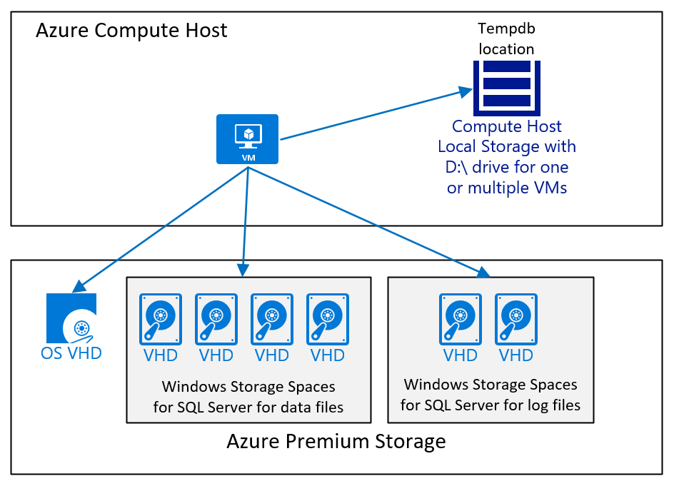

# SQL Server Azure Virtual Machines DBMS deployment for SAP NetWeaver


[Logo_Linux]:media/virtual-machines-shared-sap-shared/Linux.png
[Logo_Windows]:media/virtual-machines-shared-sap-shared/Windows.png


This document covers several different areas to consider when deploying SQL Server for SAP workload in Azure IaaS. As a precondition to this document, you should have read the document [Considerations for Azure Virtual Machines DBMS deployment for SAP workload](./dbms-guide-general.md) and other guides in the [SAP workload on Azure documentation](./get-started.md). 


> [!IMPORTANT]
> The scope of this document is the Windows version on SQL Server. SAP is not supporting the Linux version of SQL Server with any of the SAP software. The document is not discussing Microsoft Azure SQL Database, which is a Platform as a Service offer of the Microsoft Azure Platform. The discussion in this paper is about running the SQL Server product as it's known for on-premises deployments in Azure Virtual Machines, leveraging the Infrastructure as a Service capability of Azure. Database capabilities and functionality between these two offers are different and should not be mixed up with each other. For more information, see [Azure SQL Database](https://azure.microsoft.com/services/sql-database/).

In general, you should consider using the most recent SQL Server releases to run SAP workload in Azure IaaS. The latest SQL Server releases offer better integration into some of the Azure services and functionality. Or have changes that optimize operations in an Azure IaaS infrastructure. 

General documentation about SQL Server running in Azure VMs can be found in these articles:

- [SQL Server on Azure Virtual Machines (Windows)](/azure/azure-sql/virtual-machines/windows/sql-server-on-azure-vm-iaas-what-is-overview)
- [Automate management with the Windows SQL Server IaaS Agent extension](/azure/azure-sql/virtual-machines/windows/sql-server-iaas-agent-extension-automate-management)
- [Configure Azure Key Vault integration for SQL Server on Azure VMs (Resource Manager)](/azure/azure-sql/virtual-machines/windows/azure-key-vault-integration-configure)
- [Checklist: Best practices for SQL Server on Azure VMs](/azure/azure-sql/virtual-machines/windows/performance-guidelines-best-practices-checklist)
- [Storage: Performance best practices for SQL Server on Azure VMs](/azure/azure-sql/virtual-machines/windows/performance-guidelines-best-practices-storage)
- [HADR configuration best practices (SQL Server on Azure VMs)](/azure/azure-sql/virtual-machines/windows/hadr-cluster-best-practices)

Not all the content and statements made in the general SQL Server in Azure VM documentation applies to SAP workload. But, the documentation gives a good impression on the principles. an example for functionality not supported for SAP workload is the usage of FCI clustering.

There's some SQL Server in IaaS specific information you should know before continuing:

* **SQL Version Support**: Even with SAP Note [#1928533](https://launchpad.support.sap.com/#/notes/1928533) stating that the minimum supported SQL Server release is SQL Server 2008 R2, the window of supported SQL Server versions on Azure is also dictated by SQL Server's lifecycle. SQL Server 2012 extended maintenance ended mid of 2022. As a result, the current minimum release for newly deployed systems should be [SQL Server 2014](/lifecycle/products/sql-server-2014). The more recent, the better. The latest SQL Server releases offer better integration into some of the Azure services and functionality. Or have changes that optimize operations in an Azure IaaS infrastructure. 
* **Using Images from Azure Marketplace**: The fastest way to deploy a new Microsoft Azure VM is to use an image from the Azure Marketplace. There are images in the Azure Marketplace, which contain the most recent SQL Server releases. The images where SQL Server already is installed can't be immediately used for SAP NetWeaver applications. The reason is the default SQL Server collation is installed within those images and not the collation required by SAP NetWeaver systems. In order to use such images, check the steps documented in chapter [Using a SQL Server image out of the Microsoft Azure Marketplace](./dbms-guide-sqlserver.md). 
*  **SQL Server multi-instance support within a single Azure VM**: This deployment method is supported. However, be aware of resource limitations, especially around network and storage bandwidth of the VM type that you're using. Detailed information is available in article [Sizes for virtual machines in Azure](../../virtual-machines/sizes.md). These quota limitations might prevent you to implement the same multi-instance architecture as you can implement on-premises. As of the configuration and interference of sharing the resources available within a single VM, the same considerations as on-premises need to be taken into account.
*  **Multiple SAP databases in one single SQL Server instance in a single VM**: Configurations like these are supported. Considerations of multiple SAP databases sharing the shared resources of a single SQL Server instance are the same as for on-premises deployments. Keep other limits like number of disks that can be attached to a specific VM type in mind. Or network and storage quota limits of specific VM types as detailed [Sizes for virtual machines in Azure](../../virtual-machines/sizes.md). 


## Recommendations on VM/VHD structure for SAP-related SQL Server deployments
In accordance with the general description, Operating system, SQL Server executables, the SAP executables should be located or installed separate Azure disks. Typically, most of the SQL Server system databases aren't utilized at a high level by SAP NetWeaver workload. Nevertheless the system databases of SQL Server should be, together with the other SQL Server directories on a separate Azure disk. SQL Server tempdb should be either located on the nonperisisted D:\ drive or on a separate disk.


* With all SAP certified VM types (see SAP Note [#1928533](https://launchpad.support.sap.com/#/notes/1928533)), tempdb data, and log files can be placed on the non-persisted D:\ drive. 
* With SQL Server releases, where SQL Server installs tempdb with one data file by default, it's recommended to use multiple tempdb data files. Be aware D:\ drive volumes are different in size and capabilities based on the VM type. For exact sizes of the D:\ drive of the different VMs, check the article [Sizes for Windows virtual machines in Azure](../../virtual-machines/sizes.md).

These configurations enable tempdb to consume more space and more important more I/O operations per second (IOPS) and storage bandwidth than the system drive is able to provide. The nonpersistent D:\ drive also offers better I/O latency and throughput. In order to determine the proper tempdb size, you can check the tempdb sizes on existing systems. 

>[!NOTE]
> in case you place tempdb data files and log file into a folder on D:\ drive that you created, you need to make sure that the folder does exist after a VM reboot. Since the D:\ drive can be freshly initialized after a VM reboot all file and directory structures could be wiped out. A possibility to recreate eventual directory structures on D:\ drive before the start of the SQL Server service is documented in [this article](https://cloudblogs.microsoft.com/sqlserver/2014/09/25/using-ssds-in-azure-vms-to-store-sql-server-tempdb-and-buffer-pool-extensions/).

A VM configuration, which runs SQL Server with an SAP database and where tempdb data and tempdb logfile are placed on the D:\ drive and Azure premium storage v1 or v2 would look like:



The diagram displays a simple case. As eluded to in the article [Considerations for Azure Virtual Machines DBMS deployment for SAP workload](dbms-guide-general.md), Azure storage type, number, and size of disks is dependent from different factors. But in general we recommend:

- For smaller and mid-range deployments, using one large volume, which contains the SQL Server data files. Reason behind this configuration is that it's easier to deal with different I/O workloads in case the SQL Server data files don't have the same free space. Whereas in large deployments, especially deployments where the customer moved with a heterogenous database migration to SQL Server in Azure, we used separate disks and then distributed the data files across those disks. Such an architecture is only successful when each disk has the same number of data files, all the data files are the same size, and roughly have the same free space.
- Use the D:\drive for tempdb as long as performance is good enough. If the overall workload is limited in performance by tempdb located on the D:\ drive, you need to move tempdb to Azure premium storage v1 or v2, or Ultra disk as recommended in [this article](/azure/azure-sql/virtual-machines/windows/performance-guidelines-best-practices-checklist).

SQL Server proportional fill mechanism distributes reads and writes to all datafiles evenly provided all SQL Server data files are the same size and have the same frees pace. SAP on SQL Server will deliver the best performance when reads and writes are distributed evenly across all available datafiles. If a database has too few datafiles or the existing data files are highly unbalanced, the best method to correct is an R3load export and import.  An R3load export and import involves downtime and should only be done if there's an obvious performance problem that needs to be resolved. If the datafiles are only moderately different sizes, increase all datafiles to the same size, and SQL Server will rebalance data over time. SQL Server will automatically grow datafiles evenly if trace flag 1117 is set or if SQL Server 2016 or higher is used. 


### Special for M-Series VMs
For Azure M-Series VM, the latency writing into the transaction log can be reduced, compared to Azure premium storage performance v1, when using Azure Write Accelerator. If the latency provided by premium storage v1 is limiting scalability of the SAP workload, the disk that stores the SQL Server transaction log file can be enabled for Write Accelerator. Details can be read in the document [Write Accelerator](../../virtual-machines/how-to-enable-write-accelerator.md). Azure Write Accelerator doesn't work with Azure premium storage v2 and Ultra disk. In both cases, the latency is better than what Azure premium storage v1 delivers.
  

### Formatting the disks
For SQL Server, the NTFS block size for disks containing SQL Server data and log files should be 64 KB. There's no need to format the D:\ drive. This drive comes pre-formatted.

To avoid that the restore or creation of databases is initializing the data files by zeroing the content of the files, make sure that the user context the SQL Server service is running in has the User Right **Perform volume maintenance tasks**. For more information, see [Database instant file initialization](/sql/relational-databases/databases/database-instant-file-initialization).

## SQL Server 2014 and more recent - Storing Database Files directly on Azure Blob Storage
 SQL Server 2014 and later releases open the possibility to store database files directly on Azure Blob Store without the 'wrapper' of a VHD around them. This functionality was meant to address shortcomings of Azure block storage years back. These days, it isn't recommended to use this deployment method and instead choose either Azure premium storage v1, premium storage v2, or Ultra disk. Dependent on the requirements.
 
## SQL Server 2014 Buffer Pool Extension
SQL Server 2014 introduced a new feature, which is called [Buffer Pool Extension](/sql/database-engine/configure-windows/buffer-pool-extension). This functionality though tested under SAP workload on Azure didn't provide improvement in hosting workload. Therefore, it shouldn't be considered 

## Backup/Recovery considerations for SQL Server
Deploying SQL Server into Azure, you need to review your backup architecture. Even if the system isn't a production system, the SAP database hosted by SQL Server must be backed up periodically. Since Azure Storage keeps three images, a backup is now less important in respect to compensating a storage crash. The priority reason for maintaining a proper backup and recovery plan is more that you can compensate for logical/manual errors by providing point in time recovery capabilities. The goal is to either use backups to restore the database back to a certain point in time. Or to use the backups in Azure to seed another system by copying the existing database. 

There are several ways to back up and restore SQL Server databases in Azure. To get the best overview and details, read the document [Backup and restore for SQL Server on Azure VMs](/azure/azure-sql/virtual-machines/windows/backup-restore). The article covers several different possibilities.

## Using a SQL Server image out of the Microsoft Azure Marketplace
Microsoft offers VMs in the Azure Marketplace, which already contain versions of SQL Server. For SAP customers who require licenses for SQL Server and Windows, using these images might be an opportunity to cover the need for licenses by spinning up VMs with SQL Server already installed. In order to use such images for SAP, the following considerations need to be made:

* The SQL Server non-evaluation versions acquire higher costs than a 'Windows-only' VM deployed from Azure Marketplace. To compare prices, see [Windows Virtual Machines Pricing](https://azure.microsoft.com/pricing/details/virtual-machines/windows/) and [SQL Server Enterprise Virtual Machines Pricing](https://azure.microsoft.com/pricing/details/virtual-machines/sql-server-enterprise/).
* You only can use SQL Server releases, which are supported by SAP.
* The collation of the SQL Server instance, which is installed in the VMs offered in the Azure Marketplace isn't the collation SAP NetWeaver requires the SQL Server instance to run. You can change the collation though with the directions in the following section.

### Changing the SQL Server Collation of a Microsoft Windows/SQL Server VM
Since the SQL Server images in the Azure Marketplace aren't set up to use the collation, which is required by SAP NetWeaver applications, it needs to be changed immediately after the deployment. For SQL Server, this change of collation can be done with the following steps as soon as the VM has been deployed and an administrator is able to log into the deployed VM:

* Open a Windows Command Window, as administrator.
* Change the directory to C:\Program Files\Microsoft SQL Server\110\Setup Bootstrap\SQLServer2012.
* Execute the command: Setup.exe /QUIET /ACTION=REBUILDDATABASE /INSTANCENAME=MSSQLSERVER /SQLSYSADMINACCOUNTS=`<local_admin_account_name`> /SQLCOLLATION=SQL_Latin1_General_Cp850_BIN2   
  * `<local_admin_account_name`> is the account, which was defined as the administrator account when deploying the VM for the first time through the gallery.

The process should only take a few minutes. In order to make sure whether the step ended up with the correct result, perform the following steps:

* Open SQL Server Management Studio.
* Open a Query Window.
* Execute the command sp_helpsort in the SQL Server master database.

The desired result should look like:

```output
Latin1-General, binary code point comparison sort for Unicode Data, SQL Server Sort Order 40 on Code Page 850 for non-Unicode Data
```

If the result is different, STOP any deployment and investigate why the setup command didn't work as expected. Deployment of SAP NetWeaver applications onto SQL Server instance with different SQL Server codepages than the one mentioned is **NOT** supported for NetWeaver deployments.

## SQL Server High-Availability for SAP in Azure
Using SQL Server in Azure IaaS deployments for SAP, you have several different possibilities to add to deploy the DBMS layer highly available. Azure provides different up-time SLAs for a single VM using different Azure block storages, a pair of VMs deployed in an Azure availability set, or a pair of VMs deployed across Azure Availability Zones. For production systems, we expect you to deploy a pair of VMs within an virtual machine scale set with flexible orchestration across two availability zones. See [comparison of different deployment types for SAP workload](./sap-high-availability-architecture-scenarios.md#comparison-of-different-deployment-types-for-sap-workload) for more information. One VM will run the active SQL Server Instance. The other VM will run the passive instance

### SQL Server Clustering using Windows Scale-out File Server or Azure shared disk
With Windows Server 2016, Microsoft introduced [Storage Spaces Direct](/windows-server/storage/storage-spaces/storage-spaces-direct-overview). Based on Storage Spaces, Direct Deployment, SQL Server FCI clustering is supported in general. Azure also offers [Azure shared disks](../../virtual-machines/disks-shared-enable.md?tabs=azure-cli) that could be used for Windows clustering. **For SAP workload, we aren't supporting these HA options.** 

### SQL Server Log Shipping
One high availability functionality is SQL Server log shipping. If the VMs participating in the HA configuration have working name resolution, there's no problem. The setup in Azure doesn't differ from any setup that is done on-premises related to setting up log shipping and the principles around log shipping. Details of SQL Server log shipping can be found in the article [About Log Shipping (SQL Server)](/sql/database-engine/log-shipping/about-log-shipping-sql-server). 

The SQL Server log shipping functionality was hardly used in Azure to achieve high availability within one Azure region. However in the following scenarios SAP customers were using log shipping successful with Azure:

- Disaster Recovery scenarios from one Azure region into another Azure region
- Disaster Recovery configuration from on-premises into an Azure region
- Cut-over scenarios from on-premises to Azure. In those cases, log shipping is used to synchronize the new DBMS deployment in Azure with the ongoing production system on-premises. At the time of cutting over, production is shut down and it's made sure that the last and latest transaction log backups got transferred to the Azure DBMS deployment. Then the Azure DBMS deployment is opened up for production.  


### SQL Server Always On
As Always On is supported for SAP on-premises (see SAP Note [#1772688](https://launchpad.support.sap.com/#/notes/1772688)), it's supported in combination with SAP in Azure. There are some special considerations around deploying the SQL Server Availability Group Listener (not to be confused with the Azure Availability Set). Therefore, some different installation steps are necessary.

Some considerations using an Availability Group Listener are:

* Using an Availability Group Listener is only possible with Windows Server 2012 or higher as guest OS of the VM. For Windows Server 2012, ensure that the [update to enable SQL Server Availability Group Listeners on Windows Server 2008 R2 and Windows Server 2012-based Microsoft Azure virtual machines](https://support.microsoft.com/kb/2854082) has been applied.
* For Windows Server 2008 R2, this patch doesn't exist. In this case, Always On would need to be used in the same manner as Database Mirroring. By specifying a failover partner in the connections string (done through the SAP default.pfl parameter dbs/mss/server - see SAP Note [#965908](https://launchpad.support.sap.com/#/notes/965908)).
* Using an Availability Group Listener, you need to connect the Database VMs to a dedicated Load Balancer. You should assign static IP addresses to the network interfaces of those VMs in the Always On configuration (defining a static IP address is described in [this article](../../virtual-network/virtual-networks-static-private-ip-arm-ps.md)). Static IP addresses compared to DHCP are preventing the assignment of new IP addresses in cases where both VMs might be stopped.
* There are special steps required when building the WSFC cluster configuration where the cluster needs a special IP address assigned, because Azure with its current functionality would assign the cluster name the same IP address as the node the cluster is created on. This behavior means a manual step must be performed to assign a different IP address to the cluster.
* The Availability Group Listener is going to be created in Azure with TCP/IP endpoints, which are assigned to the VMs running the primary and secondary replicas of the Availability group.
* There might be a need to secure these endpoints with ACLs.

Detailed documentation on deploying Always On with SQL Server in Azure VMs lists like:

- [Introducing SQL Server Always On availability groups on Azure virtual machines](/azure/azure-sql/virtual-machines/windows/availability-group-overview).
- [Configure an Always On availability group on Azure virtual machines in different regions](/azure/azure-sql/virtual-machines/windows/availability-group-manually-configure-multiple-regions).
- [Configure a load balancer for an Always On availability group in Azure](/azure/azure-sql/virtual-machines/windows/availability-group-load-balancer-portal-configure).
- [HADR configuration best practices (SQL Server on Azure VMs)](/azure/azure-sql/virtual-machines/windows/hadr-cluster-best-practices)


>[!NOTE]
>Reading [Introducing SQL Server Always On availability groups on Azure virtual machines](/azure/azure-sql/virtual-machines/windows/availability-group-overview), you're going to read about SQL Server's [Direct Network Name (DNN) listener](/azure/azure-sql/virtual-machines/windows/availability-group-distributed-network-name-dnn-listener-configure). This new functionality got introduced with SQL Server 2019 CU8. This new functionality makes the usage of an Azure load balancer handling the virtual IP address of the Availability Group Listener obsolete.


SQL Server Always On is the most common used high availability and disaster recovery functionality used in Azure for SAP workload deployments. Most customers use Always On for high availability within a single Azure Region. If the deployment is restricted to two nodes only, you have two choices for connectivity:

- Using the Availability Group Listener. With the Availability Group Listener, you're required to deploy an Azure load balancer. 
- With SQL Server 2016 SP3, SQL Server 2017 CU 25, or SQL Server 2019 CU8 or more recent SQL Server releases on Windows Server 2016 or later you can use the [Direct Network Name (DNN) listener](/azure/azure-sql/virtual-machines/windows/availability-group-distributed-network-name-dnn-listener-configure) instead of an Azure load balancer. DNN is eliminating the requirement to us an Azure load balancer.


Using the connectivity parameters of SQL Server Database Mirroring should only be considered for round of investigating issues with the other two methods. In this case, you need to configure the connectivity of the SAP applications in a way where both node names are named. Exact details of such an SAP side configuration is documented in SAP Note [#965908](https://launchpad.support.sap.com/#/notes/965908). By using this option, you would have no need to configure an Availability Group listener. And with that no Azure load balancer and with that could investigate issues of those components. But recall, this option only works if you restrict your Availability Group to span two instances.  

Most customers are using the SQL Server Always On functionality for disaster recovery functionality between Azure regions. Several customers also use the ability to perform backups from a secondary replica. 

## SQL Server Transparent Data Encryption
Many customers are using SQL Server [Transparent Data Encryption (TDE)](/sql/relational-databases/security/encryption/transparent-data-encryption) when deploying their SAP SQL Server databases in Azure. The SQL Server TDE functionality is fully supported by SAP (see SAP Note [#1380493](https://launchpad.support.sap.com/#/notes/1380493)). 

### Applying SQL Server TDE
In cases where you perform a heterogeneous migration from another DBMS, running on-premises, to Windows/SQL Server running in Azure, you should create your empty target database in SQL Server ahead of time. As next step you would apply SQL Server TDE functionality against this empty database. Reason you want to perform in this sequence is that the process of encrypting the empty database can take quite a while. The SAP import processes would then import the data into the encrypted database during the downtime phase. The overhead of importing into an encrypted database has a way lower time impact than encrypting the database after the export phase in the down time phase. Negative experiences were made when trying to apply TDE with SAP workload running on top of the database. Therefore, recommendation is treating the deployment of TDE as an activity that needs to be done with no or low SAP workload on the particular database. From SQL Server 2016 on, you can stop and resume the TDE scan that performs the initial encryption. The document [Transparent Data Encryption (TDE)](/sql/relational-databases/security/encryption/transparent-data-encryption) describes the command and details.

In cases where you move SAP SQL Server databases from on-premises into Azure, we recommend testing on which infrastructure you can get the encryption applied fastest. For this case, keep these facts in mind:

- You can't define how many threads are used to apply data encryption to the database. The number of threads is majorly dependent on the number of disk volumes the SQL Server data and log files are distributed over. Means the more distinct volumes (drive letters), the more threads will be engaged in parallel to perform the encryption. Such a configuration contradicts a bit with earlier disk configuration suggestion on building one or a smaller number of storage spaces for the SQL Server database files in Azure VMs. A configuration with a few volumes would lead to a few threads executing the encryption. A single thread encrypting is reading 64 KB extents, encrypts it and then write a record into the transaction log file, telling that the extent got encrypted. As a result the load on the transaction log is moderate.
- In older SQL Server releases, backup compression didn't get efficiency anymore when you encrypted your SQL Server database. This behavior could develop into an issue when your plan was to encrypt your SQL Server database on-premises and then copy a backup into Azure to restore the database in Azure. SQL Server backup compression can achieve a compression ratio of factor 4.
- With SQL Server 2016, SQL Server introduced new functionality that allows compressing backup of encrypted databases as well in an efficient manner. See [this blog](/archive/blogs/sqlcat/sqlsweet16-episode-1-backup-compression-for-tde-enabled-databases) for some details.
 

### Using Azure Key Vault
Azure offers the service of a [Key Vault](https://azure.microsoft.com/services/key-vault/) to store encryption keys. SQL Server on the other side offer a connector to use Azure Key Vault as store for the TDE certificates.

More details to use Azure Key Vault for SQL Server TDE lists like:

- [Configure Azure Key Vault integration for SQL Server on Azure VMs (Resource Manager)](/azure/azure-sql/virtual-machines/windows/azure-key-vault-integration-configure).
- [More Questions From Customers About SQL Server Transparent Data Encryption – TDE + Azure Key Vault](/archive/blogs/saponsqlserver/more-questions-from-customers-about-sql-server-transparent-data-encryption-tde-azure-key-vault).


>[!IMPORTANT]
>Using SQL Server TDE, especially with Azure key Vault, it's recommended to use the latest patches of SQL Server 2014, SQL Server 2016, and SQL Server 2017. Reason is that based on customer feedback, optimizations and fixes got applied to the code. As an example, check [KBA #4058175](https://support.microsoft.com/help/4058175/tde-enabled-backup-and-restore-slow-if-encryption-key-is-stored-in-ekm).
>  

## Minimum deployment configurations
In this section, we suggest a set of minimum configurations for different sizes of databases under SAP workload. It's too difficult to assess whether these sizes fit your specific workload. In some cases, we might be generous on memory compared to the database size. On the other side, the disk sizing might be too low for some of the workloads. Therefore, these configurations should be treated as what they are. They're configurations that should give you a point to start with. Configurations to fine-tune to your specific workload and cost efficiency requirements.

An example of a configuration for a little SQL Server instance with a database size between 50 GB – 250 GB could look like

| Configuration | DBMS VM | Comments |
| --- | --- | --- |
| VM Type | E4s_v3/v4/v5 (4 vCPU/32 GiB RAM) | |
| Accelerated Networking | Enable | |
| SQL Server version | SQL Server 2019 or more recent | |
| # of data files | 4 | |
| # of log files | 1 | |
| # of temp data files | 4 or default since SQL Server 2016 | |
| Operating system | Windows Server 2019 or more recent | |
| Disk aggregation | Storage Spaces if desired | |
| File system | NTFS | |
| Format block size | 64 KB | |
| # and type of data disks | Premium storage v1: 2 x P10 (RAID0) <br /> Premium storage v2: 2 x 150 GiB (RAID0) - default IOPS and throughput | Cache = Read Only for premium storage v1 |
| # and type of log disks | Premium storage v1: 1 x P20 <br /> Premium storage v2: 1 x 128 GiB - default IOPS and throughput | Cache = NONE |
| SQL Server max memory parameter | 90% of Physical RAM | Assuming single instance |


An example of a configuration or a small SQL Server instance with a database size between 250 GB – 750 GB, such as a smaller SAP Business Suite system, could look like

| Configuration | DBMS VM | Comments |
| --- | --- | --- | 
| VM Type | E16s_v3/v4/v5 (16 vCPU/128 GiB RAM) | |
| Accelerated Networking | Enable | |
| SQL Server version | SQL Server 2019 or more recent | |
| # of data files | 8 | |
| # of log files | 1 | |
| # of temp data files | 8 or default since SQL Server 2016 | |
| Operating system | Windows Server 2019 or more recent | |
| Disk aggregation | Storage Spaces if desired | |
| File system | NTFS | |
| Format block size | 64 KB | |
| # and type of data disks | Premium storage v1: 4 x P20 (RAID0) <br /> Premium storage v2: 4 x 100 GiB - 200 GiB (RAID0) - default IOPS and 25 MB/sec extra throughput per disk | Cache = Read Only for premium storage v1 |
| # and type of log disks | Premium storage v1: 1 x P20 <br /> Premium storage v2: 1 x 200 GiB - default IOPS and throughput | Cache = NONE |
| SQL Server max memory parameter | 90% of Physical RAM | Assuming single instance |

An example of a configuration for a medium SQL Server instance with a database size between 750 GB – 2,000 GB, such as a medium SAP Business Suite system, could look like

| Configuration | DBMS VM | Comments |
| --- | --- | --- | 
| VM Type | E64s_v3/v4/v5 (64 vCPU/432 GiB RAM) | |
| Accelerated Networking | Enable | |
| SQL Server version | SQL Server 2019 or more recent | |
| # of data devices | 16 | |
| # of log devices | 1 | |
| # of temp data files | 8 or default since SQL Server 2016 | |
| Operating system | Windows Server 2019 or more recent | |
| Disk aggregation | Storage Spaces if desired | |
| File system | NTFS | |
| Format block size | 64 KB | |
| # and type of data disks | Premium storage v1: 4 x P30 (RAID0) <br /> Premium storage v2: 4 x 250 GiB - 500 GiB - plus 2,000 IOPS and 75 MB/sec throughput per disk | Cache = Read Only for premium storage v1 |
| # and type of log disks | Premium storage v1: 1 x P20 <br /> Premium storage v2: 1 x 400 GiB - default IOPS and 75MB/sec extra throughput | Cache = NONE |
| SQL Server max memory parameter | 90% of Physical RAM |  Assuming single instance |

An example of a configuration for a larger SQL Server instance with a database size between 2,000 GB and 4,000 GB, such as a larger SAP Business Suite system, could look like

| Configuration | DBMS VM | Comments |
| --- | --- | --- | 
| VM Type | E96(d)s_v5 (96 vCPU/672 GiB RAM) | |
| Accelerated Networking | Enable | |
| SQL Server version | SQL Server 2019 or more recent | |
| # of data devices | 24 | |
| # of log devices | 1 | |
| # of temp data files | 8 or default since SQL Server 2016 | |
| Operating system | Windows Server 2019 or more recent | |
| Disk aggregation | Storage Spaces if desired | |
| File system | NTFS | |
| Format block size | 64 KB | |
| # and type of data disks | Premium storage v1: 4 x P30 (RAID0) <br /> Premium storage v2: 4 x 500 GiB - 800 GiB - plus 2500 IOPS and 100 MB/sec throughput per disk | Cache = Read Only for premium storage v1 |
| # and type of log disks | Premium storage v1: 1 x P20 <br /> Premium storage v2: 1 x 400 GiB - plus 1,000 IOPS and 75MB/sec extra throughput | Cache = NONE |
| SQL Server max memory parameter | 90% of Physical RAM | Assuming single instance |


An example of a configuration for a large SQL Server instance with a database size of 4 TB+, such as a large globally used SAP Business Suite system, could look like

| Configuration | DBMS VM | Comments |
| --- | --- | ---  |
| VM Type | M-Series (1.0 to 4.0 TB RAM)  | |
| Accelerated Networking | Enable | |
| SQL Server version | SQL Server 2019 or more recent | |
| # of data devices | 32 | |
| # of log devices | 1 | |
| # of temp data files | 8 or default since SQL Server 2016 | |
| Operating system | Windows Server 2019 or more recent | |
| Disk aggregation | Storage Spaces if desired  | |
| File system | NTFS | |
| Format block size | 64 KB | |
| # and type of data disks | Premium storage v1: 4+ x P40 (RAID0) <br /> Premium storage v2: 4+ x 1,000 GiB - 4,000 GiB - plus 4,500 IOPS and 125 MB/sec throughput per disk | Cache = Read Only for premium storage v1 |
| # and type of log disks | Premium storage v1: 1 x P30 <br /> Premium storage v2: 1 x 500 GiB - plus 2,000 IOPS and 125 MB/sec throughput | Cache = NONE |
| SQL Server max memory parameter | 95% of Physical RAM | Assuming single instance |

As an example, this configuration is the DBMS VM configuration of an SAP Business Suite on SQL Server. This VM hosts the 30TB database of the single global SAP Business Suite instance of a global company with over $200B annual revenue and over 200K full time employees. The system runs all the financial processing, sales and distribution processing and many more business processes out of different areas, including North American payroll. The system is running in Azure since the beginning of 2018 using Azure M-series VMs as DBMS VMs. As high availability the system is using Always on with one synchronous replica in another Availability Zone of the same Azure region and another asynchronous replica in another Azure region. The NetWeaver application layer is deployed in Ev4 VMs. 

| Configuration | DBMS VM | Comments |
| --- | --- | --- |
| VM Type | M192dms_v2  (192 vCPU/4,196 GiB RAM)  | |
| Accelerated Networking | Enabled | |
| SQL Server version | SQL Server 2019 | |
| # of data files | 32 | |
| # of log files | 1 | |
| # of temp data files | 8  | |
| Operating system | Windows Server 2019 | |
| Disk aggregation | Storage Spaces | |
| File system | NTFS | |
| Format block size | 64 KB | |
| # and type of data disks | Premium storage v1: 16 x P40 | Cache = Read Only |
| # and type of log disks | Premium storage v1: 1 x P60  | Using Write Accelerator |
| # and type of tempdb disks | Premium storage v1: 1 x P30 | No caching |
| SQL Server max memory parameter | 95% of Physical RAM | |


## <a name="9053f720-6f3b-4483-904d-15dc54141e30"></a>General SQL Server for SAP on Azure Summary
There are many recommendations in this guide and we recommend you read it more than once before planning your Azure deployment. In general, though, be sure to follow the top general DBMS on Azure-specific recommendations:

1. Use the latest DBMS release, like SQL Server 2019, that has the most advantages in Azure. 
2. Carefully plan your SAP system landscape in Azure to balance the data file layout and Azure restrictions:
   * Don't have too many disks, but have enough to ensure you can reach your required IOPS.
      * Only stripe across disks if you need to achieve a higher throughput.
3. Never install software or put any files that require persistence on the D:\ drive as it's non-permanent and anything on this drive can be lost at a Windows reboot or VM restart.
6. Use your DBMS vendor's HA/DR solution to replicate database data.
7. Always use Name Resolution, don't rely on IP addresses.
8. Using SQL Server TDE, apply the latest SQL Server patches.
10. Be careful using SQL Server images from the Azure Marketplace. If you use the SQL Server one, you must change the instance collation before installing any SAP NetWeaver system on it.
11. Install and configure the SAP Host Monitoring for Azure as described in [Deployment Guide](./deployment-guide.md).


## Next steps
Read the article 

- [Considerations for Azure Virtual Machines DBMS deployment for SAP workload](dbms-guide-general.md)
