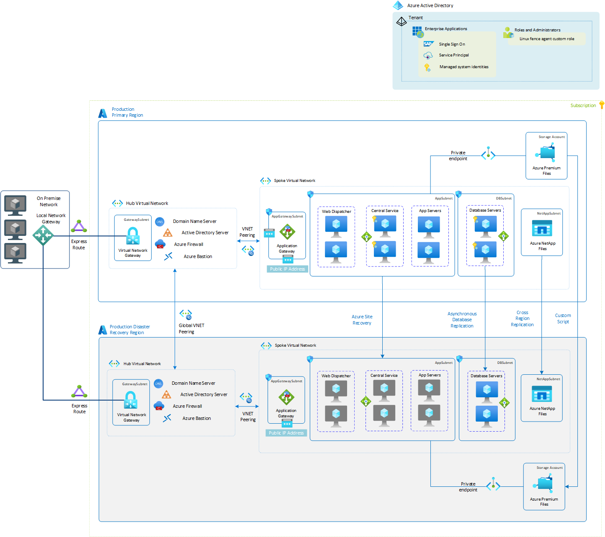

# Disaster recovery overview and infrastructure guidelines for SAP workload

Many organizations running critical business applications on Azure set up both High Availability (HA) and Disaster Recovery (DR) strategy. The purpose of high availability is to increase the SLA of business systems by eliminating single points of failure in the underlying system infrastructure. High Availability technologies reduce the effect of unplanned infrastructure failure and help with planned maintenance. Disaster Recovery is defined as policies, tools and procedures to enable the recovery or continuation of vital technology infrastructure and systems following a geographically widespread natural or human-induced disaster.

To achieve [high availability for SAP workload on Azure](sap-high-availability-guide-start.md), virtual machines are typically deployed in an [availability set](planning-guide.md#availability-sets), [availability zones](planning-guide.md#availability-zones) or in [flexible scale set](./virtual-machine-scale-set-sap-deployment-guide.md) to protect applications from infrastructure maintenance or failure within region. But the deployment doesn’t protect applications from widespread disaster within region. So to protect applications from regional disaster, disaster recovery strategy for the applications should be in place. Disaster recovery is a documented and structured approach that is designed to assist an  organization in executing the recovery processes in response to a disaster, and to protect or minimize IT services disruption and promote recovery.

This document provides details on protecting SAP workloads from large scale catastrophe by implementing structured DR approach. The details in this document are presented at an abstract level, based on different Azure services and SAP components. Exact DR strategy and the order of recovery for your SAP workload must be tested, documented and fine tuned regularly. Also, the document focuses on the Azure-to-Azure DR strategy for SAP workload.

## General disaster recovery plan considerations

SAP workload on Azure runs on virtual machines in combination with different Azure services to deploy different layers (central services, application servers, database server) of a typical SAP NetWeaver application. In general, a DR strategy should be planned for the entire IT landscape running on Azure, which means to take into account non-SAP applications as well. The business solution running in SAP systems may not run as whole, if the dependent services or assets aren't recovered on the DR site. So you need to come up with a well-defined comprehensive DR plan considering all the components and systems.

For DR on Azure, organizations should consider different scenarios that may trigger failover.

- SAP application or business process availability.
- Azure services (like virtual machines, storage, load balancer etc.) unavailability within a region due to widespread failure.
- Potential threats and vulnerabilities to the application (for example, Application layer DDoS attack)
- Business compliance required operational tasks to test DR strategy (for example, DR failure exercise to be performed every year as per compliance).

To achieve the recovery goal for different scenarios, organization must outline Recovery Time Objective (RTO) and Recovery Point Objective (RPO) for their workload based on the business requirements. RTO describes the amount of time application can be down, typically measured in hours, minutes or seconds. Whereas RPO describes the amount of transactional data that is acceptable by business to lose in order for normal operations to resume. Identifying RTO and RPO of your business is crucial, as it would help you design your DR strategy optimally. The components (compute, storage, database etc.) involved in SAP workload are replicated to the DR region using different techniques (Azure native services, native DB replication technology, custom scripts). Each technique provides different RPO, which must be accounted for when designing a DR strategy. On Azure, you can use some of the Azure native services like Azure Site Recovery, Azure Backup that can help you to meet RTO and RPO of your SAP workloads. Refer to SLA of [Azure Site Recovery](https://azure.microsoft.com/support/legal/sla/site-recovery/v1_2/) and [Azure Backup](https://azure.microsoft.com/support/legal/sla/backup/v1_0/) to optimally align with your RTO and RPO.

## Design consideration for disaster recovery on Azure

There are different elements to consider when designing a disaster recovery solution on Azure. The principles and concepts that are considered to design on-premises disaster recovery solutions apply to Azure as well. But in Azure, region selection is a key part in design strategy for disaster recovery. So, keep the following points in mind when choosing DR region on Azure.

- Business or regulatory compliance requirements may specify a distance requirement between a primary and disaster recovery site. A distance requirement helps to provide availability if a natural disaster occurs in a wider geography. In such case, an organization can choose another Azure region as their disaster recovery site. Azure regions are often separated by a large distance that might be hundreds or even thousands of kilometers like in the United States. Because of the distance, the network roundtrip latency will be higher, which may result into higher RPO.

- Customers who want to mimic their on-premises metro DR strategy on Azure can use [availability zones for disaster recovery](../../site-recovery/azure-to-azure-how-to-enable-zone-to-zone-disaster-recovery.md). But zone-to-zone DR strategy may fall short of resilience requirement if there’s geographically widespread natural disaster.

- On Azure, each region is paired with another region within the same geography (except for Brazil South). This approach allows for platform provided replication of resources across region. The benefit of choosing paired region can be found in [region pairs document](../../virtual-machines/regions.md#region-pairs). When an organization chooses to use Azure paired regions several additional points for an SAP workload needs to be considered:  

  - Not all Azure services offer cross-regional replication in paired region.
  - The Azure services and features in paired Azure regions may not be symmetrical. For example, Azure NetApp Files, VM SKUs like M-Series available in the Primary region might not be available in the paired region. To check if the Azure product or services is available in a region, see [Azure Products by Region](https://azure.microsoft.com/global-infrastructure/services/).

  - GRS option is available for storage account with standard storage type that replicates data to paired region. But standard storage isn't suitable for SAP DBMS or virtual data disks.
  
  - The Azure backup service used to back up [supported solutions](../../backup/backup-overview.md#what-can-i-back-up) can replicate backups only between paired regions. For all your other data, run your own replications with native DBMS features like SQL Server Always On, SAP HANA System Replication, and other services. Use a combination of Azure Site Recovery, rsync or robocopy, and other third-party software for the SAP application layer.

## Reference SAP workload deployment

After identifying a DR region, it's important that the breadth of Azure core services (like network, compute, storage) you've configured in primary region is available and can be configured in DR region. Organization must develop a DR deployment pattern for SAP workload. The deployment pattern varies and must align with the organization's needs.  

- Deploy production SAP workload into your primary region and non-production workload into disaster recovery region.
- Deploy all SAP workload (production and non-production) into your primary region. Disaster recovery region is only used if there's a failover.

The following reference architecture shows typical SAP NetWeaver system running on Azure along with high availability in primary region. The secondary site shown down below is the disaster recovery site where the SAP systems will be restored after a disaster event. Both primary and disaster recovery regions are part of the same subscription. To achieve DR for SAP workload, you need to identify recovery strategy for each SAP layer along with the different Azure services that the application uses.  

Organizations should plan and design a DR strategy for their entire IT landscape. Usually SAP systems running in production environment are integrated with different services and interfaces like Active directory, DNS, third-party application, and so on. So you must include the non-SAP systems and other services in your disaster recovery planning as well. This document focuses on the recovery planning for SAP applications. But you can expand the size and scope of the DR planning for dependent components to fit your requirements.

## Infrastructure components of DR solution for SAP workload

An SAP workload running on Azure uses different infrastructure components to run a business solution. To plan DR for such solution, it's essential that all infrastructure components configured in the primary region are available, and can be configured in the DR region as well. Following infrastructure components should be factored in when designing DR solution for SAP workload on Azure.

- Network
- Compute
- Storage

### Network

- [ExpressRoute](../../expressroute/expressroute-introduction.md) extends your on-premises network into the Microsoft cloud over a private connection with the help of a connectivity provider. On designing disaster recovery architecture, one must account for building a robust backend network connectivity using geo-redundant ExpressRoute circuit. It's advised setting up at least one ExpressRoute circuit from on-premises to the primary region. And the other(s) should connect to the disaster recovery region. Refer to the [Designing of Azure ExpressRoute for disaster recovery](../../expressroute/designing-for-disaster-recovery-with-expressroute-privatepeering.md) article, which describes different scenarios to design disaster recovery for ExpressRoute.

  >[!Note]
  > Consider setting up a site-to-site (S2S) VPN as a backup of Azure ExpressRoute. For more information, see [Using S2S VPN as a backup for Azure ExpressRoute Private Peering](../../expressroute/use-s2s-vpn-as-backup-for-expressroute-privatepeering.md).

- Virtual network and subnets span all availability zones in a region. For DR across two regions, you need to configure separate virtual networks and subnets on the disaster recovery region. Refer to [About networking in Azure VM disaster recovery](../../site-recovery/azure-to-azure-about-networking.md) to learn more on the networking setup on DR region.

- Azure [Standard Load Balancer](../../load-balancer/load-balancer-overview.md) provides networking elements for the high-availability design of your SAP systems. For clustered systems, Standard Load Balancer provides the virtual IP address for the cluster service, like ASCS/SCS instances and databases running on VMs. To run highly available SAP system on the DR site, a separate load balancer must be created and the cluster configuration should be adjusted accordingly.

- [Azure Application Gateway](../../application-gateway/overview.md) is a web traffic load-balancer. With its [Web Application Firewall](../../web-application-firewall/ag/ag-overview.md) functionality, its well suited service to expose web applications to the internet with improved security. Azure Application Gateway can service either public (internet) or private clients, or both, depending on the configuration. After failover, to accept similar incoming HTTP(s) traffic on DR region, a separate Azure Application Gateway must be configured in the DR region.

- As networking components (like virtual network, firewall etc.) are created separately in the DR region, you need to make sure that the SAP workload on DR region is adapted to the networking changes like DNS update, firewall etc.

- Virtual networks in both regions are independent and to establish communication between the two, you need to enable [virtual network peering](../../virtual-network/virtual-network-peering-overview.md) between the two regions.

### Virtual machines

- On Azure, different components of a single SAP system run on virtual machines with different SKU types. For DR, protection of an application (SAP NetWeaver and non-SAP) running on Azure VMs can be enabled by replicating components using  [Azure Site Recovery](../../site-recovery/site-recovery-overview.md) to another Azure region or zone. With Azure Site Recovery, Azure VMs are replicated continuously from primary to disaster recovery site. Depending on the selected Azure DR region, the VM SKU type may not be available on the DR site. You need to make sure that the required VM SKU types are available in the Azure DRregion as well. Check [Azure Products by Region](https://azure.microsoft.com/global-infrastructure/services/) to see if the required VM family SKU type is available or not.
  
  > [!IMPORTANT]
  > If SAP system is configured with flexible scale set with FD=1, then you need to use [PowerShell](../../site-recovery/azure-to-azure-powershell.md) to set up Azure Site Recovery for disaster recovery. Currently, it's the only method available to configure disaster recovery for VMs deployed in scale set.

- For databases running on Azure virtual machines, it's recommended to use native database replication technology to synchronize data to the disaster recovery site. The large VMs on which the databases are running may not be available in all regions. If you're using [availability zones for disaster recovery](../../site-recovery/azure-to-azure-how-to-enable-zone-to-zone-disaster-recovery.md), you should check that the respective VM SKUs are available in the zone of your disaster recovery site.

  > [!NOTE]
  > It isn't advised using Azure Site Recovery for databases, as it doesn’t guarantee DB consistency and has [data churn limitation](../../site-recovery/azure-to-azure-support-matrix.md#limits-and-data-change-rates).

- With production applications running on the primary region at all time, [reserve instances](https://azure.microsoft.com/pricing/reserved-vm-instances/) are typically used to economize Azure costs. If using reserved instances, you need to sign up for 1-year or a 3-year term commitment that may not be cost effective for DR site. Also setting up Azure Site Recovery doesn’t guarantee you the capacity of the required VM SKU during your failover. To make sure that the VM SKU capacity is available, you can consider an option to enable [on-demand capacity reservation](../../virtual-machines/capacity-reservation-overview.md). It reserves compute capacity in an Azure region or an Azure availability zone for any duration of time without commitment. Azure Site Recovery is [integrated](https://azure.microsoft.com/updates/ondemand-capacity-reservation-with-azure-site-recovery-safeguards-vms-failover/) with on-demand capacity reservation. With this integration, you can use the power of capacity reservation with Azure Site Recovery to reserve compute capacity in the DR site and guarantee your failovers. For more information, read on-demand capacity reservation [limitations and restrictions](../../virtual-machines/capacity-reservation-overview.md#limitations-and-restrictions).

- An Azure subscription has quotas for VM families (for example, Mv2 family) and other resources. Sometimes organizations want to use different Azure subscription for DR. Each subscription (primary and DR) may have different quotas assigned for each VM family. Make sure that the subscription used for the DR site has enough compute quotas available.

### Storage

- On enabling Azure Site Recovery for a VM to set up DR, the OS and local data disks attached to VMs are replicated to the DR site. During replication, VM disk writes are sent to a cache storage account in the source region. Data is sent from there to the target region, and recovery points are generated from the data. When you fail over a VM during DR, a recovery point is used to restore the VM in the target region. But Azure Site Recovery doesn’t support all storages types that are available in Azure. For more information, see [Azure Site Recovery support matrix for storages](../../site-recovery/azure-to-azure-support-matrix.md#replicated-machines---storage).

- In addition to Azure managed data disks attached to VMs, different Azure native storage solutions are used to run SAP application on Azure. The DR approach for each Azure storage solution may differ, as not all storage services available in Azure are supported with Azure Site Recovery. Below are the list of storage type that is typically used for SAP workload.

  | Storage type                    | DR strategy recommendation                                   |
  | :------------------------------ | :----------------------------------------------------------- |
  | Managed disk                    | Azure Site Recovery                                          |
  | NFS on Azure files (LRS or ZRS) | Custom script to replicate data between two sites (for example, rsync) |
  | NFS on Azure NetApp Files       | Use [Cross-region replication of Azure NetApp Files volumes](../../azure-netapp-files/cross-region-replication-introduction.md) |
  | Azure shared disk (LRS or ZRS)  | Custom solution to replicate data between two sites          |
  | SMB on Azure files (LRS or ZRS) | Use [RoboCopy](../../storage/files/storage-files-migration-robocopy.md) to copy files between two sites |
  | SMB on Azure NetApp Files       | Use [Cross-region replication of Azure NetApp Files volumes](../../azure-netapp-files/cross-region-replication-introduction.md) |

- For custom built storage solutions like NFS cluster, you need to make sure the appropriate DR strategy is in place.

- Different native Azure storage services (like Azure Files, Azure NetApp Files, Azure Shared Disk) may not be not available in all regions. So to have similar SAP setup on the DR region after failover, ensure the respective storage service is offered in DR site. For more information, check [Azure Products by Region](https://azure.microsoft.com/global-infrastructure/services/).

- If using [availability zones for disaster recovery](../../site-recovery/azure-to-azure-how-to-enable-zone-to-zone-disaster-recovery.md), keep in mind the following points:

  - Azure NetApp Files feature isn't zone aware yet. Currently Azure NetApp Files feature isn't deployed in all Availability zones in an Azure region. So it may happen that the Azure NetApp Files service isn't available in the chosen availability zone for your DR strategy.
  - Cross region replication of Azure NetApp File volumes is only available in fixed [region pairs](../../azure-netapp-files/cross-region-replication-introduction.md#supported-region-pairs), not across zones.
  
- If you've configured your storage with Active Directory integration, similar setup should be done on the DR site storage account as well.

- Azure shared disks require cluster software like Windows Server Failover Cluster (WSFC) that handles cluster node communication and write locking. So to have DR strategy for Azure shared disk, you need to have shared disk managed by cluster software in DR site as well. You can then use script to copy data from shared disk attached to a cluster in primary region to the shared disk attached to another cluster in DR region.

## Next steps

- [Disaster Recovery Guidelines for SAP workload](disaster-recovery-sap-guide.md)
- [Azure to Azure disaster recovery architecture using Azure Site Recovery service](../../site-recovery/azure-to-azure-architecture.md)
