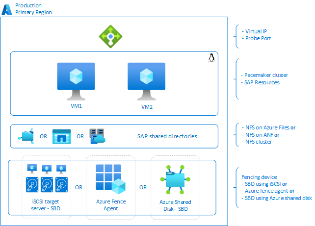
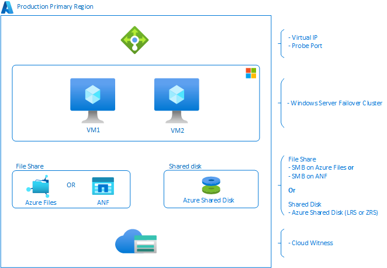

# Disaster recovery guidelines for SAP application

To configure Disaster Recovery (DR) for SAP workload on Azure, you need to test, fine tune and update the process regularly. Testing disaster recovery helps in identifying sequence of dependent services that are required before you can trigger SAP workload DR failover or start the system on the secondary site. Organizations usually have their SAP systems connected to Active Directory (AD) and Domain Name System (DNS) services to function correctly. When you set up DR for your SAP workload, ensure AD and DNS services are functioning before you recover SAP and other non-SAP systems, to ensure the application functions correctly. For guidance on protecting Active Directory and DNS, learn [how to protect Active Directory and DNS](../../site-recovery/site-recovery-active-directory.md). The DR recommendation for SAP application described in this document is at abstract level, you need to design your DR strategy based on your specific setup and document the end-to-end scenario.

## DR recommendation for SAP workloads

Usually in distributed SAP NetWeaver systems; central services, database and shared storage (NFS/SMB) are single point of failures (SPOF). To mitigate the effect of different SPOFs, it's necessary to set up redundancy of these components. The redundancy of these SPOF components in the primary region is achieved by configuring high availability. The high availability setup of the component protects SAP system from local failure or catastrophe. But to protect SAP applications from geographical dispersed disaster, DR strategy should be implemented for all the SAP components.  

For SAP systems running on virtual machines, you can use [Azure Site Recovery](../../site-recovery/site-recovery-overview.md) to create a disaster recovery plan. Following is the recommended disaster recovery approach for each component of an SAP system. Standalone non-NetWeaver SAP engines such as TREX and non-SAP applications aren't covered in this document.

| Components             | Recommendation                                               |
| ---------------------- | ------------------------------------------------------------ |
| SAP Web Dispatcher     | Replicate VM using Azure Site Recovery                       |
| SAP Central Services   | Replicate VM using Azure Site Recovery                       |
| SAP Application server | Replicate VM using Azure Site Recovery                       |
| SAP Database           | Use replication method offered by the database               |
| Shared Storage         | Replicate content, using appropriate method per storage type |

### SAP Web Dispatcher

SAP Web Dispatcher component works as a load balancer for SAP traffic among SAP application servers. You have different options to achieve high availability of SAP Web Dispatcher component in the primary region. For more information about this option, see [High Availability of the SAP Web Dispatcher](https://help.sap.com/docs/SAP_S4HANA_ON-PREMISE/683d6a1797a34730a6e005d1e8de6f22/489a9a6b48c673e8e10000000a42189b.html) and [SAP Web dispatcher HA setup on Azure](https://blogs.sap.com/2022/04/02/sap-on-azure-sap-web-dispatcher-highly-availability-setup-and-virtual-hostname-ip-configuration-with-azure-load-balancer/).

- Option 1: High availability using cluster solution.
- Option 2: High availability with parallel SAP Web Dispatchers.

To achieve DR for highly available SAP Web Dispatcher setup in primary region, you can use [Azure Site Recovery](../../site-recovery/site-recovery-overview.md). For parallel web dispatchers (option 2) running in primary region, you can configure Azure Site Recovery to achieve DR. But if you have configured SAP Web Dispatcher using option 1 in primary region, you need to make some additional changes after failover to have similar HA setup on the DR region. As the configuration of SAP Web Dispatcher high availability with cluster solution is configured in similar manner to SAP central services. Follow the same guidelines as mentioned for SAP Central Services.

### SAP Central Services

The SAP central services contain enqueue and message server, which is one of the SPOF of your SAP application. In an SAP system, there can be only one such instance, and it can be configured for high availability. Read [High Availability for SAP Central Service](planning-supported-configurations.md#high-availability-for-sap-central-service) to understand the different high availability solution for SAP workload on Azure.

Configuring high availability for SAP Central Services protects resources and processes from local incidents. To achieve DR for SAP Central Services, you can use Azure Site Recovery. Azure Site Recovery replicates VMs and the attached managed disks, but there are additional considerations for the DR strategy. Check the section below for more information, based on the operating system used for SAP central services.

#### [Linux](#tab/linux)

For SAP system, the redundancy of SPOF component in the primary region is achieved by configuring high availability. To achieve similar high availability setup in the disaster recovery region after failover, you need to consider additional points like cluster reconfiguration, SAP shared directories availability, alongside of replicating VMs and attached managed disk to DR site using Azure Site Recovery. On Linux, the high availability of SAP application can be achieved using pacemaker cluster solution. The diagram below shows the different components involved in configuring high availability for SAP central services with Pacemaker. Each component must be taken into consideration to have similar high availability set up in the DR site. If you have configured SAP Web Dispatcher using pacemaker cluster solution, similar consideration would apply as well.

##### Internal load balancer

Azure Site Recovery replicates VMs to the DR site, but it doesn’t replicate Azure load balancer. You'll need to create a separate internal load balancer on DR site beforehand or after failover. If you create internal load balancer beforehand, create an empty backend pool and add VMs after the failover event.

##### Pacemaker cluster solution

The configurations of a pacemaker cluster reside in local files of VMs, which are replicated to the DR site with Azure Site Recovery. The as-is pacemaker cluster configuration won’t work out-of-the-box on the VMs after failover. Additional cluster reconfiguration is required in order to make the solution work.

Read these blogs to learn about the pacemaker cluster reconfiguration in the DR region, based on the type of your storage and fencing mechanism.

- [SAP ASCS/ERS HA Cluster with SBD device (using iSCSI target server) failover to DR region using Azure Site Recovery](https://techcommunity.microsoft.com/t5/running-sap-applications-on-the/sap-ascs-ers-ha-cluster-with-sbd-device-using-iscsi-target/ba-p/3577235).
- [SAP ASCS HA Cluster (in Linux OS) failover to DR region using Azure Site Recovery](https://techcommunity.microsoft.com/t5/running-sap-applications-on-the/sap-ascs-ha-cluster-in-linux-os-failover-to-dr-region-using/ba-p/2120369).

##### SAP shared directories for Linux

The high availability setup of SAP NetWeaver or ABAP platform uses enqueue replication server for achieving application level redundancy for the enqueue service of SAP system with Pacemaker cluster configuration. The high availability setup of SAP central services (ASCS and ERS) uses NFS mounts. So you need to make sure SAP binaries and data in these NFS mounts are replicated to DR site. Azure Site Recovery replicates VMs and local managed disk attached, but it doesn't replicate NFS mounts. Based on the type of NFS storage you've configured for the setup, you need to make sure the data is replicated and available in DR site. The cross regional replication methodology for each storage is presented at abstract level. You need to confirm exact steps to replicate storage and perform testing.

| SAP shared directories | Cross regional replication                                   |
| ---------------------- | ------------------------------------------------------------ |
| NFS on Azure files     | Custom (like rsync)                                          |
| NFS on ANF             | Yes ([Cross Region Replication](../../azure-netapp-files/cross-region-replication-introduction.md)) |
| NFS cluster            | Custom                                                       |

>[!Tip]
> We recommend deploying one of the Azure first-party NFS services: [NFS on Azure Files](../../storage/files/storage-files-quick-create-use-linux.md) or [NFS ANF volumes](../../azure-netapp-files/azure-netapp-files-create-volumes.md) for storing shared data in a highly available SAP system. Be aware, that we are de-emphasizing SAP reference architectures, utilizing NFS clusters.

##### Fencing Mechanism

Irrespective of the operating system (SLES or RHEL) and its version, pacemaker requires a valid fencing mechanism in order for the entire solution to work properly. Based on the type of fencing mechanism you had setup in your primary region, you need to make sure the same fencing mechanism is set up on the DR site after failover.

| Fencing Mechanism             | Cross region DR recommendation                               |
| ----------------------------- | ------------------------------------------------------------ |
| SBD using iSCSI target server | Replicate iSCSI target server using Azure Site Recovery.  On DR VMs, discover iSCSI disk again. |
| Azure fence agent             | Enable Managed System Identities (MSI) on DR VMs. Assign custom roles.  Update the fence agent resource in cluster. |
| SBD using Azure shared disk*  | Configure new Azure Shared Disk on DR region. Attach Azure Shared Disk to DR VMs after failover. [Set up Azure shared disk SBD device](high-availability-guide-suse-pacemaker.md#set-up-an-azure-shared-disk-sbd-device). |

*ZRS for Azure shared disk is available in [limited regions](../../virtual-machines/disks-redundancy.md#limitations).

>[!Note]
> We recommend to have same fencing mechanism for both primary and DR region for ease of operation and failover. It is not advised to have different fencing mechanism after failover to DR site.

#### [Windows](#tab/windows)

For SAP system, the redundancy of SPOF component in the primary region is achieved by configuring high availability. To achieve similar high availability setup in the disaster recovery region after failover, you need to consider additional points like cluster reconfiguration, SAP shared directories availability, alongside of replicating VMs and attached managed disk to DR site using Azure Site Recovery. On Windows, the high availability of SAP application can be achieved using Windows Server Failover Cluster (WSFC). The diagram below shows the different components involved in configuring high availability of SAP central services with WSFC. Each component must be evaluated to achieve similar high availability set up in the DR site. If you have configured SAP Web Dispatcher using WSFC, similar consideration would apply as well.

##### SAP system configured with File share

If you've configured your SAP system using file share on primary region, you need to make sure all components and the data in the file share (SMB on Azure Files, SMB on ANF) are replicated to the disaster recovery region if there is failover. You can use Azure Site Recovery to replicate the cluster VMs and other application server VMs to the disaster recovery region. There are some additional considerations that are outlined below.

###### Load balancer

Azure Site Recovery replicates VMs to the DR site, but it doesn’t replicate Azure load balancer. You'll need to create a separate internal load balancer on DR site beforehand or after failover. If you create internal load balancer beforehand, create an empty backend pool and add VMs after the failover event.

###### Quorum (cloud witness)

If you have configured cluster with cloud witness at its quorum mechanism, then you would need to create a separate storage account on DR region. On the event of failover, quorum setting must be updated with the new storage account name and access keys.

###### Windows server failover cluster

If there is failover, SAP ASCS/ERS VMs configured with WSFC won’t work out-of-the-box. Additional reconfiguration is required to start SAP system on the DR region.

Read [SAP NetWeaver HA deployment with File Share running on Windows failover to DR Region using ASR](https://techcommunity.microsoft.com/t5/running-sap-applications-on-the/sap-netweaver-ha-deployment-with-file-share-running-on-windows/ba-p/3727034) blog to learn more about the additional steps that are required in the DR region.

###### File share directories

The high availability setup of SAP NetWeaver or ABAP platform uses enqueue replication server for achieving application level redundancy for the enqueue service of SAP system with WSFC configuration. The high availability setup of SAP central services (ASCS and ERS) with file share uses SMB shares. You will need to make sure that the SAP binaries and data on these SMB shares are replicated to the DR site. Azure Site Recovery replicates VMs and local managed disk attached, but it doesn't replicate the file shares. Choose the replication method, based on the type of file share storage you've configured for the setup. The cross regional replication methodology for each storage is presented at abstract level. You need to confirm exact steps to replicate storage and perform testing. 

| SAP file share directories | Cross region replication mechanism                           |
| -------------------------- | ------------------------------------------------------------ |
| SMB on Azure Files         | [Robocopy](../../storage/files/storage-files-migration-robocopy.md) |
| SMB on Azure NetApp Files  | [Cross Region Replication](../../azure-netapp-files/cross-region-replication-introduction.md) |

---

### SAP Application Servers

In the primary region, the redundancy of the SAP application servers is achieved by installing instances in multiple VMs. To have DR for SAP application servers, [Azure Site Recovery](../../site-recovery/azure-to-azure-tutorial-enable-replication.md) can be set up for each application server VM. For shared storages (transport filesystem, interface data filesystem) that is attached to the application servers, follow the appropriate DR practice based on the type of [shared storage](disaster-recovery-overview-guide.md#storage).

### SAP Database Servers

For databases running SAP workload, use the native DBMS replication technology to configure DR. Use of Azure Site Recovery for databases isn't recommended, as it doesn’t guarantee DB consistency and has [data churn limitation](../../site-recovery/azure-to-azure-support-matrix.md#limits-and-data-change-rates). The replication technology for each database is different, so follow the respective database guidelines. Below table shows the list of databases used for SAP workloads and the corresponding DR recommendation.

| Database      | DR recommendation                                            |
| ------------- | ------------------------------------------------------------ |
| SAP HANA      | [HANA System Replication (HSR)](sap-hana-availability-across-regions.md) |
| Oracle        | [Oracle Data Guard (FarSync)](../../virtual-machines/workloads/oracle/oracle-reference-architecture.md#disaster-recovery-for-oracle-databases) |
| IBM DB2       | [High availability disaster recovery (HADR)](dbms-guide-ha-ibm.md) |
| Microsoft SQL | [Microsoft SQL Always On](dbms-guide-sqlserver.md#sql-server-always-on) |
| SAP ASE       | [ASE HADR Always On](https://techcommunity.microsoft.com/t5/running-sap-applications-on-the/installation-procedure-for-sybase-16-3-patch-level-3-always-on/ba-p/368199) |
| SAP MaxDB     | [Standby Database](https://wiki.scn.sap.com/wiki/pages/viewpage.action?pageId=72123826) |

For cost optimized solution, you can even use backup and restore option for database DR strategy.

## Back up and restore

Backup and restore is other solution you can use to achieve disaster recovery for your SAP workloads if the business RTO and RPO are non-critical. You can use [Azure backup](../../backup/backup-overview.md), a cloud based backup service to take copies of different component of your SAP workload like virtual machines, managed disks and supported databases. To learn more on the general support settings and limitations for Azure Backup scenarios and deployments, see [Azure Backup support matrix](../../backup/backup-support-matrix.md).

| Services | Component                                                    | Azure Backup Support |
| -------- | ------------------------------------------------------------ | -------------------- |
| Compute  | [Azure VMs](../../backup/backup-support-matrix-iaas.md)   | Supported            |
| Storage  | [Azure Managed Disks including shared disks](../../backup/disk-backup-support-matrix.md) | Supported            |
| Storage  | [Azure File Share - SMB (Standard or Premium)](../../backup/azure-file-share-support-matrix.md) | Supported            |
| Storage  | [Azure blobs](../../backup/blob-backup-support-matrix.md) | Supported            |
| Storage  | Azure File Shared - NFS (Standard or Premium)                | Not Supported        |
| Storage  | Azure NetApp Files                                           | Not Supported        |
| Database | [SAP HANA database in Azure VMs](../../backup/sap-hana-backup-support-matrix.md) | Supported            |
| Database | [SQL server in Azure VMs](../../backup/sql-support-matrix.md) | Supported            |
| Database | [Oracle](../../virtual-machines/workloads/oracle/oracle-database-backup-azure-backup.md) | Supported*           |
| Database | IBM DB2, SAP ASE                                             | Not Supported        |

>[!Note]
>
>*Azure backup support Oracle database using [Azure VM backup for database consistent snapshots](../../backup/backup-azure-linux-database-consistent-enhanced-pre-post.md).
>
> Azure backup doesn’t support all Azure storages and databases that are used for SAP workload.

Azure backup stores backups in recovery service vault, which replicates your data based on the chosen replication type (LRS, ZRS, or GRS). For [Geo-redundant storage (GRS)](../../storage/common/storage-redundancy.md#geo-redundant-storage), your backup data is replicated to a paired secondary region. With [cross region restore](../../backup/backup-support-matrix.md#cross-region-restore) feature enabled, you can restore data of the supported management type on the secondary region.

Backup and restore are more traditional cost optimized approach but comes with a trade-off of higher RTO. As you need to restore all the applications from the backup if there's failover to DR region. So you need to analyze your business need and accordingly design a DR strategy.

## References

- [Tutorial: Set up disaster recovery for Azure VMs](../../site-recovery/azure-to-azure-tutorial-enable-replication.md)
- [Azure Backup service](../../backup/backup-overview.md).
