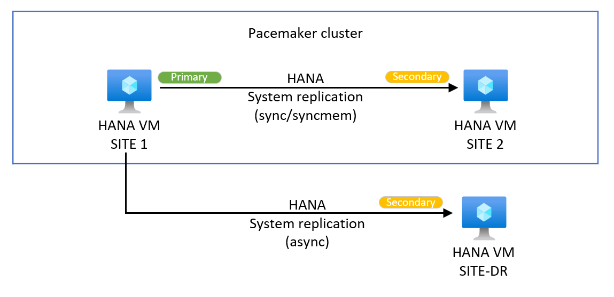
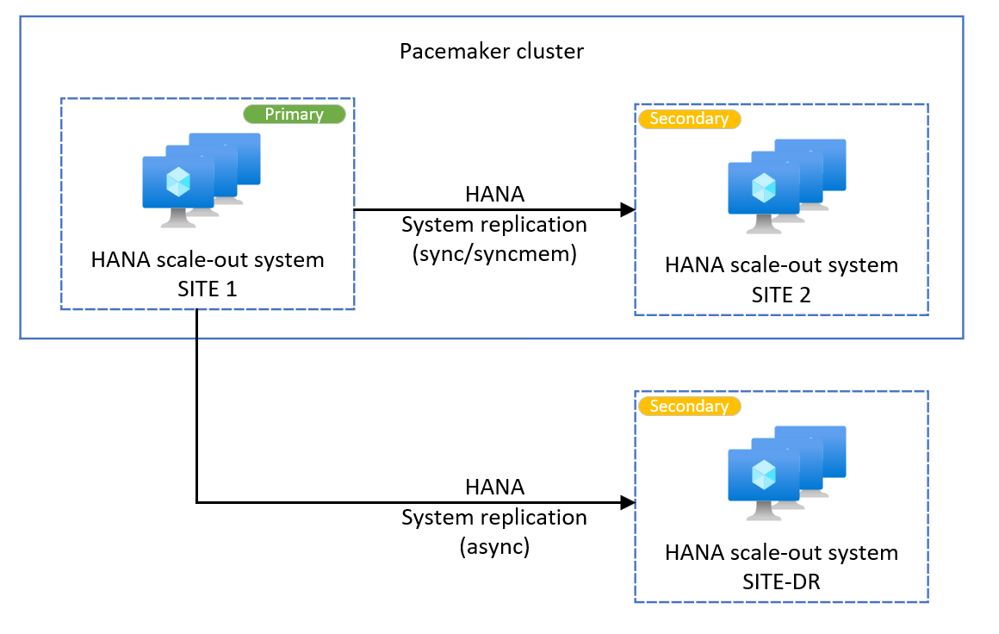
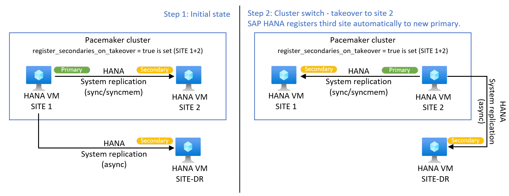

# Add HSR third site to HANA Pacemaker cluster on SUSE

This article describes requirements and setup of a third HANA replication site complement an existing SUSE Linux Enterprise Server (SLES) Pacemaker cluster.

## Overview 

SAP HANA supports system replication (HSR) with more than two sites connected. You can add a third site to an existing HSR pair, which is managed by Pacemaker in a highly available setup. You can deploy the third site in a second Azure region for disaster recovery (DR) purposes.  

Pacemaker and HANA cluster resource agent manages the first two sites. Pacemaker cluster does not control any third, DR site.

SAP HANA supports a third system replication site in two modes. 
- [Multi-target](https://help.sap.com/docs/SAP_HANA_PLATFORM/6b94445c94ae495c83a19646e7c3fd56/ba457510958241889a459e606bbcf3d3.html) replicates data changes from primary to more than one target system. Third site connected to primary, star form replication.
- [Multi-tier](https://help.sap.com/docs/SAP_HANA_PLATFORM/6b94445c94ae495c83a19646e7c3fd56/f730f308fede4040bcb5ccea6751e74d.html) is a two-tier system replication. A cascading, or sometimes referred to as chained setup, of three different HANA tiers.  Third site connected to secondary.  
For more information, see [SAP HANA availability across Azure regions](./sap-hana-availability-across-regions.md#combine-availability-within-one-region-and-across-regions) for more conceptual details about HANA HSR within one region and across Azure regions.  

## Prerequisites

Requirements for a third HSR site are different between HANA scale-up and HANA scale-out. 

> [!NOTE]
> Dependencies are valid for a Pacemaker enabled landscape. Without Pacemaker, only SAP's HANA version requirements apply.  
> Pacemaker and HANA cluster resource agent manages only two sites. Third HSR site isn't controlled by Pacemaker cluster.

- Both scale-up and scale-out: SAP HANA SPS 04 or newer required to use multi-target HSR with a Pacemaker cluster
- Both scale-up and scale-out: Maximum one SAP HANA system replication connected from outside the Linux cluster
- HANA scale-out only: SLES 15 SP1 or higher
- HANA scale-out only: OS package SAPHanaSR-ScaleOut version 0.180 or higher
- HANA scale-out only: SAP HANA HA provider SAPHanaSrMultiTarget in use. HANA HA provider SAPHanaSR isn't multi-target aware for scale-out.

## HANA scale-up: Add HANA multi-target system replication for DR purposes

With SAP HANA HA provider [SAPHanaSR](./sap-hana-high-availability.md#implement-hana-hooks-saphanasr-and-suschksrv), you can configure a third node for disaster recovery (DR) purposes. The Pacemaker environment is aware of a HANA multi-target DR setup.

Failure of the third node won't trigger any cluster action. Cluster detects the replication status of connected sites and the monitored attribute for third site can change between SOK and SFAIL state. Any takeover tests to third/DR site or executing your DR exercise process should first place the cluster resources into maintenance mode to prevent any undesired cluster action.

Example of a multi-target system replication system. For more information, see [SAP documentation](https://help.sap.com/docs/SAP_HANA_PLATFORM/4e9b18c116aa42fc84c7dbfd02111aba/2e6c71ab55f147e19b832565311a8e4e.html).  


1. Deploy Azure resources for the third node. Depending on your requirements, you can use a different Azure region for disaster recovery purposes.  
   Steps required for the HANA scale-out on third site are mirroring steps to deploy the [HANA scale-up cluster](./sap-hana-high-availability.md#deploy-for-linux). Deploy the third node following the Azure infrastructure, operating system and HANA installation steps for first node of the Pacemaker cluster, with the following exceptions:
   - No load balancer deployed for third site and no integration with existing cluster load balancer for the VM of third site
   - Don't install OS packages SAPHanaSR, SAPHanaSR-doc and OS package pattern ha_sles on third site VM
   - No integration into the cluster for VM or HANA resources of the third site
   - No HANA HA hook setup for third site in global.ini
   
2. Install SAP HANA on third node.  
   Same HANA SID and HANA installation number must be used for third site.  
    
3. With SAP HANA on third site installed and running, register the third site with the primary site.  
   The example uses SITE-DR as the name for third site.
    ```bash
    # Execute on the third site 
    su - hn1adm
    # Make sure HANA isn't running on the third site. If it is started, stop HANA
    sapcontrol -nr 03 -function StopSystem
    sapcontrol -nr 03 -function WaitforStopped 600 10
    # Register the HANA third site to the primary
    hdbnsutil -sr_register --name=SITE-DR --remoteHost=hn1-db-0 --remoteInstance=03 --replicationMode=async
    ```

4. Verify HANA system replication shows both secondary and third site.
    ```bash
    # Verify HANA HSR is in sync, execute on primary
    sudo su - hn1adm -c "python /usr/sap/HN1/HDB03/exe/python_support/systemReplicationStatus.py"
    # Third site, SITE-DR, will show up next to existing replication to SITE2 used by Pacemaker cluster.
    ```

5. Check the SAPHanaSR attribute for third site. SITE-DR should show up with status SOK in the sites section.
    ```bash
    # Check SAPHanaSR attribute on any cluster managed host (first or second site)
    sudo SAPHanaSR-showAttr
    # Expected result
    # Global cib-time                 maintenance
    # --------------------------------------------
    # global Tue Feb 21 19:28:21 2023 false
    # 
    # Sites     srHook
    # -----------------
    # HN1-SITE1 PRIM
    # HN1-SITE2 SOK
    # SITE-DR   SOK
    ```
   
   Cluster detects the replication status of connected sites and the monitored attributed can change between SOK and SFAIL. No cluster action if the replication to DR site fails.

## HANA scale-out: Add HANA multi-target system replication for DR purposes

With SAP HANA HA provider [SAPHanaSrMultiTarget](./sap-hana-high-availability-scale-out-hsr-suse.md#implement-hana-ha-hooks-saphanasrmultitarget-and-suschksrv), you can add a third HANA scale-out site. This third site is often used for disaster recovery (DR) in another Azure region. The Pacemaker environment is aware of a HANA multi-target DR setup.

Failure of the third node won't trigger any cluster action. Cluster detects the replication status of connected sites and the monitored attribute for third site can change between SOK and SFAIL state. Any takeover tests to third/DR site or executing your DR exercise process should first place the cluster resources into maintenance mode to prevent any undesired cluster action.

Example of a multi-target system replication system. For more information, see [SAP documentation](https://help.sap.com/docs/SAP_HANA_PLATFORM/4e9b18c116aa42fc84c7dbfd02111aba/2e6c71ab55f147e19b832565311a8e4e.html).  


1. Deploy Azure resources for the third site. Depending on your requirements, you can use a different Azure region for disaster recovery purposes.  
   Steps required for the HANA scale-out on third site are mirroring steps to deploy the [HANA scale-out cluster](./sap-hana-high-availability-scale-out-hsr-suse.md#set-up-the-infrastructure). Deploy the third site following the Azure infrastructure, operating system and HANA installation steps for SITE1 of the scale-out cluster, with the following exceptions:
   - No load balancer deployed for third site and no integration with existing cluster load balancer for the VMs of third site
   - Don't install OS packages SAPHanaSR-ScaleOut, SAPHanaSR-ScaleOut-doc and OS package pattern ha_sles on third site VMs
   - No majority maker VM for third site, as there's no cluster integration
   - Create NFS volume /hana/shared for third site exclusive use
   - No integration into the cluster for VMs or HANA resources of the third site
   - No HANA HA hook setup for third site in global.ini
   
   You must use the same HANA SID and HANA installation number for third site. 
    
2. With SAP HANA scale-out on third site installed and running, register the third site with the primary site.  
   The example uses SITE-DR as the name for third site.
    ```bash
    # Execute on the third site 
    su - hn1adm
    # Make sure HANA isn't running on the third site. If it is started, stop HANA
    sapcontrol -nr 03 -function StopSystem
    sapcontrol -nr 03 -function WaitforStopped 600 10
    # Register the HANA third site to the primary
    hdbnsutil -sr_register --name=SITE-DR --remoteHost=hana-s1-db1 --remoteInstance=03 --replicationMode=async
    ```

3. Verify HANA system replication shows both secondary and third site.
    ```bash
    # Verify HANA HSR is in sync, execute on primary
    sudo su - hn1adm -c "python /usr/sap/HN1/HDB03/exe/python_support/systemReplicationStatus.py"
    # Third site, SITE-DR, will show up next to existing replication to SITE2 used by Pacemaker cluster.
    ```

4. Check the SAPHanaSR attribute for third site. SITE-DR should show up with status SOK in the sites section.
    ```bash
    # Check SAPHanaSR attribute on any cluster managed host (first or second site)
    sudo SAPHanaSR-showAttr
    # Expected result
    # Global cib-time                 maintenance prim  sec sync_state upd
    # ---------------------------------------------------------------------
    # HN1    Fri Jan 27 10:38:46 2023 false       HANA_S1 -   SOK        ok
    # 
    # Sites     lpt        lss mns         srHook srr
    # ------------------------------------------------
    # SITE-DR                              SOK
    # HANA_S1   1674815869 4   hana-s1-db1 PRIM   P
    # HANA_S2   30         4   hana-s2-db1 SWAIT  S
    ```
   
   Cluster detects the replication status of connected sites and the monitored attributed can change between SOK and SFAIL. No cluster action if the replication to DR site fails.

## Auto-registering third site

During planned or unplanned takeover event between the two Pacemaker cluster sites, HSR to third site will be also interrupted. Pacemaker doesn't modify HANA replication to third site.

SAP provides since HANA 2 SPS 04 parameter `register_secondaries_on_takeover`. With the parameter set to value `true`, after HSR takeover between cluster sites 1 and 2, HANA will register the third site on the new primary automatically to keep an HSR multi-target setup. Configure HANA parameter `register_secondaries_on_takeover = true` configured in `[system_replication]` block of global.ini on both SAP HANA sites in the Linux cluster. Both SITE1 and SITE2 need the parameter in the respective HANA global.ini configuration file.

For HSR [multi-tier](https://help.sap.com/docs/SAP_HANA_PLATFORM/6b94445c94ae495c83a19646e7c3fd56/f730f308fede4040bcb5ccea6751e74d.html), no automatic SAP HANA registration of the third site exists. You need to manually register the third site to the current secondary, to keep HSR replication chain for multi-tier.



## Next steps

- [Disaster recovery overview and infrastructure](./disaster-recovery-overview-guide.md)
- [Disaster recovery for SAP workloads](./disaster-recovery-sap-guide.md)
- [High-availability architecture and scenarios for SAP NetWeaver](./sap-hana-availability-across-regions.md)