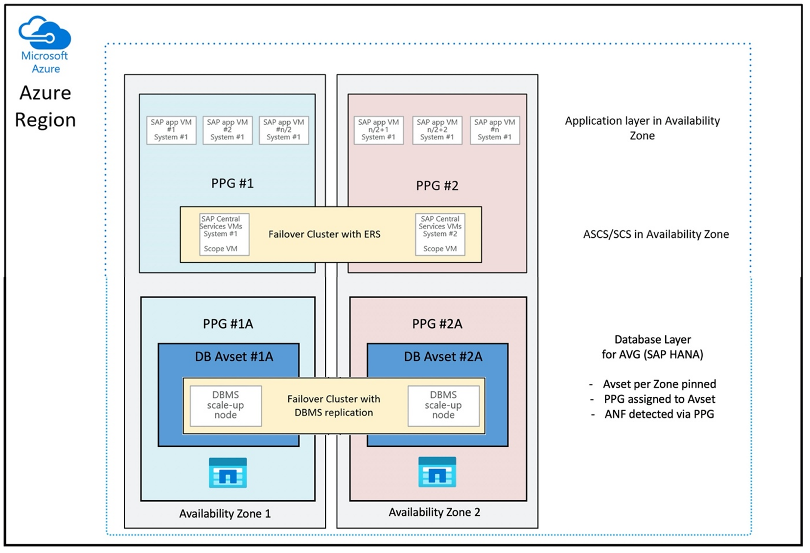
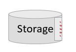

# NFS v4.1 volumes on Azure NetApp Files for SAP HANA

Azure NetApp Files provides native NFS shares that can be used for **/hana/shared**, **/hana/data**, and **/hana/log** volumes. Using ANF-based NFS shares for the **/hana/data** and **/hana/log** volumes requires the usage of the v4.1 NFS protocol. The NFS protocol v3 isn't supported for the usage of **/hana/data** and **/hana/log** volumes when basing the shares on ANF. 


> [!IMPORTANT]
> The NFS v3 protocol implemented on Azure NetApp Files is **not** supported to be used for **/hana/data** and **/hana/log**. The usage of the NFS 4.1 is mandatory for **/hana/data** and **/hana/log** volumes from a functional point of view. Whereas for the **/hana/shared** volume the NFS v3 or the NFS v4.1 protocol can be used from a functional point of view.

## Important considerations

When considering Azure NetApp Files for the SAP Netweaver and SAP HANA, be aware of the following important considerations:

- The minimum capacity pool is 4 TiB  
- The minimum volume size is 100 GiB
- ANF-based NFS shares and the virtual machines that mount those shares must be in the same Azure Virtual Network or in [peered virtual networks](../../virtual-network/virtual-network-peering-overview.md) in the same region
- The selected virtual network must have a subnet, delegated to Azure NetApp Files. **For SAP workload, it is highly recommended to configure a /25 range for the subnet delegated to ANF.** 
- It's important to have the virtual machines deployed sufficient proximity to the Azure NetApp storage for lower latency as, for example, demanded by SAP HANA for redo log writes.
    - Azure NetApp Files meanwhile has functionality to deploy NFS volumes into specific Azure Availability Zones. Such a zonal proximity is going to be sufficient in the majority of cases to achieve a latency of less than 1 millisecond. The functionality is in public preview and described in the article [Manage availability zone volume placement for Azure NetApp Files](../../azure-netapp-files/manage-availability-zone-volume-placement.md). This functionality isn't requiring any interactive process with Microsoft to achieve proximity between your VM and the NFS volumes you allocate.
    - To achieve most optimal proximity, the functionality of [Application Volume Groups](../../azure-netapp-files/application-volume-group-introduction.md) is available. This functionality isn't only looking for most optimal proximity, but for most optimal placement of the NFS volumes, so, that HANA data and redo log volumes are handled by different controllers. The disadvantage is that this method needs some interactive process with Microsoft to pin your VMs. 
- Make sure the latency from the database server to the ANF volume is measured and below 1 millisecond
- The throughput of an Azure NetApp volume is a function of the volume quota and Service level, as documented in [Service level for Azure NetApp Files](../../azure-netapp-files/azure-netapp-files-service-levels.md). When sizing the HANA Azure NetApp volumes, make sure the resulting throughput meets the HANA system requirements. Alternatively consider using a [manual QoS capacity pool](../../azure-netapp-files/azure-netapp-files-understand-storage-hierarchy.md#manual-qos-type) where volume capacity and throughput can be configured and scaled independently (SAP HANA specific examples are in [this document](../../azure-netapp-files/azure-netapp-files-understand-storage-hierarchy.md#manual-qos-type)
- Try to “consolidate” volumes to achieve more performance in a larger Volume for example, use one volume for /sapmnt, /usr/sap/trans, … if possible  
- Azure NetApp Files offers [export policy](../../azure-netapp-files/azure-netapp-files-configure-export-policy.md): you can control the allowed clients, the access type (Read&Write, Read Only, etc.). 

- The User ID for <b>sid</b>adm and the Group ID for `sapsys` on the virtual machines must match the configuration in Azure NetApp Files. 
- Implement Linux OS parameters mentioned in SAP note [3024346](https://launchpad.support.sap.com/#/notes/3024346)

> [!IMPORTANT]
> For SAP HANA workloads, low latency is critical. Work with your Microsoft representative to ensure that the virtual machines and the Azure NetApp Files volumes are deployed in close proximity.  

> [!IMPORTANT]
> If there's a mismatch between User ID for <b>sid</b>adm and the Group ID for `sapsys` between the virtual machine and the Azure NetApp configuration, the permissions for files on Azure NetApp volumes, mounted to the VM, would be be displayed as `nobody`. Make sure to specify the correct User ID for <b>sid</b>adm and the Group ID for `sapsys`, when [on-boarding a new system](https://forms.office.com/Pages/ResponsePage.aspx?id=v4j5cvGGr0GRqy180BHbRxjSlHBUxkJBjmARn57skvdUQlJaV0ZBOE1PUkhOVk40WjZZQVJXRzI2RC4u) to Azure NetApp Files.

## NCONNECT mount option
Nconnect is a mount option for NFS volumes hosted on ANF that allows the NFS client to open multiple sessions against a single NFS volume. Using nconnect with a value of larger than 1 also triggers the NFS client to use more than one RPC session on the client side (in the guest OS) to handle the traffic between the guest OS and the mounted NFS volumes. The usage of multiple sessions handling traffic of one NFS volume, but also the usage of multiple RPC sessions can address performance and throughput scenarios like:

- Mounting of multiple ANF hosted NFS volumes with different [service levels](../../azure-netapp-files/azure-netapp-files-service-levels.md#supported-service-levels) in one VM
- The maximum write throughput for a volume and a single Linux session is between 1.2 and 1.4 GB/s. Having multiple sessions against one ANF hosted NFS volume can increase the throughput 

For Linux OS releases that support nconnect as a mount option and some important configuration considerations of nconnect, especially with different NFS server endpoints, read the document [Linux NFS mount options best practices for Azure NetApp Files](../../azure-netapp-files/performance-linux-mount-options.md). 


## Sizing for HANA database on Azure NetApp Files

The throughput of an Azure NetApp volume is a function of the volume size and Service level, as documented in [Service levels for Azure NetApp Files](../../azure-netapp-files/azure-netapp-files-service-levels.md). 

Important to understand is the performance relationship the size and that there are physical limits for a storage endpoint of the service. Each storage endpoint is going to be dynamically injected into the [Azure NetApp Files delegated subnet](../../azure-netapp-files/azure-netapp-files-delegate-subnet.md) upon volume creation and receive an IP address. Azure NetApp Files volumes can – depending on available capacity and deployment logic – share a storage endpoint

The table below demonstrates that it could make sense to create a large “Standard” volume to store backups and that it doesn't make sense to create a “Ultra” volume larger than 12 TB because the maximal physical bandwidth capacity of a single volume would be exceeded. 

If you require more than the maximum write throughput for your **/hana/data** volume than a single Linux session can provide, you could also use SAP HANA data volume partitioning as an alternative. SAP HANA data volume partitioning stripes the I/O activity during data reload or HANA savepoints across multiple HANA data files that are located on multiple NFS shares. For more details on HANA data volume striping read these articles:

- [The HANA Administrator's Guide](https://help.sap.com/viewer/6b94445c94ae495c83a19646e7c3fd56/2.0.05/en-US/40b2b2a880ec4df7bac16eae3daef756.html?q=hana%20data%20volume%20partitioning)
- [Blog about SAP HANA – Partitioning Data Volumes](https://blogs.sap.com/2020/10/07/sap-hana-partitioning-data-volumes/)
- [SAP Note #2400005](https://launchpad.support.sap.com/#/notes/2400005)
- [SAP Note #2700123](https://launchpad.support.sap.com/#/notes/2700123)


| Size  | Throughput Standard | Throughput Premium | Throughput Ultra |
| --- | --- | --- | --- |
| 1 TB | 16 MB/sec | 64 MB/sec | 128 MB/sec |
| 2 TB | 32 MB/sec | 128 MB/sec | 256 MB/sec |
| 4 TB | 64 MB/sec | 256 MB/sec | 512 MB/sec |
| 10 TB | 160 MB/sec | 640 MB/sec | 1,280 MB/sec |
| 15 TB | 240 MB/sec | 960 MB/sec | 1,400 MB/sec<sup>1</sup> |
| 20 TB | 320 MB/sec | 1,280 MB/sec | 1,400 MB/sec<sup>1</sup> |
| 40 TB | 640 MB/sec | 1,400 MB/sec<sup>1</sup> | 1,400 MB/sec<sup>1</sup> |

<sup>1</sup>: write or single session read throughput limits (in case NFS mount option nconnect isn't used) 

It's important to understand that the data is written to the same SSDs in the storage backend. The performance quota from the capacity pool was created to be able to manage the environment.
The Storage KPIs are equal for all HANA database sizes. In almost all cases, this assumption doesn't reflect the reality and the customer expectation. The size of  HANA Systems doesn't necessarily mean that a small system requires low storage throughput – and a large system requires high storage throughput. But generally we can expect higher throughput requirements for larger HANA database instances. As a result of SAP's sizing rules for the underlying hardware such larger HANA instances also provide more CPU resources and higher parallelism in tasks like loading data after an instances restart. As a result the volume sizes should be adopted to the customer expectations and requirements. And not only driven by pure capacity requirements.

As you design the infrastructure for SAP in Azure you should be aware of some minimum storage throughput requirements (for productions Systems) by SAP. These requirements translate into minimum throughput characteristics of:

| Volume type and I/O type | Minimum KPI demanded by SAP | Premium service level | Ultra service level |
| --- | --- | --- | --- |
| Log Volume Write | 250 MB/sec | 4 TB | 2 TB |
| Data Volume Write | 250 MB/sec | 4 TB | 2 TB |
| Data Volume Read | 400 MB/sec | 6.3 TB | 3.2 TB |

Since all three KPIs are demanded, the **/hana/data** volume needs to be sized toward the larger capacity to fulfill the minimum read requirements. if you're using manual QoS capacity pools, the size and throughput of the volumes can be defined independently. Since both capacity and throughput are taken from the same capacity pool, the pool‘s service level and size must be large enough to deliver the total performance (see example [here](../../azure-netapp-files/azure-netapp-files-understand-storage-hierarchy.md#manual-qos-type))

For HANA systems, which aren't requiring high bandwidth, the  ANF volume throughput can be lowered by either a  smaller volume size or, using manual QoS, by adjusting the throughput directly. And in case a HANA system requires more throughput the volume could be adapted by resizing the capacity online. No KPIs are defined for backup volumes. However the backup volume throughput is essential for a well performing environment. Log – and Data volume performance must be designed to the customer expectations.

> [!IMPORTANT]
> Independent of the capacity you deploy on a single NFS volume, the throughput, is expected to plateau in the range of 1.2-1.4 GB/sec bandwidth utilized by a consumer in a single session. This has to do with the underlying architecture of the ANF offer and related Linux session limits around NFS. The performance and throughput numbers as documented in the article [Performance benchmark test results for Azure NetApp Files](../../azure-netapp-files/performance-benchmarks-linux.md) were conducted against one shared NFS volume with multiple client VMs and as a result with multiple sessions. That scenario is different to the scenario we measure in SAP. Where we measure throughput from a single VM against an NFS volume. Hosted on ANF.

To meet the SAP minimum throughput requirements for data and log, and according to the guidelines for **/hana/shared**, the recommended sizes would look like:

| Volume | Size<br /> Premium Storage tier | Size<br /> Ultra Storage tier | Supported NFS protocol |
| --- | --- | --- |
| /hana/log/ | 4 TiB | 2 TiB | v4.1 |
| /hana/data | 6.3 TiB | 3.2 TiB | v4.1 |
| /hana/shared scale-up | Min(1 TB, 1 x RAM)  | Min(1 TB, 1 x RAM) | v3 or v4.1 |
| /hana/shared scale-out | 1 x RAM of worker node<br /> per four worker nodes  | 1 x RAM of worker node<br /> per four worker nodes  | v3 or v4.1 |
| /hana/logbackup | 3 x RAM  | 3 x RAM | v3 or v4.1 |
| /hana/backup | 2 x RAM  | 2 x RAM | v3 or v4.1 |

For all volumes, NFS v4.1 is highly recommended

The sizes for the backup volumes are estimations. Exact requirements need to be defined based on workload and operation processes. For backups, you could consolidate many volumes for different SAP HANA instances to one (or two) larger volumes, which could have a lower service level of ANF.

> [!NOTE]
> The Azure NetApp Files, sizing recommendations stated in this document are targeting the minimum requirements SAP expresses towards their infrastructure providers. In real customer deployments and workload scenarios, that may not be enough. Use these recommendations as a starting point and adapt, based on the requirements of your specific workload.  

Therefore you could consider to deploy similar throughput for the ANF volumes as listed for Ultra disk storage already. Also consider the sizes for the sizes listed for the volumes for the different VM SKUs as done in the Ultra disk tables already.

> [!TIP]
> You can re-size Azure NetApp Files volumes dynamically, without the need to `unmount` the volumes, stop the virtual machines or stop SAP HANA. That allows flexibility to meet your application both expected and unforeseen throughput demands.

Documentation on how to deploy an SAP HANA scale-out configuration with standby node using ANF based NFS v4.1 volumes is published in [SAP HANA scale-out with standby node on Azure VMs with Azure NetApp Files on SUSE Linux Enterprise Server](./sap-hana-scale-out-standby-netapp-files-suse.md).

## Linux Kernel Settings
To successfully deploy SAP HANA on ANF, Linux kernel settings need to be implemented according to SAP note [3024346](https://launchpad.support.sap.com/#/notes/3024346).

For systems using High Availability (HA) using pacemaker and Azure Load Balancer following settings need to be implemented in file /etc/sysctl.d/91-NetApp-HANA.conf

```
net.core.rmem_max = 16777216
net.core.wmem_max = 16777216
net.ipv4.tcp_rmem = 4096 131072 16777216
net.ipv4.tcp_wmem = 4096 16384 16777216
net.core.netdev_max_backlog = 300000
net.ipv4.tcp_slow_start_after_idle=0
net.ipv4.tcp_no_metrics_save = 1
net.ipv4.tcp_moderate_rcvbuf = 1
net.ipv4.tcp_window_scaling = 1
net.ipv4.tcp_timestamps = 0
net.ipv4.tcp_sack = 1
```

Systems running with no pacemaker and Azure Load Balancer should implement these settings in /etc/sysctl.d/91-NetApp-HANA.conf

```
net.core.rmem_max = 16777216
net.core.wmem_max = 16777216
net.ipv4.tcp_rmem = 4096 131072 16777216
net.ipv4.tcp_wmem = 4096 16384 16777216
net.core.netdev_max_backlog = 300000
net.ipv4.tcp_slow_start_after_idle=0
net.ipv4.tcp_no_metrics_save = 1
net.ipv4.tcp_moderate_rcvbuf = 1
net.ipv4.tcp_window_scaling = 1
net.ipv4.tcp_timestamps = 1
net.ipv4.tcp_sack = 1
```

## Deployment with zonal proximity
To get a zonal proximity of your NFS volumes and VMs, you can follow the instructions as described in [Manage availability zone volume placement for Azure NetApp Files](../../azure-netapp-files/manage-availability-zone-volume-placement.md). With this method, the VMs and the NFS volumes are going to be in the same Azure Availability Zone. In most of the Azure regions, this type of proximity should be sufficient to achieve less than 1 millisecond latency for the smaller redo log writes for SAP HANA. This method doesn't require any interactive work with Microsoft to place and pin VMs into specific datacenter. As a result, you're flexible with change VM sizes and families within all the VM types and families offered in the Availability Zone you deployed. So, that you can react flexible on chanign conditions or move faster to more cost efficient VM sizes or families. We recommend this method for non-production systems and production systems that can work with redo log latencies that are closer to 1 millisecond. **The functionality is currently in public preview**.

## Deployment through Azure NetApp Files application volume group for SAP HANA (AVG)
To deploy ANF volumes with proximity to your VM, a new functionality called Azure NetApp Files application volume group for SAP HANA (AVG) got developed. There's a series of articles that document the functionality. Best is to start with the article [Understand Azure NetApp Files application volume group for SAP HANA](../../azure-netapp-files/application-volume-group-introduction.md). As you read the articles, it becomes clear that the usage of AVGs involves the usage of Azure proximity placement groups as well. Proximity placement groups are used by the new functionality to tie into with the volumes that are getting created. To ensure that over the lifetime of the HANA system, the VMs aren't going to be moved away from the ANF volumes, we recommend using a combination of Avset/ PPG for each of the zones you deploy into.
The order of deployment would look like:

- Using the [form](https://aka.ms/HANAPINNING) you need to request a pinning of the empty AvSet to a compute HW to ensure that VMs aren't going to move
- Assign a PPG to the Availability Set and start a VM assigned to this Availability Set
- Use Azure NetApp Files application volume group for SAP HANA functionality to deploy your HANA volumes

The proximity placement group configuration to use AVGs in an optimal way would look like:



The diagram shows that you're going to use an Azure proximity placement group for the DBMS layer. So, that it can get used together with AVGs. It's best to just include only the VMs that run the HANA instances in the proximity placement group. The proximity placement group is necessary, even if only one VM with a single HANA instance is used, for the AVG to identify the closest proximity of the ANF hardware. And to allocate the NFS volume on ANF as close as possible to the VM(s) that are using the NFS volumes. 

This method generates the most optimal results as it relates to low latency. Not only by getting the NFS volumes and VMs as close together as possible. But considerations of placing the data and redo log volumes across different controllers on the NetApp backend are taken into account as well. Though, the disadvantage is that your VM deployment is pinned down to one datacenter. With that you're losing flexibilities in changing VM types and families. As a result, you should limit this method to the systems that absolutely require such low storage latency. For all other systems, you should attempt the deployment with a traditional zonal deployment of the VM and ANF. In most cases this is sufficient in terms of low latency. This also ensures a easy maintenance and administration of the VM and ANF.  

## Availability
ANF system updates and upgrades are applied without impacting the customer environment. The defined [SLA is 99.99%](https://azure.microsoft.com/support/legal/sla/netapp/).


## Volumes and IP addresses and capacity pools
With ANF, it's important to understand how the underlying infrastructure is built. A capacity pool is only a construct, which provides a capacity and performance budget and unit of billing, based on capacity pool service level. A capacity pool has no physical relationship to the underlying infrastructure. When you create a volume on the service, a storage endpoint is created. A single IP address is assigned to this storage endpoint to provide data access to the volume. If you create several volumes, all the volumes are distributed across the underlying bare metal fleet, tied to this storage endpoint. ANF has a logic that automatically distributes customer workloads once the volumes or/and capacity of the configured storage reaches an internal pre-defined level. You might notice such cases because a new storage endpoint, with a new IP address, gets created automatically to access the volumes. The ANF service doesn't provide customer control over this distribution logic.

## Log volume and log backup volume
The “log volume” (**/hana/log**) is used to write the online redo log. Thus, there are open files located in this volume and it makes no sense to snapshot this volume. Online redo logfiles are archived or backed up to the log backup volume once the online redo log file is full or a redo log backup is executed. To provide reasonable backup performance, the log backup volume requires a good throughput. To optimize storage costs, it can make sense to consolidate the log-backup-volume of multiple HANA instances. So that multiple HANA instances use the same volume and write their backups into different directories. Using such a consolidation, you can get more throughput with since you need to make the volume a bit larger. 

The same applies for the volume you use write full HANA database backups to.  
 

## Backup
Besides streaming backups and Azure Back service backing up SAP HANA databases as, described in the article [Backup guide for SAP HANA on Azure Virtual Machines](../../backup/sap-hana-db-about.md), Azure NetApp Files opens the possibility to perform storage-based snapshot backups. 

SAP HANA supports:

- Storage-based snapshot backup support for single container system with SAP HANA 1.0 SPS7 and higher 
- Storage-based snapshot backup support for Multi Database Container (MDC) HANA environments with a single tenant with SAP HANA 2.0 SPS1 and higher
- Storage-based snapshot backup support for Multi Database Container (MDC) HANA environments with multiple tenants with SAP HANA 2.0 SPS4 and higher


Creating storage-based snapshot backups is a simple four-step procedure, 
1. Creating a HANA (internal) database snapshot - an activity you or tools need to perform 
1. SAP HANA writes data to the datafiles to create a consistent state on the storage - HANA performs this step as a result of creating a HANA snapshot
1. Create a snapshot on the **/hana/data** volume on the storage - a step you or tools need to perform. There's no need to perform a snapshot on the **/hana/log** volume
1. Delete the HANA (internal) database snapshot and resume normal operation - a step you or tools need to perform

> [!WARNING]
> Missing the last step or failing to perform the last step has severe impact on SAP HANA's memory demand and can lead to a halt of SAP HANA

```
BACKUP DATA FOR FULL SYSTEM CREATE SNAPSHOT COMMENT 'SNAPSHOT-2019-03-18:11:00';
```


```
az netappfiles snapshot create -g mygroup --account-name myaccname --pool-name mypoolname --volume-name myvolname --name mysnapname 
```



```
BACKUP DATA FOR FULL SYSTEM CLOSE SNAPSHOT BACKUP_ID 47110815 SUCCESSFUL SNAPSHOT-2020-08-18:11:00';
```

This snapshot backup procedure can be managed in various ways, using various tools. One example is the Python script “ntaphana_azure.py” available on GitHub [https://github.com/netapp/ntaphana](https://github.com/netapp/ntaphana)
This is sample code, provided “as-is” without any maintenance or support.


> [!CAUTION]
> A snapshot in itself isn't a protected backup since it's located on the same physical storage as the volume you just took a snapshot of. It's mandatory to “protect” at least one snapshot per day to a different location. This can be done in the same environment, in a remote Azure region or on Azure Blob storage.

Available solutions for storage snapshot based application consistent backup:

- Microsoft [What is Azure Application Consistent Snapshot tool](../../azure-netapp-files/azacsnap-introduction.md) is a command-line tool that enables data protection for third-party databases. It handles all the orchestration required to put the databases into an application consistent state before taking a storage snapshot. After the storage snapshot has been taken, the tool returns the databases to an operational state. AzAcSnap supports snapshot based backups for HANA Large Instance and Azure NetApp Files. for more details, read the article [What is Azure Application Consistent Snapshot tool](../../azure-netapp-files/azacsnap-introduction.md) 
- For users of Commvault backup products, another option is Commvault IntelliSnap V.11.21 and later. This or later versions of Commvault offer Azure NetApp Files snapshot support. The article [Commvault IntelliSnap 11.21](https://documentation.commvault.com/11.21/essential/116350_getting_started_with_backup_and_restore_operations_for_azure_netapp_file_services_smb_shares_and_nfs_shares.html) provides more information.


### Back up the snapshot using Azure blob storage
Back up to Azure blob storage is a cost effective and fast method to save ANF-based HANA database storage snapshot backups. To save the snapshots to Azure Blob storage, the AzCopy tool is preferred. Download the latest version of this tool and install it, for example, in the bin directory where the Python script from GitHub is installed.
Download the latest AzCopy tool:

```
root # wget -O azcopy_v10.tar.gz https://aka.ms/downloadazcopy-v10-linux && tar -xf azcopy_v10.tar.gz --strip-components=1
Saving to: ‘azcopy_v10.tar.gz’
```

The most advanced feature is the SYNC option. If you use the SYNC option, azcopy keeps the source and the destination directory synchronized. The usage of the parameter **--delete-destination** is important. Without this parameter, azcopy isn't deleting files at the destination site and the space utilization on the destination side would grow. Create a Block Blob container in your Azure storage account. Then create the SAS key for the blob container and synchronize the snapshot folder to the Azure Blob container.

For example, if a daily snapshot should be synchronized to the Azure blob container to protect the data. And only that one snapshot should be kept, the command below can be used.

```
root # > azcopy sync '/hana/data/SID/mnt00001/.snapshot' 'https://azacsnaptmytestblob01.blob.core.windows.net/abc?sv=2021-02-02&ss=bfqt&srt=sco&sp=rwdlacup&se=2021-02-04T08:25:26Z&st=2021-02-04T00:25:26Z&spr=https&sig=abcdefghijklmnopqrstuvwxyz' --recursive=true --delete-destination=true
```

## Next steps
Read the article:

- [SAP HANA high availability for Azure virtual machines](./sap-hana-availability-overview.md)
