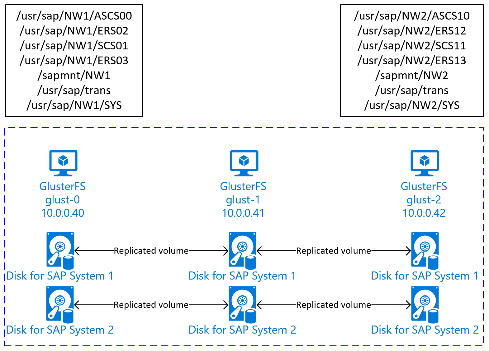

# GlusterFS on Azure VMs on Red Hat Enterprise Linux for SAP NetWeaver

[dbms-guide]:dbms-guide-general.md
[deployment-guide]:deployment-guide.md
[planning-guide]:planning-guide.md

[2002167]:https://launchpad.support.sap.com/#/notes/2002167
[2009879]:https://launchpad.support.sap.com/#/notes/2009879
[1928533]:https://launchpad.support.sap.com/#/notes/1928533
[2015553]:https://launchpad.support.sap.com/#/notes/2015553
[2178632]:https://launchpad.support.sap.com/#/notes/2178632
[2191498]:https://launchpad.support.sap.com/#/notes/2191498
[2243692]:https://launchpad.support.sap.com/#/notes/2243692
[1999351]:https://launchpad.support.sap.com/#/notes/1999351

[template-file-server]:https://portal.azure.com/#create/Microsoft.Template/uri/https%3A%2F%2Fraw.githubusercontent.com%2FAzure%2Fazure-quickstart-templates%2Fmaster%2Fapplication-workloads%2Fsap%2Fsap-file-server-md%2Fazuredeploy.json

[sap-hana-ha]:sap-hana-high-availability-rhel.md

This article describes how to deploy the virtual machines, configure the virtual machines, and install a GlusterFS cluster that can be used to store the shared data of a highly available SAP system.
This guide describes how to set up GlusterFS that is used by two SAP systems, NW1 and NW2. The names of the resources (for example virtual machines, virtual networks) in the example assume that you have used the [SAP file server template][template-file-server] with resource prefix **glust**.

Be aware that as documented in [Red Hat Gluster Storage Life Cycle](https://access.redhat.com/support/policy/updates/rhs) Red Hat Gluster Storage will reach end of life at the end of 2024. The configuration will be supported for SAP on Azure until it reaches end of life stage. GlusterFS should not be used for new deployments. We recommend to deploy the SAP shared directories on NFS on Azure Files or Azure NetApp Files volumes as documented in [HA for SAP NW on RHEL with NFS on Azure Files](./high-availability-guide-rhel-nfs-azure-files.md) or [HA for SAP NW on RHEL with Azure NetApp Files](./high-availability-guide-rhel-netapp-files.md).  

Read the following SAP Notes and papers first

* SAP Note [1928533], which has:
  * List of Azure VM sizes that are supported for the deployment of SAP software
  * Important capacity information for Azure VM sizes
  * Supported SAP software, and operating system (OS) and database combinations
  * Required SAP kernel version for Windows and Linux on Microsoft Azure

* SAP Note [2015553] lists prerequisites for SAP-supported SAP software deployments in Azure.
* SAP Note [2002167] has recommended OS settings for Red Hat Enterprise Linux
* SAP Note [2009879] has SAP HANA Guidelines for Red Hat Enterprise Linux
* SAP Note [2178632] has detailed information about all monitoring metrics reported for SAP in Azure.
* SAP Note [2191498] has the required SAP Host Agent version for Linux in Azure.
* SAP Note [2243692] has information about SAP licensing on Linux in Azure.
* SAP Note [1999351] has additional troubleshooting information for the Azure Enhanced Monitoring Extension for SAP.
* [SAP Community WIKI](https://wiki.scn.sap.com/wiki/display/HOME/SAPonLinuxNotes) has all required SAP Notes for Linux.
* [Azure Virtual Machines planning and implementation for SAP on Linux][planning-guide]
* [Azure Virtual Machines deployment for SAP on Linux (this article)][deployment-guide]
* [Azure Virtual Machines DBMS deployment for SAP on Linux][dbms-guide]
* [Product Documentation for Red Hat Gluster Storage](https://access.redhat.com/documentation/en-us/red_hat_gluster_storage/3.5)
* General RHEL documentation
  * [High Availability Add-On Overview](https://access.redhat.com/documentation/en-us/red_hat_enterprise_linux/7/html/high_availability_add-on_overview/index)
  * [High Availability Add-On Administration](https://access.redhat.com/documentation/en-us/red_hat_enterprise_linux/7/html/high_availability_add-on_administration/index)
  * [High Availability Add-On Reference](https://access.redhat.com/documentation/en-us/red_hat_enterprise_linux/7/html/high_availability_add-on_reference/index)
  * [Red Hat Gluster Storage Life Cycle](https://access.redhat.com/support/policy/updates/rhs)
* Azure specific RHEL documentation:
  * [Support Policies for RHEL High Availability Clusters - Microsoft Azure Virtual Machines as Cluster Members](https://access.redhat.com/articles/3131341)
  * [Installing and Configuring a Red Hat Enterprise Linux 7.4 (and later) High-Availability Cluster on Microsoft Azure](https://access.redhat.com/articles/3252491)

## Overview

To achieve high availability, SAP NetWeaver requires shared storage. GlusterFS is configured in a separate cluster and can be used by multiple SAP systems.  



## Set up GlusterFS

In this example, the resources were deployed manually via the [Azure portal](https://portal.azure.com/#home).

### Deploy Linux manually via Azure portal

This document assumes that you've already deployed a resource group, [Azure Virtual Network](../../virtual-network/virtual-networks-overview.md), and subnet.

Deploy virtual machines for GlusterFS. Choose a suitable RHEL image that is supported for Gluster storage. You can deploy VM in any one of the availability options - scale set, availability zone or availability set.

### Configure GlusterFS

The following items are prefixed with either **[A]** - applicable to all nodes, **[1]** - only applicable to node 1, **[2]** - only applicable to node 2, **[3]** - only applicable to node 3.

1. **[A]** Setup host name resolution

   You can either use a DNS server or modify the /etc/hosts on all nodes. This example shows how to use the /etc/hosts file.
   Replace the IP address and the hostname in the following commands

   ```bash
   sudo vi /etc/hosts
   ```

   Insert the following lines to /etc/hosts. Change the IP address and hostname to match your environment

   ```text
   # IP addresses of the Gluster nodes
   10.0.0.40 glust-0
   10.0.0.41 glust-1
   10.0.0.42 glust-2
   ```

1. **[A]** Register

   Register your virtual machines and attach it to a pool that contains repositories for RHEL 7 and GlusterFS

   ```bash
   sudo subscription-manager register
   sudo subscription-manager attach --pool=<pool id>
   ```

1. **[A]** Enable GlusterFS repos

   In order to install the required packages, enable the following repositories.

   ```bash
   sudo subscription-manager repos --disable "*"
   sudo subscription-manager repos --enable=rhel-7-server-rpms
   sudo subscription-manager repos --enable=rh-gluster-3-for-rhel-7-server-rpms
   ```
  
1. **[A]** Install GlusterFS packages

   Install these packages on all GlusterFS nodes

   ```bash
   sudo yum -y install redhat-storage-server
   ```

   Reboot the nodes after the installation.

1. **[A]** Modify Firewall

   Add firewall rules to allow client traffic to the GlusterFS nodes.

   ```bash
   # list the available zones
   firewall-cmd --get-active-zones
   
   sudo firewall-cmd --zone=public --add-service=glusterfs --permanent
   sudo firewall-cmd --zone=public --add-service=glusterfs
   ```

1. **[A]** Enable and start GlusterFS service

   Start the GlusterFS service on all nodes.

   ```bash
   sudo systemctl start glusterd
   sudo systemctl enable glusterd
   ```

1. **[1]** Create GluserFS

   Run the following commands to create the GlusterFS cluster

   ```bash
   sudo gluster peer probe glust-1
   sudo gluster peer probe glust-2
   
   # Check gluster peer status
   sudo gluster peer status
   
   # Number of Peers: 2
   # 
   # Hostname: glust-1
   # Uuid: 10d43840-fee4-4120-bf5a-de9c393964cd
   # State: Accepted peer request (Connected)
   # 
   # Hostname: glust-2
   # Uuid: 9e340385-12fe-495e-ab0f-4f851b588cba
   # State: Accepted peer request (Connected)
   ```

1. **[2]** Test peer status

   Test the peer status on the second node

   ```bash
   sudo gluster peer status
   # Number of Peers: 2
   #
   # Hostname: glust-0
   # Uuid: 6bc6927b-7ee2-461b-ad04-da123124d6bd
   # State: Peer in Cluster (Connected)
   #
   # Hostname: glust-2
   # Uuid: 9e340385-12fe-495e-ab0f-4f851b588cba
   # State: Peer in Cluster (Connected)
   ```

1. **[3]** Test peer status

   Test the peer status on the third node

   ```bash
   sudo gluster peer status
   # Number of Peers: 2
   #
   # Hostname: glust-0
   # Uuid: 6bc6927b-7ee2-461b-ad04-da123124d6bd
   # State: Peer in Cluster (Connected)
   #
   # Hostname: glust-1
   # Uuid: 10d43840-fee4-4120-bf5a-de9c393964cd
   # State: Peer in Cluster (Connected)
   ```

1. **[A]** Create LVM

   In this example, the GlusterFS is used for two SAP systems, NW1 and NW2. Use the following commands to create LVM configurations for these SAP systems.

   Use these commands for NW1

   ```bash
   sudo pvcreate --dataalignment 1024K /dev/disk/azure/scsi1/lun0
   sudo pvscan
   sudo vgcreate --physicalextentsize 256K rhgs-NW1 /dev/disk/azure/scsi1/lun0
   sudo vgscan
   sudo lvcreate -l 50%FREE -n rhgs-NW1/sapmnt
   sudo lvcreate -l 20%FREE -n rhgs-NW1/trans
   sudo lvcreate -l 10%FREE -n rhgs-NW1/sys
   sudo lvcreate -l 50%FREE -n rhgs-NW1/ascs
   sudo lvcreate -l 100%FREE -n rhgs-NW1/aers
   sudo lvscan
   
   sudo mkfs.xfs -f -K -i size=512 -n size=8192 /dev/rhgs-NW1/sapmnt
   sudo mkfs.xfs -f -K -i size=512 -n size=8192 /dev/rhgs-NW1/trans
   sudo mkfs.xfs -f -K -i size=512 -n size=8192 /dev/rhgs-NW1/sys
   sudo mkfs.xfs -f -K -i size=512 -n size=8192 /dev/rhgs-NW1/ascs
   sudo mkfs.xfs -f -K -i size=512 -n size=8192 /dev/rhgs-NW1/aers
   
   sudo mkdir -p /rhs/NW1/sapmnt
   sudo mkdir -p /rhs/NW1/trans
   sudo mkdir -p /rhs/NW1/sys
   sudo mkdir -p /rhs/NW1/ascs
   sudo mkdir -p /rhs/NW1/aers
   
   sudo chattr +i /rhs/NW1/sapmnt
   sudo chattr +i /rhs/NW1/trans
   sudo chattr +i /rhs/NW1/sys
   sudo chattr +i /rhs/NW1/ascs
   sudo chattr +i /rhs/NW1/aers
   
   echo -e "/dev/rhgs-NW1/sapmnt\t/rhs/NW1/sapmnt\txfs\tdefaults,inode64,nobarrier,noatime,nouuid 0 2" | sudo tee -a /etc/fstab
   echo -e "/dev/rhgs-NW1/trans\t/rhs/NW1/trans\txfs\tdefaults,inode64,nobarrier,noatime,nouuid 0 2" | sudo tee -a /etc/fstab
   echo -e "/dev/rhgs-NW1/sys\t/rhs/NW1/sys\txfs\tdefaults,inode64,nobarrier,noatime,nouuid 0 2" | sudo tee -a /etc/fstab
   echo -e "/dev/rhgs-NW1/ascs\t/rhs/NW1/ascs\txfs\tdefaults,inode64,nobarrier,noatime,nouuid 0 2" | sudo tee -a /etc/fstab
   echo -e "/dev/rhgs-NW1/aers\t/rhs/NW1/aers\txfs\tdefaults,inode64,nobarrier,noatime,nouuid 0 2" | sudo tee -a /etc/fstab
   
   sudo mount -a
   ```

   Use these commands for NW2

   ```bash
   sudo pvcreate --dataalignment 1024K /dev/disk/azure/scsi1/lun1
   sudo pvscan
   sudo vgcreate --physicalextentsize 256K rhgs-NW2 /dev/disk/azure/scsi1/lun1
   sudo vgscan
   sudo lvcreate -l 50%FREE -n rhgs-NW2/sapmnt
   sudo lvcreate -l 20%FREE -n rhgs-NW2/trans
   sudo lvcreate -l 10%FREE -n rhgs-NW2/sys
   sudo lvcreate -l 50%FREE -n rhgs-NW2/ascs
   sudo lvcreate -l 100%FREE -n rhgs-NW2/aers
   
   sudo mkfs.xfs -f -K -i size=512 -n size=8192 /dev/rhgs-NW2/sapmnt
   sudo mkfs.xfs -f -K -i size=512 -n size=8192 /dev/rhgs-NW2/trans
   sudo mkfs.xfs -f -K -i size=512 -n size=8192 /dev/rhgs-NW2/sys
   sudo mkfs.xfs -f -K -i size=512 -n size=8192 /dev/rhgs-NW2/ascs
   sudo mkfs.xfs -f -K -i size=512 -n size=8192 /dev/rhgs-NW2/aers
   
   sudo mkdir -p /rhs/NW2/sapmnt
   sudo mkdir -p /rhs/NW2/trans
   sudo mkdir -p /rhs/NW2/sys
   sudo mkdir -p /rhs/NW2/ascs
   sudo mkdir -p /rhs/NW2/aers
   
   sudo chattr +i /rhs/NW2/sapmnt
   sudo chattr +i /rhs/NW2/trans
   sudo chattr +i /rhs/NW2/sys
   sudo chattr +i /rhs/NW2/ascs
   sudo chattr +i /rhs/NW2/aers
   sudo lvscan
   
   echo -e "/dev/rhgs-NW2/sapmnt\t/rhs/NW2/sapmnt\txfs\tdefaults,inode64,nobarrier,noatime,nouuid 0 2" | sudo tee -a /etc/fstab
   echo -e "/dev/rhgs-NW2/trans\t/rhs/NW2/trans\txfs\tdefaults,inode64,nobarrier,noatime,nouuid 0 2" | sudo tee -a /etc/fstab
   echo -e "/dev/rhgs-NW2/sys\t/rhs/NW2/sys\txfs\tdefaults,inode64,nobarrier,noatime,nouuid 0 2" | sudo tee -a /etc/fstab
   echo -e "/dev/rhgs-NW2/ascs\t/rhs/NW2/ascs\txfs\tdefaults,inode64,nobarrier,noatime,nouuid 0 2" | sudo tee -a /etc/fstab
   echo -e "/dev/rhgs-NW2/aers\t/rhs/NW2/aers\txfs\tdefaults,inode64,nobarrier,noatime,nouuid 0 2" | sudo tee -a /etc/fstab
   
   sudo mount -a
   ```

1. **[1]** Create the distributed volume

   Use the following commands to create the GlusterFS volume for NW1 and start it.

   ```bash
   sudo gluster vol create NW1-sapmnt replica 3 glust-0:/rhs/NW1/sapmnt glust-1:/rhs/NW1/sapmnt glust-2:/rhs/NW1/sapmnt force
   sudo gluster vol create NW1-trans replica 3 glust-0:/rhs/NW1/trans glust-1:/rhs/NW1/trans glust-2:/rhs/NW1/trans force
   sudo gluster vol create NW1-sys replica 3 glust-0:/rhs/NW1/sys glust-1:/rhs/NW1/sys glust-2:/rhs/NW1/sys force
   sudo gluster vol create NW1-ascs replica 3 glust-0:/rhs/NW1/ascs glust-1:/rhs/NW1/ascs glust-2:/rhs/NW1/ascs force
   sudo gluster vol create NW1-aers replica 3 glust-0:/rhs/NW1/aers glust-1:/rhs/NW1/aers glust-2:/rhs/NW1/aers force
   
   sudo gluster volume start NW1-sapmnt
   sudo gluster volume start NW1-trans
   sudo gluster volume start NW1-sys
   sudo gluster volume start NW1-ascs
   sudo gluster volume start NW1-aers
   ```

   Use the following commands to create the GlusterFS volume for NW2 and start it.

   ```bash
   sudo gluster vol create NW2-sapmnt replica 3 glust-0:/rhs/NW2/sapmnt glust-1:/rhs/NW2/sapmnt glust-2:/rhs/NW2/sapmnt force
   sudo gluster vol create NW2-trans replica 3 glust-0:/rhs/NW2/trans glust-1:/rhs/NW2/trans glust-2:/rhs/NW2/trans force
   sudo gluster vol create NW2-sys replica 3 glust-0:/rhs/NW2/sys glust-1:/rhs/NW2/sys glust-2:/rhs/NW2/sys force
   sudo gluster vol create NW2-ascs replica 3 glust-0:/rhs/NW2/ascs glust-1:/rhs/NW2/ascs glust-2:/rhs/NW2/ascs force
   sudo gluster vol create NW2-aers replica 3 glust-0:/rhs/NW2/aers glust-1:/rhs/NW2/aers glust-2:/rhs/NW2/aers force
   
   sudo gluster volume start NW2-sapmnt
   sudo gluster volume start NW2-trans
   sudo gluster volume start NW2-sys
   sudo gluster volume start NW2-ascs
   sudo gluster volume start NW2-aers
   ```

## Next steps

* [Install the SAP ASCS and database](high-availability-guide-rhel.md)
* [Azure Virtual Machines planning and implementation for SAP][planning-guide]
* [Azure Virtual Machines deployment for SAP][deployment-guide]
* [Azure Virtual Machines DBMS deployment for SAP][dbms-guide]
* To learn how to establish high availability and plan for disaster recovery of SAP HANA on Azure (large instances), see [SAP HANA (large instances) high availability and disaster recovery on Azure](../../virtual-machines/workloads/sap/hana-overview-high-availability-disaster-recovery.md).
* To learn how to establish high availability and plan for disaster recovery of SAP HANA on Azure VMs, see [High Availability of SAP HANA on Azure Virtual Machines (VMs)][sap-hana-ha]
