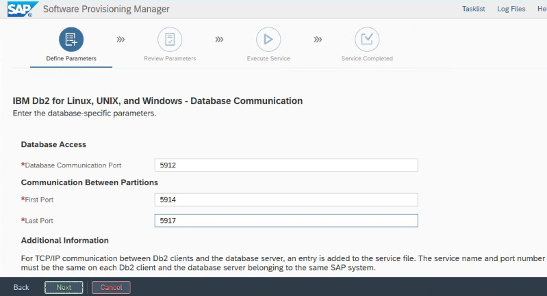
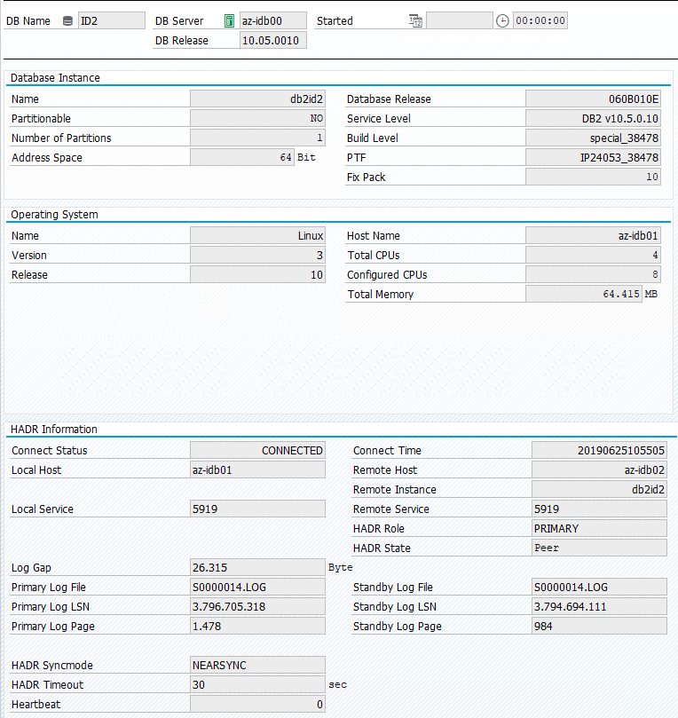

# High availability of IBM Db2 LUW on Azure VMs on Red Hat Enterprise Linux Server

IBM Db2 for Linux, UNIX, and Windows (LUW) in [high availability and disaster recovery (HADR) configuration](https://www.ibm.com/support/knowledgecenter/en/SSEPGG_10.5.0/com.ibm.db2.luw.admin.ha.doc/doc/c0011267.html) consists of one node that runs a primary database instance and at least one node that runs a secondary database instance. Changes to the primary database instance are replicated to a secondary database instance synchronously or asynchronously, depending on your configuration. 

> [!NOTE]
> This article contains references to terms that Microsoft no longer uses. When these terms are removed from the software, we'll remove them from this article.

This article describes how to deploy and configure the Azure virtual machines (VMs), install the cluster framework, and install the IBM Db2 LUW with HADR configuration. 

The article doesn't cover how to install and configure IBM Db2 LUW with HADR or SAP software installation. To help you accomplish these tasks, we provide references to SAP and IBM installation manuals. This article focuses on parts that are specific to the Azure environment. 

The supported IBM Db2 versions are 10.5 and later, as documented in SAP note [1928533].

Before you begin an installation, see the following SAP notes and documentation:

| SAP note | Description |
| --- | --- |
| [1928533] | SAP applications on Azure: Supported products and Azure VM types |
| [2015553] | SAP on Azure: Support prerequisites |
| [2178632] | Key monitoring metrics for SAP on Azure |
| [2191498] | SAP on Linux with Azure: Enhanced monitoring |
| [2243692] | Linux on Azure (IaaS) VM: SAP license issues |
| [2002167] | Red Hat Enterprise Linux 7.x: Installation and Upgrade |
| [2694118] | Red Hat Enterprise Linux HA Add-On on Azure |
| [1999351] | Troubleshooting enhanced Azure monitoring for SAP |
| [2233094] | DB6: SAP applications on Azure that use IBM Db2 for Linux, UNIX, and Windows - additional information |
| [1612105] | DB6: FAQ on Db2 with HADR |

| Documentation | 
| --- |
| [SAP Community Wiki](https://wiki.scn.sap.com/wiki/display/HOME/SAPonLinuxNotes): Has all of the required SAP Notes for Linux |
| [Azure Virtual Machines planning and implementation for SAP on Linux][planning-guide] guide |
| [Azure Virtual Machines deployment for SAP on Linux][deployment-guide] (this article) |
| [Azure Virtual Machines database management system(DBMS) deployment for SAP on Linux][dbms-guide] guide |
| [SAP workload on Azure planning and deployment checklist][azr-sap-plancheck] |
| [Overview of the High Availability Add-On for Red Hat Enterprise Linux 7][rhel-ha-addon] |
| [High Availability Add-On Administration][rhel-ha-admin] |
| [High Availability Add-On Reference][rhel-ha-ref] |
| [Support Policies for RHEL High Availability Clusters - Microsoft Azure Virtual Machines as Cluster Members][rhel-azr-supp]
| [Installing and Configuring a Red Hat Enterprise Linux 7.4 (and later) High-Availability Cluster on Microsoft Azure][rhel-azr-inst]
| [IBM Db2 Azure Virtual Machines DBMS deployment for SAP workload][dbms-db2] |
| [IBM Db2 HADR 11.1][db2-hadr-11.1] |
| [IBM Db2 HADR 10.5][db2-hadr-10.5] |
| [Support Policy for RHEL High Availability Clusters - Management of IBM Db2 for Linux, Unix, and Windows in a Cluster][rhel-db2-supp]

## Overview
To achieve high availability, IBM Db2 LUW with HADR is installed on at least two Azure virtual machines, which are deployed in an [virtual machine scale set](./virtual-machine-scale-set-sap-deployment-guide.md) with flexible orchestration across [availability zones](./high-availability-zones.md) or in an [availability set](../../virtual-machines/windows/tutorial-availability-sets.md). 

The following graphics display a setup of two database server Azure VMs. Both database server Azure VMs have their own storage attached and are up and running. In HADR, one database instance in one of the Azure VMs has the role of the primary instance. All clients are connected to primary instance. All changes in database transactions are persisted locally in the Db2 transaction log. As the transaction log records are persisted locally, the records are transferred via TCP/IP to the database instance on the second database server, the standby server, or standby instance. The standby instance updates the local database by rolling forward the transferred transaction log records. In this way, the standby server is kept in sync with the primary server.

HADR is only a replication functionality. It has no failure detection and no automatic takeover or failover facilities. A takeover or transfer to the standby server must be initiated manually by a database administrator. To achieve an automatic takeover and failure detection, you can use the Linux Pacemaker clustering feature. Pacemaker monitors the two database server instances. When the primary database server instance crashes, Pacemaker initiates an *automatic* HADR takeover by the standby server. Pacemaker also ensures that the virtual IP address is assigned to the new primary server.

To have SAP application servers connect to primary database, you need a virtual host name and a virtual IP address. In the event of a failover, the SAP application servers will connect to new primary database instance. In an Azure environment, an [Azure load balancer](https://microsoft.sharepoint.com/teams/WAG/AzureNetworking/Wiki/Load%20Balancing.aspx) is required to use a virtual IP address in the way that's required for HADR of IBM Db2. 

To help you fully understand how IBM Db2 LUW with HADR and Pacemaker fits into a highly available SAP system setup, the following image presents an overview of a highly available setup of an SAP system based on IBM Db2 database. This article covers only IBM Db2, but it provides references to other articles about how to set up other components of an SAP system.

### High-level overview of the required steps
To deploy an IBM Db2 configuration, you need to follow these steps:

  + Plan your environment.
  + Deploy the VMs.
  + Update RHEL Linux and configure file systems.
  + Install and configure Pacemaker.
  + Setup [glusterfs cluster][glusterfs] or [Azure NetApp Files][anf-rhel]
  + Install [ASCS/ERS on a separate cluster][ascs-ha-rhel].
  + Install IBM Db2 database with Distributed/High Availability option (SWPM).
  + Install and create a secondary database node and instance, and configure HADR.
  + Confirm that HADR is working.
  + Apply the Pacemaker configuration to control IBM Db2.
  + Configure Azure Load Balancer.
  + Install primary and dialog application servers.
  + Check and adapt the configuration of SAP application servers.
  + Perform failover and takeover tests.

## Plan Azure infrastructure for hosting IBM Db2 LUW with HADR

Complete the planning process before you execute the deployment. Planning builds the foundation for deploying a configuration of Db2 with HADR in Azure. Key elements that need to be part of planning for IMB Db2 LUW (database part of SAP environment) are listed in the following table:

| Topic | Short description |
| --- | --- |
| Define Azure resource groups | Resource groups where you deploy VM, VNet, Azure Load Balancer, and other resources. Can be existing or new. |
| Virtual network / Subnet definition | Where VMs for IBM Db2 and Azure Load Balancer are being deployed. Can be existing or newly created. |
| Virtual machines hosting IBM Db2 LUW | VM size, storage, networking, IP address. |
| Virtual host name and virtual IP for IBM Db2 database| The virtual IP or host name that's used for connection of SAP application servers. **db-virt-hostname**, **db-virt-ip**. |
| Azure fencing | Method to avoid split brain situations is prevented. |
| Azure Load Balancer | Usage of Standard (recommended), probe port for Db2 database (our recommendation 62500) **probe-port**. |
| Name resolution| How name resolution works in the environment. DNS service is highly recommended. Local hosts file can be used. |
	
For more information about Linux Pacemaker in Azure, see [Setting up Pacemaker on Red Hat Enterprise Linux in Azure][rhel-pcs-azr].

>[!IMPORTANT]
>For Db2 versions 11.5.6 and higher we highly recommend Integrated solution using Pacemaker from IBM. 
>* [Integrated solution using Pacemaker](https://www.ibm.com/docs/en/db2/11.5?topic=feature-integrated-solution-using-pacemaker)
>* [Alternate or additional configurations available on Microsoft Azure](https://www.ibm.com/support/pages/alternate-or-additional-configurations-available-microsoft-azure)

## Deployment on Red Hat Enterprise Linux

The resource agent for IBM Db2 LUW is included in Red Hat Enterprise Linux Server HA Addon. For the setup that's described in this document, you should use Red Hat Enterprise Linux for SAP. The Azure Marketplace contains an image for Red Hat Enterprise Linux 7.4 for SAP or higher that you can use to deploy new Azure virtual machines. Be aware of the various support or service models that are offered by Red Hat through the Azure Marketplace when you choose a VM image in the Azure VM Marketplace.

### Hosts: DNS updates
Make a list of all host names, including virtual host names, and update your DNS servers to enable proper IP address to host-name resolution. If a DNS server doesn't exist or you can't update and create DNS entries, you need to use the local host files of the individual VMs that are participating in this scenario. If you're using host files entries, make sure that the entries are applied to all VMs in the SAP system environment. However, we recommend that you use your DNS that, ideally, extends into Azure

### Manual deployment

Make sure that the selected OS is supported by IBM/SAP for IBM Db2 LUW. The list of supported OS versions for Azure VMs and Db2 releases is available in SAP note [1928533]. The list of OS releases by individual Db2 release is available in the SAP Product Availability Matrix. We highly recommend a minimum of Red Hat Enterprise Linux 7.4 for SAP because of Azure-related performance improvements in this or later Red Hat Enterprise Linux versions.

1. Create or select a resource group.
1. Create or select a virtual network and subnet.
1. Choose a [suitable deployment type](./sap-high-availability-architecture-scenarios.md#comparison-of-different-deployment-types-for-sap-workload) for SAP virtual machines. Typically a virtual machine scale set with flexible orchestration.
1. Create Virtual Machine 1.
    + Use Red Hat Enterprise Linux for SAP image in the Azure Marketplace.
    + Select the scale set, availability zone or availability set created in step 3.
1.  Create Virtual Machine 2.
    + Use Red Hat Enterprise Linux for SAP image in the Azure Marketplace.
    + Select the scale set, availability zone or availability set created in step 3 (not the same zone as in step 4).
1. Add data disks to the VMs, and then check the recommendation of a file system setup in the article [IBM Db2 Azure Virtual Machines DBMS deployment for SAP workload][dbms-db2].

## Install the IBM Db2 LUW and SAP environment

Before you start the installation of an SAP environment based on IBM Db2 LUW, review the following documentation:

+ Azure documentation
+ SAP documentation
+ IBM documentation

Links to this documentation are provided in the introductory section of this article.

Check the SAP installation manuals about installing NetWeaver-based applications on IBM Db2 LUW.
You can find the guides on the SAP Help portal by using the [SAP Installation Guide Finder][sap-instfind].

You can reduce the number of guides displayed in the portal by setting the following filters:
- I want to: "Install a new system"
- My Database: "IBM Db2 for Linux, Unix, and Windows"
- Additional filters for SAP NetWeaver versions, stack configuration, or operating system

#### Red Hat firewall rules
Red Hat Enterprise Linux has firewall enabled by default. 

<pre><code>#Allow access to SWPM tool. Rule is not permanent.
sudo firewall-cmd --add-port=4237/tcp</code></pre>

### Installation hints for setting up IBM Db2 LUW with HADR

To set up the primary IBM Db2 LUW database instance:

- Use the high availability or distributed option.
- Install the SAP ASCS/ERS and Database instance.
- Take a backup of the newly installed database.

> [!IMPORTANT] 
> Write down the "Database Communication port" that's set during installation. It must be the same port number for both database instances.
>

### IBM Db2 HADR settings for Azure

   When you use an Azure Pacemaker fencing agent, set the following parameters:

   - HADR peer window duration (seconds) (HADR_PEER_WINDOW) = 240  
   - HADR timeout value (HADR_TIMEOUT) = 45

We recommend the preceding parameters based on initial failover/takeover testing. It is mandatory that you test for proper functionality of failover and takeover with these parameter settings. Because individual configurations can vary, the parameters might require adjustment. 

> [!NOTE]
> Specific to IBM Db2 with HADR configuration with normal startup: The secondary or standby database instance must be up and running before you can start the primary database instance.

   
> [!NOTE]
> For installation and configuration that's specific to Azure and Pacemaker: During the installation procedure through SAP Software Provisioning Manager, there is an explicit question about high availability for IBM Db2 LUW:
>+ Do not select **IBM Db2 pureScale**.
>+ Do not select **Install IBM Tivoli System Automation for Multiplatforms**.
>+ Do not select **Generate cluster configuration files**.
>

To set up the Standby database server by using the SAP homogeneous system copy procedure, execute these steps:

1. Select the **System copy** option > **Target systems** > **Distributed** > **Database instance**.
1. As a copy method, select **Homogeneous System** so that you can use backup to restore a backup on the standby server instance.
1. When you reach the exit step to restore the database for homogeneous system copy, exit the installer. Restore the database from a backup of the primary host. All subsequent installation phases have already been executed on the primary database server.

#### Red Hat firewall rules for DB2 HADR
Add firewall rules to allow traffic to DB2 and between DB2 for HADR to work:
+ Database communication port. If using partitions, add those ports too.
+ HADR port (value of DB2 parameter HADR_LOCAL_SVC)
+ Azure probe port
<pre><code>sudo firewall-cmd --add-port=&lt;port&gt;/tcp --permanent
sudo firewall-cmd --reload</code></pre>

#### IBM Db2 HADR check
For demonstration purposes and the procedures described in this article, the database SID is **ID2**.

After you've configured HADR and the status is PEER and CONNECTED on the primary and standby nodes, perform the following check:

<pre><code>
Execute command as db2&lt;sid&gt; db2pd -hadr -db &lt;SID&gt;

#Primary output:
Database Member 0 -- Database ID2 -- Active -- Up 1 days 15:45:23 -- Date 2019-06-25-10.55.25.349375

                            <b>HADR_ROLE = PRIMARY
                          REPLAY_TYPE = PHYSICAL
                        HADR_SYNCMODE = NEARSYNC
                           STANDBY_ID = 1
                        LOG_STREAM_ID = 0
                           HADR_STATE = PEER
                           HADR_FLAGS =
                  PRIMARY_MEMBER_HOST = az-idb01
                     PRIMARY_INSTANCE = db2id2
                       PRIMARY_MEMBER = 0
                  STANDBY_MEMBER_HOST = az-idb02
                     STANDBY_INSTANCE = db2id2
                       STANDBY_MEMBER = 0
                  HADR_CONNECT_STATUS = CONNECTED</b>
             HADR_CONNECT_STATUS_TIME = 06/25/2019 10:55:05.076494 (1561460105)
          HEARTBEAT_INTERVAL(seconds) = 7
                     HEARTBEAT_MISSED = 5
                   HEARTBEAT_EXPECTED = 52
                HADR_TIMEOUT(seconds) = 30
        TIME_SINCE_LAST_RECV(seconds) = 5
             PEER_WAIT_LIMIT(seconds) = 0
           LOG_HADR_WAIT_CUR(seconds) = 0.000
    LOG_HADR_WAIT_RECENT_AVG(seconds) = 598.000027
   LOG_HADR_WAIT_ACCUMULATED(seconds) = 598.000
                  LOG_HADR_WAIT_COUNT = 1
SOCK_SEND_BUF_REQUESTED,ACTUAL(bytes) = 0, 46080
SOCK_RECV_BUF_REQUESTED,ACTUAL(bytes) = 0, 369280
            PRIMARY_LOG_FILE,PAGE,POS = S0000012.LOG, 14151, 3685322855
            STANDBY_LOG_FILE,PAGE,POS = S0000012.LOG, 14151, 3685322855
                  HADR_LOG_GAP(bytes) = 132242668
     STANDBY_REPLAY_LOG_FILE,PAGE,POS = S0000012.LOG, 14151, 3685322855
       STANDBY_RECV_REPLAY_GAP(bytes) = 0
                     PRIMARY_LOG_TIME = 06/25/2019 10:45:42.000000 (1561459542)
                     STANDBY_LOG_TIME = 06/25/2019 10:45:42.000000 (1561459542)
              STANDBY_REPLAY_LOG_TIME = 06/25/2019 10:45:42.000000 (1561459542)
         STANDBY_RECV_BUF_SIZE(pages) = 2048
             STANDBY_RECV_BUF_PERCENT = 0
           STANDBY_SPOOL_LIMIT(pages) = 1000
                STANDBY_SPOOL_PERCENT = 0
                   STANDBY_ERROR_TIME = NULL
                 PEER_WINDOW(seconds) = 300
                      PEER_WINDOW_END = 06/25/2019 11:12:03.000000 (1561461123)
             READS_ON_STANDBY_ENABLED = N

#Secondary output:
Database Member 0 -- Database ID2 -- Standby -- Up 1 days 15:45:18 -- Date 2019-06-25-10.56.19.820474

                            <b>HADR_ROLE = STANDBY
                          REPLAY_TYPE = PHYSICAL
                        HADR_SYNCMODE = NEARSYNC
                           STANDBY_ID = 0
                        LOG_STREAM_ID = 0
                           HADR_STATE = PEER
                           HADR_FLAGS =
                  PRIMARY_MEMBER_HOST = az-idb01
                     PRIMARY_INSTANCE = db2id2
                       PRIMARY_MEMBER = 0
                  STANDBY_MEMBER_HOST = az-idb02
                     STANDBY_INSTANCE = db2id2
                       STANDBY_MEMBER = 0
                  HADR_CONNECT_STATUS = CONNECTED</b>
             HADR_CONNECT_STATUS_TIME = 06/25/2019 10:55:05.078116 (1561460105)
          HEARTBEAT_INTERVAL(seconds) = 7
                     HEARTBEAT_MISSED = 0
                   HEARTBEAT_EXPECTED = 10
                HADR_TIMEOUT(seconds) = 30
        TIME_SINCE_LAST_RECV(seconds) = 1
             PEER_WAIT_LIMIT(seconds) = 0
           LOG_HADR_WAIT_CUR(seconds) = 0.000
    LOG_HADR_WAIT_RECENT_AVG(seconds) = 598.000027
   LOG_HADR_WAIT_ACCUMULATED(seconds) = 598.000
                  LOG_HADR_WAIT_COUNT = 1
SOCK_SEND_BUF_REQUESTED,ACTUAL(bytes) = 0, 46080
SOCK_RECV_BUF_REQUESTED,ACTUAL(bytes) = 0, 367360
            PRIMARY_LOG_FILE,PAGE,POS = S0000012.LOG, 14151, 3685322855
            STANDBY_LOG_FILE,PAGE,POS = S0000012.LOG, 14151, 3685322855
                  HADR_LOG_GAP(bytes) = 0
     STANDBY_REPLAY_LOG_FILE,PAGE,POS = S0000012.LOG, 14151, 3685322855
       STANDBY_RECV_REPLAY_GAP(bytes) = 0
                     PRIMARY_LOG_TIME = 06/25/2019 10:45:42.000000 (1561459542)
                     STANDBY_LOG_TIME = 06/25/2019 10:45:42.000000 (1561459542)
              STANDBY_REPLAY_LOG_TIME = 06/25/2019 10:45:42.000000 (1561459542)
         STANDBY_RECV_BUF_SIZE(pages) = 2048
             STANDBY_RECV_BUF_PERCENT = 0
           STANDBY_SPOOL_LIMIT(pages) = 1000
                STANDBY_SPOOL_PERCENT = 0
                   STANDBY_ERROR_TIME = NULL
                 PEER_WINDOW(seconds) = 1000
                      PEER_WINDOW_END = 06/25/2019 11:12:59.000000 (1561461179)
             READS_ON_STANDBY_ENABLED = N
</code></pre>

### Configure Azure Load Balancer

To configure Azure Load Balancer, we recommend that you use the [Azure Standard Load Balancer SKU](../../load-balancer/load-balancer-overview.md) and then do the following;

> [!NOTE]
> The Standard Load Balancer SKU has restrictions accessing public IP addresses from the nodes underneath the Load Balancer. The article [Public endpoint connectivity for Virtual Machines using Azure Standard Load Balancer in SAP high-availability scenarios](./high-availability-guide-standard-load-balancer-outbound-connections.md) is describing ways on how to enable those nodes to access public IP addresses

> [!IMPORTANT]
> Floating IP is not supported on a NIC secondary IP configuration in load-balancing scenarios. For details see [Azure Load balancer Limitations](../../load-balancer/load-balancer-multivip-overview.md#limitations). If you need additional IP address for the VM, deploy a second NIC.  

1. Create a front-end IP pool:

   a. In the Azure portal, open the Azure Load Balancer, select **frontend IP pool**, and then select **Add**.

   b. Enter the name of the new front-end IP pool (for example, **Db2-connection**).

   c. Set the **Assignment** to **Static**, and enter the IP address **Virtual-IP** defined at the beginning.

   d. Select **OK**.

   e. After the new front-end IP pool is created, note the pool IP address.

1. Create a single back-end pool: 

   1. Open the load balancer, select **Backend pools**, and then select **Add**.
   
   1. Enter the name of the new back-end pool (for example, **Db2-backend**).
   
   2. Select **NIC** for Backend Pool Configuration.
    
   1. Select **Add a virtual machine**.
   
   1. Select the virtual machines of the cluster.
   
   1. Select **Add**.
        
   2. Select **Save**.   

1. Create a health probe:

   a. In the Azure portal, open the Azure Load Balancer, select **health probes**, and select **Add**.

   b. Enter the name of the new health probe (for example, **Db2-hp**).

   c. Select **TCP** as the protocol and port **62500**. Keep the **Interval** value set to **5**.

   d. Select **OK**.

1. Create the load-balancing rules:

   a. In the Azure portal, open the Azure Load Balancer, select **Load balancing rules**, and then select **Add**.

   b. Enter the name of the new Load Balancer rule (for example, **Db2-SID**).

   c. Select the front-end IP address, the back-end pool, and the health probe that you created earlier (for example, **Db2-frontend**).

   d. Keep the **Protocol** set to **TCP**, and enter port *Database Communication port*.

   e. Increase the **idle timeout** to 30 minutes.

   f. Make sure to **enable Floating IP**.

   g. Select **OK**.

**[A]** Add firewall rule for probe port:

<pre><code>sudo firewall-cmd --add-port=<b>&lt;probe-port&gt;</b>/tcp --permanent
sudo firewall-cmd --reload</code></pre>

## Create the Pacemaker cluster
	
To create a basic Pacemaker cluster for this IBM Db2 server, see [Setting up Pacemaker on Red Hat Enterprise Linux in Azure][rhel-pcs-azr]. 

## Db2 Pacemaker configuration

When you use Pacemaker for automatic failover in the event of a node failure, you need to configure your Db2 instances and Pacemaker accordingly. This section describes this type of configuration.

The following items are prefixed with either:

- **[A]**: Applicable to all nodes
- **[1]**: Applicable only to node 1 
- **[2]**: Applicable only to node 2

**[A]** Prerequisite for Pacemaker configuration:
1. Shut down both database servers with user db2\<sid> with db2stop.
1. Change the shell environment for db2\<sid> user to */bin/ksh*:
<pre><code># Install korn shell:
sudo yum install ksh
# Change users shell:
sudo usermod -s /bin/ksh db2&lt;sid&gt;</code></pre>  

### Pacemaker configuration

**[1]** IBM Db2 HADR-specific Pacemaker configuration:
<pre><code># Put Pacemaker into maintenance mode
sudo pcs property set maintenance-mode=true	
</code></pre>

**[1]** Create IBM Db2 resources:

If building a cluster on **RHEL 7.x**, make sure to update package **resource-agents** to version `resource-agents-4.1.1-61.el7_9.15` or higher. Use the following commands to create the cluster resources:

<pre><code># Replace <b>bold strings</b> with your instance name db2sid, database SID, and virtual IP address/Azure Load Balancer.
sudo pcs resource create Db2_HADR_<b>ID2</b> db2 instance='<b>db2id2</b>' dblist='<b>ID2</b>' master meta notify=true resource-stickiness=5000

#Configure resource stickiness and correct cluster notifications for master resoruce
sudo pcs resource update Db2_HADR_<b>ID2</b>-master meta notify=true resource-stickiness=5000

# Configure virtual IP - same as Azure Load Balancer IP
sudo pcs resource create vip_<b>db2id2</b>_<b>ID2</b> IPaddr2 ip='<b>10.100.0.40</b>'

# Configure probe port for Azure load Balancer
sudo pcs resource create nc_<b>db2id2</b>_<b>ID2</b> azure-lb port=<b>62500</b>

#Create a group for ip and Azure loadbalancer probe port
sudo pcs resource group add g_ipnc_<b>db2id2</b>_<b>ID2</b> vip_<b>db2id2</b>_<b>ID2</b> nc_<b>db2id2</b>_<b>ID2</b>

#Create colocation constrain - keep Db2 HADR Master and Group on same node
sudo pcs constraint colocation add g_ipnc_<b>db2id2</b>_<b>ID2</b> with master Db2_HADR_<b>ID2</b>-master

#Create start order constrain
sudo pcs constraint order promote Db2_HADR_<b>ID2</b>-master then g_ipnc_<b>db2id2</b>_<b>ID2</b>
</code></pre>

If building a cluster on **RHEL 8.x**, make sure to update package **resource-agents** to version `resource-agents-4.1.1-93.el8` or higher. For details see Red Hat KB [A `db2` resource with HADR fails promote with state `PRIMARY/REMOTE_CATCHUP_PENDING/CONNECTED`](https://access.redhat.com/solutions/6516791). Use the following commands to create the cluster resources:

<pre><code># Replace <b>bold strings</b> with your instance name db2sid, database SID, and virtual IP address/Azure Load Balancer.
sudo pcs resource create Db2_HADR_<b>ID2</b> db2 instance='<b>db2id2</b>' dblist='<b>ID2</b>' promotable meta notify=true resource-stickiness=5000

#Configure resource stickiness and correct cluster notifications for master resoruce
sudo pcs resource update Db2_HADR_<b>ID2</b>-clone meta notify=true resource-stickiness=5000

# Configure virtual IP - same as Azure Load Balancer IP
sudo pcs resource create vip_<b>db2id2</b>_<b>ID2</b> IPaddr2 ip='<b>10.100.0.40</b>'

# Configure probe port for Azure load Balancer
sudo pcs resource create nc_<b>db2id2</b>_<b>ID2</b> azure-lb port=<b>62500</b>

#Create a group for ip and Azure loadbalancer probe port
sudo pcs resource group add g_ipnc_<b>db2id2</b>_<b>ID2</b> vip_<b>db2id2</b>_<b>ID2</b> nc_<b>db2id2</b>_<b>ID2</b>

#Create colocation constrain - keep Db2 HADR Master and Group on same node
sudo pcs constraint colocation add g_ipnc_<b>db2id2</b>_<b>ID2</b> with master Db2_HADR_<b>ID2</b>-clone

#Create start order constrain
sudo pcs constraint order promote Db2_HADR_<b>ID2</b>-clone then g_ipnc_<b>db2id2</b>_<b>ID2</b>
</code></pre>

**[1]** Start IBM Db2 resources:
* Put Pacemaker out of maintenance mode.
<pre><code># Put Pacemaker out of maintenance-mode - that start IBM Db2
sudo pcs property set maintenance-mode=false</pre></code>

**[1]** Make sure that the cluster status is OK and that all of the resources are started. It's not important which node the resources are running on.
<pre><code>sudo pcs status
2 nodes configured
5 resources configured

Online: [ az-idb01 az-idb02 ]

Full list of resources:

 rsc_st_azure   (stonith:fence_azure_arm):      Started az-idb01
 Master/Slave Set: Db2_HADR_ID2-master [Db2_HADR_ID2]
     Masters: [ az-idb01 ]
     Slaves: [ az-idb02 ]
 Resource Group: g_ipnc_db2id2_ID2
     vip_db2id2_ID2     (ocf::heartbeat:IPaddr2):       Started az-idb01
     nc_db2id2_ID2      (ocf::heartbeat:azure-lb):      Started az-idb01

Daemon Status:
  corosync: active/disabled
  pacemaker: active/disabled
  pcsd: active/enabled
</code></pre>

> [!IMPORTANT]
> You must manage the Pacemaker clustered Db2 instance by using Pacemaker tools. If you use db2 commands such as db2stop, Pacemaker detects the action as a failure of resource. If you're performing maintenance, you can put the nodes or resources in maintenance mode. Pacemaker suspends  monitoring resources, and you can then use normal db2 administration commands.

### Make changes to SAP profiles to use virtual IP for connection
To connect to the primary instance of the HADR configuration, the SAP application layer needs to use the virtual IP address that you defined and configured for the Azure Load Balancer. The following changes are required:

/sapmnt/\<SID>/profile/DEFAULT.PFL
<pre><code>SAPDBHOST = db-virt-hostname
j2ee/dbhost = db-virt-hostname
</code></pre>

/sapmnt/\<SID>/global/db6/db2cli.ini
<pre><code>Hostname=db-virt-hostname
</code></pre>

## Install primary and dialog application servers

When you install primary and dialog application servers against an Db2 HADR configuration, use the virtual host name that you picked for the configuration.

If you performed the installation before you created the Db2 HADR configuration, make the changes as described in the preceding section and as follows for SAP Java stacks.

### ABAP+Java or Java stack systems JDBC URL check

Use the J2EE Config tool to check or update the JDBC URL. Because the J2EE Config tool is a graphical tool, you need to have X server installed:
 
1. Sign in to the primary application server of the J2EE instance and execute:
	
	<pre><code>sudo /usr/sap/*SID*/*Instance*/j2ee/configtool/configtool.sh</code></pre>  
	
1. In the left frame, choose **security store**.
1. In the right frame, choose the key `jdbc/pool/\<SAPSID>/url`.
1. Change the host name in the JDBC URL to the virtual host name.
	
	<pre><code>jdbc:db2://db-virt-hostname:5912/TSP:deferPrepares=0</code></pre>  
	
1. Select **Add**.
1. To save your changes, select the disk icon at the upper left.
1. Close the configuration tool.
1. Restart the Java instance.

## Configure log archiving for HADR setup

To configure the Db2 log archiving for HADR setup, we recommend that you configure both the primary and the standby database to have automatic log retrieval capability from all log archive locations. Both the primary and standby database must be able to retrieve log archive files from all the log archive locations to which either one of the database instances might archive log files. 

The log archiving is performed only by the primary database. If you change the HADR roles of the database servers or if a failure occurs, the new primary database is responsible for log archiving. If you've set up multiple log archive locations, your logs might be archived twice. In the event of a local or remote catch-up, you might also have to manually copy the archived logs from the old primary server to the active log location of the new primary server.

We recommend configuring a common NFS share or GlusterFS, where logs are written from both nodes. The NFS share or GlusterFS has to be highly available. 

You can use existing highly available NFS shares or GlusterFS for transports or a profile directory. For more information, see:

- [GlusterFS on Azure VMs on Red Hat Enterprise Linux for SAP NetWeaver][glusterfs] 
- [High availability for SAP NetWeaver on Azure VMs on Red Hat Enterprise Linux  with Azure NetApp Files for SAP Applications][anf-rhel]
- [Azure NetApp Files](../../azure-netapp-files/azure-netapp-files-introduction.md) (to create NFS shares)

## Test the cluster setup

This section describes how you can test your Db2 HADR setup. Every test assumes IBM Db2 primary is running on the *az-idb01* virtual machine. User with sudo privileges or root (not recommended) must be used.

The initial status for all test cases is explained here: (crm_mon -r  or pcs status)

- **pcs status** is a snapshot of Pacemaker status at execution time 
- **crm_mon -r** is continuous output of Pacemaker status

<pre><code>2 nodes configured
5 resources configured

Online: [ az-idb01 az-idb02 ]

Full list of resources:

 rsc_st_azure   (stonith:fence_azure_arm):      Started az-idb01
 Master/Slave Set: Db2_HADR_ID2-master [Db2_HADR_ID2]
     Masters: [ az-idb01 ]
     Slaves: [ az-idb02 ]
 Resource Group: g_ipnc_db2id2_ID2
     vip_db2id2_ID2     (ocf::heartbeat:IPaddr2):       Started az-idb01
     nc_db2id2_ID2      (ocf::heartbeat:azure-lb):      Started az-idb01

Daemon Status:
  corosync: active/disabled
  pacemaker: active/disabled
  pcsd: active/enabled
</code></pre>

The original status in an SAP system is documented in Transaction DBACOCKPIT > Configuration > Overview, as shown in the following image:

### Test takeover of IBM Db2

> [!IMPORTANT] 
> Before you start the test, make sure that:
> * Pacemaker doesn't have any failed actions (pcs status).
> * There are no location constraints (leftovers of migration test)
> * The IBM Db2 HADR synchronization is working. Check with user db2\<sid> <pre><code>db2pd -hadr -db \<DBSID></code></pre>

Migrate the node that's running the primary Db2 database by executing following command:
<pre><code># On RHEL 7.x
sudo pcs resource move Db2_HADR_<b>ID2</b>-master
# On RHEL 8.x
sudo pcs resource move Db2_HADR_<b>ID2</b>-clone --master
</code></pre>

After the migration is done, the crm status output looks like:
<pre><code>2 nodes configured
5 resources configured

Online: [ az-idb01 az-idb02 ]

Full list of resources:

 rsc_st_azure   (stonith:fence_azure_arm):      Started az-idb01
 Master/Slave Set: Db2_HADR_ID2-master [Db2_HADR_ID2]
     Masters: [ az-idb02 ]
     Stopped: [ az-idb01 ]
 Resource Group: g_ipnc_db2id2_ID2
     vip_db2id2_ID2     (ocf::heartbeat:IPaddr2):       Started az-idb02
     nc_db2id2_ID2      (ocf::heartbeat:azure-lb):      Started az-idb02

</code></pre>

The original status in an SAP system is documented in Transaction DBACOCKPIT > Configuration > Overview, as shown in the following image:

Resource migration with "pcs resource move" creates location constraints. Location constraints in this case are preventing running IBM Db2 instance on az-idb01. If location constraints are not deleted, the resource cannot fail back.

Remove the location constrain and standby node will be started on az-idb01.
<pre><code># On RHEL 7.x
sudo pcs resource clear Db2_HADR_<b>ID2</b>-master
# On RHEL 8.x
sudo pcs resource clear Db2_HADR_<b>ID2</b>-clone</code></pre>

And cluster status changes to:

<pre><code>2 nodes configured
5 resources configured

Online: [ az-idb01 az-idb02 ]

Full list of resources:

 rsc_st_azure   (stonith:fence_azure_arm):      Started az-idb01
 Master/Slave Set: Db2_HADR_ID2-master [Db2_HADR_ID2]
     Masters: [ az-idb02 ]
     Slaves: [ az-idb01 ]
 Resource Group: g_ipnc_db2id2_ID2
     vip_db2id2_ID2     (ocf::heartbeat:IPaddr2):       Started az-idb02
     nc_db2id2_ID2      (ocf::heartbeat:azure-lb):      Started az-idb02</code></pre>

Migrate the resource back to *az-idb01* and clear the location constraints
<pre><code># On RHEL 7.x
sudo pcs resource move Db2_HADR_<b>ID2</b>-master az-idb01
sudo pcs resource clear Db2_HADR_<b>ID2</b>-master
# On RHEL 8.x
sudo pcs resource move Db2_HADR_<b>ID2</b>-clone --master
sudo pcs resource clear Db2_HADR_<b>ID2</b>-clone</code></pre>

- **On RHEL 7.x - pcs resource move \<res_name\> \<host\>:** Creates location constraints and can cause issues with takeover
- **On RHEL 8.x - pcs resource move \<res_name\> --master:** Creates location constraints and can cause issues with takeover
- **pcs resource clear \<res_name\>**: Clears location constraints
- **pcs resource cleanup \<res_name\>**: Clears all errors of the resource

### Test a manual takeover

You can test a manual takeover by stopping the Pacemaker service on *az-idb01* node:
<pre><code>systemctl stop pacemaker</code></pre>

status on *az-ibdb02*
<pre><code>2 nodes configured
5 resources configured

Node az-idb01: pending
Online: [ az-idb02 ]

Full list of resources:

 rsc_st_azure   (stonith:fence_azure_arm):      Started az-idb02
 Master/Slave Set: Db2_HADR_ID2-master [Db2_HADR_ID2]
     Masters: [ az-idb02 ]
     Stopped: [ az-idb01 ]
 Resource Group: g_ipnc_db2id2_ID2
     vip_db2id2_ID2     (ocf::heartbeat:IPaddr2):       Started az-idb02
     nc_db2id2_ID2      (ocf::heartbeat:azure-lb):      Started az-idb02

Daemon Status:
  corosync: active/disabled
  pacemaker: active/disabled
  pcsd: active/enabled</code></pre>

After the failover, you can start the service again on *az-idb01*.
<pre><code>systemctl start  pacemaker</code></pre>

### Kill the Db2 process on the node that runs the HADR primary database

<pre><code>#Kill main db2 process - db2sysc
[sapadmin@az-idb02 ~]$ sudo ps -ef|grep db2sysc
db2ptr    34598  34596  8 14:21 ?        00:00:07 db2sysc 0
[sapadmin@az-idb02 ~]$ sudo kill -9 34598
</code></pre>

The Db2 instance is going to fail, and Pacemaker will move master node and report following status:

<pre><code>2 nodes configured
5 resources configured

Online: [ az-idb01 az-idb02 ]

Full list of resources:

 rsc_st_azure   (stonith:fence_azure_arm):      Started az-idb02
 Master/Slave Set: Db2_HADR_ID2-master [Db2_HADR_ID2]
     Masters: [ az-idb02 ]
     Stopped: [ az-idb01 ]
 Resource Group: g_ipnc_db2id2_ID2
     vip_db2id2_ID2     (ocf::heartbeat:IPaddr2):       Started az-idb02
     nc_db2id2_ID2      (ocf::heartbeat:azure-lb):      Started az-idb02

Failed Actions:
* Db2_HADR_ID2_demote_0 on az-idb01 'unknown error' (1): call=49, status=complete, exitreason='none',
    last-rc-change='Wed Jun 26 09:57:35 2019', queued=0ms, exec=362ms</code></pre>

Pacemaker will restart the Db2 primary database instance on the same node, or it will fail over to the node that's running the secondary database instance and an error is reported.

### Kill the Db2 process on the node that runs the secondary database instance

<pre><code>[sapadmin@az-idb02 ~]$ sudo ps -ef|grep db2sysc
db2id2    23144  23142  2 09:53 ?        00:00:13 db2sysc 0
[sapadmin@az-idb02 ~]$ sudo kill -9 23144
</code></pre>

The node gets into failed stated and error reported
<pre><code>2 nodes configured
5 resources configured

Online: [ az-idb01 az-idb02 ]

Full list of resources:

 rsc_st_azure   (stonith:fence_azure_arm):      Started az-idb02
 Master/Slave Set: Db2_HADR_ID2-master [Db2_HADR_ID2]
     Masters: [ az-idb01 ]
     Slaves: [ az-idb02 ]
 Resource Group: g_ipnc_db2id2_ID2
     vip_db2id2_ID2     (ocf::heartbeat:IPaddr2):       Started az-idb01
     nc_db2id2_ID2      (ocf::heartbeat:azure-lb):      Started az-idb01

Failed Actions:
* Db2_HADR_ID2_monitor_20000 on az-idb02 'not running' (7): call=144, status=complete, exitreason='none',
    last-rc-change='Wed Jun 26 10:02:09 2019', queued=0ms, exec=0ms</code></pre>

The Db2 instance gets restarted in the secondary role it had assigned before.

### Stop DB via db2stop force on the node that runs the HADR primary database instance

As user db2\<sid> execute command db2stop force:
<pre><code>az-idb01:db2ptr> db2stop force</code></pre>

Failure detected:

<pre><code>2 nodes configured
5 resources configured

Online: [ az-idb01 az-idb02 ]

Full list of resources:

 rsc_st_azure   (stonith:fence_azure_arm):      Started az-idb02
 Master/Slave Set: Db2_HADR_ID2-master [Db2_HADR_ID2]
     Slaves: [ az-idb02 ]
     Stopped: [ az-idb01 ]
 Resource Group: g_ipnc_db2id2_ID2
     vip_db2id2_ID2     (ocf::heartbeat:IPaddr2):       Stopped
     nc_db2id2_ID2      (ocf::heartbeat:azure-lb):      Stopped

Failed Actions:
* Db2_HADR_ID2_demote_0 on az-idb01 'unknown error' (1): call=110, status=complete, exitreason='none',
    last-rc-change='Wed Jun 26 14:03:12 2019', queued=0ms, exec=355ms</code></pre>

The Db2 HADR secondary database instance got promoted into the primary role.
<pre><code>2 nodes configured
5 resources configured

Online: [ az-idb01 az-idb02 ]

Full list of resources:

 rsc_st_azure   (stonith:fence_azure_arm):      Started az-idb02
 Master/Slave Set: Db2_HADR_ID2-master [Db2_HADR_ID2]
     Masters: [ az-idb02 ]
     Slaves: [ az-idb01 ]
 Resource Group: g_ipnc_db2id2_ID2
     vip_db2id2_ID2     (ocf::heartbeat:IPaddr2):       Started az-idb02
     nc_db2id2_ID2      (ocf::heartbeat:azure-lb):      Started az-idb02

Failed Actions:
* Db2_HADR_ID2_demote_0 on az-idb01 'unknown error' (1): call=110, status=complete, exitreason='none',
    last-rc-change='Wed Jun 26 14:03:12 2019', queued=0ms, exec=355ms</pre></code>

### Crash the VM that runs the HADR primary database instance with "halt"

<pre><code>#Linux kernel panic.
sudo echo b > /proc/sysrq-trigger</code></pre>

In such a case, Pacemaker will detect that the node that's running the primary database instance isn't responding.

<pre><code>2 nodes configured
5 resources configured

Node az-idb01: UNCLEAN (online)
Online: [ az-idb02 ]

Full list of resources:

rsc_st_azure    (stonith:fence_azure_arm):      Started az-idb02
 Master/Slave Set: Db2_HADR_ID2-master [Db2_HADR_ID2]
     Masters: [ az-idb01 ]
     Slaves: [ az-idb02 ]
 Resource Group: g_ipnc_db2id2_ID2
     vip_db2id2_ID2     (ocf::heartbeat:IPaddr2):       Started az-idb01
     nc_db2id2_ID2      (ocf::heartbeat:azure-lb):      Started az-idb01</code></pre>

The next step is to check for a *Split brain* situation. After the surviving node has determined that the node that last ran the primary database instance is down, a failover of resources is executed.

<pre><code>2 nodes configured
5 resources configured

Online: [ az-idb02 ]
OFFLINE: [ az-idb01 ]

Full list of resources:

rsc_st_azure    (stonith:fence_azure_arm):      Started az-idb02
 Master/Slave Set: Db2_HADR_ID2-master [Db2_HADR_ID2]
     Masters: [ az-idb02 ]
     Stopped: [ az-idb01 ]
 Resource Group: g_ipnc_db2id2_ID2
     vip_db2id2_ID2     (ocf::heartbeat:IPaddr2):       Started az-idb02
     nc_db2id2_ID2      (ocf::heartbeat:azure-lb):      Started az-idb02 </code></pre>

In the event of a kernel panic, the failed node will be restared by fencing agent. After the failed node is back online, you must start pacemaker cluster by
<pre><code>sudo pcs cluster start</code></pre> it starts the Db2 instance into the secondary role.

<pre><code>2 nodes configured
5 resources configured

Online: [ az-idb01 az-idb02 ]

Full list of resources:

rsc_st_azure    (stonith:fence_azure_arm):      Started az-idb02
 Master/Slave Set: Db2_HADR_ID2-master [Db2_HADR_ID2]
     Masters: [ az-idb02 ]
     Slaves: [ az-idb01 ]
 Resource Group: g_ipnc_db2id2_ID2
     vip_db2id2_ID2     (ocf::heartbeat:IPaddr2):       Started az-idb02
     nc_db2id2_ID2      (ocf::heartbeat:azure-lb):      Started az-idb02</code></pre>

## Next steps
- [High-availability architecture and scenarios for SAP NetWeaver](./sap-high-availability-architecture-scenarios.md)
- [Setting up Pacemaker on Red Hat Enterprise Linux in Azure][rhel-pcs-azr]

[1928533]:https://launchpad.support.sap.com/#/notes/1928533
[2015553]:https://launchpad.support.sap.com/#/notes/2015553
[2178632]:https://launchpad.support.sap.com/#/notes/2178632
[2191498]:https://launchpad.support.sap.com/#/notes/2191498
[2243692]:https://launchpad.support.sap.com/#/notes/2243692
[2002167]:https://launchpad.support.sap.com/#/notes/2002167
[1999351]:https://launchpad.support.sap.com/#/notes/1999351
[2233094]:https://launchpad.support.sap.com/#/notes/2233094
[1612105]:https://launchpad.support.sap.com/#/notes/1612105
[2694118]:https://launchpad.support.sap.com/#/notes/2694118

[db2-hadr-11.1]:https://www.ibm.com/support/knowledgecenter/en/SSEPGG_11.1.0/com.ibm.db2.luw.admin.ha.doc/doc/c0011267.html
[db2-hadr-10.5]:https://www.ibm.com/support/knowledgecenter/en/SSEPGG_10.5.0/com.ibm.db2.luw.admin.ha.doc/doc/c0011267.html
[dbms-db2]:dbms-guide-ibm.md

[sap-instfind]:https://help.sap.com/viewer/9e41ead9f54e44c1ae1a1094b0f80712/ALL/en-US/576f5c1808de4d1abecbd6e503c9ba42.html
[rhel-ha-addon]:https://access.redhat.com/documentation/en-us/red_hat_enterprise_linux/7/html/high_availability_add-on_overview/index
[rhel-ha-admin]:https://access.redhat.com/documentation/en-us/red_hat_enterprise_linux/7/html/high_availability_add-on_administration/index
[rhel-ha-ref]:https://access.redhat.com/documentation/en-us/red_hat_enterprise_linux/7/html/high_availability_add-on_reference/index
[rhel-azr-supp]:https://access.redhat.com/articles/3131341
[rhel-azr-inst]:https://access.redhat.com/articles/3252491
[rhel-db2-supp]:https://access.redhat.com/articles/3144221
[ascs-ha-rhel]:high-availability-guide-rhel.md
[glusterfs]:high-availability-guide-rhel-glusterfs.md
[rhel-pcs-azr]:high-availability-guide-rhel-pacemaker.md
[anf-rhel]:high-availability-guide-rhel-netapp-files.md

[dbms-guide]:dbms-guide-general.md
[deployment-guide]:deployment-guide.md
[planning-guide]:planning-guide.md
[azr-sap-plancheck]:deployment-checklist.md
