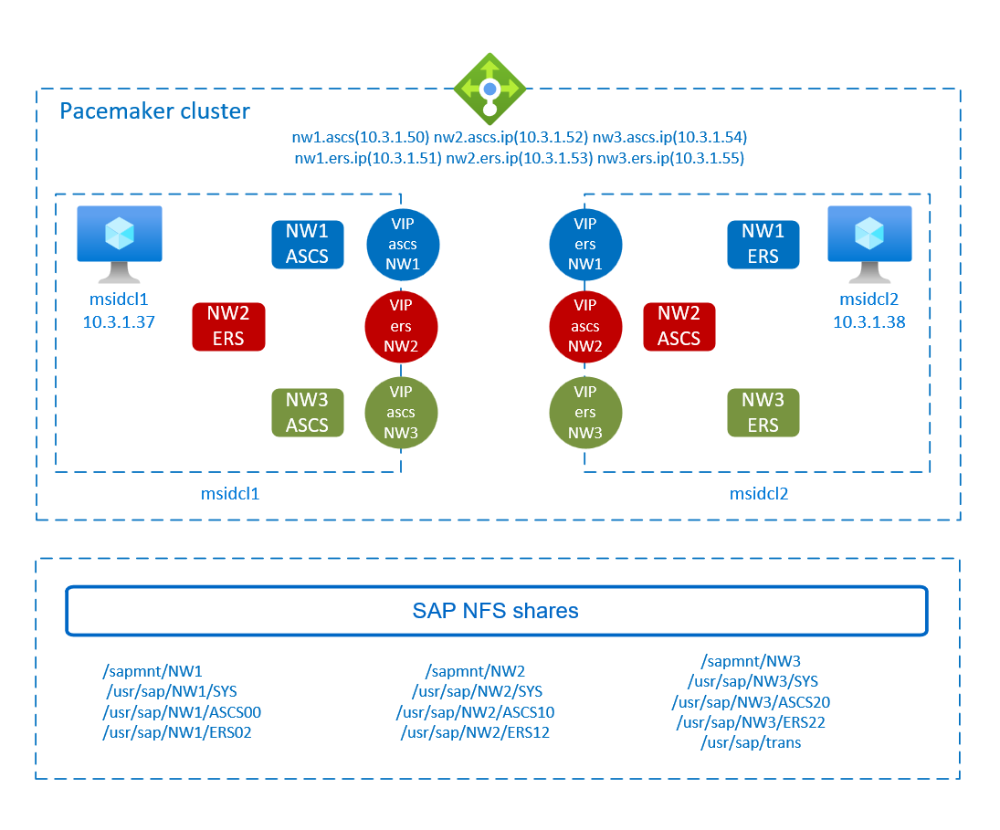

# High availability for SAP NetWeaver on Azure VMs on Red Hat Enterprise Linux for SAP applications multi-SID

[dbms-guide]:dbms-guide-general.md
[deployment-guide]:deployment-guide.md
[planning-guide]:planning-guide.md

[anf-azure-doc]:../../azure-netapp-files/azure-netapp-files-introduction.md
[anf-sap-applications-azure]:https://www.netapp.com/us/media/tr-4746.pdf

[2002167]:https://launchpad.support.sap.com/#/notes/2002167
[2009879]:https://launchpad.support.sap.com/#/notes/2009879
[1928533]:https://launchpad.support.sap.com/#/notes/1928533
[2015553]:https://launchpad.support.sap.com/#/notes/2015553
[2178632]:https://launchpad.support.sap.com/#/notes/2178632
[2191498]:https://launchpad.support.sap.com/#/notes/2191498
[2243692]:https://launchpad.support.sap.com/#/notes/2243692
[1999351]:https://launchpad.support.sap.com/#/notes/1999351

[sap-hana-ha]:sap-hana-high-availability-rhel.md

This article describes how to deploy multiple SAP NetWeaver highly available systems (multi-SID) in a two node cluster on Azure VMs with Red Hat Enterprise Linux for SAP applications.  

In the example configurations, three SAP NetWeaver 7.50 systems are deployed in a single, two node high availability cluster. The SAP systems SIDs are:

* `NW1`: ASCS instance number 00 and virtual host name `msnw1ascs`. ERS instance number 02 and virtual host name `msnw1ers`.  
* `NW2`: ASCS instance number 10 and virtual hostname `msnw2ascs`. ERS instance number 12 and virtual host name `msnw2ers`.  
* `NW3`: ASCS instance number 20 and virtual hostname `msnw3ascs`. ERS instance number 22 and virtual host name `msnw3ers`.  

The article doesn't cover the database layer and the deployment of the SAP NFS shares.

The examples in this article use the [Azure NetApp Files](../../azure-netapp-files/azure-netapp-files-create-volumes.md) volume `sapMSID` for the NFS shares, assuming that the volume is already deployed. The examples assume that the Azure NetApp Files volume is deployed with NFSv3 protocol. They use the following file paths for the cluster resources for the ASCS and ERS instances of SAP systems `NW1`, `NW2`, and `NW3`:  

* volume sapMSID (nfs://10.42.0.4/sapmnt*NW1*)
* volume sapMSID (nfs://10.42.0.4/usrsap*NW1*ascs)
* volume sapMSID (nfs://10.42.0.4/usrsap*NW1*sys)
* volume sapMSID (nfs://10.42.0.4/usrsap*NW1*ers)
* volume sapMSID (nfs://10.42.0.4/sapmnt*NW2*)
* volume sapMSID (nfs://10.42.0.4/usrsap*NW2*ascs)
* volume sapMSID (nfs://10.42.0.4/usrsap*NW2*sys)
* volume sapMSID (nfs://10.42.0.4/usrsap*NW2*ers)
* volume sapMSID (nfs://10.42.0.4/sapmnt*NW3*)
* volume sapMSID (nfs://10.42.0.4/usrsap*NW3*ascs)
* volume sapMSID (nfs://10.42.0.4/usrsap*NW3*sys)
* volume sapMSID (nfs://10.42.0.4/usrsap*NW3*ers)

Before you begin, refer to the following SAP Notes and papers:

* SAP Note [1928533], which has:
  * List of Azure VM sizes that are supported for the deployment of SAP software.
  * Important capacity information for Azure VM sizes.
  * Supported SAP software, and operating system (OS) and database combinations.
  * Required SAP kernel version for Windows and Linux on Microsoft Azure.
* [Azure NetApp Files documentation][anf-azure-doc].
* SAP Note [2015553] has prerequisites for SAP-supported SAP software deployments in Azure.
* SAP Note [2002167] has recommended OS settings for Red Hat Enterprise Linux.
* SAP Note [2009879] has SAP HANA Guidelines for Red Hat Enterprise Linux.
* SAP Note [2178632] has detailed information about all monitoring metrics reported for SAP in Azure.
* SAP Note [2191498] has the required SAP Host Agent version for Linux in Azure.
* SAP Note [2243692] has information about SAP licensing on Linux in Azure.
* SAP Note [1999351] has more troubleshooting information for the Azure Enhanced Monitoring Extension for SAP.
* [SAP Community WIKI](https://wiki.scn.sap.com/wiki/display/HOME/SAPonLinuxNotes) has all required SAP Notes for Linux.
* [Azure Virtual Machines planning and implementation for SAP on Linux][planning-guide].
* [Azure Virtual Machines deployment for SAP on Linux][deployment-guide].
* [Azure Virtual Machines DBMS deployment for SAP on Linux][dbms-guide].
* [SAP Netweaver in pacemaker cluster](https://access.redhat.com/articles/3150081).
* General RHEL documentation:
  * [High Availability Add-On Overview](https://access.redhat.com/documentation/en-us/red_hat_enterprise_linux/7/html/high_availability_add-on_overview/index)
  * [High Availability Add-On Administration](https://access.redhat.com/documentation/en-us/red_hat_enterprise_linux/7/html/high_availability_add-on_administration/index)
  * [High Availability Add-On Reference](https://access.redhat.com/documentation/en-us/red_hat_enterprise_linux/7/html/high_availability_add-on_reference/index)
  * [Configuring ASCS/ERS for SAP Netweaver with standalone resources in RHEL 7.5](https://access.redhat.com/articles/3569681)
  * [Configure SAP S/4HANA ASCS/ERS with Standalone Enqueue Server 2 (ENSA2) in Pacemaker on RHEL](https://access.redhat.com/articles/3974941)
* Azure-specific RHEL documentation:
  * [Support Policies for RHEL High Availability Clusters - Microsoft Azure Virtual Machines as Cluster Members](https://access.redhat.com/articles/3131341)
  * [Installing and Configuring a Red Hat Enterprise Linux 7.4 (and later) High-Availability Cluster on Microsoft Azure](https://access.redhat.com/articles/3252491)
* [NetApp SAP Applications on Microsoft Azure using Azure NetApp Files][anf-sap-applications-azure]

## Overview

The virtual machines that participate in the cluster must be sized to be able to run all resources in case failover occurs. Each SAP SID can fail over independently from each other in the multi-SID high availability cluster.  

To achieve high availability, SAP NetWeaver requires highly available shares. This article shows examples with the SAP shares deployed on [Azure NetApp Files NFS volumes](../../azure-netapp-files/azure-netapp-files-create-volumes.md). You could instead host the shares on highly available [GlusterFS cluster](./high-availability-guide-rhel-glusterfs.md), which can be used by multiple SAP systems.  



> [!IMPORTANT]
> The support for multi-SID clustering of SAP ASCS/ERS with Red Hat Linux as guest operating system in Azure VMs is limited to *five* SAP SIDs on the same cluster. Each new SID increases the complexity. A mix of SAP Enqueue Replication Server 1 and Enqueue Replication Server 2 on the same cluster is not supported. Multi-SID clustering describes the installation of multiple SAP ASCS/ERS instances with different SIDs in one Pacemaker cluster. Currently multi-SID clustering is only supported for ASCS/ERS.  

> [!TIP]
> The multi-SID clustering of SAP ASCS/ERS is a solution with higher complexity. It is more complex to implement. It also involves higher administrative effort, when executing maintenance activities, like OS patching. Before you start the actual implementation, take time to carefully plan out the deployment and all involved components like VMs, NFS mounts, VIPs, load balancer configurations and so on.  

SAP NetWeaver ASCS, SAP NetWeaver SCS, and SAP NetWeaver ERS use virtual hostname and virtual IP addresses. On Azure, a load balancer is required to use a virtual IP address. We recommend using [Standard load balancer](../../load-balancer/quickstart-load-balancer-standard-public-portal.md).  

* Frontend IP addresses for ASCS: 10.3.1.50 (NW1), 10.3.1.52 (NW2), and 10.3.1.54 (NW3)  
* Frontend IP addresses for ERS:  10.3.1.51 (NW1), 10.3.1.53 (NW2), and 10.3.1.55 (NW3)
* Probe port 62000 for NW1 ASCS, 62010 for NW2 ASCS, and 62020 for NW3 ASCS
* Probe port 62102 for NW1 ASCS, 62112 for NW2 ASCS, and 62122 for NW3 ASCS

> [!IMPORTANT]
> Floating IP is not supported on a NIC secondary IP configuration in load-balancing scenarios. For details see [Azure Load balancer Limitations](../../load-balancer/load-balancer-multivip-overview.md#limitations). If you need additional IP address for the VM, deploy a second NIC.  

> [!NOTE]
> When VMs without public IP addresses are placed in the backend pool of internal (no public IP address) Standard Azure load balancer, there is no outbound internet connectivity, unless additional configuration is performed to allow routing to public end points. For details on how to achieve outbound connectivity see [Public endpoint connectivity for Virtual Machines using Azure Standard Load Balancer in SAP high-availability scenarios](./high-availability-guide-standard-load-balancer-outbound-connections.md).  

> [!IMPORTANT]
> Do not enable TCP timestamps on Azure VMs placed behind Azure Load Balancer. Enabling TCP timestamps causes the health probes to fail. Set parameter `net.ipv4.tcp_timestamps` to 0. For more information, see [Load Balancer health probes](../../load-balancer/load-balancer-custom-probe-overview.md).

## SAP shares

SAP NetWeaver requires shared storage for the transport, profile directory, and so on. For highly available SAP system, it's important to have highly available shares. You need to decide on the architecture for your SAP shares. One option is to deploy the shares on [Azure NetApp Files NFS volumes](../../azure-netapp-files/azure-netapp-files-create-volumes.md).  With Azure NetApp Files, you get built-in high availability for the SAP NFS shares.

Another option is to build [GlusterFS on Azure VMs on Red Hat Enterprise Linux for SAP NetWeaver](./high-availability-guide-rhel-glusterfs.md), which can be shared between multiple SAP systems.

## Deploy the first SAP system in the cluster

After you decide on the architecture for the SAP shares, deploy the first SAP system in the cluster, following the corresponding documentation.

* If you use Azure NetApp Files NFS volumes, follow [Azure VMs high availability for SAP NetWeaver on Red Hat Enterprise Linux with Azure NetApp Files for SAP applications](./high-availability-guide-rhel-netapp-files.md).
* If you use GlusterFS cluster, follow [GlusterFS on Azure VMs on Red Hat Enterprise Linux for SAP NetWeaver](./high-availability-guide-rhel-glusterfs.md).  

These articles guide you through the steps to prepare the necessary infrastructure, build the cluster, prepare the OS for running the SAP application.  

> [!TIP]
> Always test the failover functionality of the cluster after the first system is deployed, before adding the additional SAP SIDs to the cluster. That way, you know that the cluster functionality works, before adding the complexity of additional SAP systems to the cluster.

## Deploy more SAP systems in the cluster

This example assumes that system `NW1` was already deployed in the cluster. This example shows how to deploy SAP systems `NW2` and `NW3` in the cluster.

The following items are prefixed with:

* **[A]** Applicable to all nodes
* **[1]** Only applicable to node 1
* **[2]** Only applicable to node 2

### Prerequisites

> [!IMPORTANT]
> Before following the instructions to deploy additional SAP systems in the cluster, deploy the first SAP system in the cluster. There are steps which are only necessary during the first system deployment.

This article assumes that:

* The Pacemaker cluster is already configured and running.  
* At least one SAP system (ASCS / ERS instance) is already deployed and is running in the cluster.  
* The cluster failover functionality has been tested.  
* The NFS shares for all SAP systems are deployed.  

### Prepare for SAP NetWeaver Installation

1. Add configuration for the newly deployed system (that is, `NW2` and `NW3`) to the existing Azure Load Balancer, following the instructions [Deploy Azure Load Balancer manually via Azure portal](./high-availability-guide-rhel-netapp-files.md#deploy-azure-load-balancer-via-azure-portal). Adjust the IP addresses, health probe ports, and load-balancing rules for your configuration.  

2. **[A]** Set up name resolution for the more SAP systems. You can either use DNS server or modify */etc/hosts* on all nodes. This example shows how to use the */etc/hosts* file.  Adapt the IP addresses and the host names to your environment.

    ```cmd
    sudo vi /etc/hosts
    # IP address of the load balancer frontend configuration for NW2 ASCS
    10.3.1.52 msnw2ascs
    # IP address of the load balancer frontend configuration for NW3 ASCS
    10.3.1.54 msnw3ascs
    # IP address of the load balancer frontend configuration for NW2 ERS
    10.3.1.53 msnw2ers
    # IP address of the load balancer frontend configuration for NW3 ERS
    10.3.1.55 msnw3ers
    ```

3. **[A]** Create the shared directories for the `NW2` and `NW3` SAP systems to deploy to the cluster.

    ```cmd
    sudo mkdir -p /sapmnt/NW2
    sudo mkdir -p /usr/sap/NW2/SYS
    sudo mkdir -p /usr/sap/NW2/ASCS10
    sudo mkdir -p /usr/sap/NW2/ERS12
    sudo mkdir -p /sapmnt/NW3
    sudo mkdir -p /usr/sap/NW3/SYS
    sudo mkdir -p /usr/sap/NW3/ASCS20
    sudo mkdir -p /usr/sap/NW3/ERS22

    
    sudo chattr +i /sapmnt/NW2
    sudo chattr +i /usr/sap/NW2/SYS
    sudo chattr +i /usr/sap/NW2/ASCS10
    sudo chattr +i /usr/sap/NW2/ERS12
    sudo chattr +i /sapmnt/NW3
    sudo chattr +i /usr/sap/NW3/SYS
    sudo chattr +i /usr/sap/NW3/ASCS20
    sudo chattr +i /usr/sap/NW3/ERS22
   ```

4. **[A]** Add the mount entries for the */sapmnt/SID* and */usr/sap/SID/SYS* file systems for the other SAP systems that you're deploying to the cluster. In this example, it's `NW2` and `NW3`.  

   Update file `/etc/fstab` with the file systems for the other SAP systems that you're deploying to the cluster.  

   * If using Azure NetApp Files, follow the instructions in [Azure VMs high availability for SAP NW on RHEL with Azure NetApp Files](./high-availability-guide-rhel-netapp-files.md#prepare-for-sap-netweaver-installation).
   * If using GlusterFS cluster, follow the instructions in [Azure VMs high availability for SAP NW on RHEL](./high-availability-guide-rhel.md#prepare-for-an-sap-netweaver-installation).

### Install ASCS / ERS

1. Create the virtual IP and health probe cluster resources for the ASCS instances of the other SAP systems you're deploying to the cluster. This example uses `NW2` and `NW3` ASCS, using NFS on Azure NetApp Files volumes with NFSv3 protocol.  

    ```cmd
    sudo pcs resource create fs_NW2_ASCS Filesystem device='10.42.0.4:/sapMSIDR/usrsapNW2ascs' \
    directory='/usr/sap/NW2/ASCS10' fstype='nfs' force_unmount=safe \
    op start interval=0 timeout=60 op stop interval=0 timeout=120 op monitor interval=200 timeout=40 \
     --group g-NW2_ASCS

    sudo pcs resource create vip_NW2_ASCS IPaddr2 \
    ip=10.3.1.52 \
     --group g-NW2_ASCS
  
    sudo pcs resource create nc_NW2_ASCS azure-lb port=62010 \
     --group g-NW2_ASCS

    sudo pcs resource create fs_NW3_ASCS Filesystem device='10.42.0.4:/sapMSIDR/usrsapNW3ascs' \
    directory='/usr/sap/NW3/ASCS20' fstype='nfs' force_unmount=safe \
    op start interval=0 timeout=60 op stop interval=0 timeout=120 op monitor interval=200 timeout=40 \
    --group g-NW3_ASCS

    sudo pcs resource create vip_NW3_ASCS IPaddr2 \
    ip=10.3.1.54 \
    --group g-NW3_ASCS

    sudo pcs resource create nc_NW3_ASCS azure-lb port=62020 \
    --group g-NW3_ASCS
    ```

   Make sure the cluster status is ok and that all resources are started. It's not important on which node the resources are running.  

2. **[1]** Install SAP NetWeaver ASCS.  

   Install SAP NetWeaver ASCS as root, using a virtual hostname that maps to the IP address of the load balancer frontend configuration for the ASCS. For example, for system `NW2`, the virtual hostname is `msnw2ascs`, `10.3.1.52`, and the instance number that you used for the probe of the load balancer, for example `10`. For system `NW3`, the virtual hostname is `msnw3ascs`, `10.3.1.54`, and the instance number that you used for the probe of the load balancer, for example `20`. Note down on which cluster node you installed ASCS for each SAP SID.  

   You can use the `sapinst` parameter `SAPINST_REMOTE_ACCESS_USER` to allow a non-root user to connect to sapinst. You can use parameter `SAPINST_USE_HOSTNAME` to install SAP, using virtual host name.  

    ```cmd
    # Allow access to SWPM. This rule is not permanent. If you reboot the machine, you have to run the command again
    sudo firewall-cmd --zone=public --add-port=4237/tcp
    sudo swpm/sapinst SAPINST_REMOTE_ACCESS_USER=sapadmin SAPINST_USE_HOSTNAME=virtual_hostname
    ```

   If the installation fails to create a subfolder in */usr/sap/\<SID>/ASCS\<Instance#>*, try setting the owner to \<sid>adm and group to sapsys of the ASCS<Instance#> and retry.

3. **[1]** Create a virtual IP and health-probe cluster resources for the ERS instance of the other SAP system you're deploying to the cluster. This example is for `NW2` and `NW3` ERS, using NFS on Azure NetApp Files volumes with NFSv3 protocol.  

    ```cmd
    sudo pcs resource create fs_NW2_AERS Filesystem device='10.42.0.4:/sapMSIDR/usrsapNW2ers' \
    directory='/usr/sap/NW2/ERS12' fstype='nfs' force_unmount=safe \
    op start interval=0 timeout=60 op stop interval=0 timeout=120 op monitor interval=200 timeout=40 \
     --group g-NW2_AERS

    sudo pcs resource create vip_NW2_AERS IPaddr2 \
    ip=10.3.1.53 \
     --group g-NW2_AERS

    sudo pcs resource create nc_NW2_AERS azure-lb port=62112 \
     --group g-NW2_AERS

    sudo pcs resource create fs_NW3_AERS Filesystem device='10.42.0.4:/sapMSIDR/usrsapNW3ers' \
    directory='/usr/sap/NW3/ERS22' fstype='nfs' force_unmount=safe \
    op start interval=0 timeout=60 op stop interval=0 timeout=120 op monitor interval=200 timeout=40 \
     --group g-NW3_AERS

    sudo pcs resource create vip_NW3_AERS IPaddr2 \
    ip=10.3.1.55 \
     --group g-NW3_AERS

    sudo pcs resource create nc_NW3_AERS azure-lb port=62122 \
     --group g-NW3_AERS
   ```

   Make sure the cluster status is ok and that all resources are started.  

   Next, make sure that the resources of the newly created ERS group are running on the cluster node, opposite to the cluster node where the ASCS instance for the same SAP system was installed. For example, if NW2 ASCS was installed on `rhelmsscl1`, then make sure the NW2 ERS group is running on `rhelmsscl2`. You can migrate the  NW2 ERS group to `rhelmsscl2` by running the following command for one of the cluster resources in the group:

    ```cmd
    pcs resource move fs_NW2_AERS rhelmsscl2
    ```

4. **[2]** Install SAP NetWeaver ERS.

   Install SAP NetWeaver ERS as root on the other node, using a virtual hostname that maps to the IP address of the load balancer frontend configuration for the ERS. For example, for system `NW2`, the virtual host name is `msnw2ers`, `10.3.1.53`, and the instance number that you used for the probe of the load balancer, for example `12`. For system `NW3`, the virtual host name `msnw3ers`, `10.3.1.55`, and the instance number that you used for the probe of the load balancer, for example `22`.

   You can use the `sapinst` parameter `SAPINST_REMOTE_ACCESS_USER` to allow a non-root user to connect to sapinst. You can use parameter `SAPINST_USE_HOSTNAME` to install SAP, using virtual host name.  

    ```cmd
    # Allow access to SWPM. This rule is not permanent. If you reboot the machine, you have to run the command again
    sudo firewall-cmd --zone=public --add-port=4237/tcp
    sudo swpm/sapinst SAPINST_REMOTE_ACCESS_USER=sapadmin SAPINST_USE_HOSTNAME=virtual_hostname
    ```

   > [!NOTE]
   > Use SWPM SP 20 PL 05 or higher. Lower versions do not set the permissions correctly and the installation fails.

   If the installation fails to create a subfolder in */usr/sap/\<NW2>/ERS\<Instance#>*, try setting the owner to \<sid>adm and the group to sapsys of the ERS<Instance#> folder and retry.

   If it was necessary for you to migrate the ERS group of the newly deployed SAP system to a different cluster node, don't forget to remove the location constraint for the ERS group. You can remove the constraint by running the following command. This example is given for SAP systems `NW2` and `NW3`. Make sure to remove the temporary constraints for the same resource you used in the command to move the ERS cluster group.

    ```cmd
    pcs resource clear fs_NW2_AERS
    pcs resource clear fs_NW3_AERS
    ```

5. **[1]** Adapt the ASCS/SCS and ERS instance profiles for the newly installed SAP systems. The example shown below is for `NW2`. You need to adapt the ASCS/SCS and ERS profiles for all SAP instances added to the cluster.  

   * ASCS/SCS profile

     ```cmd
     sudo vi /sapmnt/NW2/profile/NW2_ASCS10_msnw2ascs
   
     # Change the restart command to a start command
     #Restart_Program_01 = local $(_EN) pf=$(_PF)
     Start_Program_01 = local $(_EN) pf=$(_PF)

     # Add the keep alive parameter, if using ENSA1
     enque/encni/set_so_keepalive = true
     ```

     For both ENSA1 and ENSA2, make sure that the `keepalive` OS parameters are set as described in SAP note [1410736](https://launchpad.support.sap.com/#/notes/1410736).

   * ERS profile

     ```cmd
     sudo vi /sapmnt/NW2/profile/NW2_ERS12_msnw2ers
   
     # Change the restart command to a start command
     #Restart_Program_00 = local $(_ER) pf=$(_PFL) NR=$(SCSID)
     Start_Program_00 = local $(_ER) pf=$(_PFL) NR=$(SCSID)
   
     # remove Autostart from ERS profile
     # Autostart = 1
     ```

6. **[A]** Update the */usr/sap/sapservices* file.

   To prevent the start of the instances by the *sapinit* startup script, all instances managed by Pacemaker must be commented out from */usr/sap/sapservices* file. The example shown below is for SAP systems `NW2` and `NW3`.  

   ```cmd
   # On the node where ASCS was installed, comment out the line for the ASCS instacnes
   #LD_LIBRARY_PATH=/usr/sap/NW2/ASCS10/exe:$LD_LIBRARY_PATH; export LD_LIBRARY_PATH; /usr/sap/NW2/ASCS10/exe/sapstartsrv pf=/usr/sap/NW2/SYS/profile/NW2_ASCS10_msnw2ascs -D -u nw2adm
   #LD_LIBRARY_PATH=/usr/sap/NW3/ASCS20/exe:$LD_LIBRARY_PATH; export LD_LIBRARY_PATH; /usr/sap/NW3/ASCS20/exe/sapstartsrv pf=/usr/sap/NW3/SYS/profile/NW3_ASCS20_msnw3ascs -D -u nw3adm

   # On the node where ERS was installed, comment out the line for the ERS instacnes
   #LD_LIBRARY_PATH=/usr/sap/NW2/ERS12/exe:$LD_LIBRARY_PATH; export LD_LIBRARY_PATH; /usr/sap/NW2/ERS12/exe/sapstartsrv pf=/usr/sap/NW2/ERS12/profile/NW2_ERS12_msnw2ers -D -u nw2adm
   #LD_LIBRARY_PATH=/usr/sap/NW3/ERS22/exe:$LD_LIBRARY_PATH; export LD_LIBRARY_PATH; /usr/sap/NW3/ERS22/exe/sapstartsrv pf=/usr/sap/NW3/ERS22/profile/NW3_ERS22_msnw3ers -D -u nw3adm
   ```

7. **[1]** Create the SAP cluster resources for the newly installed SAP system.  

   If using enqueue server 1 architecture (ENSA1), define the resources for SAP systems `NW2` and `NW3` as follows:

   ```cmd
   sudo pcs property set maintenance-mode=true

   sudo pcs resource create rsc_sap_NW2_ASCS10 SAPInstance \
   InstanceName=NW2_ASCS10_msnw2ascs START_PROFILE="/sapmnt/NW2/profile/NW2_ASCS10_msnw2ascs" \
   AUTOMATIC_RECOVER=false \
   meta resource-stickiness=5000 migration-threshold=1 failure-timeout=60 \
   op monitor interval=20 on-fail=restart timeout=60 \
   op start interval=0 timeout=600 op stop interval=0 timeout=600 \
   --group g-NW2_ASCS

   sudo pcs resource meta g-NW2_ASCS resource-stickiness=3000

   sudo pcs resource create rsc_sap_NW2_ERS12 SAPInstance \
   InstanceName=NW2_ERS12_msnw2ers START_PROFILE="/sapmnt/NW2/profile/NW2_ERS12_msnw2ers" \
   AUTOMATIC_RECOVER=false IS_ERS=true \
   op monitor interval=20 on-fail=restart timeout=60 op start interval=0 timeout=600 op stop interval=0 timeout=600 \
   --group g-NW2_AERS

   sudo pcs constraint colocation add g-NW2_AERS with g-NW2_ASCS -5000
   sudo pcs constraint location rsc_sap_NW2_ASCS10 rule score=2000 runs_ers_NW2 eq 1
   sudo pcs constraint order start g-NW2_ASCS then stop g-NW2_AERS kind=Optional symmetrical=false

   sudo pcs resource create rsc_sap_NW3_ASCS20 SAPInstance \
   InstanceName=NW3_ASCS20_msnw3ascs START_PROFILE="/sapmnt/NW3/profile/NW3_ASCS20_msnw3ascs" \
   AUTOMATIC_RECOVER=false \
   meta resource-stickiness=5000 migration-threshold=1 failure-timeout=60 \
   op monitor interval=20 on-fail=restart timeout=60 \
   op start interval=0 timeout=600 op stop interval=0 timeout=600 \
   --group g-NW3_ASCS

   sudo pcs resource meta g-NW3_ASCS resource-stickiness=3000

   sudo pcs resource create rsc_sap_NW3_ERS22 SAPInstance \
   InstanceName=NW3_ERS22_msnw3ers START_PROFILE="/sapmnt/NW3/profile/NW2_ERS22_msnw3ers" \
   AUTOMATIC_RECOVER=false IS_ERS=true \
   op monitor interval=20 on-fail=restart timeout=60 op start interval=0 timeout=600 op stop interval=0 timeout=600 \
   --group g-NW3_AERS

   sudo pcs constraint colocation add g-NW3_AERS with g-NW3_ASCS -5000
   sudo pcs constraint location rsc_sap_NW3_ASCS20 rule score=2000 runs_ers_NW3 eq 1
   sudo pcs constraint order start g-NW3_ASCS then stop g-NW3_AERS kind=Optional symmetrical=false

   sudo pcs property set maintenance-mode=false
   ```

   SAP introduced support for enqueue server 2, including replication, as of SAP NW 7.52. Beginning with ABAP Platform 1809, enqueue server 2 is installed by default. See SAP note [2630416](https://launchpad.support.sap.com/#/notes/2630416) for enqueue server 2 support.
   If using enqueue server 2 architecture ([ENSA2](https://help.sap.com/viewer/cff8531bc1d9416d91bb6781e628d4e0/1709%20001/en-US/6d655c383abf4c129b0e5c8683e7ecd8.html)), define the resources for SAP systems `NW2` and `NW3` as follows:

   ```cmd
   sudo pcs property set maintenance-mode=true

   sudo pcs resource create rsc_sap_NW2_ASCS10 SAPInstance \
   InstanceName=NW2_ASCS10_msnw2ascs START_PROFILE="/sapmnt/NW2/profile/NW2_ASCS10_msnw2ascs" \
   AUTOMATIC_RECOVER=false \
   meta resource-stickiness=5000 \
   op monitor interval=20 on-fail=restart timeout=60 \
   op start interval=0 timeout=600 op stop interval=0 timeout=600 \
   --group g-NW2_ASCS

   sudo pcs resource meta g-NW2_ASCS resource-stickiness=3000

   sudo pcs resource create rsc_sap_NW2_ERS12 SAPInstance \
   InstanceName=NW2_ERS12_msnw2ers START_PROFILE="/sapmnt/NW2/profile/NW2_ERS12_msnw2ers" \
   AUTOMATIC_RECOVER=false IS_ERS=true \
   op monitor interval=20 on-fail=restart timeout=60 op start interval=0 timeout=600 op stop interval=0 timeout=600 \
   --group g-NW2_AERS

   sudo pcs resource meta rsc_sap_NW2_ERS12  resource-stickiness=3000

   sudo pcs constraint colocation add g-NW2_AERS with g-NW2_ASCS -5000
   sudo pcs constraint order start g-NW2_ASCS then start g-NW2_AERS kind=Optional symmetrical=false
   sudo pcs constraint order start g-NW2_ASCS then stop g-NW2_AERS kind=Optional symmetrical=false

   sudo pcs resource create rsc_sap_NW3_ASCS20 SAPInstance \
   InstanceName=NW3_ASCS20_msnw3ascs START_PROFILE="/sapmnt/NW3/profile/NW3_ASCS20_msnw3ascs" \
   AUTOMATIC_RECOVER=false \
   meta resource-stickiness=5000 \
   op monitor interval=20 on-fail=restart timeout=60 \
   op start interval=0 timeout=600 op stop interval=0 timeout=600 \
   --group g-NW3_ASCS

   sudo pcs resource meta g-NW3_ASCS resource-stickiness=3000

   sudo pcs resource create rsc_sap_NW3_ERS22 SAPInstance \
   InstanceName=NW3_ERS22_msnw3ers START_PROFILE="/sapmnt/NW3/profile/NW2_ERS22_msnw3ers" \
   AUTOMATIC_RECOVER=false IS_ERS=true \
   op monitor interval=20 on-fail=restart timeout=60 op start interval=0 timeout=600 op stop interval=0 timeout=600 \
   --group g-NW3_AERS

   sudo pcs resource meta rsc_sap_NW3_ERS22  resource-stickiness=3000

   sudo pcs constraint colocation add g-NW3_AERS with g-NW3_ASCS -5000
   sudo pcs constraint order start g-NW3_ASCS then start g-NW3_AERS kind=Optional symmetrical=false
   sudo pcs constraint order start g-NW3_ASCS then stop g-NW3_AERS kind=Optional symmetrical=false

   sudo pcs property set maintenance-mode=false
   ```

   If you're upgrading from an older version and switching to enqueue server 2, see SAP note [2641019](https://launchpad.support.sap.com/#/notes/2641019).

   > [!NOTE]
   > The timeouts in the above configuration are just examples and might need to be adapted to the specific SAP setup.

   Make sure that the cluster status is ok and that all resources are started. It's not important on which node the resources are running.
   The following example shows the cluster resources status, after SAP systems `NW2` and `NW3` were added to the cluster.

    ```cmd
    sudo pcs status

    Online: [ rhelmsscl1 rhelmsscl2 ]

    Full list of resources:

    rsc_st_azure   (stonith:fence_azure_arm):      Started rhelmsscl1
    Resource Group: g-NW1_ASCS
        fs_NW1_ASCS        (ocf::heartbeat:Filesystem):    Started rhelmsscl1
        vip_NW1_ASCS       (ocf::heartbeat:IPaddr2):       Started rhelmsscl1
        nc_NW1_ASCS        (ocf::heartbeat:azure-lb):      Started rhelmsscl1
        rsc_sap_NW1_ASCS00 (ocf::heartbeat:SAPInstance):   Started rhelmsscl1
    Resource Group: g-NW1_AERS
        fs_NW1_AERS        (ocf::heartbeat:Filesystem):    Started rhelmsscl2
        vip_NW1_AERS       (ocf::heartbeat:IPaddr2):       Started rhelmsscl2
        nc_NW1_AERS        (ocf::heartbeat:azure-lb):      Started rhelmsscl2
        rsc_sap_NW1_ERS02  (ocf::heartbeat:SAPInstance):   Started rhelmsscl2
    Resource Group: g-NW2_ASCS
        fs_NW2_ASCS        (ocf::heartbeat:Filesystem):    Started rhelmsscl1
        vip_NW2_ASCS       (ocf::heartbeat:IPaddr2):       Started rhelmsscl1
        nc_NW2_ASCS        (ocf::heartbeat:azure-lb):      Started rhelmsscl1
        rsc_sap_NW2_ASCS10 (ocf::heartbeat:SAPInstance):   Started rhelmsscl1
    Resource Group: g-NW2_AERS
        fs_NW2_AERS        (ocf::heartbeat:Filesystem):    Started rhelmsscl1
        vip_NW2_AERS       (ocf::heartbeat:IPaddr2):       Started rhelmsscl1
        nc_NW2_AERS        (ocf::heartbeat:azure-lb):      Started rhelmsscl1
        rsc_sap_NW2_ERS12  (ocf::heartbeat:SAPInstance):   Started rhelmsscl1
    Resource Group: g-NW3_ASCS
        fs_NW3_ASCS        (ocf::heartbeat:Filesystem):    Started rhelmsscl1
        vip_NW3_ASCS       (ocf::heartbeat:IPaddr2):       Started rhelmsscl1
        nc_NW3_ASCS        (ocf::heartbeat:azure-lb):      Started rhelmsscl1
        rsc_sap_NW3_ASCS20 (ocf::heartbeat:SAPInstance):   Started rhelmsscl1
    Resource Group: g-NW3_AERS
        fs_NW3_AERS        (ocf::heartbeat:Filesystem):    Started rhelmsscl1
        vip_NW3_AERS       (ocf::heartbeat:IPaddr2):       Started rhelmsscl1
        nc_NW3_AERS        (ocf::heartbeat:azure-lb):      Started rhelmsscl1
        rsc_sap_NW3_ERS22  (ocf::heartbeat:SAPInstance):   Started rhelmsscl1
    ```

8. **[A]** Add firewall rules for ASCS and ERS on both nodes. The example below shows the firewall rules for both SAP systems `NW2` and `NW3`.  

   ```cmd
   # NW2 - ASCS
   sudo firewall-cmd --zone=public --add-port=62010/tcp --permanent
   sudo firewall-cmd --zone=public --add-port=62010/tcp
   sudo firewall-cmd --zone=public --add-port=3210/tcp --permanent
   sudo firewall-cmd --zone=public --add-port=3210/tcp
   sudo firewall-cmd --zone=public --add-port=3610/tcp --permanent
   sudo firewall-cmd --zone=public --add-port=3610/tcp
   sudo firewall-cmd --zone=public --add-port=3910/tcp --permanent
   sudo firewall-cmd --zone=public --add-port=3910/tcp
   sudo firewall-cmd --zone=public --add-port=8110/tcp --permanent
   sudo firewall-cmd --zone=public --add-port=8110/tcp
   sudo firewall-cmd --zone=public --add-port=51013/tcp --permanent
   sudo firewall-cmd --zone=public --add-port=51013/tcp
   sudo firewall-cmd --zone=public --add-port=51014/tcp --permanent
   sudo firewall-cmd --zone=public --add-port=51014/tcp
   sudo firewall-cmd --zone=public --add-port=51016/tcp --permanent
   sudo firewall-cmd --zone=public --add-port=51016/tcp
   # NW2 - ERS
   sudo firewall-cmd --zone=public --add-port=62112/tcp --permanent
   sudo firewall-cmd --zone=public --add-port=62112/tcp
   sudo firewall-cmd --zone=public --add-port=3212/tcp --permanent
   sudo firewall-cmd --zone=public --add-port=3212/tcp
   sudo firewall-cmd --zone=public --add-port=3312/tcp --permanent
   sudo firewall-cmd --zone=public --add-port=3312/tcp
   sudo firewall-cmd --zone=public --add-port=51213/tcp --permanent
   sudo firewall-cmd --zone=public --add-port=51213/tcp
   sudo firewall-cmd --zone=public --add-port=51214/tcp --permanent
   sudo firewall-cmd --zone=public --add-port=51214/tcp
   sudo firewall-cmd --zone=public --add-port=51216/tcp --permanent
   sudo firewall-cmd --zone=public --add-port=51216/tcp
   # NW3 - ASCS
   sudo firewall-cmd --zone=public --add-port=62020/tcp --permanent
   sudo firewall-cmd --zone=public --add-port=62020/tcp
   sudo firewall-cmd --zone=public --add-port=3220/tcp --permanent
   sudo firewall-cmd --zone=public --add-port=3220/tcp
   sudo firewall-cmd --zone=public --add-port=3620/tcp --permanent
   sudo firewall-cmd --zone=public --add-port=3620/tcp
   sudo firewall-cmd --zone=public --add-port=3920/tcp --permanent
   sudo firewall-cmd --zone=public --add-port=3920/tcp
   sudo firewall-cmd --zone=public --add-port=8120/tcp --permanent
   sudo firewall-cmd --zone=public --add-port=8120/tcp
   sudo firewall-cmd --zone=public --add-port=52013/tcp --permanent
   sudo firewall-cmd --zone=public --add-port=52013/tcp
   sudo firewall-cmd --zone=public --add-port=52014/tcp --permanent
   sudo firewall-cmd --zone=public --add-port=52014/tcp
   sudo firewall-cmd --zone=public --add-port=52016/tcp --permanent
   sudo firewall-cmd --zone=public --add-port=52016/tcp
   # NW3 - ERS
   sudo firewall-cmd --zone=public --add-port=62122/tcp --permanent
   sudo firewall-cmd --zone=public --add-port=62122/tcp
   sudo firewall-cmd --zone=public --add-port=3222/tcp --permanent
   sudo firewall-cmd --zone=public --add-port=3222/tcp
   sudo firewall-cmd --zone=public --add-port=3322/tcp --permanent
   sudo firewall-cmd --zone=public --add-port=3322/tcp
   sudo firewall-cmd --zone=public --add-port=52213/tcp --permanent
   sudo firewall-cmd --zone=public --add-port=52213/tcp
   sudo firewall-cmd --zone=public --add-port=52214/tcp --permanent
   sudo firewall-cmd --zone=public --add-port=52214/tcp
   sudo firewall-cmd --zone=public --add-port=52216/tcp --permanent
   sudo firewall-cmd --zone=public --add-port=52216/tcp
   ```

### Proceed with the SAP installation

Complete your SAP installation by:

* [Preparing your SAP NetWeaver application servers](./high-availability-guide-rhel-netapp-files.md#sap-netweaver-application-server-preparation).
* [Installing a DBMS instance](./high-availability-guide-rhel-netapp-files.md#install-database).
* [Installing A primary SAP application server](./high-availability-guide-rhel-netapp-files.md#sap-netweaver-application-server-installation).
* Installing one or more other SAP application instances.

## Test the multi-SID cluster setup

The following tests are a subset of the test cases in the best practices guides of Red Hat. They're included for your convenience. For the full list of cluster tests, reference the following documentation:

* If you use Azure NetApp Files NFS volumes, follow [Azure VMs high availability for SAP NetWeaver on RHEL with Azure NetApp Files for SAP applications](./high-availability-guide-rhel-netapp-files.md)
* If you use highly available `GlusterFS`, follow [Azure VMs high availability for SAP NetWeaver on RHEL for SAP applications](./high-availability-guide-rhel.md).  

Always read the Red Hat best practices guides and perform all other tests that might have been added. The tests that are presented are in a two-node, multi-SID cluster with three SAP systems installed.  

1. Manually migrate the ASCS instance. The example shows migrating the ASCS instance for SAP system NW3.

   Resource state before starting the test:

   ```cmd
   Online: [ rhelmsscl1 rhelmsscl2 ]

   Full list of resources:

   rsc_st_azure   (stonith:fence_azure_arm):      Started rhelmsscl1
   Resource Group: g-NW1_ASCS
       fs_NW1_ASCS        (ocf::heartbeat:Filesystem):    Started rhelmsscl1
       vip_NW1_ASCS       (ocf::heartbeat:IPaddr2):       Started rhelmsscl1
       nc_NW1_ASCS        (ocf::heartbeat:azure-lb):      Started rhelmsscl1
       rsc_sap_NW1_ASCS00 (ocf::heartbeat:SAPInstance):   Started rhelmsscl1
   Resource Group: g-NW1_AERS
       fs_NW1_AERS        (ocf::heartbeat:Filesystem):    Started rhelmsscl2
       vip_NW1_AERS       (ocf::heartbeat:IPaddr2):       Started rhelmsscl2
       nc_NW1_AERS        (ocf::heartbeat:azure-lb):      Started rhelmsscl2
       rsc_sap_NW1_ERS02  (ocf::heartbeat:SAPInstance):   Started rhelmsscl2
   Resource Group: g-NW2_ASCS
       fs_NW2_ASCS        (ocf::heartbeat:Filesystem):    Started rhelmsscl2
       vip_NW2_ASCS       (ocf::heartbeat:IPaddr2):       Started rhelmsscl2
       nc_NW2_ASCS        (ocf::heartbeat:azure-lb):      Started rhelmsscl2
       rsc_sap_NW2_ASCS10 (ocf::heartbeat:SAPInstance):   Started rhelmsscl2
   Resource Group: g-NW2_AERS
       fs_NW2_AERS        (ocf::heartbeat:Filesystem):    Started rhelmsscl1
       vip_NW2_AERS       (ocf::heartbeat:IPaddr2):       Started rhelmsscl1
       nc_NW2_AERS        (ocf::heartbeat:azure-lb):      Started rhelmsscl1
       rsc_sap_NW2_ERS12  (ocf::heartbeat:SAPInstance):   Started rhelmsscl1
   Resource Group: g-NW3_ASCS
       fs_NW3_ASCS        (ocf::heartbeat:Filesystem):    Started rhelmsscl2
       vip_NW3_ASCS       (ocf::heartbeat:IPaddr2):       Started rhelmsscl2
       nc_NW3_ASCS        (ocf::heartbeat:azure-lb):      Started rhelmsscl2
       rsc_sap_NW3_ASCS20 (ocf::heartbeat:SAPInstance):   Started rhelmsscl2
   Resource Group: g-NW3_AERS
       fs_NW3_AERS        (ocf::heartbeat:Filesystem):    Started rhelmsscl1
       vip_NW3_AERS       (ocf::heartbeat:IPaddr2):       Started rhelmsscl1
       nc_NW3_AERS        (ocf::heartbeat:azure-lb):      Started rhelmsscl1
       rsc_sap_NW3_ERS22  (ocf::heartbeat:SAPInstance):   Started rhelmsscl1
   ```

   Run the following commands as root to migrate the NW3 ASCS instance.

   ```cmd
   pcs resource move rsc_sap_NW3_ASCS200
   # Clear temporary migration constraints
   pcs resource clear rsc_sap_NW3_ASCS20

   # Remove failed actions for the ERS that occurred as part of the migration
   pcs resource cleanup rsc_sap_NW3_ERS22
   ```

   Resource state after the test:

   ```cmd
   Online: [ rhelmsscl1 rhelmsscl2 ]

   Full list of resources:

   rsc_st_azure   (stonith:fence_azure_arm):      Started rhelmsscl1
   Resource Group: g-NW1_ASCS
       fs_NW1_ASCS        (ocf::heartbeat:Filesystem):    Started rhelmsscl1
       vip_NW1_ASCS       (ocf::heartbeat:IPaddr2):       Started rhelmsscl1
       nc_NW1_ASCS        (ocf::heartbeat:azure-lb):      Started rhelmsscl1
       rsc_sap_NW1_ASCS00 (ocf::heartbeat:SAPInstance):   Started rhelmsscl1
   Resource Group: g-NW1_AERS
       fs_NW1_AERS        (ocf::heartbeat:Filesystem):    Started rhelmsscl2
       vip_NW1_AERS       (ocf::heartbeat:IPaddr2):       Started rhelmsscl2
       nc_NW1_AERS        (ocf::heartbeat:azure-lb):      Started rhelmsscl2
       rsc_sap_NW1_ERS02  (ocf::heartbeat:SAPInstance):   Started rhelmsscl2
   Resource Group: g-NW2_ASCS
       fs_NW2_ASCS        (ocf::heartbeat:Filesystem):    Started rhelmsscl2
       vip_NW2_ASCS       (ocf::heartbeat:IPaddr2):       Started rhelmsscl2
       nc_NW2_ASCS        (ocf::heartbeat:azure-lb):      Started rhelmsscl2
       rsc_sap_NW2_ASCS10 (ocf::heartbeat:SAPInstance):   Started rhelmsscl2
   Resource Group: g-NW2_AERS
       fs_NW2_AERS        (ocf::heartbeat:Filesystem):    Started rhelmsscl1
       vip_NW2_AERS       (ocf::heartbeat:IPaddr2):       Started rhelmsscl1
       nc_NW2_AERS        (ocf::heartbeat:azure-lb):      Started rhelmsscl1
       rsc_sap_NW2_ERS12  (ocf::heartbeat:SAPInstance):   Started rhelmsscl1
   Resource Group: g-NW3_ASCS
       fs_NW3_ASCS        (ocf::heartbeat:Filesystem):    Started rhelmsscl1
       vip_NW3_ASCS       (ocf::heartbeat:IPaddr2):       Started rhelmsscl1
       nc_NW3_ASCS        (ocf::heartbeat:azure-lb):      Started rhelmsscl1
       rsc_sap_NW3_ASCS20 (ocf::heartbeat:SAPInstance):   Started rhelmsscl1
   Resource Group: g-NW3_AERS
       fs_NW3_AERS        (ocf::heartbeat:Filesystem):    Started rhelmsscl2
       vip_NW3_AERS       (ocf::heartbeat:IPaddr2):       Started rhelmsscl2
       nc_NW3_AERS        (ocf::heartbeat:azure-lb):      Started rhelmsscl2
       rsc_sap_NW3_ERS22  (ocf::heartbeat:SAPInstance):   Started rhelmsscl2
   ```

1. Simulate node crash.

   Resource state before starting the test:

   ```cmd
   Online: [ rhelmsscl1 rhelmsscl2 ]

   Full list of resources:

   rsc_st_azure   (stonith:fence_azure_arm):      Started rhelmsscl1
   Resource Group: g-NW1_ASCS
       fs_NW1_ASCS        (ocf::heartbeat:Filesystem):    Started rhelmsscl1
       vip_NW1_ASCS       (ocf::heartbeat:IPaddr2):       Started rhelmsscl1
       nc_NW1_ASCS        (ocf::heartbeat:azure-lb):      Started rhelmsscl1
       rsc_sap_NW1_ASCS00 (ocf::heartbeat:SAPInstance):   Started rhelmsscl1
   Resource Group: g-NW1_AERS
       fs_NW1_AERS        (ocf::heartbeat:Filesystem):    Started rhelmsscl2
       vip_NW1_AERS       (ocf::heartbeat:IPaddr2):       Started rhelmsscl2
       nc_NW1_AERS        (ocf::heartbeat:azure-lb):      Started rhelmsscl2
       rsc_sap_NW1_ERS02  (ocf::heartbeat:SAPInstance):   Started rhelmsscl2
   Resource Group: g-NW2_ASCS
       fs_NW2_ASCS        (ocf::heartbeat:Filesystem):    Started rhelmsscl1
       vip_NW2_ASCS       (ocf::heartbeat:IPaddr2):       Started rhelmsscl1
       nc_NW2_ASCS        (ocf::heartbeat:azure-lb):      Started rhelmsscl1
       rsc_sap_NW2_ASCS10 (ocf::heartbeat:SAPInstance):   Started rhelmsscl1
   Resource Group: g-NW2_AERS
       fs_NW2_AERS        (ocf::heartbeat:Filesystem):    Started rhelmsscl2
       vip_NW2_AERS       (ocf::heartbeat:IPaddr2):       Started rhelmsscl2
       nc_NW2_AERS        (ocf::heartbeat:azure-lb):      Started rhelmsscl2
       rsc_sap_NW2_ERS12  (ocf::heartbeat:SAPInstance):   Started rhelmsscl2
   Resource Group: g-NW3_ASCS
       fs_NW3_ASCS        (ocf::heartbeat:Filesystem):    Started rhelmsscl1
       vip_NW3_ASCS       (ocf::heartbeat:IPaddr2):       Started rhelmsscl1
       nc_NW3_ASCS        (ocf::heartbeat:azure-lb):      Started rhelmsscl1
       rsc_sap_NW3_ASCS20 (ocf::heartbeat:SAPInstance):   Started rhelmsscl1
   Resource Group: g-NW3_AERS
       fs_NW3_AERS        (ocf::heartbeat:Filesystem):    Started rhelmsscl2
       vip_NW3_AERS       (ocf::heartbeat:IPaddr2):       Started rhelmsscl2
       nc_NW3_AERS        (ocf::heartbeat:azure-lb):      Started rhelmsscl2
       rsc_sap_NW3_ERS22  (ocf::heartbeat:SAPInstance):   Started rhelmsscl2
   ```

   Run the following command as root on a node where at least one ASCS instance is running. This example runs the command on `rhelmsscl1`, where the ASCS instances for `NW1`, `NW2`, and `NW3` are running.  

   ```cmd
   echo c > /proc/sysrq-trigger
   ```

   The status after the test and after the node that was crashed has started again, should look like these results:

   ```cmd
   Full list of resources:

   rsc_st_azure    (stonith:fence_azure_arm):      Started rhelmsscl2
   Resource Group: g-NW1_ASCS
       fs_NW1_ASCS        (ocf::heartbeat:Filesystem):    Started rhelmsscl2
       vip_NW1_ASCS       (ocf::heartbeat:IPaddr2):       Started rhelmsscl2
       nc_NW1_ASCS        (ocf::heartbeat:azure-lb):      Started rhelmsscl2
       rsc_sap_NW1_ASCS00 (ocf::heartbeat:SAPInstance):   Started rhelmsscl2
   Resource Group: g-NW1_AERS
       fs_NW1_AERS        (ocf::heartbeat:Filesystem):    Started rhelmsscl1
       vip_NW1_AERS       (ocf::heartbeat:IPaddr2):       Started rhelmsscl1
       nc_NW1_AERS        (ocf::heartbeat:azure-lb):      Started rhelmsscl1
       rsc_sap_NW1_ERS02  (ocf::heartbeat:SAPInstance):   Started rhelmsscl1
   Resource Group: g-NW2_ASCS
       fs_NW2_ASCS        (ocf::heartbeat:Filesystem):    Started rhelmsscl2
       vip_NW2_ASCS       (ocf::heartbeat:IPaddr2):       Started rhelmsscl2
       nc_NW2_ASCS        (ocf::heartbeat:azure-lb):      Started rhelmsscl2
       rsc_sap_NW2_ASCS10 (ocf::heartbeat:SAPInstance):   Started rhelmsscl2
   Resource Group: g-NW2_AERS
       fs_NW2_AERS        (ocf::heartbeat:Filesystem):    Started rhelmsscl1
       vip_NW2_AERS       (ocf::heartbeat:IPaddr2):       Started rhelmsscl1
       nc_NW2_AERS        (ocf::heartbeat:azure-lb):      Started rhelmsscl1
       rsc_sap_NW2_ERS12  (ocf::heartbeat:SAPInstance):   Started rhelmsscl1
   Resource Group: g-NW3_ASCS
       fs_NW3_ASCS        (ocf::heartbeat:Filesystem):    Started rhelmsscl2
       vip_NW3_ASCS       (ocf::heartbeat:IPaddr2):       Started rhelmsscl2
       nc_NW3_ASCS        (ocf::heartbeat:azure-lb):      Started rhelmsscl2
       rsc_sap_NW3_ASCS20 (ocf::heartbeat:SAPInstance):   Started rhelmsscl2
   Resource Group: g-NW3_AERS
       fs_NW3_AERS        (ocf::heartbeat:Filesystem):    Started rhelmsscl1
       vip_NW3_AERS       (ocf::heartbeat:IPaddr2):       Started rhelmsscl1
       nc_NW3_AERS        (ocf::heartbeat:azure-lb):      Started rhelmsscl1
       rsc_sap_NW3_ERS22  (ocf::heartbeat:SAPInstance):   Started rhelmsscl1
   ```

   If there are messages for failed resources, clean the status of the failed resources. For example:

   ```cmd
   pcs resource cleanup rsc_sap_NW1_ERS02
   ```

## Next steps

* [Azure Virtual Machines planning and implementation for SAP][planning-guide]
* [Azure Virtual Machines deployment for SAP][deployment-guide]
* [Azure Virtual Machines DBMS deployment for SAP][dbms-guide]

To learn how to establish high availability and plan for disaster recovery of SAP HANA on Azure VMs, see [High Availability of SAP HANA on Azure Virtual Machines (VMs)][sap-hana-ha].
