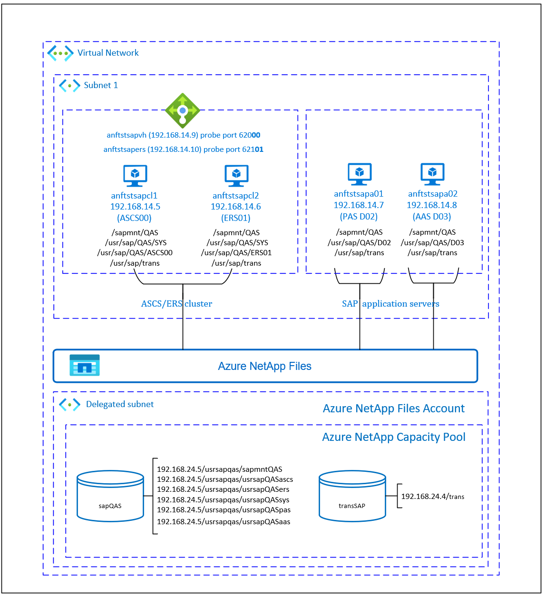

# Azure Virtual Machines HA for SAP NetWeaver on RHEL with Azure NetApp Files for SAP applications

[dbms-guide]:dbms-guide-general.md
[deployment-guide]:deployment-guide.md
[planning-guide]:planning-guide.md

[anf-azure-doc]:../../azure-netapp-files/azure-netapp-files-introduction.md
[anf-avail-matrix]:https://azure.microsoft.com/global-infrastructure/services/?products=storage&regions=all
[anf-sap-applications-azure]:https://www.netapp.com/us/media/tr-4746.pdf

[2002167]:https://launchpad.support.sap.com/#/notes/2002167
[2009879]:https://launchpad.support.sap.com/#/notes/2009879
[1928533]:https://launchpad.support.sap.com/#/notes/1928533
[2015553]:https://launchpad.support.sap.com/#/notes/2015553
[2178632]:https://launchpad.support.sap.com/#/notes/2178632
[2191498]:https://launchpad.support.sap.com/#/notes/2191498
[2243692]:https://launchpad.support.sap.com/#/notes/2243692
[1999351]:https://launchpad.support.sap.com/#/notes/1999351
[1410736]:https://launchpad.support.sap.com/#/notes/1410736

[sap-hana-ha]:sap-hana-high-availability-rhel.md

This article describes how to deploy virtual machines (VMs), configure the VMs, install the cluster framework, and install a highly available SAP NetWeaver 7.50 system by using [Azure NetApp Files](../../azure-netapp-files/azure-netapp-files-introduction.md). In the example configurations and installation commands, the ASCS instance is number 00, the ERS instance is number 01, the Primary Application instance (PAS) is 02, and the Application instance (AAS) is 03. The SAP System ID QAS is used.

The database layer isn't covered in detail in this article.

## Prerequisites

Read the following SAP Notes and papers first:

* [Azure NetApp Files documentation][anf-azure-doc]
* SAP Note [1928533], which has:
  * A list of Azure VM sizes that are supported for the deployment of SAP software.
  * Important capacity information for Azure VM sizes.
  * Supported SAP software and operating system (OS) and database combinations.
  * Required SAP kernel version for Windows and Linux on Microsoft Azure.

* SAP Note [2015553] lists prerequisites for SAP-supported SAP software deployments in Azure.
* SAP Note [2002167] has recommended OS settings for Red Hat Enterprise Linux.
* SAP Note [2009879] has SAP HANA Guidelines for Red Hat Enterprise Linux.
* SAP Note [2178632] has detailed information about all monitoring metrics reported for SAP in Azure.
* SAP Note [2191498] has the required SAP Host Agent version for Linux in Azure.
* SAP Note [2243692] has information about SAP licensing on Linux in Azure.
* SAP Note [1999351] has more troubleshooting information for the Azure Enhanced Monitoring Extension for SAP.
* [SAP Community WIKI](https://wiki.scn.sap.com/wiki/display/HOME/SAPonLinuxNotes) has all required SAP Notes for Linux.
* [Azure Virtual Machines planning and implementation for SAP on Linux][planning-guide]
* [Azure Virtual Machines deployment for SAP on Linux][deployment-guide]
* [Azure Virtual Machines DBMS deployment for SAP on Linux][dbms-guide]
* [SAP NetWeaver in Pacemaker cluster](https://access.redhat.com/articles/3150081)
* General Red Hat Enterprise Linux (RHEL) documentation:
  * [High Availability Add-On Overview](https://access.redhat.com/documentation/en-us/red_hat_enterprise_linux/7/html/high_availability_add-on_overview/index)
  * [High Availability Add-On Administration](https://access.redhat.com/documentation/en-us/red_hat_enterprise_linux/7/html/high_availability_add-on_administration/index)
  * [High Availability Add-On Reference](https://access.redhat.com/documentation/en-us/red_hat_enterprise_linux/7/html/high_availability_add-on_reference/index)
  * [Configuring ASCS/ERS for SAP NetWeaver with standalone resources in RHEL 7.5](https://access.redhat.com/articles/3569681)
  * [Configure SAP S/4HANA ASCS/ERS with Standalone Enqueue Server 2 (ENSA2) in Pacemaker on RHEL](https://access.redhat.com/articles/3974941)
* Azure-specific RHEL documentation:
  * [Support Policies for RHEL High Availability Clusters - Microsoft Azure Virtual Machines as Cluster Members](https://access.redhat.com/articles/3131341)
  * [Installing and Configuring a Red Hat Enterprise Linux 7.4 (and later) High-Availability Cluster on Microsoft Azure](https://access.redhat.com/articles/3252491)
* [NetApp SAP Applications on Microsoft Azure using Azure NetApp Files][anf-sap-applications-azure]
* [NetApp NFS Best Practices](https://www.netapp.com/media/10720-tr-4067.pdf)

## Overview

High availability (HA) for SAP NetWeaver central services requires shared storage. Until now to achieve HA on Red Hat Linux, it was necessary to build a separate highly available GlusterFS cluster.

Now it's possible to achieve SAP NetWeaver HA by using shared storage deployed on Azure NetApp Files. Using Azure NetApp Files for shared storage eliminates the need for more [GlusterFS clusters](./high-availability-guide-rhel-glusterfs.md). Pacemaker is still needed for HA of the SAP NetWeaver central services (ASCS/SCS).



SAP NetWeaver ASCS, SAP NetWeaver SCS, SAP NetWeaver ERS, and the SAP HANA database use virtual hostname and virtual IP addresses. On Azure, a load balancer is required to use a virtual IP address. We recommend using [Azure Load Balancer Standard](../../load-balancer/quickstart-load-balancer-standard-public-portal.md). The configuration here shows a load balancer with a:

* Front-end IP address 192.168.14.9 for ASCS.
* Front-end IP address 192.168.14.10 for ERS.
* Probe port 62000 for ASCS.
* Probe port 62101 for ERS.

## Set up the Azure NetApp Files infrastructure

SAP NetWeaver requires shared storage for the transport and profile directory. Before you proceed with the setup for Azure NetApp Files infrastructure, familiarize yourself with the [Azure NetApp Files documentation][anf-azure-doc]. Check if your selected Azure region offers Azure NetApp Files. For the availability of Azure NetApp Files by Azure region, see [Azure NetApp Files availability by Azure region][anf-avail-matrix].

Azure NetApp Files are available in several [Azure regions](https://azure.microsoft.com/global-infrastructure/services/?products=netapp).

### Deploy Azure NetApp Files resources

The steps assume that you already deployed [Azure Virtual Network](../../virtual-network/virtual-networks-overview.md). The Azure NetApp Files resources and the VMs, where the Azure NetApp Files resources will be mounted, must be deployed in the same Azure virtual network or in peered Azure virtual networks.

1. Create the Azure NetApp Files account in the selected Azure region by following the [instructions to create an Azure NetApp Files account](../../azure-netapp-files/azure-netapp-files-create-netapp-account.md).
1. Set up an Azure NetApp Files capacity pool by following the [instructions on how to set up an Azure NetApp Files capacity pool](../../azure-netapp-files/azure-netapp-files-set-up-capacity-pool.md).
The SAP NetWeaver architecture presented in this article uses a single Azure NetApp Files capacity pool, Premium SKU. We recommend the Azure NetApp Files Premium SKU for the SAP NetWeaver application workload on Azure.
1. Delegate a subnet to Azure NetApp Files as described in the [instructions on how to delegate a subnet to Azure NetApp Files](../../azure-netapp-files/azure-netapp-files-delegate-subnet.md).

1. Deploy Azure NetApp Files volumes by following the [instructions to create a volume for Azure NetApp Files](../../azure-netapp-files/azure-netapp-files-create-volumes.md). Deploy the volumes in the designated Azure NetApp Files [subnet](/rest/api/virtualnetwork/subnets). The IP addresses of the Azure NetApp volumes are assigned automatically. The Azure NetApp Files resources and the Azure VMs must be in the same Azure virtual network or in peered Azure virtual networks. In this example, we use two Azure NetApp Files volumes: sap**QAS** and transSAP. The file paths that are mounted to the corresponding mount points are /usrsap**qas**/sapmnt**QAS** and /usrsap**qas**/usrsap**QAS**sys.

   1. Volume sap**QAS** (nfs://192.168.24.5/usrsap**qas**/sapmnt**QAS**)
   1. Volume sap**QAS** (nfs://192.168.24.5/usrsap**qas**/usrsap**QAS**ascs)
   1. Volume sap**QAS** (nfs://192.168.24.5/usrsap**qas**/usrsap**QAS**sys)
   1. Volume sap**QAS** (nfs://192.168.24.5/usrsap**qas**/usrsap**QAS**ers)
   1. Volume transSAP (nfs://192.168.24.4/transSAP)
   1. Volume sap**QAS** (nfs://192.168.24.5/usrsap**qas**/usrsap**QAS**pas)
   1. Volume sap**QAS** (nfs://192.168.24.5/usrsap**qas**/usrsap**QAS**aas)

In this example, we used Azure NetApp Files for all SAP NetWeaver file systems to demonstrate how you can use Azure NetApp Files. The SAP file systems that don't need to be mounted via NFS can also be deployed as [Azure disk storage](../../virtual-machines/disks-types.md#premium-ssds). In this example, **a-e** must be on Azure NetApp Files and **f-g** (that is, /usr/sap/**QAS**/D**02** and /usr/sap/**QAS**/D**03**) could be deployed as Azure disk storage.

### Important considerations

When you consider Azure NetApp Files for the SAP NetWeaver on RHEL HA architecture, be aware of the following important considerations:

* The minimum capacity pool is 4 TiB. You can increase the capacity pool size in 1-TiB increments.
* The minimum volume is 100 GiB.
* Azure NetApp Files and all VMs, where Azure NetApp Files volumes will be mounted, must be in the same Azure virtual network or in [peered virtual networks](../../virtual-network/virtual-network-peering-overview.md) in the same region. Azure NetApp Files access over virtual network peering in the same region is supported now. Azure NetApp Files access over global peering isn't supported yet.
* The selected virtual network must have a subnet delegated to Azure NetApp Files.
* The throughput and performance characteristics of an Azure NetApp Files volume is a function of the volume quota and service level. For more information, see [Service level for Azure NetApp Files](../../azure-netapp-files/azure-netapp-files-service-levels.md). When you size the SAP Azure NetApp volumes, make sure that the resulting throughput meets the application requirements.
* Azure NetApp Files offers [export policy](../../azure-netapp-files/azure-netapp-files-configure-export-policy.md). You can control the allowed clients and the access type (like Read/Write and Read Only).
* The Azure NetApp Files feature isn't zone aware yet. Currently, the Azure NetApp Files feature isn't deployed in all availability zones in an Azure region. Be aware of the potential latency implications in some Azure regions.
* You can deploy Azure NetApp Files volumes as NFSv3 or NFSv4.1 volumes. Both protocols are supported for the SAP application layer (ASCS/ERS, SAP application servers).

## Set up (A)SCS

In this example, the resources were deployed manually via the [Azure portal](https://portal.azure.com/#home).

### Deploy Azure Load Balancer via the Azure portal

After you deploy the VMs for your SAP system, create a load balancer. Use VMs created for SAP ASCS/ERS instances in the back-end pool.

1. Create the load balancer (internal, standard).
   1. Create the front-end IP addresses.
      1. IP address 192.168.14.9 for the ASCS:
         1. Open the load balancer, select the front-end IP pool, and select **Add**.
         1. Enter the name of the new front-end IP pool (for example, **frontend.QAS.ASCS**).
         1. Set **Assignment** to **Static** and enter the IP address (for example, **192.168.14.9**).
         1. Select **OK**.
      1. IP address 192.168.14.10 for the ASCS ERS
         * Repeat the preceding steps under "a" to create an IP address for the ERS (for example, **192.168.14.10** and **frontend.QAS.ERS**).
   1. Create a single back-end pool:
      1. Open the load balancer, select **Backend pools**, and then select **Add**.
      1. Enter the name of the new back-end pool (for example, **backend.QAS**).
      1. Select **NIC** for **Backend Pool Configuration**.
      1. Select **Add a virtual machine**.
      1. Select the VMs of the ASCS cluster.
      1. Select **Add**.
      1. Select **Save**.
   1. Create the health probes.
      1. Port 620**00** for ASCS:
         1. Open the load balancer, select health probes, and select **Add**.
         1. Enter the name of the new health probe (for example, **health.QAS.ASCS**).
         1. Select **TCP** as the protocol, port 620**00**, and keep **Interval 5**.
         1. Select **OK**.
      1. Port 621**01** for ASCS ERS:
         * Repeat the preceding steps under "c" to create a health probe for the ERS (for example, 621**01** and **health.QAS.ERS**).
   1. Create load-balancing rules.
      1. Load-balancing rules for ASCS:
         1. Open the load balancer, select load-balancing rules, and select **Add**.
         1. Enter the name of the new load balancer rule (for example, **lb.QAS.ASCS**).
         1. Select the front-end IP address for ASCS, the back-end pool, and the health probe you created earlier (for example, **frontend.QAS.ASCS**, **backend.QAS**, and **health.QAS.ASCS**).
         1. Increase the idle timeout to **30 minutes**.
         1. Select **HA ports**.
         1. Make sure to enable **Floating IP**.
         1. Select **OK**.
         * Repeat the preceding steps to create load balancing rules for ERS (for example, **lb.QAS.ERS**).

> [!IMPORTANT]
> Floating IP isn't supported on a NIC secondary IP configuration in load-balancing scenarios. For more information, see [Azure Load Balancer limitations](../../load-balancer/load-balancer-multivip-overview.md#limitations). If you need more IP addresses for the VM, deploy a second NIC.

When VMs without public IP addresses are placed in the back-end pool of an internal (no public IP address) standard load balancer, there's no outbound internet connectivity unless more configuration is performed to allow routing to public endpoints. For more information on how to achieve outbound connectivity, see [Public endpoint connectivity for VMs by using Azure Standard Load Balancer in SAP high-availability scenarios](./high-availability-guide-standard-load-balancer-outbound-connections.md).

> [!IMPORTANT]
> Don't enable TCP timestamps on Azure VMs placed behind Azure Load Balancer. Enabling TCP timestamps could cause the health probes to fail. Set the parameter **net.ipv4.tcp_timestamps** to **0**. For more information, see [Load Balancer health probes](../../load-balancer/load-balancer-custom-probe-overview.md).

## Disable ID mapping (if you use NFSv4.1)

The instructions in this section are only applicable if you're using Azure NetApp Files volumes with the NFSv4.1 protocol. Perform the configuration on all VMs where Azure NetApp Files NFSv4.1 volumes will be mounted.  

1. Verify the NFS domain setting. Make sure that the domain is configured as the default Azure NetApp Files domain, that is, `defaultv4iddomain.com`, and the mapping is set to **nobody**.

    > [!IMPORTANT]
    > Make sure to set the NFS domain in `/etc/idmapd.conf` on the VM to match the default domain configuration on Azure NetApp Files: `defaultv4iddomain.com`. If there's a mismatch between the domain configuration on the NFS client (that is, the VM) and the NFS server (that is, the Azure NetApp configuration), then the permissions for files on Azure NetApp volumes that are mounted on the VMs display as `nobody`.

    ```bash
    sudo cat /etc/idmapd.conf
    
    # Example
    [General]
    Domain = defaultv4iddomain.com
    [Mapping]
    Nobody-User = nobody
    Nobody-Group = nobody
    ```

The following **[A]** prefix applies to both PAS and AAS.

1. **[A]** Verify `nfs4_disable_idmapping`. It should be set to **Y**. To create the directory structure where `nfs4_disable_idmapping` is located, run the mount command. You won't be able to manually create the directory under `/sys/modules` because access is reserved for the kernel and drivers.

    ```bash
    # Check nfs4_disable_idmapping 
    cat /sys/module/nfs/parameters/nfs4_disable_idmapping
     
    # If you need to set nfs4_disable_idmapping to Y
    mkdir /mnt/tmp
    mount 192.168.24.5:/sapQAS
    umount  /mnt/tmp
    echo "Y" > /sys/module/nfs/parameters/nfs4_disable_idmapping
    
    # Make the configuration permanent
   echo "options nfs nfs4_disable_idmapping=Y" >> /etc/modprobe.d/nfs.conf
   ```

### Create a Pacemaker cluster

Follow the steps in [Set up Pacemaker on Red Hat Enterprise Linux in Azure](high-availability-guide-rhel-pacemaker.md) to create a basic Pacemaker cluster for this (A)SCS server.

### Prepare for the SAP NetWeaver installation

The following items are prefixed with either:

* **[A]**: Applicable to all nodes
* **[1]**: Only applicable to node 1
* **[2]**: Only applicable to node 2

1. **[A]** Set up hostname resolution.

   You can either use a DNS server or modify the `/etc/hosts` file on all nodes. This example shows how to use the `/etc/hosts` file. Replace the IP address and the hostname in the following commands:

    ```bash
    sudo vi /etc/hosts
    ```

   Insert the following lines to `/etc/hosts`. Change the IP address and hostname to match your environment.

    ```bash
    # IP address of cluster node 1
    192.168.14.5    anftstsapcl1
    # IP address of cluster node 2
    192.168.14.6     anftstsapcl2
    # IP address of the load balancer frontend configuration for SAP Netweaver ASCS
    192.168.14.9    anftstsapvh
    # IP address of the load balancer frontend configuration for SAP Netweaver ERS
    192.168.14.10    anftstsapers
    ```

1. **[1]** Create SAP directories in the Azure NetApp Files volume.
   Mount the Azure NetApp Files volume temporarily on one of the VMs and create the SAP directories (file paths).

    ```bash
    # mount temporarily the volume
    sudo mkdir -p /saptmp
    
    # If using NFSv3
    sudo mount -t nfs -o rw,hard,rsize=65536,wsize=65536,nfsvers=3,tcp 192.168.24.5:/sapQAS /saptmp
    
    # If using NFSv4.1
    sudo mount -t nfs -o rw,hard,rsize=65536,wsize=65536,nfsvers=4.1,sec=sys,tcp 192.168.24.5:/sapQAS /saptmp
    
    # create the SAP directories
    sudo cd /saptmp
    sudo mkdir -p sapmntQAS
    sudo mkdir -p usrsapQASascs
    sudo mkdir -p usrsapQASers
    sudo mkdir -p usrsapQASsys
    sudo mkdir -p usrsapQASpas
    sudo mkdir -p usrsapQASaas
    
    # unmount the volume and delete the temporary directory
    sudo cd ..
    sudo umount /saptmp
    sudo rmdir /saptmp
    ```

1. **[A]** Create the shared directories.

   ```bash
   sudo mkdir -p /sapmnt/QAS
   sudo mkdir -p /usr/sap/trans
   sudo mkdir -p /usr/sap/QAS/SYS
   sudo mkdir -p /usr/sap/QAS/ASCS00
   sudo mkdir -p /usr/sap/QAS/ERS01
   
   sudo chattr +i /sapmnt/QAS
   sudo chattr +i /usr/sap/trans
   sudo chattr +i /usr/sap/QAS/SYS
   sudo chattr +i /usr/sap/QAS/ASCS00
   sudo chattr +i /usr/sap/QAS/ERS01
   ```

1. **[A]** Install the NFS client and other requirements.

   ```bash
   sudo yum -y install nfs-utils resource-agents resource-agents-sap
   ```

1. **[A]** Check the version of `resource-agents-sap`.

   Make sure that the version of the installed `resource-agents-sap` package is at least `3.9.5-124.el7`.

   ```bash
   sudo yum info resource-agents-sap
   
   # Loaded plugins: langpacks, product-id, search-disabled-repos
   # Repodata is over 2 weeks old. Install yum-cron? Or run: yum makecache fast
   # Installed Packages
   # Name        : resource-agents-sap
   # Arch        : x86_64
   # Version     : 3.9.5
   # Release     : 124.el7
   # Size        : 100 k
   # Repo        : installed
   # From repo   : rhel-sap-for-rhel-7-server-rpms
   # Summary     : SAP cluster resource agents and connector script
   # URL         : https://github.com/ClusterLabs/resource-agents
   # License     : GPLv2+
   # Description : The SAP resource agents and connector script interface with
   #          : Pacemaker to allow SAP instances to be managed in a cluster
   #          : environment.
   ```

1. **[A]** Add mount entries.

   If you use NFSv3:

   ```bash
   sudo vi /etc/fstab
   
   # Add the following lines to fstab, save and exit
   192.168.24.5:/sapQAS/sapmntQAS /sapmnt/QAS nfs rw,hard,rsize=65536,wsize=65536,nfsvers=3
   192.168.24.5:/sapQAS/usrsapQASsys /usr/sap/QAS/SYS nfs rw,hard,rsize=65536,wsize=65536,nfsvers=3
   192.168.24.4:/transSAP /usr/sap/trans nfs rw,hard,rsize=65536,wsize=65536,nfsvers=3
   ```

   If you use NFSv4.1:

   ```bash
   sudo vi /etc/fstab
   
   # Add the following lines to fstab, save and exit
   192.168.24.5:/sapQAS/sapmntQAS /sapmnt/QAS nfs rw,hard,rsize=65536,wsize=65536,nfsvers=4.1,sec=sys
   192.168.24.5:/sapQAS/usrsapQASsys /usr/sap/QAS/SYS nfs rw,hard,rsize=65536,wsize=65536,nfsvers=4.1,sec=sys
   192.168.24.4:/transSAP /usr/sap/trans nfs rw,hard,rsize=65536,wsize=65536,nfsvers=4.1,sec=sys
   ```

   > [!NOTE]
   > Make sure to match the NFS protocol version of the Azure NetApp Files volumes when you mount the volumes. If the Azure NetApp Files volumes are created as NFSv3 volumes, use the corresponding NFSv3 configuration. If the Azure NetApp Files volumes are created as NFSv4.1 volumes, follow the instructions to disable ID mapping and make sure to use the corresponding NFSv4.1 configuration. In this example, the Azure NetApp Files volumes were created as NFSv3 volumes.

   Mount the new shares.

   ```bash
   sudo mount -a  
   ```

1. **[A]** Configure the SWAP file.

   ```bash
   sudo vi /etc/waagent.conf
   
   # Set the property ResourceDisk.EnableSwap to y
   # Create and use swapfile on resource disk.
   ResourceDisk.EnableSwap=y
   
   # Set the size of the SWAP file with property ResourceDisk.SwapSizeMB
   # The free space of resource disk varies by VM size. Make sure that you do not set a value that is too big. You can check the SWAP space with command swapon
   # Size of the swapfile.
   ResourceDisk.SwapSizeMB=2000
   ```

   Restart the agent to activate the change.

   ```bash
   sudo service waagent restart
   ```

1. **[A]** Perform RHEL OS configuration.

   Based on the RHEL version, perform the configuration mentioned in SAP Note [2002167](https://launchpad.support.sap.com/#/notes/2002167), [2772999](https://launchpad.support.sap.com/#/notes/2772999), or [3108316](https://launchpad.support.sap.com/#/notes/2772999).

### Install SAP NetWeaver ASCS/ERS

1. **[1]** Configure cluster default properties.

   ```bash
   pcs resource defaults resource-stickiness=1
   pcs resource defaults migration-threshold=3
   ```

1. **[1]** Create a virtual IP resource and health probe for the ASCS instance.

   ```bash
   sudo pcs node standby anftstsapcl2
   
   # If using NFSv3
   sudo pcs resource create fs_QAS_ASCS Filesystem device='192.168.24.5:/sapQAS/usrsapQASascs' \
     directory='/usr/sap/QAS/ASCS00' fstype='nfs' force_unmount=safe \
     op start interval=0 timeout=60 op stop interval=0 timeout=120 op monitor interval=200 timeout=40 \
     --group g-QAS_ASCS
   
   # If using NFSv4.1
   sudo pcs resource create fs_QAS_ASCS Filesystem device='192.168.24.5:/sapQAS/usrsapQASascs' \
     directory='/usr/sap/QAS/ASCS00' fstype='nfs' force_unmount=safe options='sec=sys,nfsvers=4.1' \
     op start interval=0 timeout=60 op stop interval=0 timeout=120 op monitor interval=200 timeout=105 \
     --group g-QAS_ASCS
   
   sudo pcs resource create vip_QAS_ASCS IPaddr2 \
     ip=192.168.14.9 \
     --group g-QAS_ASCS
   
   sudo pcs resource create nc_QAS_ASCS azure-lb port=62000 \
     --group g-QAS_ASCS
   ```

   Make sure that the cluster status is okay and that all resources are started. Which node the resources are running on isn't important.

   ```bash
   sudo pcs status
   
   # Node anftstsapcl2: standby
   # Online: [ anftstsapcl1 ]
   #
   # Full list of resources:
   #
   # rsc_st_azure    (stonith:fence_azure_arm):      Started anftstsapcl1
   #  Resource Group: g-QAS_ASCS
   #      fs_QAS_ASCS        (ocf::heartbeat:Filesystem):    Started anftstsapcl1
   #      nc_QAS_ASCS        (ocf::heartbeat:azure-lb):      Started anftstsapcl1
   #      vip_QAS_ASCS       (ocf::heartbeat:IPaddr2):       Started anftstsapcl1
   ```

1. **[1]** Install SAP NetWeaver ASCS.

   Install SAP NetWeaver ASCS as the root on the first node by using a virtual hostname that maps to the IP address of the load balancer front-end configuration for the ASCS, for example, **anftstsapvh**, **192.168.14.9**, and the instance number that you used for the probe of the load balancer, for example, **00**.

   You can use the `sapinst` parameter `SAPINST_REMOTE_ACCESS_USER` to allow a nonroot user to connect to `sapinst`.

   ```bash
   # Allow access to SWPM. This rule is not permanent. If you reboot the machine, you have to run the command again.
   sudo firewall-cmd --zone=public  --add-port=4237/tcp
   
   sudo <swpm>/sapinst SAPINST_REMOTE_ACCESS_USER=sapadmin SAPINST_USE_HOSTNAME=<virtual_hostname>
   ```

   If the installation fails to create a subfolder in /usr/sap/**QAS**/ASCS**00**, try setting the owner and group of the ASCS**00** folder and retry.

   ```bash
   sudo chown qasadm /usr/sap/QAS/ASCS00
   sudo chgrp sapsys /usr/sap/QAS/ASCS00
   ```

1. **[1]** Create a virtual IP resource and health probe for the ERS instance.

   ```bash
   sudo pcs node unstandby anftstsapcl2
   sudo pcs node standby anftstsapcl1
   
   # If using NFSv3
   sudo pcs resource create fs_QAS_AERS Filesystem device='192.168.24.5:/sapQAS/usrsapQASers' \
     directory='/usr/sap/QAS/ERS01' fstype='nfs' force_unmount=safe \
     op start interval=0 timeout=60 op stop interval=0 timeout=120 op monitor interval=200 timeout=40 \
    --group g-QAS_AERS
   
   # If using NFSv4.1
   sudo pcs resource create fs_QAS_AERS Filesystem device='192.168.24.5:/sapQAS/usrsapQASers' \
     directory='/usr/sap/QAS/ERS01' fstype='nfs' force_unmount=safe options='sec=sys,nfsvers=4.1' \
     op start interval=0 timeout=60 op stop interval=0 timeout=120 op monitor interval=200 timeout=105 \
    --group g-QAS_AERS
   
   sudo pcs resource create vip_QAS_AERS IPaddr2 \
     ip=192.168.14.10 \
    --group g-QAS_AERS
   
   sudo pcs resource create nc_QAS_AERS azure-lb port=62101 \
    --group g-QAS_AERS
   ```

   Make sure that the cluster status is okay and that all resources are started. Which node the resources are running on isn't important.

   ```bash
   sudo pcs status
   
   # Node anftstsapcl1: standby
   # Online: [ anftstsapcl2 ]
   #
   # Full list of resources:
   #
   # rsc_st_azure    (stonith:fence_azure_arm):      Started anftstsapcl2
   #  Resource Group: g-QAS_ASCS
   #      fs_QAS_ASCS        (ocf::heartbeat:Filesystem):    Started anftstsapcl2
   #      nc_QAS_ASCS        (ocf::heartbeat:azure-lb):      Started anftstsapcl2<
   #      vip_QAS_ASCS       (ocf::heartbeat:IPaddr2):       Started anftstsapcl2
   #  Resource Group: g-QAS_AERS
   #      fs_QAS_AERS        (ocf::heartbeat:Filesystem):    Started anftstsapcl2
   #      nc_QAS_AERS        (ocf::heartbeat:azure-lb):      Started anftstsapcl2
   #      vip_QAS_AERS       (ocf::heartbeat:IPaddr2):       Started anftstsapcl2
   ```

1. **[2]** Install SAP NetWeaver ERS.

   Install SAP NetWeaver ERS as the root on the second node by using a virtual hostname that maps to the IP address of the load balancer front-end configuration for the ERS, for example, **anftstsapers**, **192.168.14.10**, and the instance number that you used for the probe of the load balancer, for example, **01**.

   You can use the `sapinst` parameter `SAPINST_REMOTE_ACCESS_USER` to allow a nonroot user to connect to `sapinst`.

   ```bash
   # Allow access to SWPM. This rule is not permanent. If you reboot the machine, you have to run the command again.
   sudo firewall-cmd --zone=public  --add-port=4237/tcp

   sudo <swpm>/sapinst SAPINST_REMOTE_ACCESS_USER=sapadmin SAPINST_USE_HOSTNAME=<virtual_hostname>
   ```

   If the installation fails to create a subfolder in /usr/sap/**QAS**/ERS**01**, try setting the owner and group of the ERS**01** folder and retry.

   ```bash
   sudo chown qaadm /usr/sap/QAS/ERS01
   sudo chgrp sapsys /usr/sap/QAS/ERS01
   ```

1. **[1]** Adapt the ASCS/SCS and ERS instance profiles.

   * ASCS/SCS profile

     ```bash
     sudo vi /sapmnt/QAS/profile/QAS_ASCS00_anftstsapvh
   
     # Change the restart command to a start command
     #Restart_Program_01 = local $(_EN) pf=$(_PF)
     Start_Program_01 = local $(_EN) pf=$(_PF)
   
     # Add the keep alive parameter, if using ENSA1
     enque/encni/set_so_keepalive = true
     ```

     For both ENSA1 and ENSA2, make sure that the `keepalive` OS parameters are set as described in SAP Note [1410736](https://launchpad.support.sap.com/#/notes/1410736).

   * ERS profile

     ```bash
     sudo vi /sapmnt/QAS/profile/QAS_ERS01_anftstsapers
   
     # Change the restart command to a start command
     #Restart_Program_00 = local $(_ER) pf=$(_PFL) NR=$(SCSID)
     Start_Program_00 = local $(_ER) pf=$(_PFL) NR=$(SCSID)
   
     # remove Autostart from ERS profile
     # Autostart = 1
     ```

1. **[A]** Configure Keep Alive.

   The communication between the SAP NetWeaver application server and the ASCS/SCS is routed through a software load balancer. The load balancer disconnects inactive connections after a configurable timeout. To prevent this action, set a parameter in the SAP NetWeaver ASCS/SCS profile, if you use ENSA1, and change the Linux system `keepalive` settings on all SAP servers for both ENSA1/ENSA2. For more information, see [SAP Note 1410736][1410736].

   ```bash
   # Change the Linux system configuration
   sudo sysctl net.ipv4.tcp_keepalive_time=300
   ```

1. **[A]** Update the `/usr/sap/sapservices` file.

   To prevent the start of the instances by the `sapinit` startup script, all instances managed by Pacemaker must be commented out from the `/usr/sap/sapservices` file.

   ```bash
   sudo vi /usr/sap/sapservices
   
   # Depending on whether the SAP Startup framework is integrated with systemd, you will observe one of the two entries on the ASCS node. You should comment out the line(s). 
   # LD_LIBRARY_PATH=/usr/sap/QAS/ASCS00/exe:$LD_LIBRARY_PATH; export LD_LIBRARY_PATH; /usr/sap/QAS/ASCS00/exe/sapstartsrv pf=/usr/sap/QAS/SYS/profile/QAS_ASCS00_anftstsapvh -D -u qasadm
   # systemctl --no-ask-password start SAPQAS_00 # sapstartsrv pf=/usr/sap/QAS/SYS/profile/QAS_ASCS00_anftstsapvh
   
   # Depending on whether the SAP Startup framework is integrated with systemd, you will observe one of the two entries on the ASCS node. You should comment out the line(s). 
   # LD_LIBRARY_PATH=/usr/sap/QAS/ERS01/exe:$LD_LIBRARY_PATH; export LD_LIBRARY_PATH; /usr/sap/QAS/ERS01/exe/sapstartsrv pf=/usr/sap/QAS/ERS01/profile/QAS_ERS01_anftstsapers -D -u qasadm
   # systemctl --no-ask-password start SAPQAS_01 # sapstartsrv pf=/usr/sap/QAS/ERS01/profile/QAS_ERS01_anftstsapers
   ```

   > [!IMPORTANT]
   > With the systemd based SAP Startup Framework, SAP instances can now be managed by systemd. The minimum required Red Hat Enterprise Linux (RHEL) version is RHEL 8 for SAP. As described in SAP Note [3115048](https://me.sap.com/notes/3115048), a fresh installation of a SAP kernel with integrated systemd based SAP Startup Framework support will always result in a systemd controlled SAP instance. After an SAP kernel upgrade of an existing SAP installation to a kernel which has systemd based SAP Startup Framework support, however, some manual steps have to be performed as documented in SAP Note [3115048](https://me.sap.com/notes/3115048) to convert the existing SAP startup environment to one which is systemd controlled.
   >
   > When utilizing Red Hat HA services for SAP (cluster configuration) to manage SAP application server instances such as SAP ASCS and SAP ERS, additional modifications will be necessary to ensure compatibility between the SAPInstance resource agent and the new systemd-based SAP startup framework. So once the SAP application server instances has been installed or switched to a systemd enabled SAP Kernel as per SAP Note [3115048](https://me.sap.com/notes/3115048), the steps mentioned in [Red Hat KBA 6884531](https://access.redhat.com/articles/6884531) must be completed successfully on all cluster nodes. These additonal steps are not required if SAP Startup framework is not integrated with systemd.

1. **[1]** Create the SAP cluster resources.

   If you use enqueue server 1 architecture (ENSA1), define the resources as shown here:

    ```bash
    sudo pcs property set maintenance-mode=true

    # If using NFSv3
    sudo pcs resource create rsc_sap_QAS_ASCS00 SAPInstance \
    InstanceName=QAS_ASCS00_anftstsapvh START_PROFILE="/sapmnt/QAS/profile/QAS_ASCS00_anftstsapvh" \
    AUTOMATIC_RECOVER=false \
    meta resource-stickiness=5000 migration-threshold=1 failure-timeout=60 \
    op monitor interval=20 on-fail=restart timeout=60 \
    op start interval=0 timeout=600 op stop interval=0 timeout=600 \
    --group g-QAS_ASCS
   
    # If using NFSv4.1
    sudo pcs resource create rsc_sap_QAS_ASCS00 SAPInstance \
    InstanceName=QAS_ASCS00_anftstsapvh START_PROFILE="/sapmnt/QAS/profile/QAS_ASCS00_anftstsapvh" \
    AUTOMATIC_RECOVER=false \
    meta resource-stickiness=5000 migration-threshold=1 failure-timeout=60 \
    op monitor interval=20 on-fail=restart timeout=105 \
    op start interval=0 timeout=600 op stop interval=0 timeout=600 \
    --group g-QAS_ASCS
   
    sudo pcs resource meta g-QAS_ASCS resource-stickiness=3000
   
    # If using NFSv3
    sudo pcs resource create rsc_sap_QAS_ERS01 SAPInstance \
    InstanceName=QAS_ERS01_anftstsapers START_PROFILE="/sapmnt/QAS/profile/QAS_ERS01_anftstsapers" \
    AUTOMATIC_RECOVER=false IS_ERS=true \
    op monitor interval=20 on-fail=restart timeout=60 op start interval=0 timeout=600 op stop interval=0 timeout=600 \
    --group g-QAS_AERS
   
    # If using NFSv4.1
    sudo pcs resource create rsc_sap_QAS_ERS01 SAPInstance \
    InstanceName=QAS_ERS01_anftstsapers START_PROFILE="/sapmnt/QAS/profile/QAS_ERS01_anftstsapers" \
    AUTOMATIC_RECOVER=false IS_ERS=true \
    op monitor interval=20 on-fail=restart timeout=105 op start interval=0 timeout=600 op stop interval=0 timeout=600 \
    --group g-QAS_AERS
   
    sudo pcs constraint colocation add g-QAS_AERS with g-QAS_ASCS -5000
    sudo pcs constraint location rsc_sap_QAS_ASCS00 rule score=2000 runs_ers_QAS eq 1
    sudo pcs constraint order start g-QAS_ASCS then stop g-QAS_AERS kind=Optional symmetrical=false
    
    sudo pcs node unstandby anftstsapcl1
    sudo pcs property set maintenance-mode=false
    ```

   SAP introduced support for enqueue server 2, including replication, as of SAP NW 7.52. Starting with ABAP Platform 1809, enqueue server 2 is installed by default. For enqueue server 2 support, see SAP Note [2630416](https://launchpad.support.sap.com/#/notes/2630416).

   If you use enqueue server 2 architecture ([ENSA2](https://help.sap.com/viewer/cff8531bc1d9416d91bb6781e628d4e0/1709%20001/en-US/6d655c383abf4c129b0e5c8683e7ecd8.html)), install the resource agent as `resource-agents-sap-4.1.1-12.el7.x86_64` or newer and define the resources as shown here:

    ```bash
    sudo pcs property set maintenance-mode=true
    
   # If using NFSv3
    sudo pcs resource create rsc_sap_QAS_ASCS00 SAPInstance \
    InstanceName=QAS_ASCS00_anftstsapvh START_PROFILE="/sapmnt/QAS/profile/QAS_ASCS00_anftstsapvh" \
    AUTOMATIC_RECOVER=false \
    meta resource-stickiness=5000 \
    op monitor interval=20 on-fail=restart timeout=60 \
    op start interval=0 timeout=600 op stop interval=0 timeout=600 \
    --group g-QAS_ASCS
   
    # If using NFSv4.1
    sudo pcs resource create rsc_sap_QAS_ASCS00 SAPInstance \
    InstanceName=QAS_ASCS00_anftstsapvh START_PROFILE="/sapmnt/QAS/profile/QAS_ASCS00_anftstsapvh" \
    AUTOMATIC_RECOVER=false \
    meta resource-stickiness=5000 \
    op monitor interval=20 on-fail=restart timeout=105 \
    op start interval=0 timeout=600 op stop interval=0 timeout=600 \
    --group g-QAS_ASCS
    
    sudo pcs resource meta g-QAS_ASCS resource-stickiness=3000
   
    # If using NFSv3
    sudo pcs resource create rsc_sap_QAS_ERS01 SAPInstance \
    InstanceName=QAS_ERS01_anftstsapers START_PROFILE="/sapmnt/QAS/profile/QAS_ERS01_anftstsapers" \
    AUTOMATIC_RECOVER=false IS_ERS=true \
    op monitor interval=20 on-fail=restart timeout=60 op start interval=0 timeout=600 op stop interval=0 timeout=600 \
    --group g-QAS_AERS
    
    # If using NFSv4.1
    sudo pcs resource create rsc_sap_QAS_ERS01 SAPInstance \
    InstanceName=QAS_ERS01_anftstsapers START_PROFILE="/sapmnt/QAS/profile/QAS_ERS01_anftstsapers" \
    AUTOMATIC_RECOVER=false IS_ERS=true \
    op monitor interval=20 on-fail=restart timeout=105 op start interval=0 timeout=600 op stop interval=0 timeout=600 \
    --group g-QAS_AERS
   
    sudo pcs resource meta rsc_sap_QAS_ERS01  resource-stickiness=3000
   
    sudo pcs constraint colocation add g-QAS_AERS with g-QAS_ASCS -5000
    sudo pcs constraint order start g-QAS_ASCS then start g-QAS_AERS kind=Optional symmetrical=false
    sudo pcs constraint order start g-QAS_ASCS then stop g-QAS_AERS kind=Optional symmetrical=false
   
    sudo pcs node unstandby anftstsapcl1
    sudo pcs property set maintenance-mode=false
    ```

    If you're upgrading from an older version and switching to enqueue server 2, see SAP Note [2641322](https://launchpad.support.sap.com/#/notes/2641322).

    > [!NOTE]
    > The higher timeouts that are suggested when you use NFSv4.1 are necessary owing to protocol-specific pause, which is related to NFSv4.1 lease renewals.
    > For more information, see [NFS in NetApp best practice](https://www.netapp.com/media/10720-tr-4067.pdf).
    > The timeouts in the preceding configuration are only examples and might need to be adapted to the specific SAP setup.

    Make sure that the cluster status is okay and that all resources are started. Which node the resources are running on isn't important.

    ```bash
    sudo pcs status
    
    # Online: [ anftstsapcl1 anftstsapcl2 ]
    #
    # Full list of resources:
    #
    # rsc_st_azure    (stonith:fence_azure_arm):      Started anftstsapcl2
    #  Resource Group: g-QAS_ASCS
    #      fs_QAS_ASCS        (ocf::heartbeat:Filesystem):    Started anftstsapcl2
    #      nc_QAS_ASCS        (ocf::heartbeat:azure-lb):      Started anftstsapcl2
    #      vip_QAS_ASCS       (ocf::heartbeat:IPaddr2):       Started anftstsapcl2
    #      rsc_sap_QAS_ASCS00 (ocf::heartbeat:SAPInstance):   Started anftstsapcl2
    #  Resource Group: g-QAS_AERS
    #      fs_QAS_AERS        (ocf::heartbeat:Filesystem):    Started anftstsapcl1
    #      nc_QAS_AERS        (ocf::heartbeat:azure-lb):      Started anftstsapcl1
    #      vip_QAS_AERS       (ocf::heartbeat:IPaddr2):       Started anftstsapcl1
    #      rsc_sap_QAS_ERS01  (ocf::heartbeat:SAPInstance):   Started anftstsapcl1
    ```

1. **[1]** Run the following step to configure `priority-fencing-delay` (applicable only as of pacemaker-2.0.4-6.el8 or higher).

    > [!NOTE]
    > If you have a two-node cluster, you have the option to configure the `priority-fencing-delay` cluster property. This property introduces more delay in fencing a node that has higher total resource priority when a split-brain scenario occurs. For more information, see [Can Pacemaker fence the cluster node with the fewest running resources?](https://access.redhat.com/solutions/5110521).
    >
    > The property `priority-fencing-delay` is applicable for pacemaker-2.0.4-6.el8 version or higher. If you're setting up `priority-fencing-delay` on an existing cluster, make sure to clear the `pcmk_delay_max` setting in the fencing device.  

    ```bash
    sudo pcs resource defaults update priority=1
    sudo pcs resource update rsc_sap_QAS_ASCS00 meta priority=10

    sudo pcs property set priority-fencing-delay=15s
    ```

1. **[A]** Add firewall rules for ASCS and ERS on both nodes.

    ```bash
    # Probe Port of ASCS
    sudo firewall-cmd --zone=public --add-port=62000/tcp --permanent
    sudo firewall-cmd --zone=public --add-port=62000/tcp
    sudo firewall-cmd --zone=public --add-port=3200/tcp --permanent
    sudo firewall-cmd --zone=public --add-port=3200/tcp
    sudo firewall-cmd --zone=public --add-port=3600/tcp --permanent
    sudo firewall-cmd --zone=public --add-port=3600/tcp
    sudo firewall-cmd --zone=public --add-port=3900/tcp --permanent
    sudo firewall-cmd --zone=public --add-port=3900/tcp
    sudo firewall-cmd --zone=public --add-port=8100/tcp --permanent
    sudo firewall-cmd --zone=public --add-port=8100/tcp
    sudo firewall-cmd --zone=public --add-port=50013/tcp --permanent
    sudo firewall-cmd --zone=public --add-port=50013/tcp
    sudo firewall-cmd --zone=public --add-port=50014/tcp --permanent
    sudo firewall-cmd --zone=public --add-port=50014/tcp
    sudo firewall-cmd --zone=public --add-port=50016/tcp --permanent
    sudo firewall-cmd --zone=public --add-port=50016/tcp
   
    # Probe Port of ERS
    sudo firewall-cmd --zone=public --add-port=62101/tcp --permanent
    sudo firewall-cmd --zone=public --add-port=62101/tcp
    sudo firewall-cmd --zone=public --add-port=3201/tcp --permanent
    sudo firewall-cmd --zone=public --add-port=3201/tcp
    sudo firewall-cmd --zone=public --add-port=3301/tcp --permanent
    sudo firewall-cmd --zone=public --add-port=3301/tcp
    sudo firewall-cmd --zone=public --add-port=50113/tcp --permanent
    sudo firewall-cmd --zone=public --add-port=50113/tcp
    sudo firewall-cmd --zone=public --add-port=50114/tcp --permanent
    sudo firewall-cmd --zone=public --add-port=50114/tcp
    sudo firewall-cmd --zone=public --add-port=50116/tcp --permanent
    sudo firewall-cmd --zone=public --add-port=50116/tcp
    ```

## SAP NetWeaver application server preparation

Some databases require that the database instance installation runs on an application server. Prepare the application server VMs to be able to use them in these cases.

The following steps assume that you install the application server on a server different from the ASCS/SCS and HANA servers. Otherwise, some of the steps (like configuring hostname resolution) aren't needed.

The following items are prefixed with either:

- **[A]**: Applicable to both PAS and AAS
- **[P]**: Only applicable to PAS
- **[S]**: Only applicable to AAS

1. **[A]** Set up hostname resolution.
   You can either use a DNS server or modify the `/etc/hosts` file on all nodes. This example shows how to use the `/etc/hosts` file. Replace the IP address and the hostname in the following commands:

   ```bash
   sudo vi /etc/hosts
   ```

   Insert the following lines to `/etc/hosts`. Change the IP address and hostname to match your environment.

   ```text
   # IP address of the load balancer frontend configuration for SAP NetWeaver ASCS
   192.168.14.9 anftstsapvh
   # IP address of the load balancer frontend configuration for SAP NetWeaver ASCS ERS
   192.168.14.10 anftstsapers
   192.168.14.7 anftstsapa01
   192.168.14.8 anftstsapa02
   ```

1. **[A]** Create the `sapmnt` directory.

   ```bash
   sudo mkdir -p /sapmnt/QAS
   sudo mkdir -p /usr/sap/trans
   
   sudo chattr +i /sapmnt/QAS
   sudo chattr +i /usr/sap/trans
   ```

1. **[A]** Install the NFS client and other requirements.

   ```bash
   sudo yum -y install nfs-utils uuidd
   ```

1. **[A]** Add mount entries.

   If you use NFSv3:

   ```bash
   sudo vi /etc/fstab
   
   # Add the following lines to fstab, save and exit
   192.168.24.5:/sapQAS/sapmntQAS /sapmnt/QAS nfs rw,hard,rsize=65536,wsize=65536,nfsvers=3
   192.168.24.4:/transSAP /usr/sap/trans nfs rw,hard,rsize=65536,wsize=65536,nfsvers=3
   ```

   If you use NFSv4.1:

   ```bash
   sudo vi /etc/fstab
   
   # Add the following lines to fstab, save and exit
   192.168.24.5:/sapQAS/sapmntQAS /sapmnt/QAS nfs rw,hard,rsize=65536,wsize=65536,nfsvers=4.1,sec=sys
   192.168.24.4:/transSAP /usr/sap/trans nfs rw,hard,rsize=65536,wsize=65536,nfsvers=4.1,sec=sys
   ```

   Mount the new shares.

   ```bash
   sudo mount -a
   ```

1. **[P]** Create and mount the PAS directory.

   If you use NFSv3:

   ```bash
   sudo mkdir -p /usr/sap/QAS/D02
   sudo chattr +i /usr/sap/QAS/D02
   
   sudo vi /etc/fstab
   # Add the following line to fstab
   92.168.24.5:/sapQAS/usrsapQASpas /usr/sap/QAS/D02 nfs rw,hard,rsize=65536,wsize=65536,nfsvers=3
   
   # Mount
   sudo mount -a
   ```

   If you use NFSv4.1:

   ```bash
   sudo mkdir -p /usr/sap/QAS/D02
   sudo chattr +i /usr/sap/QAS/D02
   
   sudo vi /etc/fstab
   # Add the following line to fstab
   92.168.24.5:/sapQAS/usrsapQASpas /usr/sap/QAS/D02 nfs rw,hard,rsize=65536,wsize=65536,nfsvers=4.1,sec=sys
   
   # Mount
   sudo mount -a
   ```

1. **[S]** Create and mount the AAS directory.

   If you use NFSv3:

   ```bash
   sudo mkdir -p /usr/sap/QAS/D03
   sudo chattr +i /usr/sap/QAS/D03
   
   sudo vi /etc/fstab
   # Add the following line to fstab
   92.168.24.5:/sapQAS/usrsapQASaas /usr/sap/QAS/D03 nfs rw,hard,rsize=65536,wsize=65536,nfsvers=3
   
   # Mount
   sudo mount -a
   ```

   If you use NFSv4.1:

   ```bash
   sudo mkdir -p /usr/sap/QAS/D03
   sudo chattr +i /usr/sap/QAS/D03
   
   sudo vi /etc/fstab
   # Add the following line to fstab
   92.168.24.5:/sapQAS/usrsapQASaas /usr/sap/QAS/D03 nfs rw,hard,rsize=65536,wsize=65536,nfsvers=4.1,sec=sys
   
   # Mount
   sudo mount -a
   ```

1. **[A]** Configure the SWAP file.

   ```bash
   sudo vi /etc/waagent.conf
   
   # Set the property ResourceDisk.EnableSwap to y
   # Create and use swapfile on resource disk.
   ResourceDisk.EnableSwap=y
   
   # Set the size of the SWAP file with property ResourceDisk.SwapSizeMB
   # The free space of resource disk varies by VM size. Make sure that you do not set a value that is too big. You can check the SWAP space with command swapon
   # Size of the swapfile.
   ResourceDisk.SwapSizeMB=2000
   ```

   Restart the agent to activate the change.

   ```bash
   sudo service waagent restart
   ```

## Install the database

In this example, SAP NetWeaver is installed on SAP HANA. You can use every supported database for this installation. For more information on how to install SAP HANA in Azure, see [High availability of SAP HANA on Azure VMs on Red Hat Enterprise Linux][sap-hana-ha]. For a list of supported databases, see [SAP Note 1928533][1928533].

* Run the SAP database instance installation.

   Install the SAP NetWeaver database instance as the root by using a virtual hostname that maps to the IP address of the load balancer front-end configuration for the database.

   You can use the `sapinst` parameter `SAPINST_REMOTE_ACCESS_USER` to allow a nonroot user to connect to `sapinst`.

   ```bash
   sudo <swpm>/sapinst SAPINST_REMOTE_ACCESS_USER=sapadmin
   ```

## SAP NetWeaver application server installation

Follow these steps to install an SAP application server.

1. Prepare the application server.

   Follow the steps in the previous section [SAP NetWeaver application server preparation](#sap-netweaver-application-server-preparation) to prepare the application server.

1. Install the SAP NetWeaver application server.

   Install a primary or additional SAP NetWeaver applications server.

   You can use the `sapinst` parameter `SAPINST_REMOTE_ACCESS_USER` to allow a nonroot user to connect to `sapinst`.

   ```bash
   sudo <swpm>/sapinst SAPINST_REMOTE_ACCESS_USER=sapadmin
   ```

1. Update the SAP HANA secure store.

   Update the SAP HANA secure store to point to the virtual name of the SAP HANA System Replication setup.

   Run the following command to list the entries as \<sapsid>adm.

   ```bash
   hdbuserstore List
   ```

   All entries should be listed and look similar to:

   ```bash
   DATA FILE       : /home/qasadm/.hdb/anftstsapa01/SSFS_HDB.DAT
   KEY FILE        : /home/qasadm/.hdb/anftstsapa01/SSFS_HDB.KEY
   
   KEY DEFAULT
     ENV : 192.168.14.4:30313
     USER: SAPABAP1
     DATABASE: QAS
   ```

   The output shows that the IP address of the default entry is pointing to the VM and not to the load balancer's IP address. You need to change this entry to point to the virtual hostname of the load balancer. Make sure to use the same port (**30313** in the preceding output) and database name (**QAS** in the preceding output).

   ```bash
   su - qasadm
   hdbuserstore SET DEFAULT qasdb:30313@QAS SAPABAP1 <password of ABAP schema>
   ```

## Test the cluster setup

Thoroughly test your Pacemaker cluster. For more information, see [Execute the typical failover tests](high-availability-guide-rhel.md#test-the-cluster-setup).

## Next steps

* To deploy a cost-optimization scenario where the PAS and AAS instances are deployed with the SAP NetWeaver HA cluster on RHEL, see [Install SAP dialog instance with SAP ASCS/SCS high availability VMs on RHEL](high-availability-guide-rhel-with-dialog-instance.md).
* See [HA for SAP NW on Azure VMs on RHEL for SAP applications multi-SID guide](./high-availability-guide-rhel-multi-sid.md).
* See [Azure Virtual Machines planning and implementation for SAP][planning-guide].
* See [Azure Virtual Machines deployment for SAP][deployment-guide].
* See [Azure Virtual Machines DBMS deployment for SAP][dbms-guide].
* To learn how to establish HA and plan for disaster recovery of SAP HANA on Azure (large instances), see [SAP HANA (large instances) high availability and disaster recovery on Azure](../../virtual-machines/workloads/sap/hana-overview-high-availability-disaster-recovery.md).
* To learn how to establish HA and plan for disaster recovery of SAP HANA on Azure Virtual Machines, see [High availability of SAP HANA on Azure Virtual Machines][sap-hana-ha].
