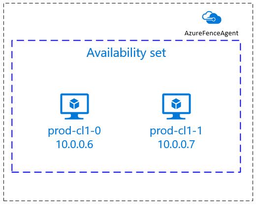

# Setting up Pacemaker on Red Hat Enterprise Linux in Azure

[planning-guide]:planning-guide.md
[deployment-guide]:deployment-guide.md
[dbms-guide]:dbms-guide-general.md
[sap-hana-ha]:sap-hana-high-availability.md
[1928533]:https://launchpad.support.sap.com/#/notes/1928533
[2015553]:https://launchpad.support.sap.com/#/notes/2015553
[2002167]:https://launchpad.support.sap.com/#/notes/2002167
[2009879]:https://launchpad.support.sap.com/#/notes/2009879
[2178632]:https://launchpad.support.sap.com/#/notes/2178632
[2191498]:https://launchpad.support.sap.com/#/notes/2191498
[2243692]:https://launchpad.support.sap.com/#/notes/2243692
[1999351]:https://launchpad.support.sap.com/#/notes/1999351
[3108316]:https://launchpad.support.sap.com/#/notes/3108316
[3108302]:https://launchpad.support.sap.com/#/notes/3108302

[virtual-machines-linux-maintenance]:../../virtual-machines/maintenance-and-updates.md#maintenance-that-doesnt-require-a-reboot

The article describes how to configure basic Pacemaker cluster on Red Hat Enterprise Server(RHEL). The instructions cover RHEL 7, RHEL 8 and RHEL 9.

## Prerequisites

Read the following SAP Notes and papers first:

* SAP Note [1928533], which has:
  * The list of Azure VM sizes that are supported for the deployment of SAP software.
  * Important capacity information for Azure VM sizes.
  * The supported SAP software, and operating system (OS) and database combinations.
  * The required SAP kernel version for Windows and Linux on Microsoft Azure.
* SAP Note [2015553] lists prerequisites for SAP-supported SAP software deployments in Azure.
* SAP Note [2002167] recommends OS settings for Red Hat Enterprise Linux
* SAP Note [3108316] recommends OS settings for Red Hat Enterprise Linux 9.x
* SAP Note [2009879] has SAP HANA Guidelines for Red Hat Enterprise Linux
* SAP Note [3108302] has SAP HANA Guidelines for Red Hat Enterprise Linux 9.x
* SAP Note [2178632] has detailed information about all monitoring metrics reported for SAP in Azure.
* SAP Note [2191498] has the required SAP Host Agent version for Linux in Azure.
* SAP Note [2243692] has information about SAP licensing on Linux in Azure.
* SAP Note [1999351] has additional troubleshooting information for the Azure Enhanced Monitoring Extension for SAP.
* [SAP Community WIKI](https://wiki.scn.sap.com/wiki/display/HOME/SAPonLinuxNotes) has all required SAP Notes for Linux.
* [Azure Virtual Machines planning and implementation for SAP on Linux][planning-guide]
* [Azure Virtual Machines deployment for SAP on Linux (this article)][deployment-guide]
* [Azure Virtual Machines DBMS deployment for SAP on Linux][dbms-guide]
* [SAP HANA system replication in pacemaker cluster](https://access.redhat.com/articles/3004101)
* General RHEL documentation
  * [High Availability Add-On Overview](https://access.redhat.com/documentation/en-us/red_hat_enterprise_linux/7/html/high_availability_add-on_overview/index)
  * [High Availability Add-On Administration](https://access.redhat.com/documentation/en-us/red_hat_enterprise_linux/7/html/high_availability_add-on_administration/index)
  * [High Availability Add-On Reference](https://access.redhat.com/documentation/en-us/red_hat_enterprise_linux/7/html/high_availability_add-on_reference/index)
  * [Support Policies for RHEL High Availability Clusters - `sbd` and `fence_sbd`](https://access.redhat.com/articles/2800691)
* Azure-specific RHEL documentation:
  * [Support Policies for RHEL High Availability Clusters - Microsoft Azure Virtual Machines as Cluster Members](https://access.redhat.com/articles/3131341)
  * [Installing and Configuring a Red Hat Enterprise Linux 7.4 (and later) High-Availability Cluster on Microsoft Azure](https://access.redhat.com/articles/3252491)
  * [Considerations in adopting RHEL 8 - High availability and clusters](https://access.redhat.com/documentation/en-us/red_hat_enterprise_linux/8/html/considerations_in_adopting_rhel_8/high-availability-and-clusters_considerations-in-adopting-rhel-8)
  * [Configure SAP S/4HANA ASCS/ERS with Standalone Enqueue Server 2 (ENSA2) in Pacemaker on RHEL 7.6](https://access.redhat.com/articles/3974941)
  * [RHEL for SAP Offerings on Azure](https://access.redhat.com/articles/5456301)

## Cluster installation



> [!NOTE]
> Red Hat doesn't support software-emulated watchdog. Red Hat doesn't support SBD on cloud platforms. For details see [Support Policies for RHEL High Availability Clusters - sbd and fence_sbd](https://access.redhat.com/articles/2800691).
>
> The only supported fencing mechanism for Pacemaker Red Hat Enterprise Linux clusters on Azure, is Azure fence agent.  

The following items are prefixed with either **[A]** - applicable to all nodes, **[1]** - only applicable to node 1 or **[2]** - only applicable to node 2. Differences in the commands or the configuration between RHEL 7 and RHEL 8/RHEL 9 are marked in the document.

1. **[A]** Register - optional step. This step isn't required, if using RHEL SAP HA-enabled images.  

   For example, if deploying on RHEL 7, register your virtual machine and attach it to a pool that contains repositories for RHEL 7.

   ```bash
   sudo subscription-manager register
   # List the available pools
   sudo subscription-manager list --available --matches '*SAP*'
   sudo subscription-manager attach --pool=<pool id>
   ```

   By attaching a pool to an Azure Marketplace PAYG RHEL image, you will be effectively double-billed for your RHEL usage: once for the PAYG image, and once for the RHEL entitlement in the pool you attach. To mitigate this situation, Azure now provides BYOS RHEL images. For more information, see [Red Hat Enterprise Linux bring-your-own-subscription Azure images](../../virtual-machines/workloads/redhat/byos.md).

1. **[A]** Enable RHEL for SAP repos - optional step. This step isn't required, if using RHEL SAP HA-enabled images.  

   In order to install the required packages on RHEL 7, enable the following repositories.

   ```bash
   sudo subscription-manager repos --disable "*"
   sudo subscription-manager repos --enable=rhel-7-server-rpms
   sudo subscription-manager repos --enable=rhel-ha-for-rhel-7-server-rpms
   sudo subscription-manager repos --enable=rhel-sap-for-rhel-7-server-rpms
   sudo subscription-manager repos --enable=rhel-ha-for-rhel-7-server-eus-rpms
   ```

1. **[A]** Install RHEL HA Add-On

   ```bash
    sudo yum install -y pcs pacemaker fence-agents-azure-arm nmap-ncat
   ```

   > [!IMPORTANT]
   > We recommend the following versions of Azure Fence agent (or later) for customers to benefit from a faster failover time, if a resource stop fails or the cluster nodes cannot communicate which each other anymore:  
   >
   > RHEL 7.7 or higher use the latest available version of fence-agents package.
   >
   > RHEL 7.6: fence-agents-4.2.1-11.el7_6.8
   >
   > RHEL 7.5: fence-agents-4.0.11-86.el7_5.8  
   >
   > RHEL 7.4: fence-agents-4.0.11-66.el7_4.12
   >
   > For more information, see [Azure VM running as a RHEL High Availability cluster member take a very long time to be fenced, or fencing fails / times-out before the VM shuts down](https://access.redhat.com/solutions/3408711).

   > [!IMPORTANT]
   > We recommend the following versions of Azure Fence agent (or later) for customers wishing to use Managed Identities for Azure resources instead of service principal names for the fence agent.
   >
   > RHEL 8.4: fence-agents-4.2.1-54.el8.
   >
   > RHEL 8.2: fence-agents-4.2.1-41.el8_2.4  
   >
   > RHEL 8.1: fence-agents-4.2.1-30.el8_1.4  
   >
   > RHEL 7.9: fence-agents-4.2.1-41.el7_9.4.

   > [!IMPORTANT]
   > On RHEL 9, we recommend the following package versions (or later) to avoid issues with Azure Fence agent:
   >
   > fence-agents-4.10.0-20.el9_0.7  
   >
   > fence-agents-common-4.10.0-20.el9_0.6
   >
   > ha-cloud-support-4.10.0-20.el9_0.6.x86_64.rpm  

   Check the version of the Azure fence agent. If necessary, update it to the minimum required version or later.  

   ```bash
   # Check the version of the Azure Fence Agent
    sudo yum info fence-agents-azure-arm
   ```

   > [!IMPORTANT]
   > If you need to update the Azure Fence agent, and if using custom role, make sure to update the custom role to include action **powerOff**. For details see [Create a custom role for the fence agent](#1-create-a-custom-role-for-the-fence-agent).  

1. If deploying on RHEL 9, install also the resource agents for cloud deployment:

    ```bash
    sudo yum install -y resource-agents-cloud
    ```

1. **[A]** Setup host name resolution

   You can either use a DNS server or modify the /etc/hosts on all nodes. This example shows how to use the /etc/hosts file.
   Replace the IP address and the hostname in the following commands.  

   > [!IMPORTANT]
   > If using host names in the cluster configuration, it's vital to have reliable host name resolution. The cluster communication will fail, if the names are not available and that can lead to cluster failover delays.
   >
   > The benefit of using /etc/hosts is that your cluster becomes independent of DNS, which could be a single point of failures too.  

   ```bash
   sudo vi /etc/hosts
   ```

   Insert the following lines to /etc/hosts. Change the IP address and hostname to match your environment

   ```text
   # IP address of the first cluster node
   10.0.0.6 prod-cl1-0
   # IP address of the second cluster node
   10.0.0.7 prod-cl1-1
   ```

1. **[A]** Change hacluster password to the same password

   ```bash
   sudo passwd hacluster
   ```

1. **[A]** Add firewall rules for pacemaker

   Add the following firewall rules to all cluster communication between the cluster nodes.

   ```bash
   sudo firewall-cmd --add-service=high-availability --permanent
   sudo firewall-cmd --add-service=high-availability
   ```

1. **[A]** Enable basic cluster services

   Run the following commands to enable the Pacemaker service and start it.

   ```bash
   sudo systemctl start pcsd.service
   sudo systemctl enable pcsd.service
   ```

1. **[1]** Create Pacemaker cluster

   Run the following commands to authenticate the nodes and create the cluster. Set the token to 30000 to allow Memory preserving maintenance. For more information, see [this article for Linux][virtual-machines-linux-maintenance].  

   If building a cluster on **RHEL 7.x**, use the following commands:  

   ```bash
   sudo pcs cluster auth prod-cl1-0 prod-cl1-1 -u hacluster
   sudo pcs cluster setup --name nw1-azr prod-cl1-0 prod-cl1-1 --token 30000
   sudo pcs cluster start --all
   ```

   If building a cluster on **RHEL 8.x/RHEL 9.x**, use the following commands:  

   ```bash
   sudo pcs host auth prod-cl1-0 prod-cl1-1 -u hacluster
   sudo pcs cluster setup nw1-azr prod-cl1-0 prod-cl1-1 totem token=30000
   sudo pcs cluster start --all
   ```

   Verify the cluster status, by executing the following command:  

   ```bash
   # Run the following command until the status of both nodes is online
   sudo pcs status
   
   # Cluster name: nw1-azr
   # WARNING: no stonith devices and stonith-enabled is not false
   # Stack: corosync
   # Current DC: prod-cl1-1 (version 1.1.18-11.el7_5.3-2b07d5c5a9) - partition with quorum
   # Last updated: Fri Aug 17 09:18:24 2018
   # Last change: Fri Aug 17 09:17:46 2018 by hacluster via crmd on prod-cl1-1
   #
   # 2 nodes configured
   # 0 resources configured
   #
   # Online: [ prod-cl1-0 prod-cl1-1 ]
   #
   # No resources
   #
   # Daemon Status:
   #   corosync: active/disabled
   #   pacemaker: active/disabled
   #   pcsd: active/enabled
   ```

1. **[A]** Set Expected Votes.

   ```bash
   # Check the quorum votes 
   pcs quorum status
   
   # If the quorum votes are not set to 2, execute the next command
   sudo pcs quorum expected-votes 2
   ```

   > [!TIP]
   > If building multi-node cluster, that is cluster with more than two nodes, don't set the votes to 2.

1. **[1]** Allow concurrent fence actions

   ```bash
   sudo pcs property set concurrent-fencing=true
   ```

## Create fencing device

The fencing device uses either a managed identity for Azure resource or service principal to authorize against Microsoft Azure.

### [Managed Identity](#tab/msi)

To create a managed identity (MSI), [create a system-assigned](../../active-directory/managed-identities-azure-resources/qs-configure-portal-windows-vm.md#system-assigned-managed-identity) managed identity for each VM in the cluster. Should a system-assigned managed identity already exist, it will be used. User assigned managed identities should not be used with Pacemaker at this time. Fence device, based on managed identity is supported on RHEL 7.9 and RHEL 8.x/RHEL 9.x.

### [Service Principal](#tab/spn)

Follow these steps to create a service principal, if not using managed identity.

1. Go to the [Azure portal](https://portal.azure.com).
2. Open the Azure Active Directory blade.
   Go to Properties and make a note of the Directory ID. This is the **tenant ID**.
3. Click App registrations.
4. Click New Registration.
5. Enter a Name, select "Accounts in this organization directory only".
6. Select Application Type "Web", enter a sign-on URL (for example http:\//localhost) and click Add.
   The sign-on URL isn't used and can be any valid URL.
7. Select Certificates and Secrets, then click New client secret.
8. Enter a description for a new key, select "Two years" and click Add.
9. Make a note of the Value. It is used as the **password** for the service principal.
10. Select Overview. Make a note the Application ID. It's used as the username (**login ID** in the steps below) of the service principal.

---

### **[1]** Create a custom role for the fence agent

Neither managed identity nor service principal has permissions to access your Azure resources by default. You need to give the managed identity or service principal permissions to start and stop (power-off) all virtual machines of the cluster. If you didn't already create the custom role, you can create it using [PowerShell](../../role-based-access-control/custom-roles-powershell.md) or [Azure CLI](../../role-based-access-control/custom-roles-cli.md)

Use the following content for the input file. You need to adapt the content to your subscriptions that is, replace *xxxxxxxx-xxxx-xxxx-xxxx-xxxxxxxxxxxx* and *yyyyyyyy-yyyy-yyyy-yyyy-yyyyyyyyyyyy* with the Ids of your subscription. If you only have one subscription, remove the second entry in AssignableScopes.

```json
{
      "Name": "Linux Fence Agent Role",
      "description": "Allows to power-off and start virtual machines",
      "assignableScopes": [
              "/subscriptions/xxxxxxxx-xxxx-xxxx-xxxx-xxxxxxxxxxxx",
              "/subscriptions/yyyyyyyy-yyyy-yyyy-yyyy-yyyyyyyyyyyy"
      ],
      "actions": [
              "Microsoft.Compute/*/read",
              "Microsoft.Compute/virtualMachines/powerOff/action",
              "Microsoft.Compute/virtualMachines/start/action"
      ],
      "notActions": [],
      "dataActions": [],
      "notDataActions": []
}
```

### **[A]** Assign the custom role

#### [Managed Identity](#tab/msi)

Assign the custom role "Linux Fence Agent Role" that was created in the last chapter to each managed identity of the cluster VMs. Each VM system-assigned managed identity needs the role assigned for every cluster VM's resource. For detailed steps, see [Assign a managed identity access to a resource by using the Azure portal](../../active-directory/managed-identities-azure-resources/howto-assign-access-portal.md). Verify each VM's managed identity role assignment contains all cluster VMs.

> [!IMPORTANT]
> Be aware assignment and removal of authorization with managed identities [can be delayed](../../active-directory/managed-identities-azure-resources/managed-identity-best-practice-recommendations.md#limitation-of-using-managed-identities-for-authorization) until effective.

#### [Service Principal](#tab/spn)

Assign the custom role "Linux Fence Agent Role" that was created in the last chapter to the service principal. Don't use the Owner role anymore! For detailed steps, see [Assign Azure roles using the Azure portal](../../role-based-access-control/role-assignments-portal.md).

Make sure to assign the role for both cluster nodes.

---

### **[1]** Create the fencing devices

After you edited the permissions for the virtual machines, you can configure the fencing devices in the cluster.

```bash
sudo pcs property set stonith-timeout=900
```

> [!NOTE]
> Option 'pcmk_host_map' is ONLY required in the command, if the RHEL host names and the Azure VM names are NOT identical. Specify the mapping in the format **hostname:vm-name**.
> Refer to the bold section in the command. For more information, see [What format should I use to specify node mappings to fencing devices in pcmk_host_map](https://access.redhat.com/solutions/2619961)

#### [Managed Identity](#tab/msi)

For RHEL **7.x**, use the following command to configure the fence device:

```bash
sudo pcs stonith create rsc_st_azure fence_azure_arm msi=true resourceGroup="resource group" \ 
subscriptionId="subscription id" pcmk_host_map="prod-cl1-0:prod-cl1-0-vm-name;prod-cl1-1:prod-cl1-1-vm-name" \
power_timeout=240 pcmk_reboot_timeout=900 pcmk_monitor_timeout=120 pcmk_monitor_retries=4 pcmk_action_limit=3 pcmk_delay_max=15 \
op monitor interval=3600
```

For RHEL **8.x/9.x**, use the following command to configure the fence device:  

```bash
# If the version of pacemaker is or greater than 2.0.4-6.el8, then run following command: 
sudo pcs stonith create rsc_st_azure fence_azure_arm msi=true resourceGroup="resource group" \
subscriptionId="subscription id" pcmk_host_map="prod-cl1-0:prod-cl1-0-vm-name;prod-cl1-1:prod-cl1-1-vm-name" \
power_timeout=240 pcmk_reboot_timeout=900 pcmk_monitor_timeout=120 pcmk_monitor_retries=4 pcmk_action_limit=3 \
op monitor interval=3600

# If the version of pacemaker is less than 2.0.4-6.el8, then run following command:
sudo pcs stonith create rsc_st_azure fence_azure_arm msi=true resourceGroup="resource group" \
subscriptionId="subscription id" pcmk_host_map="prod-cl1-0:prod-cl1-0-vm-name;prod-cl1-1:prod-cl1-1-vm-name" \
power_timeout=240 pcmk_reboot_timeout=900 pcmk_monitor_timeout=120 pcmk_monitor_retries=4 pcmk_action_limit=3 pcmk_delay_max=15 \
op monitor interval=3600
```

#### [Service Principal](#tab/spn)

For RHEL **7.x**, use the following command to configure the fence device:

```bash
sudo pcs stonith create rsc_st_azure fence_azure_arm login="login ID" passwd="password" \
resourceGroup="resource group" tenantId="tenant ID" subscriptionId="subscription id" \
pcmk_host_map="prod-cl1-0:prod-cl1-0-vm-name;prod-cl1-1:prod-cl1-1-vm-name" \
power_timeout=240 pcmk_reboot_timeout=900 pcmk_monitor_timeout=120 pcmk_monitor_retries=4 pcmk_action_limit=3 pcmk_delay_max=15 \
op monitor interval=3600
```

For RHEL **8.x/9.x**, use the following command to configure the fence device:  

```bash
# If the version of pacemaker is or greater than 2.0.4-6.el8, then run following command: 
sudo pcs stonith create rsc_st_azure fence_azure_arm username="login ID" password="password" \
resourceGroup="resource group" tenantId="tenant ID" subscriptionId="subscription id" \
pcmk_host_map="prod-cl1-0:prod-cl1-0-vm-name;prod-cl1-1:prod-cl1-1-vm-name" \
power_timeout=240 pcmk_reboot_timeout=900 pcmk_monitor_timeout=120 pcmk_monitor_retries=4 pcmk_action_limit=3 \
op monitor interval=3600

# If the version of pacemaker is less than 2.0.4-6.el8, then run following command:
sudo pcs stonith create rsc_st_azure fence_azure_arm username="login ID" password="password" \
resourceGroup="resource group" tenantId="tenant ID" subscriptionId="subscription id" \
pcmk_host_map="prod-cl1-0:prod-cl1-0-vm-name;prod-cl1-1:prod-cl1-1-vm-name" \
power_timeout=240 pcmk_reboot_timeout=900 pcmk_monitor_timeout=120 pcmk_monitor_retries=4 pcmk_action_limit=3 pcmk_delay_max=15 \
op monitor interval=3600
```

---

If you're using fencing device, based on service principal configuration, read [Change from SPN to MSI for Pacemaker clusters using Azure fencing](https://techcommunity.microsoft.com/t5/running-sap-applications-on-the/sap-on-azure-high-availability-change-from-spn-to-msi-for/ba-p/3609278) and learn how to convert to managed identity configuration.

> [!TIP]
> Only configure the `pcmk_delay_max` attribute in two node clusters, with pacemaker version less than 2.0.4-6.el8. For more information on preventing fence races in a two node Pacemaker cluster, see [Delaying fencing in a two node cluster to prevent fence races of "fence death" scenarios](https://access.redhat.com/solutions/54829).

> [!IMPORTANT]
> The monitoring and fencing operations are deserialized. As a result, if there is a longer running monitoring operation and simultaneous fencing event, there is no delay to the cluster failover, due to the already running monitoring operation.  

### **[1]** Enable the use of a fencing device

```bash
sudo pcs property set stonith-enabled=true
```

> [!TIP]
>Azure Fence Agent requires outbound connectivity to public end points as documented, along with possible solutions, in [Public endpoint connectivity for VMs using standard ILB](./high-availability-guide-standard-load-balancer-outbound-connections.md).  

## Configure Pacemaker for Azure scheduled events

Azure offers [scheduled events](../../virtual-machines/linux/scheduled-events.md). Scheduled events are sent via the metadata service and allow time for the application to prepare for such events. Pacemaker resource agent azure-events-az monitors for scheduled Azure events. If events are detected and the resource agent determines that another cluster node is available, it sets a cluster health attribute. When the cluster health attribute is set for a node, the location constraint triggers and all resources, whose name doesn’t start with “health-“ are migrated away from the node with scheduled event. Once the affected cluster node is free of running cluster resources, scheduled event is acknowledged and can execute its action, such as restart.

1. **[A]** Make sure that the package for the azure-events-az agent is already installed and up to date.

   ```bash
   sudo dnf info resource-agents
   ```

   Minimum version requirements:
   - RHEL 8.4: `resource-agents-4.1.1-90.13`
   - RHEL 8.6: `resource-agents-4.9.0-16.9`
   - RHEL 8.8 and newer: `resource-agents-4.9.0-40.1`
   - RHEL 9.0 and newer: `resource-agents-cloud-4.10.0-34.2`

2. **[1]** Configure the resources in Pacemaker.

   ```bash
   #Place the cluster in maintenance mode
   sudo pcs property set maintenance-mode=true

3. **[1]** Set the pacemaker cluster health node strategy and constraint

   ```bash
   sudo pcs property set node-health-strategy=custom
   sudo pcs constraint location 'regexp%!health-.*' \
   rule score-attribute='#health-azure' \
   defined '#uname'
   ```

   > [!IMPORTANT]
   >
   > Don't define any other resources in the cluster starting with “health-”, besides the resources described in the next steps of the documentation.

4. **[1]** Set initial value of the cluster attributes.
   Run for each cluster node. For scale-out environments including majority maker VM.

   ```bash
   sudo crm_attribute --node prod-cl1-0 --name '#health-azure' --update 0
   sudo crm_attribute --node prod-cl1-1 --name '#health-azure' --update 0
   ```

5. **[1]** Configure the resources in Pacemaker.  
   Important: The resources must start with ‘health-azure’.

   ```bash
   sudo pcs resource create health-azure-events \
   ocf:heartbeat:azure-events-az op monitor interval=10s
   sudo pcs resource clone health-azure-events allow-unhealthy-nodes=true
   ```

6. Take the Pacemaker cluster out of maintenance mode

   ```bash
   sudo pcs property set maintenance-mode=false
   ```

7. Clear any errors during enablement and verify that the health-azure-events resources have started successfully on all cluster nodes.

   ```bash
   sudo pcs resource cleanup
   ```

   First time query execution for scheduled events [can take up to 2 minutes](../../virtual-machines/linux/scheduled-events.md#enabling-and-disabling-scheduled-events). Pacemaker testing with scheduled events can use reboot or redeploy actions for the cluster VMs. For more information, see [scheduled events](../../virtual-machines/linux/scheduled-events.md) documentation.

## Optional fencing configuration  

> [!TIP]
> This section is only applicable, if it is desired to configure special fencing device `fence_kdump`.  

If there is a need to collect diagnostic information within the VM, it may be useful to configure additional fencing device, based on fence agent `fence_kdump`. The `fence_kdump` agent can detect that a node entered kdump crash recovery and can allow the crash recovery service to complete, before other fencing methods are invoked. Note that `fence_kdump` isn't a replacement for traditional fence mechanisms, like Azure Fence Agent when using Azure VMs.

> [!IMPORTANT]
> Be aware that when `fence_kdump` is configured as a first level fencing device, it will introduce delays in the fencing operations and respectively delays in the application resources failover.
>
> If a crash dump is successfully detected, the fencing will be delayed until the crash recovery service completes. If the failed node is unreachable or if it doesn't respond, the fencing will be delayed by time determined by the configured number of iterations and the `fence_kdump` timeout. For more details, see [How do I configure fence_kdump in a Red Hat Pacemaker cluster](https://access.redhat.com/solutions/2876971).
>
> The proposed fence_kdump timeout may need to be adapted to the specific environment.
>
> We recommend to configure `fence_kdump` fencing only when necessary to collect diagnostics within the VM and always in combination with traditional fence method as Azure Fence Agent.

The following Red Hat KBs contain important information about configuring `fence_kdump` fencing:

* [How do I configure fence_kdump in a Red Hat Pacemaker cluster](https://access.redhat.com/solutions/2876971)
* [How to configure/manage fencing levels in RHEL cluster with Pacemaker](https://access.redhat.com/solutions/891323)
* [fence_kdump fails with "timeout after X seconds" in a RHEL 6 or 7 HA cluster with kexec-tools older than 2.0.14](https://access.redhat.com/solutions/2388711)
* For information how to change the default timeout see [How do I configure kdump for use with the RHEL 6,7,8 HA Add-On](https://access.redhat.com/articles/67570)
* For information on how to reduce failover delay, when using `fence_kdump` see [Can I reduce the expected delay of failover when adding fence_kdump configuration](https://access.redhat.com/solutions/5512331)
  
Execute the following optional steps to add `fence_kdump` as a first level fencing configuration, in addition to the Azure Fence Agent configuration.

1. **[A]** Verify that kdump is active and configured.

    ```bash
    systemctl is-active kdump
    # Expected result
    # active
    ```

2. **[A]** Install the `fence_kdump` fence agent.

    ```bash
    yum install fence-agents-kdump
    ```

3. **[1]** Create `fence_kdump` fencing device in the cluster.

    ```bash
    pcs stonith create rsc_st_kdump fence_kdump pcmk_reboot_action="off" pcmk_host_list="prod-cl1-0 prod-cl1-1" timeout=30
    ```

4. **[1]** Configure fencing levels, so that `fence_kdump` fencing mechanism is engaged first.  

    ```bash
    pcs stonith create rsc_st_kdump fence_kdump pcmk_reboot_action="off" pcmk_host_list="prod-cl1-0 prod-cl1-1"
    pcs stonith level add 1 prod-cl1-0 rsc_st_kdump
    pcs stonith level add 1 prod-cl1-1 rsc_st_kdump
    pcs stonith level add 2 prod-cl1-0 rsc_st_azure
    pcs stonith level add 2 prod-cl1-1 rsc_st_azure
    
    # Check the fencing level configuration 
    pcs stonith level
    # Example output
    # Target: prod-cl1-0
    # Level 1 - rsc_st_kdump
    # Level 2 - rsc_st_azure
    # Target: prod-cl1-1
    # Level 1 - rsc_st_kdump
    # Level 2 - rsc_st_azure
    ```

5. **[A]** Allow the required ports for `fence_kdump` through the firewall

    ```bash
    firewall-cmd --add-port=7410/udp
    firewall-cmd --add-port=7410/udp --permanent
    ```

6. **[A]** Ensure that `initramfs` image file contains `fence_kdump` and `hosts` files. For details see [How do I configure fence_kdump in a Red Hat Pacemaker cluster](https://access.redhat.com/solutions/2876971).

    ```bash
    lsinitrd /boot/initramfs-$(uname -r)kdump.img | egrep "fence|hosts"
    # Example output 
    # -rw-r--r--   1 root     root          208 Jun  7 21:42 etc/hosts
    # -rwxr-xr-x   1 root     root        15560 Jun 17 14:59 usr/libexec/fence_kdump_send
    ```

7. **[A]** Perform the `fence_kdump_nodes` configuration in `/etc/kdump.conf` to avoid  `fence_kdump` failing with a timeout for some `kexec-tools` versions. For details see [fence_kdump times out when fence_kdump_nodes is not specified with kexec-tools version 2.0.15 or later](https://access.redhat.com/solutions/4498151) and [fence_kdump fails with "timeout after X seconds" in a RHEL 6 or 7 High Availability cluster with kexec-tools versions older than 2.0.14](https://access.redhat.com/solutions/2388711). The example configuration for a two node cluster is presented below. After making a change in `/etc/kdump.conf`, the kdump image must be regenerated. That can be achieved by restarting the `kdump` service.  

    ```bash
    vi /etc/kdump.conf
    # On node prod-cl1-0 make sure the following line is added
    fence_kdump_nodes  prod-cl1-1
    # On node prod-cl1-1 make sure the following line is added
    fence_kdump_nodes  prod-cl1-0
    
    # Restart the service on each node
    systemctl restart kdump
    ```

8. Test the configuration by crashing a node. For details see [How do I configure fence_kdump in a Red Hat Pacemaker cluster](https://access.redhat.com/solutions/2876971).  

    > [!IMPORTANT]
    > If the cluster is already in productive use, plan the test accordingly as crashing a node will have an impact on the application.

    ```bash
    echo c > /proc/sysrq-trigger
    ```

## Next steps

* [Azure Virtual Machines planning and implementation for SAP][planning-guide].
* [Azure Virtual Machines deployment for SAP][deployment-guide].
* [Azure Virtual Machines DBMS deployment for SAP][dbms-guide].
* To learn how to establish high availability and plan for disaster recovery of SAP HANA on Azure VMs, see [High Availability of SAP HANA on Azure Virtual Machines (VMs)][sap-hana-ha].
