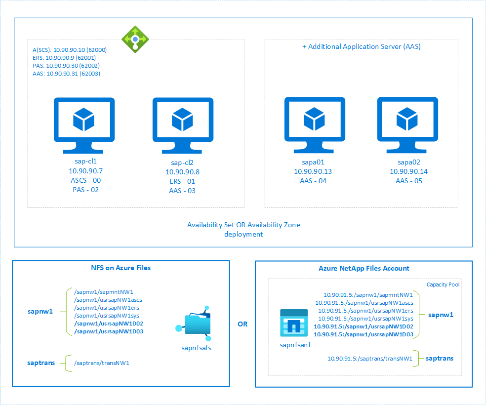

# Deploy SAP Dialog Instances with SAP ASCS/SCS high availability VMs on Red Hat Enterprise Linux

This article describes how to install and configure Primary Application Server (PAS) and Additional Application Server (AAS) dialog instance on the same SAP ASCS/SCS high availability cluster running on Red Hat Enterprise Linux (RHEL).

## References

* [Configuring SAP S/4HANA ASCS/ERS with Standalone Enqueue Server 2 (ENSA2) in Pacemaker](https://access.redhat.com/articles/3974941)
* [Configuring SAP NetWeaver ASCS/ERS ENSA1 with Standalone Resources in RHEL 7.5+ and RHEL 8](https://access.redhat.com/articles/3569681)
* SAP Note [1928533](https://launchpad.support.sap.com/#/notes/1928533), which has:
  * List of Azure VM sizes that are supported for the deployment of SAP software
  * Important capacity information for Azure VM sizes
  * Supported SAP software, and operating system (OS) and database combinations
  * Required SAP kernel version for Windows and Linux on Microsoft Azure
* SAP Note [2015553](https://launchpad.support.sap.com/#/notes/2015553) lists prerequisites for SAP-supported SAP software deployments in Azure.
* SAP Note [2002167](https://launchpad.support.sap.com/#/notes/2002167) has recommended OS settings for Red Hat Enterprise Linux 7.x
* SAP Note [2772999](https://launchpad.support.sap.com/#/notes/2772999) has recommended OS settings for Red Hat Enterprise Linux 8.x
* SAP Note [2009879](https://launchpad.support.sap.com/#/notes/2009879) has SAP HANA Guidelines for Red Hat Enterprise Linux
* SAP Note [2178632](https://launchpad.support.sap.com/#/notes/2178632) has detailed information about all monitoring metrics reported for SAP in Azure.
* SAP Note [2191498](https://launchpad.support.sap.com/#/notes/2191498) has the required SAP Host Agent version for Linux in Azure.
* SAP Note [2243692](https://launchpad.support.sap.com/#/notes/224362) has information about SAP licensing on Linux in Azure.
* SAP Note [1999351](https://launchpad.support.sap.com/#/notes/1999351) has additional troubleshooting information for the Azure Enhanced Monitoring Extension for SAP.
* [SAP Community Wiki](https://wiki.scn.sap.com/wiki/display/HOME/SAPonLinuxNotes) has all required SAP Notes for Linux.
* [Azure Virtual Machines planning and implementation for SAP on Linux](planning-guide.md)
* [Azure Virtual Machines deployment for SAP on Linux](deployment-guide.md)
* [Azure Virtual Machines DBMS deployment for SAP on Linux](dbms-guide-general.md)
* [SAP Netweaver in pacemaker cluster](https://access.redhat.com/articles/3150081)
* General RHEL documentation
  * [High Availability Add-On Overview](https://access.redhat.com/documentation/en-us/red_hat_enterprise_linux/7/html/high_availability_add-on_overview/index)
  * [High Availability Add-On Administration](https://access.redhat.com/documentation/en-us/red_hat_enterprise_linux/7/html/high_availability_add-on_administration/index)
  * [High Availability Add-On Reference](https://access.redhat.com/documentation/en-us/red_hat_enterprise_linux/7/html/high_availability_add-on_reference/index)
* Azure-specific RHEL documentation:
  * [Support Policies for RHEL High Availability Clusters - Microsoft Azure Virtual Machines as Cluster Members](https://access.redhat.com/articles/3131341)
  * [Installing and Configuring a Red Hat Enterprise Linux 7.4 (and later) High-Availability Cluster on Microsoft Azure](https://access.redhat.com/articles/3252491)

## Overview

This article describes the cost optimization scenario where you deploy Primary Application Server (PAS) and Additional Application Server (AAS) dialog instances with SAP ASCS/SCS and SAP ERS instances in high availability setup. To minimize the number of VMs for a single SAP system, you want to install PAS and AAS on the same host where SAP ASCS/SCS and SAP ERS are running. With SAP ASCS/SCS being configured in high availability cluster setup, you want PAS and AAS to be managed by cluster as well. The configuration is basically an addition to already configured SAP ASCS/SCS cluster setup. In this setup PAS and AAS will be installed on a virtual hostname and its instance directory is managed by the cluster.

For this setup, PAS and AAS require a highly available instance directory (`/usr/sap/<SID>/D<nr>`). You can place the instance directory filesystem on the same high available storage that you've used for ASCS and ERS instance configuration. The presented architecture showcases [NFS on Azure Files](../../storage/files/files-nfs-protocol.md) or [Azure NetApp Files](../../azure-netapp-files/azure-netapp-files-introduction.md) for highly available instance directory for the setup.

The example shown in this article to describe deployment uses following system information -

| Instance name                       | Instance number | Virtual hostname | Virtual IP (Probe Port) |
| ----------------------------------- | --------------- | ---------------- | ----------------------- |
| ABAP SAP Central Services (ASCS)    | 00              | sapascs          | 10.90.90.10 (62000)     |
| Enqueue Replication Server (ERS)    | 01              | sapers           | 10.90.90.9 (62001)      |
| Primary Application Server (PAS)    | 02              | sappas           | 10.90.90.30 (62002)     |
| Additional Application Server (AAS) | 03              | sapers           | 10.90.90.31 (62003)     |
| SAP system identifier               | NW1             | ---              | ---                     |

> [!NOTE]
>
> Install additional SAP application instances on separate VMs, if you want to scale out.



### Important consideration for the cost optimization solution

* Only two dialog instances, PAS and one AAS can be deployed with SAP ASCS/SCS cluster setup.
* If you want to scale out your SAP system with additional application servers (like **sapa03** and **sapa04**), you can install them in separate VMs. With PAS and AAS being installed on virtual hostnames, you can either install additional application server using physical or virtual hostname in separate VMs. To learn more on how to assign virtual hostname to a VM, refer to the blog [Use SAP Virtual Host Names with Linux in Azure](https://techcommunity.microsoft.com/t5/running-sap-applications-on-the/use-sap-virtual-host-names-with-linux-in-azure/ba-p/3251593).
* With PAS and AAS deployment with SAP ASCS/SCS cluster setup, the instance number of ASCS, ERS, PAS and AAS must be different.
* Consider sizing your VM SKUs appropriately based on the sizing guidelines. You have to factor in the cluster behavior where multiple SAP instances (ASCS, ERS, PAS and AAS) may run on a single VM when other VM in the cluster is unavailable.
* The dialog instances (PAS and AAS) running with SAP ASCS/SCS cluster setup must be installed using virtual hostname.
* You must use the same storage solution of SAP ASCS/SCS cluster setup to deploy PAS and AAS instances as well. For example, if you have configured SAP ASCS/SCS cluster using NFS on Azure files, same storage solution must be used to deploy PAS and AAS.
* Instance directory `/usr/sap/<SID>/D<nr>` of PAS and AAS must be mounted on NFS file system and will be managed as resource by the cluster.
  > [!NOTE]
  >
  > For SAP J2EE systems, it's not supported to place `/usr/sap/<SID>/J<nr>` on NFS on Azure Files.
* To install additional application servers on separate VMs, you can either use NFS shares or local managed disk for instance directory filesystem. If you're installing additional application servers for SAP J2EE system, `/usr/sap/<SID>/J<nr>` on NFS on Azure Files isn't supported.
* In traditional SAP ASCS/SCS high availability configuration, application server instances running on separate VMs aren't affected when there's any effect on SAP ASCS and ERS cluster nodes. But with the cost optimization configuration, either PAS or AAS instance will restart when there's an effect on one of the nodes in the cluster.
* Refer [NFS on Azure Files consideration](high-availability-guide-rhel-nfs-azure-files.md#important-considerations-for-nfs-on-azure-files-shares) and [Azure NetApp Files consideration](high-availability-guide-rhel-netapp-files.md#important-considerations), as same consideration applies for this setup as well.

## Pre-requisites

The configuration described in this article is an addition to your already configured SAP ASCS/SCS cluster setup. In this configuration, PAS and AAS will be installed on a virtual hostname and its instance directory is managed by the cluster. Based on your storage, follow the steps described in below guide to configure `SAPInstance` resource for SAP ASCS and SAP ERS instance in the cluster.

* NFS on Azure Files - [Azure VMs high availability for SAP NW on RHEL with NFS on Azure Files](high-availability-guide-rhel-nfs-azure-files.md)
* Azure NetApp Files - [Azure VMs high availability for SAP NW on RHEL with Azure NetApp Files](high-availability-guide-rhel-netapp-files.md)

Once you have installed **ASCS**, **ERS** and **Database** instance using SWPM, follow below steps to install PAS and AAS instances.

## Configure Azure Load Balancer for PAS and AAS

This document assumes that you’ve already configured SAP ASCS/SCS cluster setup, which requires Azure Load Balancer. In the same Azure load balancer, follow below steps to create virtual IPs and load balancing rules for PAS and AAS.

1. Open the internal load balancer that you've created for SAP ASCS/SCS cluster setup.
2. Create the frontend IP address for PAS and AAS instance
   1. IP address for PAS is **10.90.90.30**
      1. In **Settings** > **Frontend IP configuration**, click on **Add**.
      2. Enter the name of the new frontend IP (for example, **frontend.NW1.PAS**).
      3. Select the **subnet**.
      4. Set the **assignment** to **Static** and enter the IP address (for example, **10.90.90.30**).
      5. Click Ok.
   2. IP address for AAS is **10.90.90.31**
      1. Repeat the steps above under "2.a" to create a frontend IP address for ERS (for example **10.90.90.31** and **frontend.NW1.AAS**)
3. Backend Pool remains same, as we're deploying PAS and AAS on the same backend pool (**backend.NW1**).
4. Create health probe for PAS and AAS instance
   1. Port for PAS is **62002**
      1. In **Settings** > **Health probes**, click on **Add**.
      2. Enter the name of the health probe (for example, **health.NW1.PAS**).
      3. Select **TCP** as protocol, port **62002** and keep interval **5**.
      4. Click Ok.
   2. Port for AAS is **62003**
      1. Repeat the steps above under "4.a" to create health probe for AAS (for example **62003** and **health.NW1.AAS**)
5. Create load balancing rules for PAS and AAS instance
   1. Load balancing rule for PAS
      1. In **Settings** > **Load balancing rules**, click on **Add**.
      2. Enter the name of load balancing rule (for example, **lb.NW1.PAS**).
      3. Select the frontend IP address for PAS, backend pool, and health probe you created earlier (for example **frontend.NW1.PAS**, **backend.NW1**, and **health.NW1.PAS**)
      4. Select **HA ports**
      5. Make sure to **enable Floating IP**
      6. Click OK
   2. Load balancing rule for AAS
      1. Repeat the steps above under “5.1” to create load balancing rule for AAS (for example, **lb.NW1.AAS**).

> [!IMPORTANT]
>
> Floating IP is not supported on a NIC secondary IP configuration in load-balancing scenarios. For details see [Azure Load balancer Limitations](../../load-balancer/load-balancer-multivip-overview.md#limitations). If you need additional IP address for the VM, deploy a second NIC.

> [!NOTE]
>
> When VMs without public IP addresses are placed in the backend pool of internal (no public IP address) Standard Azure load balancer, there will be no outbound internet connectivity, unless additional configuration is performed to allow routing to public end points. For details on how to achieve outbound connectivity see [Public endpoint connectivity for Virtual Machines using Azure Standard Load Balancer in SAP high-availability scenarios](high-availability-guide-standard-load-balancer-outbound-connections.md).

> [!IMPORTANT]
>
> Do not enable TCP timestamps on Azure VMs placed behind Azure Load Balancer. Enabling TCP timestamps will cause the health probes to fail. Set parameter **net.ipv4.tcp_timestamps** to **0**. For details see [Load Balancer health probes](../../load-balancer/load-balancer-custom-probe-overview.md).

## Prepare servers for PAS and AAS installation

The following items are prefixed with either **[A]** - applicable to all nodes, **[1]** - only applicable to node 1 or **[2]** - only applicable to node 2.

1. **[A]** Setup hostname resolution

   You can either use a DNS server or modify the /etc/hosts on all nodes. This example shows how to use the /etc/hosts file. Replace the IP address and the hostname in the following commands

   ```bash
   sudo vi /etc/hosts
   
   # IP address of cluster node 1
   10.90.90.7    sap-cl1
   # IP address of cluster node 2
   10.90.90.8     sap-cl2
   # IP address of the load balancer frontend configuration for SAP Netweaver ASCS
   10.90.90.10   sapascs
   # IP address of the load balancer frontend configuration for SAP Netweaver ERS
   10.90.90.9    sapers
   # IP address of the load balancer frontend configuration for SAP Netweaver PAS
   10.90.90.30   sappas
   # IP address of the load balancer frontend configuration for SAP Netweaver AAS
   10.90.90.31   sapaas
   ```

2. **[1]** Create the SAP directories on the NFS share. Mount temporarily the NFS share **sapnw1** on one of the VMs and create the SAP directories that will be used as nested mount points.

   1. If using, NFS on Azure files

      ```bash
      # mount temporarily the volume
      sudo mkdir -p /saptmp
      sudo mount -t nfs sapnfs.file.core.windows.net:/sapnfsafs/sapnw1 /saptmp -o vers=4,minorversion=1,sec=sys
      
      # create the SAP directories
      sudo cd /saptmp
      sudo mkdir -p usrsapNW1D02
      sudo mkdir -p usrsapNW1D03
      
      # unmount the volume and delete the temporary directory
      cd ..
      sudo umount /saptmp
      sudo rmdir /saptmp
      ```

   2. If using, Azure NetApp Files

      ```bash
      # mount temporarily the volume
      sudo mkdir -p /saptmp
      
      # If using NFSv3
      sudo mount -t nfs -o rw,hard,rsize=65536,wsize=65536,vers=3,tcp 10.90.91.5:/sapnw1 /saptmp
      # If using NFSv4.1
      sudo mount -t nfs -o rw,hard,rsize=65536,wsize=65536,vers=4.1,sec=sys,tcp 10.90.91.5:/sapnw1 /saptmp
      
      # create the SAP directories
      sudo cd /saptmp
      sudo mkdir -p usrsapNW1D02
      sudo mkdir -p usrsapNW1D03
      
      # unmount the volume and delete the temporary directory
      sudo cd ..
      sudo umount /saptmp
      sudo rmdir /saptmp
      ```

3. **[A]** Create the shared directories

   ```bash
   sudo mkdir -p /usr/sap/NW1/D02
   sudo mkdir -p /usr/sap/NW1/D03
   
   sudo chattr +i /usr/sap/NW1/D02
   sudo chattr +i /usr/sap/NW1/D03
   ```

4. **[A]** Configure SWAP space. When installing dialog instance with central services, you need to configure more swap space.

   ```bash
   sudo vi /etc/waagent.conf
   
   # Check if property ResourceDisk.Format is already set to y and if not, set it
   ResourceDisk.Format=y
   
   # Set the property ResourceDisk.EnableSwap to y
   # Create and use swapfile on resource disk.
   ResourceDisk.EnableSwap=y
   
   # Set the size of the SWAP file with property ResourceDisk.SwapSizeMB
   # The free space of resource disk varies by virtual machine size. Make sure that you do not set a value that is too big. You can check the SWAP space with command swapon
   # Size of the swapfile.
   #ResourceDisk.SwapSizeMB=2000
   ResourceDisk.SwapSizeMB=10480
   ```

   Restart the agent to activate the change.

   ```bash
   sudo service waagent restart
   ```

5. **[A]** Add firewall rules for PAS and AAS

   ```bash
   # Probe port for PAS and AAS
   sudo firewall-cmd --zone=public --add-port=62002/tcp --permanent
   sudo firewall-cmd --zone=public --add-port=62002/tcp
   sudo firewall-cmd --zone=public --add-port=62003/tcp --permanent
   sudo firewall-cmd --zone=public --add-port=62003/tcp
   
   # Gateway port for PAS and AAS
   sudo firewall-cmd --zone=public --add-port=3302/tcp --permanent
   sudo firewall-cmd --zone=public --add-port=3302/tcp
   sudo firewall-cmd --zone=public --add-port=3303/tcp --permanent
   sudo firewall-cmd --zone=public --add-port=3303/tcp
   ```

## Installing SAP Netweaver PAS instance

1. **[1]** Check the status of the cluster. Before configuring PAS resource for installation, make sure ASCS and ERS resources are configured and started.

   ```bash
   sudo pcs status
   
   # Online: [ sap-cl1 sap-cl2 ]
   #
   # Full list of resources:
   #
   # rsc_st_azure    (stonith:fence_azure_arm):      Started sap-cl1
   #  Resource Group: g-NW1_ASCS
   #      fs_NW1_ASCS        (ocf::heartbeat:Filesystem):    Started sap-cl1
   #      nc_NW1_ASCS        (ocf::heartbeat:azure-lb):      Started sap-cl1
   #      vip_NW1_ASCS       (ocf::heartbeat:IPaddr2):       Started sap-cl1
   #      rsc_sap_NW1_ASCS00 (ocf::heartbeat:SAPInstance):   Started sap-cl1
   #  Resource Group: g-NW1_AERS
   #      fs_NW1_AERS        (ocf::heartbeat:Filesystem):    Started sap-cl2
   #      nc_NW1_AERS        (ocf::heartbeat:azure-lb):      Started sap-cl2
   #      vip_NW1_AERS       (ocf::heartbeat:IPaddr2):       Started sap-cl2
   #      rsc_sap_NW1_ERS01  (ocf::heartbeat:SAPInstance):   Started sap-cl2
   ```

2. **[1]** Create filesystem, virtual IP and health probe resource for PAS instance.

   ```bash
   sudo pcs node standby sap-cl2
   sudo pcs resource create vip_NW1_PAS IPaddr2 ip=10.90.90.30 --group g-NW1_PAS
   sudo pcs resource create nc_NW1_PAS azure-lb port=62002 --group g-NW1_PAS
   
   # If using NFS on Azure files
   sudo pcs resource create fs_NW1_PAS Filesystem device='sapnfs.file.core.windows.net:/sapnfsafs/sapnw1/usrsapNW1D02' \
     directory='/usr/sap/NW1/D02' fstype='nfs' force_unmount=safe options='sec=sys,vers=4.1' \
     op start interval=0 timeout=60 \
     op stop interval=0 timeout=120 \
     op monitor interval=200 timeout=40 \
     --group g-NW1_PAS
    
   # If using NFsv3 on Azure NetApp Files
   sudo pcs resource create fs_NW1_PAS Filesystem device='10.90.91.5:/sapnw1/usrsapNW1D02' \
     directory='/usr/sap/NW1/D02' fstype='nfs' force_unmount=safe \
     op start interval=0 timeout=60 \
     op stop interval=0 timeout=120 \ 
     op monitor interval=200 timeout=40 \
     --group g-NW1_PAS
   
   # If using NFSv4.1 on Azure NetApp Files
   sudo pcs resource create fs_NW1_PAS Filesystem device='10.90.91.5:/sapnw1/usrsapNW1D02' \
     directory='/usr/sap/NW1/D02' fstype='nfs' force_unmount=safe options='sec=sys,vers=4.1' \
     op start interval=0 timeout=60 \
     op stop interval=0 timeout=120 \
     op monitor interval=200 timeout=105 \
     --group g-NW1_PAS
   ```

   Make sure that the cluster status is ok and that all resources are started. It isn't important on which node the resources are running.

   ```bash
   sudo pcs status
   
   # Node List:
   #   Node sap-cl2: standby
   #   Online: [ sap-cl1 ]
   #
   # Full list of resources:
   #
   # rsc_st_azure    (stonith:fence_azure_arm):      Started sap-cl1
   #  Resource Group: g-NW1_ASCS
   #      fs_NW1_ASCS        (ocf::heartbeat:Filesystem):    Started sap-cl1
   #      nc_NW1_ASCS        (ocf::heartbeat:azure-lb):      Started sap-cl1
   #      vip_NW1_ASCS       (ocf::heartbeat:IPaddr2):       Started sap-cl1
   #      rsc_sap_NW1_ASCS00 (ocf::heartbeat:SAPInstance):   Started sap-cl1
   #  Resource Group: g-NW1_AERS
   #      fs_NW1_AERS        (ocf::heartbeat:Filesystem):    Started sap-cl1
   #      nc_NW1_AERS        (ocf::heartbeat:azure-lb):      Started sap-cl1
   #      vip_NW1_AERS       (ocf::heartbeat:IPaddr2):       Started sap-cl1
   #      rsc_sap_NW1_ERS01  (ocf::heartbeat:SAPInstance):   Started sap-cl1
   #  Resource Group: g-NW1_PAS:
   #      vip_NW1_PAS       (ocf::heartbeat:IPaddr2):        Started sap-cl1
   #      nc_NW1_PAS        (ocf::heartbeat:azure-lb):       Started sap-cl1
   #      fs_NW1_PAS        (ocf::heartbeat:Filesystem):     Started sap-cl1
   ```

3. **[1]** Change the ownership of `/usr/sap/SID/D02` folder after filesystem is mounted.

   ```bash
   sudo chown nw1adm:sapsys /usr/sap/NW1/D02
   ```

4. **[1]** Install SAP Netweaver PAS

   Install SAP NetWeaver PAS as root on the first node using a virtual hostname that maps to the IP address of the load balancer frontend configuration for the PAS, for example **sappas**, **10.90.90.30** and the instance number that you used for the probe of the load balancer, for example **02**.

   You can use the sapinst parameter SAPINST_REMOTE_ACCESS_USER to allow a non-root user to connect to sapinst.

   ```bash
   # Allow access to SWPM. This rule is not permanent. If you reboot the machine, you have to run the command again.
   sudo firewall-cmd --zone=public  --add-port=4237/tcp
   
   sudo <swpm>/sapinst SAPINST_REMOTE_ACCESS_USER=sapadmin SAPINST_USE_HOSTNAME=<pas_virtual_hostname>
   ```

5. Update the `/usr/sap/sapservices` file

   To prevent the start of the instances by the sapinit startup script, all instances managed by pacemaker must be commented out from `/usr/sap/sapservices` file.

   ```bash
   sudo vi /usr/sap/sapservices
   
   # On the node where PAS is installed, comment out the following lines. 
   # LD_LIBRARY_PATH=/usr/sap/NW1/D02/exe:$LD_LIBRARY_PATH;export LD_LIBRARY_PATH;/usr/sap/NW1/D02/exe/sapstartsrv pf=/usr/sap/NW1/SYS/profile/NW1_D02_sappas -D -u nw1adm
   ```

6. **[1]** Create PAS cluster resource

   ```bash
   # If using NFS on Azure Files or NFSv3 on Azure NetApp Files
   pcs resource create rsc_sap_NW1_PAS02 SAPInstance InstanceName="NW1_D02_sappas" \
    START_PROFILE=/sapmnt/NW1/profile/NW1_D02_sappas \
    op monitor interval=20 timeout=60 \
    --group g-NW1_PAS
    
   # If using NFSv4.1 on Azure NetApp Files
   pcs resource create rsc_sap_NW1_PAS02 SAPInstance InstanceName="NW1_D02_sappas" \
    START_PROFILE=/sapmnt/NW1/profile/NW1_D02_sappas \
    op monitor interval=20 timeout=105 \
    --group g-NW1_PAS
   ```

   Check the status of cluster

   ```bash
   sudo pcs status
   
   # Node List:
   #   Node sap-cl2: standby
   #   Online: [ sap-cl1 ]
   #
   # Full list of resources:
   #
   # rsc_st_azure    (stonith:fence_azure_arm):      Started sap-cl1
   #  Resource Group: g-NW1_ASCS
   #      fs_NW1_ASCS        (ocf::heartbeat:Filesystem):    Started sap-cl1
   #      nc_NW1_ASCS        (ocf::heartbeat:azure-lb):      Started sap-cl1
   #      vip_NW1_ASCS       (ocf::heartbeat:IPaddr2):       Started sap-cl1
   #      rsc_sap_NW1_ASCS00 (ocf::heartbeat:SAPInstance):   Started sap-cl1
   #  Resource Group: g-NW1_AERS
   #      fs_NW1_AERS        (ocf::heartbeat:Filesystem):    Started sap-cl1
   #      nc_NW1_AERS        (ocf::heartbeat:azure-lb):      Started sap-cl1
   #      vip_NW1_AERS       (ocf::heartbeat:IPaddr2):       Started sap-cl1
   #      rsc_sap_NW1_ERS01  (ocf::heartbeat:SAPInstance):   Started sap-cl1
   #  Resource Group: g-NW1_PAS:
   #      vip_NW1_PAS       (ocf::heartbeat:IPaddr2):        Started sap-cl1
   #      nc_NW1_PAS        (ocf::heartbeat:azure-lb):       Started sap-cl1
   #      fs_NW1_PAS        (ocf::heartbeat:Filesystem):     Started sap-cl1
   #      rsc_sap_NW1_PAS02 (ocf::heartbeat:SAPInstance):    Started sap-cl1
   ```

7. Configure constraint to start PAS resource group only after ASCS instances is started.

   ```bash
   sudo pcs constraint order g-NW1_ASCS then g-NW1_PAS kind=Optional symmetrical=false
   ```

## Installing SAP Netweaver AAS instance

1. **[2]** Check the status of the cluster. Before configure AAS resource for installation, make sure ASCS, ERS and PAS resources are started.

   ```bash
   sudo pcs status
   
   # Node List:
   #   Node sap-cl2: standby
   #   Online: [ sap-cl1 ]
   #
   # Full list of resources:
   #
   # rsc_st_azure    (stonith:fence_azure_arm):      Started sap-cl1
   #  Resource Group: g-NW1_ASCS
   #      fs_NW1_ASCS        (ocf::heartbeat:Filesystem):    Started sap-cl1
   #      nc_NW1_ASCS        (ocf::heartbeat:azure-lb):      Started sap-cl1
   #      vip_NW1_ASCS       (ocf::heartbeat:IPaddr2):       Started sap-cl1
   #      rsc_sap_NW1_ASCS00 (ocf::heartbeat:SAPInstance):   Started sap-cl1
   #  Resource Group: g-NW1_AERS
   #      fs_NW1_AERS        (ocf::heartbeat:Filesystem):    Started sap-cl1
   #      nc_NW1_AERS        (ocf::heartbeat:azure-lb):      Started sap-cl1
   #      vip_NW1_AERS       (ocf::heartbeat:IPaddr2):       Started sap-cl1
   #      rsc_sap_NW1_ERS01  (ocf::heartbeat:SAPInstance):   Started sap-cl1
   #  Resource Group: g-NW1_PAS:
   #      vip_NW1_PAS       (ocf::heartbeat:IPaddr2):        Started sap-cl1
   #      nc_NW1_PAS        (ocf::heartbeat:azure-lb):       Started sap-cl1
   #      fs_NW1_PAS        (ocf::heartbeat:Filesystem):     Started sap-cl1
   #      rsc_sap_NW1_PAS02 (ocf::heartbeat:SAPInstance):    Started sap-cl1
   ```

2. **[2]** Create filesystem, virtual IP and health probe resource for AAS instance.

   ```bash
   sudo pcs node unstandby sap-cl2
   # Disable PAS resource as it will fail on sap-cl2 due to missing environment variables like hdbuserstore. 
   sudo pcs resource disable g-NW1_PAS
   sudo pcs node standby sap-cl1
   # Execute below command to cleanup resource, if required
   pcs resource cleanup rsc_sap_NW1_ERS01
   
   sudo pcs resource create vip_NW1_AAS IPaddr2 ip=10.90.90.31 --group g-NW1_AAS
   sudo pcs resource create nc_NW1_AAS azure-lb port=62003 --group g-NW1_AAS
   
   # If using NFS on Azure files
   sudo pcs resource create fs_NW1_AAS Filesystem device='sapnfs.file.core.windows.net:/sapnfsafs/sapnw1/usrsapNW1D03' \
     directory='/usr/sap/NW1/D03' fstype='nfs' force_unmount=safe options='sec=sys,vers=4.1' \
     op start interval=0 timeout=60 \
     op stop interval=0 timeout=120 \
     op monitor interval=200 timeout=40 \
     --group g-NW1_AAS
    
   # If using NFsv3 on Azure NetApp Files
   sudo pcs resource create fs_NW1_AAS Filesystem device='10.90.91.5:/sapnw1/usrsapNW1D03' \
     directory='/usr/sap/NW1/D03' fstype='nfs' force_unmount=safe \
     op start interval=0 timeout=60 \
     op stop interval=0 timeout=120 \ 
     op monitor interval=200 timeout=40 \
     --group g-NW1_AAS
   
   # If using NFSv4.1 on Azure NetApp Files
   sudo pcs resource create fs_NW1_AAS Filesystem device='10.90.91.5:/sapnw1/usrsapNW1D03' \
     directory='/usr/sap/NW1/D03' fstype='nfs' force_unmount=safe options='sec=sys,vers=4.1' \
     op start interval=0 timeout=60 \
     op stop interval=0 timeout=120 \
     op monitor interval=200 timeout=105 \
     --group g-NW1_AAS
   ```

   Make sure that the cluster status is ok and that all resources are started. It isn't important on which node the resources are running. As g-NW1_PAS resource group is stopped, all the PAS resources will be in stopped (disabled) state.

   ```bash
   sudo pcs status
   
   # Node List:
   #   Node sap-cl1: standby
   #   Online: [ sap-cl2 ]
   #
   # Full list of resources:
   #
   # rsc_st_azure    (stonith:fence_azure_arm):      Started sap-cl2
   #  Resource Group: g-NW1_ASCS
   #      fs_NW1_ASCS        (ocf::heartbeat:Filesystem):    Started sap-cl2
   #      nc_NW1_ASCS        (ocf::heartbeat:azure-lb):      Started sap-cl2
   #      vip_NW1_ASCS       (ocf::heartbeat:IPaddr2):       Started sap-cl2
   #      rsc_sap_NW1_ASCS00 (ocf::heartbeat:SAPInstance):   Started sap-cl2
   #  Resource Group: g-NW1_AERS
   #      fs_NW1_AERS        (ocf::heartbeat:Filesystem):    Started sap-cl2
   #      nc_NW1_AERS        (ocf::heartbeat:azure-lb):      Started sap-cl2
   #      vip_NW1_AERS       (ocf::heartbeat:IPaddr2):       Started sap-cl2
   #      rsc_sap_NW1_ERS01  (ocf::heartbeat:SAPInstance):   Started sap-cl2
   #  Resource Group: g-NW1_PAS:
   #      vip_NW1_PAS       (ocf::heartbeat:IPaddr2):        Stopped (disabled)
   #      nc_NW1_PAS        (ocf::heartbeat:azure-lb):       Stopped (disabled)
   #      fs_NW1_PAS        (ocf::heartbeat:Filesystem):     Stopped (disabled)
   #      rsc_sap_NW1_PAS02 (ocf::heartbeat:SAPInstance):    Stopped (disabled)
   #  Resource Group: g-NW1_AAS:
   #      vip_NW1_AAS       (ocf::heartbeat:IPaddr2):        Started sap-cl2
   #      nc_NW1_AAS        (ocf::heartbeat:azure-lb):       Started sap-cl2
   #      fs_NW1_AAS        (ocf::heartbeat:Filesystem):     Started sap-cl2
   ```

3. **[2]** Change the ownership of `/usr/sap/SID/D03` folder after filesystem is mounted.

   ```bash
   sudo chown nw1adm:sapsys /usr/sap/NW1/D03
   ```

4. **[2]** Install SAP Netweaver AAS

   Install SAP NetWeaver AAS as root on the second node using a virtual hostname that maps to the IP address of the load balancer frontend configuration for the PAS, for example **sapaas**, **10.90.90.31** and the instance number that you used for the probe of the load balancer, for example **03**.

   You can use the sapinst parameter SAPINST_REMOTE_ACCESS_USER to allow a non-root user to connect to sapinst.

   ```bash
   # Allow access to SWPM. This rule is not permanent. If you reboot the machine, you have to run the command again.
   sudo firewall-cmd --zone=public  --add-port=4237/tcp
   
   sudo <swpm>/sapinst SAPINST_REMOTE_ACCESS_USER=sapadmin SAPINST_USE_HOSTNAME=<aas_virtual_hostname>
   ```

5. Update the `/usr/sap/sapservices` file

   To prevent the start of the instances by the sapinit startup script, all instances managed by pacemaker must be commented out from `/usr/sap/sapservices` file.

   ```bash
   sudo vi /usr/sap/sapservices
   
   # On the node where AAS is installed, comment out the following lines. 
   #LD_LIBRARY_PATH=/usr/sap/NW1/D03/exe:$LD_LIBRARY_PATH;export LD_LIBRARY_PATH;/usr/sap/NW1/D03/exe/sapstartsrv pf=/usr/sap/NW1/SYS/profile/NW1_D03_sapaas -D -u nw1adm
   ```

6. **[2]** Create AAS cluster resource

   ```bash
   # If using NFS on Azure Files or NFSv3 on Azure NetApp Files
   pcs resource create rsc_sap_NW1_AAS03 SAPInstance InstanceName="NW1_D03_sapaas" \
    START_PROFILE=/sapmnt/NW1/profile/NW1_D03_sapaas \
    op monitor interval=120 timeout=60 \
    --group g-NW1_AAS
    
   # If using NFSv4.1 on Azure NetApp Files
   pcs resource create rsc_sap_NW1_AAS03 SAPInstance InstanceName="NW1_D03_sapaas" \
    START_PROFILE=/sapmnt/NW1/profile/NW1_D03_sapaas \
    op monitor interval=120 timeout=105 \
    --group g-NW1_AAS
   ```

   Check the status of cluster.

   ```bash
   sudo pcs status
   
   # Node List:
   #   Node sap-cl1: standby
   #   Online: [ sap-cl2 ]
   #
   # Full list of resources:
   #
   # rsc_st_azure    (stonith:fence_azure_arm):      Started sap-cl2
   #  Resource Group: g-NW1_ASCS
   #      fs_NW1_ASCS        (ocf::heartbeat:Filesystem):    Started sap-cl2
   #      nc_NW1_ASCS        (ocf::heartbeat:azure-lb):      Started sap-cl2
   #      vip_NW1_ASCS       (ocf::heartbeat:IPaddr2):       Started sap-cl2
   #      rsc_sap_NW1_ASCS00 (ocf::heartbeat:SAPInstance):   Started sap-cl2
   #  Resource Group: g-NW1_AERS
   #      fs_NW1_AERS        (ocf::heartbeat:Filesystem):    Started sap-cl2
   #      nc_NW1_AERS        (ocf::heartbeat:azure-lb):      Started sap-cl2
   #      vip_NW1_AERS       (ocf::heartbeat:IPaddr2):       Started sap-cl2
   #      rsc_sap_NW1_ERS01  (ocf::heartbeat:SAPInstance):   Started sap-cl2
   #  Resource Group: g-NW1_PAS:
   #      vip_NW1_PAS       (ocf::heartbeat:IPaddr2):        Stopped (disabled)
   #      nc_NW1_PAS        (ocf::heartbeat:azure-lb):       Stopped (disabled)
   #      fs_NW1_PAS        (ocf::heartbeat:Filesystem):     Stopped (disabled)
   #      rsc_sap_NW1_PAS02 (ocf::heartbeat:SAPInstance):    Stopped (disabled)
   #  Resource Group: g-NW1_AAS:
   #      vip_NW1_AAS       (ocf::heartbeat:IPaddr2):        Started sap-cl2
   #      nc_NW1_AAS        (ocf::heartbeat:azure-lb):       Started sap-cl2
   #      fs_NW1_AAS        (ocf::heartbeat:Filesystem):     Started sap-cl2
   #      rsc_sap_NW1_AAS03 (ocf::heartbeat:SAPInstance):    Started sap-cl2
   ```

7. Configure constraint to start AAS resource group only after ASCS instances is started.

   ```bash
   sudo pcs constraint order g-NW1_ASCS then g-NW1_AAS kind=Optional symmetrical=false
   ```

## Post configuration for PAS and AAS instances

1. **[1]** For PAS and AAS to run on any cluster node (sap-cl1 or sap-cl2), the content in `$HOME/.hdb` of `<sid>adm` from both cluster nodes needs to be copied.

   ```bash
   # Check current content of /home/nw1adm/.hdb on sap-cl1
   sap-cl1:nw1adm > ls -ltr $HOME/.hdb
   drwx------. 2 nw1adm sapsys 66 Aug  8 19:11 sappas
   drwx------. 2 nw1adm sapsys 84 Aug  8 19:12 sap-cl1
   # Check current content of /home/nw1adm/.hdb on sap-cl2
   sap-cl2:nw1adm > ls -ltr $HOME/.hdb
   total 0
   drwx------. 2 nw1adm sapsys 64 Aug  8 20:25 sap-cl2
   drwx------. 2 nw1adm sapsys 66 Aug  8 20:26 sapaas
   
   # As PAS and AAS is installed using virtual hostname, you need to copy virtual hostname directory in /home/nw1adm/.hdb
   # Copy sappas directory from sap-cl1 to sap-cl2
   sap-cl1:nw1adm > scp -r sappas nw1adm@sap-cl2:/home/nw1adm/.hdb
   # Copy sapaas directory from sap-cl2 to sap-cl1. Execute the command from the same sap-cl1 host. 
   sap-cl1:nw1adm > scp -r nw1adm@sap-cl2:/home/nw1adm/.hdb/sapaas . 
   ```

2. **[1]** To ensure PAS and AAS instances don't run on the same nodes whenever both nodes are running. Add a negative colocation constraint with below command -

   ```bash
   sudo pcs constraint colocation add g-NW1_AAS with g-NW1_PAS score=-1000
   sudo pcs node unstandby sap-cl1
   sudo pcs resource enable g-NW1_PAS
   ```

   The score of -1000 is to ensure that if only one node is available then both the instances will continue to run on the other node. If you would like to keep the AAS instance down in such situation, then you can use the `score=-INFINITY` to enforce this condition.

3. Check the status of cluster.

   ```bash
   sudo pcs status
   
   # Node List:
   #   Online: [ sap-cl1 sap-cl2 ]
   #
   # Full list of resources:
   #
   # rsc_st_azure    (stonith:fence_azure_arm):      Started sap-cl2
   #  Resource Group: g-NW1_ASCS
   #      fs_NW1_ASCS        (ocf::heartbeat:Filesystem):    Started sap-cl2
   #      nc_NW1_ASCS        (ocf::heartbeat:azure-lb):      Started sap-cl2
   #      vip_NW1_ASCS       (ocf::heartbeat:IPaddr2):       Started sap-cl2
   #      rsc_sap_NW1_ASCS00 (ocf::heartbeat:SAPInstance):   Started sap-cl2
   #  Resource Group: g-NW1_AERS
   #      fs_NW1_AERS        (ocf::heartbeat:Filesystem):    Started sap-cl1
   #      nc_NW1_AERS        (ocf::heartbeat:azure-lb):      Started sap-cl1
   #      vip_NW1_AERS       (ocf::heartbeat:IPaddr2):       Started sap-cl1
   #      rsc_sap_NW1_ERS01  (ocf::heartbeat:SAPInstance):   Started sap-cl1
   #  Resource Group: g-NW1_PAS:
   #      vip_NW1_PAS       (ocf::heartbeat:IPaddr2):        Started sap-cl1
   #      nc_NW1_PAS        (ocf::heartbeat:azure-lb):       Started sap-cl1
   #      fs_NW1_PAS        (ocf::heartbeat:Filesystem):     Started sap-cl1
   #      rsc_sap_NW1_PAS02 (ocf::heartbeat:SAPInstance):    Started sap-cl1
   #  Resource Group: g-NW1_AAS:
   #      vip_NW1_AAS       (ocf::heartbeat:IPaddr2):        Started sap-cl2
   #      nc_NW1_AAS        (ocf::heartbeat:azure-lb):       Started sap-cl2
   #      fs_NW1_AAS        (ocf::heartbeat:Filesystem):     Started sap-cl2
   #      rsc_sap_NW1_AAS03 (ocf::heartbeat:SAPInstance):    Started sap-cl2
   ```

## Test the cluster setup

Thoroughly test your pacemaker cluster. [Execute the typical failover tests](high-availability-guide-rhel.md#test-the-cluster-setup).
