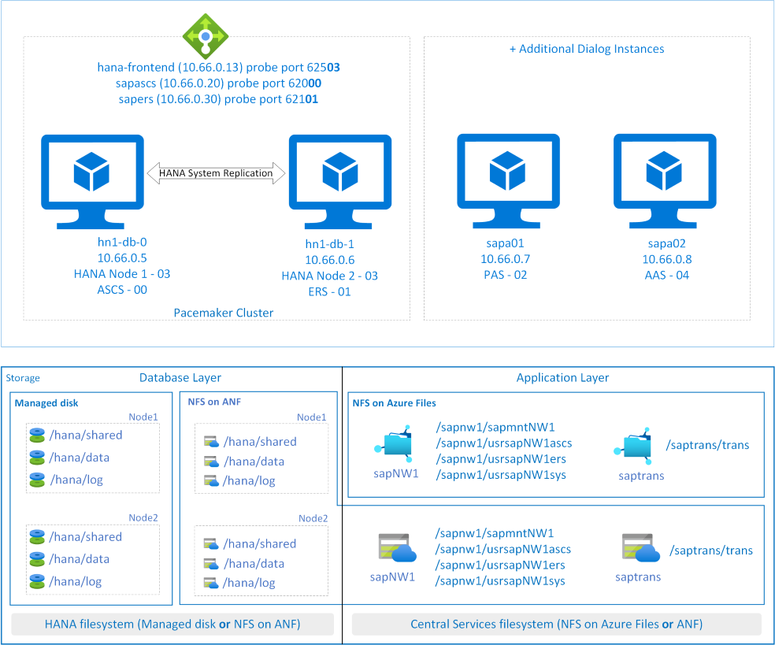

# Deploy SAP ASCS/ERS with SAP HANA high availability VMs on Red Hat Enterprise Linux

This article describes how to install and configure SAP HANA along with ASCS/SCS and ERS instances on the same high availability cluster, running on Red Hat Enterprise Linux (RHEL).

## References

* [Configuring SAP S/4HANA ASCS/ERS with Standalone Enqueue Server 2 (ENSA2) in Pacemaker](https://access.redhat.com/articles/3974941)
* [Configuring SAP NetWeaver ASCS/ERS ENSA1 with Standalone Resources in RHEL 7.5+ and RHEL 8](https://access.redhat.com/articles/3569681)
* SAP Note [1928533](https://launchpad.support.sap.com/#/notes/1928533), which has:
  * List of Azure VM sizes that are supported for the deployment of SAP software
  * Important capacity information for Azure VM sizes
  * Supported SAP software, and operating system (OS) and database combinations
  * Required SAP kernel version for Windows and Linux on Microsoft Azure
* SAP Note [2015553](https://launchpad.support.sap.com/#/notes/2015553) lists prerequisites for SAP-supported SAP software deployments in Azure.
* SAP Note [2002167](https://launchpad.support.sap.com/#/notes/2002167) has recommended OS settings for Red Hat Enterprise Linux 7.x
* SAP Note [2772999](https://launchpad.support.sap.com/#/notes/2772999) has recommended OS settings for Red Hat Enterprise Linux 8.x
* SAP Note [2009879](https://launchpad.support.sap.com/#/notes/2009879) has SAP HANA Guidelines for Red Hat Enterprise Linux
* SAP Note [2178632](https://launchpad.support.sap.com/#/notes/2178632) has detailed information about all monitoring metrics reported for SAP in Azure.
* SAP Note [2191498](https://launchpad.support.sap.com/#/notes/2191498) has the required SAP Host Agent version for Linux in Azure.
* SAP Note [2243692](https://launchpad.support.sap.com/#/notes/224362) has information about SAP licensing on Linux in Azure.
* SAP Note [1999351](https://launchpad.support.sap.com/#/notes/1999351) has additional troubleshooting information for the Azure Enhanced Monitoring Extension for SAP.
* [SAP Community Wiki](https://wiki.scn.sap.com/wiki/display/HOME/SAPonLinuxNotes) has all required SAP Notes for Linux.
* [Azure Virtual Machines planning and implementation for SAP on Linux](planning-guide.md)
* [Azure Virtual Machines deployment for SAP on Linux](deployment-guide.md)
* [Azure Virtual Machines DBMS deployment for SAP on Linux](dbms-guide-general.md)
* [SAP Netweaver in pacemaker cluster](https://access.redhat.com/articles/3150081)
* General RHEL documentation
  * [High Availability Add-On Overview](https://access.redhat.com/documentation/en-us/red_hat_enterprise_linux/7/html/high_availability_add-on_overview/index)
  * [High Availability Add-On Administration](https://access.redhat.com/documentation/en-us/red_hat_enterprise_linux/7/html/high_availability_add-on_administration/index)
  * [High Availability Add-On Reference](https://access.redhat.com/documentation/en-us/red_hat_enterprise_linux/7/html/high_availability_add-on_reference/index)
* Azure-specific RHEL documentation:
  * [Support Policies for RHEL High Availability Clusters - Microsoft Azure Virtual Machines as Cluster Members](https://access.redhat.com/articles/3131341)
  * [Installing and Configuring a Red Hat Enterprise Linux 7.4 (and later) High-Availability Cluster on Microsoft Azure](https://access.redhat.com/articles/3252491)

## Overview

This article describes the cost optimization scenario where you deploy SAP HANA, SAP ASCS/SCS and SAP ERS instances in the same high availability setup.  To minimize the number of VMs for a single SAP system, you want to install SAP ASCS/SCS and SAP ERS on the same hosts where SAP HANA is running. With SAP HANA being configured in high availability cluster setup, you want SAP ASCS/SCS and SAP ERS to be managed by cluster as well. The configuration is basically an addition to already configured SAP HANA cluster setup. In this setup SAP ASCS/SCS and SAP ERS will be installed on a virtual hostname and its instance directory is managed by the cluster.

The presented architecture showcases [NFS on Azure Files](../../storage/files/files-nfs-protocol.md) or [Azure NetApp Files](../../azure-netapp-files/azure-netapp-files-introduction.md) for highly available instance directory for the setup.

The example shown in this article to describe deployment uses following system information -

| Instance name                       | Instance number | Virtual hostname | Virtual IP (Probe Port) |
| ----------------------------------- | --------------- | ---------------- | ----------------------- |
| SAP HANA DB                         | 03              | saphana          | 10.66.0.13 (62503)      |
| ABAP SAP Central Services (ASCS)    | 00              | sapascs          | 10.66.0.20 (62000)      |
| Enqueue Replication Server (ERS)    | 01              | sapers           | 10.66.0.30 (62101)      |
| SAP HANA system identifier          | HN1             | ---              | ---                     |
| SAP system identifier               | NW1             | ---              | ---                     |

> [!NOTE]
>
> Install SAP Dialog instances (PAS and AAS) on separate VM's.

### Important consideration for the cost optimization solution

* SAP Dialog Instances (PAS and AAS) (like **sapa01** and **sapa02**), should be installed on separate VMs. Install SAP ASCS and ERS with virtual hostnames. To learn more on how to assign virtual hostname to a VM, refer to the blog [Use SAP Virtual Host Names with Linux in Azure](https://techcommunity.microsoft.com/t5/running-sap-applications-on-the/use-sap-virtual-host-names-with-linux-in-azure/ba-p/3251593).
* With HANA DB, ASCS/SCS and ERS deployment in the same cluster setup, the instance number of HANA DB, ASCS/SCS and ERS must be different.
* Consider sizing your VM SKUs appropriately based on the sizing guidelines. You have to factor in the cluster behavior where multiple SAP instances (HANA DB, ASCS/SCS and ERS) may run on a single VM, when other VM in the cluster is unavailable.
* You can use different storage (for example, Azure NetApp Files or NFS on Azure Files) to install the SAP ASCS and ERS instances.
  > [!NOTE]
  >
  > For SAP J2EE systems, it's not supported to place `/usr/sap/<SID>/J<nr>` on NFS on Azure Files.
  > Database filesystem like /hana/data and /hana/log are not supported on NFS on Azure Files.
* To install additional application servers on separate VMs, you can either use NFS shares or local managed disk for instance directory filesystem. If you're installing additional application servers for SAP J2EE system, `/usr/sap/<SID>/J<nr>` on NFS on Azure Files isn't supported.
* Refer [NFS on Azure Files consideration](high-availability-guide-rhel-nfs-azure-files.md#important-considerations-for-nfs-on-azure-files-shares) and [Azure NetApp Files consideration](high-availability-guide-rhel-netapp-files.md#important-considerations), as same consideration applies for this setup as well.

## Prerequisites

The configuration described in this article is an addition to your already configured SAP HANA cluster setup. In this configuration, SAP ASCS/SCS and ERS will be installed on a virtual hostname and its instance directory is managed by the cluster.

Install HANA database, set up HSR and Pacemaker cluster by following the documentation [High availability of SAP HANA on Azure VMs on Red Hat Enterprise Linux](sap-hana-high-availability-rhel.md) or [High availability of SAP HANA Scale-up with Azure NetApp Files on Red Hat Enterprise Linux](sap-hana-high-availability-netapp-files-red-hat.md) depending on what storage option you're using.

Once you've Installed, configured and set-up the **HANA Cluster**, follow the steps below to install ASCS and ERS instances.

## Configure Azure Load Balancer for ASCS and ERS

1. Open the internal load balancer that you've created for SAP HANA cluster setup.
2. Create the frontend IP address for ASCS and ERS instance
   1. IP address for ASCS is **10.66.0.20**
      1. In **Settings** > **Frontend IP configuration**, click on **Add**.
      2. Enter the name of the new frontend IP (for example, **ascs-frontend**).
      3. Select the **subnet**.
      4. Set the **assignment** to **Static** and enter the IP address (for example, **10.66.0.20**).
      5. Click Ok.
   2. IP address for ERS is **10.66.0.30**
      1. Repeat the steps under "2.a" to create a frontend IP address for ERS (for example **10.66.0.30** and **ers-frontend**)
3. Backend Pool remains same, as we're deploying ASCS and ERS on the same backend pool (**hana-backend**).
4. Create health probe for ASCS and ERS instance
   1. Port for ASCS is **62000**
      1. In **Settings** > **Health probes**, click on **Add**.
      2. Enter the name of the health probe (for example, **ascs-hp**).
      3. Select **TCP** as protocol, port **62000** and keep interval **5**.
      4. Click Ok.
   2. Port for ERS is **62101**
      1. Repeat the steps above under "4.a" to create health probe for ERS (for example **62101** and **ers-hp**)
5. Create load balancing rules for ASCS and ERS instance
   1. Load balancing rule for ASCS
      1. In **Settings** > **Load balancing rules**, click on **Add**.
      2. Enter the name of load balancing rule (for example, **ascs-lb**).
      3. Select the frontend IP address for ASCS, backend pool, and health probe you created earlier (for example **ascs-frontend**, **hana-backend**, and **ascs-hp**)
      4. Select **HA ports**
      5. Make sure to **enable Floating IP**
      6. Leave the rest as default and Click OK
   2. Load balancing rule for ERS
      1. Repeat the steps under “5.1” to create load balancing rule for ERS (for example, **ers-lb**).

> [!IMPORTANT]
>
> Floating IP is not supported on a NIC secondary IP configuration in load-balancing scenarios. For details see [Azure Load balancer Limitations](../../load-balancer/load-balancer-multivip-overview.md#limitations). If you need additional IP address for the VM, deploy a second NIC.

> [!NOTE]
>
> When VMs without public IP addresses are placed in the backend pool of internal (no public IP address) Standard Azure load balancer, there will be no outbound internet connectivity, unless additional configuration is performed to allow routing to public end points. For details on how to achieve outbound connectivity see [Public endpoint connectivity for Virtual Machines using Azure Standard Load Balancer in SAP high-availability scenarios](high-availability-guide-standard-load-balancer-outbound-connections.md).

> [!IMPORTANT]
>
> Do not enable TCP timestamps on Azure VMs placed behind Azure Load Balancer. Enabling TCP timestamps will cause the health probes to fail. Set parameter **net.ipv4.tcp_timestamps** to **0**. For details see [Load Balancer health probes](../../load-balancer/load-balancer-custom-probe-overview.md).

## SAP ASCS/SCS and ERS Setup

Based on your storage, follow the steps described in below guides to configure `SAPInstance` resource for SAP ASCS/SCS and SAP ERS instance in the cluster.

* NFS on Azure Files - [Azure VMs high availability for SAP NW on RHEL with NFS on Azure Files](high-availability-guide-rhel-nfs-azure-files.md#prepare-for-sap-netweaver-installation)
* Azure NetApp Files - [Azure VMs high availability for SAP NW on RHEL with Azure NetApp Files](high-availability-guide-rhel-netapp-files.md#prepare-for-the-sap-netweaver-installation)

## Test the cluster setup

Thoroughly test your pacemaker cluster.
* [Execute the typical Netweaver failover tests](high-availability-guide-rhel.md#test-the-cluster-setup).
* [Execute the typical HANA DB failover tests](sap-hana-high-availability-rhel.md#test-the-cluster-setup).
