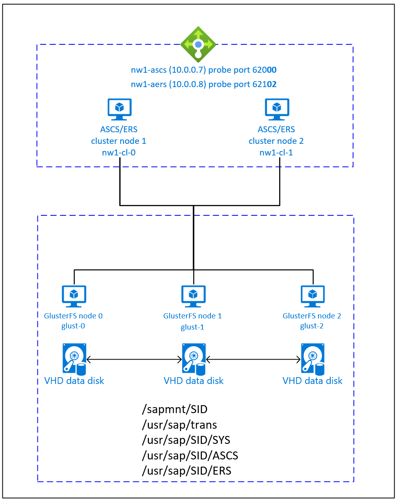

# Azure Virtual Machines high availability for SAP NetWeaver on Red Hat Enterprise Linux

[dbms-guide]:dbms-guide-general.md
[deployment-guide]:deployment-guide.md
[planning-guide]:planning-guide.md

[2002167]:https://launchpad.support.sap.com/#/notes/2002167
[2009879]:https://launchpad.support.sap.com/#/notes/2009879
[1928533]:https://launchpad.support.sap.com/#/notes/1928533
[2015553]:https://launchpad.support.sap.com/#/notes/2015553
[2178632]:https://launchpad.support.sap.com/#/notes/2178632
[2191498]:https://launchpad.support.sap.com/#/notes/2191498
[2243692]:https://launchpad.support.sap.com/#/notes/2243692
[1999351]:https://launchpad.support.sap.com/#/notes/1999351
[1410736]:https://launchpad.support.sap.com/#/notes/1410736

[template-multisid-xscs]:https://portal.azure.com/#create/Microsoft.Template/uri/https%3A%2F%2Fraw.githubusercontent.com%2FAzure%2Fazure-quickstart-templates%2Fmaster%2Fapplication-workloads%2Fsap%2Fsap-3-tier-marketplace-image-multi-sid-xscs-md%2Fazuredeploy.json

[sap-hana-ha]:sap-hana-high-availability-rhel.md
[glusterfs-ha]:high-availability-guide-rhel-glusterfs.md

This article describes how to deploy the virtual machines, configure the virtual machines, install the cluster framework, and install a highly available SAP NetWeaver 7.50 system.
In the example configurations, installation commands etc. ASCS instance number 00, ERS instance number 02, and SAP System ID NW1 is used. The names of the resources (for example virtual machines, virtual networks) in the example assume that you have used the [ASCS/SCS template][template-multisid-xscs] with Resource Prefix NW1 to create the resources.

Read the following SAP Notes and papers first

* SAP Note [1928533], which has:
  * List of Azure VM sizes that are supported for the deployment of SAP software
  * Important capacity information for Azure VM sizes
  * Supported SAP software, and operating system (OS) and database combinations
  * Required SAP kernel version for Windows and Linux on Microsoft Azure

* SAP Note [2015553] lists prerequisites for SAP-supported SAP software deployments in Azure.
* SAP Note [2002167] has recommended OS settings for Red Hat Enterprise Linux
* SAP Note [2009879] has SAP HANA Guidelines for Red Hat Enterprise Linux
* SAP Note [2178632] has detailed information about all monitoring metrics reported for SAP in Azure.
* SAP Note [2191498] has the required SAP Host Agent version for Linux in Azure.
* SAP Note [2243692] has information about SAP licensing on Linux in Azure.
* SAP Note [1999351] has additional troubleshooting information for the Azure Enhanced Monitoring Extension for SAP.
* [SAP Community WIKI](https://wiki.scn.sap.com/wiki/display/HOME/SAPonLinuxNotes) has all required SAP Notes for Linux.
* [Azure Virtual Machines planning and implementation for SAP on Linux][planning-guide]
* [Azure Virtual Machines deployment for SAP on Linux][deployment-guide]
* [Azure Virtual Machines DBMS deployment for SAP on Linux][dbms-guide]
* [Product Documentation for Red Hat Gluster Storage](https://access.redhat.com/documentation/en-us/red_hat_gluster_storage/3.5)
* [SAP Netweaver in pacemaker cluster](https://access.redhat.com/articles/3150081)
* General RHEL documentation
  * [High Availability Add-On Overview](https://access.redhat.com/documentation/en-us/red_hat_enterprise_linux/7/html/high_availability_add-on_overview/index)
  * [High Availability Add-On Administration](https://access.redhat.com/documentation/en-us/red_hat_enterprise_linux/7/html/high_availability_add-on_administration/index)
  * [High Availability Add-On Reference](https://access.redhat.com/documentation/en-us/red_hat_enterprise_linux/7/html/high_availability_add-on_reference/index)
  * [Configuring ASCS/ERS for SAP Netweaver with standalone resources in RHEL 7.5](https://access.redhat.com/articles/3569681)
  * [Configure SAP S/4HANA ASCS/ERS with Standalone Enqueue Server 2 (ENSA2) in Pacemaker on RHEL
  ](https://access.redhat.com/articles/3974941)
* Azure specific RHEL documentation:
  * [Support Policies for RHEL High Availability Clusters - Microsoft Azure Virtual Machines as Cluster Members](https://access.redhat.com/articles/3131341)
  * [Installing and Configuring a Red Hat Enterprise Linux 7.4 (and later) High-Availability Cluster on Microsoft Azure](https://access.redhat.com/articles/3252491)

## Overview

To achieve high availability, SAP NetWeaver requires shared storage. GlusterFS is configured in a separate cluster and can be used by multiple SAP systems.



SAP NetWeaver ASCS, SAP NetWeaver SCS, SAP NetWeaver ERS, and the SAP HANA database use virtual hostname and virtual IP addresses. On Azure, a load balancer is required to use a virtual IP address. We recommend using [Standard load balancer](../../load-balancer/quickstart-load-balancer-standard-public-portal.md). The presented configuration shows a load balancer with:

* Frontend IP address 10.0.0.7 for ASCS
* Frontend IP address 10.0.0.8 for ERS
* Probe port 62000 for ASCS
* Probe port 62101 for ERS

## Setting up GlusterFS

SAP NetWeaver requires shared storage for the transport and profile directory. Read [GlusterFS on Azure VMs on Red Hat Enterprise Linux for SAP NetWeaver][glusterfs-ha] on how to set up GlusterFS for SAP NetWeaver.

## Setting up (A)SCS

In this example, the resources were deployed manually via the [Azure portal](https://portal.azure.com/#home).

### Deploy Linux manually via Azure portal

This document assumes that you've already deployed a resource group, [Azure Virtual Network](../../virtual-network/virtual-networks-overview.md), and subnet.

Deploy virtual machines for SAP ASCS, ERS, and application server instances. Choose a suitable RHEL image that is supported with your SAP system. You can deploy VM in any one of the availability options - scale set, availability zone or availability set.

### Deploy Azure Load Balancer via Azure portal

After you deploy the VMs for your SAP system, create a load balancer. Use VMs created for SAP ASCS/ERS instances in the backend pool.

1. Create load balancer (internal, standard):
   1. Create the frontend IP addresses
      1. IP address 10.0.0.7 for the ASCS
         1. Open the load balancer, select frontend IP pool, and click Add
         2. Enter the name of the new frontend IP pool (for example **nw1-ascs-frontend**)
         3. Set the Assignment to Static and enter the IP address (for example **10.0.0.7**)
         4. Click OK
      2. IP address 10.0.0.8 for the ASCS ERS
         * Repeat the steps above to create an IP address for the ERS (for example **10.0.0.8** and **nw1-aers-frontend**)
   2. Create a single back-end pool:
      1. Open the load balancer, select **Backend pools**, and then select **Add**.
      2. Enter the name of the new back-end pool (for example, **nw1-backend**).
      3. Select **NIC** for Backend Pool Configuration.
      4. Select **Add a virtual machine**.
      5. Select the virtual machines of the ASCS cluster.
      6. Select **Add**.
      7. Select **Save**.  
   3. Create the health probes
      1. Port 620**00** for ASCS
         1. Open the load balancer, select health probes, and click Add
         2. Enter the name of the new health probe (for example **nw1-ascs-hp**)
         3. Select TCP as protocol, port 620**00**, keep Interval 5
         4. Click OK
      2. Port 621**02** for ASCS ERS
         * Repeat the steps above to create a health probe for the ERS (for example 621**02** and **nw1-aers-hp**)
   4. Load-balancing rules
      1. Load-balancing rules for ASCS
         1. Open the load balancer, select load-balancing rules and click Add
         2. Enter the name of the new load balancer rule (for example **nw1-lb-ascs**)
         3. Select the frontend IP address, backend pool, and health probe you created earlier (for example **nw1-ascs-frontend**, **nw1-backend** and **nw1-ascs-hp**)
         4. Increase idle timeout to 30 minutes
         5. Select **HA ports**
         6. **Make sure to enable Floating IP**
         7. Click OK
         * Repeat the steps above to create load balancing rules for ERS (for example **nw1-lb-ers**)

> [!IMPORTANT]
> Floating IP is not supported on a NIC secondary IP configuration in load-balancing scenarios. For details see [Azure Load balancer Limitations](../../load-balancer/load-balancer-multivip-overview.md#limitations). If you need additional IP address for the VM, deploy a second NIC.  

> [!NOTE]
> When VMs without public IP addresses are placed in the backend pool of internal (no public IP address) Standard Azure load balancer, there will be no outbound internet connectivity, unless additional configuration is performed to allow routing to public end points. For details on how to achieve outbound connectivity see [Public endpoint connectivity for Virtual Machines using Azure Standard Load Balancer in SAP high-availability scenarios](./high-availability-guide-standard-load-balancer-outbound-connections.md).  

> [!IMPORTANT]
> Do not enable TCP timestamps on Azure VMs placed behind Azure Load Balancer. Enabling TCP timestamps will cause the health probes to fail. Set parameter **net.ipv4.tcp_timestamps** to **0**. For details see [Load Balancer health probes](../../load-balancer/load-balancer-custom-probe-overview.md).

### Create Pacemaker cluster

Follow the steps in [Setting up Pacemaker on Red Hat Enterprise Linux in Azure](high-availability-guide-rhel-pacemaker.md) to create a basic Pacemaker cluster for this (A)SCS server.

### Prepare for SAP NetWeaver installation

The following items are prefixed with either **[A]** - applicable to all nodes, **[1]** - only applicable to node 1 or **[2]** - only applicable to node 2.

1. **[A]** Setup host name resolution

   You can either use a DNS server or modify the /etc/hosts on all nodes. This example shows how to use the /etc/hosts file.
   Replace the IP address and the hostname in the following commands

   ```bash
   sudo vi /etc/hosts
   ```

   Insert the following lines to /etc/hosts. Change the IP address and hostname to match your environment

   ```text
   # IP addresses of the GlusterFS nodes
   10.0.0.40 glust-0
   10.0.0.41 glust-1
   10.0.0.42 glust-2
   # IP address of the load balancer frontend configuration for SAP NetWeaver ASCS
   10.0.0.7 nw1-ascs
   # IP address of the load balancer frontend configuration for SAP NetWeaver ASCS ERS
   10.0.0.8 nw1-aers
   ```

1. **[A]** Create the shared directories

   ```bash
   sudo mkdir -p /sapmnt/NW1
   sudo mkdir -p /usr/sap/trans
   sudo mkdir -p /usr/sap/NW1/SYS
   sudo mkdir -p /usr/sap/NW1/ASCS00
   sudo mkdir -p /usr/sap/NW1/ERS02
   
   sudo chattr +i /sapmnt/NW1
   sudo chattr +i /usr/sap/trans
   sudo chattr +i /usr/sap/NW1/SYS
   sudo chattr +i /usr/sap/NW1/ASCS00
   sudo chattr +i /usr/sap/NW1/ERS02
   ```

1. **[A]** Install GlusterFS client and other requirements

   ```bash
   sudo yum -y install glusterfs-fuse resource-agents resource-agents-sap
   ```

1. **[A]** Check version of resource-agents-sap

   Make sure that the version of the installed resource-agents-sap package is at least 3.9.5-124.el7

   ```bash
   sudo yum info resource-agents-sap
   
   # Loaded plugins: langpacks, product-id, search-disabled-repos
   # Repodata is over 2 weeks old. Install yum-cron? Or run: yum makecache fast
   # Installed Packages
   # Name        : resource-agents-sap
   # Arch        : x86_64
   # Version     : 3.9.5
   # Release     : 124.el7
   # Size        : 100 k
   # Repo        : installed
   # From repo   : rhel-sap-for-rhel-7-server-rpms
   # Summary     : SAP cluster resource agents and connector script
   # URL         : https://github.com/ClusterLabs/resource-agents
   # License     : GPLv2+
   # Description : The SAP resource agents and connector script interface with
   #          : Pacemaker to allow SAP instances to be managed in a cluster
   #          : environment.
   ```

1. **[A]** Add mount entries

   ```bash
   sudo vi /etc/fstab
   
   # Add the following lines to fstab, save and exit
   glust-0:/NW1-sapmnt /sapmnt/NW1 glusterfs backup-volfile-servers=glust-1:glust-2 0 0
   glust-0:/NW1-trans /usr/sap/trans glusterfs backup-volfile-servers=glust-1:glust-2 0 0
   glust-0:/NW1-sys /usr/sap/NW1/SYS glusterfs backup-volfile-servers=glust-1:glust-2 0 0
   ```

   Mount the new shares

   ```bash
   sudo mount -a
   ```

1. **[A]** Configure SWAP file

   ```bash
   sudo vi /etc/waagent.conf
   
   # Set the property ResourceDisk.EnableSwap to y
   # Create and use swapfile on resource disk.
   ResourceDisk.EnableSwap=y
   
   # Set the size of the SWAP file with property ResourceDisk.SwapSizeMB
   # The free space of resource disk varies by virtual machine size. Make sure that you do not set a value that is too big. You can check the SWAP space with command swapon
   # Size of the swapfile.
   ResourceDisk.SwapSizeMB=2000
   ```

   Restart the Agent to activate the change

   ```bash
   sudo service waagent restart
   ```

1. **[A]** RHEL configuration

   Based on RHEL version, perform the configuration mentioned in SAP Note [2002167](https://launchpad.support.sap.com/#/notes/2002167), [2772999](https://launchpad.support.sap.com/#/notes/2772999), or [3108316](https://launchpad.support.sap.com/#/notes/2772999).

### Installing SAP NetWeaver ASCS/ERS

1. **[1]** Configure cluster default properties

   ```bash
   pcs resource defaults resource-stickiness=1
   pcs resource defaults migration-threshold=3
   ```

1. **[1]** Create a virtual IP resource and health-probe for the ASCS instance

   ```bash
   sudo pcs node standby nw1-cl-1
   
   sudo pcs resource create fs_NW1_ASCS Filesystem device='glust-0:/NW1-ascs' \
     directory='/usr/sap/NW1/ASCS00' fstype='glusterfs' \
     options='backup-volfile-servers=glust-1:glust-2' \
     --group g-NW1_ASCS
   
   sudo pcs resource create vip_NW1_ASCS IPaddr2 \
     ip=10.0.0.7 \
     --group g-NW1_ASCS
   
   sudo pcs resource create nc_NW1_ASCS azure-lb port=62000 \
     --group g-NW1_ASCS
   ```

   Make sure that the cluster status is ok and that all resources are started. It is not important on which node the resources are running.

   ```bash
   sudo pcs status
   
   # Node nw1-cl-1: standby
   # Online: [ nw1-cl-0 ]
   #
   # Full list of resources:
   #
   # rsc_st_azure    (stonith:fence_azure_arm):      Started nw1-cl-0
   #  Resource Group: g-NW1_ASCS
   #      fs_NW1_ASCS        (ocf::heartbeat:Filesystem):    Started nw1-cl-0
   #      nc_NW1_ASCS        (ocf::heartbeat:azure-lb):      Started nw1-cl-0
   #      vip_NW1_ASCS       (ocf::heartbeat:IPaddr2):       Started nw1-cl-0
   ```

1. **[1]** Install SAP NetWeaver ASCS  

   Install SAP NetWeaver ASCS as root on the first node using a virtual hostname that maps to the IP address of the load balancer frontend configuration for the ASCS, for example **nw1-ascs**, **10.0.0.7** and the instance number that you used for the probe of the load balancer, for example **00**.

   You can use the sapinst parameter SAPINST_REMOTE_ACCESS_USER to allow a non-root user to connect to sapinst.

   ```bash
   # Allow access to SWPM. This rule is not permanent. If you reboot the machine, you have to run the command again.
   sudo firewall-cmd --zone=public  --add-port=4237/tcp
   
   sudo <swpm>/sapinst SAPINST_REMOTE_ACCESS_USER=sapadmin
   ```

   If the installation fails to create a subfolder in /usr/sap/**NW1**/ASCS**00**, try setting the owner and group of the ASCS**00** folder and retry.

   ```bash
   sudo chown nw1adm /usr/sap/NW1/ASCS00
   sudo chgrp sapsys /usr/sap/NW1/ASCS00
   ```

1. **[1]** Create a virtual IP resource and health-probe for the ERS instance

   ```bash
   sudo pcs node unstandby nw1-cl-1
   sudo pcs node standby nw1-cl-0
   
   sudo pcs resource create fs_NW1_AERS Filesystem device='glust-0:/NW1-aers' \
     directory='/usr/sap/NW1/ERS02' fstype='glusterfs' \
     options='backup-volfile-servers=glust-1:glust-2' \
    --group g-NW1_AERS
   
   sudo pcs resource create vip_NW1_AERS IPaddr2 \
     ip=10.0.0.8 \
    --group g-NW1_AERS
   
   sudo pcs resource create nc_NW1_AERS azure-lb port=62102 \
    --group g-NW1_AERS
   ```

   Make sure that the cluster status is ok and that all resources are started. It is not important on which node the resources are running.

   ```bash
   sudo pcs status
   
   # Node nw1-cl-0: standby
   # Online: [ nw1-cl-1 ]
   #
   # Full list of resources:
   #
   # rsc_st_azure    (stonith:fence_azure_arm):      Started nw1-cl-1
   #  Resource Group: g-NW1_ASCS
   #      fs_NW1_ASCS        (ocf::heartbeat:Filesystem):    Started nw1-cl-1
   #      nc_NW1_ASCS        (ocf::heartbeat:azure-lb):      Started nw1-cl-1
   #      vip_NW1_ASCS       (ocf::heartbeat:IPaddr2):       Started nw1-cl-1
   #  Resource Group: g-NW1_AERS
   #      fs_NW1_AERS        (ocf::heartbeat:Filesystem):    Started nw1-cl-1
   #      nc_NW1_AERS        (ocf::heartbeat:azure-lb):      Started nw1-cl-1
   #      vip_NW1_AERS       (ocf::heartbeat:IPaddr2):       Started nw1-cl-1
   ```

1. **[2]** Install SAP NetWeaver ERS  

   Install SAP NetWeaver ERS as root on the second node using a virtual hostname that maps to the IP address of the load balancer frontend configuration for the ERS, for example **nw1-aers**, **10.0.0.8** and the instance number that you used for the probe of the load balancer, for example **02**.

   You can use the sapinst parameter SAPINST_REMOTE_ACCESS_USER to allow a non-root user to connect to sapinst.

   ```bash
   # Allow access to SWPM. This rule is not permanent. If you reboot the machine, you have to run the command again.
   sudo firewall-cmd --zone=public  --add-port=4237/tcp
   
   sudo <swpm>/sapinst SAPINST_REMOTE_ACCESS_USER=sapadmin
   ```

   If the installation fails to create a subfolder in /usr/sap/**NW1**/ERS**02**, try setting the owner and group of the ERS**02** folder and retry.

   ```bash
   sudo chown nw1adm /usr/sap/NW1/ERS02
   sudo chgrp sapsys /usr/sap/NW1/ERS02
   ```

1. **[1]** Adapt the ASCS/SCS and ERS instance profiles

   * ASCS/SCS profile

     ```bash
     sudo vi /sapmnt/NW1/profile/NW1_ASCS00_nw1-ascs
     
     # Change the restart command to a start command
     #Restart_Program_01 = local $(_EN) pf=$(_PF)
     Start_Program_01 = local $(_EN) pf=$(_PF)
     
     # Add the keep alive parameter, if using ENSA1
     enque/encni/set_so_keepalive = true
     ```

     For both ENSA1 and ENSA2, make sure that the `keepalive` OS parameters are set as described in SAP note [1410736](https://launchpad.support.sap.com/#/notes/1410736).

   * ERS profile

     ```bash
     sudo vi /sapmnt/NW1/profile/NW1_ERS02_nw1-aers
     
     # Change the restart command to a start command
     #Restart_Program_00 = local $(_ER) pf=$(_PFL) NR=$(SCSID)
     Start_Program_00 = local $(_ER) pf=$(_PFL) NR=$(SCSID)
     
     # remove Autostart from ERS profile
     # Autostart = 1
     ```

1. **[A]** Configure Keep Alive

   The communication between the SAP NetWeaver application server and the ASCS/SCS is routed through a software load balancer. The load balancer disconnects inactive connections after a configurable timeout. To prevent this, you need to set a parameter in the SAP NetWeaver ASCS/SCS profile, if using ENSA1, and change the Linux system `keepalive` settings on all SAP servers for both ENSA1/ENSA2. Read [SAP Note 1410736][1410736] for more information.

   ```bash
   # Change the Linux system configuration
   sudo sysctl net.ipv4.tcp_keepalive_time=300
   ```

1. **[A]** Update the /usr/sap/sapservices file

   To prevent the start of the instances by the sapinit startup script, all instances managed by Pacemaker must be commented out from /usr/sap/sapservices file.

   ```bash
   sudo vi /usr/sap/sapservices
   
   # On the node where you installed the ASCS, comment out the following line
   # LD_LIBRARY_PATH=/usr/sap/NW1/ASCS00/exe:$LD_LIBRARY_PATH; export LD_LIBRARY_PATH; /usr/sap/NW1/ASCS00/exe/sapstartsrv pf=/usr/sap/NW1/SYS/profile/NW1_ASCS00_nw1-ascs -D -u nw1adm
   
   # On the node where you installed the ERS, comment out the following line
   # LD_LIBRARY_PATH=/usr/sap/NW1/ERS02/exe:$LD_LIBRARY_PATH; export LD_LIBRARY_PATH; /usr/sap/NW1/ERS02/exe/sapstartsrv pf=/usr/sap/NW1/ERS02/profile/NW1_ERS02_nw1-aers -D -u nw1adm
   ```

1. **[1]** Create the SAP cluster resources.

   If using enqueue server 1 architecture (ENSA1), define the resources as follows:

   ```bash
   sudo pcs property set maintenance-mode=true
   
   sudo pcs resource create rsc_sap_NW1_ASCS00 SAPInstance \
    InstanceName=NW1_ASCS00_nw1-ascs START_PROFILE="/sapmnt/NW1/profile/NW1_ASCS00_nw1-ascs" \
    AUTOMATIC_RECOVER=false \
    meta resource-stickiness=5000 migration-threshold=1 failure-timeout=60 \
    op monitor interval=20 on-fail=restart timeout=60 \
    op start interval=0 timeout=600 op stop interval=0 timeout=600 \
    --group g-NW1_ASCS
   
   sudo pcs resource meta g-NW1_ASCS resource-stickiness=3000
   
   sudo pcs resource create rsc_sap_NW1_ERS02 SAPInstance \
    InstanceName=NW1_ERS02_nw1-aers START_PROFILE="/sapmnt/NW1/profile/NW1_ERS02_nw1-aers" \
    AUTOMATIC_RECOVER=false IS_ERS=true \
    op monitor interval=20 on-fail=restart timeout=60 op start interval=0 timeout=600 op stop interval=0 timeout=600 \
    --group g-NW1_AERS
   
   sudo pcs constraint colocation add g-NW1_AERS with g-NW1_ASCS -5000
   sudo pcs constraint location rsc_sap_NW1_ASCS00 rule score=2000 runs_ers_NW1 eq 1
   sudo pcs constraint order start g-NW1_ASCS then stop g-NW1_AERS kind=Optional symmetrical=false
   
   sudo pcs node unstandby nw1-cl-0
   sudo pcs property set maintenance-mode=false
   ```

   SAP introduced support for enqueue server 2, including replication, as of SAP NW 7.52. Starting with ABAP Platform 1809, enqueue server 2 is installed by default. See SAP note [2630416](https://launchpad.support.sap.com/#/notes/2630416) for enqueue server 2 support. If using enqueue server 2 architecture ([ENSA2](https://help.sap.com/viewer/cff8531bc1d9416d91bb6781e628d4e0/1709%20001/en-US/6d655c383abf4c129b0e5c8683e7ecd8.html)), install resource agent resource-agents-sap-4.1.1-12.el7.x86_64 or newer and define the resources as follows:

   ```bash
   sudo pcs property set maintenance-mode=true
   
   sudo pcs resource create rsc_sap_NW1_ASCS00 SAPInstance \
    InstanceName=NW1_ASCS00_nw1-ascs START_PROFILE="/sapmnt/NW1/profile/NW1_ASCS00_nw1-ascs" \
    AUTOMATIC_RECOVER=false \
    meta resource-stickiness=5000 \
    op monitor interval=20 on-fail=restart timeout=60 \
    op start interval=0 timeout=600 op stop interval=0 timeout=600 \
    --group g-NW1_ASCS
   
   sudo pcs resource meta g-NW1_ASCS resource-stickiness=3000
   
   sudo pcs resource create rsc_sap_NW1_ERS02 SAPInstance \
    InstanceName=NW1_ERS02_nw1-aers START_PROFILE="/sapmnt/NW1/profile/NW1_ERS02_nw1-aers" \
    AUTOMATIC_RECOVER=false IS_ERS=true \
    op monitor interval=20 on-fail=restart timeout=60 op start interval=0 timeout=600 op stop interval=0 timeout=600 \
    --group g-NW1_AERS
   
   sudo pcs resource meta rsc_sap_NW1_ERS02 resource-stickiness=3000
   
   sudo pcs constraint colocation add g-NW1_AERS with g-NW1_ASCS -5000
   sudo pcs constraint order start g-NW1_ASCS then start g-NW1_AERS kind=Optional symmetrical=false
   sudo pcs constraint order start g-NW1_ASCS then stop g-NW1_AERS kind=Optional symmetrical=false
   
   sudo pcs node unstandby nw1-cl-0
   sudo pcs property set maintenance-mode=false
   ```

   If you are upgrading from an older version and switching to enqueue server 2, see SAP note [2641322](https://launchpad.support.sap.com/#/notes/2641322).

   >  [!NOTE]
   > The timeouts in the above configuration are just examples and may need to be adapted to the specific SAP setup.

   Make sure that the cluster status is ok and that all resources are started. It is not important on which node the resources are running.

   ```bash
   sudo pcs status
   
   # Online: [ nw1-cl-0 nw1-cl-1 ]
   #
   # Full list of resources:
   #
   # rsc_st_azure    (stonith:fence_azure_arm):      Started nw1-cl-0
   #  Resource Group: g-NW1_ASCS
   #      fs_NW1_ASCS        (ocf::heartbeat:Filesystem):    Started nw1-cl-1
   #      nc_NW1_ASCS        (ocf::heartbeat:azure-lb):      Started nw1-cl-1
   #      vip_NW1_ASCS       (ocf::heartbeat:IPaddr2):       Started nw1-cl-1
   #      rsc_sap_NW1_ASCS00 (ocf::heartbeat:SAPInstance):   Started nw1-cl-1
   #  Resource Group: g-NW1_AERS
   #      fs_NW1_AERS        (ocf::heartbeat:Filesystem):    Started nw1-cl-0
   #      nc_NW1_AERS        (ocf::heartbeat:azure-lb):      Started nw1-cl-0
   #      vip_NW1_AERS       (ocf::heartbeat:IPaddr2):       Started nw1-cl-0
   #      rsc_sap_NW1_ERS02  (ocf::heartbeat:SAPInstance):   Started nw1-cl-0
   ```

1. **[A]** Add firewall rules for ASCS and ERS on both nodes

    ```bash
    # Probe Port of ASCS
    sudo firewall-cmd --zone=public --add-port=62000/tcp --permanent
    sudo firewall-cmd --zone=public --add-port=62000/tcp
    sudo firewall-cmd --zone=public --add-port=3200/tcp --permanent
    sudo firewall-cmd --zone=public --add-port=3200/tcp
    sudo firewall-cmd --zone=public --add-port=3600/tcp --permanent
    sudo firewall-cmd --zone=public --add-port=3600/tcp
    sudo firewall-cmd --zone=public --add-port=3900/tcp --permanent
    sudo firewall-cmd --zone=public --add-port=3900/tcp
    sudo firewall-cmd --zone=public --add-port=8100/tcp --permanent
    sudo firewall-cmd --zone=public --add-port=8100/tcp
    sudo firewall-cmd --zone=public --add-port=50013/tcp --permanent
    sudo firewall-cmd --zone=public --add-port=50013/tcp
    sudo firewall-cmd --zone=public --add-port=50014/tcp --permanent
    sudo firewall-cmd --zone=public --add-port=50014/tcp
    sudo firewall-cmd --zone=public --add-port=50016/tcp --permanent
    sudo firewall-cmd --zone=public --add-port=50016/tcp
    
    # Probe Port of ERS
    sudo firewall-cmd --zone=public --add-port=62102/tcp --permanent
    sudo firewall-cmd --zone=public --add-port=62102/tcp
    sudo firewall-cmd --zone=public --add-port=3202/tcp --permanent
    sudo firewall-cmd --zone=public --add-port=3202/tcp
    sudo firewall-cmd --zone=public --add-port=3302/tcp --permanent
    sudo firewall-cmd --zone=public --add-port=3302/tcp
    sudo firewall-cmd --zone=public --add-port=50213/tcp --permanent
    sudo firewall-cmd --zone=public --add-port=50213/tcp
    sudo firewall-cmd --zone=public --add-port=50214/tcp --permanent
    sudo firewall-cmd --zone=public --add-port=50214/tcp
    sudo firewall-cmd --zone=public --add-port=50216/tcp --permanent
    sudo firewall-cmd --zone=public --add-port=50216/tcp
    ```

## SAP NetWeaver application server preparation

Some databases require that the database instance installation is executed on an application server. Prepare the application server virtual machines to be able to use them in these cases.

The steps bellow assume that you install the application server on a server different from the ASCS/SCS and HANA servers. Otherwise some of the steps below (like configuring host name resolution) are not needed.

1. Setup host name resolution

   You can either use a DNS server or modify the /etc/hosts on all nodes. This example shows how to use the /etc/hosts file.
   Replace the IP address and the hostname in the following commands

   ```bash
   sudo vi /etc/hosts
   ```

   Insert the following lines to /etc/hosts. Change the IP address and hostname to match your environment

   ```bash
   # IP addresses of the GlusterFS nodes
   10.0.0.40 glust-0
   10.0.0.41 glust-1
   10.0.0.42 glust-2
   # IP address of the load balancer frontend configuration for SAP NetWeaver ASCS
   10.0.0.7 nw1-ascs
   # IP address of the load balancer frontend configuration for SAP NetWeaver ASCS ERS
   10.0.0.8 nw1-aers
   # IP address of the load balancer frontend configuration for database
   10.0.0.13 nw1-db
   ```

1. Create the sapmnt directory

   ```bash
   sudo mkdir -p /sapmnt/NW1
   sudo mkdir -p /usr/sap/trans
   
   sudo chattr +i /sapmnt/NW1
   sudo chattr +i /usr/sap/trans
   ```

1. Install GlusterFS client and other requirements

   ```bash
   sudo yum -y install glusterfs-fuse uuidd
   ```

1. Add mount entries

   ```bash
   sudo vi /etc/fstab
   
   # Add the following lines to fstab, save and exit
   glust-0:/NW1-sapmnt /sapmnt/NW1 glusterfs backup-volfile-servers=glust-1:glust-2 0 0
   glust-0:/NW1-trans /usr/sap/trans glusterfs backup-volfile-servers=glust-1:glust-2 0 0
   ```

   Mount the new shares

   ```bash
   sudo mount -a
   ```

1. Configure SWAP file

   ```bash
   sudo vi /etc/waagent.conf
   
   # Set the property ResourceDisk.EnableSwap to y
   # Create and use swapfile on resource disk.
   ResourceDisk.EnableSwap=y
   
   # Set the size of the SWAP file with property ResourceDisk.SwapSizeMB
   # The free space of resource disk varies by virtual machine size. Make sure that you do not set a value that is too big. You can check the SWAP space with command swapon
   # Size of the swapfile.
   ResourceDisk.SwapSizeMB=2000
   ```

   Restart the Agent to activate the change

   ```bash
   sudo service waagent restart
   ```

## Install database

In this example, SAP NetWeaver is installed on SAP HANA. You can use every supported database for this installation. For more information on how to install SAP HANA in Azure, see [High availability of SAP HANA on Azure VMs on Red Hat Enterprise Linux][sap-hana-ha]. For a list of supported databases, see [SAP Note 1928533][1928533].

1. Run the SAP database instance installation

   Install the SAP NetWeaver database instance as root using a virtual hostname that maps to the IP address of the load balancer frontend configuration for the database for example **nw1-db** and **10.0.0.13**.

   You can use the sapinst parameter SAPINST_REMOTE_ACCESS_USER to allow a non-root user to connect to sapinst.

   ```bash
   sudo <swpm>/sapinst SAPINST_REMOTE_ACCESS_USER=sapadmin
   ```

## SAP NetWeaver application server installation

Follow these steps to install an SAP application server.

1. Prepare application server

   Follow the steps in the chapter [SAP NetWeaver application server preparation](#sap-netweaver-application-server-preparation) above to prepare the application server.

1. Install SAP NetWeaver application server

   Install a primary or additional SAP NetWeaver applications server.

   You can use the sapinst parameter SAPINST_REMOTE_ACCESS_USER to allow a non-root user to connect to sapinst.

   ```bash
   sudo <swpm>/sapinst SAPINST_REMOTE_ACCESS_USER=sapadmin
   ```

1. Update SAP HANA secure store

   Update the SAP HANA secure store to point to the virtual name of the SAP HANA System Replication setup.

   Run the following command to list the entries as \<sapsid>adm

   ```bash
   hdbuserstore List
   ```

   This should list all entries and should look similar to

   ```text
   DATA FILE       : /home/nw1adm/.hdb/nw1-di-0/SSFS_HDB.DAT
   KEY FILE        : /home/nw1adm/.hdb/nw1-di-0/SSFS_HDB.KEY
   
   KEY DEFAULT
     ENV : 10.0.0.14:30313
     USER: SAPABAP1
     DATABASE: NW1
   ```

   The output shows that the IP address of the default entry is pointing to the virtual machine and not to the load balancer's IP address. This entry needs to be changed to point to the virtual hostname of the load balancer. Make sure to use the same port (**30313** in the output above) and database name (**HN1** in the output above)!

   ```bash
   su - nw1adm
   hdbuserstore SET DEFAULT nw1-db:30313@NW1 SAPABAP1 <password of ABAP schema>
   ```

## Test the cluster setup

1. Manually migrate the ASCS instance

   Resource state before starting the test:

   ```text
   rsc_st_azure    (stonith:fence_azure_arm):      Started nw1-cl-0
    Resource Group: g-NW1_ASCS
        fs_NW1_ASCS        (ocf::heartbeat:Filesystem):    Started nw1-cl-0
        nc_NW1_ASCS        (ocf::heartbeat:azure-lb):      Started nw1-cl-0
        vip_NW1_ASCS       (ocf::heartbeat:IPaddr2):       Started nw1-cl-0
        rsc_sap_NW1_ASCS00 (ocf::heartbeat:SAPInstance):   Started nw1-cl-0
    Resource Group: g-NW1_AERS
        fs_NW1_AERS        (ocf::heartbeat:Filesystem):    Started nw1-cl-1
        nc_NW1_AERS        (ocf::heartbeat:azure-lb):      Started nw1-cl-1
        vip_NW1_AERS       (ocf::heartbeat:IPaddr2):       Started nw1-cl-1
        rsc_sap_NW1_ERS02  (ocf::heartbeat:SAPInstance):   Started nw1-cl-1
   ```

   Run the following commands as root to migrate the ASCS instance.

   ```bash
   [root@nw1-cl-0 ~]# pcs resource move rsc_sap_NW1_ASCS00
   
   [root@nw1-cl-0 ~]# pcs resource clear rsc_sap_NW1_ASCS00
   
   # Remove failed actions for the ERS that occurred as part of the migration
   [root@nw1-cl-0 ~]# pcs resource cleanup rsc_sap_NW1_ERS02
   ```

   Resource state after the test:

   ```text
   rsc_st_azure    (stonith:fence_azure_arm):      Started nw1-cl-0
    Resource Group: g-NW1_ASCS
        fs_NW1_ASCS        (ocf::heartbeat:Filesystem):    Started nw1-cl-1
        nc_NW1_ASCS        (ocf::heartbeat:azure-lb):      Started nw1-cl-1
        vip_NW1_ASCS       (ocf::heartbeat:IPaddr2):       Started nw1-cl-1
        rsc_sap_NW1_ASCS00 (ocf::heartbeat:SAPInstance):   Started nw1-cl-1
    Resource Group: g-NW1_AERS
        fs_NW1_AERS        (ocf::heartbeat:Filesystem):    Started nw1-cl-0
        nc_NW1_AERS        (ocf::heartbeat:azure-lb):      Started nw1-cl-0
        vip_NW1_AERS       (ocf::heartbeat:IPaddr2):       Started nw1-cl-0
        rsc_sap_NW1_ERS02  (ocf::heartbeat:SAPInstance):   Started nw1-cl-0
   ```

2. Simulate node crash

   Resource state before starting the test:

   ```text
   rsc_st_azure    (stonith:fence_azure_arm):      Started nw1-cl-0
    Resource Group: g-NW1_ASCS
        fs_NW1_ASCS        (ocf::heartbeat:Filesystem):    Started nw1-cl-1
        nc_NW1_ASCS        (ocf::heartbeat:azure-lb):      Started nw1-cl-1
        vip_NW1_ASCS       (ocf::heartbeat:IPaddr2):       Started nw1-cl-1
        rsc_sap_NW1_ASCS00 (ocf::heartbeat:SAPInstance):   Started nw1-cl-1
    Resource Group: g-NW1_AERS
        fs_NW1_AERS        (ocf::heartbeat:Filesystem):    Started nw1-cl-0
        nc_NW1_AERS        (ocf::heartbeat:azure-lb):      Started nw1-cl-0
        vip_NW1_AERS       (ocf::heartbeat:IPaddr2):       Started nw1-cl-0
        rsc_sap_NW1_ERS02  (ocf::heartbeat:SAPInstance):   Started nw1-cl-0
   ```

   Run the following command as root on the node where the ASCS instance is running

   ```bash
   [root@nw1-cl-1 ~]# echo b > /proc/sysrq-trigger
   ```

   The status after the node is started again should look like this.

   ```text
   Online: [ nw1-cl-0 nw1-cl-1 ]
   
   Full list of resources:
   
   rsc_st_azure    (stonith:fence_azure_arm):      Started nw1-cl-0
    Resource Group: g-NW1_ASCS
        fs_NW1_ASCS        (ocf::heartbeat:Filesystem):    Started nw1-cl-0
        nc_NW1_ASCS        (ocf::heartbeat:azure-lb):      Started nw1-cl-0
        vip_NW1_ASCS       (ocf::heartbeat:IPaddr2):       Started nw1-cl-0
        rsc_sap_NW1_ASCS00 (ocf::heartbeat:SAPInstance):   Started nw1-cl-0
    Resource Group: g-NW1_AERS
        fs_NW1_AERS        (ocf::heartbeat:Filesystem):    Started nw1-cl-1
        nc_NW1_AERS        (ocf::heartbeat:azure-lb):      Started nw1-cl-1
        vip_NW1_AERS       (ocf::heartbeat:IPaddr2):       Started nw1-cl-1
        rsc_sap_NW1_ERS02  (ocf::heartbeat:SAPInstance):   Started nw1-cl-1
   
   Failed Actions:
   * rsc_sap_NW1_ERS02_monitor_11000 on nw1-cl-0 'not running' (7): call=45, status=complete, exitreason='',
       last-rc-change='Tue Aug 21 13:52:39 2018', queued=0ms, exec=0ms
   ```

   Use the following command to clean the failed resources.

   ```bash
   [root@nw1-cl-0 ~]# pcs resource cleanup rsc_sap_NW1_ERS02
   ```

   Resource state after the test:

   ```text
   rsc_st_azure    (stonith:fence_azure_arm):      Started nw1-cl-0
    Resource Group: g-NW1_ASCS
        fs_NW1_ASCS        (ocf::heartbeat:Filesystem):    Started nw1-cl-0
        nc_NW1_ASCS        (ocf::heartbeat:azure-lb):      Started nw1-cl-0
        vip_NW1_ASCS       (ocf::heartbeat:IPaddr2):       Started nw1-cl-0
        rsc_sap_NW1_ASCS00 (ocf::heartbeat:SAPInstance):   Started nw1-cl-0
    Resource Group: g-NW1_AERS
        fs_NW1_AERS        (ocf::heartbeat:Filesystem):    Started nw1-cl-1
        nc_NW1_AERS        (ocf::heartbeat:azure-lb):      Started nw1-cl-1
        vip_NW1_AERS       (ocf::heartbeat:IPaddr2):       Started nw1-cl-1
        rsc_sap_NW1_ERS02  (ocf::heartbeat:SAPInstance):   Started nw1-cl-1
   ```

3. Blocking network communication

   Resource state before starting the test:

   ```text
   rsc_st_azure    (stonith:fence_azure_arm):      Started nw1-cl-0
    Resource Group: g-NW1_ASCS
        fs_NW1_ASCS        (ocf::heartbeat:Filesystem):    Started nw1-cl-0
        nc_NW1_ASCS        (ocf::heartbeat:azure-lb):      Started nw1-cl-0
        vip_NW1_ASCS       (ocf::heartbeat:IPaddr2):       Started nw1-cl-0
        rsc_sap_NW1_ASCS00 (ocf::heartbeat:SAPInstance):   Started nw1-cl-0
    Resource Group: g-NW1_AERS
        fs_NW1_AERS        (ocf::heartbeat:Filesystem):    Started nw1-cl-1
        nc_NW1_AERS        (ocf::heartbeat:azure-lb):      Started nw1-cl-1
        vip_NW1_AERS       (ocf::heartbeat:IPaddr2):       Started nw1-cl-1
        rsc_sap_NW1_ERS02  (ocf::heartbeat:SAPInstance):   Started nw1-cl-1
   ```

   Execute firewall rule to block the communication on one of the nodes.

   ```bash
    # Execute iptable rule on nw1-cl-0 (10.0.0.7) to block the incoming and outgoing traffic to nw1-cl-1 (10.0.0.8)
    iptables -A INPUT -s 10.0.0.8 -j DROP; iptables -A OUTPUT -d 10.0.0.8 -j DROP
   ```

   When cluster nodes can't communicate to each other, there's a risk of a split-brain scenario. In such situations, cluster nodes will try to simultaneously fence each other, resulting in fence race. To avoid such situation, it's recommended to set [priority-fencing-delay](https://access.redhat.com/solutions/5110521) property in cluster configuration (applicable only for  [pacemaker-2.0.4-6.el8](https://access.redhat.com/errata/RHEA-2020:4804) or higher).

   By enabling priority-fencing-delay property, the cluster introduces an additional delay in the fencing action specifically on the node hosting ASCS resource, allowing the node to win the fence race.

   Execute below command to delete the firewall rule.

   ```bash
    # If the iptables rule set on the server gets reset after a reboot, the rules will be cleared out. In case they have not been reset, please proceed to remove the iptables rule using the following command.
    iptables -D INPUT -s 10.0.0.8 -j DROP; iptables -D OUTPUT -d 10.0.0.8 -j DROP
   ```

4. Kill message server process

   Resource state before starting the test:

   ```text
   rsc_st_azure    (stonith:fence_azure_arm):      Started nw1-cl-0
    Resource Group: g-NW1_ASCS
        fs_NW1_ASCS        (ocf::heartbeat:Filesystem):    Started nw1-cl-0
        nc_NW1_ASCS        (ocf::heartbeat:azure-lb):      Started nw1-cl-0
        vip_NW1_ASCS       (ocf::heartbeat:IPaddr2):       Started nw1-cl-0
        rsc_sap_NW1_ASCS00 (ocf::heartbeat:SAPInstance):   Started nw1-cl-0
    Resource Group: g-NW1_AERS
        fs_NW1_AERS        (ocf::heartbeat:Filesystem):    Started nw1-cl-1
        nc_NW1_AERS        (ocf::heartbeat:azure-lb):      Started nw1-cl-1
        vip_NW1_AERS       (ocf::heartbeat:IPaddr2):       Started nw1-cl-1
        rsc_sap_NW1_ERS02  (ocf::heartbeat:SAPInstance):   Started nw1-cl-1
   ```

   Run the following commands as root to identify the process of the message server and kill it.

   ```bash
   [root@nw1-cl-0 ~]# pgrep -f ms.sapNW1 | xargs kill -9
   ```

   If you only kill the message server once, it will be restarted by `sapstart`. If you kill it often enough, Pacemaker will eventually move the ASCS instance to the other node. Run the following commands as root to clean up the resource state of the ASCS and ERS instance after the test.

   ```bash
   [root@nw1-cl-0 ~]# pcs resource cleanup rsc_sap_NW1_ASCS00
   [root@nw1-cl-0 ~]# pcs resource cleanup rsc_sap_NW1_ERS02
   ```

   Resource state after the test:

   ```bash
   rsc_st_azure    (stonith:fence_azure_arm):      Started nw1-cl-0
    Resource Group: g-NW1_ASCS
        fs_NW1_ASCS        (ocf::heartbeat:Filesystem):    Started nw1-cl-1
        nc_NW1_ASCS        (ocf::heartbeat:azure-lb):      Started nw1-cl-1
        vip_NW1_ASCS       (ocf::heartbeat:IPaddr2):       Started nw1-cl-1
        rsc_sap_NW1_ASCS00 (ocf::heartbeat:SAPInstance):   Started nw1-cl-1
    Resource Group: g-NW1_AERS
        fs_NW1_AERS        (ocf::heartbeat:Filesystem):    Started nw1-cl-0
        nc_NW1_AERS        (ocf::heartbeat:azure-lb):      Started nw1-cl-0
        vip_NW1_AERS       (ocf::heartbeat:IPaddr2):       Started nw1-cl-0
        rsc_sap_NW1_ERS02  (ocf::heartbeat:SAPInstance):   Started nw1-cl-0
   ```

5. Kill enqueue server process

   Resource state before starting the test:

   ```text
   rsc_st_azure    (stonith:fence_azure_arm):      Started nw1-cl-0
    Resource Group: g-NW1_ASCS
        fs_NW1_ASCS        (ocf::heartbeat:Filesystem):    Started nw1-cl-1
        nc_NW1_ASCS        (ocf::heartbeat:azure-lb):      Started nw1-cl-1
        vip_NW1_ASCS       (ocf::heartbeat:IPaddr2):       Started nw1-cl-1
        rsc_sap_NW1_ASCS00 (ocf::heartbeat:SAPInstance):   Started nw1-cl-1
    Resource Group: g-NW1_AERS
        fs_NW1_AERS        (ocf::heartbeat:Filesystem):    Started nw1-cl-0
        nc_NW1_AERS        (ocf::heartbeat:azure-lb):      Started nw1-cl-0
        vip_NW1_AERS       (ocf::heartbeat:IPaddr2):       Started nw1-cl-0
        rsc_sap_NW1_ERS02  (ocf::heartbeat:SAPInstance):   Started nw1-cl-0
   ```

   Run the following commands as root on the node where the ASCS instance is running to kill the enqueue server.

   ```bash
   #If using ENSA1 
   [root@nw1-cl-1 ~]# pgrep -f en.sapNW1 | xargs kill -9
   
   #If using ENSA2
   [root@nw1-cl-1 ~]# pgrep -f enq.sapNW1 | xargs kill -9
   ```

   The ASCS instance should immediately fail over to the other node, in the case of ENSA1. The ERS instance should also fail over after the ASCS instance is started. Run the following commands as root to clean up the resource state of the ASCS and ERS instance after the test.

   ```bash
   [root@nw1-cl-0 ~]# pcs resource cleanup rsc_sap_NW1_ASCS00
   [root@nw1-cl-0 ~]# pcs resource cleanup rsc_sap_NW1_ERS02
   ```

   Resource state after the test:

   ```text
   rsc_st_azure    (stonith:fence_azure_arm):      Started nw1-cl-0
    Resource Group: g-NW1_ASCS
        fs_NW1_ASCS        (ocf::heartbeat:Filesystem):    Started nw1-cl-0
        nc_NW1_ASCS        (ocf::heartbeat:azure-lb):      Started nw1-cl-0
        vip_NW1_ASCS       (ocf::heartbeat:IPaddr2):       Started nw1-cl-0
        rsc_sap_NW1_ASCS00 (ocf::heartbeat:SAPInstance):   Started nw1-cl-0
    Resource Group: g-NW1_AERS
        fs_NW1_AERS        (ocf::heartbeat:Filesystem):    Started nw1-cl-1
        nc_NW1_AERS        (ocf::heartbeat:azure-lb):      Started nw1-cl-1
        vip_NW1_AERS       (ocf::heartbeat:IPaddr2):       Started nw1-cl-1
        rsc_sap_NW1_ERS02  (ocf::heartbeat:SAPInstance):   Started nw1-cl-1
   ```

6. Kill enqueue replication server process

   Resource state before starting the test:

   ```text
   rsc_st_azure    (stonith:fence_azure_arm):      Started nw1-cl-0
    Resource Group: g-NW1_ASCS
        fs_NW1_ASCS        (ocf::heartbeat:Filesystem):    Started nw1-cl-0
        nc_NW1_ASCS        (ocf::heartbeat:azure-lb):      Started nw1-cl-0
        vip_NW1_ASCS       (ocf::heartbeat:IPaddr2):       Started nw1-cl-0
        rsc_sap_NW1_ASCS00 (ocf::heartbeat:SAPInstance):   Started nw1-cl-0
    Resource Group: g-NW1_AERS
        fs_NW1_AERS        (ocf::heartbeat:Filesystem):    Started nw1-cl-1
        nc_NW1_AERS        (ocf::heartbeat:azure-lb):      Started nw1-cl-1
        vip_NW1_AERS       (ocf::heartbeat:IPaddr2):       Started nw1-cl-1
        rsc_sap_NW1_ERS02  (ocf::heartbeat:SAPInstance):   Started nw1-cl-1
   ```

   Run the following command as root on the node where the ERS instance is running to kill the enqueue replication server process.

   ```bash
   #If using ENSA1
   [root@nw1-cl-1 ~]# pgrep -f er.sapNW1 | xargs kill -9
   
   #If using ENSA2
   [root@nw1-cl-1 ~]# pgrep -f enqr.sapNW1 | xargs kill -9
   ```

   If you only run the command once, `sapstart` will restart the process. If you run it often enough, `sapstart` will not restart the process and the resource will be in a stopped state. Run the following commands as root to clean up the resource state of the ERS instance after the test.

   ```bash
   [root@nw1-cl-0 ~]# pcs resource cleanup rsc_sap_NW1_ERS02
   ```

   Resource state after the test:

   ```text
   rsc_st_azure    (stonith:fence_azure_arm):      Started nw1-cl-0
    Resource Group: g-NW1_ASCS
        fs_NW1_ASCS        (ocf::heartbeat:Filesystem):    Started nw1-cl-0
        nc_NW1_ASCS        (ocf::heartbeat:azure-lb):      Started nw1-cl-0
        vip_NW1_ASCS       (ocf::heartbeat:IPaddr2):       Started nw1-cl-0
        rsc_sap_NW1_ASCS00 (ocf::heartbeat:SAPInstance):   Started nw1-cl-0
    Resource Group: g-NW1_AERS
        fs_NW1_AERS        (ocf::heartbeat:Filesystem):    Started nw1-cl-1
        nc_NW1_AERS        (ocf::heartbeat:azure-lb):      Started nw1-cl-1
        vip_NW1_AERS       (ocf::heartbeat:IPaddr2):       Started nw1-cl-1
        rsc_sap_NW1_ERS02  (ocf::heartbeat:SAPInstance):   Started nw1-cl-1
   ```

7. Kill enqueue sapstartsrv process

   Resource state before starting the test:

   ```text
   rsc_st_azure    (stonith:fence_azure_arm):      Started nw1-cl-0
    Resource Group: g-NW1_ASCS
        fs_NW1_ASCS        (ocf::heartbeat:Filesystem):    Started nw1-cl-0
        nc_NW1_ASCS        (ocf::heartbeat:azure-lb):      Started nw1-cl-0
        vip_NW1_ASCS       (ocf::heartbeat:IPaddr2):       Started nw1-cl-0
        rsc_sap_NW1_ASCS00 (ocf::heartbeat:SAPInstance):   Started nw1-cl-0
    Resource Group: g-NW1_AERS
        fs_NW1_AERS        (ocf::heartbeat:Filesystem):    Started nw1-cl-1
        nc_NW1_AERS        (ocf::heartbeat:azure-lb):      Started nw1-cl-1
        vip_NW1_AERS       (ocf::heartbeat:IPaddr2):       Started nw1-cl-1
        rsc_sap_NW1_ERS02  (ocf::heartbeat:SAPInstance):   Started nw1-cl-1
   ```

   Run the following commands as root on the node where the ASCS is running.

   ```bash
   [root@nw1-cl-0 ~]# pgrep -fl ASCS00.*sapstartsrv
   # 59545 sapstartsrv
   
   [root@nw1-cl-0 ~]# kill -9 59545
   ```

   The sapstartsrv process should always be restarted by the Pacemaker resource agent as part of the monitoring. Resource state after the test:

   ```text
   rsc_st_azure    (stonith:fence_azure_arm):      Started nw1-cl-0
    Resource Group: g-NW1_ASCS
        fs_NW1_ASCS        (ocf::heartbeat:Filesystem):    Started nw1-cl-0
        nc_NW1_ASCS        (ocf::heartbeat:azure-lb):      Started nw1-cl-0
        vip_NW1_ASCS       (ocf::heartbeat:IPaddr2):       Started nw1-cl-0
        rsc_sap_NW1_ASCS00 (ocf::heartbeat:SAPInstance):   Started nw1-cl-0
    Resource Group: g-NW1_AERS
        fs_NW1_AERS        (ocf::heartbeat:Filesystem):    Started nw1-cl-1
        nc_NW1_AERS        (ocf::heartbeat:azure-lb):      Started nw1-cl-1
        vip_NW1_AERS       (ocf::heartbeat:IPaddr2):       Started nw1-cl-1
        rsc_sap_NW1_ERS02  (ocf::heartbeat:SAPInstance):   Started nw1-cl-1
   ```

## Next steps

* To deploy cost optimization scenario where PAS and AAS instance is deployed with SAP NetWeaver HA cluster on RHEL, see [Install SAP Dialog Instance with SAP ASCS/SCS high availability VMs on RHEL](high-availability-guide-rhel-with-dialog-instance.md)
* [HA for SAP NW on Azure VMs on RHEL for SAP applications multi-SID guide](./high-availability-guide-rhel-multi-sid.md)
* [Azure Virtual Machines planning and implementation for SAP][planning-guide]
* [Azure Virtual Machines deployment for SAP][deployment-guide]
* [Azure Virtual Machines DBMS deployment for SAP][dbms-guide]
* To learn how to establish high availability and plan for disaster recovery of SAP HANA on Azure (large instances), see [SAP HANA (large instances) high availability and disaster recovery on Azure](../../virtual-machines/workloads/sap/hana-overview-high-availability-disaster-recovery.md).
* To learn how to establish high availability and plan for disaster recovery of SAP HANA on Azure VMs, see [High Availability of SAP HANA on Azure Virtual Machines (VMs)][sap-hana-ha]
