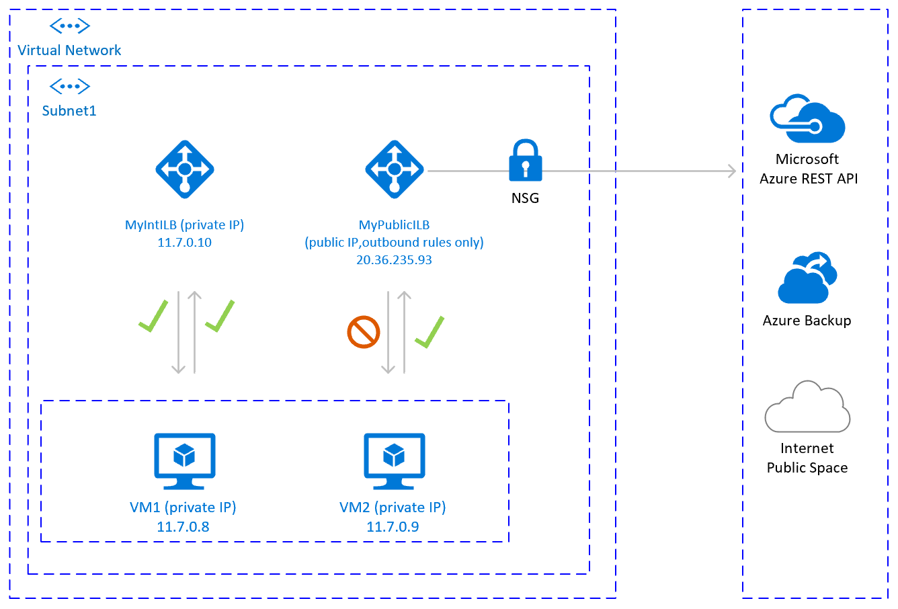
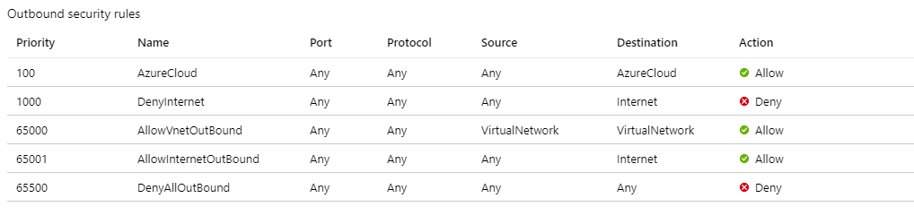
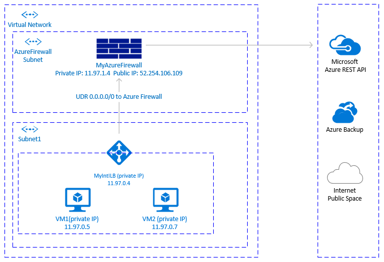
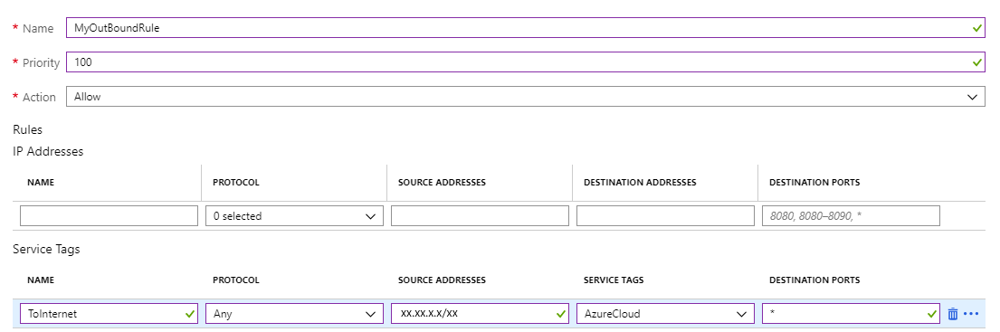

# Public endpoint connectivity for Virtual Machines using Azure Standard Load Balancer in SAP high-availability scenarios

The scope of this article is to describe configurations that enable outbound connectivity to public end points. The configurations are mainly in the context of high availability with Pacemaker for SUSE / RHEL.

If you're using Pacemaker with Azure fence agent in your high availability solution, then the virtual machines (VMs) must have outbound connectivity to the Azure management API. The article presents several options to enable you to select the option that's best suited for your scenario.

## Overview

When you implement high availability for SAP solutions via clustering, one of the necessary components is [Azure Load Balancer](../../load-balancer/load-balancer-overview.md). Azure offers two load balancer SKUs: Standard and Basic.

Standard Azure load balancer offers some advantages over the Basic load balancer. For instance, Standard works across Azure Availability zones, has better monitoring and logging capabilities for easier troubleshooting, and reduced latency. The "high availability ports" feature covers all ports, making it no longer necessary to list all individual ports.

There are some important differences between the Basic and the Standard SKU of Azure load balancer. One of them is the handling of outbound traffic to public end point. For full Basic versus Standard SKU load balancer comparison, see [Load Balancer SKU comparison](../../load-balancer/load-balancer-overview.md).

When VMs without public IP addresses are placed in the backend pool of internal (no public IP address) Standard Azure load balancer, there's no outbound connectivity to public end points, unless extra configuration is performed.

A VM can establish outbound connectivity to public endpoints if a public IP address is assigned. The same applies when the VM is included in the backend pool of a load balancer with a public IP.

SAP systems often contain sensitive business data. It's rarely acceptable for VMs hosting SAP systems to be accessible via public IP addresses. At the same time, there are scenarios, which would require outbound connectivity from the VM to public end points.

Examples of scenarios, requiring access to Azure public end point are:

- Azure Fence Agent requires access to **management.azure.com** and **login.microsoftonline.com**
- [Azure Backup](../../backup/backup-azure-sap-hana-database.md#establish-network-connectivity)
- [Azure Site Recovery](../../site-recovery/azure-to-azure-about-networking.md#outbound-connectivity-for-urls)
- Using public repository for patching the operating system
- The SAP application data flow may require outbound connectivity to public end point

If your SAP deployment doesn’t require outbound connectivity to public end points, you don’t need to implement extra configuration. It's sufficient to create internal standard SKU Azure Load Balancer for your high availability scenario, assuming that there's also no need for inbound connectivity from public end points.

> [!NOTE]
> When VMs without public IP addresses are added to the back-end pool of an internal Standard Azure Load Balancer, they lack outbound internet connectivity. Further configuration is needed to enable routing to public endpoints.
> VMs that have public IP addresses, or that are included in an Azure Load Balancer backend pool with a public IP, already have outbound access to public endpoints.

## Prerequisites

**Azure Standard Load Balancer**:

* [Azure Standard Load Balancer overview](../../load-balancer/load-balancer-overview.md) - Comprehensive overview of Azure Standard Load balancer, important principles, concepts, and tutorials.
* [Outbound connections in Azure](../../load-balancer/load-balancer-outbound-connections.md#scenarios) - Scenarios on how to achieve outbound connectivity in Azure.
* [Load balancer outbound rules](../../load-balancer/load-balancer-outbound-connections.md#outboundrules)- Explains the concepts of load balancer outbound rules and how to create outbound rules.

**Azure Firewall**:

* [Azure Firewall Overview](../../firewall/overview.md)- overview of Azure Firewall.
* [Tutorial: Deploy and configure Azure Firewall](../../firewall/tutorial-firewall-deploy-portal.md) - instructions on how to configure Azure Firewall via Azure portal.
* [Virtual Networks - User defined rules](../../virtual-network/virtual-networks-udr-overview.md#user-defined) - Azure routing concepts and rules.
* [Security Groups Service Tags](../../virtual-network/network-security-groups-overview.md#service-tags) - how to simplify your Network Security Groups (NSG) and Firewall configuration with service tags.

## Achieve outbound connectivity to public end points

# [Option 1](#tab/option-1)

Create another external Azure Standard Load Balancer for outbound connections to internet.

To achieve outbound connectivity to public end points, without allowing inbound connectivity to the VM from a public end point, is to create a second load balancer with a public IP address. Then you add the VMs to the backend pool of the second load balancer where only [outbound rules](../../load-balancer/load-balancer-outbound-connections.md#outboundrules) are defined. Use [Network Security Groups](../../virtual-network/network-security-groups-overview.md) to control the public end points that are accessible for outbound calls from the VM. For more information, see Scenario 2 in [Outbound connections](../../load-balancer/load-balancer-outbound-connections.md#scenarios).

The configuration would look like:



### Important considerations

- You can use one extra Public Load Balancer for multiple VMs in the same subnet to achieve outbound connectivity to public end point and optimize cost.
- Use [Network Security Groups](../../virtual-network/network-security-groups-overview.md) to control which public end points are accessible from the VMs. You can assign the Network Security Group either to the subnet, or to each VM. Where possible, use [Service tags](../../virtual-network/network-security-groups-overview.md#service-tags) to reduce the complexity of the security rules.
- Azure standard Load balancer with public IP address and outbound rules allows direct access to public end point. If you have corporate security requirements to have all outbound traffic pass via centralized corporate solution for auditing and logging, you may not be able to fulfill the requirement with this scenario.

> [!TIP]
> Where possible, use [Service tags](../../virtual-network/network-security-groups-overview.md#service-tags) to reduce the complexity of NSG.

### Deployment steps

Create the Load Balancer.

1. In the [Azure portal](https://portal.azure.com), select **All resources**, **Add**, then search for **Load Balancer**.
1. Select **Create**.
1. Load Balancer Name: **MyPublicILB**.
1. Select **Public** as a type, **Standard** as SKU.
1. Select **Create Public IP address** and specify as a name **MyPublicILBFrondEndIP**.
1. Select **Zone Redundant** as Availability zone.
1. Select **Review and Create**, then select **Create**.
1. Create the Backend pool **MyBackendPoolOfPublicILB** and add the VMs.
   1. Select the Virtual network.
   1. Select the VMs and their IP addresses and add them to the backend pool.
1. Create [outbound rules](../../load-balancer/egress-only.md#create-a-public-load-balancer-outbound-rule).

   ```azurecli
   az network lb outbound-rule create --address-pool MyBackendPoolOfPublicILB --frontend-ip-configs MyPublicILBFrondEndIP --idle-timeout 30 --lb-name MyPublicILB --name MyOutBoundRules  --outbound-ports 10000 --enable-tcp-reset true --protocol All --resource-group MyResourceGroup
   ```

1. Create Network Security group rules to restrict access to specific Public End Points. If there's existing Network Security Group, you can adjust it. The following steps show how to enable access to the Azure management API:

   1. Navigate to the NSG.
   1. Select **Outbound Security Rules**.
   1. Add a rule to **Deny** all outbound Access to **Internet**.
   1. Add a rule to **Allow** access to **AzureCloud**, with priority lower than the priority of the rule to deny all internet access.

   The outbound security rules would look like:

   

   For more information on Azure NSG, see [Security Groups](../../virtual-network/network-security-groups-overview.md).

# [Option 2](#tab/option-2)

Another option to achieve outbound connectivity to public end points, without allowing inbound connectivity to the VM from public end points, is with Azure Firewall. Azure Firewall is a managed service, with built-in High Availability and it can span multiple Availability Zones.

You also need to deploy a [User Defined Route](../../virtual-network/virtual-networks-udr-overview.md#custom-routes) associated with subnet where VMs and the Azure load balancer are deployed, pointing to the Azure firewall to route traffic through the Azure Firewall. For details on how to deploy Azure Firewall, see [Deploy And Configure Azure Firewall](../../firewall/tutorial-firewall-deploy-portal.md).

The architecture would look like:



### Important considerations

- Azure firewall is cloud native service, with built-in High Availability and it supports zonal deployment.
- Requires an extra subnet that must be named AzureFirewallSubnet.
- Outbound transfer of large data sets from the virtual network hosting SAP VMs to another virtual network or public endpoint may result in higher costs and may not be cost-effective. One such example is copying large backups across virtual networks. For details see Azure Firewall pricing.
- When the corporate firewall isn't an Azure Firewall and outbound traffic is required to pass through a centralized corporate security solution, this option might not be practical.

> [!TIP]
> Where possible, use [Service tags](../../virtual-network/network-security-groups-overview.md#service-tags) to reduce the complexity of the Azure Firewall rules.

### Deployment steps

The deployment steps assume that you already have your virtual network and subnet defined for your VMs.

1. Create the subnet **AzureFirewallSubnet** in the same virtual network, where the VMs and the Standard Load Balancer are deployed.
1. In Azure portal, navigate or search for **Virtual Network**, then select **All Resources**.
1. Search for the virtual network, select **Virtual Network**, then select **Subnets**.
1. Select **Add Subnet**. Enter **AzureFirewallSubnet** for the name. Enter an appropriate IP address range.
1. Save your information.

Create an Azure Firewall.

1. In Azure portal, select **All resources**. Then select **Add**, **Firewall**, **Create**. Select **Resource group** (select the same resource group where the Virtual Network is).
1. Enter name for the Azure Firewall resource. For instance, **MyAzureFirewall**.
1. Select **Region**, select at least two Availability zones aligned with the Availability zones where your VMs are deployed.
1. Select your virtual network, where the SAP VMs and Azure Standard Load balancer are deployed.
1. Public IP Address: Select **Create** and enter a name. For instance, **MyFirewallPublicIP**.

Create Azure Firewall Rule to allow outbound connectivity to specified public end points. The example shows how to allow access to the Azure Management API public endpoint.

1. Select **Rules**, **Network Rule Collection**, then select **Add network rule collection**.
1. Name: **MyOutboundRule**, enter **Priority**, then select action: **Allow**.
1. Service Name: **ToAzureAPI**.
   1. Protocol: Select **Any**.
   1. Source Address: Enter the range for your subnet where the VMs and Standard Load Balancer are deployed. For instance, **11.97.0.0/24**.
   1. Destination ports: Enter **\***.
1. Save your information.
1. As you're still positioned on the Azure Firewall, select **Overview**. Write down the Private IP Address of the Azure Firewall.

Create an Azure Firewall route.

1. In Azure portal, select **All resources**, select **Add**, **Route Table**, **Create**.
1. For ***Name**, enter **MyRouteTable**, select **Subscription**, **Resource group**, and **Location** (matching the location of your virtual network and Firewall).
1. Save your information.

   The firewall rule would look like:

   

Create User Defined Route from the subnet of your VMs to the private IP of **MyAzureFirewall**.

1. As you're positioned on the Route Table, select **Routes**, then select **Add**.
1. Route name: **ToMyAzureFirewall**
1. Address prefix: **0.0.0.0/0**.
1. Next hop type: Select **Virtual Appliance**.
1. Next hop address: Enter the private IP address of the firewall you configured: **11.97.1.4**.
1. Save your information.

# [Option 3](#tab/option-3)

You could use proxy to allow Pacemaker calls to the Azure management API public end point.

### Important considerations

- If there's already corporate proxy in place, you could route outbound calls to public end points through it. Outbound calls to public end points go through the corporate control point.
- Make sure the proxy configuration allows outbound connectivity to Azure management API: `https://management.azure.com` and `https://login.microsoftonline.com`.
- Make sure there's a route from the VMs to the Proxy.
- Proxy handles only HTTP/HTTPS calls. If there's a need to make outbound calls to public end point over different protocols (like RFC), an alternative solution is needed.
- The Proxy solution must be highly available, to avoid instability in the Pacemaker cluster.
- Depending on the location of the proxy, it may introduce extra latency in the calls from the Azure Fence Agent to the Azure Management API. If your corporate proxy is still on the premises, while your Pacemaker cluster is in Azure, measure latency and consider, if this solution is suitable for you.
- If there isn’t already highly available corporate proxy in place, we don't recommend this option as the customer would be incurring extra cost and complexity. If you decide to deploy extra proxy solution, to allow outbound connectivity from Pacemaker to Azure Management public API, you need to make sure the proxy is highly available. The latency from the VMs to the proxy is low.

### Pacemaker configuration with Proxy

There are many different Proxy options available in the industry. Step-by-step instructions for the proxy deployment are outside of the scope of this document. In the following example, we assume that your proxy is responding to **MyProxyService** and listening to port **MyProxyPort**.

To allow pacemaker to communicate with the Azure management API, perform the following steps on all cluster nodes:

1. Edit the pacemaker configuration file `/etc/sysconfig/pacemaker` and add the following lines (all cluster nodes):

   ```
   sudo vi /etc/sysconfig/pacemaker
   # Add the following lines
   http_proxy=http://MyProxyService:MyProxyPort
   https_proxy=http://MyProxyService:MyProxyPort
   ```

1. Restart the pacemaker service on **all** cluster nodes.

   **SUSE**:

   ```
   # Place the cluster in maintenance mode
   sudo crm configure property maintenance-mode=true

   #Restart on all nodes
   sudo systemctl restart pacemaker

   # Take the cluster out of maintenance mode
   sudo crm configure property maintenance-mode=false
   ```

   **Red Hat**:

   ```
   # Place the cluster in maintenance mode
   sudo pcs property set maintenance-mode=true

   #Restart on all nodes
   sudo systemctl restart pacemaker

   # Take the cluster out of maintenance mode
   sudo pcs property set maintenance-mode=false
   ```

---

## Other options

If outbound traffic is routed via third party, URL-based firewall proxy:

- If using Azure fence agent, make sure the firewall configuration allows outbound connectivity to the Azure management API `https://management.azure.com` and `https://login.microsoftonline.com`.

- If using SUSE's Azure public cloud update infrastructure for applying updates and patches, see [Azure Public Cloud Update Infrastructure 101](https://suse.com/c/azure-public-cloud-update-infrastructure-101/).

## Next steps

* [Learn how to configure Pacemaker on SUSE in Azure](./high-availability-guide-suse-pacemaker.md)

* [Learn how to configure Pacemaker on Red Hat in Azure](./high-availability-guide-rhel-pacemaker.md)
