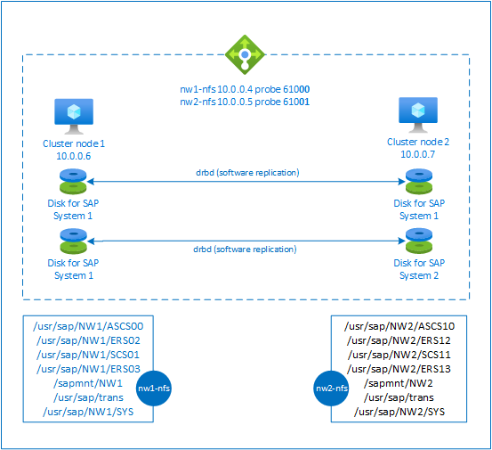

# High availability for NFS on Azure VMs on SUSE Linux Enterprise Server

[dbms-guide]:dbms-guide-general.md
[deployment-guide]:deployment-guide.md
[planning-guide]:planning-guide.md

[2205917]:https://launchpad.support.sap.com/#/notes/2205917
[1944799]:https://launchpad.support.sap.com/#/notes/1944799
[1928533]:https://launchpad.support.sap.com/#/notes/1928533
[2015553]:https://launchpad.support.sap.com/#/notes/2015553
[2178632]:https://launchpad.support.sap.com/#/notes/2178632
[2191498]:https://launchpad.support.sap.com/#/notes/2191498
[2243692]:https://launchpad.support.sap.com/#/notes/2243692
[1984787]:https://launchpad.support.sap.com/#/notes/1984787
[1999351]:https://launchpad.support.sap.com/#/notes/1999351

[sles-hae-guides]:https://www.suse.com/documentation/sle-ha-12/
[sles-for-sap-bp]:https://www.suse.com/documentation/sles-for-sap-12/
[suse-ha-12sp3-relnotes]:https://www.suse.com/releasenotes/x86_64/SLE-HA/12-SP3/

[template-file-server]:https://portal.azure.com/#create/Microsoft.Template/uri/https%3A%2F%2Fraw.githubusercontent.com%2FAzure%2Fazure-quickstart-templates%2Fmaster%2Fapplication-workloads%2Fsap%2Fsap-file-server-md%2Fazuredeploy.json

[sap-hana-ha]:sap-hana-high-availability.md

> [!NOTE]
> We recommend deploying one of the Azure first-party NFS services: [NFS on Azure Files](../../storage/files/storage-files-quick-create-use-linux.md) or [NFS ANF volumes](../../azure-netapp-files/azure-netapp-files-create-volumes.md) for storing shared data in a highly available SAP system. Be aware, that we are de-emphasizing SAP reference architectures, utilizing NFS clusters.  

This article describes how to deploy the virtual machines, configure the virtual machines, install the cluster framework, and install a highly available NFS server that can be used to store the shared data of a highly available SAP system.
This guide describes how to set up a highly available NFS server that is used by two SAP systems, NW1 and NW2. The names of the resources (for example virtual machines, virtual networks) in the example assume that you have used the [SAP file server template][template-file-server] with resource prefix **prod**.

> [!NOTE]
> This article contains references to terms that Microsoft no longer uses. When the terms are removed from the software, we'll remove them from this article.

Read the following SAP Notes and papers first

* SAP Note [1928533], which has:
  * List of Azure VM sizes that are supported for the deployment of SAP software
  * Important capacity information for Azure VM sizes
  * Supported SAP software, and operating system (OS) and database combinations
  * Required SAP kernel version for Windows and Linux on Microsoft Azure

* SAP Note [2015553] lists prerequisites for SAP-supported SAP software deployments in Azure.
* SAP Note [2205917] has recommended OS settings for SUSE Linux Enterprise Server for SAP Applications
* SAP Note [1944799] has SAP HANA Guidelines for SUSE Linux Enterprise Server for SAP Applications
* SAP Note [2178632] has detailed information about all monitoring metrics reported for SAP in Azure.
* SAP Note [2191498] has the required SAP Host Agent version for Linux in Azure.
* SAP Note [2243692] has information about SAP licensing on Linux in Azure.
* SAP Note [1984787] has general information about SUSE Linux Enterprise Server 12.
* SAP Note [1999351] has additional troubleshooting information for the Azure Enhanced Monitoring Extension for SAP.
* [SAP Community WIKI](https://wiki.scn.sap.com/wiki/display/HOME/SAPonLinuxNotes) has all required SAP Notes for Linux.
* [Azure Virtual Machines planning and implementation for SAP on Linux][planning-guide]
* [Azure Virtual Machines deployment for SAP on Linux (this article)][deployment-guide]
* [Azure Virtual Machines DBMS deployment for SAP on Linux][dbms-guide]
* [SUSE Linux Enterprise High Availability Extension 12 SP3 best practices guides][sles-hae-guides]
  * Highly Available NFS Storage with DRBD and Pacemaker
* [SUSE Linux Enterprise Server for SAP Applications 12 SP3 best practices guides][sles-for-sap-bp]
* [SUSE High Availability Extension 12 SP3 Release Notes][suse-ha-12sp3-relnotes]

## Overview

To achieve high availability, SAP NetWeaver requires an NFS server. The NFS server is configured in a separate cluster and can be used by multiple SAP systems.



The NFS server uses a dedicated virtual hostname and virtual IP addresses for every SAP system that uses this NFS server. On Azure, a load balancer is required to use a virtual IP address. The presented configuration shows a load balancer with:

* Frontend IP address 10.0.0.4 for NW1
* Frontend IP address 10.0.0.5 for NW2
* Probe port 61000 for NW1
* Probe port 61001 for NW2

## Set up a highly available NFS server

### Deploy Linux manually via Azure portal

This document assumes that you've already deployed a resource group, [Azure Virtual Network](../../virtual-network/virtual-networks-overview.md), and subnet.

Deploy two virtual machines for NFS servers. Choose a suitable SLES image that is supported with your SAP system. You can deploy VM in any one of the availability options - scale set, availability zone or availability set.

### Deploy Azure Load Balancer manually via Azure portal

After you deploy the VMs for your SAP system, create a load balancer. Use VMs created for NFS servers in the backend pool.

1. Create a Load Balancer (internal). We recommend [standard load balancer](../../load-balancer/load-balancer-overview.md).  
   1. Follow these instructions to create standard Load balancer:
      1. Create the frontend IP addresses
         1. IP address 10.0.0.4 for NW1
            1. Open the load balancer, select frontend IP pool, and click Add
            2. Enter the name of the new frontend IP pool (for example **nw1-frontend**)
            3. Set the Assignment to Static and enter the IP address (for example **10.0.0.4**)
            4. Click OK
         2. IP address 10.0.0.5 for NW2
            * Repeat the steps above for NW2
      2. Create a single back-end pool:
         1. Open the load balancer, select **Backend pools**, and then select **Add**.
         2. Enter the name of the new back-end pool (for example, **nw-backend**).
         3. Select **NIC** for Backend Pool Configuration.
         4. Select **Add a virtual machine**.
         5. Select the virtual machines of the cluster.
         6. Select **Add**.
         7. Select **Save**.
      3. Create the health probes
         1. Port 61000 for NW1
            1. Open the load balancer, select health probes, and click Add
            2. Enter the name of the new health probe (for example **nw1-hp**)
            3. Select TCP as protocol, port 610**00**, keep Interval 5  
            4. Click OK
         2. Port 61001 for NW2
            * Repeat the steps above to create a health probe for NW2
      4. Load balancing rules
         1. Open the load balancer, select load-balancing rules and click Add
         2. Enter the name of the new load balancer rule (for example **nw1-lb**)
         3. Select the frontend IP address, backend pool, and health probe you created earlier (for example **nw1-frontend**. **nw-backend** and **nw1-hp**)
         4. Increase idle timeout to 30 minutes
         5. Select **HA Ports**.
         6. **Make sure to enable Floating IP**
         7. Click OK
         * Repeat the steps above to create load balancing rule for NW2

> [!IMPORTANT]
> Floating IP is not supported on a NIC secondary IP configuration in load-balancing scenarios. For details see [Azure Load balancer Limitations](../../load-balancer/load-balancer-multivip-overview.md#limitations). If you need additional IP address for the VM, deploy a second NIC.  

> [!NOTE]
> When VMs without public IP addresses are placed in the backend pool of internal (no public IP address) Standard Azure load balancer, there will be no outbound internet connectivity, unless additional configuration is performed to allow routing to public end points. For details on how to achieve outbound connectivity see [Public endpoint connectivity for Virtual Machines using Azure Standard Load Balancer in SAP high-availability scenarios](./high-availability-guide-standard-load-balancer-outbound-connections.md).  

> [!IMPORTANT]
> Do not enable TCP timestamps on Azure VMs placed behind Azure Load Balancer. Enabling TCP timestamps will cause the health probes to fail. Set parameter **net.ipv4.tcp_timestamps** to **0**. For details see [Load Balancer health probes](../../load-balancer/load-balancer-custom-probe-overview.md).

### Create Pacemaker cluster

Follow the steps in [Setting up Pacemaker on SUSE Linux Enterprise Server in Azure](high-availability-guide-suse-pacemaker.md) to create a basic Pacemaker cluster for this NFS server.

### Configure NFS server

The following items are prefixed with either **[A]** - applicable to all nodes, **[1]** - only applicable to node 1 or **[2]** - only applicable to node 2.

1. **[A]** Setup host name resolution

   You can either use a DNS server or modify the /etc/hosts on all nodes. This example shows how to use the /etc/hosts file.
   Replace the IP address and the hostname in the following commands

   ```bash
   sudo vi /etc/hosts
   ```

   Insert the following lines to /etc/hosts. Change the IP address and hostname to match your environment

   ```bash
   # IP address of the load balancer frontend configuration for NFS
   
   10.0.0.4 nw1-nfs
   10.0.0.5 nw2-nfs
   ```

1. **[A]** Enable NFS server

   Create the root NFS export entry

   ```bash
   sudo sh -c 'echo /srv/nfs/ *\(rw,no_root_squash,fsid=0\)>/etc/exports'
   
   sudo mkdir /srv/nfs/
   ```

1. **[A]** Install drbd components

   ```bash
   sudo zypper install drbd drbd-kmp-default drbd-utils
   ```

1. **[A]** Create a partition for the drbd devices

   List all available data disks

   ```bash
   sudo ls /dev/disk/azure/scsi1/
   
   # Example output
   # lun0  lun1
   ```

   Create partitions for every data disk

   ```bash
   sudo sh -c 'echo -e "n\n\n\n\n\nw\n" | fdisk /dev/disk/azure/scsi1/lun0'
   sudo sh -c 'echo -e "n\n\n\n\n\nw\n" | fdisk /dev/disk/azure/scsi1/lun1'
   ```

1. **[A]** Create LVM configurations

   List all available partitions

   ```bash
   ls /dev/disk/azure/scsi1/lun*-part*
   
   # Example output
   # /dev/disk/azure/scsi1/lun0-part1  /dev/disk/azure/scsi1/lun1-part1
   ```

   Create LVM volumes for every partition

   ```bash
   sudo pvcreate /dev/disk/azure/scsi1/lun0-part1
   sudo vgcreate vg-NW1-NFS /dev/disk/azure/scsi1/lun0-part1
   sudo lvcreate -l 100%FREE -n NW1 vg-NW1-NFS
   
   sudo pvcreate /dev/disk/azure/scsi1/lun1-part1
   sudo vgcreate vg-NW2-NFS /dev/disk/azure/scsi1/lun1-part1
   sudo lvcreate -l 100%FREE -n NW2 vg-NW2-NFS
   ```

1. **[A]** Configure drbd

   ```bash
   sudo vi /etc/drbd.conf
   ```

   Make sure that the drbd.conf file contains the following two lines

   ```text
   include "drbd.d/global_common.conf";
   include "drbd.d/*.res";
   ```

   Change the global drbd configuration

   ```bash
   sudo vi /etc/drbd.d/global_common.conf
   ```

   Add the following entries to the handler and net section.

   ```text
   global {
        usage-count no;
   }
   common {
        handlers {
             fence-peer "/usr/lib/drbd/crm-fence-peer.9.sh";
             after-resync-target "/usr/lib/drbd/crm-unfence-peer.9.sh";
             split-brain "/usr/lib/drbd/notify-split-brain.sh root";
             pri-lost-after-sb "/usr/lib/drbd/notify-pri-lost-after-sb.sh; /usr/lib/drbd/notify-emergency-reboot.sh; echo b > /proc/sysrq-trigger ; reboot -f";
        }
        startup {
             wfc-timeout 0;
        }
        options {
        }
        disk {
             md-flushes yes;
             disk-flushes yes;
             c-plan-ahead 1;
             c-min-rate 100M;
             c-fill-target 20M;
             c-max-rate 4G;
        }
        net {
             after-sb-0pri discard-younger-primary;
             after-sb-1pri discard-secondary;
             after-sb-2pri call-pri-lost-after-sb;
             protocol     C;
             tcp-cork yes;
             max-buffers 20000;
             max-epoch-size 20000;
             sndbuf-size 0;
             rcvbuf-size 0;
        }
   }
   ```

1. **[A]** Create the NFS drbd devices

   ```bash
   sudo vi /etc/drbd.d/NW1-nfs.res
   ```

   Insert the configuration for the new drbd device and exit

   ```text
   resource NW1-nfs {
        protocol     C;
        disk {
             on-io-error       detach;
        }
        net {
            fencing  resource-and-stonith;  
        }
        on prod-nfs-0 {
             address   10.0.0.6:7790;
             device    /dev/drbd0;
             disk      /dev/vg-NW1-NFS/NW1;
             meta-disk internal;
        }
        on prod-nfs-1 {
             address   10.0.0.7:7790;
             device    /dev/drbd0;
             disk      /dev/vg-NW1-NFS/NW1;
             meta-disk internal;
        }
   }
   ```

   ```bash
   sudo vi /etc/drbd.d/NW2-nfs.res
   ```

   Insert the configuration for the new drbd device and exit

   ```text
   resource NW2-nfs {
        protocol     C;
        disk {
             on-io-error       detach;
        }
        net {
            fencing  resource-and-stonith;  
        }
        on prod-nfs-0 {
             address   10.0.0.6:7791;
             device    /dev/drbd1;
             disk      /dev/vg-NW2-NFS/NW2;
             meta-disk internal;
        }
        on prod-nfs-1 {
             address   10.0.0.7:7791;
             device    /dev/drbd1;
             disk      /dev/vg-NW2-NFS/NW2;
             meta-disk internal;
        }
   }
   ```

   Create the drbd device and start it

   ```bash
   sudo drbdadm create-md NW1-nfs
   sudo drbdadm create-md NW2-nfs
   sudo drbdadm up NW1-nfs
   sudo drbdadm up NW2-nfs
   ```

1. **[1]** Skip initial synchronization

   ```bash
   sudo drbdadm new-current-uuid --clear-bitmap NW1-nfs
   sudo drbdadm new-current-uuid --clear-bitmap NW2-nfs
   ```

1. **[1]** Set the primary node

   ```bash
   sudo drbdadm primary --force NW1-nfs
   sudo drbdadm primary --force NW2-nfs
   ```

1. **[1]** Wait until the new drbd devices are synchronized

   ```bash
   sudo drbdsetup wait-sync-resource NW1-nfs
   sudo drbdsetup wait-sync-resource NW2-nfs
   ```

1. **[1]** Create file systems on the drbd devices

    ```bash
    sudo mkfs.xfs /dev/drbd0
    sudo mkdir /srv/nfs/NW1
    sudo chattr +i /srv/nfs/NW1
    sudo mount -t xfs /dev/drbd0 /srv/nfs/NW1
    sudo mkdir /srv/nfs/NW1/sidsys
    sudo mkdir /srv/nfs/NW1/sapmntsid
    sudo mkdir /srv/nfs/NW1/trans
    sudo mkdir /srv/nfs/NW1/ASCS
    sudo mkdir /srv/nfs/NW1/ASCSERS
    sudo mkdir /srv/nfs/NW1/SCS
    sudo mkdir /srv/nfs/NW1/SCSERS
    sudo umount /srv/nfs/NW1
    
    sudo mkfs.xfs /dev/drbd1
    sudo mkdir /srv/nfs/NW2
    sudo chattr +i /srv/nfs/NW2
    sudo mount -t xfs /dev/drbd1 /srv/nfs/NW2
    sudo mkdir /srv/nfs/NW2/sidsys
    sudo mkdir /srv/nfs/NW2/sapmntsid
    sudo mkdir /srv/nfs/NW2/trans
    sudo mkdir /srv/nfs/NW2/ASCS
    sudo mkdir /srv/nfs/NW2/ASCSERS
    sudo mkdir /srv/nfs/NW2/SCS
    sudo mkdir /srv/nfs/NW2/SCSERS
    sudo umount /srv/nfs/NW2
    ```

1. **[A]** Setup drbd split-brain detection

    When using drbd to synchronize data from one host to another, a so called split brain can occur. A split brain is a scenario where both cluster nodes promoted the drbd device to be the primary and went out of sync. It might be a rare situation but you still want to handle and resolve a split brain as fast as possible. It is therefore important to be notified when a split brain happened.

    Read [the official drbd documentation](https://www.linbit.com/drbd-user-guide/users-guide-drbd-8-4/#s-split-brain-notification) on how to set up a split brain notification.

    It is also possible to automatically recover from a split brain scenario. For more information, read [Automatic split brain recovery policies](https://www.linbit.com/drbd-user-guide/users-guide-drbd-8-4/#s-automatic-split-brain-recovery-configuration)

### Configure Cluster Framework

1. **[1]** Add the NFS drbd devices for SAP system NW1 to the cluster configuration

   > [!IMPORTANT]
   > Recent testing revealed situations, where netcat stops responding to requests due to backlog and its limitation of handling only one connection. The netcat resource stops listening to the Azure Load balancer requests and the floating IP becomes unavailable.  
   > For existing Pacemaker clusters, we recommended in the past replacing netcat with socat. Currently we recommend using azure-lb resource agent, which is part of package resource-agents, with the following package version requirements:
   >
   > * For SLES 12 SP4/SP5, the version must be at least resource-agents-4.3.018.a7fb5035-3.30.1.  
   > * For SLES 15/15 SP1, the version must be at least resource-agents-4.3.0184.6ee15eb2-4.13.1.  
   >
   > Note that the change will require brief downtime.  
   > For existing Pacemaker clusters, if the configuration was already changed to use socat as described in [Azure Load-Balancer Detection Hardening](https://www.suse.com/support/kb/doc/?id=7024128), there is no requirement to switch immediately to azure-lb resource agent.

   ```bash
   sudo crm configure rsc_defaults resource-stickiness="200"
   
   # Enable maintenance mode
   sudo crm configure property maintenance-mode=true
   
   sudo crm configure primitive drbd_NW1_nfs \
     ocf:linbit:drbd \
     params drbd_resource="NW1-nfs" \
     op monitor interval="15" role="Master" \
     op monitor interval="30" role="Slave"
   
   sudo crm configure ms ms-drbd_NW1_nfs drbd_NW1_nfs \
     meta master-max="1" master-node-max="1" clone-max="2" \
     clone-node-max="1" notify="true" interleave="true"
   
   sudo crm configure primitive fs_NW1_sapmnt \
     ocf:heartbeat:Filesystem \
     params device=/dev/drbd0 \
     directory=/srv/nfs/NW1  \
     fstype=xfs \
     op monitor interval="10s"
   
   sudo crm configure primitive nfsserver systemd:nfs-server \
     op monitor interval="30s"
   sudo crm configure clone cl-nfsserver nfsserver
   
   sudo crm configure primitive exportfs_NW1 \
     ocf:heartbeat:exportfs \
     params directory="/srv/nfs/NW1" \
     options="rw,no_root_squash,crossmnt" clientspec="*" fsid=1 wait_for_leasetime_on_stop=true op monitor interval="30s"
   
   sudo crm configure primitive vip_NW1_nfs IPaddr2 \
     params ip=10.0.0.4 op monitor interval=10 timeout=20
   
   sudo crm configure primitive nc_NW1_nfs azure-lb port=61000 \
     op monitor timeout=20s interval=10
   
   sudo crm configure group g-NW1_nfs \
     fs_NW1_sapmnt exportfs_NW1 nc_NW1_nfs vip_NW1_nfs
   
   sudo crm configure order o-NW1_drbd_before_nfs inf: \
     ms-drbd_NW1_nfs:promote g-NW1_nfs:start
   
   sudo crm configure colocation col-NW1_nfs_on_drbd inf: \
     g-NW1_nfs ms-drbd_NW1_nfs:Master
   ```

1. **[1]** Add the NFS drbd devices for SAP system NW2 to the cluster configuration

   ```bash
   # Enable maintenance mode
   sudo crm configure property maintenance-mode=true
   
   sudo crm configure primitive drbd_NW2_nfs \
     ocf:linbit:drbd \
     params drbd_resource="NW2-nfs" \
     op monitor interval="15" role="Master" \
     op monitor interval="30" role="Slave"
   
   sudo crm configure ms ms-drbd_NW2_nfs drbd_NW2_nfs \
     meta master-max="1" master-node-max="1" clone-max="2" \
     clone-node-max="1" notify="true" interleave="true"
   
   sudo crm configure primitive fs_NW2_sapmnt \
     ocf:heartbeat:Filesystem \
     params device=/dev/drbd1 \
     directory=/srv/nfs/NW2  \
     fstype=xfs \
     op monitor interval="10s"
   
   sudo crm configure primitive exportfs_NW2 \
     ocf:heartbeat:exportfs \
     params directory="/srv/nfs/NW2" \
     options="rw,no_root_squash,crossmnt" clientspec="*" fsid=2 wait_for_leasetime_on_stop=true op monitor interval="30s"
   
   sudo crm configure primitive vip_NW2_nfs IPaddr2 \
     params ip=10.0.0.5 op monitor interval=10 timeout=20
   
   sudo crm configure primitive nc_NW2_nfs azure-lb port=61001 \
     op monitor timeout=20s interval=10
   
   sudo crm configure group g-NW2_nfs \
     fs_NW2_sapmnt exportfs_NW2 nc_NW2_nfs vip_NW2_nfs
   
   sudo crm configure order o-NW2_drbd_before_nfs inf: \
     ms-drbd_NW2_nfs:promote g-NW2_nfs:start
   
   sudo crm configure colocation col-NW2_nfs_on_drbd inf: \
     g-NW2_nfs ms-drbd_NW2_nfs:Master
   ```

   The `crossmnt` option in the `exportfs` cluster resources is present in our documentation for backward compatibility with older SLES versions.  

1. **[1]** Disable maintenance mode

   ```bash
   sudo crm configure property maintenance-mode=false
   ```

## Next steps

* [Install the SAP ASCS and database](high-availability-guide-suse.md)
* [Azure Virtual Machines planning and implementation for SAP][planning-guide]
* [Azure Virtual Machines deployment for SAP][deployment-guide]
* [Azure Virtual Machines DBMS deployment for SAP][dbms-guide]
* To learn how to establish high availability and plan for disaster recovery of SAP HANA on Azure VMs, see [High Availability of SAP HANA on Azure Virtual Machines (VMs)][sap-hana-ha]
