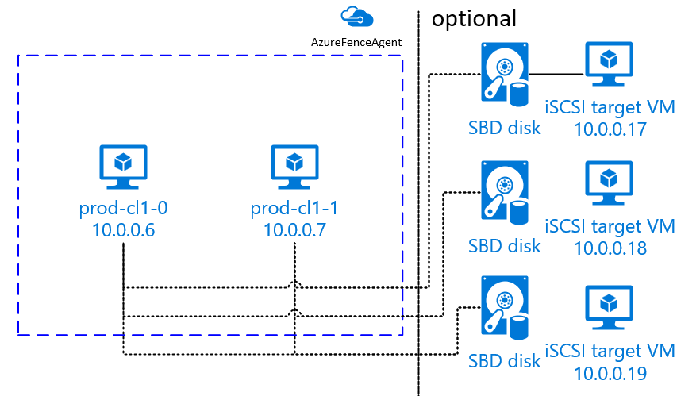
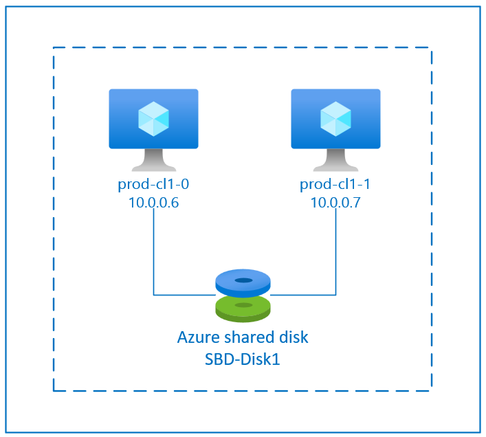

# Set up Pacemaker on SUSE Linux Enterprise Server in Azure

This article discusses how to set up Pacemaker on SUSE Linux Enterprise Server (SLES) in Azure.

## Overview

[planning-guide]:planning-guide.md
[deployment-guide]:deployment-guide.md
[dbms-guide]:dbms-guide-general.md
[sap-hana-ha]:sap-hana-high-availability.md
[virtual-machines-linux-maintenance]:../../virtual-machines/maintenance-and-updates.md#maintenance-that-doesnt-require-a-reboot
[virtual-machines-windows-maintenance]:../../virtual-machines/maintenance-and-updates.md#maintenance-that-doesnt-require-a-reboot
[sles-nfs-guide]:high-availability-guide-suse-nfs.md
[sles-guide]:high-availability-guide-suse.md

In Azure, you have two options for setting up fencing in the Pacemaker cluster for SLES. You can use an Azure fence agent, which restarts a failed node via the Azure APIs, or you can use SBD device.


### Use an SBD device

You can configure the SBD device by using either of two options:

- SBD with an iSCSI target server:
  
  The SBD device requires at least one additional virtual machine (VM) that acts as an Internet Small Computer System Interface (iSCSI) target server and provides an SBD device. These iSCSI target servers can, however, be shared with other Pacemaker clusters. The advantage of using an SBD device is that if you're already using SBD devices on-premises, they don't require any changes to how you operate the Pacemaker cluster. 
  
  You can use up to three SBD devices for a Pacemaker cluster to allow an SBD device to become unavailable (for example, during OS patching of the iSCSI target server). If you want to use more than one SBD device per Pacemaker, be sure to deploy multiple iSCSI target servers and connect one SBD from each iSCSI target server. We recommend using either one SBD device or three. Pacemaker can't automatically fence a cluster node if only two SBD devices are configured and one of them is unavailable. If you want to be able to fence when one iSCSI target server is down, you have to use three SBD devices and, therefore, three iSCSI target servers. That's the most resilient configuration when you're using SBDs.
  
  
  
  >[!IMPORTANT]
  > When you're planning and deploying Linux Pacemaker clustered nodes and SBD devices, do not allow the routing between your virtual machines and the VMs that are hosting the SBD devices to pass through any other devices, such as a [network virtual appliance (NVA)](https://azure.microsoft.com/solutions/network-appliances/). 
  >
  >Maintenance events and other issues with the NVA can have a negative impact on the stability and reliability of the overall cluster configuration. For more information, see [User-defined routing rules](../../virtual-network/virtual-networks-udr-overview.md).

- SBD with an Azure shared disk:
  
  To configure an SBD device, you need to attach at least one [Azure shared disk](https://github.com/MicrosoftDocs/azure-docs/blob/master/articles/virtual-machines/disks-shared.md) to all virtual machines that are part of Pacemaker cluster. The advantage of SBD device using an Azure shared disk is that you don’t need to deploy additional virtual machines.
  
  
  
   Here are some important considerations about SBD devices when you're using an Azure shared disk:

   - An Azure shared disk with Premium SSD is supported as an SBD device.
   - SBD devices that use an Azure shared disk are supported on SLES High Availability 15 SP01 and later.
   - SBD devices that use an Azure premium shared disk are supported on [locally redundant storage (LRS)](../../virtual-machines/disks-redundancy.md#locally-redundant-storage-for-managed-disks) and [zone-redundant storage (ZRS)](../../virtual-machines/disks-redundancy.md#zone-redundant-storage-for-managed-disks).
   - Depending on the type of your deployment (availability set or availability zones), choose the appropriate redundant storage for an Azure shared disk as your SBD device.
     - An SBD device using LRS for Azure premium shared disk (skuName - Premium_LRS) is only supported with deployment in availability set.
     - An SBD device using ZRS for an Azure premium shared disk (skuName - Premium_ZRS) is recommended with deployment in availability zones.
   - A ZRS for managed disk is currently unavailable in all regions with availability zones. For more information, review the ZRS "Limitations" section in [Redundancy options for managed disks](../../virtual-machines/disks-redundancy.md#limitations).
   - The Azure shared disk that you use for SBD devices doesn’t need to be large. The [maxShares](../../virtual-machines/disks-shared-enable.md#disk-sizes) value determines how many cluster nodes can use the shared disk. For example, you can use P1 or P2 disk sizes for your SBD device on two-node cluster such as SAP ASCS/ERS or SAP HANA scale-up.
   - For [HANA scale-out with HANA system replication (HSR) and Pacemaker](sap-hana-high-availability-scale-out-hsr-suse.md), you can use an Azure shared disk for SBD devices in clusters with up to four nodes per replication site because of the current limit of [maxShares](../../virtual-machines/disks-shared-enable.md#disk-sizes).
   - We do *not* recommend attaching an Azure shared disk SBD device across Pacemaker clusters.
   - If you use multiple Azure shared disk SBD devices, check on the limit for a maximum number of data disks that can be attached to a VM.
   - For more information about limitations for Azure shared disks, carefully review the "Limitations" section of [Azure shared disk documentation](../../virtual-machines/disks-shared.md#limitations).

### Use an Azure fence agent
You can set up fencing by using an Azure fence agent. Azure fence agent require managed identities for the cluster VMs or a service principal, that manages restarting failed nodes via Azure APIs. Azure fence agent doesn't require the deployment of additional virtual machines.

## SBD with an iSCSI target server

To use an SBD device that uses an iSCSI target server for fencing, follow the instructions in the next sections.

### Set up the iSCSI target server

You first need to create the iSCSI target virtual machines. You can share iSCSI target servers with multiple Pacemaker clusters.

1. Deploy new SLES 12 SP3 or higher virtual machines and connect to them via SSH. The machines don't need to be large. Virtual machine sizes Standard_E2s_v3 or Standard_D2s_v3 are sufficient. Be sure to use Premium storage for the OS disk.

1. On **iSCSI target virtual machines**, run the following commands:

   a. Update SLES.  

      <pre><code>sudo zypper update
      </code></pre>  

      > [!NOTE]
      > You might need to reboot the OS after you upgrade or update the OS.  

   b. Remove packages.

      To avoid a known issue with targetcli and SLES 12 SP3, uninstall the following packages. You can ignore errors about packages that can't be found.

      <pre><code>sudo zypper remove lio-utils python-rtslib python-configshell targetcli
      </code></pre>

   c. Install iSCSI target packages.

      <pre><code>sudo zypper install targetcli-fb dbus-1-python
      </code></pre>

   d. Enable the iSCSI target service.

      <pre><code>sudo systemctl enable targetcli
      sudo systemctl start targetcli
      </code></pre>

### Create an iSCSI device on the iSCSI target server

To create the iSCSI disks for the clusters to be used by your SAP systems, run the following commands on all iSCSI target virtual machines. In the example, SBD devices for  multiple clusters are created. It shows how you would use one iSCSI target server for multiple clusters. The SBD devices are placed on the OS disk. Make sure that you have enough space.

* **nfs**: Identifies the NFS cluster. 
* **ascsnw1**: Identifies the ASCS cluster of **NW1**.
* **dbnw1**: Identifies the database cluster of **NW1**.
* **nfs-0** and **nfs-1**: The hostnames of the NFS cluster nodes. 
* **nw1-xscs-0** and **nw1-xscs-1**: The hostnames of the **NW1** ASCS cluster nodes.
* **nw1-db-0** and **nw1-db-1**: The hostnames of the database cluster nodes. 

In the following instructions, replace the bold-formatted placeholder text with the hostnames of your cluster nodes and the SID of your SAP system.

1. Create the root folder for all SBD devices.
   <pre><code>sudo mkdir /sbd</code></pre>

1. Create the SBD device for the NFS server.
   <pre><code>sudo targetcli backstores/fileio create sbdnfs /sbd/sbdnfs 50M write_back=false
   sudo targetcli iscsi/ create iqn.2006-04.nfs.local:nfs
   sudo targetcli iscsi/iqn.2006-04.nfs.local:nfs/tpg1/luns/ create /backstores/fileio/sbdnfs
   sudo targetcli iscsi/iqn.2006-04.nfs.local:nfs/tpg1/acls/ create iqn.2006-04.<b>nfs-0.local:nfs-0</b>
   sudo targetcli iscsi/iqn.2006-04.nfs.local:nfs/tpg1/acls/ create iqn.2006-04.<b>nfs-1.local:nfs-1</b></code></pre>

1. Create the SBD device for the ASCS server of SAP System NW1.
   <pre><code>sudo targetcli backstores/fileio create sbdascs<b>nw1</b> /sbd/sbdascs<b>nw1</b> 50M write_back=false
   sudo targetcli iscsi/ create iqn.2006-04.ascs<b>nw1</b>.local:ascs<b>nw1</b>
   sudo targetcli iscsi/iqn.2006-04.ascs<b>nw1</b>.local:ascs<b>nw1</b>/tpg1/luns/ create /backstores/fileio/sbdascs<b>nw1</b>
   sudo targetcli iscsi/iqn.2006-04.ascs<b>nw1</b>.local:ascs<b>nw1</b>/tpg1/acls/ create iqn.2006-04.<b>nw1-xscs-0.local:nw1-xscs-0</b>
   sudo targetcli iscsi/iqn.2006-04.ascs<b>nw1</b>.local:ascs<b>nw1</b>/tpg1/acls/ create iqn.2006-04.<b>nw1-xscs-1.local:nw1-xscs-1</b></code></pre>

1. Create the SBD device for the database cluster of SAP System NW1.
   <pre><code>sudo targetcli backstores/fileio create sbddb<b>nw1</b> /sbd/sbddb<b>nw1</b> 50M write_back=false
   sudo targetcli iscsi/ create iqn.2006-04.db<b>nw1</b>.local:db<b>nw1</b>
   sudo targetcli iscsi/iqn.2006-04.db<b>nw1</b>.local:db<b>nw1</b>/tpg1/luns/ create /backstores/fileio/sbddb<b>nw1</b>
   sudo targetcli iscsi/iqn.2006-04.db<b>nw1</b>.local:db<b>nw1</b>/tpg1/acls/ create iqn.2006-04.<b>nw1-db-0.local:nw1-db-0</b>
   sudo targetcli iscsi/iqn.2006-04.db<b>nw1</b>.local:db<b>nw1</b>/tpg1/acls/ create iqn.2006-04.<b>nw1-db-1.local:nw1-db-1</b></code></pre>

1. Save the targetcli changes.
   <pre><code>sudo targetcli saveconfig</code></pre>

1. Check to ensure that everything was set up correctly.
   <pre><code>sudo targetcli ls

   o- / .......................................................................................................... [...]
   o- backstores ............................................................................................... [...]
   | o- block ................................................................................... [Storage Objects: 0]
   | o- fileio .................................................................................. [Storage Objects: 3]
   | | o- <b>sbdascsnw1</b> ................................................ [/sbd/sbdascsnw1 (50.0MiB) write-thru activated]
   | | | o- alua .................................................................................... [ALUA Groups: 1]
   | | |   o- default_tg_pt_gp ........................................................ [ALUA state: Active/optimized]
   | | o- <b>sbddbnw1</b> .................................................... [/sbd/sbddbnw1 (50.0MiB) write-thru activated]
   | | | o- alua .................................................................................... [ALUA Groups: 1]
   | | |   o- default_tg_pt_gp ........................................................ [ALUA state: Active/optimized]
   | | o- <b>sbdnfs</b> ........................................................ [/sbd/sbdnfs (50.0MiB) write-thru activated]
   | |   o- alua .................................................................................... [ALUA Groups: 1]
   | |     o- default_tg_pt_gp ........................................................ [ALUA state: Active/optimized]
   | o- pscsi ................................................................................... [Storage Objects: 0]
   | o- ramdisk ................................................................................. [Storage Objects: 0]
   o- iscsi ............................................................................................. [Targets: 3]
   | o- <b>iqn.2006-04.ascsnw1.local:ascsnw1</b> .................................................................. [TPGs: 1]
   | | o- tpg1 ................................................................................ [no-gen-acls, no-auth]
   | |   o- acls ........................................................................................... [ACLs: 2]
   | |   | o- <b>iqn.2006-04.nw1-xscs-0.local:nw1-xscs-0</b> ............................................... [Mapped LUNs: 1]
   | |   | | o- mapped_lun0 ............................................................ [lun0 fileio/<b>sbdascsnw1</b> (rw)]
   | |   | o- <b>iqn.2006-04.nw1-xscs-1.local:nw1-xscs-1</b> ............................................... [Mapped LUNs: 1]
   | |   |   o- mapped_lun0 ............................................................ [lun0 fileio/<b>sbdascsnw1</b> (rw)]
   | |   o- luns ........................................................................................... [LUNs: 1]
   | |   | o- lun0 .......................................... [fileio/sbdascsnw1 (/sbd/sbdascsnw1) (default_tg_pt_gp)]
   | |   o- portals ..................................................................................... [Portals: 1]
   | |     o- 0.0.0.0:3260 ...................................................................................... [OK]
   | o- <b>iqn.2006-04.dbnw1.local:dbnw1</b> ...................................................................... [TPGs: 1]
   | | o- tpg1 ................................................................................ [no-gen-acls, no-auth]
   | |   o- acls ........................................................................................... [ACLs: 2]
   | |   | o- <b>iqn.2006-04.nw1-db-0.local:nw1-db-0</b> ................................................... [Mapped LUNs: 1]
   | |   | | o- mapped_lun0 .............................................................. [lun0 fileio/<b>sbddbnw1</b> (rw)]
   | |   | o- <b>iqn.2006-04.nw1-db-1.local:nw1-db-1</b> ................................................... [Mapped LUNs: 1]
   | |   |   o- mapped_lun0 .............................................................. [lun0 fileio/<b>sbddbnw1</b> (rw)]
   | |   o- luns ........................................................................................... [LUNs: 1]
   | |   | o- lun0 .............................................. [fileio/sbddbnw1 (/sbd/sbddbnw1) (default_tg_pt_gp)]
   | |   o- portals ..................................................................................... [Portals: 1]
   | |     o- 0.0.0.0:3260 ...................................................................................... [OK]
   | o- <b>iqn.2006-04.nfs.local:nfs</b> .......................................................................... [TPGs: 1]
   |   o- tpg1 ................................................................................ [no-gen-acls, no-auth]
   |     o- acls ........................................................................................... [ACLs: 2]
   |     | o- <b>iqn.2006-04.nfs-0.local:nfs-0</b> ......................................................... [Mapped LUNs: 1]
   |     | | o- mapped_lun0 ................................................................ [lun0 fileio/<b>sbdnfs</b> (rw)]
   |     | o- <b>iqn.2006-04.nfs-1.local:nfs-1</b> ......................................................... [Mapped LUNs: 1]
   |     |   o- mapped_lun0 ................................................................ [lun0 fileio/<b>sbdnfs</b> (rw)]
   |     o- luns ........................................................................................... [LUNs: 1]
   |     | o- lun0 .................................................. [fileio/sbdnfs (/sbd/sbdnfs) (default_tg_pt_gp)]
   |     o- portals ..................................................................................... [Portals: 1]
   |       o- 0.0.0.0:3260 ...................................................................................... [OK]
   o- loopback .......................................................................................... [Targets: 0]
   o- vhost ............................................................................................. [Targets: 0]
   o- xen-pvscsi ........................................................................................ [Targets: 0]
   </code></pre>

### Set up the iSCSI target server SBD device

Connect to the iSCSI device that you created in the last step from the cluster.
Run the following commands on the nodes of the new cluster that you want to create.

> [!NOTE]
> * **[A]**: Applies to all nodes.
> * **[1]**: Applies only to node 1.
> * **[2]**: Applies only to node 2.

1. **[A]** Connect to the iSCSI devices. First, enable the iSCSI and SBD services.

   <pre><code>sudo systemctl enable iscsid
   sudo systemctl enable iscsi
   sudo systemctl enable sbd
   </code></pre>

1. **[1]** Change the initiator name on the first node.

   <pre><code>sudo vi /etc/iscsi/initiatorname.iscsi
   </code></pre>

1. **[1]** Change the contents of the file to match the access control lists (ACLs) you used when you created the iSCSI device on the iSCSI target server (for example, for the NFS server).

   <pre><code>InitiatorName=<b>iqn.2006-04.nfs-0.local:nfs-0</b></code></pre>

1. **[2]** Change the initiator name on the second node.

   <pre><code>sudo vi /etc/iscsi/initiatorname.iscsi
   </code></pre>

1. **[2]** Change the contents of the file to match the ACLs you used when you created the iSCSI device on the iSCSI target server.

   <pre><code>InitiatorName=<b>iqn.2006-04.nfs-1.local:nfs-1</b>
   </code></pre>

1. **[A]** Restart the iSCSI service to apply the change.

   <pre><code>sudo systemctl restart iscsid
   sudo systemctl restart iscsi
   </code></pre>

1. **[A]** Connect the iSCSI devices. In the following example, 10.0.0.17 is the IP address of the iSCSI target server, and 3260 is the default port. <b>iqn.2006-04.nfs.local:nfs</b> is one of the target names that's listed when you run the first command, `iscsiadm -m discovery`.

   <pre><code>sudo iscsiadm -m discovery --type=st --portal=<b>10.0.0.17:3260</b>   
   sudo iscsiadm -m node -T <b>iqn.2006-04.nfs.local:nfs</b> --login --portal=<b>10.0.0.17:3260</b>
   sudo iscsiadm -m node -p <b>10.0.0.17:3260</b> -T <b>iqn.2006-04.nfs.local:nfs</b> --op=update --name=node.startup --value=automatic</code></pre>
   
1. **[A]** If you want to use multiple SBD devices, also connect to the second iSCSI target server.

   <pre><code>sudo iscsiadm -m discovery --type=st --portal=<b>10.0.0.18:3260</b>   
   sudo iscsiadm -m node -T <b>iqn.2006-04.nfs.local:nfs</b> --login --portal=<b>10.0.0.18:3260</b>
   sudo iscsiadm -m node -p <b>10.0.0.18:3260</b> -T <b>iqn.2006-04.nfs.local:nfs</b> --op=update --name=node.startup --value=automatic</code></pre>
   
1. **[A]** If you want to use multiple SBD devices, also connect to the third iSCSI target server.

   <pre><code>sudo iscsiadm -m discovery --type=st --portal=<b>10.0.0.19:3260</b>   
   sudo iscsiadm -m node -T <b>iqn.2006-04.nfs.local:nfs</b> --login --portal=<b>10.0.0.19:3260</b>
   sudo iscsiadm -m node -p <b>10.0.0.19:3260</b> -T <b>iqn.2006-04.nfs.local:nfs</b> --op=update --name=node.startup --value=automatic
   </code></pre>

1. **[A]** Make sure that the iSCSI devices are available and note the device name (**/dev/sde**, in the following example).

   <pre><code>lsscsi
   
   # [2:0:0:0]    disk    Msft     Virtual Disk     1.0   /dev/sda
   # [3:0:1:0]    disk    Msft     Virtual Disk     1.0   /dev/sdb
   # [5:0:0:0]    disk    Msft     Virtual Disk     1.0   /dev/sdc
   # [5:0:0:1]    disk    Msft     Virtual Disk     1.0   /dev/sdd
   # <b>[6:0:0:0]    disk    LIO-ORG  sbdnfs           4.0   /dev/sdd</b>
   # <b>[7:0:0:0]    disk    LIO-ORG  sbdnfs           4.0   /dev/sde</b>
   # <b>[8:0:0:0]    disk    LIO-ORG  sbdnfs           4.0   /dev/sdf</b>
   </code></pre>

1. **[A]** Retrieve the IDs of the iSCSI devices.

   <pre><code>ls -l /dev/disk/by-id/scsi-* | grep <b>sdd</b>
   
   # lrwxrwxrwx 1 root root  9 Aug  9 13:20 /dev/disk/by-id/scsi-1LIO-ORG_sbdnfs:afb0ba8d-3a3c-413b-8cc2-cca03e63ef42 -> ../../sdd
   # <b>lrwxrwxrwx 1 root root  9 Aug  9 13:20 /dev/disk/by-id/scsi-36001405afb0ba8d3a3c413b8cc2cca03 -> ../../sdd</b>
   # lrwxrwxrwx 1 root root  9 Aug  9 13:20 /dev/disk/by-id/scsi-SLIO-ORG_sbdnfs_afb0ba8d-3a3c-413b-8cc2-cca03e63ef42 -> ../../sdd
   
   ls -l /dev/disk/by-id/scsi-* | grep <b>sde</b>
   
   # lrwxrwxrwx 1 root root  9 Feb  7 12:39 /dev/disk/by-id/scsi-1LIO-ORG_cl1:3fe4da37-1a5a-4bb6-9a41-9a4df57770e4 -> ../../sde
   # <b>lrwxrwxrwx 1 root root  9 Feb  7 12:39 /dev/disk/by-id/scsi-360014053fe4da371a5a4bb69a419a4df -> ../../sde</b>
   # lrwxrwxrwx 1 root root  9 Feb  7 12:39 /dev/disk/by-id/scsi-SLIO-ORG_cl1_3fe4da37-1a5a-4bb6-9a41-9a4df57770e4 -> ../../sde
   
   ls -l /dev/disk/by-id/scsi-* | grep <b>sdf</b>
   
   # lrwxrwxrwx 1 root root  9 Aug  9 13:32 /dev/disk/by-id/scsi-1LIO-ORG_sbdnfs:f88f30e7-c968-4678-bc87-fe7bfcbdb625 -> ../../sdf
   # <b>lrwxrwxrwx 1 root root  9 Aug  9 13:32 /dev/disk/by-id/scsi-36001405f88f30e7c9684678bc87fe7bf -> ../../sdf</b>
   # lrwxrwxrwx 1 root root  9 Aug  9 13:32 /dev/disk/by-id/scsi-SLIO-ORG_sbdnfs_f88f30e7-c968-4678-bc87-fe7bfcbdb625 -> ../../sdf
   </code></pre>

   The command lists three device IDs for every SBD device. We recommend using the ID that starts with scsi-1. In the preceding example, the IDs are:

   * **/dev/disk/by-id/scsi-36001405afb0ba8d3a3c413b8cc2cca03**
   * **/dev/disk/by-id/scsi-360014053fe4da371a5a4bb69a419a4df**
   * **/dev/disk/by-id/scsi-36001405f88f30e7c9684678bc87fe7bf**

1. **[1]** Create the SBD device.

   a. Use the device ID of the iSCSI devices to create the new SBD devices on the first cluster node.

   <pre><code>sudo sbd -d <b>/dev/disk/by-id/scsi-36001405afb0ba8d3a3c413b8cc2cca03</b> -1 60 -4 120 create</code></pre>
   
   b. Also create the second and third SBD devices if you want to use more than one.
   <pre><code>sudo sbd -d <b>/dev/disk/by-id/scsi-360014053fe4da371a5a4bb69a419a4df</b> -1 60 -4 120 create
   sudo sbd -d <b>/dev/disk/by-id/scsi-36001405f88f30e7c9684678bc87fe7bf</b> -1 60 -4 120 create
   </code></pre>

1. **[A]** Adapt the SBD configuration.

   a. Open the SBD config file.

   <pre><code>sudo vi /etc/sysconfig/sbd
   </code></pre>

   b. Change the property of the SBD device, enable the Pacemaker integration, and change the start mode of SBD.

   <pre><code>[...]
   <b>SBD_DEVICE="/dev/disk/by-id/scsi-36001405afb0ba8d3a3c413b8cc2cca03;/dev/disk/by-id/scsi-360014053fe4da371a5a4bb69a419a4df;/dev/disk/by-id/scsi-36001405f88f30e7c9684678bc87fe7bf"</b>
   [...]
   <b>SBD_PACEMAKER="yes"</b>
   [...]
   <b>SBD_STARTMODE="always"</b>
   [...]
   </code></pre>

1. **[A]** Create the `softdog` configuration file.

   <pre><code>echo softdog | sudo tee /etc/modules-load.d/softdog.conf
   </code></pre>

1. **[A]** Load the module.

   <pre><code>sudo modprobe -v softdog
   </code></pre>

## SBD with an Azure shared disk

This section applies only if you want to use an SBD device with an Azure shared disk.

### Create and attach an Azure shared disk with PowerShell

1. Adjust the values for your resource group, Azure region, virtual machines, logical unit numbers (LUNs), and so on.

   <pre><code>$ResourceGroup = "<b>MyResourceGroup</b>"
   $Location = "<b>MyAzureRegion</b>"</code></pre>

1. Define the size of the disk based on available disk size for Premium SSDs. In this example, P1 disk size of 4G is mentioned.
   <pre><code>$DiskSizeInGB = <b>4</b>
   $DiskName = "<b>SBD-disk1</b>"</code></pre>

1. With parameter -MaxSharesCount, define the maximum number of cluster nodes to attach the shared disk for the SBD device.
   <pre><code>$ShareNodes = <b>2</b></code></pre>

1. For an SBD device that uses LRS for an Azure premium shared disk, use the following storage SkuName:
   <pre><code>$SkuName = "<b>Premium_LRS</b>"</code></pre>
1. For an SBD device that uses ZRS for an Azure premium shared disk, use the following storage SkuName:
   <pre><code>$SkuName = "<b>Premium_ZRS</b>"</code></pre>

1. Set up an Azure shared disk.
   <pre><code>$diskConfig = New-AzDiskConfig -Location $Location -SkuName $SkuName -CreateOption Empty -DiskSizeGB $DiskSizeInGB -MaxSharesCount $ShareNodes
   $dataDisk = New-AzDisk -ResourceGroupName $ResourceGroup -DiskName $DiskName -Disk $diskConfig</code></pre>

1. Attach the disk to the cluster VMs.
   <pre><code>$VM1 = "<b>prod-cl1-0</b>"
   $VM2 = "<b>prod-cl1-1</b>"</code></pre>

   a. Add the Azure shared disk to cluster node 1.
   <pre><code>$vm = Get-AzVM -ResourceGroupName $ResourceGroup -Name $VM1
   $vm = Add-AzVMDataDisk -VM $vm -Name $DiskName -CreateOption Attach -ManagedDiskId $dataDisk.Id -Lun <b>0</b>
   Update-AzVm -VM $vm -ResourceGroupName $ResourceGroup -Verbose</code></pre>

   b. Add the Azure shared disk to cluster node 2.
   <pre><code>$vm = Get-AzVM -ResourceGroupName $ResourceGroup -Name $VM2
   $vm = Add-AzVMDataDisk -VM $vm -Name $DiskName -CreateOption Attach -ManagedDiskId $dataDisk.Id -Lun <b>0</b>
   Update-AzVm -VM $vm -ResourceGroupName $ResourceGroup -Verbose</code></pre>

If you want to deploy resources by using the Azure CLI or the Azure portal, you can also refer to [Deploy a ZRS disk](../../virtual-machines/disks-deploy-zrs.md).

### Set up an Azure shared disk SBD device

1. **[A]** Make sure that the attached disk is available.

   <pre><code># lsblk
   NAME   MAJ:MIN RM  SIZE RO TYPE MOUNTPOINT
   fd0      2:0    1    4K  0 disk
   sda      8:0    0   30G  0 disk
   ├─sda1   8:1    0    2M  0 part
   ├─sda2   8:2    0  512M  0 part /boot/efi
   ├─sda3   8:3    0    1G  0 part /boot
   ├─sda4   8:4    0 28.5G  0 part /
   sdb      8:16   0  256G  0 disk
   ├─sdb1   8:17   0  256G  0 part /mnt
   <b>sdc      8:32   0    4G  0 disk</b>
   sr0     11:0    1 1024M  0 rom
   
   # lsscsi
   [1:0:0:0]    cd/dvd  Msft     Virtual CD/ROM   1.0   /dev/sr0
   [2:0:0:0]    disk    Msft     Virtual Disk     1.0   /dev/sda
   [3:0:1:0]    disk    Msft     Virtual Disk     1.0   /dev/sdb
   <b>[5:0:0:0]    disk    Msft     Virtual Disk     1.0   /dev/sdc</b>
   </code></pre>

1. **[A]** Retrieve the IDs of the attached disks.

   <pre><code># ls -l /dev/disk/by-id/scsi-* | grep sdc
   lrwxrwxrwx 1 root root  9 Nov  8 16:55 /dev/disk/by-id/scsi-14d534654202020204208a67da80744439b513b2a9728af19 -> ../../sdc
   <b>lrwxrwxrwx 1 root root  9 Nov  8 16:55 /dev/disk/by-id/scsi-3600224804208a67da8073b2a9728af19 -> ../../sdc</b>
   </code></pre>

   The commands list device IDs for the SBD device. We recommend using the ID that starts with scsi-3. In the preceding example, the ID is **/dev/disk/by-id/scsi-3600224804208a67da8073b2a9728af19**.

1. **[1]** Create the SBD device.

   Use the device ID from step 2 to create the new SBD devices on the first cluster node.

   <pre><code># sudo sbd -d <b>/dev/disk/by-id/scsi-3600224804208a67da8073b2a9728af19</b> -1 60 -4 120 create
   </code></pre>

1. **[A]** Adapt the SBD configuration.

   a. Open the SBD config file.

   <pre><code>sudo vi /etc/sysconfig/sbd
   </code></pre>

   b. Change the property of the SBD device, enable the Pacemaker integration, and change the start mode of the SBD device.

   <pre><code>[...]
   <b>SBD_DEVICE="/dev/disk/by-id/scsi-3600224804208a67da8073b2a9728af19"</b>
   [...]
   <b>SBD_PACEMAKER="yes"</b>
   [...]
   <b>SBD_STARTMODE="always"</b>
   [...]
   </code></pre>

1. Create the `softdog` configuration file.

   <pre><code>echo softdog | sudo tee /etc/modules-load.d/softdog.conf
   </code></pre>

1. Load the module.

   <pre><code>sudo modprobe -v softdog
   </code></pre>

## Use an Azure fence agent

This section applies only if you want to use a fencing device with an Azure fence agent.

### Create an Azure fence agent device

This section applies only if you're using a fencing device that's based on an Azure fence agent. The fencing device uses either a managed identity or a service principal to authorize against Microsoft Azure. 

#### Using managed identity
To create a managed identity (MSI), [create a system-assigned](../../active-directory/managed-identities-azure-resources/qs-configure-portal-windows-vm.md#system-assigned-managed-identity) managed identity for each VM in the cluster. Should a system-assigned managed identity already exist, it will be used. User assigned managed identities should not be used with Pacemaker at this time. Azure fence agent, based on managed identity is supported for SLES 12 SP5 and SLES 15 SP1 and above.  

#### Using service principal

To create a service principal, do the following:

1. In the [Azure portal](https://portal.azure.com), select **Azure Active Directory** > **Properties**, and then write down the Directory ID. This is the **tenant ID**.
1. Select **App registrations**.
1. Select **New registration**.
1. Enter a name for the registration, and then select **Accounts in this organization directory only**. 
1. For **Application type**, select **Web**, enter a sign-on URL (for example, <code>*http://</code><code>localhost*</code>), and then select **Add**.  
   The sign-on URL is not used and can be any valid URL.
1. Select **Certificates and secrets**, and then select **New client secret**.
1. Enter a description for a new key, select **Never expires**, and then select **Add**.
1. Write down the value, which you'll use as the password for the service principal.
1. Select **Overview**, and then write down the application ID, which you'll use as the username of the service principal.

### **[1]** Create a custom role for the fence agent

By default, neither managed identity norservice principal have permissions to access your Azure resources. You need to give the managed identity or service principal permissions to start and stop (deallocate) all virtual machines in the cluster. If you didn't already create the custom role, you can do so by using [PowerShell](../../role-based-access-control/custom-roles-powershell.md#create-a-custom-role) or the [Azure CLI](../../role-based-access-control/custom-roles-cli.md).

Use the following content for the input file. You need to adapt the content to your subscriptions. That is, replace *xxxxxxxx-xxxx-xxxx-xxxx-xxxxxxxxxxxx* and *yyyyyyyy-yyyy-yyyy-yyyy-yyyyyyyyyyyy* with your own subscription IDs. If you have only one subscription, remove the second entry under AssignableScopes.

```json
{
      "Name": "Linux fence agent Role",
      "description": "Allows to power-off and start virtual machines",
      "assignableScopes": [
              "/subscriptions/xxxxxxxx-xxxx-xxxx-xxxx-xxxxxxxxxxxx",
              "/subscriptions/yyyyyyyy-yyyy-yyyy-yyyy-yyyyyyyyyyyy"
      ],
      "actions": [
              "Microsoft.Compute/*/read",
              "Microsoft.Compute/virtualMachines/powerOff/action",
              "Microsoft.Compute/virtualMachines/start/action"
      ],
      "notActions": [],
      "dataActions": [],
      "notDataActions": []
}
```

### **[A]** Assign the custom role

#### Using Managed Identity

Assign the custom role "Linux Fence Agent Role" that was created in the last chapter to each managed identity of the cluster VMs. Each VM system-assigned managed identity needs the role assigned for every cluster VM's resource. For detailed steps, see [Assign a managed identity access to a resource by using the Azure portal](../../active-directory/managed-identities-azure-resources/howto-assign-access-portal.md). Verify each VM's managed identity role assignment contains all cluster VMs.

> [!IMPORTANT]
> Be aware assignment and removal of authorization with managed identities [can be delayed](../../active-directory/managed-identities-azure-resources/managed-identity-best-practice-recommendations.md#limitation-of-using-managed-identities-for-authorization) until effective.

#### Using Service Principal

Assign the custom role *Linux fence agent Role* that you already created to the service principal. Do *not* use the *Owner* role anymore. For more information, see [Assign Azure roles by using the Azure portal](../../role-based-access-control/role-assignments-portal.md).   

Make sure to assign the custom role to the service principal at all VM (cluster node) scopes.  

## Install the cluster

> [!NOTE]
> * **[A]**: Applies to all nodes.
> * **[1]**: Applies only to node 1.
> * **[2]**: Applies only to node 2.

1. **[A]** Update SLES.

   <pre><code>sudo zypper update
   </code></pre>

   > [!NOTE]
   > On SLES 15 SP04 check the version of *crmsh* and *pacemaker* package, and make sure that the miniumum version requirements are met:
   > - crmsh-4.4.0+20221028.3e41444-150400.3.9.1 or later
   > - pacemaker-2.1.2+20211124.ada5c3b36-150400.4.6.1 or later

2. **[A]** Install the component, which you'll need for the cluster resources.

   <pre><code>sudo zypper in socat
   </code></pre>

3. **[A]** Install the azure-lb component, which you'll need for the cluster resources.

   <pre><code>sudo zypper in resource-agents
   </code></pre>

   > [!NOTE]
   > Check the version of the *resource-agents* package, and make sure that the minimum version requirements are met:  
   > - **SLES 12 SP4/SP5**: The version must be resource-agents-4.3.018.a7fb5035-3.30.1 or later.  
   > - **SLES 15/15 SP1**: The version must be resource-agents-4.3.0184.6ee15eb2-4.13.1 or later.  

4. **[A]** Configure the operating system.

   a. Pacemaker occasionally creates many processes, which can exhaust the allowed number. When this happens, a heartbeat between the cluster nodes might fail and lead to a failover of your resources. We recommend increasing the maximum number of allowed processes by setting the following parameter:

   <pre><code># Edit the configuration file
   sudo vi /etc/systemd/system.conf
   
   # Change the DefaultTasksMax
   #DefaultTasksMax=512
   DefaultTasksMax=4096
   
   # Activate this setting
   sudo systemctl daemon-reload
   
   # Test to ensure that the change was successful
   sudo systemctl --no-pager show | grep DefaultTasksMax
   </code></pre>

   b. Reduce the size of the dirty cache. For more information, see [Low write performance on SLES 11/12 servers with large RAM](https://www.suse.com/support/kb/doc/?id=7010287).

   <pre><code>sudo vi /etc/sysctl.conf
   # Change/set the following settings
   vm.dirty_bytes = 629145600
   vm.dirty_background_bytes = 314572800
   </code></pre>
   
    c. Make sure vm.swappiness is set to 10 to reduce swap usage and favor memory.

   <pre><code>sudo vi /etc/sysctl.conf
   # Change/set the following setting
   vm.swappiness = 10
   </code></pre>

5. **[A]** Configure *cloud-netconfig-azure* for the high availability cluster.

   >[!NOTE]
   > Check the installed version of the *cloud-netconfig-azure* package by running **zypper info cloud-netconfig-azure**. If the version in your environment is 1.3 or later, it's no longer necessary to suppress the management of network interfaces by the cloud network plug-in. If the version is earlier than 1.3, we recommend that you update the *cloud-netconfig-azure* package to the latest available version.  

   To prevent the cloud network plug-in from removing the virtual IP address (Pacemaker must control the assignment), change the configuration file for the network interface as shown in the following code. For more information, see [SUSE KB 7023633](https://www.suse.com/support/kb/doc/?id=7023633). 

   <pre><code># Edit the configuration file
   sudo vi /etc/sysconfig/network/ifcfg-eth0 
   
   # Change CLOUD_NETCONFIG_MANAGE
   # CLOUD_NETCONFIG_MANAGE="yes"
   CLOUD_NETCONFIG_MANAGE="no"
   </code></pre>

6. **[1]** Enable SSH access.

   <pre><code>sudo ssh-keygen
   
   # Enter file in which to save the key (/root/.ssh/id_rsa), and then select Enter
   # Enter passphrase (empty for no passphrase), and then select Enter
   # Enter same passphrase again, and then select Enter
   
   # copy the public key
   sudo cat /root/.ssh/id_rsa.pub
   </code></pre>

7. **[2]** Enable SSH access.

   <pre><code>sudo ssh-keygen
   
   # Enter file in which to save the key (/root/.ssh/id_rsa), and then select Enter
   # Enter passphrase (empty for no passphrase), and then select Enter
   # Enter same passphrase again, and then select Enter
   
   # Insert the public key you copied in the last step into the authorized keys file on the second server
   sudo vi /root/.ssh/authorized_keys   
   
   # copy the public key
   sudo cat /root/.ssh/id_rsa.pub
   </code></pre>

8. **[1]** Enable SSH access.

   <pre><code># insert the public key you copied in the last step into the authorized keys file on the first server
   sudo vi /root/.ssh/authorized_keys
   </code></pre>

9. **[A]** Install the *fence-agents* package if you're using a fencing device, based on the Azure fence agent.  
   
   <pre><code>sudo zypper install fence-agents
   </code></pre>

   >[!IMPORTANT]
   > The installed version of the *fence-agents* package must be 4.4.0 or later to benefit from the faster failover times with the Azure fence agent, when a cluster node is fenced. If you're running an earlier version, we recommend that you update the package.  

   >[!IMPORTANT]
   > If using managed identity, the installed version of the *fence-agents* package must be 
   > SLES 12 SP5: fence-agents 4.9.0+git.1624456340.8d746be9-3.35.2 or later  
   > SLES 15 SP1 and higher: fence-agents 4.5.2+git.1592573838.1eee0863 or later.  
   > Earlier versions will not work correctly with a managed identity configuration.  
   
10. **[A]** Install the Azure Python SDK and Azure Identity Python module.  

    Install the Azure Python SDK on SLES 12 SP4 or SLES 12 SP5:
    <pre><code># You might need to activate the public cloud extension first
    SUSEConnect -p sle-module-public-cloud/12/x86_64
    sudo zypper install python-azure-mgmt-compute
    sudo zypper install python-azure-identity
    </code></pre>

    Install the Azure Python SDK on SLES 15 or later:
    <pre><code># You might need to activate the public cloud extension first. In this example, the SUSEConnect command is for SLES 15 SP1
    SUSEConnect -p sle-module-public-cloud/15.1/x86_64
    sudo zypper install python3-azure-mgmt-compute
    sudo zypper install python3-azure-identity
    </code></pre>

    >[!IMPORTANT]
    >Depending on your version and image type, you might need to activate the public cloud extension for your OS release before you can install the Azure Python SDK.
    >You can check the extension by running `SUSEConnect ---list-extensions`.  
    >To achieve the faster failover times with the Azure fence agent:
    > - On SLES 12 SP4 or SLES 12 SP5, install version 4.6.2 or later of the *python-azure-mgmt-compute* package.
    > - If your *python-azure-mgmt-compute or python**3**-azure-mgmt-compute* package version is 17.0.0-6.7.1, follow the instructions in [SUSE KBA](https://www.suse.com/support/kb/doc/?id=000020377) to update the fence-agents version and install the Azure Identity client library for Python module if it is missing.

11. **[A]** Set up the hostname resolution.

    You can either use a DNS server or modify the */etc/hosts* file on all nodes. This example shows how to use the */etc/hosts* file.

    Replace the IP address and the hostname in the following commands.
    
    >[!IMPORTANT]
    > If you're using hostnames in the cluster configuration, it's essential to have a reliable hostname resolution. The cluster communication will fail if the names are unavailable, and that can lead to cluster failover delays.
    >
    > The benefit of using */etc/hosts* is that your cluster becomes independent of the DNS, which could be a single point of failure too.  

    <pre><code>sudo vi /etc/hosts
    </code></pre>

    Insert the following lines in the */etc/hosts*. Change the IP address and hostname to match your environment.

    <pre><code># IP address of the first cluster node
    <b>10.0.0.6 prod-cl1-0</b>
    # IP address of the second cluster node
    <b>10.0.0.7 prod-cl1-1</b>
    </code></pre>

12. **[1]** Install the cluster.
    
    - If you're using SBD devices for fencing (for either the iSCSI target server or Azure shared disk):

      <pre><code>sudo crm cluster init
      # ! NTP is not configured to start at system boot.
      # Do you want to continue anyway (y/n)? <b>y</b>
      # /root/.ssh/id_rsa already exists - overwrite (y/n)? <b>n</b>
      # Address for ring0 [10.0.0.6] <b>Select Enter</b>
      # Port for ring0 [5405] <b>Select Enter</b>
      # SBD is already configured to use /dev/disk/by-id/scsi-36001405639245768818458b930abdf69;/dev/disk/by-id/scsi-36001405afb0ba8d3a3c413b8cc2cca03;/dev/disk/by-id/scsi-36001405f88f30e7c9684678bc87fe7bf - overwrite (y/n)? <b>n</b>
      # Do you wish to configure an administration IP (y/n)? <b>n</b>
      </code></pre>
    
    - If you're *not* using SBD devices for fencing:
    
      <pre><code>sudo crm cluster init
      # ! NTP is not configured to start at system boot.
      # Do you want to continue anyway (y/n)? <b>y</b>
      # /root/.ssh/id_rsa already exists - overwrite (y/n)? <b>n</b>
      # Address for ring0 [10.0.0.6] <b>Select Enter</b>
      # Port for ring0 [5405] <b>Select Enter</b>
      # Do you wish to use SBD (y/n)? <b>n</b>
      # WARNING: Not configuring SBD - STONITH will be disabled.
      # Do you wish to configure an administration IP (y/n)? <b>n</b>
      </code></pre>

13. **[2]** Add the node to the cluster.
    
    <pre><code>sudo crm cluster join
    # ! NTP is not configured to start at system boot.
    # Do you want to continue anyway (y/n)? <b>y</b>
    # IP address or hostname of existing node (for example, 192.168.1.1) []<b>10.0.0.6</b>
    # /root/.ssh/id_rsa already exists - overwrite (y/n)? <b>n</b>
    </code></pre>

14. **[A]** Change the hacluster password to the same password.

    <pre><code>sudo passwd hacluster
    </code></pre>

15. **[A]** Adjust the corosync settings.  

    <pre><code>sudo vi /etc/corosync/corosync.conf
    </code></pre>

    a. Add the following bold-formatted content to the file if the values are not there or are different. Be sure to change the token to 30000 to allow memory-preserving maintenance. For more information, see the "Maintenance for virtual machines in Azure" article for [Linux][virtual-machines-linux-maintenance] or [Windows][virtual-machines-windows-maintenance].

    <pre><code>[...]
      <b>token:          30000
      token_retransmits_before_loss_const: 10
      join:           60
      consensus:      36000
      max_messages:   20</b>
     
      interface { 
         [...] 
      }
      transport:      udpu
    } 
    nodelist {
      node {
       ring0_addr:10.0.0.6
      }
      node {
       ring0_addr:10.0.0.7
      } 
    }
    logging {
      [...]
    }
    quorum {
         # Enable and configure quorum subsystem (default: off)
         # See also corosync.conf.5 and votequorum.5
         provider: corosync_votequorum
         <b>expected_votes: 2</b>
         <b>two_node: 1</b>
    }
    </code></pre>

    b. Restart the corosync service.

    <pre><code>sudo service corosync restart
    </code></pre>

### Create a fencing device on the Pacemaker cluster

1. **[1]** If you're using an SDB device (iSCSI target server or Azure shared disk) as a fencing device, run the following commands. Enable the use of a fencing device, and set the fence delay.

   <pre><code>sudo crm configure property stonith-timeout=144
   sudo crm configure property stonith-enabled=true
   
   # List the resources to find the name of the SBD device
   sudo crm resource list
   sudo crm resource stop stonith-sbd
   sudo crm configure delete <b>stonith-sbd</b>
   sudo crm configure primitive <b>stonith-sbd</b> stonith:external/sbd \
      params pcmk_delay_max="15" \
      op monitor interval="600" timeout="15"
   </code></pre>

1. **[1]** If you're using an Azure fence agent for fencing, run the following commands. After you've assigned roles to both cluster nodes, you can configure the fencing devices in the cluster.
 
   <pre><code>sudo crm configure property stonith-enabled=true
   crm configure property concurrent-fencing=true
   </code></pre>

   > [!NOTE]
   > The 'pcmk_host_map' option is required in the command only if the hostnames and the Azure VM names are *not* identical. Specify the mapping in the format *hostname:vm-name*.
   > Refer to the bold section in the following command.
  
   If using **managed identity** for your fence agent, run the following command
   <pre><code>
   # replace the bold strings with your subscription ID and resource group of the VM
   
   sudo crm configure primitive rsc_st_azure stonith:fence_azure_arm \
   params <b>msi=true</b> subscriptionId="<b>subscription ID</b>" resourceGroup="<b>resource group</b>" \
   pcmk_monitor_retries=4 pcmk_action_limit=3 power_timeout=240 pcmk_reboot_timeout=900 <b>pcmk_host_map="prod-cl1-0:prod-cl1-0-vm-name;prod-cl1-1:prod-cl1-1-vm-name"</b> \
   op monitor interval=3600 timeout=120
   
   sudo crm configure property stonith-timeout=900
   </code></pre>

   If using **service principal** for your fence agent, run the following command
   <pre><code>
   # replace the bold strings with your subscription ID, resource group of the VM, tenant ID, service principal application ID and password
   
   sudo crm configure primitive rsc_st_azure stonith:fence_azure_arm \
   params subscriptionId="<b>subscription ID</b>" resourceGroup="<b>resource group</b>" tenantId="<b>tenant ID</b>" login="<b>application ID</b>" passwd="<b>password</b>" \
   pcmk_monitor_retries=4 pcmk_action_limit=3 power_timeout=240 pcmk_reboot_timeout=900 pcmk_delay_max=15 <b>pcmk_host_map="prod-cl1-0:prod-cl1-0-vm-name;prod-cl1-1:prod-cl1-1-vm-name"</b> \
   op monitor interval=3600 timeout=120
   
   sudo crm configure property stonith-timeout=900
   </code></pre>

   If you are using fencing device, based on service principal configuration, read [Change from SPN to MSI for Pacemaker clusters using Azure fencing](https://techcommunity.microsoft.com/t5/running-sap-applications-on-the/sap-on-azure-high-availability-change-from-spn-to-msi-for/ba-p/3609278) and learn how to convert to managed identity configuration.

   > [!IMPORTANT]
   > The monitoring and fencing operations are deserialized. As a result, if there's a longer-running monitoring operation and simultaneous fencing event, there's no delay to the cluster failover because the monitoring operation is already running.

   > [!TIP]
   >The Azure fence agent requires outbound connectivity to the public endpoints, as documented, along with possible solutions, in [Public endpoint connectivity for VMs using standard ILB](./high-availability-guide-standard-load-balancer-outbound-connections.md).  

## Configure Pacemaker for Azure scheduled events

Azure offers [scheduled events](../../virtual-machines/linux/scheduled-events.md). Scheduled events are provided via the metadata service and allow time for the application to prepare for such events as VM shutdown, VM redeployment, and so on. Resource agent [azure-events](https://github.com/ClusterLabs/resource-agents/pull/1161) monitors for scheduled Azure events. If events are detected and the resource agent determines that another cluster node is available, the azure-events agent will place the target cluster node in standby mode to force the cluster to migrate resources away from the VM with pending [Azure scheduled events](../../virtual-machines/linux/scheduled-events.md). To achieve that, you must configure additional Pacemaker resources. 

1. **[A]** Make sure that the package for the azure-events agent is already installed and up to date. 
   
   <pre><code>sudo zypper info resource-agents
   </code></pre>

1. **[1]** Configure the resources in Pacemaker.
   
   <pre><code>#Place the cluster in maintenance mode
   sudo crm configure property maintenance-mode=true
   
   #Create Pacemaker resources for the Azure agent
   sudo crm configure primitive rsc_azure-events ocf:heartbeat:azure-events op monitor interval=10s
   sudo crm configure clone cln_azure-events rsc_azure-events
   
   #Take the cluster out of maintenance mode
   sudo crm configure property maintenance-mode=false
   </code></pre>

   > [!NOTE]
   > After you've configured the Pacemaker resources for the azure-events agent, if you place the cluster in or out of maintenance mode, you might get warning messages such as:  
     WARNING: cib-bootstrap-options: unknown attribute 'hostName_ <strong> hostname</strong>'  
     WARNING: cib-bootstrap-options: unknown attribute 'azure-events_globalPullState'  
     WARNING: cib-bootstrap-options: unknown attribute 'hostName_ <strong>hostname</strong>'  
   > These warning messages can be ignored.

## Next steps

* [Azure Virtual Machines planning and implementation for SAP][planning-guide]
* [Azure Virtual Machines deployment for SAP][deployment-guide]
* [Azure Virtual Machines DBMS deployment for SAP][dbms-guide]
* [High availability for NFS on Azure VMs on SUSE Linux Enterprise Server][sles-nfs-guide]
* [High availability for SAP NetWeaver on Azure VMs on SUSE Linux Enterprise Server for SAP applications][sles-guide]
* To learn how to establish high availability and plan for disaster recovery of SAP HANA on Azure VMs, see [High availability of SAP HANA on Azure Virtual Machines][sap-hana-ha]
