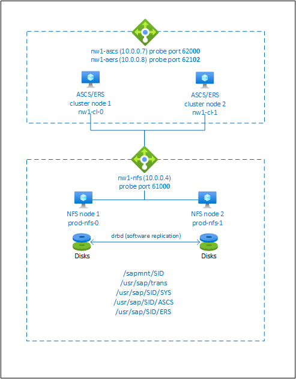

# High availability for SAP NetWeaver on Azure VMs on SUSE Linux Enterprise Server for SAP applications

[dbms-guide]:dbms-guide-general.md
[deployment-guide]:deployment-guide.md
[planning-guide]:planning-guide.md

[2205917]:https://launchpad.support.sap.com/#/notes/2205917
[1944799]:https://launchpad.support.sap.com/#/notes/1944799
[1928533]:https://launchpad.support.sap.com/#/notes/1928533
[2015553]:https://launchpad.support.sap.com/#/notes/2015553
[2178632]:https://launchpad.support.sap.com/#/notes/2178632
[2191498]:https://launchpad.support.sap.com/#/notes/2191498
[2243692]:https://launchpad.support.sap.com/#/notes/2243692
[1984787]:https://launchpad.support.sap.com/#/notes/1984787
[1999351]:https://launchpad.support.sap.com/#/notes/1999351
[1410736]:https://launchpad.support.sap.com/#/notes/1410736

[suse-ha-guide]:https://www.suse.com/products/sles-for-sap/resource-library/sap-best-practices/
[suse-ha-12sp3-relnotes]:https://www.suse.com/releasenotes/x86_64/SLE-HA/12-SP3/

[sap-hana-ha]:sap-hana-high-availability.md
[nfs-ha]:high-availability-guide-suse-nfs.md

This article describes how to deploy the virtual machines, configure the virtual machines, install the cluster framework, and install a highly available SAP NetWeaver or SAP ABAP platform based system. In the example configurations, ASCS instance number 00, ERS instance number 02, and SAP System ID NW1 is used.

For new implementations on SLES for SAP Applications 15, we recommended deploying high availability for SAP ASCS/ERS in [simple mount configuration](./high-availability-guide-suse-nfs-simple-mount.md). The classic Pacemaker configuration, based on cluster-controlled file systems for the SAP central services directories, described in this article is still [supported](https://documentation.suse.com/sbp/all/single-html/SAP-nw740-sle15-setupguide/#id-introduction).

Read the following SAP Notes and papers first

* SAP Note [1928533][1928533], which has:
  * List of Azure VM sizes that are supported for the deployment of SAP software
  * Important capacity information for Azure VM sizes
  * Supported SAP software, and operating system (OS) and database combinations
  * Required SAP kernel version for Windows and Linux on Microsoft Azure
* SAP Note [2015553][2015553] lists prerequisites for SAP-supported SAP software deployments in Azure.
* SAP Note [2205917][2205917] has recommended OS settings for SUSE Linux Enterprise Server for SAP Applications
* SAP Note [1944799][1944799] has SAP HANA Guidelines for SUSE Linux Enterprise Server for SAP Applications
* SAP Note [2178632][2178632] has detailed information about all monitoring metrics reported for SAP in Azure.
* SAP Note [2191498][2191498] has the required SAP Host Agent version for Linux in Azure.
* SAP Note [2243692][2243692] has information about SAP licensing on Linux in Azure.
* SAP Note [1984787][1984787] has general information about SUSE Linux Enterprise Server 12.
* SAP Note [1999351][1999351] has additional troubleshooting information for the Azure Enhanced Monitoring Extension for SAP.
* [SAP Community WIKI](https://wiki.scn.sap.com/wiki/display/HOME/SAPonLinuxNotes) has all required SAP Notes for Linux.
* [Azure Virtual Machines planning and implementation for SAP on Linux][planning-guide]
* [Azure Virtual Machines deployment for SAP on Linux][deployment-guide]
* [Azure Virtual Machines DBMS deployment for SAP on Linux][dbms-guide]
* [SUSE SAP HA Best Practice Guides][suse-ha-guide]
  The guides contain all required information to setup Netweaver HA and SAP HANA System Replication on-premises. Use these guides as a general baseline. They provide much more detailed information.
* [SUSE High Availability Extension 12 SP3 Release Notes][suse-ha-12sp3-relnotes]

## Overview

To achieve high availability, SAP NetWeaver requires an NFS server. The NFS server is configured in a separate cluster and can be used by multiple SAP systems.



The NFS server, SAP NetWeaver ASCS, SAP NetWeaver SCS, SAP NetWeaver ERS, and the SAP HANA database use virtual hostname and virtual IP addresses. On Azure, a load balancer is required to use a virtual IP address. We recommend using [Standard load balancer](../../load-balancer/quickstart-load-balancer-standard-public-portal.md). The presented configuration shows a load balancer with:

* Frontend IP address 10.0.0.7 for ASCS
* Frontend IP address 10.0.0.8 for ERS
* Probe port 62000 for ASCS
* Probe port 62101 for ERS

## Setting up a highly available NFS server

> [!NOTE]
> We recommend deploying one of the Azure first-party NFS services: [NFS on Azure Files](../../storage/files/storage-files-quick-create-use-linux.md) or [NFS ANF volumes](../../azure-netapp-files/azure-netapp-files-create-volumes.md) for storing shared data in a highly available SAP system. Be aware, that we are de-emphasizing SAP reference architectures, utilizing NFS clusters.  
> The SAP configuration guides for SAP NW highly available SAP system with native NFS services are:
>
> * [High availability SAP NW on Azure VMswith simple mount and NFS on SLES for SAP Applications](./high-availability-guide-suse-nfs-simple-mount.md)
> * [High availability for SAP NW on Azure VMs with NFS on Azure Files on SLES for SAP Applications](./high-availability-guide-suse-nfs-azure-files.md)
> * [High availability for SAP NW on Azure VMs with NFS on Azure NetApp Files on SLES for SAP Applications](./high-availability-guide-suse-netapp-files.md)

SAP NetWeaver requires shared storage for the transport and profile directory. Read [High availability for NFS on Azure VMs on SUSE Linux Enterprise Server][nfs-ha] on how to set up an NFS server for SAP NetWeaver.

## Setting up (A)SCS

### Deploy Linux manually via Azure portal

This document assumes that you've already deployed a resource group, [Azure Virtual Network](../../virtual-network/virtual-networks-overview.md), and subnet.

Deploy virtual machines for SAP ASCS, ERS, and application server instances. Choose a suitable SLES image that is supported with your SAP system. You can deploy VM in any one of the availability options - scale set, availability zone or availability set.

### Deploy Azure Load Balancer manually via Azure portal

After you deploy the VMs for your SAP system, create a load balancer. Use VMs created for SAP ASCS/ERS instances in the backend pool.

1. Create load balancer (internal, standard):  
   1. Create the frontend IP addresses
      1. IP address 10.0.0.7 for the ASCS
         1. Open the load balancer, select frontend IP pool, and click Add
         2. Enter the name of the new frontend IP pool (for example **nw1-ascs-frontend**)
         3. Set the Assignment to Static and enter the IP address (for example **10.0.0.7**)
         4. Click OK
      2. IP address 10.0.0.8 for the ASCS ERS
         * Repeat the steps above to create an IP address for the ERS (for example **10.0.0.8** and **nw1-aers-backend**)
   2. Create a single back-end pool:
      1. Open the load balancer, select **Backend pools**, and then select **Add**.
      2. Enter the name of the new back-end pool (for example, **nw1-backend**).
      3. Select **NIC** for Backend Pool Configuration.
      4. Select **Add a virtual machine**.
      5. Select the virtual machines of the ASCS cluster.
      6. Select **Add**.
      7. Select **Save**.
   3. Create the health probes
      1. Port 620**00** for ASCS
         1. Open the load balancer, select health probes, and click Add
         2. Enter the name of the new health probe (for example **nw1-ascs-hp**)
         3. Select TCP as protocol, port 620**00**, keep Interval 5
         4. Click OK
      2. Port 621**02** for ASCS ERS
         * Repeat the steps above to create a health probe for the ERS (for example 621**02** and **nw1-aers-hp**)
   4. Load-balancing rules
      1. Load-balancing rules for ASCS
         1. Open the load balancer, select load-balancing rules and click Add
         2. Enter the name of the new load balancer rule (for example **nw1-lb-ascs**)
         3. Select the frontend IP address, backend pool, and health probe you created earlier (for example **nw1-ascs-frontend**, **nw1-backend** and **nw1-ascs-hp**)
         4. Select **HA ports**
         5. Increase idle timeout to 30 minutes
         6. **Make sure to enable Floating IP**
         7. Click OK
         * Repeat the steps above to create load balancing rules for ERS (for example **nw1-lb-ers**)

> [!IMPORTANT]
> Floating IP is not supported on a NIC secondary IP configuration in load-balancing scenarios. For details see [Azure Load balancer Limitations](../../load-balancer/load-balancer-multivip-overview.md#limitations). If you need additional IP address for the VM, deploy a second NIC.  

> [!NOTE]
> When VMs without public IP addresses are placed in the backend pool of internal (no public IP address) Standard Azure load balancer, there will be no outbound internet connectivity, unless additional configuration is performed to allow routing to public end points. For details on how to achieve outbound connectivity see [Public endpoint connectivity for Virtual Machines using Azure Standard Load Balancer in SAP high-availability scenarios](./high-availability-guide-standard-load-balancer-outbound-connections.md).  

> [!IMPORTANT]
> Do not enable TCP timestamps on Azure VMs placed behind Azure Load Balancer. Enabling TCP timestamps will cause the health probes to fail. Set parameter **net.ipv4.tcp_timestamps** to **0**. For details see [Load Balancer health probes](../../load-balancer/load-balancer-custom-probe-overview.md).

### Create Pacemaker cluster

Follow the steps in [Setting up Pacemaker on SUSE Linux Enterprise Server in Azure](high-availability-guide-suse-pacemaker.md) to create a basic Pacemaker cluster for this (A)SCS server.

### Installation

The following items are prefixed with either **[A]** - applicable to all nodes, **[1]** - only applicable to node 1, or **[2]** - only applicable to node 2.

1. **[A]** Install SUSE Connector

   ```bash
   sudo zypper install sap-suse-cluster-connector
   ```

   > [!NOTE]
   > The known issue with using a dash in host names is fixed with version **3.1.1** of package **sap-suse-cluster-connector**. Make sure that you are using at least version 3.1.1 of package sap-suse-cluster-connector, if using cluster nodes with dash in the host name. Otherwise your cluster will not work.

   Make sure that you installed the new version of the SAP SUSE cluster connector. The old one was called sap_suse_cluster_connector and the new one is called **sap-suse-cluster-connector**.

   ```bash
   sudo zypper info sap-suse-cluster-connector
   
   Information for package sap-suse-cluster-connector:
   ---------------------------------------------------
   Repository     : SLE-12-SP3-SAP-Updates
   Name           : sap-suse-cluster-connector
   <b>Version        : 3.0.0-2.2</b>
   Arch           : noarch
   Vendor         : SUSE LLC <https://www.suse.com/>
   Support Level  : Level 3
   Installed Size : 41.6 KiB
   <b>Installed      : Yes</b>
   Status         : up-to-date
   Source package : sap-suse-cluster-connector-3.0.0-2.2.src
   Summary        : SUSE High Availability Setup for SAP Products
   ```

1. **[A]** Update SAP resource agents  

   A patch for the resource-agents package is required to use the new configuration, that is described in this article. You can check, if the patch is already installed with the following command

   ```bash
   sudo grep 'parameter name="IS_ERS"' /usr/lib/ocf/resource.d/heartbeat/SAPInstance
   ```

   The output should be similar to

   ```text
   <parameter name="IS_ERS" unique="0" required="0">
   ```

   If the grep command doesn't find the IS_ERS parameter, you need to install the patch listed on [the SUSE download page](https://download.suse.com/patch/finder/#bu=suse&familyId=&productId=&dateRange=&startDate=&endDate=&priority=&architecture=&keywords=resource-agents).

   ```bash
   # example for patch for SLES 12 SP1
   sudo zypper in -t patch SUSE-SLE-HA-12-SP1-2017-885=1
   # example for patch for SLES 12 SP2
   sudo zypper in -t patch SUSE-SLE-HA-12-SP2-2017-886=1
   ```

1. **[A]** Setup host name resolution

   You can either use a DNS server or modify the /etc/hosts on all nodes. This example shows how to use the /etc/hosts file.
   Replace the IP address and the hostname in the following commands.

   ```bash
   sudo vi /etc/hosts
   
   # Insert the following lines to /etc/hosts. Change the IP address and hostname to match your environment
   # IP address of the load balancer frontend configuration for NFS
   10.0.0.4 nw1-nfs
   # IP address of the load balancer frontend configuration for SAP NetWeaver ASCS
   10.0.0.7 nw1-ascs
   # IP address of the load balancer frontend configuration for SAP NetWeaver ASCS ERS
   10.0.0.8 nw1-aers
   # IP address of the load balancer frontend configuration for database
   10.0.0.13 nw1-db
   ```

## Prepare for SAP NetWeaver installation

1. **[A]** Create the shared directories

   ```bash
   sudo mkdir -p /sapmnt/NW1
   sudo mkdir -p /usr/sap/trans
   sudo mkdir -p /usr/sap/NW1/SYS
   sudo mkdir -p /usr/sap/NW1/ASCS00
   sudo mkdir -p /usr/sap/NW1/ERS02
   
   sudo chattr +i /sapmnt/NW1
   sudo chattr +i /usr/sap/trans
   sudo chattr +i /usr/sap/NW1/SYS
   sudo chattr +i /usr/sap/NW1/ASCS00
   sudo chattr +i /usr/sap/NW1/ERS02
   ```

1. **[A]** Configure autofs

   ```bash
   sudo vi /etc/auto.master
   
   # Add the following line to the file, save and exit
   +auto.master
   /- /etc/auto.direct
   ```

   Create a file with

   ```bash
   sudo vi /etc/auto.direct
   
   # Add the following lines to the file, save and exit
   /sapmnt/NW1 -nfsvers=4,nosymlink,sync nw1-nfs:/NW1/sapmntsid
   /usr/sap/trans -nfsvers=4,nosymlink,sync nw1-nfs:/NW1/trans
   /usr/sap/NW1/SYS -nfsvers=4,nosymlink,sync nw1-nfs:/NW1/sidsys
   ```

   Restart autofs to mount the new shares

   ```bash
   sudo systemctl enable autofs
   sudo service autofs restart
   ```

1. **[A]** Configure SWAP file

   ```bash
   sudo vi /etc/waagent.conf
   
   # Check if property ResourceDisk.Format is already set to y and if not, set it
   ResourceDisk.Format=y
   
   # Set the property ResourceDisk.EnableSwap to y
   # Create and use swapfile on resource disk.
   ResourceDisk.EnableSwap=y
   
   # Set the size of the SWAP file with property ResourceDisk.SwapSizeMB
   # The free space of resource disk varies by virtual machine size. Make sure that you do not set a value that is too big. You can check the SWAP space with command swapon
   # Size of the swapfile.
   ResourceDisk.SwapSizeMB=2000
   ```

   Restart the Agent to activate the change

   ```bash
   sudo service waagent restart
   ```

### Installing SAP NetWeaver ASCS/ERS

1. **[1]** Create a virtual IP resource and health-probe for the ASCS instance

   > [!IMPORTANT]
   > Recent testing revealed situations, where netcat stops responding to requests due to backlog and its limitation of handling only one connection. The netcat resource stops listening to the Azure Load balancer requests and the floating IP becomes unavailable.  
   > For existing Pacemaker clusters, we recommended in the past replacing netcat with socat. Currently we recommend using azure-lb resource agent, which is part of package resource-agents, with the following package version requirements:
   >
   > * For SLES 12 SP4/SP5, the version must be at least resource-agents-4.3.018.a7fb5035-3.30.1.  
   > * For SLES 15/15 SP1, the version must be at least resource-agents-4.3.0184.6ee15eb2-4.13.1.  
   >
   > Note that the change will require brief downtime.  
   > For existing Pacemaker clusters, if the configuration was already changed to use socat as described in [Azure Load-Balancer Detection Hardening](https://www.suse.com/support/kb/doc/?id=7024128), there is no requirement to switch immediately to azure-lb resource agent.

   ```bash
   sudo crm node standby nw1-cl-1
   
   sudo crm configure primitive fs_NW1_ASCS Filesystem device='nw1-nfs:/NW1/ASCS' directory='/usr/sap/NW1/ASCS00' fstype='nfs4' \
     op start timeout=60s interval=0 \
     op stop timeout=60s interval=0 \
     op monitor interval=20s timeout=40s
   
   sudo crm configure primitive vip_NW1_ASCS IPaddr2 \
     params ip=10.0.0.7 \
     op monitor interval=10 timeout=20
   
   sudo crm configure primitive nc_NW1_ASCS azure-lb port=62000 \
     op monitor timeout=20s interval=10
   
   sudo crm configure group g-NW1_ASCS fs_NW1_ASCS nc_NW1_ASCS vip_NW1_ASCS \
      meta resource-stickiness=3000
   ```

   Make sure that the cluster status is ok and that all resources are started. It isn't important on which node the resources are running.

   ```bash
   sudo crm_mon -r
   
   # Node nw1-cl-1: standby
   # Online: [ nw1-cl-0 ]
   # 
   # Full list of resources:
   # 
   # stonith-sbd     (stonith:external/sbd): Started nw1-cl-0
   #  Resource Group: g-NW1_ASCS
   #      fs_NW1_ASCS        (ocf::heartbeat:Filesystem):    Started nw1-cl-0
   #      nc_NW1_ASCS        (ocf::heartbeat:azure-lb):      Started nw1-cl-0
   #      vip_NW1_ASCS       (ocf::heartbeat:IPaddr2):       Started nw1-cl-0
   ```

1. **[1]** Install SAP NetWeaver ASCS  

   Install SAP NetWeaver ASCS as root on the first node using a virtual hostname that maps to the IP address of the load balancer frontend configuration for the ASCS, for example **nw1-ascs**, **10.0.0.7** and the instance number that you used for the probe of the load balancer, for example **00**.

   You can use the sapinst parameter SAPINST_REMOTE_ACCESS_USER to allow a non-root user to connect to sapinst.

   ```bash
   sudo <swpm>/sapinst SAPINST_REMOTE_ACCESS_USER=sapadmin SAPINST_USE_HOSTNAME=virtual_hostname
   ```

   If the installation fails to create a subfolder in /usr/sap/**NW1**/ASCS**00**, try setting the owner and group of the ASCS**00** folder and retry.

   ```bash
   chown nw1adm /usr/sap/NW1/ASCS00
   chgrp sapsys /usr/sap/NW1/ASCS00
   ```

1. **[1]** Create a virtual IP resource and health-probe for the ERS instance

   ```bash
   sudo crm node online nw1-cl-1
   sudo crm node standby nw1-cl-0
   
   sudo crm configure primitive fs_NW1_ERS Filesystem device='nw1-nfs:/NW1/ASCSERS' directory='/usr/sap/NW1/ERS02' fstype='nfs4' \
     op start timeout=60s interval=0 \
     op stop timeout=60s interval=0 \
     op monitor interval=20s timeout=40s
   
   sudo crm configure primitive vip_NW1_ERS IPaddr2 \
     params ip=10.0.0.8 \
     op monitor interval=10 timeout=20
   
   sudo crm configure primitive nc_NW1_ERS azure-lb port=62102 \
     op monitor timeout=20s interval=10
   
   sudo crm configure group g-NW1_ERS fs_NW1_ERS nc_NW1_ERS vip_NW1_ERS
   ```

   Make sure that the cluster status is ok and that all resources are started. It isn't important on which node the resources are running.

   ```bash
   sudo crm_mon -r
   
   # Node nw1-cl-0: standby
   # Online: [ nw1-cl-1 ]
   # 
   # Full list of resources:
   #
   # stonith-sbd     (stonith:external/sbd): Started nw1-cl-1
   #  Resource Group: g-NW1_ASCS
   #      fs_NW1_ASCS        (ocf::heartbeat:Filesystem):    Started nw1-cl-1
   #      nc_NW1_ASCS        (ocf::heartbeat:azure-lb):      Started nw1-cl-1
   #      vip_NW1_ASCS       (ocf::heartbeat:IPaddr2):       Started nw1-cl-1
   #  Resource Group: g-NW1_ERS
   #      fs_NW1_ERS (ocf::heartbeat:Filesystem):    Started nw1-cl-1
   #      nc_NW1_ERS (ocf::heartbeat:azure-lb):      Started nw1-cl-1
   #      vip_NW1_ERS        (ocf::heartbeat:IPaddr2):       Started nw1-cl-1
   ```

1. **[2]** Install SAP NetWeaver ERS

   Install SAP NetWeaver ERS as root on the second node using a virtual hostname that maps to the IP address of the load balancer frontend configuration for the ERS, for example **nw1-aers**, **10.0.0.8** and the instance number that you used for the probe of the load balancer, for example **02**.

   You can use the sapinst parameter SAPINST_REMOTE_ACCESS_USER to allow a non-root user to connect to sapinst.

   ```bash
   sudo <swpm>/sapinst SAPINST_REMOTE_ACCESS_USER=sapadmin SAPINST_USE_HOSTNAME=virtual_hostname
   ```

   > [!NOTE]
   > Use SWPM SP 20 PL 05 or higher. Lower versions do not set the permissions correctly and the installation will fail.

   If the installation fails to create a subfolder in /usr/sap/**NW1**/ERS**02**, try setting the owner and group of the ERS**02** folder and retry.

   ```bash
   chown nw1adm /usr/sap/NW1/ERS02
   chgrp sapsys /usr/sap/NW1/ERS02
   ```

1. **[1]** Adapt the ASCS/SCS and ERS instance profiles

   * ASCS/SCS profile

     ```bash
     sudo vi /sapmnt/NW1/profile/NW1_ASCS00_nw1-ascs
     
     # Change the restart command to a start command
     #Restart_Program_01 = local $(_EN) pf=$(_PF)
     Start_Program_01 = local $(_EN) pf=$(_PF)
     
     # Add the following lines
     service/halib = $(DIR_CT_RUN)/saphascriptco.so
     service/halib_cluster_connector = /usr/bin/sap_suse_cluster_connector
     
     # Add the keep alive parameter, if using ENSA1
     enque/encni/set_so_keepalive = true
     ```

     For both ENSA1 and ENSA2, make sure that the `keepalive` OS parameters are set as described in SAP note [1410736](https://launchpad.support.sap.com/#/notes/1410736).

   * ERS profile

     ```bash
     sudo vi /sapmnt/NW1/profile/NW1_ERS02_nw1-aers
     
     # Change the restart command to a start command
     #Restart_Program_00 = local $(_ER) pf=$(_PFL) NR=$(SCSID)
     Start_Program_00 = local $(_ER) pf=$(_PFL) NR=$(SCSID)
     
     # Add the following lines
     service/halib = $(DIR_CT_RUN)/saphascriptco.so
     service/halib_cluster_connector = /usr/bin/sap_suse_cluster_connector
     
     # remove Autostart from ERS profile
     # Autostart = 1
     ```

1. **[A]** Configure Keep Alive

   The communication between the SAP NetWeaver application server and the ASCS/SCS is routed through a software load balancer. The load balancer disconnects inactive connections after a configurable timeout. To prevent this you need to set a parameter in the SAP NetWeaver ASCS/SCS profile, if using ENSA1, and change the Linux system `keepalive` settings on all SAP servers for both ENSA1/ENSA2. Read [SAP Note 1410736][1410736] for more information.

   ```bash
   # Change the Linux system configuration
   sudo sysctl net.ipv4.tcp_keepalive_time=300
   ```

1. **[A]** Configure the SAP users after the installation

   ```bash
   # Add sidadm to the haclient group
   sudo usermod -aG haclient nw1adm
   ```

1. **[1]** Add the ASCS and ERS SAP services to the sapservice file

   Add the ASCS service entry to the second node and copy the ERS service entry to the first node.

   ```bash
   cat /usr/sap/sapservices | grep ASCS00 | sudo ssh nw1-cl-1 "cat >>/usr/sap/sapservices"
   sudo ssh nw1-cl-1 "cat /usr/sap/sapservices" | grep ERS02 | sudo tee -a /usr/sap/sapservices
   ```

1. **[1]** Create the SAP cluster resources

   If using enqueue server 1 architecture (ENSA1), define the resources as follows:

   ```bash
   sudo crm configure property maintenance-mode="true"
   
   sudo crm configure primitive rsc_sap_NW1_ASCS00 SAPInstance \
     operations \$id=rsc_sap_NW1_ASCS00-operations \
     op monitor interval=11 timeout=60 on-fail=restart \
     params InstanceName=NW1_ASCS00_nw1-ascs START_PROFILE="/sapmnt/NW1/profile/NW1_ASCS00_nw1-ascs" \
     AUTOMATIC_RECOVER=false \
     meta resource-stickiness=5000 failure-timeout=60 migration-threshold=1 priority=10
   
   sudo crm configure primitive rsc_sap_NW1_ERS02 SAPInstance \
     operations \$id=rsc_sap_NW1_ERS02-operations \
     op monitor interval=11 timeout=60 on-fail=restart \
     params InstanceName=NW1_ERS02_nw1-aers START_PROFILE="/sapmnt/NW1/profile/NW1_ERS02_nw1-aers" AUTOMATIC_RECOVER=false IS_ERS=true \
     meta priority=1000
   
   sudo crm configure modgroup g-NW1_ASCS add rsc_sap_NW1_ASCS00
   sudo crm configure modgroup g-NW1_ERS add rsc_sap_NW1_ERS02
   
   sudo crm configure colocation col_sap_NW1_no_both -5000: g-NW1_ERS g-NW1_ASCS
   sudo crm configure location loc_sap_NW1_failover_to_ers rsc_sap_NW1_ASCS00 rule 2000: runs_ers_NW1 eq 1
   sudo crm configure order ord_sap_NW1_first_start_ascs Optional: rsc_sap_NW1_ASCS00:start rsc_sap_NW1_ERS02:stop symmetrical=false
   
   sudo crm node online nw1-cl-0
   sudo crm configure property maintenance-mode="false"
   ```

   SAP introduced support for enqueue server 2, including replication, as of SAP NW 7.52. Starting with ABAP Platform 1809, enqueue server 2 is installed by default. See SAP note [2630416](https://launchpad.support.sap.com/#/notes/2630416) for enqueue server 2 support.

   If using enqueue server 2 architecture ([ENSA2](https://help.sap.com/viewer/cff8531bc1d9416d91bb6781e628d4e0/1709%20001/en-US/6d655c383abf4c129b0e5c8683e7ecd8.html)), define the resources as follows:

   > [!NOTE]
   > If you have a two-node cluster running ENSA2, you have the option to configure priority-fencing-delay cluster property. This property introduces additional delay in fencing a node that has higher total resoure priority when a split-brain scenario occurs. For more information, see [SUSE Linux Enteprise Server high availability extension administration guide](https://documentation.suse.com/sle-ha/15-SP3/single-html/SLE-HA-administration/#pro-ha-storage-protect-fencing).
   >
   > The property priority-fencing-delay is only applicable for ENSA2 running on two-node cluster.

   ```bash
   sudo crm configure property maintenance-mode="true"
   
   sudo crm configure property priority-fencing-delay=30
   
   sudo crm configure primitive rsc_sap_NW1_ASCS00 SAPInstance \
     operations \$id=rsc_sap_NW1_ASCS00-operations \
     op monitor interval=11 timeout=60 on-fail=restart \
     params InstanceName=NW1_ASCS00_nw1-ascs START_PROFILE="/sapmnt/NW1/profile/NW1_ASCS00_nw1-ascs" \
     AUTOMATIC_RECOVER=false \
     meta resource-stickiness=5000 priority=100
   
   sudo crm configure primitive rsc_sap_NW1_ERS02 SAPInstance \
     operations \$id=rsc_sap_NW1_ERS02-operations \
     op monitor interval=11 timeout=60 on-fail=restart \
     params InstanceName=NW1_ERS02_nw1-aers START_PROFILE="/sapmnt/NW1/profile/NW1_ERS02_nw1-aers" AUTOMATIC_RECOVER=false IS_ERS=true 
   
   sudo crm configure modgroup g-NW1_ASCS add rsc_sap_NW1_ASCS00
   sudo crm configure modgroup g-NW1_ERS add rsc_sap_NW1_ERS02
   
   sudo crm configure colocation col_sap_NW1_no_both -5000: g-NW1_ERS g-NW1_ASCS
   sudo crm configure order ord_sap_NW1_first_start_ascs Optional: rsc_sap_NW1_ASCS00:start rsc_sap_NW1_ERS02:stop symmetrical=false
   
   sudo crm node online nw1-cl-0
   sudo crm configure property maintenance-mode="false"
   ```

   If you're upgrading from an older version and switching to enqueue server 2, see SAP note [2641019](https://launchpad.support.sap.com/#/notes/2641019).

   Make sure that the cluster status is ok and that all resources are started. It isn't important on which node the resources are running.

   ```bash
   sudo crm_mon -r
   
   # Online: [ nw1-cl-0 nw1-cl-1 ]
   #
   # Full list of resources:
   #
   # stonith-sbd     (stonith:external/sbd): Started nw1-cl-1
   #  Resource Group: g-NW1_ASCS
   #      fs_NW1_ASCS        (ocf::heartbeat:Filesystem):    Started nw1-cl-1
   #      nc_NW1_ASCS        (ocf::heartbeat:azure-lb):      Started nw1-cl-1
   #      vip_NW1_ASCS       (ocf::heartbeat:IPaddr2):       Started nw1-cl-1
   #      rsc_sap_NW1_ASCS00 (ocf::heartbeat:SAPInstance):   Started nw1-cl-1
   #  Resource Group: g-NW1_ERS
   #      fs_NW1_ERS (ocf::heartbeat:Filesystem):    Started nw1-cl-0
   #      nc_NW1_ERS (ocf::heartbeat:azure-lb):      Started nw1-cl-0
   #      vip_NW1_ERS        (ocf::heartbeat:IPaddr2):       Started nw1-cl-0
   #      rsc_sap_NW1_ERS02  (ocf::heartbeat:SAPInstance):   Started nw1-cl-0
   ```

## SAP NetWeaver application server preparation

Some databases require that the database instance installation is executed on an application server. Prepare the application server virtual machines to be able to use them in these cases.

The steps bellow assume that you install the application server on a server different from the ASCS/SCS and HANA servers. Otherwise some of the steps below (like configuring host name resolution) aren't needed.

1. Configure operating system

   Reduce the size of the dirty cache. For more information, see [Low write performance on SLES 11/12 servers with large RAM](https://www.suse.com/support/kb/doc/?id=7010287).

   ```bash
   sudo vi /etc/sysctl.conf
   
   # Change/set the following settings
   vm.dirty_bytes = 629145600
   vm.dirty_background_bytes = 314572800
   ```

1. Setup host name resolution

   You can either use a DNS server or modify the /etc/hosts on all nodes. This example shows how to use the /etc/hosts file.
   Replace the IP address and the hostname in the following commands

   ```bash
   sudo vi /etc/hosts
   ```

   Insert the following lines to /etc/hosts. Change the IP address and hostname to match your environment

   ```text
   # IP address of the load balancer frontend configuration for NFS
   10.0.0.4 nw1-nfs
   # IP address of the load balancer frontend configuration for SAP NetWeaver ASCS/SCS
   10.0.0.7 nw1-ascs
   # IP address of the load balancer frontend configuration for SAP NetWeaver ERS
   10.0.0.8 nw1-aers
   # IP address of the load balancer frontend configuration for database
   10.0.0.13 nw1-db
   # IP address of all application servers
   10.0.0.20 nw1-di-0
   10.0.0.21 nw1-di-1
   ```

1. Create the sapmnt directory

   ```bash
   sudo mkdir -p /sapmnt/NW1
   sudo mkdir -p /usr/sap/trans
   
   sudo chattr +i /sapmnt/NW1
   sudo chattr +i /usr/sap/trans
   ```

1. Configure autofs

   ```bash
   sudo vi /etc/auto.master
   
   # Add the following line to the file, save and exit
   +auto.master
   /- /etc/auto.direct
   ```

   Create a new file with

   ```bash
   sudo vi /etc/auto.direct
   
   # Add the following lines to the file, save and exit
   /sapmnt/NW1 -nfsvers=4,nosymlink,sync nw1-nfs:/NW1/sapmntsid
   /usr/sap/trans -nfsvers=4,nosymlink,sync nw1-nfs:/NW1/trans
   ```

   Restart autofs to mount the new shares

   ```bash
   sudo systemctl enable autofs
   sudo service autofs restart
   ```

1. Configure SWAP file

   ```bash
   sudo vi /etc/waagent.conf
   
   # Set the property ResourceDisk.EnableSwap to y
   # Create and use swapfile on resource disk.
   ResourceDisk.EnableSwap=y
   
   # Set the size of the SWAP file with property ResourceDisk.SwapSizeMB
   # The free space of resource disk varies by virtual machine size. Make sure that you do not set a value that is too big. You can check the SWAP space with command swapon
   # Size of the swapfile.
   ResourceDisk.SwapSizeMB=2000
   ```

   Restart the Agent to activate the change

   ```bash
   sudo service waagent restart
   ```

## Install database

In this example, SAP NetWeaver is installed on SAP HANA. You can use every supported database for this installation. For more information on how to install SAP HANA in Azure, see [High Availability of SAP HANA on Azure Virtual Machines (VMs)][sap-hana-ha]. For a list of supported databases, see [SAP Note 1928533][1928533].

1. Run the SAP database instance installation

   Install the SAP NetWeaver database instance as root using a virtual hostname that maps to the IP address of the load balancer frontend configuration for the database, for example, **nw1-db** and **10.0.0.13**.

   You can use the sapinst parameter SAPINST_REMOTE_ACCESS_USER to allow a non-root user to connect to sapinst.

   ```bash
   sudo <swpm>/sapinst SAPINST_REMOTE_ACCESS_USER=sapadmin SAPINST_USE_HOSTNAME=virtual_hostname
   ```

## SAP NetWeaver application server installation

Follow these steps to install an SAP application server.

1. Prepare application server

   Follow the steps in the chapter [SAP NetWeaver application server preparation](#sap-netweaver-application-server-installation) above to prepare the application server.

1. Install SAP NetWeaver application server

   Install a primary or additional SAP NetWeaver applications server.

   You can use the sapinst parameter SAPINST_REMOTE_ACCESS_USER to allow a non-root user to connect to sapinst.

   ```bash
   sudo <swpm>/sapinst SAPINST_REMOTE_ACCESS_USER=sapadmin SAPINST_USE_HOSTNAME=virtual_hostname
   ```

1. Update SAP HANA secure store

   Update the SAP HANA secure store to point to the virtual name of the SAP HANA System Replication setup.

   Run the following command to list the entries

   ```bash
   hdbuserstore List
   ```

   This should list all entries and should look similar to

   ```text
   DATA FILE       : /home/nw1adm/.hdb/nw1-di-0/SSFS_HDB.DAT
   KEY FILE        : /home/nw1adm/.hdb/nw1-di-0/SSFS_HDB.KEY
   
   KEY DEFAULT
     ENV : 10.0.0.14:30313
     USER: SAPABAP1
     DATABASE: HN1
   ```

   The output shows that the IP address of the default entry is pointing to the virtual machine and not to the load balancer's IP address. This entry needs to be changed to point to the virtual hostname of the load balancer. Make sure to use the same port (**30313** in the output above) and database name (**HN1** in the output above)!

   ```bash
   su - nw1adm
   hdbuserstore SET DEFAULT nw1-db:30313@HN1 SAPABAP1 <password of ABAP schema>
   ```

## Test the cluster setup

The following tests are a copy of the test cases in the best practices guides of SUSE. They're copied for your convenience. Always also read the best practices guides and perform all additional tests that might have been added.

1. Test HAGetFailoverConfig, HACheckConfig and HACheckFailoverConfig

   Run the following commands as \<sapsid>adm on the node where the ASCS instance is currently running. If the commands fail with FAIL: Insufficient memory, it might be caused by dashes in your hostname. This is a known issue and will be fixed by SUSE in the sap-suse-cluster-connector package.

   ```bash
   nw1-cl-0:nw1adm 54> sapcontrol -nr 00 -function HAGetFailoverConfig
   
   # 15.08.2018 13:50:36
   # HAGetFailoverConfig
   # OK
   # HAActive: TRUE
   # HAProductVersion: Toolchain Module
   # HASAPInterfaceVersion: Toolchain Module (sap_suse_cluster_connector 3.0.1)
   # HADocumentation: https://www.suse.com/products/sles-for-sap/resource-library/sap-best-practices/
   # HAActiveNode:
   # HANodes: nw1-cl-0, nw1-cl-1
   
   nw1-cl-0:nw1adm 55> sapcontrol -nr 00 -function HACheckConfig
   
   # 15.08.2018 14:00:04
   # HACheckConfig
   # OK
   # state, category, description, comment
   # SUCCESS, SAP CONFIGURATION, Redundant ABAP instance configuration, 2 ABAP instances detected
   # SUCCESS, SAP CONFIGURATION, Redundant Java instance configuration, 0 Java instances detected
   # SUCCESS, SAP CONFIGURATION, Enqueue separation, All Enqueue server separated from application server
   # SUCCESS, SAP CONFIGURATION, MessageServer separation, All MessageServer separated from application server
   # SUCCESS, SAP CONFIGURATION, ABAP instances on multiple hosts, ABAP instances on multiple hosts detected
   # SUCCESS, SAP CONFIGURATION, Redundant ABAP SPOOL service configuration, 2 ABAP instances with SPOOL service detected
   # SUCCESS, SAP STATE, Redundant ABAP SPOOL service state, 2 ABAP instances with active SPOOL service detected
   # SUCCESS, SAP STATE, ABAP instances with ABAP SPOOL service on multiple hosts, ABAP instances with active ABAP SPOOL service on multiple hosts detected
   # SUCCESS, SAP CONFIGURATION, Redundant ABAP BATCH service configuration, 2 ABAP instances with BATCH service detected
   # SUCCESS, SAP STATE, Redundant ABAP BATCH service state, 2 ABAP instances with active BATCH service detected
   # SUCCESS, SAP STATE, ABAP instances with ABAP BATCH service on multiple hosts, ABAP instances with active ABAP BATCH service on multiple hosts detected
   # SUCCESS, SAP CONFIGURATION, Redundant ABAP DIALOG service configuration, 2 ABAP instances with DIALOG service detected
   # SUCCESS, SAP STATE, Redundant ABAP DIALOG service state, 2 ABAP instances with active DIALOG service detected
   # SUCCESS, SAP STATE, ABAP instances with ABAP DIALOG service on multiple hosts, ABAP instances with active ABAP DIALOG service on multiple hosts detected
   # SUCCESS, SAP CONFIGURATION, Redundant ABAP UPDATE service configuration, 2 ABAP instances with UPDATE service detected
   # SUCCESS, SAP STATE, Redundant ABAP UPDATE service state, 2 ABAP instances with active UPDATE service detected
   # SUCCESS, SAP STATE, ABAP instances with ABAP UPDATE service on multiple hosts, ABAP instances with active ABAP UPDATE service on multiple hosts detected
   # SUCCESS, SAP STATE, SCS instance running, SCS instance status ok
   # SUCCESS, SAP CONFIGURATION, SAPInstance RA sufficient version (nw1-ascs_NW1_00), SAPInstance includes is-ers patch
   # SUCCESS, SAP CONFIGURATION, Enqueue replication (nw1-ascs_NW1_00), Enqueue replication enabled
   # SUCCESS, SAP STATE, Enqueue replication state (nw1-ascs_NW1_00), Enqueue replication active
   
   nw1-cl-0:nw1adm 56> sapcontrol -nr 00 -function HACheckFailoverConfig
   
   # 15.08.2018 14:04:08
   # HACheckFailoverConfig
   # OK
   # state, category, description, comment
   # SUCCESS, SAP CONFIGURATION, SAPInstance RA sufficient version, SAPInstance includes is-ers patch
   ```

1. Manually migrate the ASCS instance

   Resource state before starting the test:

   ```bash
   stonith-sbd     (stonith:external/sbd): Started nw1-cl-0
    Resource Group: g-NW1_ASCS
        fs_NW1_ASCS        (ocf::heartbeat:Filesystem):    Started nw1-cl-0
        nc_NW1_ASCS        (ocf::heartbeat:azure-lb):      Started nw1-cl-0
        vip_NW1_ASCS       (ocf::heartbeat:IPaddr2):       Started nw1-cl-0
        rsc_sap_NW1_ASCS00 (ocf::heartbeat:SAPInstance):   Started nw1-cl-0
    Resource Group: g-NW1_ERS
        fs_NW1_ERS (ocf::heartbeat:Filesystem):    Started nw1-cl-1
        nc_NW1_ERS (ocf::heartbeat:azure-lb):      Started nw1-cl-1
        vip_NW1_ERS        (ocf::heartbeat:IPaddr2):       Started nw1-cl-1
        rsc_sap_NW1_ERS02  (ocf::heartbeat:SAPInstance):   Started nw1-cl-1
   ```

   Run the following commands as root to migrate the ASCS instance.

   ```bash
   nw1-cl-0:~ # crm resource migrate rsc_sap_NW1_ASCS00 force
   # INFO: Move constraint created for rsc_sap_NW1_ASCS00
   
   nw1-cl-0:~ # crm resource unmigrate rsc_sap_NW1_ASCS00
   # INFO: Removed migration constraints for rsc_sap_NW1_ASCS00
   
   # Remove failed actions for the ERS that occurred as part of the migration
   nw1-cl-0:~ # crm resource cleanup rsc_sap_NW1_ERS02
   ```

   Resource state after the test:

   ```bash
   stonith-sbd     (stonith:external/sbd): Started nw1-cl-0
    Resource Group: g-NW1_ASCS
        fs_NW1_ASCS        (ocf::heartbeat:Filesystem):    Started nw1-cl-1
        nc_NW1_ASCS        (ocf::heartbeat:azure-lb):      Started nw1-cl-1
        vip_NW1_ASCS       (ocf::heartbeat:IPaddr2):       Started nw1-cl-1
        rsc_sap_NW1_ASCS00 (ocf::heartbeat:SAPInstance):   Started nw1-cl-1
    Resource Group: g-NW1_ERS
        fs_NW1_ERS (ocf::heartbeat:Filesystem):    Started nw1-cl-0
        nc_NW1_ERS (ocf::heartbeat:azure-lb):      Started nw1-cl-0
        vip_NW1_ERS        (ocf::heartbeat:IPaddr2):       Started nw1-cl-0
        rsc_sap_NW1_ERS02  (ocf::heartbeat:SAPInstance):   Started nw1-cl-0
   ```

1. Test HAFailoverToNode

   Resource state before starting the test:

   ```bash
   stonith-sbd     (stonith:external/sbd): Started nw1-cl-0
    Resource Group: g-NW1_ASCS
        fs_NW1_ASCS        (ocf::heartbeat:Filesystem):    Started nw1-cl-1
        nc_NW1_ASCS        (ocf::heartbeat:azure-lb):      Started nw1-cl-1
        vip_NW1_ASCS       (ocf::heartbeat:IPaddr2):       Started nw1-cl-1
        rsc_sap_NW1_ASCS00 (ocf::heartbeat:SAPInstance):   Started nw1-cl-1
    Resource Group: g-NW1_ERS
        fs_NW1_ERS (ocf::heartbeat:Filesystem):    Started nw1-cl-0
        nc_NW1_ERS (ocf::heartbeat:azure-lb):      Started nw1-cl-0
        vip_NW1_ERS        (ocf::heartbeat:IPaddr2):       Started nw1-cl-0
        rsc_sap_NW1_ERS02  (ocf::heartbeat:SAPInstance):   Started nw1-cl-0
   ```

   Run the following commands as \<sapsid>adm to migrate the ASCS instance.

   ```bash
   nw1-cl-0:nw1adm 55> sapcontrol -nr 00 -host nw1-ascs -user nw1adm <password> -function HAFailoverToNode ""
   
   # run as root
   # Remove failed actions for the ERS that occurred as part of the migration
   nw1-cl-0:~ # crm resource cleanup rsc_sap_NW1_ERS02
   # Remove migration constraints
   nw1-cl-0:~ # crm resource clear rsc_sap_NW1_ASCS00
   #INFO: Removed migration constraints for rsc_sap_NW1_ASCS00
   ```

   Resource state after the test:

   ```bash
   stonith-sbd     (stonith:external/sbd): Started nw1-cl-0
    Resource Group: g-NW1_ASCS
        fs_NW1_ASCS        (ocf::heartbeat:Filesystem):    Started nw1-cl-0
        nc_NW1_ASCS        (ocf::heartbeat:azure-lb):      Started nw1-cl-0
        vip_NW1_ASCS       (ocf::heartbeat:IPaddr2):       Started nw1-cl-0
        rsc_sap_NW1_ASCS00 (ocf::heartbeat:SAPInstance):   Started nw1-cl-0
    Resource Group: g-NW1_ERS
        fs_NW1_ERS (ocf::heartbeat:Filesystem):    Started nw1-cl-1
        nc_NW1_ERS (ocf::heartbeat:azure-lb):      Started nw1-cl-1
        vip_NW1_ERS        (ocf::heartbeat:IPaddr2):       Started nw1-cl-1
        rsc_sap_NW1_ERS02  (ocf::heartbeat:SAPInstance):   Started nw1-cl-1
   ```

1. Simulate node crash

   Resource state before starting the test:

   ```bash
   stonith-sbd     (stonith:external/sbd): Started nw1-cl-0
    Resource Group: g-NW1_ASCS
        fs_NW1_ASCS        (ocf::heartbeat:Filesystem):    Started nw1-cl-0
        nc_NW1_ASCS        (ocf::heartbeat:azure-lb):      Started nw1-cl-0
        vip_NW1_ASCS       (ocf::heartbeat:IPaddr2):       Started nw1-cl-0
        rsc_sap_NW1_ASCS00 (ocf::heartbeat:SAPInstance):   Started nw1-cl-0
    Resource Group: g-NW1_ERS
        fs_NW1_ERS (ocf::heartbeat:Filesystem):    Started nw1-cl-1
        nc_NW1_ERS (ocf::heartbeat:azure-lb):      Started nw1-cl-1
        vip_NW1_ERS        (ocf::heartbeat:IPaddr2):       Started nw1-cl-1
        rsc_sap_NW1_ERS02  (ocf::heartbeat:SAPInstance):   Started nw1-cl-1
   ```

   Run the following command as root on the node where the ASCS instance is running

   ```bash
   nw1-cl-0:~ # echo b > /proc/sysrq-trigger
   ```

   If you use SBD, Pacemaker shouldn't automatically start on the killed node. The status after the node is started again should look like this.

   ```bash
   Online: [ nw1-cl-1 ]
   OFFLINE: [ nw1-cl-0 ]
   
   Full list of resources:
   
   stonith-sbd     (stonith:external/sbd): Started nw1-cl-1
    Resource Group: g-NW1_ASCS
        fs_NW1_ASCS        (ocf::heartbeat:Filesystem):    Started nw1-cl-1
        nc_NW1_ASCS        (ocf::heartbeat:azure-lb):      Started nw1-cl-1
        vip_NW1_ASCS       (ocf::heartbeat:IPaddr2):       Started nw1-cl-1
        rsc_sap_NW1_ASCS00 (ocf::heartbeat:SAPInstance):   Started nw1-cl-1
    Resource Group: g-NW1_ERS
        fs_NW1_ERS (ocf::heartbeat:Filesystem):    Started nw1-cl-1
        nc_NW1_ERS (ocf::heartbeat:azure-lb):      Started nw1-cl-1
        vip_NW1_ERS        (ocf::heartbeat:IPaddr2):       Started nw1-cl-1
        rsc_sap_NW1_ERS02  (ocf::heartbeat:SAPInstance):   Started nw1-cl-1
   
   Failed Actions:
   * rsc_sap_NW1_ERS02_monitor_11000 on nw1-cl-1 'not running' (7): call=219, status=complete, exitreason='none',
       last-rc-change='Wed Aug 15 14:38:38 2018', queued=0ms, exec=0ms
   ```

   Use the following commands to start Pacemaker on the killed node, clean the SBD messages, and clean the failed resources.

   ```bash
   # run as root
   # list the SBD device(s)
   nw1-cl-0:~ # cat /etc/sysconfig/sbd | grep SBD_DEVICE=
   # SBD_DEVICE="/dev/disk/by-id/scsi-36001405772fe8401e6240c985857e116;/dev/disk/by-id/scsi-36001405034a84428af24ddd8c3a3e9e1;/dev/disk/by-id/scsi-36001405cdd5ac8d40e548449318510c3"
   
   nw1-cl-0:~ # sbd -d /dev/disk/by-id/scsi-36001405772fe8401e6240c985857e116 -d /dev/disk/by-id/scsi-36001405034a84428af24ddd8c3a3e9e1 -d /dev/disk/by-id/scsi-36001405cdd5ac8d40e548449318510c3 message nw1-cl-0 clear
   
   nw1-cl-0:~ # systemctl start pacemaker
   nw1-cl-0:~ # crm resource cleanup rsc_sap_NW1_ASCS00
   nw1-cl-0:~ # crm resource cleanup rsc_sap_NW1_ERS02
   ```

   Resource state after the test:

   ```bash
   stonith-sbd     (stonith:external/sbd): Started nw1-cl-1
    Resource Group: g-NW1_ASCS
        fs_NW1_ASCS        (ocf::heartbeat:Filesystem):    Started nw1-cl-1
        nc_NW1_ASCS        (ocf::heartbeat:azure-lb):      Started nw1-cl-1
        vip_NW1_ASCS       (ocf::heartbeat:IPaddr2):       Started nw1-cl-1
        rsc_sap_NW1_ASCS00 (ocf::heartbeat:SAPInstance):   Started nw1-cl-1
    Resource Group: g-NW1_ERS
        fs_NW1_ERS (ocf::heartbeat:Filesystem):    Started nw1-cl-0
        nc_NW1_ERS (ocf::heartbeat:azure-lb):      Started nw1-cl-0
        vip_NW1_ERS        (ocf::heartbeat:IPaddr2):       Started nw1-cl-0
        rsc_sap_NW1_ERS02  (ocf::heartbeat:SAPInstance):   Started nw1-cl-0
   ```

1. Blocking network communication

   Resource state before starting the test:

   ```bash
   stonith-sbd     (stonith:external/sbd): Started nw1-cl-1
    Resource Group: g-NW1_ASCS
        fs_NW1_ASCS        (ocf::heartbeat:Filesystem):    Started nw1-cl-1
        nc_NW1_ASCS        (ocf::heartbeat:azure-lb):      Started nw1-cl-1
        vip_NW1_ASCS       (ocf::heartbeat:IPaddr2):       Started nw1-cl-1
        rsc_sap_NW1_ASCS00 (ocf::heartbeat:SAPInstance):   Started nw1-cl-1
    Resource Group: g-NW1_ERS
        fs_NW1_ERS (ocf::heartbeat:Filesystem):    Started nw1-cl-0
        nc_NW1_ERS (ocf::heartbeat:azure-lb):      Started nw1-cl-0
        vip_NW1_ERS        (ocf::heartbeat:IPaddr2):       Started nw1-cl-0
        rsc_sap_NW1_ERS02  (ocf::heartbeat:SAPInstance):   Started nw1-cl-0
   ```

   Execute firewall rule to block the communication on one of the nodes.

   ```bash
   # Execute iptable rule on nw1-cl-0 (10.0.0.5) to block the incoming and outgoing traffic to nw1-cl-1 (10.0.0.6)
   iptables -A INPUT -s 10.0.0.6 -j DROP; iptables -A OUTPUT -d 10.0.0.6 -j DROP
   ```

   When cluster nodes can't communicate to each other, there's a risk of a split-brain scenario. In such situations, cluster nodes will try to simultaneously fence each other, resulting in fence race.

   When configuring a fencing device, it's recommended to configure [`pcmk_delay_max`](https://www.suse.com/support/kb/doc/?id=000019110) property. So, in the event of split-brain scenario, the cluster introduces a random delay up to the `pcmk_delay_max` value, to the fencing action on each node. The node with the shortest delay will be selected for fencing.

   Additionally, in ENSA 2 configuration, to prioritize the node hosting the ASCS resource over the other node during a split brain scenario, it's recommended to configure [`priority-fencing-delay`](https://documentation.suse.com/sle-ha/15-SP3/single-html/SLE-HA-administration/#pro-ha-storage-protect-fencing) property in the cluster. Enabling priority-fencing-delay property allows the cluster to introduce an additional delay in the fencing action specifically on the node hosting the ASCS resource, allowing the ASCS node to win the fence race.

   Execute below command to delete the firewall rule.

   ```bash
   # If the iptables rule set on the server gets reset after a reboot, the rules will be cleared out. In case they have not been reset, please proceed to remove the iptables rule using the following command.
   iptables -D INPUT -s 10.0.0.6 -j DROP; iptables -D OUTPUT -d 10.0.0.6 -j DROP
   ```

1. Test manual restart of ASCS instance

   Resource state before starting the test:

   ```bash
   stonith-sbd     (stonith:external/sbd): Started nw1-cl-1
    Resource Group: g-NW1_ASCS
        fs_NW1_ASCS        (ocf::heartbeat:Filesystem):    Started nw1-cl-1
        nc_NW1_ASCS        (ocf::heartbeat:azure-lb):      Started nw1-cl-1
        vip_NW1_ASCS       (ocf::heartbeat:IPaddr2):       Started nw1-cl-1
        rsc_sap_NW1_ASCS00 (ocf::heartbeat:SAPInstance):   Started nw1-cl-1
    Resource Group: g-NW1_ERS
        fs_NW1_ERS (ocf::heartbeat:Filesystem):    Started nw1-cl-0
        nc_NW1_ERS (ocf::heartbeat:azure-lb):      Started nw1-cl-0
        vip_NW1_ERS        (ocf::heartbeat:IPaddr2):       Started nw1-cl-0
        rsc_sap_NW1_ERS02  (ocf::heartbeat:SAPInstance):   Started nw1-cl-0
   ```

   Create an enqueue lock by, for example edit a user in transaction su01. Run the following commands as \<sapsid>adm on the node where the ASCS instance is running. The commands will stop the ASCS instance and start it again. If using enqueue server 1 architecture, the enqueue lock is expected to be lost in this test. If using enqueue server 2 architecture, the enqueue will be retained.

   ```bash
   nw1-cl-1:nw1adm 54> sapcontrol -nr 00 -function StopWait 600 2
   ```

   The ASCS instance should now be disabled in Pacemaker

   ```bash
   rsc_sap_NW1_ASCS00 (ocf::heartbeat:SAPInstance):   Stopped (disabled)
   ```

   Start the ASCS instance again on the same node.

   ```bash
   nw1-cl-1:nw1adm 54> sapcontrol -nr 00 -function StartWait 600 2
   ```

   The enqueue lock of transaction su01 should be lost and the back-end should have been reset. Resource state after the test:

   ```bash
   stonith-sbd     (stonith:external/sbd): Started nw1-cl-1
    Resource Group: g-NW1_ASCS
        fs_NW1_ASCS        (ocf::heartbeat:Filesystem):    Started nw1-cl-1
        nc_NW1_ASCS        (ocf::heartbeat:azure-lb):      Started nw1-cl-1
        vip_NW1_ASCS       (ocf::heartbeat:IPaddr2):       Started nw1-cl-1
        rsc_sap_NW1_ASCS00 (ocf::heartbeat:SAPInstance):   Started nw1-cl-1
    Resource Group: g-NW1_ERS
        fs_NW1_ERS (ocf::heartbeat:Filesystem):    Started nw1-cl-0
        nc_NW1_ERS (ocf::heartbeat:azure-lb):      Started nw1-cl-0
        vip_NW1_ERS        (ocf::heartbeat:IPaddr2):       Started nw1-cl-0
        rsc_sap_NW1_ERS02  (ocf::heartbeat:SAPInstance):   Started nw1-cl-0
   ```

1. Kill message server process

   Resource state before starting the test:

   ```bash
   stonith-sbd     (stonith:external/sbd): Started nw1-cl-1
    Resource Group: g-NW1_ASCS
        fs_NW1_ASCS        (ocf::heartbeat:Filesystem):    Started nw1-cl-1
        nc_NW1_ASCS        (ocf::heartbeat:azure-lb):      Started nw1-cl-1
        vip_NW1_ASCS       (ocf::heartbeat:IPaddr2):       Started nw1-cl-1
        rsc_sap_NW1_ASCS00 (ocf::heartbeat:SAPInstance):   Started nw1-cl-1
    Resource Group: g-NW1_ERS
        fs_NW1_ERS (ocf::heartbeat:Filesystem):    Started nw1-cl-0
        nc_NW1_ERS (ocf::heartbeat:azure-lb):      Started nw1-cl-0
        vip_NW1_ERS        (ocf::heartbeat:IPaddr2):       Started nw1-cl-0
        rsc_sap_NW1_ERS02  (ocf::heartbeat:SAPInstance):   Started nw1-cl-0
   ```

   Run the following commands as root to identify the process of the message server and kill it.

   ```bash
   nw1-cl-1:~ # pgrep -f ms.sapNW1 | xargs kill -9
   ```

   If you only kill the message server once, it will be restarted by sapstart. If you kill it often enough, Pacemaker will eventually move the ASCS instance to the other node, in case of ENSA1. Run the following commands as root to clean up the resource state of the ASCS and ERS instance after the test.

   ```bash
   nw1-cl-0:~ # crm resource cleanup rsc_sap_NW1_ASCS00
   nw1-cl-0:~ # crm resource cleanup rsc_sap_NW1_ERS02
   ```

   Resource state after the test:

   ```bash
   stonith-sbd     (stonith:external/sbd): Started nw1-cl-1
    Resource Group: g-NW1_ASCS
        fs_NW1_ASCS        (ocf::heartbeat:Filesystem):    Started nw1-cl-0
        nc_NW1_ASCS        (ocf::heartbeat:azure-lb):      Started nw1-cl-0
        vip_NW1_ASCS       (ocf::heartbeat:IPaddr2):       Started nw1-cl-0
        rsc_sap_NW1_ASCS00 (ocf::heartbeat:SAPInstance):   Started nw1-cl-0
    Resource Group: g-NW1_ERS
        fs_NW1_ERS (ocf::heartbeat:Filesystem):    Started nw1-cl-1
        nc_NW1_ERS (ocf::heartbeat:azure-lb):      Started nw1-cl-1
        vip_NW1_ERS        (ocf::heartbeat:IPaddr2):       Started nw1-cl-1
        rsc_sap_NW1_ERS02  (ocf::heartbeat:SAPInstance):   Started nw1-cl-1
   ```

2. Kill enqueue server process

   Resource state before starting the test:

   ```bash
   stonith-sbd     (stonith:external/sbd): Started nw1-cl-1
    Resource Group: g-NW1_ASCS
        fs_NW1_ASCS        (ocf::heartbeat:Filesystem):    Started nw1-cl-0
        nc_NW1_ASCS        (ocf::heartbeat:azure-lb):      Started nw1-cl-0
        vip_NW1_ASCS       (ocf::heartbeat:IPaddr2):       Started nw1-cl-0
        rsc_sap_NW1_ASCS00 (ocf::heartbeat:SAPInstance):   Started nw1-cl-0
    Resource Group: g-NW1_ERS
        fs_NW1_ERS (ocf::heartbeat:Filesystem):    Started nw1-cl-1
        nc_NW1_ERS (ocf::heartbeat:azure-lb):      Started nw1-cl-1
        vip_NW1_ERS        (ocf::heartbeat:IPaddr2):       Started nw1-cl-1
        rsc_sap_NW1_ERS02  (ocf::heartbeat:SAPInstance):   Started nw1-cl-1
   ```

   Run the following commands as root on the node where the ASCS instance is running to kill the enqueue server.

   ```bash
   nw1-cl-0:~ # 
   #If using ENSA1
   pgrep -f en.sapNW1 | xargs kill -9
   #If using ENSA2
   pgrep -f enq.sapNW1 | xargs kill -9
   ```

   The ASCS instance should immediately fail over to the other node, in the case of ENSA1. The ERS instance should also fail over after the ASCS instance is started. Run the following commands as root to clean up the resource state of the ASCS and ERS instance after the test.

   ```bash
   nw1-cl-0:~ # crm resource cleanup rsc_sap_NW1_ASCS00
   nw1-cl-0:~ # crm resource cleanup rsc_sap_NW1_ERS02
   ```

   Resource state after the test:

   ```bash
   stonith-sbd     (stonith:external/sbd): Started nw1-cl-1
    Resource Group: g-NW1_ASCS
        fs_NW1_ASCS        (ocf::heartbeat:Filesystem):    Started nw1-cl-1
        nc_NW1_ASCS        (ocf::heartbeat:azure-lb):      Started nw1-cl-1
        vip_NW1_ASCS       (ocf::heartbeat:IPaddr2):       Started nw1-cl-1
        rsc_sap_NW1_ASCS00 (ocf::heartbeat:SAPInstance):   Started nw1-cl-1
    Resource Group: g-NW1_ERS
        fs_NW1_ERS (ocf::heartbeat:Filesystem):    Started nw1-cl-0
        nc_NW1_ERS (ocf::heartbeat:azure-lb):      Started nw1-cl-0
        vip_NW1_ERS        (ocf::heartbeat:IPaddr2):       Started nw1-cl-0
        rsc_sap_NW1_ERS02  (ocf::heartbeat:SAPInstance):   Started nw1-cl-0
   ```

3. Kill enqueue replication server process

   Resource state before starting the test:

   ```bash
   stonith-sbd     (stonith:external/sbd): Started nw1-cl-1
    Resource Group: g-NW1_ASCS
        fs_NW1_ASCS        (ocf::heartbeat:Filesystem):    Started nw1-cl-1
        nc_NW1_ASCS        (ocf::heartbeat:azure-lb):      Started nw1-cl-1
        vip_NW1_ASCS       (ocf::heartbeat:IPaddr2):       Started nw1-cl-1
        rsc_sap_NW1_ASCS00 (ocf::heartbeat:SAPInstance):   Started nw1-cl-1
    Resource Group: g-NW1_ERS
        fs_NW1_ERS (ocf::heartbeat:Filesystem):    Started nw1-cl-0
        nc_NW1_ERS (ocf::heartbeat:azure-lb):      Started nw1-cl-0
        vip_NW1_ERS        (ocf::heartbeat:IPaddr2):       Started nw1-cl-0
        rsc_sap_NW1_ERS02  (ocf::heartbeat:SAPInstance):   Started nw1-cl-0
   ```

   Run the following command as root on the node where the ERS instance is running to kill the enqueue replication server process.

   ```bash
   nw1-cl-0:~ # pgrep -f er.sapNW1 | xargs kill -9
   ```

   If you only run the command once, sapstart will restart the process. If you run it often enough, sapstart will not restart the process, and the resource will be in a stopped state. Run the following commands as root to clean up the resource state of the ERS instance after the test.

   ```bash
   nw1-cl-0:~ # crm resource cleanup rsc_sap_NW1_ERS02
   ```

   Resource state after the test:

   ```bash
   stonith-sbd     (stonith:external/sbd): Started nw1-cl-1
    Resource Group: g-NW1_ASCS
        fs_NW1_ASCS        (ocf::heartbeat:Filesystem):    Started nw1-cl-1
        nc_NW1_ASCS        (ocf::heartbeat:azure-lb):      Started nw1-cl-1
        vip_NW1_ASCS       (ocf::heartbeat:IPaddr2):       Started nw1-cl-1
        rsc_sap_NW1_ASCS00 (ocf::heartbeat:SAPInstance):   Started nw1-cl-1
    Resource Group: g-NW1_ERS
        fs_NW1_ERS (ocf::heartbeat:Filesystem):    Started nw1-cl-0
        nc_NW1_ERS (ocf::heartbeat:azure-lb):      Started nw1-cl-0
        vip_NW1_ERS        (ocf::heartbeat:IPaddr2):       Started nw1-cl-0
        rsc_sap_NW1_ERS02  (ocf::heartbeat:SAPInstance):   Started nw1-cl-0
   ```

4. Kill enqueue sapstartsrv process

   Resource state before starting the test:

   ```bash
   stonith-sbd     (stonith:external/sbd): Started nw1-cl-1
    Resource Group: g-NW1_ASCS
        fs_NW1_ASCS        (ocf::heartbeat:Filesystem):    Started nw1-cl-1
        nc_NW1_ASCS        (ocf::heartbeat:azure-lb):      Started nw1-cl-1
        vip_NW1_ASCS       (ocf::heartbeat:IPaddr2):       Started nw1-cl-1
        rsc_sap_NW1_ASCS00 (ocf::heartbeat:SAPInstance):   Started nw1-cl-1
    Resource Group: g-NW1_ERS
        fs_NW1_ERS (ocf::heartbeat:Filesystem):    Started nw1-cl-0
        nc_NW1_ERS (ocf::heartbeat:azure-lb):      Started nw1-cl-0
        vip_NW1_ERS        (ocf::heartbeat:IPaddr2):       Started nw1-cl-0
        rsc_sap_NW1_ERS02  (ocf::heartbeat:SAPInstance):   Started nw1-cl-0
   ```

   Run the following commands as root on the node where the ASCS is running.

   ```bash
   nw1-cl-1:~ # pgrep -fl ASCS00.*sapstartsrv
   # 59545 sapstartsrv
   
   nw1-cl-1:~ # kill -9 59545
   ```

   The sapstartsrv process should always be restarted by the Pacemaker resource agent. Resource state after the test:

   ```bash
   stonith-sbd     (stonith:external/sbd): Started nw1-cl-1
    Resource Group: g-NW1_ASCS
        fs_NW1_ASCS        (ocf::heartbeat:Filesystem):    Started nw1-cl-1
        nc_NW1_ASCS        (ocf::heartbeat:azure-lb):      Started nw1-cl-1
        vip_NW1_ASCS       (ocf::heartbeat:IPaddr2):       Started nw1-cl-1
        rsc_sap_NW1_ASCS00 (ocf::heartbeat:SAPInstance):   Started nw1-cl-1
    Resource Group: g-NW1_ERS
        fs_NW1_ERS (ocf::heartbeat:Filesystem):    Started nw1-cl-0
        nc_NW1_ERS (ocf::heartbeat:azure-lb):      Started nw1-cl-0
        vip_NW1_ERS        (ocf::heartbeat:IPaddr2):       Started nw1-cl-0
        rsc_sap_NW1_ERS02  (ocf::heartbeat:SAPInstance):   Started nw1-cl-0
   ```

## Next steps

* [HA for SAP NW on Azure VMs on SLES for SAP applications multi-SID guide](./high-availability-guide-suse-multi-sid.md)
* [Azure Virtual Machines planning and implementation for SAP][planning-guide]
* [Azure Virtual Machines deployment for SAP][deployment-guide]
* [Azure Virtual Machines DBMS deployment for SAP][dbms-guide]
* To learn how to establish high availability and plan for disaster recovery of SAP HANA on Azure VMs, see [High Availability of SAP HANA on Azure Virtual Machines (VMs)][sap-hana-ha]
