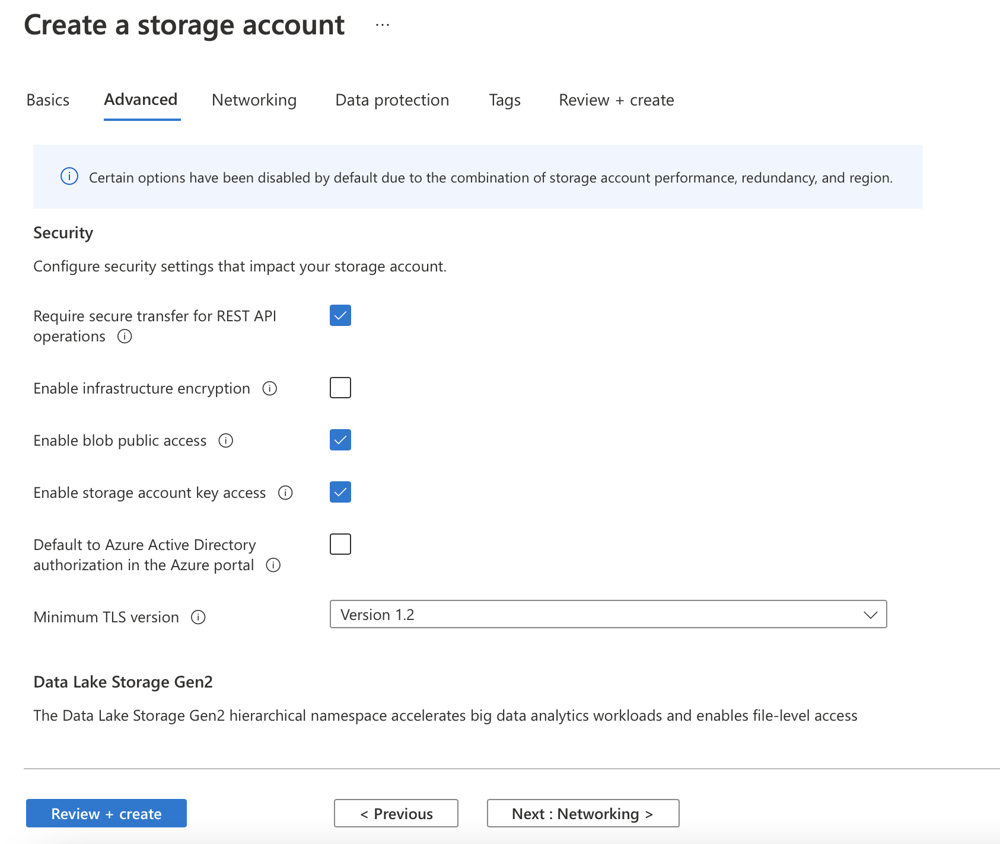
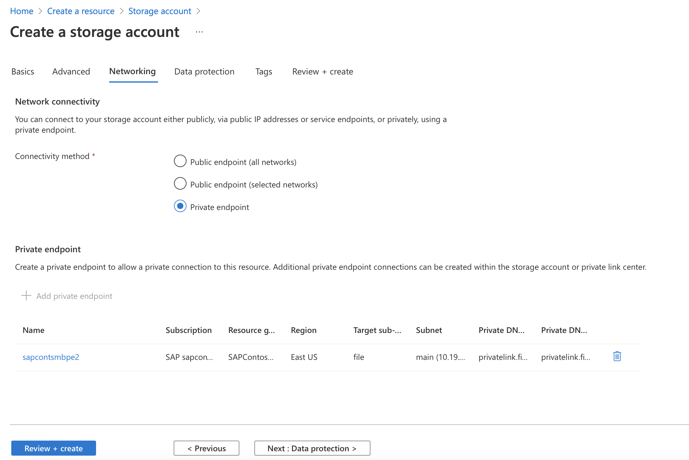
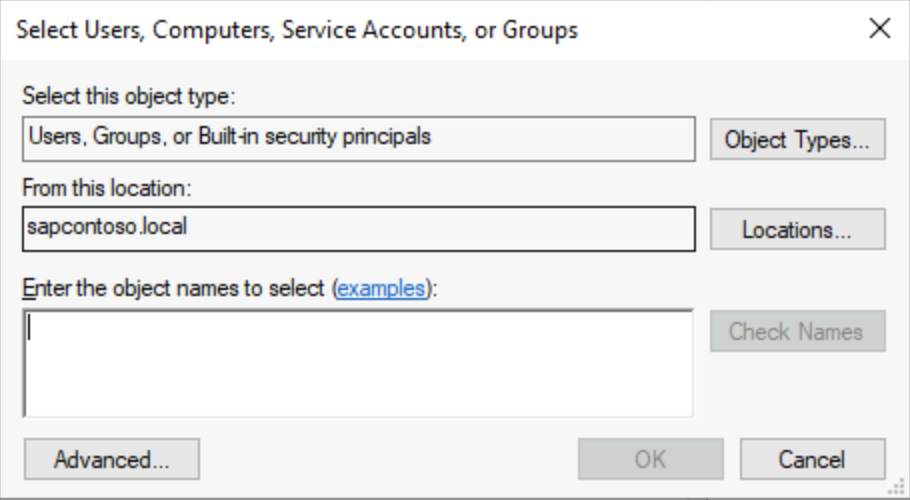
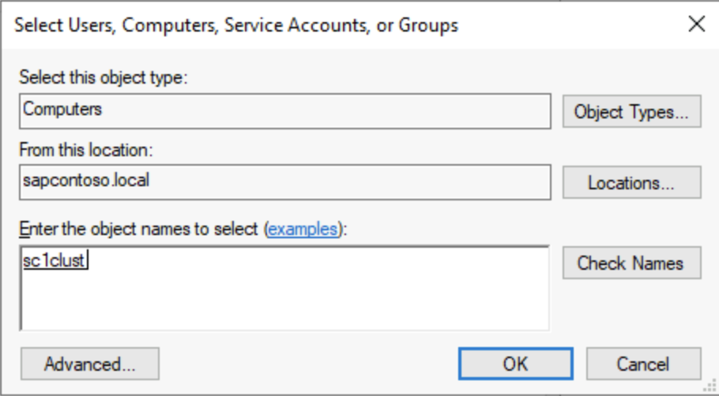
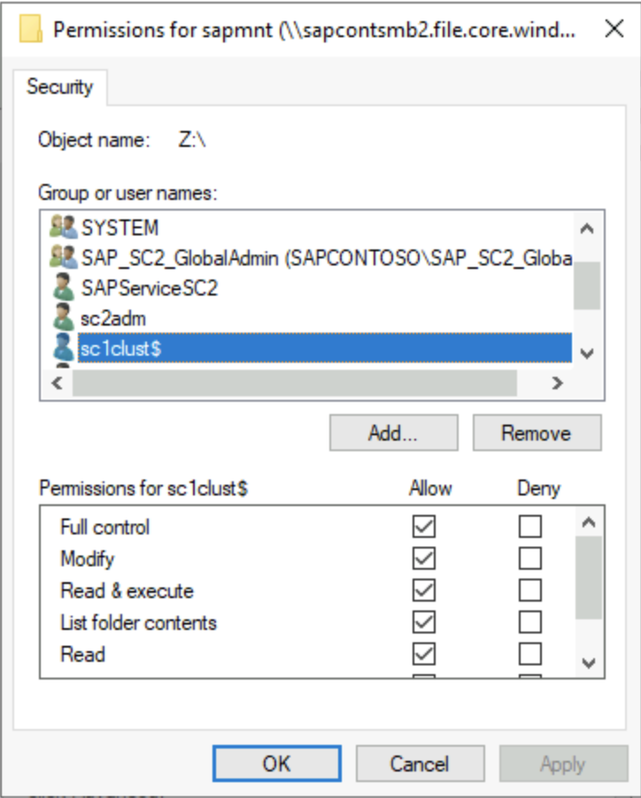
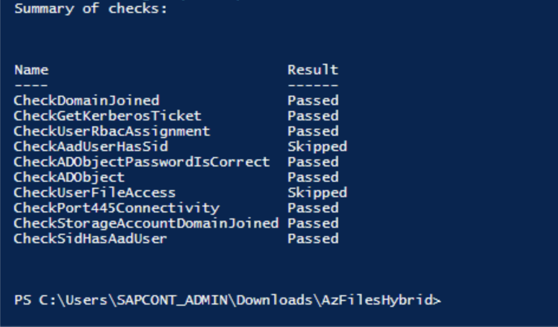
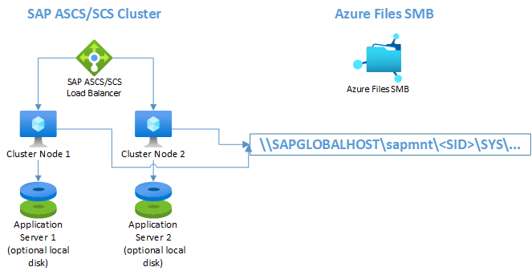
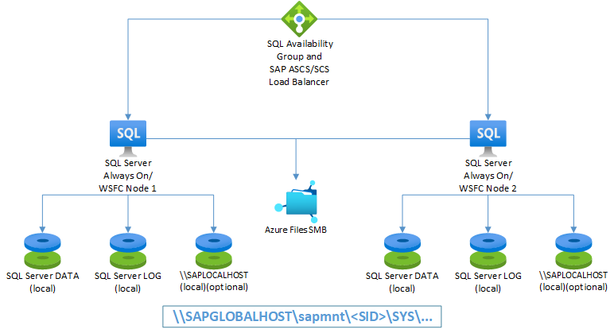

# Install HA SAP NetWeaver with Azure Files SMB

Microsoft and SAP now fully support Azure Files premium Server Message Block (SMB) file shares. SAP Software Provisioning Manager (SWPM) 1.0 SP32 and SWPM 2.0 SP09 (and later) support Azure Files premium SMB storage.

There are special requirements for sizing Azure Files premium SMB shares. This article contains specific recommendations on how to distribute workloads, choose an adequate storage size, and meet minimum installation requirements for Azure Files premium SMB.

High-availability (HA) SAP solutions need a highly available file share for hosting *sapmnt*, *transport*, and *interface* directories. Azure Files premium SMB is a simple Azure platform as a service (PaaS) solution for shared file systems for SAP on Windows environments. You can use Azure Files premium SMB with availability sets and availability zones. You can also use Azure Files premium SMB for disaster recovery (DR) scenarios to another region.  

> [!NOTE]
> Clustering SAP ASCS/SCS instances by using a file share is supported for SAP systems with SAP Kernel 7.22 (and later). For details, see SAP Note [2698948](https://launchpad.support.sap.com/#/notes/2698948).

## Sizing and distribution of Azure Files premium SMB for SAP systems

Evaluate the following points when you're planning the deployment of Azure Files premium SMB:

* The file share name *sapmnt* can be created once per storage account.  It's possible to create additional storage IDs (SIDs) as directories on the same */sapmnt* share, such as */sapmnt/\<SID1\>* and */sapmnt/\<SID2\>*.
* Choose an appropriate size, IOPS, and throughput. A suggested size for the share is 256 GB per SID. The maximum size for a share is 5,120 GB.
* Azure Files premium SMB might not perform well for very large *sapmnt* shares with more than 1 million files per storage account.  Customers who have millions of batch jobs that create millions of job log files should regularly reorganize them, as described in SAP Note [16083][16083]. If needed, you can move or archive old job logs to another Azure Files premium SMB file share. If you expect *sapmnt* to be very large, consider other options (such as Azure NetApp Files).
* We recommend that you use a private network endpoint.
* Avoid putting too many SIDs in a single storage account and its file share.
* As general guidance, don't put together more than four nonproduction SIDs.
* Don't put the entire development, production, and quality assurance system (QAS) landscape in one storage account or file share. Failure of the share leads to downtime of the entire SAP landscape.
* We recommend that you put the *sapmnt* and *transport* directories on different storage accounts, except in smaller systems. During the installation of the SAP primary application server, SAPinst will request the *transport* host name. Enter the FQDN of a different storage account as *<storage_account>.file.core.windows.net*.
* Don't put the file system used for interfaces onto the same storage account as */sapmnt/\<SID>*.
* You must add the SAP users and groups to the *sapmnt* share. Set the Storage File Data SMB Share Elevated Contributor permission for them in the Azure portal.

Distributing *transport*, *interface*, and *sapmnt* among separate storage accounts improves throughput and resiliency. It also simplifies performance analysis. If you put many SIDs and other file systems in a single Azure Files storage account, and the storage account's performance is poor because you're hitting the throughput limits, it's difficult to identify which SID or application is causing the problem.

## Planning

> [!IMPORTANT]
> The installation of SAP HA systems on Azure Files premium SMB with Active Directory integration requires cross-team collaboration. We recommend that the following teams work together to achieve tasks:
>
> * Azure team: Set up and configure storage accounts, script execution, and Active Directory synchronization.
> * Active Directory team: Create user accounts and groups.
> * Basis team: Run SWPM and set access control lists (ACLs), if necessary.

Here are prerequisites for the installation of SAP NetWeaver HA systems on Azure Files premium SMB with Active Directory integration:

* Join the SAP servers to an Active Directory domain.
* Replicate the Active Directory domain that contains the SAP servers to Microsoft Entra ID by using Microsoft Entra Connect.
* Make sure that at least one Active Directory domain controller is in the Azure landscape, to avoid traversing Azure ExpressRoute to contact domain controllers on-premises.
* Make sure that the Azure support team reviews the documentation for Azure Files SMB with [Active Directory integration](../../storage/files/storage-files-identity-auth-active-directory-enable.md#videos). The video shows extra configuration options, which were modified (DNS) and skipped (DFS-N) for simplification reasons. But these are valid configuration options.
* Make sure that the user who's running the Azure Files PowerShell script has permission to create objects in Active Directory.
* Use SWPM version 1.0 SP32 and SWPM 2.0 SP09 or later for the installation. The SAPinst patch must be 749.0.91 or later.
* Install an up-to-date release of PowerShell on the Windows Server instance where the script is run.

## Installation sequence

### Create users and groups

The Active Directory administrator should create, in advance, three domain users with Local Administrator rights and one global group in the local Windows Server Active Directory instance.

*SAPCONT_ADMIN@SAPCONTOSO.local* has Domain Administrator rights and is used to run *SAPinst*, *\<sid>adm*, and *SAPService\<SID>* as SAP system users and the *SAP_\<SAPSID>_GlobalAdmin* group. The SAP Installation Guide contains the specific details required for these accounts.  

> [!NOTE]
> SAP user accounts should not be Domain Administrator. We generally recommend that you don't use *\<sid>adm* to run SAPinst.

### Check Synchronization Service Manager

The Active Directory administrator or Azure administrator should check Synchronization Service Manager in Microsoft Entra Connect. By default, it takes about 30 minutes to replicate to Microsoft Entra ID.

### Create a storage account, private endpoint, and file share

The Azure administrator should complete the following tasks:

1. On the **Basics** tab, create a storage account with either premium zone-redundant storage (ZRS) or locally redundant storage (LRS). Customers with zonal deployment should choose ZRS. Here, the administrator needs to make the choice between setting up a **Standard** or **Premium** account.
  
   

   > [!IMPORTANT]
   > For production use, we recommend choosing a **Premium** account. For non-production use, a **Standard** account should be sufficient.

1. On the **Advanced** tab, the default settings should be OK.

   

1. On the **Networking** tab, the administrator makes the decision to use a private endpoint.

   

   1. Select **Add private endpoint** for the storage account, and then enter the information for creating a private endpoint.

      

   1. If necessary, add a DNS A record into Windows DNS for *<storage_account_name>.file.core.windows.net*. (This might need to be in a new DNS zone.) Discuss this topic with the DNS administrator. The new zone should not update outside an organization.  

      

1. Create the *sapmnt* file share with an appropriate size. The suggested size is 256 GB, which delivers 650 IOPS, 75-MB/sec egress, and 50-MB/sec ingress.

   

1. Download the [Azure Files GitHub](../../storage/files/storage-files-identity-ad-ds-enable.md#download-azfileshybrid-module) content and run the [script](../../storage/files/storage-files-identity-ad-ds-enable.md#run-join-azstorageaccount).

   This script creates either a computer account or a service account in Active Directory. It has the following requirements:

   * The user who's running the script must have permission to create objects in the Active Directory domain that contains the SAP servers. Typically, an organization uses a Domain Administrator account such as *SAPCONT_ADMIN@SAPCONTOSO.local*.
   * Before the user runs the script, confirm that this Active Directory domain user account is synchronized with Microsoft Entra ID. An example of this would be to open the Azure portal and go to Microsoft Entra users, check that the user *SAPCONT_ADMIN@SAPCONTOSO.local* exists, and verify the Microsoft Entra user account.
   * Grant the Contributor role-based access control (RBAC) role to this Microsoft Entra user account for the resource group that contains the storage account that holds the file share. In this example, the user *SAPCONT_ADMIN@SAPCONTOSO.onmicrosoft.com* is granted the Contributor role to the respective resource group.
   * The user should run the script while logged on to a Windows Server instance by using an Active Directory domain user account with the permission as specified earlier.
  
   In this example scenario, the Active Directory administrator would log on to the Windows Server instance as *SAPCONT_ADMIN@SAPCONTOSO.local*. When the administrator is using the PowerShell command `Connect-AzAccount`, the administrator connects as user *SAPCONT_ADMIN@SAPCONTOSO.onmicrosoft.com*. Ideally, the Active Directory administrator and the Azure administrator should work together on this task.
  
   

   

   > [!IMPORTANT]
   > When a user is running the PowerShell script command `Connect-AzAccount`, we highly recommend entering the Microsoft Entra user account that corresponds and maps to the Active Directory domain user account that was used to log on to a Windows Server instance. 

   After the script runs successfully, go to **Storage** > **File Shares** and verify that **Active Directory: Configured** appears.

1. Assign SAP users *\<sid>adm* and *SAPService\<SID>*, and the *SAP_\<SAPSID>_GlobalAdmin* group, to the Azure Files premium SMB file share. Select the role **Storage File Data SMB Share Elevated Contributor** in the Azure portal.
1. Check the ACL on the *sapmnt* file share after the installation. Then add the *DOMAIN\CLUSTER_NAME$* account, *DOMAIN\\\<sid>adm* account, *DOMAIN\SAPService\<SID>* account, and *SAP_\<SID>_GlobalAdmin* group. These accounts and group should have full control of the *sapmnt* directory.

   > [!IMPORTANT]
   > Complete this step before the SAPinst installation. It will be difficult or impossible to change ACLs after SAPinst has created directories and files on the file share.

   The following screenshots show how to add computer machine accounts.

   

   You can find the *DOMAIN\CLUSTER_NAME$* account by selecting **Computers** under **Object types**.  

   

   

   

1. If necessary, move the computer account created for Azure Files to an Active Directory container that doesn't have account expiration. The name of the computer account is the short name of the storage account.

   > [!IMPORTANT]
   > To initialize the Windows ACL for the SMB share, mount the share once to a drive letter.

   The storage key is the password, and the user is *Azure\\\<SMB share name>*.

   

### Complete SAP Basis tasks

An SAP Basis administrator should complete these tasks:

1. [Install the Windows cluster on ASCS/ERS nodes and add the cloud witness](sap-high-availability-infrastructure-wsfc-shared-disk.md#0d67f090-7928-43e0-8772-5ccbf8f59aab).
2. The first cluster node installation asks for the Azure Files SMB storage account name. Enter the FQDN *<storage_account_name>.file.core.windows.net*. If SAPinst doesn't accept more than 13 characters, the SWPM version is too old.
3. [Modify the SAP profile of the ASCS/SCS instance](sap-high-availability-installation-wsfc-shared-disk.md#10822f4f-32e7-4871-b63a-9b86c76ce761).
4. [Update the probe port for the SAP \<SID> role in Windows Server Failover Cluster (WSFC)](sap-high-availability-installation-wsfc-shared-disk.md#10822f4f-32e7-4871-b63a-9b86c76ce761).
5. Continue with SWPM installation for the second ASCS/ERS node. SWPM requires only the path of the profile directory. Enter the full UNC path to the profile directory.
6. Enter the UNC profile path for the database and for the installation of the primary application server (PAS) and additional application server (AAS).
7. The PAS installation asks for the *transport* host name. Provide the FQDN of a separate storage account name for the *transport* directory.
8. Verify the ACLs on the SID and *transport* directory.

## Disaster recovery setup

Azure Files premium SMB supports disaster recovery scenarios and cross-region replication scenarios. All data in Azure Files premium SMB directories can be continuously synchronized to a DR region's storage account. For more information, see the procedure for synchronizing files in [Transfer data with AzCopy and file storage](../../storage/common/storage-use-azcopy-files.md#synchronize-files).

After a DR event and failover of the ASCS instance to the DR region, change the `SAPGLOBALHOST` profile parameter to point to Azure Files SMB in the DR region. Perform the same preparation steps on the DR storage account to join the storage account to Active Directory and assign RBAC roles for SAP users and groups.

## Troubleshooting

The PowerShell scripts that you downloaded earlier contain a debug script to conduct basic checks for validating the configuration.

```powershell
Debug-AzStorageAccountAuth -StorageAccountName $StorageAccountName -ResourceGroupName $ResourceGroupName -Verbose
```

Here's a PowerShell screenshot of the debug script output.



The following screenshot shows the technical information to validate a successful domain join.


## Useful links and resources

* [SAP Note 2273806][2273806] (SAP support for solutions related to storage or file systems)
* [Install SAP NetWeaver high availability on a Windows failover cluster and file share for SAP ASCS/SCS instances on Azure](./sap-high-availability-installation-wsfc-file-share.md)
* [Azure Virtual Machines high-availability architecture and scenarios for SAP NetWeaver](./sap-high-availability-architecture-scenarios.md)
* [Add a probe port in an ASCS cluster configuration](sap-high-availability-installation-wsfc-file-share.md)

[16083]:https://launchpad.support.sap.com/#/notes/16083
[2273806]:https://launchpad.support.sap.com/#/notes/2273806

## Optional configurations

The following diagrams show multiple SAP instances on Azure VMs running Windows Server Failover Cluster to reduce the total number of VMs.

This configuration can be either local SAP application servers on an SAP ASCS/SCS cluster or an SAP ASCS/SCS cluster role on Microsoft SQL Server Always On nodes.

> [!IMPORTANT]
> Installing a local SAP application server on a SQL Server Always On node is not supported.

Both SAP ASCS/SCS and the Microsoft SQL Server database are single points of failure (SPOFs). Using Azure Files SMB helps protect these SPOFs in a Windows environment.

Although the resource consumption of the SAP ASCS/SCS is fairly small, we recommend a reduction of the memory configuration by 2 GB for either SQL Server or the SAP application server.

### <a name="5121771a-7618-4f36-ae14-ccf9ee5f2031"></a>SAP application servers on WSFC nodes using Azure Files SMB

The following diagram shows SAP application servers locally installed.



> [!NOTE]
> The diagram shows the use of additional local disks. This setup is optional for customers who won't install application software on the OS drive (drive C).

### <a name="01541cf2-0a03-48e3-971e-e03575fa7b4f"></a> SAP ASCS/SCS on SQL Server Always On nodes using Azure Files SMB

The following diagram shows Azure Files SMB with local SQL Server setup.

> [!IMPORTANT]
> Using Azure Files SMB for any SQL Server volume is not supported.



> [!NOTE]
> The diagram shows the use of additional local disks. This setup is optional for customers who won't install application software on the OS drive (drive C).
