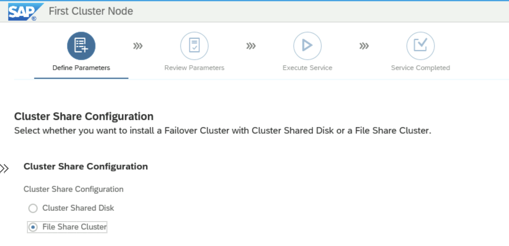
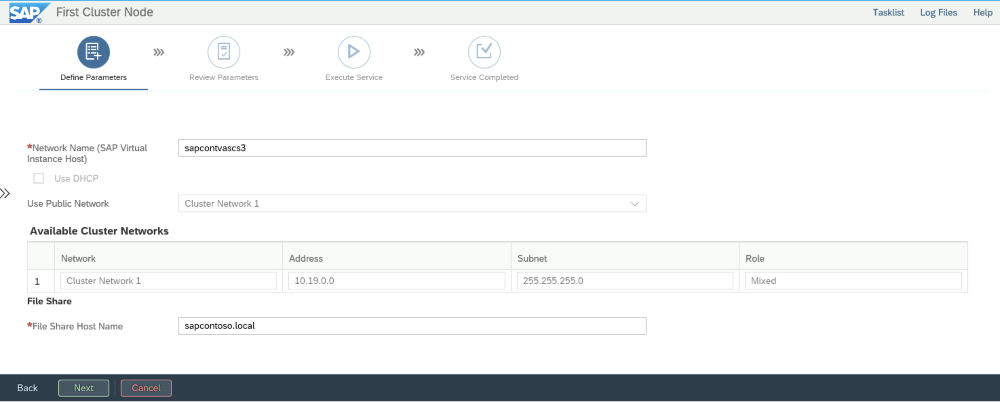
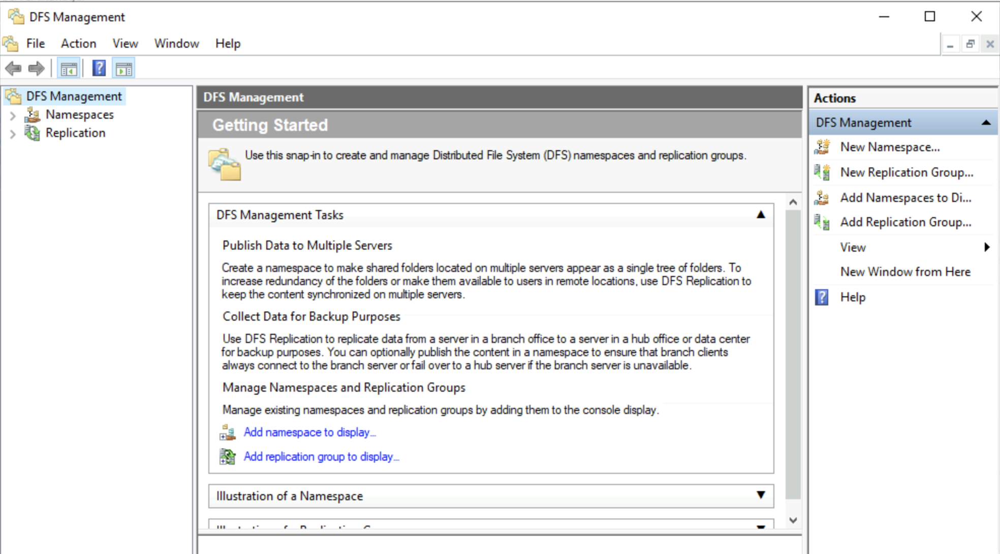
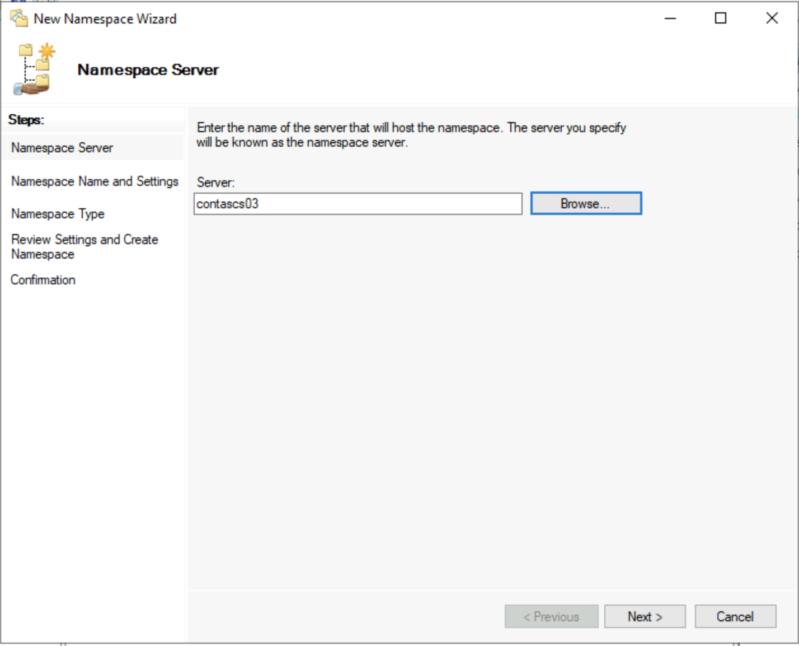
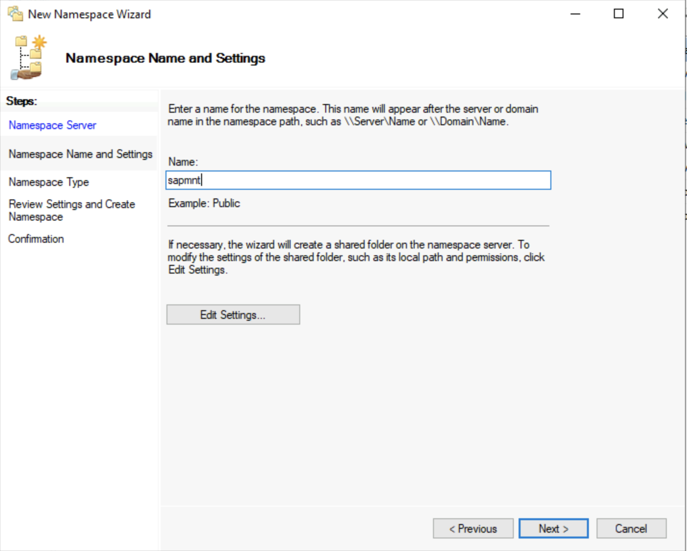
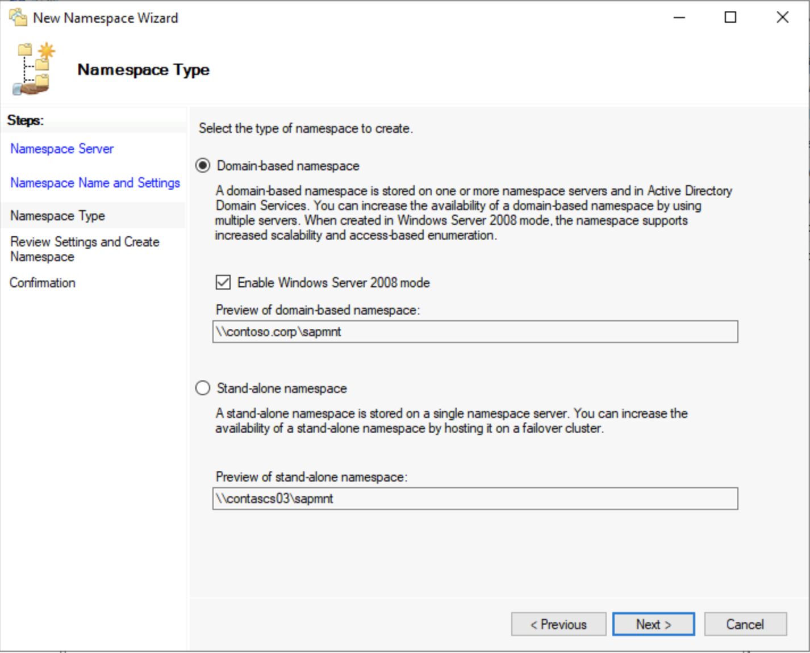
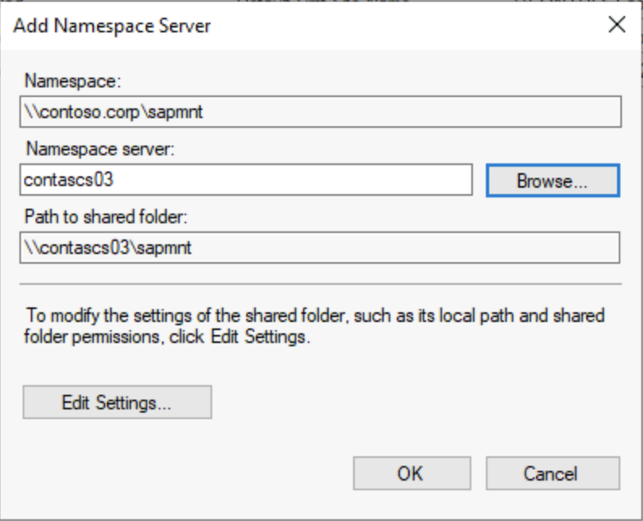
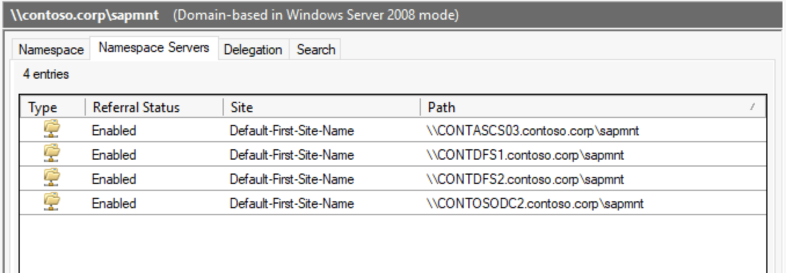
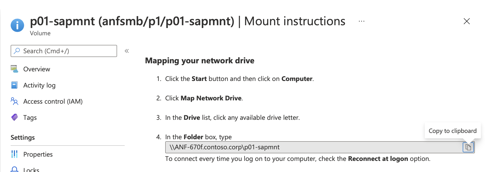
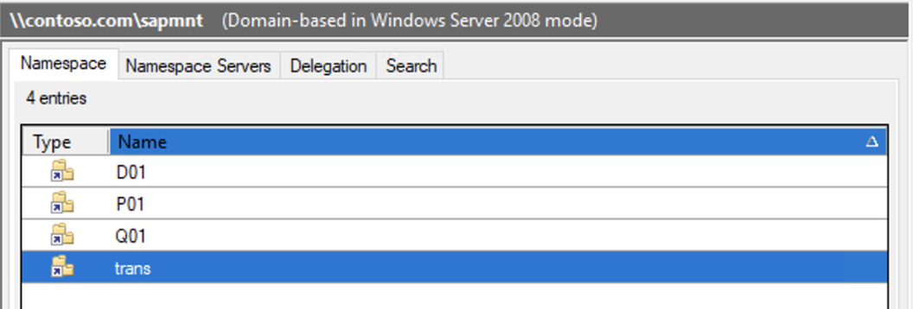

# Using Windows DFS-N to support flexible SAPMNT share creation for SMB-based file share

## Introduction

SAP instances like ASCS/SCS based on WSFC require SAP files being installed on a shared drive. SAP supports either a Cluster Shared Disks or a File Share Cluster to host these files.

SWPM selection screen for Cluster Share configuration option

For installations based on **Azure NetApp Files SMB**, the option File Share Cluster needs to be selected. In the follow-up screen, the File Share Host Name needs to be supplied.

SWPM selection screen for Cluster Share Host Name configuration

The Cluster Share Host Name is based on the chosen installation option. For Azure NetApp Files SMB, it is the used to join the NetApp account to the Active Directory of the installation. In SAP terms, this name is the so called **SAPGLOBALHOST**.
SWPM internally adds **sapmnt** to the host name resulting in the **\\\SAPGLOBALHOST\sapmnt**  share. Unfortunately **sapmnt** can only be created once per either NetApp account. This is restrictive. DFS-N can be used to create virtual share names, that can be assigned to differently named shares. Rather than having to use **sapmnt** as the share name as mandated by SWPM, a unique name like **sapmnt-sid** can be used. The same is valid for the global transport directory. Since trans is the expected name of global transport directory, the **SAP DIR_TRANS** profile parameter in the **DEFAULT.PFL** profile needs to be adjusted.

As an example the following shares can be created by using DFS-N:  

**\\\contoso.local\sapmnt\\D01** pointing to **\\\ANF-670f.contoso.corp\\d01-sapmnt**  

**\\\contoso.local\sapmnt\\erp-trans** pointing to **\\\ANF-670f.contoso.corp\\erp-trans**  
with **DIR_TRANS = \\\contoso.local\sapmnt\erp-trans in the DEFAULT.PFL profile**.

## Microsoft DFS-N

[DFS Namespaces overview](/windows-server/storage/dfs-namespaces/dfs-overview) provides an introduction and the installation instructions for DFS-N

## Setting up Folder Targets for Azure NetApp Files SMB

 Folder Targets for Azure NetApp Files SMB are volumes technically created the same way as described in [High availability for SAP NetWeaver on Azure VMs on Windows with Azure NetApp Files(SMB) for SAP applications](./high-availability-guide-windows-netapp-files-smb.md) without using DFS-N. 
Portal screenshot with existing ANF volumes.

## Configuring DFS-N for SAPMNT

The following sequence shows the individual steps of initially configuring DFS-N. 

Start the **DFS Management console** from the **Windows Administrative Tools** in the Windows Server Start Menu.

This screen shows the opening DFS screen.

In this screen an AD joined Windows Server with DFS installed has to be selected.

In this screen the name of the second part of the Namespace root is defined. In this screen **sapmnt** has to be supplied, which is part of the SAP naming convention.

In this step, the Namespace type is defined. This input also determines the name of the first part of Namespace root. DFS supports domain-based or stand-alone namespaces. In a Windows-based installation, domain-based is the default. Therefore the setup of the namespace server needs to be domain-based. Based on this choice, the domain name will become the first part of the Namespace root. So here the AD/domain name is **contoso.corp**, the Namespace root is therefore **\\\contoso.corp\sapmnt**.

Under the Namespace root, numerous Namespace folders can be created. Each of them points to a Folder Target. While the name of the Folder Target can be chosen freely, the name of the Namespace folder has to match a valid SAP SID. In combination, this will create a valid SWPM compliant UNC share. This mechanism is also be used to create the trans-directory in order to provide a SAP transport directory.

The screenshot shows an example for such a configuration.

## Adding additional DFS namespace servers to increase resiliency

The domain-based Namespace server setup easily allows adding extra Namespace servers. Similar to having multiple domain controllers for redundancy in Active Directories where critical information is replicated between the domain controllers, adding extra Namespace servers does the same for DFS-N. This is allowed for domain controllers, locally for cluster nodes or stand-alone domain-joined servers. Before using any of them the DFS-N Role need to be installed.

By **right-clicking** on the **Namespace root**, the **Add Namespace Server** dialog is opened.

In this screen, the name of the Namespace server can be directly supplied. Alternatively the Browse button can be pushed to list already existing servers will be shown.

Overview of existing Namespace servers.

## Adding folders to Azure NetApp Files SMB-based Namespace root

The following sequence shows how create folders in DFS-N and assign them to Folder Targets.

In the DFS Management console, right-click on the Namespace root and select New Folder 

This step opens the New Folder dialog. Supply either a valid SID like in this case **P01** or use **trans** if the intention is to create a transport directory.

In the portal, get the mount instructions for the volume you want to use as a folder target and copy the UNC name and paste as shown above.

This screen shows as an example the folder setup for an SAP landscape.