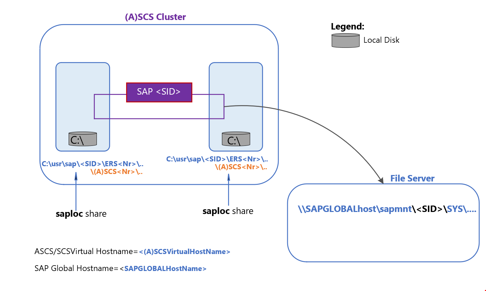
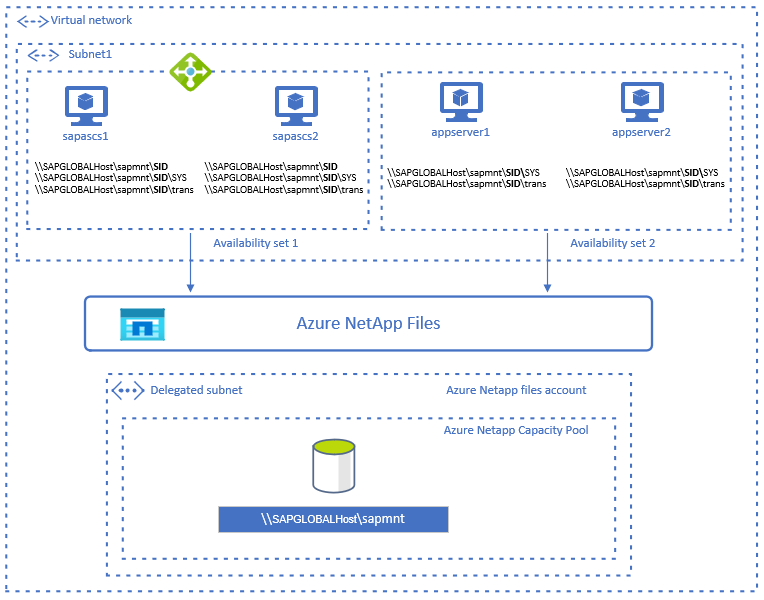
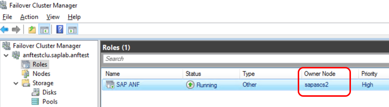

# High availability for SAP NetWeaver on Azure VMs on Windows with Azure NetApp Files(SMB) for SAP applications

[dbms-guide]:dbms-guide-general.md
[deployment-guide]:deployment-guide.md
[planning-guide]:planning-guide.md
[dfs-n-reference]:high-availability-guide-windows-dfs.md

[anf-azure-doc]:../../azure-netapp-files/azure-netapp-files-introduction.md
[anf-avail-matrix]:https://azure.microsoft.com/global-infrastructure/services/?products=storage&regions=all
[anf-sap-applications-azure]:https://www.netapp.com/us/media/tr-4746.pdf

[2205917]:https://launchpad.support.sap.com/#/notes/2205917
[1944799]:https://launchpad.support.sap.com/#/notes/1944799
[1928533]:https://launchpad.support.sap.com/#/notes/1928533
[2015553]:https://launchpad.support.sap.com/#/notes/2015553
[2178632]:https://launchpad.support.sap.com/#/notes/2178632
[2191498]:https://launchpad.support.sap.com/#/notes/2191498
[2243692]:https://launchpad.support.sap.com/#/notes/2243692
[1984787]:https://launchpad.support.sap.com/#/notes/1984787
[1999351]:https://launchpad.support.sap.com/#/notes/1999351
[1410736]:https://launchpad.support.sap.com/#/notes/1410736

[sap-swcenter]:https://support.sap.com/en/my-support/software-downloads.html

[suse-ha-guide]:https://www.suse.com/products/sles-for-sap/resource-library/sap-best-practices/
[suse-drbd-guide]:https://www.suse.com/documentation/sle-ha-12/singlehtml/book_sleha_techguides/book_sleha_techguides.html
[suse-ha-12sp3-relnotes]:https://www.suse.com/releasenotes/x86_64/SLE-HA/12-SP3/

[template-multisid-xscs]:https://portal.azure.com/#create/Microsoft.Template/uri/https%3A%2F%2Fraw.githubusercontent.com%2FAzure%2Fazure-quickstart-templates%2Fmaster%2Fapplication-workloads%2Fsap%2Fsap-3-tier-marketplace-image-multi-sid-xscs-md%2Fazuredeploy.json
[template-converged]:https://portal.azure.com/#create/Microsoft.Template/uri/https%3A%2F%2Fraw.githubusercontent.com%2FAzure%2Fazure-quickstart-templates%2Fmaster%2Fapplication-workloads%2Fsap%2Fsap-3-tier-marketplace-image-converged-md%2Fazuredeploy.json
[template-file-server]:https://portal.azure.com/#create/Microsoft.Template/uri/https%3A%2F%2Fraw.githubusercontent.com%2FAzure%2Fazure-quickstart-templates%2Fmaster%2Fapplication-workloads%2Fsap%2Fsap-file-server-md%2Fazuredeploy.json

[sap-hana-ha]:sap-hana-high-availability.md
[nfs-ha]:high-availability-guide-suse-nfs.md

This article describes how to deploy, configure the virtual machines, install the cluster framework, and install a highly available SAP NetWeaver 7.50 system  on Windows VMs, using [SMB](/windows/win32/fileio/microsoft-smb-protocol-and-cifs-protocol-overview) on [Azure NetApp Files](../../azure-netapp-files/azure-netapp-files-introduction.md).  

The database layer isn't covered in detail in this article. We assume that the Azure [virtual network](../../virtual-network/virtual-networks-overview.md) has already been created.  

Read the following SAP Notes and papers first:

* [Azure NetApp Files documentation][anf-azure-doc] 
* SAP Note [1928533][1928533], which contains:  
  * A list of Azure VM sizes that are supported for the deployment of SAP software
  * Important capacity information for Azure VM sizes
  * Supported SAP software, and operating system (OS) and database combinations
  * Required SAP kernel version for Windows on Microsoft Azure
* SAP Note [2015553][2015553] lists prerequisites for SAP-supported SAP software deployments in Azure.
* SAP Note [2178632][2178632] has detailed information about all monitoring metrics reported for SAP in Azure.
* SAP Note [1999351][1999351] has additional troubleshooting information for the Azure Enhanced Monitoring Extension for SAP.
* SAP Note [2287140](https://launchpad.support.sap.com/#/notes/2287140) lists prerequisites for  SAP-supported CA feature of SMB 3.x protocol.
* SAP Note [2802770](https://launchpad.support.sap.com/#/notes/2802770) has troubleshooting information for the slow running SAP transaction AL11 on Windows 2012 and 2016.
* SAP Note [1911507](https://launchpad.support.sap.com/#/notes/1911507) has information about transparent failover feature for a file share on Windows Server with the SMB 3.0 protocol.
* SAP Note [662452](https://launchpad.support.sap.com/#/notes/662452) has recommendation(deactivating 8.3 name generation) to address Poor file system performance/errors during data accesses.
* [Install SAP NetWeaver high availability on a Windows failover cluster and file share for SAP ASCS/SCS instances on Azure](./sap-high-availability-installation-wsfc-file-share.md) 
* [Azure Virtual Machines high-availability architecture and scenarios for SAP NetWeaver](./sap-high-availability-architecture-scenarios.md)
* [Add probe port in ASCS cluster configuration](sap-high-availability-installation-wsfc-file-share.md)
* [Create an SMB volume for Azure NetApp Files](../../azure-netapp-files/create-active-directory-connections.md#requirements-for-active-directory-connections)
* [NetApp SAP Applications on Microsoft Azure using Azure NetApp Files][anf-sap-applications-azure] 

## Overview

SAP developed a new approach, and an alternative to cluster shared disks, for clustering an SAP ASCS/SCS instance on a Windows failover cluster. Instead of using cluster shared disks, one can use an SMB file share to deploy SAP global host files. Azure NetApp Files supports SMBv3 (along with NFS) with NTFS ACL using Active Directory. Azure NetApp Files is automatically highly available (as it is a PaaS service). These features make Azure NetApp Files great option for hosting the SMB file share for SAP global.  
Both [Azure Active Directory (AD) Domain Services](../../active-directory-domain-services/overview.md) and [Active Directory Domain Services (AD DS)](/windows-server/identity/ad-ds/get-started/virtual-dc/active-directory-domain-services-overview) are supported. You can use existing Active Directory domain controllers with Azure NetApp Files. Domain controllers can be in Azure as virtual machines, or on premises via ExpressRoute or S2S VPN. In this article, we will use Domain controller in an Azure VM.  
High availability(HA) for SAP Netweaver central services requires shared storage. To achieve that on Windows, so far it was necessary to build either SOFS cluster or use cluster shared disk s/w like SIOS. Now it is possible to achieve SAP Netweaver HA by using shared storage, deployed on Azure NetApp Files. Using Azure NetApp Files for the shared storage eliminates the need for either SOFS or SIOS.  

> [!NOTE]
> Clustering SAP ASCS/SCS instances by using a file share is supported for SAP systems with SAP Kernel 7.22 (and later). For details see SAP note [2698948](https://launchpad.support.sap.com/#/notes/2698948)    

The prerequisites for an SMB file share are:
* SMB 3.0 (or later) protocol.
* Ability to set Active Directory access control lists (ACLs) for Active Directory user groups and the computer$ computer object.
* The file share must be HA-enabled.

The share for the SAP Central services in this reference architecture is offered by Azure NetApp Files:

## Create and mount SMB volume for Azure NetApp Files

Perform the following steps, as preparation for using Azure NetApp Files.  

1. Create Azure NetApp account, following the steps described in  [Create a NetApp account](../../azure-netapp-files/azure-netapp-files-create-netapp-account.md)  
2. Set up capacity pool, following the instructions in [Set up a capacity pool](../../azure-netapp-files/azure-netapp-files-set-up-capacity-pool.md)
3. Azure NetApp Files resources must reside in delegated subnet. Follow the instructions in [Delegate a subnet to Azure NetApp Files](../../azure-netapp-files/azure-netapp-files-delegate-subnet.md) to create delegated subnet.  

   > [!IMPORTANT]
   > You need to create Active Directory connections before creating an SMB volume. Review the [requirements for Active Directory connections](../../azure-netapp-files/create-active-directory-connections.md#requirements-for-active-directory-connections).  
   >   
   > When creating the Active Directory connection, make sure to enter SMB Server (Computer Account) Prefix no longer than 8 characters to avoid the 13 characters hostname limitation for SAP Applications (a suffix is automatically added to the SMB Computer Account name).     
   > The hostname limitations for SAP applications are described in [2718300 - Physical and Virtual hostname length limitations](https://launchpad.support.sap.com/#/notes/2718300) and [611361 - Hostnames of SAP ABAP Platform servers](https://launchpad.support.sap.com/#/notes/611361).  

4. Create Active Directory connection, as described in [Create an Active Directory connection](../../azure-netapp-files/create-active-directory-connections.md#create-an-active-directory-connection). Make sure to add the user that will run SWPM to install the SAP system, as `Administrators privilege user` in the Active Directory connection. If you don't add the SAP installation user as `Administrators privilege user` in the Active Directory connection, SWPM will fail with permission errors, unless you run SWPM as user with elevated Domain Admin rights.  
6. Create SMB Azure NetApp Files SMB volume, following the instructions in [Add an SMB volume](../../azure-netapp-files/azure-netapp-files-create-volumes-smb.md#add-an-smb-volume).   
7. Mount the SMB volume on your Windows Virtual Machine.  

> [!TIP]
> For instructions on how to mount the Azure NetApp Files volume, sign in to the [Azure portal](https://portal.azure.com), then navigate to the Azure NetApp Files object, select the **Volumes** blade, then select **Mount Instructions**.  

### Important considerations

When considering Azure NetApp Files for the SAP Netweaver architecture, be aware of the following important considerations:

- The minimum capacity pool is 4 TiB. The capacity pool size can be increased in 1 TiB increments.
- The minimum volume is 100 GiB
- The selected virtual network must have a subnet, delegated to Azure NetApp Files.
- The throughput and performance characteristics of an Azure NetApp Files volume is a function of the volume quota and service level, as documented in [Service level for Azure NetApp Files](../../azure-netapp-files/azure-netapp-files-service-levels.md). While sizing the SAP Azure NetApp volumes, make sure that the resulting throughput meets the application requirements.  
 

## Prepare the infrastructure for SAP HA by using a Windows failover cluster 

1. [Set the ASCS/SCS load balancing rules for the Azure internal load balancer](./sap-high-availability-infrastructure-wsfc-shared-disk.md#fe0bd8b5-2b43-45e3-8295-80bee5415716).
2. [Add Windows virtual machines to the domain](./sap-high-availability-infrastructure-wsfc-shared-disk.md#e69e9a34-4601-47a3-a41c-d2e11c626c0c).
3. [Add registry entries on both cluster nodes of the SAP ASCS/SCS instance](./sap-high-availability-infrastructure-wsfc-shared-disk.md#661035b2-4d0f-4d31-86f8-dc0a50d78158)
4. [Set up a Windows Server failover cluster for an SAP ASCS/SCS instance](./sap-high-availability-infrastructure-wsfc-shared-disk.md#0d67f090-7928-43e0-8772-5ccbf8f59aab)
5. If you are using Windows Server 2016, we recommend that you configure [Azure Cloud Witness](/windows-server/failover-clustering/deploy-cloud-witness).

## Install SAP ASCS instance on both nodes

You need the following software from SAP:
   * SAP Software Provisioning Manager (SWPM) installation tool version SPS25 or later.
   * SAP Kernel 7.22 or later
   * Create a virtual host name (cluster network name)  for the clustered SAP ASCS/SCS instance, as described in [Create a virtual host name for the clustered SAP ASCS/SCS instance](./sap-high-availability-installation-wsfc-shared-disk.md#a97ad604-9094-44fe-a364-f89cb39bf097).

### Install an ASCS/SCS instance on the first ASCS/SCS cluster node

1. Install an SAP ASCS/SCS instance on the first cluster node. Start the SAP SWPM installation tool, then navigate to:
**Product** > **DBMS** > Installation > Application Server ABAP (or Java) > High-Availability System > ASCS/SCS instance > First cluster node.  

2. Select **File Share Cluster** as the Cluster share Configuration in SWPM.  
3. When prompted at step **SAP System Cluster Parameters**, enter the host name for the Azure NetApp Files SMB share you already created as **File Share Host Name**.  In this example, the SMB share host name is **anfsmb-9562**. 

   > [!IMPORTANT]
   > If Pre-requisite checker Results in SWPM shows Continuous availability feature condition not met, it  can be addressed by following the instructions in [Delayed error message when you try to access a shared folder that no longer exists in Windows](https://support.microsoft.com/help/2820470/delayed-error-message-when-you-try-to-access-a-shared-folder-that-no-l).  

   > [!TIP]
   > If Pre-requisite checker Results in SWPM shows Swap Size condition not met, you can adjust the SWAP size by navigating to My Computer>System Properties>Performance Settings> Advanced> Virtual memory> Change.  

4. Configure an SAP cluster resource, the `SAP-SID-IP` probe port, by using PowerShell. Execute this configuration on one of the SAP ASCS/SCS cluster nodes, as described in [Configure probe port](./sap-high-availability-installation-wsfc-shared-disk.md#10822f4f-32e7-4871-b63a-9b86c76ce761).

### Install an ASCS/SCS instance on the second ASCS/SCS cluster node

1. Install an SAP ASCS/SCS instance on the second cluster node. Start the SAP SWPM installation tool, then navigate to **Product** > **DBMS** > Installation > Application Server ABAP (or Java) > High-Availability System > ASCS/SCS instance > Additional cluster node.  

### Update the SAP ASCS/SCS instance profile

Update parameters in the SAP ASCS/SCS instance profile \<SID>_ASCS/SCS\<Nr>_\<Host>.

| Parameter name | Parameter value |
| --- | --- |
| gw/netstat_once | **0** |
| enque/encni/set_so_keepalive  | **true** |
| service/ha_check_node | **1** |

Parameter `enque/encni/set_so_keepalive` is only needed if using ENSA1.  
Restart the SAP ASCS/SCS instance. 
Set `KeepAlive` parameters on both SAP ASCS/SCS cluster nodes follow the instructions to [Set registry entries on the cluster nodes of the SAP ASCS/SCS instance](./sap-high-availability-infrastructure-wsfc-shared-disk.md#661035b2-4d0f-4d31-86f8-dc0a50d78158). 

### Install a DBMS instance and SAP application servers

Complete your SAP installation, by installing:

   * A DBMS instance  
   * A primary SAP application server  
   * An additional SAP application server  

## Test the SAP ASCS/SCS instance failover 

### Fail over from cluster node A to cluster node B and back
In this test scenario we'll refer to cluster node sapascs1 as node A,  and to cluster node sapascs2 as node B.

1. Verify that the cluster resources are running on node A. 
  

2. Restart cluster node A. The SAP cluster resources will move to cluster node B. 
  

## Lock entry test

1.Verify that the SAP Enqueue Replication Server (ERS) is active  
2. Log on to the SAP system, execute transaction SU01 and open a user ID in change mode. That will generate SAP lock entry.  
3. As you're logged in the SAP system, display the lock entry, by navigating to transaction ST12.  
4. Fail over ASCS resources from cluster node A to cluster node B.  
5. Verify that the lock entry, generated before the SAP ASCS/SCS cluster resources failover is retained.  

  

For more information, see [Troubleshooting for Enqueue Failover in ASCS with ERS](https://wiki.scn.sap.com/wiki/display/SI/Troubleshooting+for+Enqueue+Failover+in+ASCS+with+ERS)

## Optional configurations

The following diagrams show multiple SAP instances on Azure VMs running Microsoft Windows Failover Cluster to reduce the total number of VMs.

This can either be local SAP Application Servers on a SAP ASCS/SCS cluster or a SAP ASCS/SCS Cluster Role on Microsoft SQL Server Always On nodes.

> [!IMPORTANT]
> Installing a local SAP Application Server on a SQL Server Always On node is not supported.
>

Both, SAP ASCS/SCS and the Microsoft SQL Server database, are single points of failure (SPOF). To protect these SPOFs in a Windows environment Azure NetApp Files SMB is used.

While the resource consumption of the SAP ASCS/SCS is fairly small, a reduction of the memory configuration for either SQL Server or the SAP Application Server by 2 GB is recommended.

### SAP Application Servers on WSFC nodes using NetApp Files SMB

![Figure 4: Windows Server failover clustering configuration in Azure with Windows NetApp Files SMB and locally installed SAP Application Server][sap-ha-guide-figure-8007A]

> [!NOTE]
> The picture shows the use of additional local disks. This is optional for customers who will not install application software on the OS drive (C:\)
>
###  SAP ASCS/SCS on SQL Server Always On nodes using Azure NetApp Files SMB

> [!IMPORTANT]
> Using Azure NetApp Files SMB for any SQL Server volume is not supported.
> 

![Figure : SAP ASCS/SCS on SQL Server Always On nodes using Azure NetApp Files SMB][sap-ha-guide-figure-8007B]

> [!NOTE]
> The picture shows the use of additional local disks. This is optional for customers who will not install application software on the OS drive (C:\)
>
### Using Windows DFS-N to support flexible SAPMNT share creation for SMB based file share
Using DFS-N allows you to utilize individual sapmnt volumes for SAP systems deployed within the same Azure region and subscription. [Using Windows DFS-N to support flexible SAPMNT share creation for SMB-based file share][dfs-n-reference] shows how to set this up.

## Next steps

* [Azure Virtual Machines planning and implementation for SAP][planning-guide]
* [Azure Virtual Machines deployment for SAP][deployment-guide]
* [Azure Virtual Machines DBMS deployment for SAP][dbms-guide]
* To learn how to establish high availability and plan for disaster recovery of SAP 
* HANA on Azure (large instances), see [SAP HANA (large instances) high availability and disaster recovery on Azure](../../virtual-machines/workloads/sap/hana-overview-high-availability-disaster-recovery.md).
* To learn how to establish high availability and plan for disaster recovery of SAP HANA on Azure VMs, see [High Availability of SAP HANA on Azure Virtual Machines (VMs)][sap-hana-ha]

[sap-ha-guide-figure-8007A]:./media/virtual-machines-shared-sap-high-availability-guide/ha-smb-as.png
[sap-ha-guide-figure-8007B]:./media/virtual-machines-shared-sap-high-availability-guide/ha-sql-ascs-smb.png
