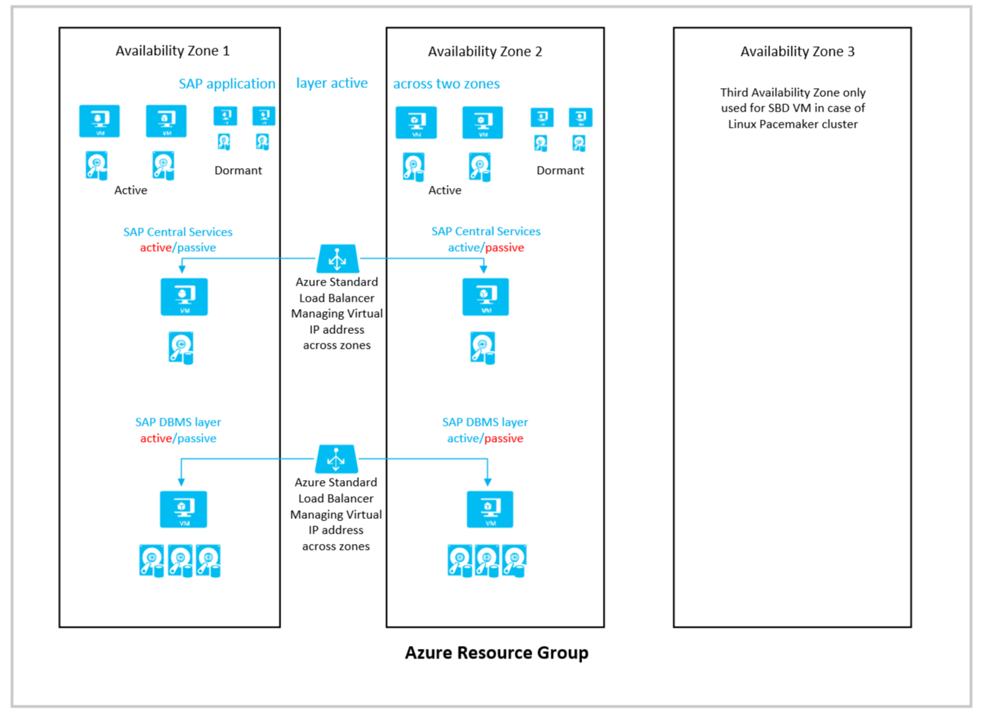
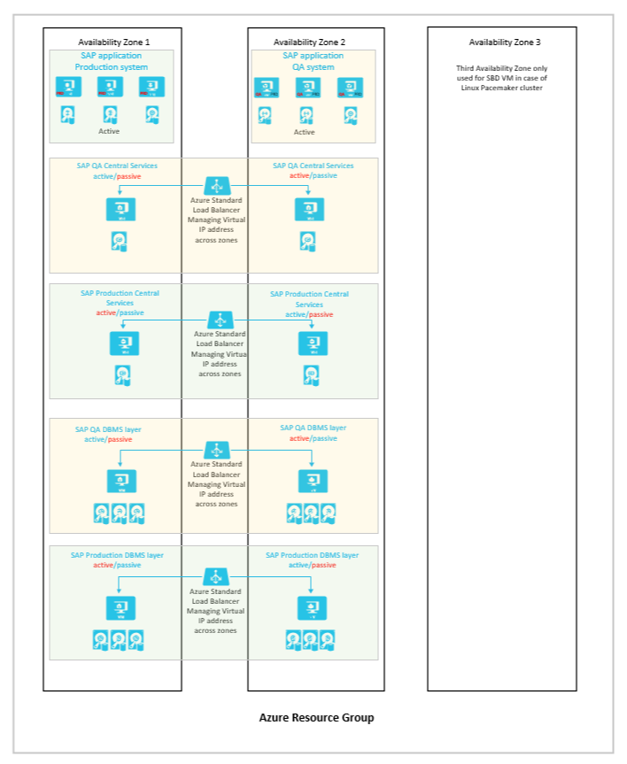

# SAP workload configurations with Azure Availability Zones

Deployment of the different SAP architecture layers across [Azure Availability Zones](../../reliability/availability-zones-overview.md) is the recommended architecture for SAP workload deployments on Azure. An Azure Availability Zone is defined as: "Unique physical locations within a region. Each zone is made up of one or more datacenters equipped with independent power, cooling, and networking". Azure Availability Zones aren't available in all regions. For Azure regions that provide Availability Zones, check the [Azure region map](https://azure.microsoft.com/global-infrastructure/geographies/). The article lists which regions provide Availability Zones. Most of the Azure regions that are equipped to host larger SAP workload are providing Availability Zones. New Azure regions are providing Availability Zones from the start. Some of older regions were or are  in the process getting retrofitted with Availability Zones. 

As of the typical SAP NetWeaver or S/4HANA architecture, you need to protect three different layers:

- The SAP application layer, which can be one to a few dozen Virtual Machines (VM). You want to minimize the chance of VMs getting deployed on the same host server. You also want those VMs in an acceptable proximity to the database layer to keep network latency in an acceptable window
- The SAP ASCS/SCS layer that is representing a single point of failure in the SAP NetWeaver and S/4HANA architecture. You usually look at two VMs that you want to cover with a failover framework. Therefore, these VMs should be allocated in different infrastructure fault domains
- The SAP database layer, which represents a single point of failure as well. In the usual cases, it consists out of two VMs that are covered by a failover framework. Therefore, these VMs should be allocated in different infrastructure fault domains. Exceptions are SAP HANA scale-out deployments where more than two VMs are can be used

The major differences between deploying your critical VMs through availability sets or Availability Zones are:

- Deploying with an availability set is lining up the VMs within the set in a single zone or datacenter (whatever applies for the specific region). As a result the deployment through the availability set isn't protected by power, cooling or networking issues that affect the datacenter(s) of the zone as a whole. With availability sets, there's also no forced alignment between a VM and its disks. Means, the disks can be in any datacenter of the Azure region, independent of the zonal structure of the region. On the plus side, the VMs are aligned with update and fault domains within that zone or datacenter. Specifically for the SAP ASCS or database layer where we protect two VMs per availability set, the alignment with fault domains prevents that both VMs are ending up on the same host hardware.
- On deploying VMs through Azure Availability Zones and choosing different zones (maximum of three possible), is going to deploy the VMs across the different physical locations and with that adds protection from power, cooling or networking issues that affect the datacenter(s) of the zone as a whole. VMs and their related disks are also colocated in the same Availability Zone. However, as you deploy more than one VM of the same VM family into the same Availability Zone, there's no protection from those VMs ending up on the same host or same fault domain. As a result, deploying through Availability Zones is ideal for the SAP ASCS and database layer where we usually look at two VMs each. For the SAP application layer, which can be drastically more than two VMs, you might need to fall back to a different deployment model (see later).

Your motivation for a deployment across Azure Availability Zones should be that you, on top of covering failure of a single critical VM or ability to reduce downtime for software patching within a critical, want to protect from larger infrastructure issues that might affect the availability of one or multiple Azure datacenters.

As another resiliency deployment functionality, Azure introduced [Virtual machine scale sets with flexible orchestration](./virtual-machine-scale-set-sap-deployment-guide.md) for SAP workload. Virtual machine scale set provides logical grouping of platform managed virtual machines. The flexible orchestration of virtual machine scale set provides the option to create the scale set within a region or span it across availability zones. On creating, the flexible scale set within a region with platformFaultDomainCount>1 (FD>1), the VMs deployed in the scale set would be distributed across a specified number of fault domains in the same region. On the other hand, creating the flexible scale set across availability zones with platformFaultDomainCount=1 (FD=1) would distribute the virtual machines across different zones and the scale set would also distribute VMs across different fault domains within each zone on a best effort basis. **For SAP workload only flexible scale set with FD=1 is supported.** The advantage of using flexible scale sets with FD=1 for cross zonal deployment, instead of traditional availability zone deployment is that the VMs deployed with the scale set would be distributed across different fault domains within the zone in a best-effort manner. For more information, see [deployment guide of flexible scale set for SAP workload](./virtual-machine-scale-set-sap-deployment-guide.md).

## Considerations for deploying across Availability Zones

Consider the following when you use Availability Zones:

- More information about Azure Availability Zones is presented in the document [Regions and availability zones](../../reliability/availability-zones-overview.md).
- The experienced network roundtrip latency isn't necessarily indicative to the real geographical distance of the datacenters that form the different zones. The network roundtrip latency is also influenced by the cable connectivities and the routing of the cables between these different datacenters. 
- If you use Availability Zones as small distance DR solution, keep in mind that we experienced natural disasters causing widespread damage in different regions of the world, including heavy and widespread damage to power infrastructures. The distances between various zones might not always be large enough to compensate for such larger natural disasters.
- The network latency across Availability Zones isn't the same in all Azure regions. Even within an Azure region, the network latencies between the different zones may vary. Though even in the worst case, synchronous replication on the database level based on HANA System Replication or SQL Server Always On is going to work without impacting the scalability of the workload. 
- When deciding where to use Availability Zones, base your decision on the network latency between the zones. Network latency plays an important role in two areas:
  - Latency between the two database instances that need to have synchronous replication. Based on very successful operations of largest NetWeaver and S/4HANA systems between zones with higher network latencies (less than 1.5 milliseconds), this consideration can be neglected
  - The difference in network latency between a VM running an SAP dialog instance in-zone with the active database instance and a similar VM in another zone. As this difference increases, the influence on the running time of business processes and batch jobs also increases, dependent on whether they run in-zone with the database or in a different zone (see later in this article).
- The network latency with Azure Availability Zones, even in the largest zones, is sufficiently low to run SAP business processes. So far, we only saw a few of exceptional cases where customers needed to colocate the SAP application layer and database layer under a single datacenter network spine.

When you deploy Azure VMs across Availability Zones and establish failover solutions within the same Azure region, some restrictions apply:

- You must use [Azure Managed Disks](https://azure.microsoft.com/services/managed-disks/) when you deploy to Azure Availability Zones. 
- The mapping of zone enumerations to the physical zones is fixed on an Azure subscription basis. If you're using different subscriptions to deploy your SAP systems, you need to define the ideal zones for each subscription. If you want to compare the logical mapping of your different subscriptions, consider the [Avzone-Mapping script](https://github.com/Azure/SAP-on-Azure-Scripts-and-Utilities/tree/main/AvZone-Mapping).
- You can't deploy Azure availability sets within an Azure Availability Zone unless you use [Azure Proximity Placement Group](/azure/virtual-machines/co-location). The way how you can deploy the SAP database layer and the central services across zones and at the same time deploy the SAP application layer using availability sets and still achieve close proximity of the VMs is documented in the article [Azure Proximity Placement Groups for optimal network latency with SAP applications](proximity-placement-scenarios.md). If you aren't using Azure proximity placement groups, you need to choose one or the other as a deployment framework for virtual machines.
- You can't use an [Azure Basic Load Balancer](../../load-balancer/load-balancer-overview.md) to create failover cluster solutions based on Windows Server Failover Clustering or Linux Pacemaker. Instead, you need to use the [Azure Standard Load Balancer SKU](../../load-balancer/load-balancer-standard-availability-zones.md).
- You need to deploy zonal version of [ExpressRoute Gateway](../../expressroute/expressroute-about-virtual-network-gateways.md), [VPN Gateway](../../vpn-gateway/about-gateway-skus.md), and [Standard Public IP addresses](../../virtual-network/ip-services/private-ip-addresses.md) to get the zonal protection you desire.

## The ideal Availability Zones combination

Unless you configure the business process assignment with SAP functionalities like Logon Groups, RFC Server Groups, Batch Server Groups, and similar, business processes can be executed in the different application instances across your SAP application layer. The side effect of this fact is that batch jobs might be executed by any SAP application instances independent on whether those run in the same zone with the active database instance or not. If the difference in network latency between the difference zones is small compared to network latency within a zone, the difference in run times of batch jobs might not be significant. However, the larger the difference of network latency within a zone, compared to across zone network traffic is, the run time of batch jobs can be impacted more if the job got executed in a zone where the database instance isn't active. It's on you as a customer to decide what acceptable differences in run time are. And with that what the tolerable network latency for cross zones traffic is for your workload. Purely from a technical point of view, the network latencies between Azure Availability Zones within an Azure region work for the architecture of NetWeaver, S/4HANA, or other SAP applications. It's also on you as a customer potentially to mitigate such differences using the SAP concepts of Logon Groups, RFC Server Groups, Batch Server Groups, and similar when you decide for one of the deployment concepts we're introducing in this article.

If you want to deploy an SAP NetWeaver or S/4HANA system across zones, there are two architecture patterns you can deploy:

- Active/active: The pair of VMs running ASCS/SCS and the pair of VMs running the database layer are distributed across two zones. The VMs running the SAP application layer are deployed in even numbers across the same two zones. If a database or ASCS/SCS VM is failing over, some of the open and active transactions might be rolled back. But users are remaining logged in. It doesn't really matter in which of the zones the active database VM and the application instances run. This architecture is the preferred architecture to deploy across zones. In cases where network latencies between zones are causing larger differences when executing business processes, you could use functionalities like SAP Logon Groups, RFC Server Groups, Batch Server Groups, and similar to route the execution of the business processes to specific dialog instances that are in the same zone with the active database instance
- Active/passive: The pair of VMs running ASCS/SCS and the pair of VMs running the database layer are distributed across two zones. The VMs running the SAP application layer are deployed into one of the Availability Zones. You run the application layer in the same zone as the active ASCS/SCS and database instance. You can use this deployment architecture if you deem the network latency across the different zones as too high. And with that causing intolerable differences in the runtime of your business processes. Or if you want to use Availability Zone deployments as Short Distance DR deployments. the zones. If an ASCS/SCS or database VM fails over to the secondary zone, you might encounter higher network latency and with that a reduction of throughput. And you're required to fail back the previously failed over VM as soon as possible to get back to the previous throughput levels. If a zonal outage occurs, the application layer needs to be failed over to the secondary zone. An activity that users experience as complete system shutdown. 

So before you decide how to use Availability Zones, you need to determine:

- The network latency among the three zones of an Azure region. Knowing the network latency between the zones of a region is going to enable you to choose the zones with the least network latency in cross-zone network traffic.
- The difference between VM-to-VM latency within one of the zones, of your choosing, and the network latency across two zones of your choosing.
- A determination of whether the VM types that you need to deploy are available in the two zones that you selected. With some VMs SKUs, you might encounter situations in which some SKUs are available in only two of the three zones.

## Network latency between and within zones

To determine the latency between the different zones, you need to:

- Deploy the VM SKU you want to use for your database instance in all three zones. Make sure [Azure Accelerated Networking](https://azure.microsoft.com/blog/maximize-your-vm-s-performance-with-accelerated-networking-now-generally-available-for-both-windows-and-linux/) is enabled when you take this measurement. Accelerated Networking is the default setting since a few years. Nevertheless, check whether it's enabled and working
- When you find the two zones with the least network latency, deploy another three VMs of the VM SKU that you want to use as the application layer VM across the three Availability Zones. Measure the network latency against the two database VMs in the two zones that you selected.
- Use **`niping`** as a measuring tool. This tool, from SAP, is described in SAP support notes [#500235](https://launchpad.support.sap.com/#/notes/500235) and [#1100926](https://launchpad.support.sap.com/#/notes/1100926/E). Treat the network latency classification in SAP Note [#1100926](https://launchpad.support.sap.com/#/notes/1100926/E) as rough guidance. Network latencies larger than 0.7 milliseconds don't mean that the system isn't going to work technically or that business processes aren't satisfying your individual SLAs. The note isn't meant to state what is supported or not supported by SAP and/or Microsoft. Focus on the commands documented for latency measurements. Because **ping** doesn't work through the Azure Accelerated Networking code paths, we don't recommend that you use it.

You don't need to perform these tests manually. You can find a PowerShell procedure [Availability Zone Latency Test](https://github.com/Azure/SAP-on-Azure-Scripts-and-Utilities/tree/master/AvZone-Latency-Test) that automates the latency tests described.

Based on your measurements and the availability of your VM SKUs in the Availability Zones, you need to make some decisions:

- Define the ideal zones for the database layer.
- Determine whether you want to distribute your active SAP application layer across one, two, or all three zones, based on differences of network latency in-zone versus across zones.
- Determine whether you want to deploy an active/passive configuration or an active/active configuration, from an application point of view. (These configurations are explained later in this article.)

> [!IMPORTANT]
> The measurements and decisions you make are valid for the Azure subscription you used when you took the measurements. If you use another Azure subscription, the mapping of enumerated zones might be different for another Azure subscription. As a result, you need to repeat the measurements or find out the mapping of the new subscription relative to the old subscription the tool [Avzone-Mapping script](https://github.com/Azure/SAP-on-Azure-Scripts-and-Utilities/tree/main/AvZone-Mapping). 

> [!IMPORTANT]
> It's expected that the measurements described earlier provide different results in every Azure region that supports [Availability Zones](https://azure.microsoft.com/global-infrastructure/geographies/). Even if your network latency requirements are the same, you might need to adopt different deployment strategies in different Azure regions because the network latency between zones can be different. In some Azure regions, the network latency among the three different zones can be vastly different. In other regions, the network latency among the three different zones might be more uniform. The claim that there's always a network latency  between 1 and 2 milliseconds  isn't correct. The network latency across Availability Zones in Azure regions can't be generalized.

## Active/Active deployment

This deployment architecture is called active/active because you deploy your active SAP application servers across two or three zones. The SAP Central Services instance that uses enqueue replication are deployed between two zones. The same is true for the database layer, which is deployed across the same zones as SAP Central Service. When considering this configuration, you need to find the two Availability Zones in your region that offer cross-zone network latency that's acceptable for your workload. You also want to be sure the delta between network latency within the zones you selected and the cross-zone network latency is acceptable for your workload.

A simplified schema of an active/active deployment across two zones could look like this:

The following considerations apply for this configuration:

- Not using [Azure Proximity Placement Group](/azure/virtual-machines/co-location), you treat the Azure Availability Zones as fault domains for all the VMs because availability sets can't be deployed in Azure Availability Zones.
- If you want to combine zonal deployments for the database layer and central services, but want to use Azure availability sets for the application layer, you need to use Azure proximity groups as described in the article [Azure Proximity Placement Groups for optimal network latency with SAP applications](proximity-placement-scenarios.md).
- For the load balancers of the failover clusters of SAP Central Services and the database layer, you need to use the [Standard SKU Azure Load Balancer](../../load-balancer/load-balancer-standard-availability-zones.md). The Basic Load Balancer isn't working across zones.
- You need to deploy zonal version of [ExpressRoute Gateway](../../expressroute/expressroute-about-virtual-network-gateways.md), [VPN Gateway](../../vpn-gateway/about-gateway-skus.md), and [Standard Public IP addresses](../../virtual-network/ip-services/private-ip-addresses.md) to get the zonal protection you desire.
- The Azure virtual network that you deployed to host the SAP system, together with its subnets, is stretched across zones. You don't need separate virtual networks and subnets for each zone.
- For all virtual machines you deploy, you need to use [Azure Managed Disks](https://azure.microsoft.com/services/managed-disks/). Unmanaged disks aren't supported for zonal deployments.
- Azure Premium SSD v2, [Ultra SSD storage](/azure/virtual-machines/disks-types#ultra-disks), or Azure NetApp Files don't support any synchronous storage replication across zones. For database deployments, we rely on database methods to replicate data across zones.
- Premium SSD v1 which supports synchronous zonal replication across Availability Zones hasn't been tested with SAP database workload. Therefore, the zonal synchronous replication of Azure Premium SSD v1 needs to be considered as not supported for SAP database workloads.
- For SMB and NFS shares based on [Azure Premium Files](https://azure.microsoft.com/blog/announcing-the-general-availability-of-azure-premium-files/), zonal redundancy with synchronous replication is offered. Check [this document](../../storage/files/storage-files-planning.md#redundancy) for  availability of ZRS for Azure Premium Files in the region you want to deploy into. The usage of zonal replicated NFS and SMB shares is fully supported with SAP application layer deployments and high availability failover clusters for NetWeaver or S/4HANA centrals services. Documents that cover these cases are:
  - [High availability for SAP NetWeaver on Azure VMs on SUSE Linux Enterprise Server with NFS on Azure Files](./high-availability-guide-suse-nfs-azure-files.md)
  - [Azure Virtual Machines high availability for SAP NetWeaver on Red Hat Enterprise Linux with Azure NetApp Files for SAP applications](./high-availability-guide-rhel-nfs-azure-files.md)
  - [High availability for SAP NetWeaver on Azure VMs on Windows with Azure Files Premium SMB for SAP applications](./high-availability-guide-windows-azure-files-smb.md)
- The third zone is used to host the SBD device if you build a [SUSE Linux Pacemaker cluster](./high-availability-guide-suse-pacemaker.md#create-an-azure-fence-agent-device) and use SBD devices instead of the Azure Fencing Agent. Or for more application instances.
- To achieve run time consistency for critical business processes, you can try directing certain batch jobs and users to application instances that are in-zone with the active database instance by using SAP batch server groups, SAP logon groups, or RFC groups. However, in zonal failover process, you would need to manually move these groups to instances running on VMs that are in-zone with the active DB VM.  
- You might want to deploy dormant dialog instances in each of the zones. 

> [!IMPORTANT]
> In this active/active scenario charges for cross zone traffic apply. Check the document [Bandwidth Pricing Details](https://azure.microsoft.com/pricing/details/bandwidth/). The data transfer between the SAP application layer and SAP database layer is quite intensive. Therefore the active/active scenario can contribute to costs.

## Active/Passive deployment

If you can't find a configuration that mitigates the potential delta in runtime of SAP business processes or if you want to deploy a short distance disaster recovery configuration, you can deploy an architecture that has an active/passive character from the SAP application layer point of view. You define an *active* zone, which is the zone where you deploy the complete application layer and where you attempt to run both the active database instance and the SAP Central Services instance. With such a configuration, you need to make sure you don't have extreme run time variations, depending on whether a job runs in-zone with the active database instance or not, in business transactions and batch jobs.

The basic layout of the architecture looks like this:

The following considerations apply for this configuration:

- Availability sets can't be deployed in Azure Availability Zones. To mitigate, you can use Azure proximity placement groups as documented in  the article [Azure Proximity Placement Groups for optimal network latency with SAP applications](proximity-placement-scenarios.md).
- When you use this architecture, you need to monitor the status closely and try to keep the active database instance and SAP Central Services instances in the same zone as your deployed application layer. If there was a failover of SAP Central Service or the database instance, you want to make sure that you can manually fail back into the zone with the SAP application layer deployed as quickly as possible.
- For the load balancers of the failover clusters of SAP Central Services and the database layer, you need to use the [Standard SKU Azure Load Balancer](../../load-balancer/load-balancer-standard-availability-zones.md). The Basic Load Balancer isn't working across zones.
- You need to deploy zonal version of [ExpressRoute Gateway](../../expressroute/expressroute-about-virtual-network-gateways.md), [VPN Gateway](../../vpn-gateway/about-gateway-skus.md), and [Standard Public IP addresses](../../virtual-network/ip-services/private-ip-addresses.md) to get the zonal protection you desire.
- The Azure virtual network that you deployed to host the SAP system, together with its subnets, is stretched across zones. You don't need separate virtual networks for each zone.
- For all virtual machines you deploy, you need to use [Azure Managed Disks](https://azure.microsoft.com/services/managed-disks/). Unmanaged disks aren't supported for zonal deployments.
- Azure Premium SSD v2, [Ultra SSD storage](/azure/virtual-machines/disks-types#ultra-disks), or Azure NetApp Files don't support any synchronous storage replication across zones. For database deployments, we rely on database methods to replicate data across zones.
- Premium SSD v1 which supports synchronous zonal replication across Availability Zones hasn't been tested with SAP database workload. Therefore, the configurable zonal synchronous replication of Azure Premium SSD v1 needs to be considered as not supported for SAP database workloads.
- For SMB and NFS shares based on [Azure Premium Files](https://azure.microsoft.com/blog/announcing-the-general-availability-of-azure-premium-files/), zonal redundancy with synchronous replication is offered. Check [this document](../../storage/files/storage-files-planning.md#redundancy) for  availability of ZRS for Azure Premium Files in the region you want to deploy into. The usage of zonal replicated NFS and SMB shares is fully supported with SAP application layer deployments and high availability failover clusters for NetWeaver or S/4HANA centrals services. Documents that cover these cases are:
  - [High availability for SAP NetWeaver on Azure VMs on SUSE Linux Enterprise Server with NFS on Azure Files](./high-availability-guide-suse-nfs-azure-files.md)
  - [Azure Virtual Machines high availability for SAP NetWeaver on Red Hat Enterprise Linux with Azure NetApp Files for SAP applications](./high-availability-guide-rhel-nfs-azure-files.md)
  - [High availability for SAP NetWeaver on Azure VMs on Windows with Azure Files Premium SMB for SAP applications](./high-availability-guide-windows-azure-files-smb.md)
- The third zone is used to host the SBD device if you build a [SUSE Linux Pacemaker cluster](./high-availability-guide-suse-pacemaker.md#create-an-azure-fence-agent-device) and use SBD devices instead of the Azure Fencing Agent. Or for  additional application instances.
- You should deploy dormant VMs in the passive zone (from a database point of view) so you can start application resources for the case of a zone failure. Another possibility could be to use [Azure Site Recovery](https://azure.microsoft.com/services/site-recovery/), which is able to replicate active VMs to dormant VMs between zones.
- You should invest in automation that allows you to automatically start the SAP application layer in the second zone if a zonal outage occurs.

## Combined high availability and disaster recovery configuration

Microsoft doesn't share any information about geographical distances between the facilities that host different Azure Availability Zones in an Azure region. Still, some customers are using zones for a combined HA and DR configuration (short distance DR) that promises a recovery point objective (RPO) of zero. An RPO of zero  means that you shouldn't lose any committed database transactions even in disaster recovery cases. 

> [!NOTE]
> If you use Availability Zones as small distance DR solution, eep in mind that we experienced natural disasters causing widespread damage in different regions of the world, including heavy and widespread damage to power infrastructures. The distances between various zones might not always be large enough to compensate for such larger natural disasters.

Here's one example of how such a configuration might look:

The following considerations apply for this configuration:

- You're either assuming that there's a significant distance between the facilities hosting an Availability Zone. Or you're forced to stay within a certain Azure region. Availability sets can't be deployed in Azure Availability Zones. To compensate for that, you can use Azure proximity placement groups as documented in  the article [Azure Proximity Placement Groups for optimal network latency with SAP applications](proximity-placement-scenarios.md).
- When you use this architecture, you need to monitor the status closely, and try to keep the active database instance and SAP Central Services instances in the same zone as your deployed application layer. If there was a failover of SAP Central Service or the database instance, you want to make sure that you can manually fail back into the zone with the SAP application layer deployed as quickly as possible.
- You should have production application instances preinstalled in the VMs that run the active QA application instances.
- In a zonal failure case, shut down the QA application instances and start the production instances instead. You need to use virtual names for the application instances to make this work.
- For the load balancers of the failover clusters of SAP Central Services and the database layer, you need to use the [Standard SKU Azure Load Balancer](../../load-balancer/load-balancer-standard-availability-zones.md). The Basic Load Balancer isn't working across zones.
- You need to deploy zonal version of [ExpressRoute Gateway](../../expressroute/expressroute-about-virtual-network-gateways.md), [VPN Gateway](../../vpn-gateway/about-gateway-skus.md), and [Standard Public IP addresses](../../virtual-network/ip-services/private-ip-addresses.md) to get the zonal protection you desire.
- The Azure virtual network that you deployed to host the SAP system, together with its subnets, is stretched across zones. You don't need separate virtual networks for each zone.
- For all virtual machines you deploy, you need to use [Azure Managed Disks](https://azure.microsoft.com/services/managed-disks/). Unmanaged disks aren't supported for zonal deployments.
- Azure Premium SSD v2, [Ultra SSD storage](/azure/virtual-machines/disks-types#ultra-disks), or Azure NetApp Files don't support any synchronous storage replication across zones. For database deployments, we rely on database methods to replicate data across zones.
- Premium SSD v1 which supports synchronous zonal replication across Availability Zones hasn't been tested with SAP database workload. Therefore, the configurable zonal synchronous replication of Azure Premium SSD v1 needs to be considered as not supported for SAP database workloads.
- For SMB and NFS shares based on [Azure Premium Files](https://azure.microsoft.com/blog/announcing-the-general-availability-of-azure-premium-files/), zonal redundancy with synchronous replication is offered. Check [this document](../../storage/files/storage-files-planning.md#redundancy) for  availability of ZRS for Azure Premium Files in the region you want to deploy into. The usage of zonal replicated NFS and SMB shares is fully supported with SAP application layer deployments and high availability failover clusters for NetWeaver or S/4HANA centrals services. Documents that cover these cases are:
  - [High availability for SAP NetWeaver on Azure VMs on SUSE Linux Enterprise Server with NFS on Azure Files](./high-availability-guide-suse-nfs-azure-files.md)
  - [Azure Virtual Machines high availability for SAP NetWeaver on Red Hat Enterprise Linux with Azure NetApp Files for SAP applications](./high-availability-guide-rhel-nfs-azure-files.md)
  - [High availability for SAP NetWeaver on Azure VMs on Windows with Azure Files Premium SMB for SAP applications](./high-availability-guide-windows-azure-files-smb.md)
- The third zone is used to host the SBD device if you build a [SUSE Linux Pacemaker cluster](./high-availability-guide-suse-pacemaker.md#create-an-azure-fence-agent-device) and use SBD devices instead of the Azure Fencing Agent. 

## Next steps

Here are some next steps for deploying across Azure Availability Zones:

- [Cluster an SAP ASCS/SCS instance on a Windows failover cluster by using a cluster shared disk in Azure](./sap-high-availability-guide-wsfc-shared-disk.md)
- [Prepare Azure infrastructure for SAP high availability by using a Windows failover cluster and file share for SAP ASCS/SCS instances](./sap-high-availability-infrastructure-wsfc-file-share.md)
