# SAP LaMa connector for Azure

[1877727]:https://launchpad.support.sap.com/#/notes/1877727
[2343511]:https://launchpad.support.sap.com/#/notes/2343511
[2350235]:https://launchpad.support.sap.com/#/notes/2350235
[2562184]:https://launchpad.support.sap.com/#/notes/2562184
[2628497]:https://launchpad.support.sap.com/#/notes/2628497
[2445033]:https://launchpad.support.sap.com/#/notes/2445033
[2815988]:https://launchpad.support.sap.com/#/notes/2815988
[Logo_Linux]:media/virtual-machines-shared-sap-shared/Linux.png
[Logo_Windows]:media/virtual-machines-shared-sap-shared/Windows.png
[dbms-guide]:dbms-guide-general.md
[deployment-guide]:deployment-guide.md
[planning-guide]:planning-guide.md
[hana-ops-guide]:hana-vm-operations.md

Many customers use SAP Landscape Management (LaMa) to operate and monitor their SAP landscape. Since version 3.0 SP05, SAP LaMa includes a connector to Azure by default. You can use this connector to deallocate and start virtual machines (VMs), copy and relocate managed disks, and delete managed disks. With these basic operations, you can relocate, copy, clone, and refresh SAP systems by using SAP LaMa.

This guide describes how to set up the SAP LaMa connector for Azure. It also describes how to create and configure virtual machines that you can use to install adaptive SAP systems.

> [!NOTE]
> The connector is available only in SAP LaMa Enterprise Edition.

## Resources

The following SAP Notes are related to the topic of SAP LaMa on Azure:

| Note number | Title |
| --- | --- |
| [2343511] |Microsoft Azure connector for SAP Landscape Management (LaMa) |
| [2350235] |SAP Landscape Management 3.0 - Enterprise Edition |

You can find more information in the [SAP Help Portal for SAP LaMa](https://help.sap.com/viewer/p/SAP_LANDSCAPE_MANAGEMENT_ENTERPRISE).

> [!NOTE]
> If you need support for SAP LaMa or the connector for Azure, open an incident with SAP on component BC-VCM-LVM-HYPERV.

## General remarks

* Be sure to enable **Automatic Mountpoint Creation** in **Setup** > **Settings** > **Engine**.  
  
  If SAP LaMa mounts volumes by using SAP Adaptive Extensions (SAPACEXT) on a virtual machine, the mount point must exist if this setting is not enabled.

* Use a separate subnet, and don't use dynamic IP addresses to prevent IP address "stealing" when you're deploying new VMs and SAP instances are unprepared.
  
  If you use dynamic IP address allocation in the subnet that SAP LaMa also uses, preparing an SAP system with SAP LaMa might fail. If an SAP system is unprepared, the IP addresses are not reserved and might get allocated to other virtual machines.

* If you sign in to managed hosts, don't block file systems from being unmounted.
  
  If you sign in to a Linux virtual machine and change the working directory to a directory in a mount point (for example, */usr/sap/AH1/ASCS00/exe*), the volume can't be unmounted and a relocate or unprepare operation fails.

* Be sure to disable `CLOUD_NETCONFIG_MANAGE` on SUSE SLES Linux virtual machines. For more information, see [SUSE KB 7023633](https://www.suse.com/support/kb/doc/?id=7023633).

## Set up the SAP LaMa connector for Azure

The connector for Azure is included in SAP LaMa as of version 3.0 SP05. We recommend always installing the latest support package and patch for SAP LaMa 3.0.

The connector for Azure uses the Azure Resource Manager API to manage your Azure resources. SAP LaMa can use a service principal or a managed identity to authenticate against this API. If your SAP LaMa instance is running on an Azure VM, we recommend using a managed identity.

### <a name="913c222a-3754-487f-9c89-983c82da641e"></a>Use a service principal to get access to the Azure API

Follow these steps to create a service principal for the SAP LaMa connector for Azure:

1. Go to the [Azure portal](https://portal.azure.com).
1. Open the **Microsoft Entra ID** pane.
1. Select **App registrations**.
1. Select **New registration**.
1. Enter a name, and then select **Register**.
1. Select the new app, and then on the **Settings** tab, select **Certificates & secrets**.
1. Create a new client secret, enter a description for a new key, select when the secret should expire, and then select **Save**.
1. Write down the value. You'll use it as the password for the service principal.
1. Write down the application ID. You'll use it as the username of the service principal.

By default, the service principal doesn't have permissions to access your Azure resources. Assign the Contributor role to the service principal at resource group scope for all resource groups that contain SAP systems that SAP LaMa should manage. For detailed steps, see [Assign Azure roles using the Azure portal](../../role-based-access-control/role-assignments-portal.md).

### <a name="af65832e-6469-4d69-9db5-0ed09eac126d"></a>Use a managed identity to get access to the Azure API

To be able to use a managed identity, your SAP LaMa instance has to run on an Azure VM that has a system-assigned or user-assigned identity. For more information about managed identities, read [What are managed identities for Azure resources?](../../active-directory/managed-identities-azure-resources/overview.md) and [Configure managed identities for Azure resources on a VM using the Azure portal](../../active-directory/managed-identities-azure-resources/qs-configure-portal-windows-vm.md).

By default, the managed identity doesn't have permissions to access your Azure resources. Assign the Contributor role to the VM identity at resource group scope for all resource groups that contain SAP systems that SAP LaMa should manage. For detailed steps, see [Assign Azure roles using the Azure portal](../../role-based-access-control/role-assignments-portal.md).

In your configuration of the SAP LaMa connector for Azure, select **Use Managed Identity** to enable the use of the managed identity. If you want to use a system-assigned identity, leave the **User Name** field empty. If you want to use a user-assigned identity, enter its ID in the **User Name** field.

### Create a new connector in SAP LaMa

Open the SAP LaMa website and go to **Infrastructure**. On the **Cloud Managers** tab, select **Add**. Select **Microsoft Azure Cloud Adapter**, and then select **Next**. Enter the following information:

* **Label**: Choose a name for the connector instance.
* **User Name**: Enter the service principal application ID or the ID of the user-assigned identity of the virtual machine.
* **Password**: Enter the service principal key/password. You can leave this field empty if you use a system-assigned or user-assigned identity.
* **URL**: Keep the default `https://management.azure.com/`.
* **Monitoring Interval (Seconds)**: Enter an interval of at least 300.
* **Use Managed Identity**: Select to enable SAP LaMa to use a system-assigned or user-assigned identity to authenticate against the Azure API.
* **Subscription ID**: Enter the Azure subscription ID.
* **Microsoft Entra tenant ID**: Enter the ID of the Active Directory tenant.
* **Proxy host**: Enter the host name of the proxy if SAP LaMa needs a proxy to connect to the internet.
* **Proxy port**: Enter the TCP port of the proxy.
* **Change Storage Type to save costs**: Enable this setting if the Azure adapter should change the storage type of the managed disks to save costs when the disks are not in use.

  For data disks that are referenced in an SAP instance configuration, the adapter changes the disk type to Standard Storage during an instance unprepare operation and back to the original storage type during an instance prepare operation.

  If you stop a virtual machine in SAP LaMa, the adapter changes the storage type of all attached disks, including the OS disk, to Standard Storage. If you start a virtual machine in SAP LaMa, the adapter changes the storage type back to the original storage type.

Select **Test Configuration** to validate your input. You should see the following message at the bottom of the website:

"Connection successful: Connection to Microsoft cloud was successful. 7 resource groups found (only 10 groups requested)."

## Provision a new adaptive SAP system

You can manually deploy a new virtual machine or use one of the Azure templates in the [quickstart repository](https://github.com/Azure/azure-quickstart-templates). The repository contains templates for [SAP NetWeaver ASCS](https://github.com/Azure/azure-quickstart-templates/tree/master/application-workloads/sap/sap-lama-ascs), [SAP NetWeaver application servers](https://github.com/Azure/azure-quickstart-templates/tree/master/application-workloads/sap/sap-lama-apps), and the [database](https://github.com/Azure/azure-quickstart-templates/tree/master/application-workloads/sap/sap-lama-database). You can also use these templates to provision new hosts as part of a system copy, clone, or similar activity.

We recommend using a separate subnet for all virtual machines that you want to manage with SAP LaMa. We also recommend that you don't use dynamic IP addresses to prevent IP address "stealing" when you're deploying new virtual machines and SAP instances are unprepared.

> [!NOTE]
> If possible, remove all virtual machine extensions. They might cause long runtimes for detaching disks from a virtual machine.

Make sure that the user *\<hanasid\>adm*, the user *\<sapsid\>adm*, and the group *sapsys* exist on the target machine with the same ID and group ID, or use LDAP. Enable and start the Network File Sharing (NFS) server on the virtual machines that should be used to run SAP NetWeaver ABAP Central Services (ASCS) or SAP Central Services (SCS).

### Manual deployment

SAP LaMa communicates with the virtual machine by using the SAP Host Agent. If you deploy the virtual machines manually or are not using the Azure Resource Manager template from the quickstart repository, be sure to install the latest SAP Host Agent and the SAP Adaptive Extensions. For more information about the required patch levels for Azure, see SAP Note [2343511].

#### Manual deployment of a Linux virtual machine

Create a new virtual machine with one of the supported operating systems listed in SAP Note [2343511]. Add more IP configurations for the SAP instances. Each instance needs at least one IP address and must be installed using a virtual host name.

The SAP NetWeaver ASCS instance needs disks for */sapmnt/\<SAPSID\>*, */usr/sap/\<SAPSID\>*, */usr/sap/trans*, and */usr/sap/\<sapsid\>adm*. The SAP NetWeaver application servers don't need more disks. Everything related to the SAP instance must be stored on ASCS and exported via NFS. Otherwise, you currently can't add more application servers by using SAP LaMa.

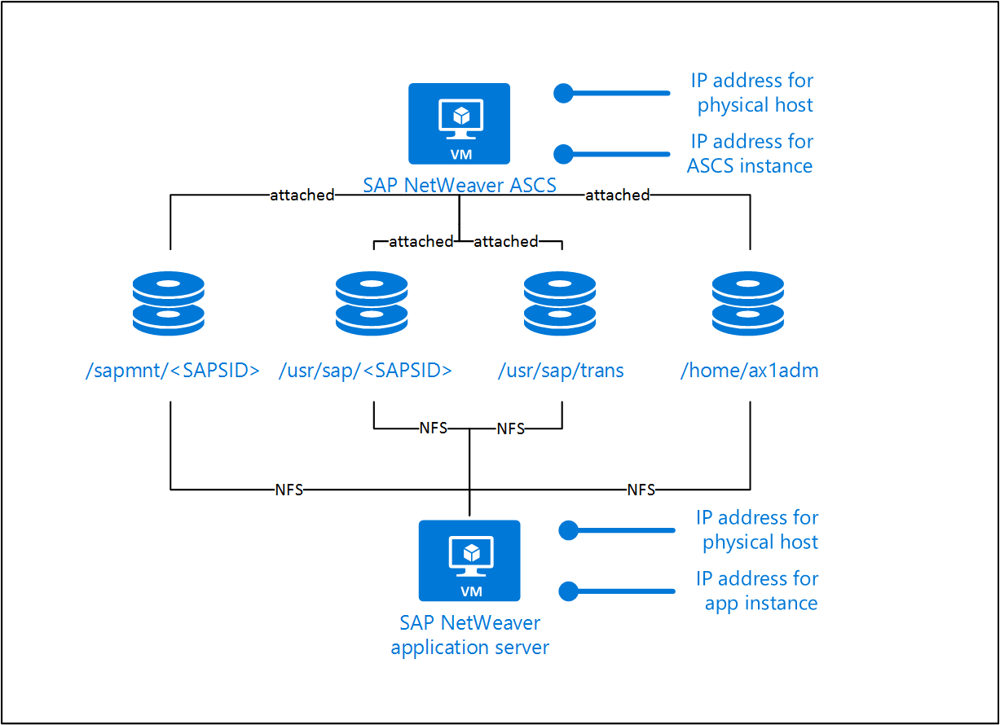

#### Manual deployment for SAP HANA

Create a new virtual machine with one of the supported operating systems for SAP HANA, as listed in SAP Note [2343511]. Add one extra IP configuration for SAP HANA and one per HANA tenant.

SAP HANA needs disks for */hana/shared*, */hana/backup*, */hana/data*, and */hana/log*.

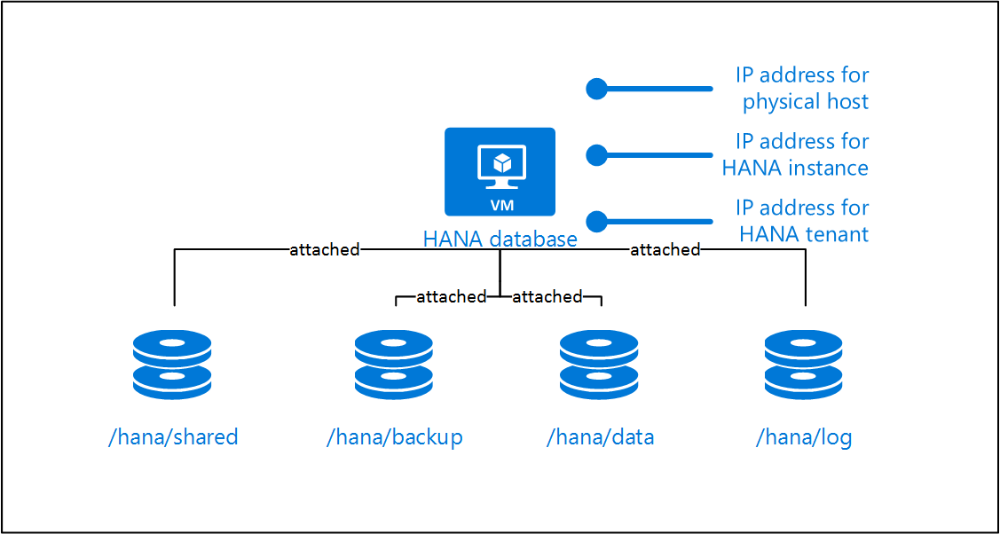

#### Manual deployment for Oracle Database on Linux

Create a new virtual machine with one of the supported operating systems for Oracle databases, as listed in SAP Note [2343511]. Add one extra IP configuration for the Oracle database.

The Oracle database needs disks for */oracle*, */home/oraod1*, and */home/oracle*.


#### Manual deployment for Microsoft SQL Server

Create a new virtual machine with one of the supported operating systems for Microsoft SQL Server, as listed in SAP Note [2343511]. Add one extra IP configuration for the SQL Server instance.

The SQL Server database server needs disks for the database data and log files. It also needs disks for *c:\usr\sap*.


Be sure to install a supported Microsoft ODBC driver for SQL Server on a virtual machine that you want to use as a target for relocating an SAP NetWeaver application server or as a system copy/clone target. SAP LaMa can't relocate SQL Server itself, so a virtual machine that you want to use for these purposes needs SQL Server preinstalled.

### Deploy a virtual machine by using an Azure template

Download the following latest available archives from the [SAP Software Download Center](https://support.sap.com/swdc) for the operating system of the virtual machines:

* SAPCAR 7.21
* SAP Host Agent 7.21
* SAP Adaptive Extension 1.0 EXT

Also download the following components from the [Microsoft Download Center](https://www.microsoft.com/download):

* Microsoft Visual C++ 2010 Redistributable Package (x64) (Windows only)
* Microsoft ODBC Driver for SQL Server (SQL Server only)

The components are required for template deployment. The easiest way to make them available to the template is to upload them to an Azure storage account and create a shared access signature (SAS).

The templates have the following parameters:

* `sapSystemId`: The SAP system ID (SID). It's used to create the disk layout (for example, */usr/sap/\<sapsid\>*).

* `computerName`: The computer name of the new virtual machine. SAP LaMa also uses this parameter. When you use this template to provision a new virtual machine as part of a system copy, SAP LaMa waits until the host with this computer name can be reached.

* `osType`: The type of the operating system that you want to deploy.

* `dbtype`: The type of the database. This parameter is used to determine how many extra IP configurations need to be added and how the disk layout should look.

* `sapSystemSize`: The size of the SAP system that you want to deploy. It's used to determine the type and size of the virtual machine instance.

* `adminUsername`: The username for the virtual machine.

* `adminPassword`: The password for the virtual machine. You can also provide a public key for SSH.

* `sshKeyData`: The public SSH key for the virtual machine. It's supported only for Linux operating systems.

* `subnetId`: The ID of the subnet that you want to use.

* `deployEmptyTarget`: An empty target that you can deploy if you want to use the virtual machine as a target for an instance relocation or something similar. In this case, no additional disks or IP configurations are attached.

* `sapcarLocation`: The location for the SAPCAR application that matches the operating system that you deploy. SAPCAR is used to extract the archives that you provide in other parameters.

* `sapHostAgentArchiveLocation`: The location of the SAP Host Agent archive. The SAP Host Agent is deployed as part of this template deployment.

* `sapacExtLocation`: The location of the SAP Adaptive Extensions. SAP Note [2343511] lists the minimum patch level required for Azure.

* `vcRedistLocation`: The location of the Variant Configuration runtime that's required to install the SAP Adaptive Extensions. This parameter is required only for Windows.

* `odbcDriverLocation`: The location of the ODBC driver that you want to install. Only the Microsoft ODBC driver for SQL Server is supported.

* `sapadmPassword`: The password for the *sapadm* user.

* `sapadmId`: The Linux user ID of the *sapadm* user. It's not required for Windows.

* `sapsysGid`: The Linux group ID of the *sapsys* group. It's not required for Windows.

* `_artifactsLocation`: The base URI, which contains artifacts that this template requires. When you deploy the template by using the accompanying scripts, a private location in the subscription is used and this value is automatically generated. You need this URI only if you don't deploy the template from GitHub.

* `_artifactsLocationSasToken`: The SAS token required to access `_artifactsLocation`. When you deploy the template by using the accompanying scripts, an SAS token is automatically generated. You need this token only if you don't deploy the template from GitHub.

### SAP HANA

The following examples assume that you install the SAP HANA system with SID *HN1* and the SAP NetWeaver system with SID *AH1*. The virtual host names are:

* *hn1-db* for the HANA instance
* *ah1-db* for the HANA tenant that the SAP NetWeaver system uses
* *ah1-ascs* for SAP NetWeaver ASCS
* *ah1-di-0* for the first SAP NetWeaver application server

#### Install SAP NetWeaver ASCS for SAP HANA by using Azure managed disks

Before you start the SAP Software Provisioning Manager (SWPM), you need to mount the IP address of the virtual host name of ASCS. The recommended way is to use SAPACEXT. If you mount the IP address by using SAPACEXT, be sure to remount the IP address after a reboot.

![Linux logo.][Logo_Linux] Linux

```bash
# /usr/sap/hostctrl/exe/sapacext -a ifup -i <network interface> -h <virtual hostname or IP address> -n <subnet mask>
/usr/sap/hostctrl/exe/sapacext -a ifup -i eth0 -h ah1-ascs -n 255.255.255.128
```

![Windows logo.][Logo_Windows] Windows

```bash
# C:\Program Files\SAP\hostctrl\exe\sapacext.exe -a ifup -i <network interface> -h <virtual hostname or IP address> -n <subnet mask>
C:\Program Files\SAP\hostctrl\exe\sapacext.exe -a ifup -i "Ethernet 3" -h ah1-ascs -n 255.255.255.128
```

Run SWPM. For **ASCS Instance Host Name**, use **ah1-ascs**.

![Linux logo.][Logo_Linux] Linux  

Add the following profile parameter to the SAP Host Agent profile, which is located at */usr/sap/hostctrl/exe/host_profile*. For more information, see SAP Note [2628497].

```bash
acosprep/nfs_paths=/home/ah1adm,/usr/sap/trans,/sapmnt/AH1,/usr/sap/AH1
```

#### Install SAP NetWeaver ASCS for SAP HANA on Azure NetApp Files

Azure NetApp Files provides NFS for Azure. In the context of SAP LaMa, this simplifies the creation of the ASCS instances and the subsequent installation of application servers. Previously, the ASCS instance also had to act as an NFS server, and the parameter `acosprep/nfs_paths` had to be added to the host profile of the SAP Host Agent.

#### Network requirements

Azure NetApp Files requires a delegated subnet, which must be part of the same virtual network as the SAP servers. Here's an example for such a configuration:

1. Create the virtual network and the first subnet.

   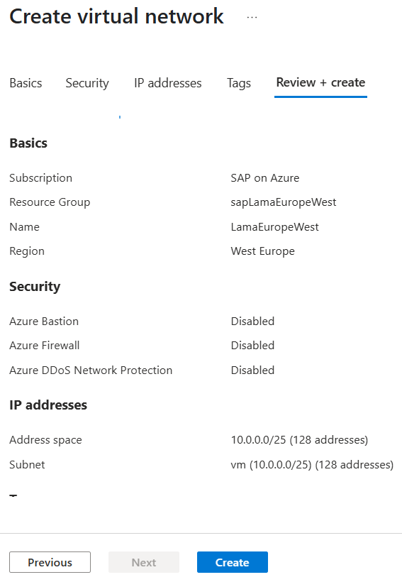

1. Create the delegated subnet for *Microsoft.NetApp/volumes*.

   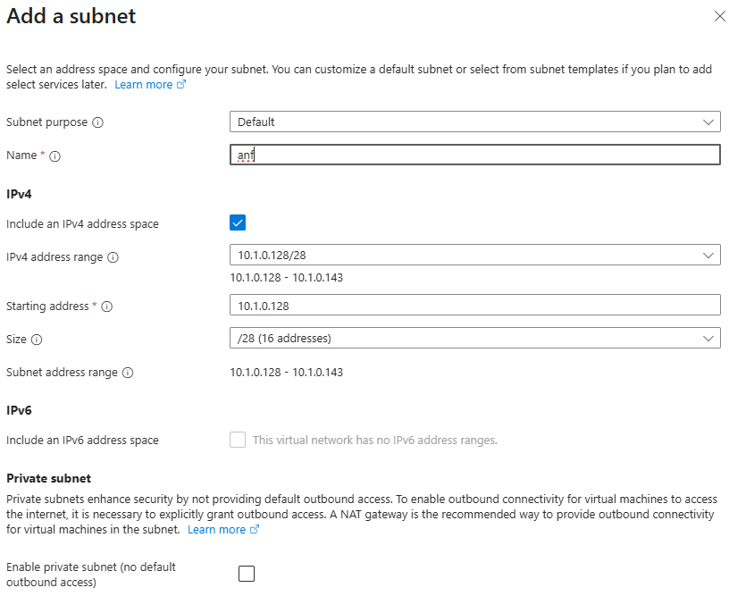

   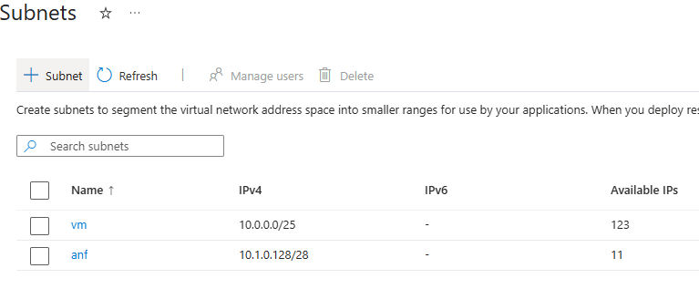

1. Create a NetApp account in the Azure portal.

   

   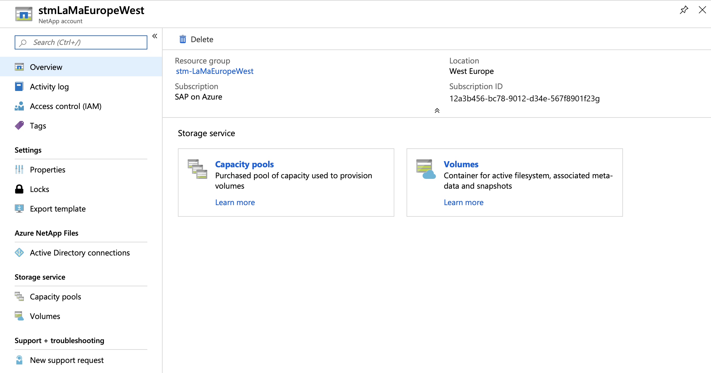

   Within the NetApp account, the capacity pool specifies the size and type of disks for each pool.

   

   

1. Define the NFS volumes.

   Because one pool might contain volumes for multiple systems, choose a self-explaining naming scheme. Adding the SID helps to group related volumes together.

   For the ASCS and AS instances, you need the following mounts: */sapmnt/\<SID\>*, */usr/sap/\<SID\>*, and */home/\<sid\>adm*. Optionally, you need */usr/sap/trans* for the central transport directory, which is at least used by all systems of one landscape.

   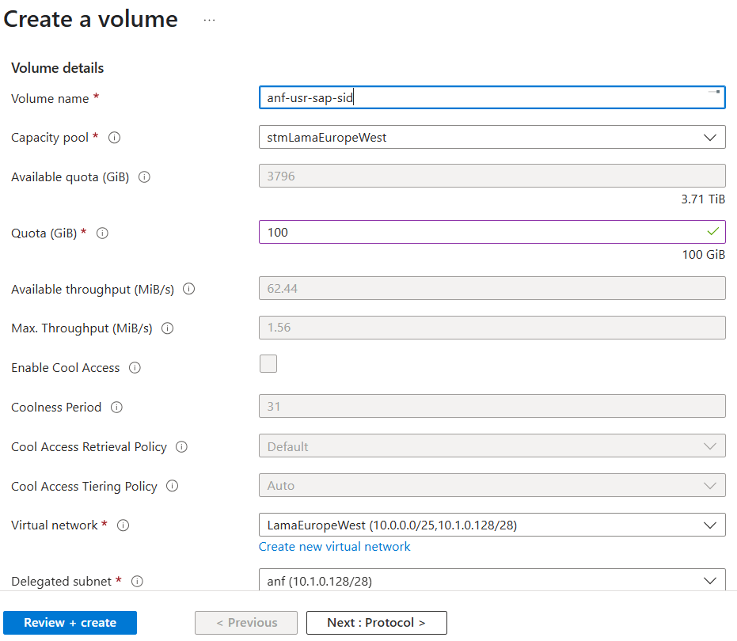

   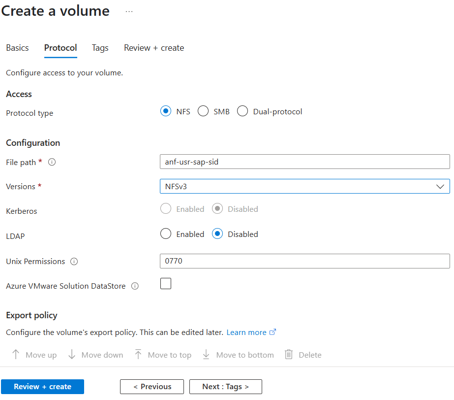

   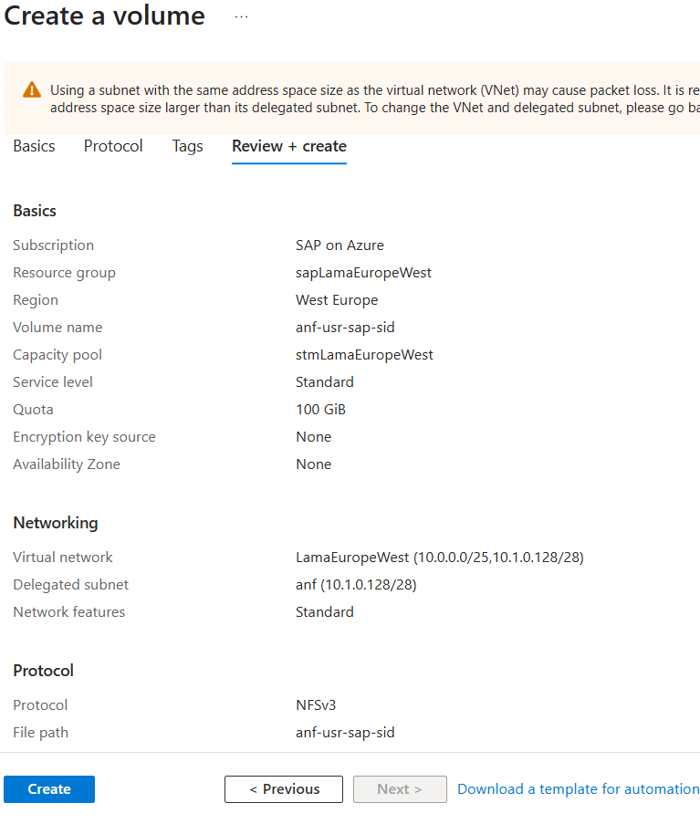

1. Repeat the preceding steps for the other volumes.

   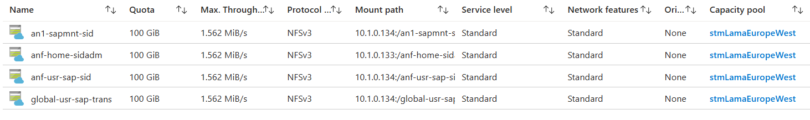

1. Mount the volumes to the systems where the initial installation with SAP SWPM is performed:

   1. Create the mount points. In this case, the SID is *AN1*, so you run the following commands:

      ```bash
      mkdir -p /home/an1adm
      mkdir -p /sapmnt/AN1
      mkdir -p /usr/sap/AN1
      mkdir -p /usr/sap/trans
      ```

   1. Mount the Azure NetApp Files volumes by using the following commands:

      ```bash
      # sudo mount -t nfs -o rw,hard,rsize=65536,wsize=65536,vers=3,tcp 9.9.9.132:/an1-home-sidadm /home/an1adm
      # sudo mount -t nfs -o rw,hard,rsize=65536,wsize=65536,vers=3,tcp 9.9.9.132:/an1-sapmnt-sid /sapmnt/AN1
      # sudo mount -t nfs -o rw,hard,rsize=65536,wsize=65536,vers=3,tcp 9.9.9.132:/an1-usr-sap-sid /usr/sap/AN1
      # sudo mount -t nfs -o rw,hard,rsize=65536,wsize=65536,vers=3,tcp 9.9.9.132:/global-usr-sap-trans /usr/sap/trans
      ```

      You can also look up the mount commands from the portal. The local mount points need to be adjusted.

   1. Run the `df -h` command. Check the output to verify that you mounted the volumes correctly.

      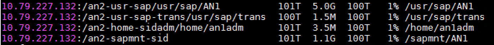

1. Perform the installation with SWPM. The same steps must be performed for at least one AS instance.

   After the successful installation, the system must be discovered within SAP LaMa. The mount points should look like the following screenshot for the ASCS and AS instances.

   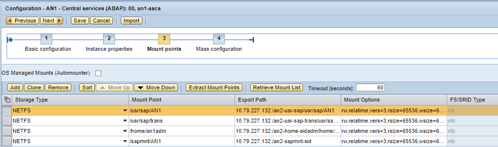

   > [!NOTE]
   > This is an example. The IP addresses and export path are different from the ones that you used before.

#### Install SAP HANA

If you install SAP HANA by using the SAP HANA database lifecycle manager (HDBLCM) command-line tool, use the `--hostname` parameter to provide a virtual host name.

Add the IP address of the virtual host name of the database to a network interface. The recommended way is to use SAPACEXT. If you mount the IP address by using SAPACEXT, be sure to remount the IP address after a reboot.

Add another virtual host name and IP address for the name that the application servers use to connect to the HANA tenant:

```bash
# /usr/sap/hostctrl/exe/sapacext -a ifup -i <network interface> -h <virtual hostname or IP address> -n <subnet mask>
/usr/sap/hostctrl/exe/sapacext -a ifup -i eth0 -h hn1-db -n 255.255.255.128
/usr/sap/hostctrl/exe/sapacext -a ifup -i eth0 -h ah1-db -n 255.255.255.128
```

Run the database instance installation of SWPM on the application server VM, not on the HANA VM. In the **Database for SAP System** dialog, for **Database Host**, use **ah1-db**.

#### Install SAP NetWeaver Application Server for SAP HANA

Before you start SWPM, you need to mount the IP address of the virtual host name of the application server. The recommended way is to use SAPACEXT. If you mount the IP address by using SAPACEXT, be sure to remount the IP address after a reboot.

![Linux logo.][Logo_Linux] Linux

```bash
# /usr/sap/hostctrl/exe/sapacext -a ifup -i <network interface> -h <virtual hostname or IP address> -n <subnet mask>
/usr/sap/hostctrl/exe/sapacext -a ifup -i eth0 -h ah1-di-0 -n 255.255.255.128
```

![Windows logo.][Logo_Windows] Windows

```bash
# C:\Program Files\SAP\hostctrl\exe\sapacext.exe -a ifup -i <network interface> -h <virtual hostname or IP address> -n <subnet mask>
C:\Program Files\SAP\hostctrl\exe\sapacext.exe -a ifup -i "Ethernet 3" -h ah1-di-0 -n 255.255.255.128
```

We recommend that you use the SAP NetWeaver profile parameter `dbs/hdb/hdb_use_ident` to set the identity that's used to find the key in the SAP HANA user store (*hdbuserstore*). You can add this parameter manually after the database instance installation with SWPM or run SWPM with the following code:

```bash
# from https://blogs.sap.com/2015/04/14/sap-hana-client-software-different-ways-to-set-the-connectivity-data/
/sapdb/DVDs/IM_LINUX_X86_64/sapinst HDB_USE_IDENT=SYSTEM_COO
```

If you set it manually, you also need to create new *hdbuserstore* entries:

```bash
# run as <sapsid>adm
/usr/sap/AH1/hdbclient/hdbuserstore LIST
# reuse the port that was listed from the command above, in this example 35041
/usr/sap/AH1/hdbclient/hdbuserstore SET DEFAULT ah1-db:35041@AH1 SAPABAP1 <password>
```

In the **Primary Application Server Instance** dialog, for **PAS Instance Host Name**, use **ah1-di-0**.

#### Post-installation steps for SAP HANA

Back up SYSTEMDB and all tenant databases before you try to copy a tenant, move a tenant, or create a system replication.

### Microsoft SQL Server

The following examples assume that you install the SAP NetWeaver system with SID *AS1*. The virtual host names are:

* *as1-db* for the SQL Server instance that the SAP NetWeaver system uses
* *as1-ascs* for SAP NetWeaver ASCS
* *as1-di-0* for the first SAP NetWeaver application server

#### Install SAP NetWeaver ASCS for SQL Server

Before you start SWPM, you need to mount the IP address of the virtual host name of ASCS. The recommended way is to use SAPACEXT. If you mount the IP address by using SAPACEXT, be sure to remount the IP address after a reboot.

```bash
# C:\Program Files\SAP\hostctrl\exe\sapacext.exe -a ifup -i <network interface> -h <virtual hostname or IP address> -n <subnet mask>
C:\Program Files\SAP\hostctrl\exe\sapacext.exe -a ifup -i "Ethernet 3" -h as1-ascs -n 255.255.255.128
```

Run SWPM. For **ASCS Instance Host Name**, use **as1-ascs**.

#### Install SQL Server

Before you start SWPM, you need to add the IP address of the virtual host name of the database to a network interface. The recommended way is to use SAPACEXT. If you mount the IP address by using SAPACEXT, be sure to remount the IP address after a reboot.

```bash
# C:\Program Files\SAP\hostctrl\exe\sapacext.exe -a ifup -i <network interface> -h <virtual hostname or IP address> -n <subnet mask>
C:\Program Files\SAP\hostctrl\exe\sapacext.exe -a ifup -i "Ethernet 3" -h as1-db -n 255.255.255.128
```

Run the database instance installation of SWPM on the SQL Server virtual machine. Use `SAPINST_USE_HOSTNAME=as1-db` to override the host name that's used to connect to SQL Server. If you deployed the virtual machine by using the Azure Resource Manager template, set the directory that's used for the database data files to *C:\sql\data*, and set the database log file to *C:\sql\log*.

Make sure that the user *NT AUTHORITY\SYSTEM* has access to the SQL Server instance and has the server role *sysadmin*. For more information, see SAP Notes [1877727] and [2562184].

#### Install the SAP NetWeaver application server

Before you start SWPM, you need to mount the IP address of the virtual host name of the application server. The recommended way is to use SAPACEXT. If you mount the IP address by using SAPACEXT, be sure to remount the IP address after a reboot.

```bash
# C:\Program Files\SAP\hostctrl\exe\sapacext.exe -a ifup -i <network interface> -h <virtual hostname or IP address> -n <subnet mask>
C:\Program Files\SAP\hostctrl\exe\sapacext.exe -a ifup -i "Ethernet 3" -h as1-di-0 -n 255.255.255.128
```

In the **Primary Application Server Instance** dialog, for **PAS Instance Host Name**, use **as1-di-0**.

## Troubleshooting

### Errors and warnings during discovery

* The *SELECT* permission was denied.
  * **Error**:

    `[Microsoft][ODBC SQL Server Driver][SQL Server]The SELECT permission was denied on the object 'log_shipping_primary_databases', database 'msdb', schema 'dbo'. [SOAPFaultException]`
    `The SELECT permission was denied on the object 'log_shipping_primary_databases', database 'msdb', schema 'dbo'.`
  * **Solution**: Make sure that *NT AUTHORITY\SYSTEM* can access the SQL Server instance. See SAP Note [2562184].

### Errors and warnings during instance validation

* An exception was raised in the validation of *hdbuserstore*. See Log Viewer.  
  * **Caused by**: `com.sap.nw.lm.aci.monitor.api.validation`

  * **Error**:

    `RuntimeValidationException`

    `Exception in validator with ID 'RuntimeHDBConnectionValidator' (Validation: 'VALIDATION_HDB_USERSTORE'): Could not retrieve the hdbuserstore`  
    `HANA userstore is not in the correct location`
  * **Solution**: Make sure that */usr/sap/AH1/hdbclient/install/installation.ini* is correct.

### Errors and warnings during a system copy

* An error occurred in validating the system provisioning step.
  * **Caused by**: `com.sap.nw.lm.aci.engine.base.api.util.exception`
  * **Error**:

    `HAOperationException`

    `Calling '/usr/sap/hostctrl/exe/sapacext -a ShowHanaBackups -m HN1 -f 50 -h hn1-db -o level=0\;status=5\;port=35013 pf=/usr/sap/hostctrl/exe/host_profile -R -T dev_lvminfo -u SYSTEM -p hook -r' | /usr/sap/hostctrl/exe/sapacext -a ShowHanaBackups -m HN1 -f 50 -h hn1-db -o level=0\;status=5\;port=35013 pf=/usr/sap/hostctrl/exe/host_profile -R -T dev_lvminfo -u SYSTEM -p hook -r`
  * **Solution**: Back up all databases in the source HANA system.

* An error occurred in the system copy **Start** step of the database instance.
  * **Error**:

    `Host Agent Operation '000D3A282BC91EE8A1D76CF1F92E2944' failed (OperationException. FaultCode: '127', Message: 'Command execution failed. : [Microsoft][ODBC SQL Server Driver][SQL Server]User does not have permission to alter database 'AS2', the database does not exist, or the database is not in a state that allows access checks.')`
  * **Solution**: Make sure that *NT AUTHORITY\SYSTEM* can access the SQL Server instance. See SAP Note [2562184].

### Errors and warnings during a system clone

* An error occurred in trying to register an instance agent in the **Forced Register and Start Instance Agent** step of the application server or ASCS.
  * **Error**:

    `Error occurred when trying to register instance agent. (RemoteException: 'Failed to load instance data from profile '\\as1-ascs\sapmnt\AS1\SYS\profile\AS1_D00_as1-di-0':  Cannot access profile '\\as1-ascs\sapmnt\AS1\SYS\profile\AS1_D00_as1-di-0': No such file or directory.')`
  * **Solution**: Make sure that the *sapmnt* share on ASCS/SCS has full access for *SAP_AS1_GlobalAdmin*.

* An error occurred in the **Enable Startup Protection for Clone** step.
  * **Error**:

    `Failed to open file '\\as1-ascs\sapmnt\AS1\SYS\profile\AS1_D00_as1-di-0' Cause: No such file or directory`
  * **Solution**: The computer account of the application server needs write access to the profile.

### Errors and warnings during creation of system replication

* An exception was raised in selecting **Create System Replication**.
  * **Caused by**: `com.sap.nw.lm.aci.engine.base.api.util.exception`
  * **Error**:

    `HAOperationException`

    `Calling '/usr/sap/hostctrl/exe/sapacext -a ShowHanaBackups -m HN1 -f 50 -h hn1-db -o level=0\;status=5\;port=35013 pf=/usr/sap/hostctrl/exe/host_profile -R -T dev_lvminfo -u SYSTEM -p hook -r' | /usr/sap/hostctrl/exe/sapacext -a ShowHanaBackups -m HN1 -f 50 -h hn1-db -o level=0\;status=5\;port=35013 pf=/usr/sap/hostctrl/exe/host_profile -R -T dev_lvminfo -u SYSTEM -p hook -r`
  * **Solution**: Test if SAPACEXT can be executed as *\<hanasid\>adm*.

* An error occurred when full copy was not enabled in the storage step.
  * **Error**:

    `An error occurred when reporting a context attribute message for path IStorageCopyData.storageVolumeCopyList:1 and field targetStorageSystemId`
  * **Solution**: Ignore warnings in the step and try again. This issue was fixed in a support package/patch of SAP LaMa.

### Errors and warnings during relocation

* The path */usr/sap/AH1* is not allowed for NFS re-exports.
  * **Solution**: Add ASCS exports to the ASCS Host Agent profile. See SAP Note [2628497].

* A function is not implemented in relocating ASCS.
  * **Command output**:

    `exportfs: host:/usr/sap/AX1: Function not implemented`
  * **Solution**: Make sure that the NFS server service is enabled on the target virtual machine for relocation.

### Errors and warnings during application server installation

* An error occurred in executing the SAPinst `getProfileDir` step.
  * **Error**:

    `Last error reported by the step: Caught ESAPinstException in module call: Validator of step '|NW_DI|ind|ind|ind|ind|0|0|NW_GetSidFromProfiles|ind|ind|ind|ind|getSid|0|NW_readProfileDir|ind|ind|ind|ind|readProfile|0|getProfileDir' reported an error: Node \\\as1-ascs\sapmnt\AS1\SYS\profile does not exist. Start SAPinst in interactive mode to solve this problem`
  * **Solution**: Make sure that SWPM is running with a user who has access to the profile. You can configure this user in the Application Server Installation wizard.

* An error occurred in executing the SAPinst `askUnicode` step.
  * **Error**:

    `Last error reported by the step: Caught ESAPinstException in module call: Validator of step '|NW_DI|ind|ind|ind|ind|0|0|NW_GetSidFromProfiles|ind|ind|ind|ind|getSid|0|NW_getUnicode|ind|ind|ind|ind|unicode|0|askUnicode' reported an error: Start SAPinst in interactive mode to solve this problem`
  * **Solution**: If you use a recent SAP kernel, SWPM can't determine whether the system is a Unicode system anymore by using the message server of ASCS. See SAP Note [2445033].  

    Until this issue is fixed in a new support package/patch of SAP LaMa, work around it by setting the profile parameter `OS_UNICODE=uc` in the default profile of your SAP system.

* An error occurred in executing the SAPinst `dCheckGivenServer" version="1.0"` step.
  * **Error**:

    `Last error reported by the step: Installation was canceled by user.`
  * **Solution**: Make sure that SWPM is running with a user who has access to the profile. You can configure this user in the Application Server Installation wizard.

* An error occurred in executing the SAPinst `checkClient" version="1.0"` step.
  * **Error**:

    `Last error reported by the step: Installation was canceled by user.`
  * **Solution**: Make sure that the Microsoft ODBC driver for SQL Server is installed on the virtual machine on which you want to install the application server.

* An error occurred in executing the SAPinst `copyScripts` step.
  * **Error**:

    `Last error reported by the step: System call failed. DETAILS: Error 13 (0x0000000d) (Permission denied) in execution of system call 'fopenU' with parameter (\\\as1-ascs/sapmnt/AS1/SYS/exe/uc/NTAMD64/strdbs.cmd, w), line (494) in file (\bas/bas/749_REL/bc_749_REL/src/ins/SAPINST/impl/src/syslib/filesystem/syxxcfstrm2.cpp), stack trace:  
    CThrThread.cpp: 85: CThrThread::threadFunction()  
    CSiServiceSet.cpp: 63: CSiServiceSet::executeService()  
    CSiStepExecute.cpp: 913: CSiStepExecute::execute()  
    EJSController.cpp: 179: EJSControllerImpl::executeScript()  
    JSExtension.hpp: 1136: CallFunctionBase::call()  
    iaxxcfile.cpp: 183: iastring CIaOsFileConnect::callMemberFunction(iastring const& name, args_t const& args)  
    iaxxcfile.cpp: 1849: iastring CIaOsFileConnect::newFileStream(args_t const& _args)  
    iaxxbfile.cpp: 773: CIaOsFile::newFileStream_impl(4)  
    syxxcfile.cpp: 233: CSyFileImpl::openStream(ISyFile::eFileOpenMode)  
    syxxcfstrm.cpp: 29: CSyFileStreamImpl::CSyFileStreamImpl(CSyFileStream*,iastring,ISyFile::eFileOpenMode)  
    syxxcfstrm.cpp: 265: CSyFileStreamImpl::open()  
    syxxcfstrm2.cpp: 58: CSyFileStream2Impl::CSyFileStream2Impl(const CSyPath & \\\aw1-ascs/sapmnt/AW1/SYS/exe/uc/NTAMD64/strdbs.cmd, 0x4)  
    syxxcfstrm2.cpp: 456: CSyFileStream2Impl::open()`
  * **Solution**: Make sure that SWPM is running with a user who has access to the profile. You can configure this user in the Application Server Installation wizard.

* An error occurred in executing the SAPinst `askPasswords` step.
  * **Error**:

    `Last error reported by the step: System call failed. DETAILS: Error 5 (0x00000005) (Access is denied.) in execution of system call 'NetValidatePasswordPolicy' with parameter (...), line (359) in file (\bas/bas/749_REL/bc_749_REL/src/ins/SAPINST/impl/src/syslib/account/synxcaccmg.cpp), stack trace:  
    CThrThread.cpp: 85: CThrThread::threadFunction()  
    CSiServiceSet.cpp: 63: CSiServiceSet::executeService()  
    CSiStepExecute.cpp: 913: CSiStepExecute::execute()  
    EJSController.cpp: 179: EJSControllerImpl::executeScript()  
    JSExtension.hpp: 1136: CallFunctionBase::call()  
    CSiStepExecute.cpp: 764: CSiStepExecute::invokeDialog()  
    DarkModeGuiEngine.cpp: 56: DarkModeGuiEngine::showDialogCalledByJs()  
    DarkModeDialog.cpp: 85: DarkModeDialog::submit()  
    EJSController.cpp: 179: EJSControllerImpl::executeScript()  
    JSExtension.hpp: 1136: CallFunctionBase::call()  
    iaxxcaccount.cpp: 107: iastring CIaOsAccountConnect::callMemberFunction(iastring const& name, args_t const& args)  
    iaxxcaccount.cpp: 1186: iastring CIaOsAccountConnect::validatePasswordPolicy(args_t const& _args)  
    iaxxbaccount.cpp: 430: CIaOsAccount::validatePasswordPolicy_impl()  
    synxcaccmg.cpp: 297: ISyAccountMgt::PasswordValidationMessage CSyAccountMgtImpl::validatePasswordPolicy(saponazure,*****) const`
  * **Solution**: Add a host rule in the isolation step to allow communication from the VM to the domain controller.

## Next steps

* [SAP HANA on Azure operations guide][hana-ops-guide]
* [Azure Virtual Machines planning and implementation for SAP][planning-guide]
* [Azure Virtual Machines deployment for SAP][deployment-guide]
* [Azure Virtual Machines DBMS deployment for SAP][dbms-guide]
