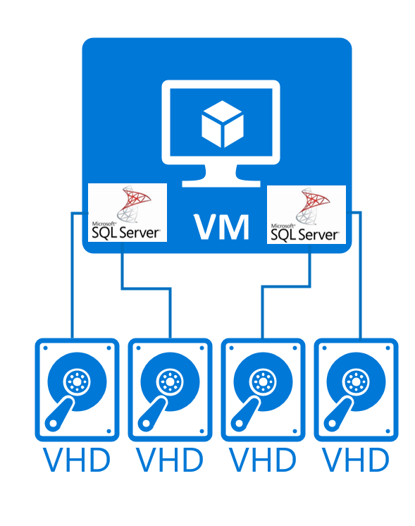
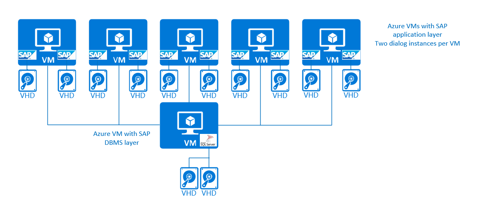
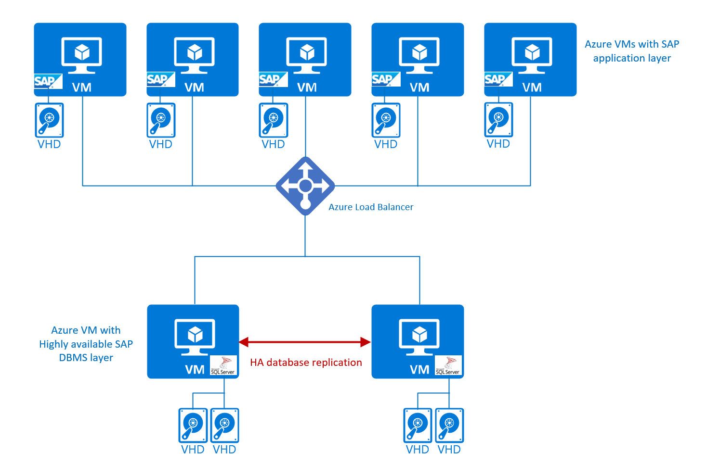

# SAP workload on Azure virtual machine supported scenarios
Designing SAP NetWeaver, Business one, `Hybris` or S/4HANA systems architecture in Azure opens many different opportunities for various architectures and tools to use to get to a scalable, efficient, and highly available deployment. Though dependent on the operating system or DBMS used, there are restrictions. Also, not all scenarios that are supported on-premises are supported in the same way in Azure. This document will lead through the supported non-high-availability configurations and high-availability configurations and architectures using Azure VMs exclusively. 

> [!NOTE]
> HANA Large Instance service is in sunset mode and doesn't accept new customers anymore. Providing units for existing HANA Large Instance customers is still possible. For alternatives, check the offers of HANA certified Azure VMs in the [HANA Hardware Directory](https://www.sap.com/dmc/exp/2014-09-02-hana-hardware/enEN/#/solutions?filters=iaas;ve:24). For scenarios that were and still are supported for existing HANA Large Instance customers with [HANA Large Instances](../../virtual-machines/workloads/sap/hana-overview-architecture.md), check the article [Supported scenarios for HANA Large Instances](../../virtual-machines/workloads/sap/hana-supported-scenario.md).

## General platform restrictions
Azure has various platforms besides so called native Azure VMs that are offered as first party service. [HANA Large Instances](../large-instances/hana-overview-architecture.md), which is in sunset mode is one of those platforms. [Azure VMware Services](https://azure.microsoft.com/products/azure-VMware/) is another of these first party services. Azure VMware Services in general isn't supported by SAP for hosting SAP workload. Refer to [SAP support note #2138865  - SAP Applications on VMware Cloud: Supported Products and VM configurations](https://launchpad.support.sap.com/#/notes/2138865) for more details of VMware support on different platforms.

Besides the on-premises Active Directory, Azure offers a managed Active Directory SaaS service with [Microsoft Entra Domain Services](../../active-directory-domain-services/overview.md) (traditional AD managed by Microsoft), and [Microsoft Entra ID](../../active-directory/fundamentals/active-directory-whatis.md). SAP components hosted on Windows OS are often relying on the usage of Windows Active Directory. In this case the traditional Active Directory as it's hosted on-premises by you, or Microsoft Entra Domain Services (still in testing). But these SAP components can't function with the native Microsoft Entra ID. Reason is that there are still larger gaps in functionality between Active Directory in its on-premises form or its SaaS form (Microsoft Entra Domain Services) and the native Microsoft Entra ID. This dependency is the reason why Microsoft Entra accounts aren't supported for applications based on SAP NetWeaver and S/4 HANA on Windows OS. Traditional Active Directory accounts need to be used in such scenarios.

| AD service | Supported applications based on SAP NetWeaver and S/4 HANA on Windows OS  |  
| --- | --- | --- | 
| On-premises Windows Active Directory | Supported | 
| Microsoft Entra Domain Services | Supported| 
| Microsoft Entra ID | Not supported | 

The above doesn't affect the usage of Microsoft Entra accounts for single-sign-on (SSO) scenarios with SAP applications. 

## 2-Tier configuration
An SAP 2-Tier configuration is considered to be built up out of a combined layer of the SAP DBMS and application layer that run on the same server or VM unit. The second tier is considered to be the user interface layer. For a 2-Tier configuration, the DBMS, and SAP application layer share the resources of the Azure VM. As a result, you need to configure the different components in a way that these components don't compete for resources. You also need to be careful to not oversubscribe the resources of the VM. Such a configuration doesn't provide any high availability, beyond the [Azure Service Level agreements](https://azure.microsoft.com/support/legal/sla/) of the different Azure components involved.

A graphical representation of such a configuration can look like:

Such configurations are supported with Windows, Red Hat, SUSE, and Oracle Linux for the DBMS systems of SQL Server, Oracle, Db2, maxDB, and SAP ASE for production and non-production cases. 
For SAP HANA as DBMS, SAP supports such a scenario as stated in [SAP note #1953429](https://launchpad.support.sap.com/#/notes/1953429). So far, none of the Linux distros provided sufficient HA documentation to set up and operate a Pacemaker cluster in such a configuration. As a result, such type of configurations is supported on Azure only for non-production cases that don't require a high availability failover cluster. 

For all OS/DBMS combinations supported on Azure, this type of configuration is supported. However, it's mandatory that you set the configuration of the DBMS and the SAP components in a way that DBMS and SAP components don't compete for memory and CPU resources and with that exceeds the physical available resources. This needs to be done by restricting the memory the DBMS is allowed to allocate. You also need to limit the SAP Extended Memory on application instances. You also need to monitor CPU consumption of the VM overall to make sure that the components aren't maximizing the CPU resources.

> [!NOTE]
> For production SAP systems, we recommend additional high availability and eventual disaster recovery configurations as described later in this document

## 3-Tier configuration
In such configurations, you separate the SAP application layer and the DBMS layer into different VMs. You usually do that for larger systems and out of reasons of being more flexible on the resources of the SAP application layer. In the most simple setup, There's no high availability beyond the [Azure Service Level agreements](https://azure.microsoft.com/support/legal/sla/) of the different Azure components involved.

The graphical representation looks like:

This type of configuration is supported on Windows, Red Hat, SUSE, and Oracle Linux for the DBMS systems of SQL Server, Oracle, Db2, SAP HANA, maxDB, and SAP ASE for production and non-production cases. For simplification, we didn't distinguish between SAP Central Services and SAP dialog instances in the SAP application layer. In this simple 3-Tier configuration, there would be no high availability protection for SAP Central Services.

> [!NOTE]
> For production SAP systems, we recommend additional high availability and eventual disaster recovery configurations as described later in this document

## Multiple DBMS instances per VM 
In this configuration type, you host multiple DBMS instances per Azure VM. The motivation can be to have less operating systems to maintain and with that reduced costs. Other motivations are to have more flexibility and more efficiency by sharing resources of a larger VM or HANA Large Instance unit among multiple DBMS instances. So far these configurations were showing up mostly for non-production systems.

A configuration like that could look like:

This type of DBMS deployment is supported for:

- SQL Server on Windows
- IBM Db2. Find details in the article [Multiple instances (Linux, UNIX)](https://www.ibm.com/support/knowledgecenter/en/SSEPGG_10.5.0/com.ibm.db2.luw.admin.dbobj.doc/doc/c0004904.html)
- For Oracle. For details see [SAP support note #1778431](https://launchpad.support.sap.com/#/notes/1778431) and related SAP notes
- For SAP HANA, multiple instances on one VM, SAP calls this deployment method MCOS, is supported. For details see the SAP article [Multiple SAP HANA Systems on One Host (MCOS)](https://help.sap.com/viewer/eb3777d5495d46c5b2fa773206bbfb46/2.0.02/-/b2751fd43bec41a9a14e01913f1edf18.html)

Running multiple database instances on one host, you need to make sure that the different instances aren't competing for resources and thereby exceed the physical resource limits of the VM. This is especially true for memory where you need to cap the memory anyone of the instances sharing the VM can allocate. That also might be true for the CPU resources the different database instances can consume. All the database systems mentioned have configurations that allow limiting memory allocation and CPU resources on an instance level.
In order to have support for such a configuration for Azure VMs, it's expected that the disks or volumes that are used for the data and log/redo log files of the databases that are managed by the different instances are separate. Or in other words data or log/redo log files of databases that are managed by different DBMS instance aren't supposed to share the same disks or volumes.

> [!NOTE]
> For production SAP systems, we recommend additional high availability and eventual disaster recovery configurations as described later in this document. VMs with multiple DBMS instances aren't supported with the high availability configurations described later in this document.

## Multiple SAP Dialog instances in one VM
In many cases, multiple dialog instances got deployed on bare metal servers or even in VMs running in private clouds. Reason for such configurations was to tailor certain SAP dialog instances to certain workload, business functionality, or workload types. Reason for not isolating those instances into separate VMs was the effort of operating system maintenance and operations. Or in numerous cases the costs in case the hoster or operator of the VM is asking for a monthly fee per VM operated and administrated. In Azure, a scenario of hosting multiple SAP dialog instances within a single VM us supported for production and non-production purposes on the operating systems of Windows, Red Hat, SUSE, and Oracle Linux. The SAP kernel parameter PHYS_MEMSIZE,  available on Windows and modern Linux kernels, should be set if multiple SAP Application Server instances are running on a single VM. it's also advised limiting the expansion of SAP Extended Memory on operating systems, like Windows where automatic growth of the SAP extended Memory is implemented. This can be done with the SAP profile parameter `em/max_size_MB`.

At 3-Tier configuration where multiple SAP dialog instances are run within Azure VMs can look like:

For simplification, we didn't distinguish between SAP Central Services and SAP dialog instances in the SAP application layer. In this simple 3-Tier configuration, there would be no high availability protection for SAP Central Services. For production systems, it's not recommended to leave SAP Central Services unprotected. For specifics on so called multi-SID configurations around SAP Central Instances and high-availability of such multi-SID configurations, see later sections of this document.

## High Availability protection for the SAP DBMS layer
As you look to deploy SAP production systems, you need to consider hot standby type of high availability configurations. Especially with SAP HANA, where data needs to be loaded into memory before being able to get the full performance and scalability back, Azure service healing isn't an ideal measure for high availability.

In general, Microsoft supports only high availability configurations and software packages that are described in the [SAP workload scenarios](./get-started.md). You can read the same statement in SAP note [#1928533](https://launchpad.support.sap.com/#/notes/1928533). Microsoft won't provide support for other high availability third-party software frameworks that aren't documented by Microsoft with SAP workload. In such cases, the third-party supplier of the high availability framework is the supporting party for the high availability configuration who needs to be engaged by you as a customer into the support process. Exceptions are going to be mentioned in this article.

In general, Microsoft supports a limited set of high availability configurations on Azure VMs or HANA Large Instances units. 

For Azure VMs, the following high availability configurations are supported on DBMS level:

- SAP HANA System Replication based on Linux Pacemaker on SUSE and Red Hat. See the detailed articles:
	- [High availability of SAP HANA on Azure VMs on SUSE Linux Enterprise Server](./sap-hana-high-availability.md)
	- [High availability of SAP HANA on Azure VMs on Red Hat Enterprise Linux](./sap-hana-high-availability-rhel.md)
- SAP HANA scale-out n+m configurations using [Azure NetApp Files](https://azure.microsoft.com/services/netapp/) on SUSE and Red Hat. Details are listed in these articles:
	- [Deploy a SAP HANA scale-out system with standby node on Azure VMs by using Azure NetApp Files on SUSE Linux Enterprise Server}](./sap-hana-scale-out-standby-netapp-files-suse.md)
	- [Deploy a SAP HANA scale-out system with standby node on Azure VMs by using Azure NetApp Files on Red Hat Enterprise Linux](./sap-hana-scale-out-standby-netapp-files-rhel.md)
- SQL Server Failover cluster based on Windows Scale-Out File Services. Though recommendation for production systems is to use SQL Server Always On instead of clustering. SQL Server Always On provides better availability using separate storage. Details are described in this article:
	- [Configure a SQL Server failover cluster instance on Azure virtual machines](/azure/azure-sql/virtual-machines/windows/failover-cluster-instance-storage-spaces-direct-manually-configure)
- SQL Server Always On is supported with the Windows operating system for SQL Server on Azure. This configuration is the default recommendation for production SQL Server instances on Azure. Details are described in these articles:
	- [Introducing SQL Server Always On availability groups on Azure virtual machines](/azure/azure-sql/virtual-machines/windows/availability-group-overview).
	- [Configure an Always On availability group on Azure virtual machines in different regions](/azure/azure-sql/virtual-machines/windows/availability-group-manually-configure-multiple-regions).
	- [Configure a load balancer for an Always On availability group in Azure](/azure/azure-sql/virtual-machines/windows/availability-group-load-balancer-portal-configure).
- Oracle Data Guard for Windows and Oracle Linux. Details for Oracle Linux can be found in this article:
	- [Implement Oracle Data Guard on an Azure Linux virtual machine](../../virtual-machines/workloads/oracle/configure-oracle-dataguard.md)
- IBM Db2 HADR on SUSE and RHEL Detailed documentation for SUSE and RHEL using Pacemaker is provided here:
	- [High availability of IBM Db2 LUW on Azure VMs on SUSE Linux Enterprise Server with Pacemaker](./dbms-guide-ha-ibm.md)
	- [High availability of IBM Db2 LUW on Azure VMs on Red Hat Enterprise Linux Server](./high-availability-guide-rhel-ibm-db2-luw.md)
- SAP ASE and SAP maxDB configuration as detailed in these documents:
	- [SAP ASE Azure Virtual Machines DBMS deployment for SAP workload](./dbms-guide-sapase.md)
	- [SAP MaxDB, liveCache, and Content Server deployment on Azure VMs](./dbms-guide-maxdb.md)
- HANA Large Instances high availability scenarios are detailed in:
	- [Supported scenarios for HANA Large Instances- HSR with fencing for high availability](../../virtual-machines/workloads/sap/hana-supported-scenario.md#hsr-with-fencing-for-high-availability)
	- [Supported scenarios for HANA Large Instances - Host auto failover (1+1)](../../virtual-machines/workloads/sap/hana-supported-scenario.md#host-auto-failover-11)

> [!IMPORTANT]
> For none of the scenarios described above, we support configurations of multiple DBMS instances in one VM. Means in each of the cases, only one database instance can be deployed per VM and protected with the described high availability methods. Protecting multiple DBMS instances under the same Windows or Pacemaker failover cluster is **NOT** supported at this point in time. Also Oracle Data Guard is supported for single instance per VM deployment cases only.

Various database systems allow hosting multiple databases under one DBMS instance. Like with SAP HANA, multiple databases can be hosted in multiple database containers (MDC). For cases where these multi-database configurations are working within one failover cluster resource, these configurations are supported. Configurations that aren't supported are cases where multiple cluster resources would be required. As for configurations where you would define multiple SQL Server Availability Groups, under one SQL Server instance.

Dependent on the DBMS an/or operating systems, components like Azure load balancer might or might not be required as part of the solution architecture.

Specifically for maxDB, the storage configuration needs to be different. With maxDB, the data and log files needs to be located on shared storage for high availability configurations. Only for maxDB, shared storage is supported for high availability. For all other DBMS, separate storage stacks per node are the only supported disk configurations.

Other high availability frameworks are known to exist and are known to run on Microsoft Azure as well. However, Microsoft didn't test those frameworks. If you want to build your high availability configuration with those frameworks, you need to work with the provider of that software to:

- Develop a deployment architecture
- Deployment of the architecture
- Support of the architecture

> [!IMPORTANT]
> Microsoft Azure Marketplace offers a variety of soft appliances that provide storage solutions on top of Azure native storage. These soft appliances can be used to create NFS shares as well that theoretically could be used in the SAP HANA scale-out deployments where a standby node is required. Due to various reasons, none of these storage soft appliances is supported for any of the DBMS deployments by Microsoft and SAP on Azure. Deployments of DBMS on SMB shares isn't supported at all at this point in time. Deployments of DBMS on NFS shares is limited to NFS 4.1 shares on [Azure NetApp Files](https://azure.microsoft.com/services/netapp/).

## High Availability for SAP Central Service
SAP Central Services is a second single point of failure of your SAP configuration. As a result, you would need to protect these Central Services processes as well. The offer supported and documented for SAP workload reads like:

- Windows Failover Cluster Server using Windows Scale-out File Services for sapmnt and global transport directory. Details are described in the article:
	- [Cluster an SAP ASCS/SCS instance on a Windows failover cluster by using a file share in Azure](./sap-high-availability-guide-wsfc-file-share.md)
	- [Prepare Azure infrastructure for SAP high availability by using a Windows failover cluster and file share for SAP ASCS/SCS instances](./sap-high-availability-infrastructure-wsfc-file-share.md)
- Windows Failover Cluster Server using SMB share based on [Azure NetApp Files](https://azure.microsoft.com/services/netapp/) for sapmnt and global transport directory. Details are listed in the article:
	- [High availability for SAP NetWeaver on Azure VMs on Windows with Azure NetApp Files(SMB) for SAP applications](./high-availability-guide-windows-netapp-files-smb.md)
- Windows Failover Cluster Server based on SIOS `Datakeeper`. Though documented by Microsoft, you need a support relationship with SIOS, so, that you can engage with SIOS support when using this solution. Details are described in the article:
	- [Cluster an SAP ASCS/SCS instance on a Windows failover cluster by using a cluster shared disk in Azure](./sap-high-availability-guide-wsfc-shared-disk.md)
	- [Prepare the Azure infrastructure for SAP HA by using a Windows failover cluster and shared disk for SAP ASCS/SCS](./sap-high-availability-infrastructure-wsfc-shared-disk.md)
- Pacemaker on SUSE operating system with creating a highly available NFS share using two SUSE VMs and `drdb` for file replication. Details are documented in the article
	- [High availability for SAP NetWeaver on Azure VMs on SUSE Linux Enterprise Server for SAP applications](./high-availability-guide-suse.md)
	- [High availability for NFS on Azure VMs on SUSE Linux Enterprise Server](./high-availability-guide-suse-nfs.md)
- Pacemaker SUSE operating system with using NFS shares provided by [Azure NetApp Files](https://azure.microsoft.com/services/netapp/). Details are documented in
	- [High availability for SAP NetWeaver on Azure VMs on SUSE Linux Enterprise Server with Azure NetApp Files for SAP applications](./high-availability-guide-suse-netapp-files.md)
- Pacemaker on Red Hat operating system with NFS share hosted on a `glusterfs` cluster. Details can be found in the articles
	- [Azure Virtual Machines high availability for SAP NetWeaver on Red Hat Enterprise Linux](./high-availability-guide-rhel.md)
	- [`GlusterFS` on Azure VMs on Red Hat Enterprise Linux for SAP NetWeaver](./high-availability-guide-rhel-glusterfs.md)
- Pacemaker on Red Hat operating system with NFS share hosted on [Azure NetApp Files](https://azure.microsoft.com/services/netapp/). Details are described in the article
	- [Azure Virtual Machines high availability for SAP NetWeaver on Red Hat Enterprise Linux with Azure NetApp Files for SAP applications](./high-availability-guide-rhel-netapp-files.md)

Of the listed solutions, you need a support relationship with SIOS to support the `Datakeeper` product and to engage with SIOS directly if problems are encountered. Dependent on the way you licensed the Windows, Red Hat, and/or SUSE OS, you could also be required to have a support contract with your OS provider to have full support of the listed high availability configurations.

The configuration can as well be displayed like:

On the right hand side of the graphics, the highly available SAP Central Services is shown. Besides having the SAP Central services protected with a failover cluster framework that can fail over in failure scenarios. There's a necessity for a highly available NFS or SMB share, or a Windows shared disk to make sure the sapmnt and global transport directory are available independent of the existence of a single VM. Additional some of the solutions, like Windows Failover Cluster Server and Pacemaker are going to require an Azure load balancer to direct or redirect traffic to a healthy node.

In the list shown, There's no mentioning of the Oracle Linux operating system. Oracle Linux doesn't support Pacemaker as a cluster framework. If you want to deploy your SAP system on Oracle Linux and you need a high availability framework for Oracle Linux, you need to work with third-party suppliers. One of the suppliers is SIOS with their Protection Suite for Linux that is supported by SAP on Azure. For more information read SAP note [#1662610 - Support details for SIOS Protection Suite for Linux](https://launchpad.support.sap.com/#/notes/1662610) for more details.

### Supported storage with the SAP Central Services scenarios listed above
Since only a subset of Azure storage types is providing highly available NFS or SMB shares that quality for the usage in our SAP Central Services cluster scenarios a list of supported storage types

- Windows Failover Cluster Server with Windows Scale-out File Server can be deployed on all native Azure storage types, except Azure NetApp Files. However, recommendation is to use Premium Storage due to superior service level agreements in throughput and IOPS.
- Windows Failover Cluster Server with SMB on Azure NetApp Files is supported on Azure NetApp Files. SMB shares hosted on Azure Premium File services are supported for this scenario as well. Azure Standard Files isn't supported
- Windows Failover Cluster Server with windows shared disk based on SIOS `Datakeeper` can be deployed on all native Azure storage types, except Azure NetApp Files. However, recommendation is to use Premium Storage due to superior service level agreements in throughput and IOPS.
- SUSE or Red Hat Pacemaker using NFS shares on Azure NetApp Files is supported.
- SUSE or Red Hat Pacemaker using NFS shares on Azure Premium Files using LRS or ZRS s supported. Azure Standard Files isn't supported
- SUSE Pacemaker using a `drdb` configuration between two VMs is supported using native Azure storage types, except Azure NetApp Files. However, we recommend using one of the first party services with Azure Premium Files or Azure NetApp Files.
- Red Hat Pacemaker using `glusterfs` for providing NFS share is supported using native Azure storage types, except Azure NetApp Files. However, we recommend using one of the first party services with Azure Premium Files or Azure NetApp Files.

> [!IMPORTANT]
> Microsoft Azure Marketplace offers a variety of soft appliances that provide storage solutions on top of Azure native storage. These storage soft appliances can be used to create NFS or SMB shares as well that theoretically could be used in the failover clustered SAP Central Services as well. These solutions aren't directly supported for SAP workload by Microsoft. If you decide to use such a solution to create your NFS or SMB share, support for the SAP Central Service configuration needs to be provided by the third-party owning the software in the storage soft appliance.

## Multi-SID SAP Central Services failover clusters
To reduce the number of VMs that are needed in large SAP landscapes, SAP allows running SAP Central Services instances of multiple different SAP systems in failover cluster configuration. Imagine cases where you've 30 or more NetWeaver or S/4HANA production systems. Without multi-SID clustering, these configurations would require 60 or more VMs in 30 or more Windows or Pacemaker failover cluster configurations. Deploying multiple SAP central services across two nodes in a failover cluster configuration can reduce the number of VMs significantly. However, deploying multiple SAP Central services instances on a single two node cluster configuration also has some disadvantages. Issues around a single VM in the cluster configuration apply to multiple SAP systems. Maintenance on the guest OS running in the cluster configuration requires more coordination since multiple production SAP systems are affected. Tools like SAP LaMa aren't supporting multi-SID clustering in their system cloning process.

On Azure, a multi-SID cluster configuration is supported for the Windows operating system with ENSA1 and ENSA2. Recommendation isn't to combine the older Enqueue Replication Service architecture (ENSA1) with the new architecture (ENSA2) on one multi-SID cluster. Details about such an architecture are documented in the articles

- [SAP ASCS/SCS instance multi-SID high availability with Windows Server Failover Clustering and shared disk on Azure](./sap-ascs-ha-multi-sid-wsfc-shared-disk.md)
- [SAP ASCS/SCS instance multi-SID high availability with Windows Server Failover Clustering and file share on Azure](./sap-ascs-ha-multi-sid-wsfc-file-share.md)

For SUSE, a multi-SID cluster based on Pacemaker is supported as well. So far the configuration is supported for:

- A maximum of five SAP ASCS/SCS instances
- The old enqueue replication server ice architecture (ENSA1)
- Two node Pacemaker cluster configurations

The configuration is documented in [High availability for SAP NetWeaver on Azure VMs on SUSE Linux Enterprise Server for SAP applications multi-SID guide](./high-availability-guide-suse-multi-sid.md)

A multi-SID cluster with Enqueue Replication server schematically looks like

## SAP HANA scale-out scenarios
SAP HANA scale-out scenarios are supported for a subset of the HANA certified Azure VMs as listed in the [SAP HANA hardware directory](https://www.sap.com/dmc/exp/2014-09-02-hana-hardware/enEN/#/solutions?filters=v:deCertified;ve:24;iaas;v:125;v:105;v:99;v:120). All the VMs marked with 'Yes' in the column 'Clustering' can be used for either OLAP or S/4HANA scale-out. Configurations without standby are supported with the Azure Storage types of:

- Azure Premium Storage v1, including Azure Write accelerator for the /hana/log volume
- Azure Premium Storage v2
- [Ultra disk](../../virtual-machines/disks-enable-ultra-ssd.md)
- [Azure NetApp Files](https://azure.microsoft.com/services/netapp/)

SAP HANA scale-out configurations for OLAP or S/4HANA with standby node(s) are exclusively supported with NFS shared hosted on Azure NetApp Files.

For further information on exact storage configurations with or without standby node, check the articles:

- [SAP HANA Azure virtual machine storage configurations](./hana-vm-operations-storage.md)
- [Deploy a SAP HANA scale-out system with standby node on Azure VMs by using Azure NetApp Files on SUSE Linux Enterprise Server](./sap-hana-scale-out-standby-netapp-files-suse.md)
- [Deploy a SAP HANA scale-out system with standby node on Azure VMs by using Azure NetApp Files on Red Hat Enterprise Linux](./sap-hana-scale-out-standby-netapp-files-rhel.md)
- [SAP support note #2080991](https://launchpad.support.sap.com/#/notes/2080991)

## Disaster Recovery Scenario
There's a variety of disaster recovery scenarios that are supported. We define Disaster architectures as architectures, which should compensate for a complete Azure region going off the grid. This means we need the disaster recovery target to be a different Azure region as target to run your SAP landscape. We separate methods and configurations in DBMS layer and non-DBMS layer.

### DBMS layer
For the DBMS layer, configurations using the DBMS native replication mechanisms, like Always On, Oracle Data Guard, Db2 HADR, SAP ASE Always-On, or HANA System Replication are supported. it's mandatory that the replication stream in such cases is asynchronous, instead of synchronous as in typical high availability scenarios that are deployed within a single Azure region. A typical example of such a supported DBMS disaster recovery configuration is described in the article [SAP HANA availability across Azure regions](./sap-hana-availability-across-regions.md#combine-availability-within-one-region-and-across-regions). The second graphic in that section describes a scenario with HANA as an example. The main databases supported for SAP applications are all able to be deployed in such a scenario.

it's supported to use a smaller VM as target instance in the disaster recovery region since that VM doesn't experience the full workload traffic. Doing so, you need to keep the following considerations in mind:

- Smaller VM types don't allow that many disks attached than smaller VMs
- Smaller VMs have less network and storage throughput
- Resizing across VM families can be a problem when the Different VMs are collected in one Azure Availability Set or when the resizing should happen between the M-Series family and Mv2 family of VMs
- CPU and memory consumption for the database instance being able to receive the stream of changes with minimal delay and enough CPU and memory resources to apply these changes with minimal delay to the data

More details on limitations of different VM sizes can be found on the [VM sizes](../../virtual-machines/sizes.md) page

Another supported method of deploying a DR target is to have a second DBMS instance installed on a VM that runs a non-production DBMS instance of a non-production SAP instance. This can be a bit more challenging since you need to figure out what on memory, CPU resources, network bandwidth, and storage bandwidth is needed for the particular target instances that should function as main instance in the DR scenario. Especially in HANA it's highly recommended that you're configuring the instance that functions as DR target on a shared host so that the data isn't pre-loaded into the DR target instance.

> [!NOTE]
> Usage of [Azure Site Recovery](https://azure.microsoft.com/services/site-recovery/) has not been tested for DBMS deployments under SAP workload. As a result it's not supported for the DBMS layer of SAP systems at this point in time. Other methods of replications by Microsoft and SAP that aren't listed aren't supported. Using third party software for replicating the DBMS layer of SAP systems between different Azure Regions, needs to be supported by the vendor of the software and will not be supported through Microsoft and SAP support channels.

## Non-DBMS layer
For the SAP application layer and eventual shares or storage locations that are needed, the two major scenarios are used by customers:

- The disaster recovery targets in the second Azure region aren't being used for any production or non-production purposes. In this scenario, the VMs that function as disaster recovery target are ideally not deployed and the image and changes to the images of the production SAP application layer is replicated to the disaster recovery region. A functionality that can perform such a task is [Azure Site Recovery](../../site-recovery/azure-to-azure-move-overview.md). Azure Site Recovery support an Azure-to-Azure replication scenario like this.
- The disaster recovery targets are VMs that are actually in use by non-production systems. The whole SAP landscape is spread across two different Azure regions with production systems usually in one region and non-production systems in another region. In many customer deployments, the customer has a non-production system that is equivalent to a production system. The customer has production application instances pre-installed on the application layer non-production systems. In a failover event, the non-production instances would be shut down, the virtual names of the production VMs moved to the non-production VMs (after assigning new IP addresses in DNS), and the pre-installed production instances are getting started

### SAP Central Services clusters
SAP Central Services clusters that are using shared disks (Windows), SMB shares (Windows) or NFS shares are a bit harder to replicate. On the Windows side, Windows Storage Replication is a possible solution. On Linux, rsync is a viable solution. Also cross region replication of Azure NetApp Files is a viable solution.

## Non-supported scenario
There's a list of scenarios, which aren't supported for SAP workload on Azure architectures. **Not supported** means SAP and Microsoft are not able to deliver support for these configurations and need to defer to an eventual involved third-party that provided software to establish such architectures. Two of the categories are:

- Storage soft appliances: There are various storage soft appliances in the market. Some of the vendors offer own documentation on how to use their storage soft appliances on Azure related to SAP software. Support of configurations or deployments involving such storage soft appliances needs to be provided by the vendor of the storage soft appliance. This fact is also manifested in [SAP support note #2015553](https://launchpad.support.sap.com/#/notes/2015553)
- High Availability frameworks: Only Pacemaker and Windows Server Failover Cluster are supported high availability frameworks for SAP workload on Azure. As mentioned earlier, the solution of SIOS `Datakeeper` is described and documented by Microsoft. Nevertheless, the components of SIOS `Datakeeper` need to be supported through SIOS as the vendor providing those components. SAP also listed other certified high availability frameworks in various SAP notes. Some of them were certified by the third-party vendor for Azure as well. Nevertheless, support for configurations using those products need to be provided by the product vendor. Different vendors have different integration into the SAP support processes. You should clarify what support process works best for the particular vendor before deciding to use the product with SAP configurations deployed on Azure.
- Shared disk clusters where database files are residing on the shared disks aren't supported, except for maxDB. For all other database, the supported solution is to have separate storage locations instead of an SMB or NFS share or shared disk to configure high-availability scenarios

Other scenarios, which aren't supported are scenarios like:

- Deployment scenarios that introduce a larger network latency between the SAP application tier and the SAP DBMS tier as in NetWeaver, S/4HANA and e.g. `Hybris`. This includes:
	- Deploying one of the tiers on-premises whereas the other tier is deployed in Azure
	- Deploying the SAP application tier of a system in a different Azure region than the DBMS tier
	- Deploying one tier in datacenters that are co-located to Azure and the other tier in Azure, except where such an architecture pattern is provided by an Azure native service
	- Deploying network virtual appliances between the SAP application tier and the DBMS layer
	- Using storage that is hosted in datacenters co-located to Azure datacenter for the SAP DBMS tier or SAP global transport directory
	- Deploying the two layers with two different cloud vendors. For example, deploying the DBMS tier in Oracle Cloud Infrastructure and the application tier in Azure
- Multi-Instance HANA Pacemaker cluster configurations
- Windows Cluster configurations with shared disks through SOFS or SMB on ANF for SAP databases supported on Windows. Instead we recommend the usage of native high availability replication of the particular databases and use separate storage stacks
- Deployment of SAP databases supported on Linux with database files that are located in NFS shares on top of ANF except for SAP HANA, Oracle on Oracle Linux, and Db2 on Suse and Red Hat
- Deployment of Oracle DBMS on any other guest OS than Windows and Oracle Linux. See also [SAP support note #2039619](https://launchpad.support.sap.com/#/notes/2039619)

Scenario(s) that we didn't test and therefore have no experience with list like:

- Azure Site Recovery replicating DBMS layer VMs. As a result, we recommend using the database native asynchronous replication functionality for potential disaster recovery configuration

## Next Steps
Read next steps in the [Azure Virtual Machines planning and implementation for SAP NetWeaver](./planning-guide.md)
