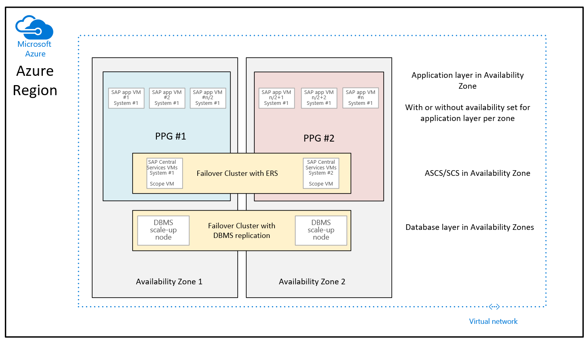
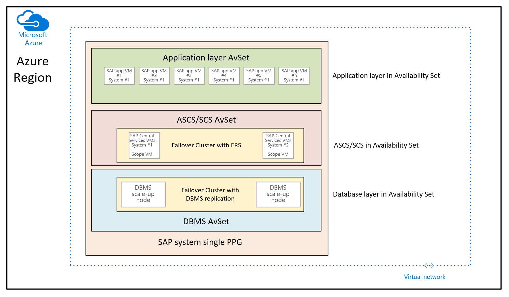
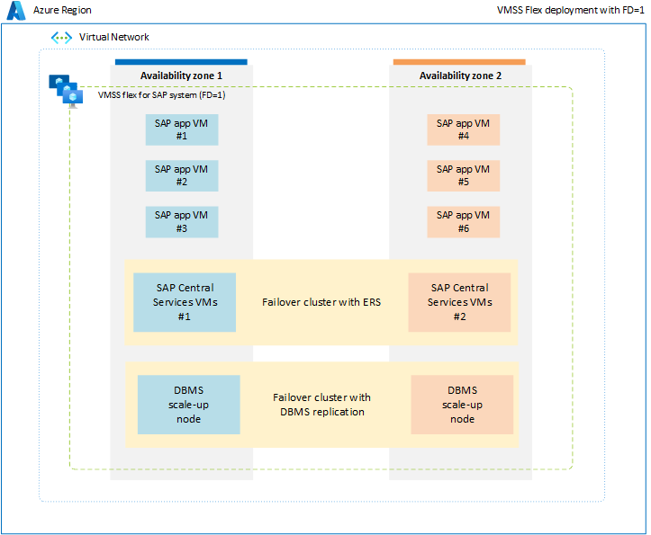

# Configuration options for optimal network latency with SAP applications

> [!IMPORTANT]
> In November 2021 we made significant changes in the way how proximity placement groups should be used with SAP workload in zonal deployments.

SAP applications based on the SAP NetWeaver or SAP S/4HANA architecture are sensitive to network latency between the SAP application tier and the SAP database tier. This sensitivity is the result of most of the business logic running in the application layer. Because the SAP application layer runs the business logic, it issues queries to the database tier at a high frequency, at a rate of thousands or tens of thousands per second. In most cases, the nature of these queries is simple. They can often be run on the database tier in 500 microseconds or less.

The time spent on the network to send such a query from the application tier to the database tier and receive the result sent back has a major impact on the time it takes to run business processes. This sensitivity to network latency is why you might want to achieve certain minimum network latency in SAP deployment projects. See [SAP Note #1100926 - FAQ: Network performance](https://launchpad.support.sap.com/#/notes/1100926/E) for guidelines on how to classify the network latency.

In many Azure regions, the number of datacenters has grown. At the same time, customers, especially for high-end SAP systems, are using more special VM families like M- or Mv2 family, or in rare cases HANA Large Instances. These Azure virtual machine types aren't always available in each of the datacenters that collect into an Azure region. These facts can create opportunities to optimize network latency between the SAP application layer and the SAP DBMS layer.

Azure provides different deployment options for SAP workloads, enabling you to optimize network latency. Detailed information about each option is thoroughly described in the following section:

- [Proximity Placement Groups](#proximity-placement-groups)
- [Virtual Machine Scale Set with Flexible Orchestration](#virtual-machine-scale-set-with-flexible-orchestration)

## Proximity Placement Groups

Proximity placement groups enable the grouping of different VM types under a single network spine, ensuring optimal low network latency between them. When the first VM is deployed in proximity placement group, that VM gets bound to a specific network spine. As all the other VMs that are going to be deployed into the same proximity placement group, those VMs get grouped under the same network spine. As appealing as this prospect sounds, the usage of the construct introduces some restrictions and pitfalls as well:

- You can't assume that all Azure VM types are available in every and all Azure datacenters or under each and every network spine. As a result, the combination of different VM types within one proximity placement group can be severely restricted. These restrictions occur because the host hardware that is needed to run a certain VM type might not be present in the datacenter or under the network spine to which the proximity placement group was assigned
- As you resize parts of the VMs that are within one proximity placement group, you can't automatically assume that in all cases the new VM type is available in the same datacenter or under the network spine the proximity placement group got assigned to
- As Azure decommissions hardware it might force certain VMs of a proximity placement group into another Azure datacenter or another network spine. For details covering this case, read the document [Proximity placement groups](../../virtual-machines/co-location.md#planned-maintenance-and-proximity-placement-groups)  

> [!IMPORTANT]
> As a result of the potential restrictions, proximity placement groups should be only used:
>
> - When necessary in certain scenarios (see later)
> - When the network latency between application layer and DBMS layer is too high and impacts the workload
> - Only on granularity of a single SAP system and not for a whole system landscape or a complete SAP landscape
> - In a way to keep the different VM types and the number of VMs within a proximity placement group to a minimum

The scenarios where you used proximity placement groups so far were:

- Deploying SAP workload with availability sets. Where the SAP database tier, the SAP application tier and ASCS/SCS VMs were grouped in three different availability sets. In such a case, you wanted to make sure that the availability sets weren't spread across the complete Azure region since this could, dependent on the Azure region, result in network latency that could impact SAP workload negatively
- You wanted to deploy the critical resources of your SAP workload across different Availability Zones and on the other hand wanted to make sure that the VMs of the application tier in each of the zones would be spread across different fault domains by using availability sets. In this case, as later described in the document, proximity placement groups are the glue needed
- You used proximity placement groups to group VMs together to achieve optimal network latency between the services hosted in the VMs

As for deployment scenario #1, in many regions, especially regions without Availability Zones and most regions with Availability Zones, the network latency independent on where the VMs land is acceptable. Though there are some regions of Azure that can't provide a sufficiently good experience without collocating the three different availability sets without the usage of proximity placement groups.

As of the deployment scenario #2, we're going to recommend a different way of using proximity placement groups in the following sections of this document.

### What are proximity placement groups?

An Azure proximity placement group is a logical construct. When a proximity placement group is defined, it's bound to an Azure region and an Azure resource group. When VMs are deployed, a proximity placement group is referenced by:

- The first Azure VM deployed under a network spine with many Azure compute units and low network latency. Such a network spine often matches a single Azure datacenter. You can think of the first virtual machine as a "scope VM" that is deployed into a compute scale unit based on Azure allocation algorithms that are eventually combined with deployment parameters.
- All subsequent VMs deployed that reference the proximity placement group are going to be deployed under the same network spine as the first virtual machine.

> [!NOTE]
> If there's no host hardware deployed that could run a specific VM type under the network spine where the first VM was placed, the deployment of the requested VM type won’t succeed. You’ll get an allocation failure message that indicates that the VM can't be supported within the perimeter of the proximity placement group.

To reduce risk of the above, it's recommended to use the intent option when creating the proximity placement group. The intent option allows you to list the VM types that you're intending to include into the proximity placement group. This list of VM types will be taken to find the best datacenter that hosts these VM types. If such a datacenter is found, the PPG is going to be created and is scoped for the datacenter that fulfills the VM SKU requirements. If there's no such datacenter found, the creation of the proximity placement group is going to fail. You can find more information in the documentation [PPG - Use intent to specify VM sizes](../../virtual-machines/co-location.md#use-intent-to-specify-vm-sizes). Be aware that actual capacity situations aren't taken into account in the checks triggered by the intent option. As a result, there still could be allocation errors rooted in insufficient capacity available.

A single [Azure resource group](../../azure-resource-manager/management/manage-resources-portal.md) can have multiple proximity placement groups assigned to it. But a proximity placement group can be assigned to only one Azure resource group.

### Proximity placement groups with SAP systems that use only Azure VMs

In this section, we're going through the deployment architectures used so far and new recommendations

#### Proximity placement groups with zonal deployments

For deployments that don't use HANA Large Instances, it's important to provide a reasonably low network latency between the SAP application tier and the DBMS tier. To enable such a reasonably low network latency for a limited set of scenarios, an Azure proximity placement group can be defined for such an SAP system.

Avoid bundling several SAP production or nonproduction systems into a single proximity placement group. Avoid bundles of SAP systems because the more systems you group in a proximity placement group, the higher the chances:

- That you require a VM type that isn't available under the network spine into which the proximity placement group was assigned to.
- That resources of nonmainstream VMs, like M-Series VMs, could eventually be unfulfilled when you need to expand the number of VMs into a proximity placement group over time.

The proximity placement group usage that we recommended so far, looks like in this graphic


You created a proximity placement group (PPG) in each of the two Availability Zones you deployed your SAP system into. All the VMs of a particular zone are part of the individual proximity placement group of that particular zone. You started in each zone with deploying the DBMS VM to scope the PPG and then deployed the ASCS VM into the same zone and PPG. In a third step, you created an Azure availability set, assigned the availability set to the scoped PPG and deployed the SAP application layer into it. The advantage of this configuration was that all the components were nicely aligned underneath the same network spine. The large disadvantage is that your flexibility in resizing virtual machines can be limited.

Based on many improvements deployed by Microsoft into the Azure regions to reduce network latency within an Azure Availability Zone, the new deployment guidance for zonal deployments, looks like:



The difference to the recommendation given so far is that the database VMs in the two zones are no more a part of the proximity placement groups. The proximity placement groups per zone are now scoped with the deployment of the VM running the SAP ASCS/SCS instances. This also means that for the regions where Availability Zones are collected by multiple datacenters, the ASCS/SCS instance, and the application tier could run under one network spine and the database VMs could run under another network spine. Though with the network improvements made, the network latency between the SAP application tier and the DBMS tier still should be sufficient for sufficiently good performance and throughput. The advantage of this new configuration is that you have more flexibility in resizing VMs or moving to new VM types with either the DBMS layer or/and the application layer of the SAP system.

For the special case of using Azure NetApp Files (ANF) for the DBMS environment and the ANF related new functionality of [Azure NetApp Files application volume group for SAP HANA](../../azure-netapp-files/application-volume-group-introduction.md) and its necessity for proximity placement groups, check the document [NFS v4.1 volumes on Azure NetApp Files for SAP HANA](./hana-vm-operations-netapp.md).

#### Proximity placement groups with availability set deployments

In this case, the purpose is to use proximity placement groups to collocate the VMs that are deployed through different availability sets. In this usage scenario, you aren't using a controlled deployment across different Availability Zones in a region. Instead you want to deploy the SAP system by using availability sets. As a result, you have at least an availability set for the DBMS VMs, ASCS/SCS VMs, and the application tier VMs. Since you can't specify at deployment time of a VM an availability set AND an Availability Zone, you can't control where the VMs in the different availability sets are going to be allocated. This could result in some Azure regions that the network latency between different VMs, still could be too high to give a sufficiently good performance experience. So the resulting architecture would look like:



In this graphic, a single proximity placement group would be assigned to a single SAP system. This PPG gets assigned to the three availability sets. The proximity placement group is then scoped by deploying the first database tier VMs into the DBMS availability set. This architecture recommendation collocates all VMs under the same network spine. It's introducing the restrictions mentioned earlier in this article. Therefore, the proximity placement group architecture should be used sparsely.

### Proximity placement groups and HANA Large Instances

If some of your SAP systems rely on [HANA Large Instances](../../virtual-machines/workloads/sap/hana-overview-architecture.md) for the application layer, you can experience significant improvements in network latency between the HANA Large Instances unit and Azure VMs when you're using HANA Large Instances units that are deployed in [Revision 4 rows or stamps](../../virtual-machines/workloads/sap/hana-network-architecture.md#networking-architecture-for-hana-large-instance). One improvement is that HANA Large Instances units, as they're deployed, deploy with a proximity placement group. You can use that proximity placement group to deploy your application layer VMs. As a result, those VMs will be deployed in the same datacenter that hosts your HANA Large Instances unit.

To determine whether your HANA Large Instances unit is deployed in a Revision 4 stamp or row, check the article [Azure HANA Large Instances control through Azure portal](../../virtual-machines/workloads/sap/hana-li-portal.md#look-at-attributes-of-single-hli-unit). In the attributes overview of your HANA Large Instances unit, you can also determine the name of the proximity placement group because it was created when your HANA Large Instances unit was deployed. The name that appears in the attributes overview is the name of the proximity placement group that you should deploy your application layer VMs into.

As compared to SAP systems that use only Azure virtual machines, when you use HANA Large Instances, you have less flexibility in deciding how many [Azure resource groups](../../azure-resource-manager/management/manage-resources-portal.md) to use. All the HANA Large Instances units of a [HANA Large Instances tenant](../../virtual-machines/workloads/sap/hana-know-terms.md) are grouped in a single resource group, as described [this article](../../virtual-machines/workloads/sap/hana-li-portal.md#display-of-hana-large-instance-units-in-the-azure-portal). Unless you deploy into different tenants to separate, for example, production and nonproduction systems or other systems, all your HANA Large Instances units will be deployed in one HANA Large Instances tenant. This tenant has a one-to-one relationship with a resource group. But a separate proximity placement group will be defined for each of the single units.

As a result, the relationships among Azure resource groups and proximity placement groups for a single tenant will be as shown here:


### Example of deployment with proximity placement groups

Following are some PowerShell commands that you can use to deploy your VMs with Azure proximity placement groups.

The first step, after you sign in to [Azure Cloud Shell](https://azure.microsoft.com/features/cloud-shell/), is to check whether you're in the Azure subscription that you want to use for the deployment:

```azurepowershell-interactive
Get-AzureRmContext

# If you need to change to a different subscription, you can do so by running this command:
Set-AzureRmContext -Subscription "PPG test subscription"

# Create a new Azure resource group by running this command:
New-AzResourceGroup -Name "ppgexercise" -Location "westus2"

# Create the new proximity placement group by running this command:
New-AzProximityPlacementGroup -ResourceGroupName "ppgexercise" -Name "collocate" -Location "westus2"

# Deploy your first VM into the proximity placement group by using a command like this one:
New-AzVm -ResourceGroupName "ppgexercise" -Name "ppgscopevm" -Location "westus2" -OpenPorts 80,3389 -ProximityPlacementGroup "collocate" -Size "Standard_E16s_v4"
```

The preceding command deploys a Windows-based VM. After this VM deployment succeeds, the network spine scope of the proximity placement group is defined within the Azure region. All subsequent VM deployments that reference the proximity placement group, as shown in the preceding command, will be deployed under the same network spine, as long as the VM type can be hosted on hardware placed under that network spine, and capacity for that VM type is available.

### Combine availability sets and Availability Zones with proximity placement groups

One of the problems to using Availability Zones for SAP system deployments is that you can’t deploy the SAP application tier by using availability sets within the specific Availability Zone. You want the SAP application tier to be deployed in the same zones as the SAP ASCS/SCS VMs. Referencing an Availability Zone and an availability set when deploying a single VM isn't possible so far. But just deploying a VM instructing an Availability Zone, you lose the ability to make sure the application layer VMs are spread across different update and failure domains.

By using proximity placement groups, you can bypass this restriction. Here's the deployment sequence:

- Create a proximity placement group.
- Deploy your anchor VM, recommended being the ASCS/SCS VM, by referencing an Availability Zone.
- Create an availability set that references the Azure proximity group. (See the command later in this article.)
- Deploy the application layer VMs by referencing the availability set and the proximity placement group.

Instead of deploying the first VM as demonstrated in the previous section, you reference an Availability Zone and the proximity placement group when you deploy the VM:

```azurepowershell-interactive
New-AzVm -ResourceGroupName "ppgexercise" -Name "centralserviceszone1" -Location "westus2" -OpenPorts 80,3389 -Zone "1" -ProximityPlacementGroup "collocate" -Size "Standard_E8s_v4"
```

A successful deployment of this virtual machine would host the ASCS/SCS instance of the SAP system in one Availability Zone. The scope of the proximity placement group is fixed to one of the network spines in the Availability Zone you defined.

In the next step, you need to create the availability sets you want to use for the application layer of your SAP system.

Define and create the proximity placement group. The command for creating the availability set requires an additional reference to the proximity placement group ID (not the name). You can get the ID of the proximity placement group by using this command:

```azurepowershell-interactive
Get-AzProximityPlacementGroup -ResourceGroupName "ppgexercise" -Name "collocate"
```

When you create the availability set, you need to consider additional parameters when you're using managed disks (default unless specified otherwise) and proximity placement groups:

```azurepowershell-interactive
New-AzAvailabilitySet -ResourceGroupName "ppgexercise" -Name "ppgavset" -Location "westus2" -ProximityPlacementGroupId "/subscriptions/my very long ppg id string" -sku "aligned" -PlatformUpdateDomainCount 3 -PlatformFaultDomainCount 2 
```

Ideally, you should use three fault domains. But the number of supported fault domains can vary from region to region. In this case, the maximum number of fault domains possible for the specific regions is two. To deploy your application layer VMs, you need to add a reference to your availability set name and the proximity placement group name, as shown here:

```azurepowershell-interactive
New-AzVm -ResourceGroupName "ppgexercise" -Name "appinstance1" -Location "westus2" -OpenPorts 80,3389 -AvailabilitySetName "myppgavset" -ProximityPlacementGroup "collocate" -Size "Standard_E16s_v4"
```

The result of this deployment is:

- A Central Services for your SAP system that's located in a specific Availability Zone or Availability Zones.
- An SAP application layer that's located through availability sets in the same network spine as the SAP Central services (ASCS/SCS) VM or VMs.

> [!NOTE]
> Because you deploy one DBMS and ASCS/SCS VMs into one zone and the second DBMS and ASCS/SCS VMs into another zone to create a high availability configurations, you'll need a different proximity placement group for each of the zones. The same is true for any availability set that you use.

### Change proximity placement group configurations of an existing system

If you implemented proximity placement groups as of the recommendations given so far, and you want to adjust to the new configuration, you can do so with the methods described in these articles:

- [Deploy VMs to proximity placement groups using Azure CLI](../../virtual-machines/linux/proximity-placement-groups.md).
- [Deploy VMs to proximity placement groups using PowerShell](../../virtual-machines/windows/proximity-placement-groups.md).

You can also use these commands for cases where you're getting allocation errors in cases where you can't move to a new VM type with an existing VM in the proximity placement group.

## Virtual Machine Scale Set with Flexible orchestration

To avoid the limitations associated with proximity placement group, it's advised to deploy SAP workload across availability zones using flexible scale set with FD=1. This deployment strategy ensures that VMs deployed in each zone aren't restricted to a single datacenter or network spine, and all SAP system components, such as databases, ASCS/ERS, and application tier are scoped within a zone. With all SAP system components being scoped at the zonal level, the network latency between different components of a single SAP system must be sufficient to ensure satisfactory performance and throughput. The key benefit of this new deployment option with flexible scale set with FD=1 is that it provides greater flexibility in resizing VMs or switching to new VM types for all layers of SAP system. Also, the scale set would allocate VMs across multiple fault domains within a single zone, which is ideal for running multiple VMs of the application tier in each zone. For more information, see [virtual machine scale set for SAP workload](./virtual-machine-scale-set-sap-deployment-guide.md) document.



In a nonproduction or non-HA environment, it's possible to deploy all SAP system components, including the database, ASCS, and application tier, within a single zone using a flexible scale set with FD=1.

## Next steps

Check out the documentation:

- [SAP workloads on Azure: planning and deployment checklist](./deployment-checklist.md)
- [Deploy VMs to proximity placement groups using Azure CLI](../../virtual-machines/linux/proximity-placement-groups.md)
- [Deploy VMs to proximity placement groups using PowerShell](../../virtual-machines/windows/proximity-placement-groups.md)
- [Considerations for Azure Virtual Machines DBMS deployment for SAP workloads](./dbms-guide-general.md)
