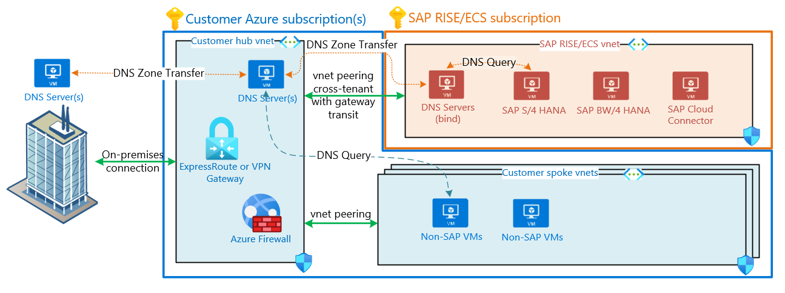

# Connectivity with SAP RISE

With your SAP landscape operated within RISE and running in a separate virtual network, in this article we provide available connectivity options.

## Virtual network peering with SAP RISE/ECS

A virtual network (vnet) peering is the most performant way to connect securely between two virtual networks, all in a private network address space. The peered networks appear as one for connectivity purposes, allowing applications to talk to each other. Applications running in different virtual networks, subscriptions, Azure tenants or regions can communicate directly. Like network traffic on a single virtual network, peering traffic remains in a private address space and doesn't traverse the internet.

For SAP RISE/ECS deployments, virtual peering is the preferred way to establish connectivity with customer’s existing Azure environment. Primary benefits are:
- Minimized network latency and maximum throughput between SAP RISE landscape and own applications and services running in Azure.
- No extra complexity and cost with different on-premises communication path for SAP RISE, instead using existing Azure network hub(s).

Virtual network peering can be set up within the same region as your SAP managed environment, but also through [global virtual network peering](../../virtual-network/virtual-network-peering-overview.md) between any two Azure regions. With SAP RISE/ECS available in many [Azure regions](https://azure.microsoft.com/global-infrastructure/geographies/), the region should match with workload running in customer virtual networks due to latency and peering cost considerations. However, some of the scenarios (for example, central S/4HANA deployment for a globally present company) also require to peer networks globally. For such globally distributed SAP landscape, we recommend to use multi-region network architecture within your own Azure environment, with SAP RISE peering locally in each geography to your network hubs.

:::image type="complex" source="./media/sap-rise-integration/sap-rise-peering.png" alt-text="Customer peering with SAP RISE/ECS":::
   This diagram shows a typical SAP customer's hub and spoke virtual networks. Cross-tenant virtual network peering connects SAP RISE and customer's hub virtual networks.
:::image-end:::

Both the SAP and customer virtual network(s) are protected with network security groups (NSG), permitting communication on SAP and database ports through the peering. Communication between the peered virtual networks is secured through these NSGs, limiting communication to and from customer’s SAP environment.

Since SAP RISE/ECS runs in SAP’s Azure tenant and subscriptions, set up the virtual network peering between [different tenants](../../virtual-network/create-peering-different-subscriptions.md). You accomplish this configuration by setting up the peering with the SAP provided network’s Azure resource ID and have SAP approve the peering. Add a user from the opposite Microsoft Entra tenant as a guest user, accept the guest user invitation and follow process documented at [Create a virtual network peering - different subscriptions](../../virtual-network/create-peering-different-subscriptions.md). Contact your SAP representative for the exact steps required. Engage the respective team(s) within your organization that deal with network, user administration and architecture to enable this process to be completed swiftly.

## VPN vnet-to-vnet

As an alternative to virtual network peering, virtual private network (VPN) connection can be established between VPN gateways, deployed both in the SAP RISE/ECS subscription and customers own. You can establish a [vnet-to-vnet connection](../../vpn-gateway/vpn-gateway-howto-vnet-vnet-resource-manager-portal.md) between these two VPN gateways, enabling fast communication between the two separate virtual networks. The respective networks and gateways can reside in different Azure regions.

:::image type="complex" source="./media/sap-rise-integration/sap-rise-vpn.png" alt-text="Diagram ofSAP RISE/ECS VPN connection to customer virtual network.":::
   This diagram shows a typical SAP customer's hub and spoke virtual networks. VPN gateway located in SAP RISE virtual network connects through vnet-to-vnet connection into gateway contained in customer's hub virtual network.
:::image-end:::

While virtual network peering is the recommended and more typical deployment model, a VPN vnet-to-vnet can potentially simplify a complex virtual peering between customer and SAP RISE/ECS virtual networks. The VPN Gateway acts as only point of entry into the customer’s network and is managed and secured by a central team. Network throughput is limited by the chosen gateway SKU on both sides. To address resiliency requirements, ensure [zone-redundant virtual network gateways](../../vpn-gateway/about-zone-redundant-vnet-gateways.md) are used for such connection.

Network Security Groups are in effect on both customer and SAP virtual network, identically to peering architecture enabling communication to SAP NetWeaver and HANA ports as required. For details how to set up the VPN connection and which settings should be used, contact your SAP representative.

## Connectivity back to on-premises

With an existing customer Azure deployment, on-premises network is already connected through ExpressRoute (ER) or VPN. The same on-premises network path is typically used for SAP RISE/ECS managed workloads. Preferred architecture is to use existing ER/VPN Gateways in customer’s  for this purpose, with connected SAP RISE virtual network seen as a spoke network connected to customer’s virtual network hub.

:::image type="complex" source="./media/sap-rise-integration/sap-rise-on-premises.png" alt-text="Example diagram of SAP RISE/ECS as spoke network peered to customer's virtual network hub and on-premises.":::
   This diagram shows a typical SAP customer's hub and spoke virtual networks. Connects to on-premises with a connection. Cross tenant virtual network peering connects SAP RISE virtual network to customer's hub network. The virtual network peering has remote gateway transit enabled, enabling SAP RISE virtual network to be accessed from on-premises.
:::image-end:::

With this architecture, central policies and security rules governing network connectivity to customer workloads also apply to SAP RISE/ECS managed workloads. The same on-premises network path is used for both customer's and SAP RISE/ECS virtual network.

If currently there's no present Azure to on-premises connectivity, contact your SAP representative for details which connections models are possible for the RISE workload. If SAP RISE/ECS establishes on-premises within RISE directly, such on-premises connection is available for reaching the SAP managed virtual network only. Such dedicated ExpressRoute or VPN connection within SAP RISE can't be used to access customer's own Azure virtual networks.

> [!NOTE] 
> A virtual network can have [only have one gateway](../../virtual-network/virtual-network-peering-overview.md#gateways-and-on-premises-connectivity), local or remote. With virtual network peering established between SAP RISE using remote gateway transit, no gateways can be added in the SAP RISE/ECS virtual network. A combination of virtual network peering with remote gateway transit together with another virtual network gateway in the SAP RISE/ECS virtual network isn't possible.

## Virtual WAN with SAP RISE managed workloads

Similarly to using a hub and spoke network architecture with connectivity to both SAP RISE/ECS virtual network and on-premises, Azure Virtual Wan (vWAN) hub can be used for same purpose. RISE workload is a spoke network connected to the vWAN network hub. Both connection options to SAP RISE described earlier – virtual network peering as well as VPN vnet-to-vnet – are available with vWAN.

The vWAN network hub is deployed and managed by customer in own subscription. Customer also manages entirely the on-premises connection and routing through vWAN network hub, with access to SAP RISE peered spoke virtual network.

## Connectivity during migration to SAP RISE

Migration of your SAP landscape to SAP RISE is done in several phases over several months or longer. Some of your SAP environments are migrated already and in use productively, while you prepare other SAP systems for migration. In most customer projects, the largest and most critical systems are migrated in the middle or at end of the project. You need to consider having ample bandwidth for data migration or database replication, and not impact the network path of your users to the already productive RISE environments. Already migrated SAP systems also might need to communicate with the SAP landscape still on-premises or at existing service provider. 

During your migration planning to SAP RISE, plan how in each phase SAP systems are reachable for your user base and how data transfer to RISE/ECS virtual network is routed. Often multiple locations and parties are involved, such as existing service provider and data centers with own connection to your corporate network. Make sure no temporary solutions with VPN connections are created without considering how in later phases SAP data gets migrated for the most business critical systems.

## DNS integration with SAP RISE/ECS managed workloads

Integration of customer owned networks with cloud based infrastructure and providing a seamless name resolution concept is a vital part of a successful project implementation. This diagram describes one of the common integration scenarios of SAP owned subscriptions, virtual networks and DNS infrastructure with customer’s local network and DNS services. In such setup, Azure hub or on-premises DNS servers are holding all DNS entries. The DNS infrastructure is capable to resolve DNS requests coming from all sources (on-premises clients, customer’s Azure services and SAP managed environments).

Design description and specifics:

  - Custom DNS configuration for SAP-owned virtual networks

  - Two VMs inside the RISE/PCE Azure virtual network host DNS servers

  - Customers must provide and delegate to SAP a subdomain/zone (for example, example ecs.contoso.com) to assign names and create forward and reverse DNS entries for the virtual machines that run SAP managed environment. SAP DNS servers are holding a master DNS role for the delegated zone

  - DNS zone transfer from SAP DNS server to customer’s DNS servers is the primary method to replicate DNS entries from RISE/PCE environment.

  - Customer's Azure virtual networks are also using custom DNS configuration referring to customer DNS servers located in Azure hub virtual network.

  - Optionally, customers can set up a private DNS forwarder within their Azure virtual networks. Such forwarder then pushes DNS requests coming from Azure services to SAP DNS servers that are targeted to the delegated zone (example ecs.contoso.com).

DNS zone transfer is applicable for the designs when customers operate custom DNS solution (for example, [AD DS](/windows-server/identity/ad-ds/active-directory-domain-services) or BIND servers) within their hub virtual network.

> [!NOTE]
> Both Azure provided DNS and Azure private zones **do not** support DNS zone transfer capability, hence, can't be used to accept DNS replication from SAP RISE/PCE/ECS DNS servers. Additionally, SAP typically does not support external DNS service providers for the delegated zone.

SAP published a blog post on the DNS implementation with SAP RISE in Azure, see [here for details](https://blogs.sap.com/2023/02/27/dns-integration-with-sap-rise-in-multi-cloud-environment-series-guide-azure/).

To further read about the usage of Azure DNS for SAP, outside the usage with SAP RISE/ECS see details in following [blog post](https://www.linkedin.com/posts/k-popov_sap-on-azure-dns-integration-whitepaper-activity-6841398577495977984-ui9V/).

## Internet outbound and inbound connections with SAP RISE/ECS

SAP workloads communicating with external applications and interfaces could require a network egress path to the Internet. Similarly, your company’s user base (for example, SAP Fiori) need an Internet ingress or inbound connections to the SAP landscape. For SAP RISE managed workloads, work with your SAP representative to explore needs for such https/RFC/other communication paths. Network communication to/from the Internet is by default not enabled for SAP RISE/ECS customers and default networking uses private IP ranges only. Internet connectivity requires planning with SAP, to optimally protect customer’s SAP landscape.

Should you enable Internet bound or incoming traffic with SAP RISE, the network communication is protected through various Azure technologies such as NSGs, ASGs, Application Gateway with Web Application Firewall (WAF), proxy servers and others depending on use and network protocols. These services are entirely managed through SAP within the SAP RISE/ECS virtual network and subscription. The network path SAP RISE to and from Internet remains typically within the SAP RISE/ECS virtual network only and doesn't transit into/from customer’s own vnet(s).

Applications within a customer’s own virtual network connect to the Internet directly from respective virtual network or through customer’s centrally managed services such as Azure Firewall, Azure Application Gateway, NAT Gateway and others. Connectivity to SAP BTP from non-SAP RISE/ECS applications takes the same network Internet bound path on your side. Should an SAP Cloud Connecter be needed for such integration, run it on customer’s VMs. In other words, SAP BTP or any public endpoint communication is on a network path managed by customers themselves if SAP RISE workload is not involved.

## SAP BTP connectivity

SAP Business Technology Platform (BTP) provides a multitude of applications typically accessed through public IP/hostname via the Internet. Customer's services running in their Azure subscriptions access BTP through the configured [outbound access method](../../virtual-network/ip-services/default-outbound-access.md), such as central firewall or outbound public IPs. Some SAP BTP services, such as SAP Data Intelligence, however is by design accessed through a [separate virtual network peering](https://help.sap.com/docs/SAP_DATA_INTELLIGENCE/ca509b7635484070a655738be408da63/a7d98ac925e443ea9d4a716a91e0a604.html) instead of a public endpoint.

SAP offers [Private Link Service](https://blogs.sap.com/2022/06/22/sap-private-link-service-on-azure-is-now-generally-available-ga/) for customers using SAP BTP on Azure. The SAP Private Link Service connects SAP BTP services through a private IP range into customer’s Azure network and thus accessible privately through the private link service instead of through the Internet. Contact SAP for availability of this service for SAP RISE/ECS workloads.

See [SAP's documentation](https://help.sap.com/docs/private-link/private-link1/consume-azure-services-in-sap-btp) and a series of blog posts on the architecture of the SAP BTP Private Link Service and private connectivity methods, dealing with DNS and certificates in following SAP blog series [Getting Started with BTP Private Link Service for Azure](https://blogs.sap.com/2021/12/29/getting-started-with-btp-private-link-service-for-azure/). 

## Network communication ports with SAP RISE

Any Azure service with access to the customer virtual network can communicate with the SAP landscape running within the SAP RISE/ECS subscription via the available ports.

:::image type="complex" source="./media/sap-rise-integration/sap-rise-open-ports.png" alt-text="Diagram of SAP's open ports for integration with SAP services":::
   Diagram of open ports on an SAP RISE/ECS system. RFC connections for BAPI and IDoc, https for OData and Rest/SOAP. ODBC/JDBC for direct database connections to SAP HANA. All connections through the private virtual network peering. Application Gateway with public IP for https as a potential option, managed through SAP.
:::image-end:::

Your SAP system in SAP RISE can be accessed through the open network ports, as configured and opened by SAP for your use. https, RFC and JDBC/ODBC protocols can be used through private network address ranges. Additionally, applications can access through https on a publicly available IP, exposed by SAP RISE managed Azure application gateway. For details and settings for the application gateway and NSG open ports, contact SAP.

See further document [Integrating Azure services with SAP RISE](./rise-integration-services.md) how the available connectivity allows you to extend your SAP landscape with Azure services.

## Next steps
Check out the documentation:

- [Integrating Azure with SAP RISE](./rise-integration.md)
- [Integrating Azure services with SAP RISE](./rise-integration-services.md)
- [Identity and security in Azure with SAP RISE](./rise-integration-security.md)
- [Virtual network peering](../../virtual-network/virtual-network-peering-overview.md)
- [DNS integration with SAP RISE in multicloud environment series guide – Azure | SAP Blogs](https://blogs.sap.com/2023/02/27/dns-integration-with-sap-rise-in-multi-cloud-environment-series-guide-azure/)
