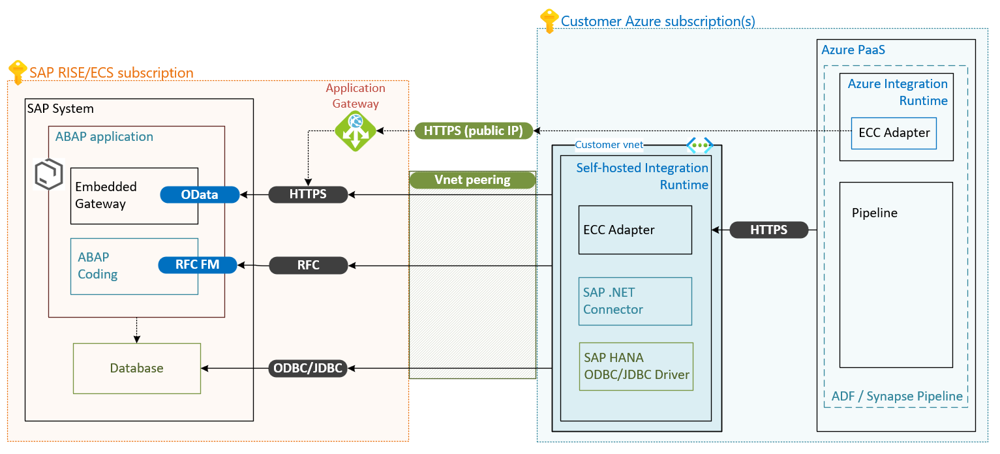
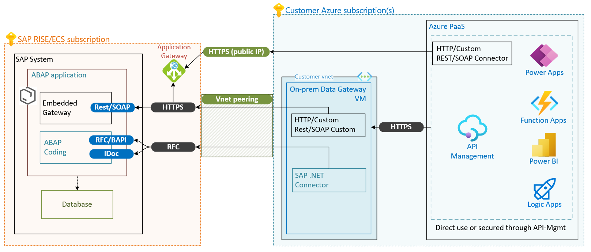

# Integration with Azure services 

With the information about available interfaces to the SAP RISE/ECS landscape, several methods of integration with Azure Services are possible.

- Data integration scenarios with Azure Data Factory or Synapse Analytics require a self-hosted integration runtime or Azure Integration Runtime. For details see the next chapter.

- App integration scenarios with Microsoft services using ABAP with the [ABAP SDK for Azure](https://github.com/microsoft/ABAP-SDK-for-Azure) and the [Microsoft AI SDK for SAP](https://github.com/microsoft/aisdkforsapabap). Installation requires prior setup of [abapGit](https://docs.abapgit.org/user-guide/getting-started/install.html). See [this SAP blog post](https://blogs.sap.com/2023/06/06/kick-start-your-sap-abap-platform-integration-journey-with-microsoft/) for more information about ABAP Platform and ABAP Cloud environment.

- App integration scenarios with Microsoft services using [Azure Integration Services](https://azure.microsoft.com/product-categories/integration/) serving as intermediary to address the desired integration pattern. Consumers like Power Apps, Power BI, Azure Functions and Azure App Service are governed and secured through [Azure API Management](/azure/api-management/api-management-key-concepts) deployed in the customer environment. This component offers industry standard features such as [request throttling](/azure/api-management/api-management-sample-flexible-throttling), [usage quotas](/azure/api-management/api-management-sample-flexible-throttling#quotas), and [SAP Principal Propagation](/azure/sap/workloads/expose-sap-odata-to-power-query) to retain the SAP backend authorizations with Microsoft 365 authenticated callers. Find the API Management policy for SAP Principal Propagation [here.](https://github.com/Azure/api-management-policy-snippets/blob/master/examples/Request%20OAuth2%20access%20token%20from%20SAP%20using%20AAD%20JWT%20token.xml)

- SAP legacy protocols remote function calls (RFC) support with built-in connectors for Azure Logic Apps, Power Apps, Power BI through the Microsoft on-premises data gateway between the SAP RISE system and Azure service. See below chapters for more details.

Find a comprehensive overview of all the available SAP and Microsoft integration scenarios [here](/azure/sap/workloads/integration-get-started).

### Integration with self-hosted integration runtime

Integrating your SAP system with Azure cloud native services such as Azure Data Factory or Azure Synapse would use these communication channels to the SAP RISE/ECS managed environment.

The following high-level architecture shows possible integration scenario with Azure data services such as [Data Factory](../../data-factory/index.yml) or [Synapse Analytics](../../synapse-analytics/index.yml). For these Azure services either a self-hosted integration runtime (self-hosted IR or IR) or Azure integration runtime (Azure IR) can be used. The use of either integration runtime depends on the [chosen data connector](../../data-factory/copy-activity-overview.md#supported-data-stores-and-formats), most SAP connectors are only available for the self-hosted IR. [SAP ECC connector](../../data-factory/connector-sap-ecc.md?tabs=data-factory) is capable of being using through both Azure IR and self-hosted IR. The choice of IR governs the network path taken. SAP .NET connector is used for [SAP table connector](../../data-factory/connector-sap-ecc.md?tabs=data-factory), [SAP BW](../../data-factory/connector-sap-business-warehouse.md?tabs=data-factory) and [SAP OpenHub](../../data-factory/connector-sap-business-warehouse-open-hub.md) connectors alike. All these connectors use SAP function modules (FM) on the SAP system, executed through RFC connections. Last if direct database access has been agreed with SAP, along with users and connection path opened, ODBC/JDBC connector for [SAP HANA](../../data-factory/connector-sap-hana.md?tabs=data-factory) can be used from the self-hosted IR as well.

For data connectors using the Azure IR, this IR accesses your SAP environment through a public IP address. SAP RISE/ECS provides this endpoint through an application gateway for use and the communication and data movement is through https.

Data connectors within the self-hosted integration runtime communicate with the SAP system within SAP RISE/ECS subscription and vnet through the established vnet peering and private network address only. The established network security group rules limit which application can communicate with the SAP system.

The customer is responsible for deployment and operation of the self-hosted integration runtime within their subscription and vnet. The communication between Azure PaaS services such as Data Factory or Synapse Analytics and self-hosted integration runtime is within the customer’s subscription. SAP RISE/ECS exposes the communication ports for these applications to use but has no knowledge or support about any details of the connected application or service.

Contact SAP for details on communication paths available to you with SAP RISE and the necessary steps to open them. SAP must also be contacted for any SAP license details for any implications accessing SAP data through any external applications.

Learn more about the overall support on SAP data integration scenario from our [Cloud Adoption Framework](/azure/cloud-adoption-framework/scenarios/sap/sap-lza-choose-azure-connectors) with detailed introduction on each SAP connector, comparison and guidance. The whitepaper [SAP data integration using Azure Data Factory whitepaper](https://github.com/Azure/Azure-DataFactory/blob/master/whitepaper/SAP%20Data%20Integration%20using%20Azure%20Data%20Factory.pdf) completes the picture.

### On-premises data gateway

Further Azure Services such as [Azure Logic Apps](../../logic-apps/logic-apps-using-sap-connector.md), [Power Apps](/connectors/saperp/) or [Power BI](/power-bi/connect-data/desktop-sap-bw-connector) communicate and exchange data with SAP systems through an on-premises data gateway where required. The on-premises data gateway is a virtual machine, running in Azure or on-premises. It provides secure data transfer between these Azure Services and your SAP systems including the option for runtime and driver support for SAP RFCs.

With SAP RISE, the on-premises data gateway can connect to Azure Services running in customer’s Azure subscription. This VM running the data gateway is deployed and operated by the customer. Following high-level architecture serves as overview, similar method can be used for either service.

The SAP RISE environment here provides access to the SAP ports for RFC and https described earlier. The communication ports are accessed by the private network address through the vnet peering or VPN site-to-site connection. The on-premises data gateway VM running in customer’s Azure subscription uses the [SAP .NET connector](https://support.sap.com/en/product/connectors/msnet.html) to run RFC, BAPI or IDoc calls through the RFC connection. Additionally, depending on service and way the communication is set up, a way to connect to public IP of the SAP systems REST API through https might be required. The https connection to a public IP can be exposed through SAP RISE/ECS managed application gateway. This high level architecture shows the possible integration scenario. Alternatives to it such as using Logic Apps single tenant and [private endpoints](../../logic-apps/secure-single-tenant-workflow-virtual-network-private-endpoint.md) to secure the communication and other can be seen as extension and aren't described here in.

SAP RISE/ECS exposes the communication ports for these applications to use but has no knowledge about any details of the connected application or service running in a customer’s subscription.

SAP RISE/ECS exposes the communication ports for these applications to use but has no knowledge about any details of the connected application or service running in a customer’s subscription. Contact SAP for any SAP license details for any implications accessing SAP data through Azure service connecting to the SAP system or database.

## Identity, security and monitoring with SAP RISE

### Single sign-on for SAP 

Single sign-On (SSO) is configured for many SAP environments. With SAP workloads running in ECS/RISE, steps identical to a natively run SAP system can be followed. The integration steps with Microsoft Entra ID based SSO are available for typical ECS/RISE managed workloads:
- [Tutorial: Microsoft Entra Single sign-on (SSO) integration with SAP NetWeaver](../../active-directory/saas-apps/sap-netweaver-tutorial.md)
- [Tutorial: Microsoft Entra single sign-on (SSO) integration with SAP Fiori](../../active-directory/saas-apps/sap-fiori-tutorial.md)
- [Tutorial: Microsoft Entra integration with SAP HANA](../../active-directory/saas-apps/saphana-tutorial.md)

| SSO method | Identity Provider     | Typical use case                 | Implementation            |
| :--------- | :-------------------: | :------------------------------- | :------------------------ |
| SAML/OAuth | Microsoft Entra ID         | SAP Fiori, Web GUI, Portal, HANA | Customer configuration    |
| SNC        | Microsoft Entra ID         | SAP GUI                          | Customer configuration    |
| SPNEGO     | Active Directory (AD) | Web GUI, Portal                  | Customer configuration    |

SSO against Active Directory (AD) of your Windows domain for ECS/RISE managed SAP environment, with SAP SSO Secure Login Client requires AD integration for end user devices. With SAP RISE, any Windows systems are not integrated with the customer's active directory domain. This isn't necessary for SSO with AD/Kerberos as the domain security token is read on the client device and exchanged securely with SAP system. Contact SAP if you require any changes to integrate AD based SSO or using third party products other than SAP SSO Secure Login Client, as some configuration on RISE managed systems might be required.

### Microsoft Sentinel with SAP RISE

The [SAP RISE certified](https://www.sap.com/dmc/exp/2013_09_adpd/enEN/#/solutions?id=s:33db1376-91ae-4f36-a435-aafa892a88d8) Microsoft Sentinel solution for SAP applications allows you to monitor, detect, and respond to suspicious activities and guard your critical data against sophisticated cyberattacks for SAP systems hosted on Azure, other clouds, or on-premises infrastructure. 

The solution allows you to gain visibility to user activities on SAP RISE/ECS and the SAP business logic layers and apply Sentinel’s built-in content.
-	Use a single console to monitor all your enterprise estate including SAP instances in SAP RISE/ECS on Azure and other clouds, SAP Azure native and on-premises estate
-	Detect and automatically respond to threats: detect suspicious activity including privilege escalation, unauthorized changes, sensitive transactions, data exfiltration and more with out-of-the-box detection capabilities
-	Correlate SAP activity with other signals: more accurately detect SAP threats by cross-correlating across endpoints, Microsoft Entra data and more
-	Customize based on your needs - build your own detections to monitor sensitive transactions and other business risks
-	Visualize the data with built-in workbooks

:::image type="complex" source="./media/sap-rise-integration/sap-rise-sentinel.png" alt-text="Connecting Sentinel with SAP RISE/ECS":::
   This diagram shows an example of Microsoft Sentinel connected through an intermediary VM or container to SAP managed SAP system. The intermediary VM or container runs in customer's own subscription with configured SAP data connector agent.
:::image-end:::

For SAP RISE/ECS, the Microsoft Sentinel solution must be deployed in customer's Azure subscription. All parts of the Sentinel solution are managed by customer and not by SAP. Private network connectivity from customer's vnet is needed to reach the SAP landscapes managed by SAP RISE/ECS. Typically, this connection is over the established vnet peering or through alternatives described in this document.

To enable the solution, only an authorized RFC user is required and nothing needs to be installed on the SAP systems. The container-based [SAP data collection agent](../../sentinel/sap/deployment-overview.md) included with the solution can be installed either on VM or AKS/any Kubernetes environment. The collector agent uses an SAP service user to consume application log data from your SAP landscape through RFC interface using standard RFC calls. 
- Authentication methods supported in SAP RISE: SAP username and password or X509/SNC certificates
- Only RFC based connections are possible currently with SAP RISE/ECS environments

Note for running Microsoft Sentinel in an SAP RISE/ECS environment:
- The following log fields/source require an SAP transport change request: Client IP address information from SAP security audit log, DB table logs (preview), spool output log. Sentinel's built-in content (detections, workbooks and playbooks) provides extensive coverage and correlation without those log sources.
-	SAP infrastructure and operating system logs aren't available to Sentinel in RISE, including VMs running SAP, SAPControl data sources, network resources placed within ECS. SAP monitors elements of the Azure infrastructure and operation system independently.

Use pre-built playbooks for security, orchestration, automation and response capabilities (SOAR) to react to threats quickly. A popular first scenario is SAP user blocking with intervention option from Microsoft Teams. The integration pattern can be applied to any incident type and target service spanning towards SAP Business Technology Platform (BTP) or Microsoft Entra ID with regard to reducing the attack surface.

For more information on Microsoft Sentinel and SOAR for SAP, see the blog series [From zero to hero security coverage with Microsoft Sentinel for your critical SAP security signals](https://blogs.sap.com/2023/05/22/from-zero-to-hero-security-coverage-with-microsoft-sentinel-for-your-critical-sap-security-signals-blog-series/).

:::image type="complex" source="./media/sap-rise-integration/sap-rise-sentinel-adaptive-card.png" alt-text="Using Sentinel SOAR capability with SAP RISE/ECS":::
   This image shows an SAP incident detected by Sentinel offering the option to block the suspicious user on the SAP ERP, SAP Business Technology Platform or Microsoft Entra ID.
:::image-end:::

For more information on Microsoft Sentinel and SAP, including a deployment guide, see [Sentinel product documentation](../../sentinel/sap/deployment-overview.md).

### Azure Monitoring for SAP with SAP RISE

[Azure Monitoring for SAP](../monitor/about-azure-monitor-sap-solutions.md) is an Azure-native solution for monitoring your SAP system. It extends the Azure monitor platform monitoring capability with support to gather data about SAP NetWeaver, database, and operating system details.

> [!Note]
> SAP RISE/ECS is a fully managed service for your SAP landscape and thus Azure Monitoring for SAP is not intended to be utilized for such managed environment.

SAP RISE/ECS doesn't support any integration with Azure Monitoring for SAP. RISE/ECS’s own monitoring and reporting is provided to the customer as defined by your service description with SAP.

### Azure Center for SAP Solutions

Just as with Azure Monitoring for SAP, SAP RISE/ECS doesn't support any integration with [Azure Center for SAP Solutions](../center-sap-solutions/overview.md) in any capability. All SAP RISE workloads are deployed by SAP and running in SAP's Azure tenant and subscription, without any access by customer to the Azure resources.

## Next steps
Check out the documentation:

- [Integrating Azure with SAP RISE managed workloads](./rise-integration.md)
- [Network connectivity options in Azure with SAP RISE managed workloads](./rise-integration-network.md)
- [Deploy Microsoft Sentinel solution for SAP® applicationsE](../../sentinel/sap/deployment-overview.md)
- [SAP Data Integration Using Azure Data Factory](https://github.com/Azure/Azure-DataFactory/blob/main/whitepaper/SAP%20Data%20Integration%20using%20Azure%20Data%20Factory.pdf)
