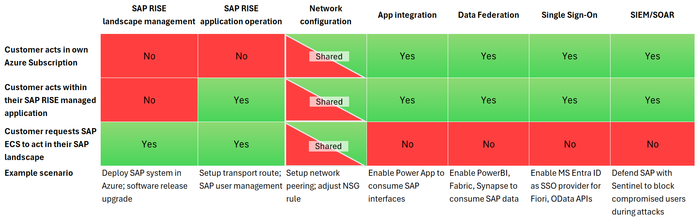

# Integrating Azure with SAP RISE managed workloads

For customers with SAP solutions such as RISE with SAP Enterprise Cloud Services (ECS) and SAP S/4HANA Cloud, private edition (PCE) deployed in Azure, integrating the SAP managed environment with their own Azure ecosystem and third party applications is of particular importance. The following articles explain the concepts and best practices to follow for a performant and secure solution.

- [Network connectivity options in Azure with SAP RISE](./rise-integration-network.md)
- [Integrating Azure services with SAP RISE](./rise-integration-services.md)
- [Identity and security in Azure with SAP RISE](./rise-integration-security.md)

## Enablement of integration scenarios 

It's important to distinguish the responsibility between SAP and customer when enabling certain Azure scenarios. The following diagram illustrates most common situations.

There might be some circumstances when an initial request needs to be placed with SAP RISE for enablement. However, most Azure scenarios depend on open network communication to available SAP interfaces and activities entirely within customer's responsibility. Diagram shown doesn't replace or extends an existing responsibility matrix between the customer and SAP RISE/ECS.

## First steps

Review the specifics within this document and then jump to individual documents for your scenario. From the integration table, some examples are listed.

- [Setup network peering](./rise-integration-network.md#virtual-network-peering-with-sap-riseecs)
- [Enable Power App to consume SAP interfaces](./rise-integration-services.md#on-premises-data-gateway)
- [Enable Power BI](./rise-integration-services.md#on-premises-data-gateway), Fabric and Synapse to consume SAP data.
- [Enable Microsoft Entra ID as SSO provider](./rise-integration-security.md#single-sign-on-for-sap)
- [Defend SAP at machine speed with Sentinel](./rise-integration-security.md#microsoft-sentinel-with-sap-rise) to block compromised users during attacks.

## Azure support

SAP RISE customers in Azure have the SAP landscape run by SAP in an Azure subscription owned by SAP. The subscription and all Azure resources of your SAP environment are visible to and managed by SAP only. In turn, the customer's own Azure environment contains applications that interact with the SAP systems. Elements such as virtual networks, network security groups, firewalls, routing, Azure services such as Azure Data Factory and others running inside the customer subscription access the SAP managed landscape. When you engage with Azure support, only resources in your own subscriptions are in scope. Contact SAP for issues with any resources operated in SAP's Azure subscriptions for your RISE workload.

:::image type="complex" source="./media/sap-rise-integration/sap-rise-support.png" alt-text="Diagram shows the separation of Azure support between SAP and customer's environments.":::
   This diagram shows a split of different Azure subscriptions. On one side, all customer subscriptions with customer managed workload. Other half with SAP ECS/RISE subscription containing customer's SAP workload, managed by SAP. Each side responsible themselves to contact Azure support, with no crossed responsibilities.
:::image-end:::

As part of your RISE project, document the interfaces and transfer points between your own Azure environment, SAP workload managed by SAP RISE and on-premises. Such document needs to include network information such as address space, firewall(s) and routing, file shares, Azure services, DNS and others. Document ownership of any interface partner and where any resource is running, to access this information quickly in a troubleshooting and support situation. Contact SAPs support organization for services running in SAP's Azure subscriptions.

> [!IMPORTANT]
> For all details about RISE with SAP and SAP S/4HANA Cloud private edition, contact your SAP representative.

## RISE architecture

SAP creates and manages the entire SAP RISE architecture running in SAP's subscription and Azure tenant. SAP also decides, validates and deploys all technical elements and details used by SAP for RISE in Azure. Microsoft and SAP are continuously working together to create the Azure infrastructure architectures optimized to support the RISE SLAs, to apply Azure best practices as documented by Microsoft, and adapt these best practices to the unique challenges of the RISE managed services. The cooperation on Azure architecture as experienced by RISE customers includes continuous optimizations and adoption of new Azure functionalities to provide added value for RISE customers. Microsoft documents the integration part with SAP RISE in these documents, however not the details about SAP's used architecture, which is intellectual property of SAP. From Microsoft's recommended architecture SAP might use modifications and optimizations in their employed architecture, to fulfill RISE SLAs and expectations by customers. Work with SAP on configuration and customization of the deployed RISE landscape, to fit your organization's requirements.

## Next steps
Check out the documentation:

- [Network connectivity options in Azure with SAP RISE](./rise-integration-network.md)
- [Integrating Azure services with SAP RISE](./rise-integration-services.md)
- [Identity and security in Azure with SAP RISE](./rise-integration-security.md)
- [Virtual network peering](../../virtual-network/virtual-network-peering-overview.md)
- [Get started with SAP on Azure VMs](./get-started.md)
