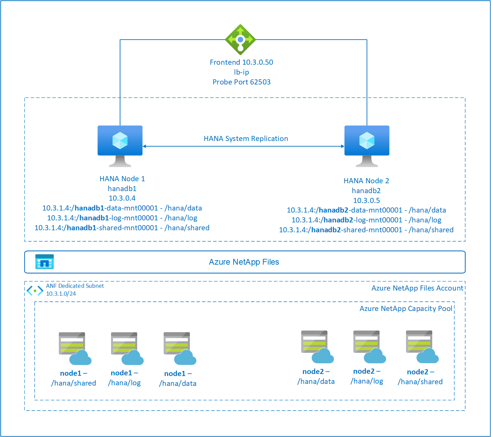

# High availability of SAP HANA Scale-up with Azure NetApp Files on SUSE Enterprise Linux

This article describes how to configure SAP HANA System Replication in Scale-up deployment, when the HANA file systems are mounted via NFS using Azure NetApp Files (ANF). In the example configurations and installation commands, instance number 03, and HANA System ID HN1 are used. SAP HANA Replication consists of one primary node and at least one secondary node.

When steps in this document are marked with the following prefixes, the meaning is as follows:

- [A]: The step applies to all nodes
- [1]: The step applies to node1 only
- [2]: The step applies to node2 only

Read the following SAP Notes and papers first:

- SAP Note [1928533](https://launchpad.support.sap.com/#/notes/1928533), which has:
  - The list of Azure VM sizes that are supported for the deployment of SAP software.
  - Important capacity information for Azure VM sizes.
  - The supported SAP software, and operating system (OS) and database combinations.
  - The required SAP kernel version for Windows and Linux on Microsoft Azure.
- SAP Note [2015553](https://launchpad.support.sap.com/#/notes/1928533) lists prerequisites for SAP-supported SAP software deployments in Azure.
- SAP Note [405827](https://launchpad.support.sap.com/#/notes/405827) lists out recommended file system for HANA environment.
- SAP Note [2684254](https://launchpad.support.sap.com/#/notes/2684254) -has recommended OS settings for SLES 15 / SLES for SAP Applications 15.
- SAP Note [1944799](https://launchpad.support.sap.com/#/notes/1944799) has SAP HANA Guidelines for SLES Operating System Installation.
- SAP Note [2178632](https://launchpad.support.sap.com/#/notes/2178632) has detailed information about all monitoring metrics reported for SAP in Azure.
- SAP Note [2191498](https://launchpad.support.sap.com/#/notes/2191498) has the required SAP Host Agent version for Linux in Azure.
- SAP Note [2243692](https://launchpad.support.sap.com/#/notes/2243692) has information about SAP licensing on Linux in Azure.
- SAP Note [1999351](https://launchpad.support.sap.com/#/notes/1999351) has more troubleshooting information for the Azure Enhanced Monitoring extension for SAP.
- SAP Note [1900823](https://launchpad.support.sap.com/#/notes/1900823): Contains information about SAP HANA storage requirements
- [SUSE SAP HA Best Practice Guides](https://www.suse.com/products/sles-for-sap/resource-library/sap-best-practices/): Contains all required information to set up NetWeaver High Availability and SAP HANA System Replication on-premises (to be used as a general baseline; they provide much more detailed information)
- [SAP Community Wiki](https://wiki.scn.sap.com/wiki/display/HOME/SAPonLinuxNotes) has all required SAP Notes for Linux.
- [Azure Virtual Machines planning and implementation for SAP on Linux](./planning-guide.md)
- [Azure Virtual Machines deployment for SAP on Linux](./deployment-guide.md)
- [Azure Virtual Machines DBMS deployment for SAP on Linux](./dbms-guide-general.md)
- General SLES documentation
  - [Setting up SAP HANA Cluster](https://documentation.suse.com/sles-sap/15-SP1/html/SLES4SAP-guide/cha-s4s-cluster.html).
  - [SLES High Availability Extension 15 SP3 Release Notes](https://www.suse.com/releasenotes/x86_64/SLE-HA/15-SP3/index.html)
  - [Operating System Security Hardening Guide for SAP HANA for SUSE Linux Enterprise Server 15](https://documentation.suse.com/sbp/all/html/OS_Security_Hardening_Guide_for_SAP_HANA_SLES15/index.html).
  - [SUSE Linux Enterprise Server for SAP Applications 15 SP3 Guide](https://documentation.suse.com/sles/15-SP3/)
  - [SUSE Linux Enterprise Server for SAP Applications 15 SP3 SAP Automation](https://documentation.suse.com/sles-sap/15-SP3/html/SLES-SAP-automation/article-sap-automation.html)
  - [SUSE Linux Enterprise Server for SAP Applications 15 SP3 SAP Monitoring](https://documentation.suse.com/sles-sap/15-SP3/html/SLES-SAP-monitoring/article-sap-monitoring.html)
- Azure-specific SLES documentation:
  - [Getting Started with SAP HANA High Availability Cluster Automation Operating on Azure](https://documentation.suse.com/sbp/all/html/SBP-SAP-HANA-PerOpt-HA-Azure/index.html)
  - [SUSE and Microsoft Solution Templates for SAP Applications Simplified Deployment on Microsoft](https://documentation.suse.com/sbp/all/html/SBP-SAP-AzureSolutionTemplates/index.html)
- [NetApp SAP Applications on Microsoft Azure using Azure NetApp Files](https://www.netapp.com/us/media/tr-4746.pdf)
- [NFS v4.1 volumes on Azure NetApp Files for SAP HANA](./hana-vm-operations-netapp.md)
- [Azure Virtual Machines planning and implementation for SAP on Linux](./planning-guide.md)

>[!NOTE]
> This article contains references to the term *slave*, a term that Microsoft no longer uses. When the term is removed from the software, we’ll remove it from this article.

## Overview

Traditionally in scale-up environment all file systems for SAP HANA are mounted from local storage. Setting up High Availability of SAP HANA System Replication on SUSE Enterprise Linux is published in guide [Set up SAP HANA System Replication on SLES](./sap-hana-high-availability.md)

To achieve SAP HANA High Availability of scale-up system on Azure NetApp Files NFS shares, we need some extra resource configuration in the cluster in order for HANA resources to recover, when one node loses access to the NFS shares on ANF.



SAP HANA filesystems are mounted on NFS shares using Azure NetApp Files on each node. File systems /hana/data, /hana/log, and /hana/shared are unique to each node.

Mounted on node1 (**hanadb1**)

- 10.3.1.4:/**hanadb1**-data-mnt00001 on /hana/data
- 10.3.1.4:/**hanadb1**-log-mnt00001 on /hana/log
- 10.3.1.4:/**hanadb1**-shared-mnt00001 on /hana/shared

Mounted on node2 (**hanadb2**)

- 10.3.1.4:/**hanadb2**-data-mnt00001 on /hana/data
- 10.3.1.4:/**hanadb2**-log-mnt00001 on /hana/log
- 10.3.1.4:/**hanadb2**-shared-mnt0001 on /hana/shared

> [!NOTE]
> File systems /hana/shared, /hana/data and /hana/log are not shared between the two nodes. Each cluster node has its own, separate file systems.

SAP high availability HANA System Replication configuration uses a dedicated virtual hostname and virtual IP addresses. On Azure, a load balancer is required to use a virtual IP address. The  presented configuration shows a load balancer with:

- Front-end configuration IP address: 10.3.0.50 for hn1-db
- Probe Port: 62503

## Set up the Azure NetApp File infrastructure

Before you continue with the setup for Azure NetApp Files infrastructure, familiarize yourself with the Azure [NetApp Files documentation](../../azure-netapp-files/index.yml).
Azure NetApp Files is available in several [Azure regions](https://azure.microsoft.com/global-infrastructure/services/?products=netapp). Check to see whether your selected Azure region offers Azure NetApp Files.  

For information about the availability of Azure NetApp Files by Azure region, see [Azure NetApp Files Availability by Azure Region](https://azure.microsoft.com/global-infrastructure/services/?products=netapp&regions=all).

### Important considerations

As you create your Azure NetApp Files for SAP HANA Scale-up systems, be aware of the important considerations documented in [NFS v4.1 volumes on Azure NetApp Files for SAP HANA](./hana-vm-operations-netapp.md#important-considerations).  

### Sizing of HANA database on Azure NetApp Files

The throughput of an Azure NetApp Files volume is a function of the volume size and service level, as documented in [Service level for Azure NetApp Files](../../azure-netapp-files/azure-netapp-files-service-levels.md).

While designing the infrastructure for SAP HANA on Azure with Azure NetApp Files, be aware of the recommendations in [NFS v4.1 volumes on Azure NetApp Files for SAP HANA](./hana-vm-operations-netapp.md#sizing-for-hana-database-on-azure-netapp-files).   

The configuration in this article is presented with simple Azure NetApp Files Volumes. 

> [!IMPORTANT]
> For production systems, where performance is a key, we recommend to evaluate and consider using [Azure NetApp Files application volume group for SAP HANA](hana-vm-operations-netapp.md#deployment-through-azure-netapp-files-application-volume-group-for-sap-hana-avg).   

> [!NOTE]
> All commands to mount /hana/shared in this article are presented for NFSv4.1 /hana/shared volumes.
> If you deployed the /hana/shared volumes as NFSv3 volumes, don't forget to adjust the mount commands for /hana/shared for NFSv3.

### Deploy Azure NetApp Files resources

The following instructions assume that you've already deployed your [Azure virtual network](../../virtual-network/virtual-networks-overview.md). The Azure NetApp Files resources and VMs, where the Azure NetApp Files resources are mounted, must be deployed in the same Azure virtual network or in peered Azure virtual networks.

1. Create a NetApp account in your selected Azure region by following the instructions in [Create a NetApp account](../../azure-netapp-files/azure-netapp-files-create-netapp-account.md).
2. Set up Azure NetApp Files capacity pool by following the instructions in [Set up an Azure NetApp Files capacity pool](../../azure-netapp-files/azure-netapp-files-set-up-capacity-pool.md).

   The HANA architecture presented in this article uses a single Azure NetApp Files capacity pool at the *Ultra* Service level. For HANA workloads on Azure, we recommend using Azure NetApp Files *Ultra* or *Premium* [service Level](../../azure-netapp-files/azure-netapp-files-service-levels.md).
3. Delegate a subnet to Azure NetApp Files, as described in the instructions in [Delegate a subnet to Azure NetApp Files](../../azure-netapp-files/azure-netapp-files-delegate-subnet.md).
4. Deploy Azure NetApp Files volumes by following the instructions in [Create an NFS volume for Azure NetApp Files](../../azure-netapp-files/azure-netapp-files-create-volumes.md).
  
   As you deploy the volumes, be sure to select the NFSv4.1 version. Deploy the volumes in the designated Azure NetApp Files subnet. The IP addresses of the Azure NetApp volumes are assigned automatically.
  
   Keep in mind that the Azure NetApp Files resources and the Azure VMs must be in the same Azure virtual network or in peered Azure virtual networks. For example, hanadb1-data-mnt00001, hanadb1-log-mnt00001, and so on, are the volume names and nfs://10.3.1.4/hanadb1-data-mnt00001, nfs://10.3.1.4/hanadb1-log-mnt00001, and so on, are the file paths for the Azure NetApp Files volumes.

   On **hanadb1**
   - Volume hanadb1-data-mnt00001 (nfs://10.3.1.4:/hanadb1-data-mnt00001)
   - Volume hanadb1-log-mnt00001 (nfs://10.3.1.4:/hanadb1-log-mnt00001)
   - Volume hanadb1-shared-mnt00001 (nfs://10.3.1.4:/hanadb1-shared-mnt00001)

   On **hanadb2**
   - Volume hanadb2-data-mnt00001 (nfs://10.3.1.4:/hanadb2-data-mnt00001)
   - Volume hanadb2-log-mnt00001 (nfs://10.3.1.4:/hanadb2-log-mnt00001)
   - Volume hanadb2-shared-mnt00001 (nfs://10.3.1.4:/hanadb2-shared-mnt00001)


## Deploy Linux virtual machine via Azure portal

This document assumes that you've already deployed a resource group, [Azure Virtual Network](../../virtual-network/virtual-networks-overview.md), and subnet.

Deploy virtual machines for SAP HANA. Choose a suitable SLES image that is supported for HANA system. You can deploy VM in any one of the availability options - scale set, availability zone or availability set.

> [!IMPORTANT]
> Make sure that the OS you select is SAP certified for SAP HANA on the specific VM types that you plan to use in your deployment. You can look up SAP HANA-certified VM types and their OS releases in [SAP HANA Certified IaaS Platforms](https://www.sap.com/dmc/exp/2014-09-02-hana-hardware/enEN/#/solutions?filters=v:deCertified;ve:24;iaas;v:125;v:105;v:99;v:120). Make sure that you look at the details of the VM type to get the complete list of SAP HANA-supported OS releases for the specific VM type.

During VM configuration, we won't be adding any disk as all our mount points are on NFS shares from Azure NetApp Files. Also, you have an option to create or select exiting load balancer in networking section. If you're creating a new load balancer, follow below steps -

1. To set up standard load balancer, follow these configuration steps:
   1. First, create a front-end IP pool:
      1. Open the load balancer, select **frontend IP configuration**, and select **Add**.
      2. Enter the name of the new front-end IP (for example, **hana-frontend**).
      3. Set the **Assignment** to **Static** and enter the IP address (for example, **10.3.0.50**).
      4. Select **OK**.
      5. After the new front-end IP pool is created, note the pool IP address.
   2. Create a single back-end pool:
      1. Open the load balancer, select **Backend pools**, and then select **Add**.
      2. Enter the name of the new back-end pool (for example, **hana-backend**).
      3. Select **NIC** for Backend Pool Configuration.
      4. Select **Add a virtual machine**.
      5. Select the virtual machines of the HANA cluster.
      6. Select **Add**.
      7. Select **Save**.
   3. Next, create a health probe:
      1. Open the load balancer, select **health probes**, and select **Add**.
      2. Enter the name of the new health probe (for example, **hana-hp**).
      3. Select TCP as the protocol and port 625**03**. Keep the **Interval** value set to 5.
      4. Select **OK**.
   4. Next, create the load-balancing rules:
      1. Open the load balancer, select **load balancing rules**, and select **Add**.
      2. Enter the name of the new load balancer rule (for example, **hana-lb**).
      3. Select the front-end IP address, the back-end pool, and the health probe that you created earlier (for example, **hana-frontend**, **hana-backend** and **hana-hp**).
         1. Increase idle timeout to 30 minutes
      4. Select **HA Ports**.
      5. Make sure to **enable Floating IP**.
      6. Select **OK**.

For more information about the required ports for SAP HANA, read the chapter [Connections to Tenant Databases](https://help.sap.com/viewer/78209c1d3a9b41cd8624338e42a12bf6/latest/en-US/7a9343c9f2a2436faa3cfdb5ca00c052.html) in the [SAP HANA Tenant Databases](https://help.sap.com/viewer/78209c1d3a9b41cd8624338e42a12bf6) guide or SAP Note [2388694](https://launchpad.support.sap.com/#/notes/2388694).

> [!IMPORTANT]
> Floating IP is not supported on a NIC secondary IP configuration in load-balancing scenarios. For details see [Azure Load balancer Limitations](../../load-balancer/load-balancer-multivip-overview.md#limitations). If you need additional IP address for the VM, deploy a second NIC.

> [!NOTE]
> When VMs without public IP addresses are placed in the backend pool of internal (no public IP address) Standard Azure load balancer, there will be no outbound internet connectivity, unless additional configuration is performed to allow routing to public end points. For details on how to achieve outbound connectivity see [Public endpoint connectivity for Virtual Machines using Azure Standard Load Balancer in SAP high-availability scenarios](./high-availability-guide-standard-load-balancer-outbound-connections.md).

> [!IMPORTANT]
> Do not enable TCP timestamps on Azure VMs placed behind Azure Load Balancer. Enabling TCP timestamps will cause the health probes to fail. Set parameter **net.ipv4.tcp_timestamps** to **0**. For details see [Load Balancer health probes](../../load-balancer/load-balancer-custom-probe-overview.md). See also SAP note [2382421](https://launchpad.support.sap.com/#/notes/2382421).

## Mount the Azure NetApp Files volume

1. **[A]** Create mount points for the HANA database volumes.

   ```bash
   sudo mkdir -p /hana/data/HN1/mnt00001
   sudo mkdir -p /hana/log/HN1/mnt00001
   sudo mkdir -p /hana/shared/HN1
   ```

2. **[A]** Verify the NFS domain setting. Make sure that the domain is configured as the default Azure NetApp Files domain, that is, **defaultv4iddomain.com** and the mapping is set to **nobody**.

   ```bash
   sudo cat /etc/idmapd.conf
   ```

   Example output

   ```bash
   [General]
   Domain = defaultv4iddomain.com
   [Mapping]
   Nobody-User = nobody
   Nobody-Group = nobody
   ```

   > [!IMPORTANT]
   > Make sure to set the NFS domain in /etc/idmapd.conf on the VM to match the default domain configuration on Azure NetApp Files: **defaultv4iddomain.com**. If there's a mismatch between the domain configuration on the NFS client (i.e. the VM) and the NFS server, i.e. the Azure NetApp configuration, then the permissions for files on Azure NetApp volumes that are mounted on the VMs will be displayed as nobody.

3. **[A]** Edit the /etc/fstab on both nodes to permanently mount the volumes relevant to each node.  Below is an example of how you mount the volumes permanently.

   ```bash
   sudo vi /etc/fstab
   ```

   Add the following entries in /etc/fstab on both nodes

   Example for hanadb1

   ```example
   10.3.1.4:/hanadb1-data-mnt00001 /hana/data/HN1/mnt00001  nfs   rw,nfsvers=4.1,hard,timeo=600,rsize=262144,wsize=262144,noatime,lock,_netdev,sec=sys  0  0
   10.3.1.4:/hanadb1-log-mnt00001 /hana/log/HN1/mnt00001  nfs   rw,nfsvers=4.1,hard,timeo=600,rsize=262144,wsize=262144,noatime,lock,_netdev,sec=sys  0  0
   10.3.1.4:/hanadb1-shared-mnt00001 /hana/shared/HN1  nfs   rw,nfsvers=4.1,hard,timeo=600,rsize=262144,wsize=262144,noatime,lock,_netdev,sec=sys  0  0 
   ```

   Example for hanadb2

   ```example
   10.3.1.4:/hanadb2-data-mnt00001 /hana/data/HN1/mnt00001  nfs   rw,nfsvers=4.1,hard,timeo=600,rsize=262144,wsize=262144,noatime,lock,_netdev,sec=sys  0  0
   10.3.1.4:/hanadb2-log-mnt00001 /hana/log/HN1/mnt00001  nfs   rw,nfsvers=4.1,hard,timeo=600,rsize=262144,wsize=262144,noatime,lock,_netdev,sec=sys  0  0
   10.3.1.4:/hanadb2-shared-mnt00001 /hana/shared/HN1  nfs   rw,nfsvers=4.1,hard,timeo=600,rsize=262144,wsize=262144,noatime,lock,_netdev,sec=sys  0  0
   ```

   Mount all volumes

   ```bash
   sudo mount -a
   ```

   For workloads that require higher throughput consider using the `nconnect` mount option, as described in [NFS v4.1 volumes on Azure NetApp Files for SAP HANA](./hana-vm-operations-netapp.md#nconnect-mount-option). Check if `nconnect` is [supported by Azure NetApp Files](../../azure-netapp-files/performance-linux-mount-options.md#nconnect) on your Linux release.

4. **[A]** Verify that all HANA volumes are mounted with NFS protocol version NFSv4.

   ```bash
   sudo nfsstat -m
   ```

   Verify that flag vers is set to 4.1.

   Example from hanadb1.

   ```example
   /hana/log/HN1/mnt00001 from 10.3.1.4:/hanadb1-log-mnt00001
   Flags: rw,noatime,vers=4.1,rsize=262144,wsize=262144,namlen=255,hard,proto=tcp,timeo=600,retrans=2,sec=sys,clientaddr=10.3.0.4,local_lock=none,addr=10.3.1.4
   /hana/data/HN1/mnt00001 from 10.3.1.4:/hanadb1-data-mnt00001
   Flags: rw,noatime,vers=4.1,rsize=262144,wsize=262144,namlen=255,hard,proto=tcp,timeo=600,retrans=2,sec=sys,clientaddr=10.3.0.4,local_lock=none,addr=10.3.1.4
   /hana/shared/HN1 from 10.3.1.4:/hanadb1-shared-mnt00001
   Flags: rw,noatime,vers=4.1,rsize=262144,wsize=262144,namlen=255,hard,proto=tcp,timeo=600,retrans=2,sec=sys,clientaddr=10.3.0.4,local_lock=none,addr=10.3.1.4
   ```

5. **[A]** Verify **nfs4_disable_idmapping**. It should be set to **Y**. To create the directory structure where **nfs4_disable_idmapping** is located, execute the mount command. You won't be able to manually create the directory under /sys/modules, because access is reserved for the kernel / drivers.

   ```bash
   #Check nfs4_disable_idmapping
   sudo cat /sys/module/nfs/parameters/nfs4_disable_idmapping
   
   #If you need to set nfs4_disable_idmapping to Y
   sudo echo "Y" > /sys/module/nfs/parameters/nfs4_disable_idmapping
   
   #Make the configuration permanent
   sudo echo "options nfs nfs4_disable_idmapping=Y" >> /etc/modprobe.d/nfs.conf
   ```

## SAP HANA Installation

1. **[A]** Set up host name resolution for all hosts.

   You can either use a DNS server or modify the /etc/hosts file on all nodes. This example shows you how to use the /etc/hosts file. Replace the IP address and the hostname in the following commands:

   ```bash
   sudo vi /etc/hosts
   ```

   Insert the following lines in the /etc/hosts file. Change the IP address and hostname to match your environment

   ```example
   10.3.0.4   hanadb1
   10.3.0.5   hanadb2
   ```

2. **[A]** Prepare the OS for running SAP HANA on Azure NetApp with NFS, as described in SAP note [3024346 - Linux Kernel Settings for NetApp NFS](https://launchpad.support.sap.com/#/notes/3024346). Create configuration file */etc/sysctl.d/91-NetApp-HANA.conf* for the NetApp configuration settings.

   ```bash
   sudo vi /etc/sysctl.d/91-NetApp-HANA.conf
   ```

   Add the following entries in the configuration file

   ```parameters
   net.core.rmem_max = 16777216
   net.core.wmem_max = 16777216
   net.ipv4.tcp_rmem = 4096 131072 16777216
   net.ipv4.tcp_wmem = 4096 16384 16777216
   net.core.netdev_max_backlog = 300000 
   net.ipv4.tcp_slow_start_after_idle=0 
   net.ipv4.tcp_no_metrics_save = 1
   net.ipv4.tcp_moderate_rcvbuf = 1
   net.ipv4.tcp_window_scaling = 1    
   net.ipv4.tcp_sack = 1
   ```

3. **[A]** Create configuration file */etc/sysctl.d/ms-az.conf* with additional optimization settings.

   ```bash
   sudo vi /etc/sysctl.d/ms-az.conf
   ```

   Add the following entries in the configuration file

   ```parameters
   net.ipv6.conf.all.disable_ipv6 = 1
   net.ipv4.tcp_max_syn_backlog = 16348
   net.ipv4.conf.all.rp_filter = 0
   sunrpc.tcp_slot_table_entries = 128
   vm.swappiness=10
   ```

   > [!TIP]
   > Avoid setting net.ipv4.ip_local_port_range and net.ipv4.ip_local_reserved_ports explicitly in the sysctl configuration files to allow SAP Host Agent to manage the port ranges. For more information, see SAP note [2382421](https://launchpad.support.sap.com/#/notes/2382421).  

4. **[A]** Adjust the sunrpc settings, as recommended in SAP note [3024346 - Linux Kernel Settings for NetApp NFS](https://launchpad.support.sap.com/#/notes/3024346).

   ```bash
   sudo vi /etc/modprobe.d/sunrpc.conf
   ```

   Insert the following line

   ```parameter
   options sunrpc tcp_max_slot_table_entries=128
   ```

5. **[A]** SLES for HANA Configuration

   Configure SLES as described in below SAP Note based on your SLES version

   - [2684254 Recommended OS settings for SLES 15 / SLES for SAP Applications 15](https://launchpad.support.sap.com/#/notes/2684254)
   - [2205917 Recommended OS settings for SLES 12 / SLES for SAP Applications 12](https://launchpad.support.sap.com/#/notes/2205917)
   - [2455582 Linux: Running SAP applications compiled with GCC 6.x](https://launchpad.support.sap.com/#/notes/2455582)
   - [2593824 Linux: Running SAP applications compiled with GCC 7.x](https://launchpad.support.sap.com/#/notes/2593824)
   - [2886607 Linux: Running SAP applications compiled with GCC 9.x](https://launchpad.support.sap.com/#/notes/2886607)

6. **[A]** Install the SAP HANA

   Starting with HANA 2.0 SPS 01, MDC is the default option. When you install HANA system, SYSTEMDB and a tenant with same SID will be created together. In some cases, you don't want the default tenant. In case, if you don’t want to create initial tenant along with the installation you can follow SAP Note [2629711](https://launchpad.support.sap.com/#/notes/2629711).
  
   1. Start the hdblcm program from the HANA installation software directory.

      ```bash
      ./hdblcm
      ```

   2. At the prompt, enter the following values:
      - For Choose installation: Enter **1** (for install)
      - For Select additional components for installation: Enter **1**.
      - For Enter Installation Path [/hana/shared]: press Enter to accept the default
      - For Enter Local Host Name [..]: Press Enter to accept the default
      - Under, Do you want to add additional hosts to the system? (y/n) [n]: **n**
      - For Enter SAP HANA System ID: Enter **HN1**.
      - For Enter Instance Number [00]: Enter **03**
      - For Select Database Mode / Enter Index [1]: press **Enter** to accept the default
      - For Select System Usage / Enter Index [4]: enter **4** (for custom)
      - For Enter Location of Data Volumes [/hana/data]: press **Enter** to accept the default
      - For Enter Location of Log Volumes [/hana/log]: press **Enter** to accept the default
      - For Restrict maximum memory allocation? [n]: press **Enter** to accept the default
      - For Enter Certificate Host Name For Host '...' [...]: press **Enter** to accept the default
      - For Enter SAP Host Agent User (sapadm) Password: Enter the host agent user password
      - For Confirm SAP Host Agent User (sapadm) Password: Enter the host agent user password again to confirm
      - For Enter System Administrator (hn1adm) Password: Enter the system administrator password
      - For Confirm System Administrator (hn1adm) Password: Enter the system administrator password again to confirm
      - For Enter System Administrator Home Directory [/usr/sap/HN1/home]: press Enter to accept the default
      - For Enter System Administrator Login Shell [/bin/sh]: press Enter to accept the default
      - For Enter System Administrator User ID [1001]: press Enter to accept the default
      - For Enter ID of User Group (sapsys) [79]: press Enter to accept the default
      - For Enter Database User (SYSTEM) Password: Enter the database user password
      - For Confirm Database User (SYSTEM) Password: Enter the database user password again to confirm
      - For Restart system after machine reboot? [n]: press Enter to accept the default
      - For Do you want to continue? (y/n): Validate the summary. Enter **y** to continue  

7. **[A]** Upgrade SAP Host Agent

   Download the latest SAP Host Agent archive from the [SAP Software Center](https://launchpad.support.sap.com/#/softwarecenter) and run the following command to upgrade the agent. Replace the path to the archive to point to the file that you downloaded:

   ```bash
   sudo /usr/sap/hostctrl/exe/saphostexec -upgrade -archive <path to SAP Host Agent SAR>
   ```

## Configure SAP HANA system replication

Follow the steps in set up [SAP HANA System Replication](./sap-hana-high-availability.md#configure-sap-hana-20-system-replication) to configure SAP HANA System Replication.

## Cluster configuration

This section describes necessary steps required for cluster to operate seamlessly when SAP HANA is installed on NFS shares using Azure NetApp Files.

### Create a Pacemaker cluster

Follow the steps in, [Setting up Pacemaker on SUSE Enterprise Linux](./high-availability-guide-suse-pacemaker.md) in Azure to create a basic Pacemaker cluster for this HANA server.

## Implement HANA hooks SAPHanaSR and susChkSrv

This is an important step to optimize the integration with the cluster and improve the detection, when a cluster failover is needed. It's highly recommended to configure both SAPHanaSR and susChkSrv Python hooks.  Follow the steps mentioned in, [Implement the Python System Replication hooks SAPHanaSR and susChkSrv](./sap-hana-high-availability.md#implement-hana-hooks-saphanasr-and-suschksrv)

## Configure SAP HANA cluster resources

This section describes the necessary steps required to configure the SAP HANA Cluster resources.  

### Create SAP HANA cluster resources

Follow the steps in [creating SAP HANA cluster resources](./sap-hana-high-availability.md#create-sap-hana-cluster-resources) to create the cluster resources for the HANA server.  Once the resources are created, you should see the status of the cluster with the below command

```bash
sudo crm_mon -r
```

Example output

```output
# Online: [ hn1-db-0 hn1-db-1 ]
# Full list of resources:
# stonith-sbd     (stonith:external/sbd): Started hn1-db-0
# Clone Set: cln_SAPHanaTopology_HN1_HDB03 [rsc_SAPHanaTopology_HN1_HDB03]
#     Started: [ hn1-db-0 hn1-db-1 ]
# Master/Slave Set: msl_SAPHana_HN1_HDB03 [rsc_SAPHana_HN1_HDB03]
#     Masters: [ hn1-db-0 ]
#     Slaves: [ hn1-db-1 ]
# Resource Group: g_ip_HN1_HDB03
#     rsc_ip_HN1_HDB03   (ocf::heartbeat:IPaddr2):       Started hn1-db-0
#     rsc_nc_HN1_HDB03   (ocf::heartbeat:azure-lb):      Started hn1-db-0
```

### Create File System resources

Create a dummy file system cluster resource, which monitors and reports failures, in case there's a problem accessing the NFS-mounted file system `/hana/shared`. That allows the cluster to trigger failover, in case there's a problem accessing `/hana/shared`. For more information, see [Handling failed NFS share in SUSE HA cluster for HANA system replication](https://www.suse.com/support/kb/doc/?id=000019904).

1. **[A]** Create the directory structure on both nodes.

   ```bash
   sudo mkdir -p /hana/shared/HN1/check
   sudo mkdir -p /hana/shared/check
   ```

2. **[1]** Configure the cluster to add the directory structure for monitoring

   ```bash
   sudo crm configure primitive rsc_fs_check_HN1_HDB03 Filesystem params \
       device="/hana/shared/HN1/check/" \
       directory="/hana/shared/check/" fstype=nfs4  \
       options="bind,defaults,rw,hard,rsize=262144,wsize=262144,proto=tcp,noatime,_netdev,nfsvers=4.1,lock,sec=sys" \
       op monitor interval=120 timeout=120 on-fail=fence \
       op_params OCF_CHECK_LEVEL=20 \
       op start interval=0 timeout=120 \
       op stop interval=0 timeout=120
   ```

3. **[1]** Clone and check the newly configured volume in the cluster

   ```bash
   sudo crm configure clone cln_fs_check_HN1_HDB03 rsc_fs_check_HN1_HDB03 meta clone-node-max=1 interleave=true
   ```

   Example output

   ```bash
   sudo crm status
   
   # Cluster Summary:
   # Stack: corosync
   # Current DC: hanadb1 (version 2.0.5+20201202.ba59be712-4.9.1-2.0.5+20201202.ba59be712) - partition with quorum
   # Last updated: Tue Nov  2 17:57:39 2021
   # Last change:  Tue Nov  2 17:57:38 2021 by root via crm_attribute on hanadb1
   # 2 nodes configured
   # 11 resource instances configured
   
   # Node List:
   # Online: [ hanadb1 hanadb2 ]
   
   # Full List of Resources:
   # Clone Set: cln_azure-events [rsc_azure-events]:
   #  Started: [ hanadb1 hanadb2 ]
   # Clone Set: cln_SAPHanaTopology_HN1_HDB03 [rsc_SAPHanaTopology_HN1_HDB03]:
   #  rsc_SAPHanaTopology_HN1_HDB03     (ocf::suse:SAPHanaTopology):     Started hanadb1 (Monitoring)
   #  rsc_SAPHanaTopology_HN1_HDB03     (ocf::suse:SAPHanaTopology):     Started hanadb2 (Monitoring)
   # Clone Set: msl_SAPHana_HN1_HDB03 [rsc_SAPHana_HN1_HDB03] (promotable):
   #  rsc_SAPHana_HN1_HDB03     (ocf::suse:SAPHana):     Master hanadb1 (Monitoring)
   #  Slaves: [ hanadb2 ]
   # Resource Group: g_ip_HN1_HDB03:
   #  rsc_ip_HN1_HDB03  (ocf::heartbeat:IPaddr2):        Started hanadb1
   #  rsc_nc_HN1_HDB03  (ocf::heartbeat:azure-lb):       Started hanadb1
   # rsc_st_azure        (stonith:fence_azure_arm):       Started hanadb2
   # Clone Set: cln_fs_check_HN1_HDB03 [rsc_fs_check_HN1_HDB03]:
   #  Started: [ hanadb1 hanadb2 ]
   ```

   `OCF_CHECK_LEVEL=20` attribute is added to the monitor operation, so that monitor operations perform a read/write test on the file system. Without this attribute, the monitor operation only verifies that the file system is mounted. This can be a problem because when connectivity is lost, the file system may remain mounted, despite being inaccessible.

   `on-fail=fence` attribute is also added to the monitor operation. With this option, if the monitor operation fails on a node, that node is immediately fenced.  

> [!IMPORTANT]
> Timeouts in the above configuration may need to be adapted to the specific HANA set up to avoid unnecessary fence actions.  Don’t set the timeout values too low.  Be aware that the filesystem monitor is not related to the HANA system replication. For details see [SUSE documentation](https://www.suse.com/support/kb/doc/?id=000019904).

## Test the cluster setup

This section describes how you can test your set up.

1. Before you start a test, make sure that Pacemaker doesn't have any failed action (via crm status), no unexpected location constraints (for example leftovers of a migration test) and that HANA system replication is sync state, for example with systemReplicationStatus:

   ```bash
   sudo su - hn1adm -c "python /usr/sap/HN1/HDB03/exe/python_support/systemReplicationStatus.py"
   ```

2. Verify the status of the HANA Resources using the command below

   ```bash
   SAPHanaSR-showAttr
   
   # You should see something like below
   # hanadb1:~ SAPHanaSR-showAttr
   # Global cib-time                 maintenance
   # --------------------------------------------
   # global Mon Nov  8 22:50:30 2021 false
   # Sites srHook
   # -------------
   # SITE1 PRIM
   # SITE2 SOK
   # Site2 SOK
   # Hosts   clone_state lpa_hn1_lpt node_state op_mode   remoteHost roles                            score site  srmode sync_state version                vhost
   # --------------------------------------------------------------------------------------------------------------------------------------------------------------
   # hanadb1 PROMOTED    1636411810  online     logreplay hanadb2    4:P:master1:master:worker:master 150   SITE1 sync   PRIM       2.00.058.00.1634122452 hanadb1
   # hanadb2 DEMOTED     30          online     logreplay hanadb1    4:S:master1:master:worker:master 100   SITE2 sync   SOK        2.00.058.00.1634122452 hanadb2
   ```

3. Verify the cluster configuration for a failure scenario when a node is shut down (below, for example shows shutting down node 1)

   ```bash
   sudo crm status
   sudo crm resource move msl_SAPHana_HN1_HDB03 hanadb2 force
   sudo crm resource cleanup
   ```

   Example output

   ```bash
   sudo crm status
   
   #Cluster Summary:
   # Stack: corosync
   # Current DC: hanadb2 (version 2.0.5+20201202.ba59be712-4.9.1-2.0.5+20201202.ba59be712) - partition with quorum
   # Last updated: Mon Nov  8 23:25:36 2021
   # Last change:  Mon Nov  8 23:25:19 2021 by root via crm_attribute on hanadb2
   # 2 nodes configured
   # 11 resource instances configured
   
   # Node List:
   # Online: [ hanadb1 hanadb2 ]
   # Full List of Resources:
   # Clone Set: cln_azure-events [rsc_azure-events]:
   #  Started: [ hanadb1 hanadb2 ]
   # Clone Set: cln_SAPHanaTopology_HN1_HDB03 [rsc_SAPHanaTopology_HN1_HDB03]:
   #  Started: [ hanadb1 hanadb2 ]
   # Clone Set: msl_SAPHana_HN1_HDB03 [rsc_SAPHana_HN1_HDB03] (promotable):
   #  Masters: [ hanadb2 ]
   #  Stopped: [ hanadb1 ]
   # Resource Group: g_ip_HN1_HDB03:
   #  rsc_ip_HN1_HDB03  (ocf::heartbeat:IPaddr2):        Started hanadb2
   #  rsc_nc_HN1_HDB03  (ocf::heartbeat:azure-lb):       Started hanadb2
   # rsc_st_azure        (stonith:fence_azure_arm):       Started hanadb2
   # Clone Set: cln_fs_check_HN1_HDB03 [rsc_fs_check_HN1_HDB03]:
   #  Started: [ hanadb1 hanadb2 ]
   ```

   Stop the HANA on Node1

   ```bash
   sudo su - hn1adm
   sapcontrol -nr 03 -function StopWait 600 10
   ```

   Register Node 1 as the Secondary Node and check status

   ```bash
   hdbnsutil -sr_register --remoteHost=hanadb2 --remoteInstance=03 --replicationMode=sync --name=SITE1 --operationMode=logreplay
   ```

   Example output

   ```example
   #adding site ...
   #nameserver hanadb1:30301 not responding.
   #collecting information ...
   #updating local ini files ...
   #done.
   ```

   ```bash
   sudo crm status
   ```

   ```bash
   sudo SAPHanaSR-showAttr
   ```

4. Verify the cluster configuration for a failure scenario when a node loses access to the NFS share (/hana/shared)

   The SAP HANA resource agents depend on binaries stored on `/hana/shared` to perform operations during fail-over. File system  `/hana/shared` is mounted over NFS in the presented scenario.

   It's difficult to simulate a failure, where one of the servers loses access to the NFS share. A test that can be performed is to remount the file system as read-only.
   This approach validates that the cluster will be able to fail over, if access to `/hana/shared` is lost on the active node.

   **Expected Result:** On making `/hana/shared` as read-only file system, the `OCF_CHECK_LEVEL` attribute of the resource `hana_shared1`, which performs read/write operation on file system will fail as it isn't able to write anything on the file system and will perform HANA resource failover.  The same result is expected when your HANA node loses access to the NFS shares.

   Resource state before starting the test:

   ```bash
   sudo crm  status
   
   #Cluster Summary:
    # Stack: corosync
    # Current DC: hanadb2 (version 2.0.5+20201202.ba59be712-4.9.1-2.0.5+20201202.ba59be712) - partition with quorum
    # Last updated: Mon Nov  8 23:01:27 2021
    # Last change:  Mon Nov  8 23:00:46 2021 by root via crm_attribute on hanadb1
    # 2 nodes configured
    # 11 resource instances configured
   
    #Node List:
    # Online: [ hanadb1 hanadb2 ]
   
    #Full List of Resources:
    # Clone Set: cln_azure-events [rsc_azure-events]:
      # Started: [ hanadb1 hanadb2 ]
    # Clone Set: cln_SAPHanaTopology_HN1_HDB03 [rsc_SAPHanaTopology_HN1_HDB03]:
      # Started: [ hanadb1 hanadb2 ]
    # Clone Set: msl_SAPHana_HN1_HDB03 [rsc_SAPHana_HN1_HDB03] (promotable):
      # Masters: [ hanadb1 ]
      # Slaves: [ hanadb2 ]
    # Resource Group: g_ip_HN1_HDB03:
      # rsc_ip_HN1_HDB03  (ocf::heartbeat:IPaddr2):        Started hanadb1
      # rsc_nc_HN1_HDB03  (ocf::heartbeat:azure-lb):       Started hanadb1
    # rsc_st_azure        (stonith:fence_azure_arm):       Started hanadb2
    # Clone Set: cln_fs_check_HN1_HDB03 [rsc_fs_check_HN1_HDB03]:
      # Started: [ hanadb1 hanadb2 ]
   ```

   You can place /hana/shared in read-only mode on the active cluster node, using below command:

   ```bash
   sudo mount -o ro 10.3.1.4:/hanadb1-shared-mnt00001 /hana/sharedb
   ```

   hanadb1 will either reboot or poweroff based on the action set. Once the server (hanadb1) is down, HANA resource move to hanadb2. You can check the status of cluster from hanadb2.

   ```bash
   sudo crm status
   
   #Cluster Summary:
    # Stack: corosync
    # Current DC: hanadb2 (version 2.0.5+20201202.ba59be712-4.9.1-2.0.5+20201202.ba59be712) - partition with quorum
    # Last updated: Wed Nov 10 22:00:27 2021
    # Last change:  Wed Nov 10 21:59:47 2021 by root via crm_attribute on hanadb2
    # 2 nodes configured
    # 11 resource instances configured
   
    #Node List:
    # Online: [ hanadb1 hanadb2 ]
   
    #Full List of Resources:
    # Clone Set: cln_azure-events [rsc_azure-events]:
      # Started: [ hanadb1 hanadb2 ]
    # Clone Set: cln_SAPHanaTopology_HN1_HDB03 [rsc_SAPHanaTopology_HN1_HDB03]:
      # Started: [ hanadb1 hanadb2 ]
    # Clone Set: msl_SAPHana_HN1_HDB03 [rsc_SAPHana_HN1_HDB03] (promotable):
      # Masters: [ hanadb2 ]
      # Stopped: [ hanadb1 ]
    # Resource Group: g_ip_HN1_HDB03:
         # rsc_ip_HN1_HDB03  (ocf::heartbeat:IPaddr2):        Started hanadb2
      # rsc_nc_HN1_HDB03  (ocf::heartbeat:azure-lb):       Started hanadb2
    # rsc_st_azure        (stonith:fence_azure_arm):       Started hanadb2
    # Clone Set: cln_fs_check_HN1_HDB03 [rsc_fs_check_HN1_HDB03]:
      # Started: [ hanadb1 hanadb2 ]
   ```

   We recommend testing the SAP HANA cluster configuration thoroughly, by also doing the tests described in [SAP HANA System Replication](./sap-hana-high-availability.md#test-the-cluster-setup).

## Next steps

- [Azure Virtual Machines planning and implementation for SAP](./planning-guide.md)
- [Azure Virtual Machines deployment for SAP](./deployment-guide.md)
- [Azure Virtual Machines DBMS deployment for SAP](./dbms-guide-general.md)
- [NFS v4.1 volumes on Azure NetApp Files for SAP HANA](./hana-vm-operations-netapp.md)
