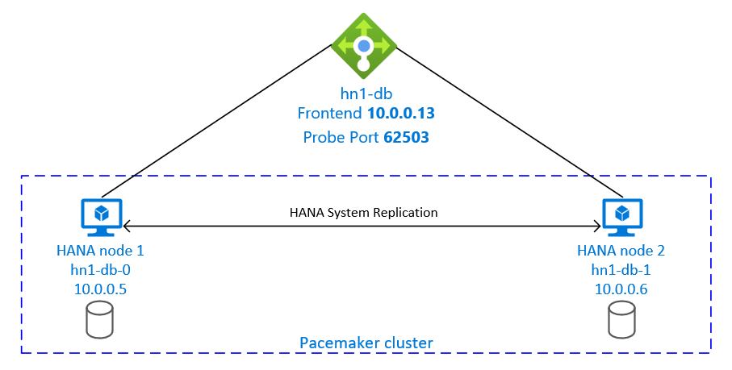
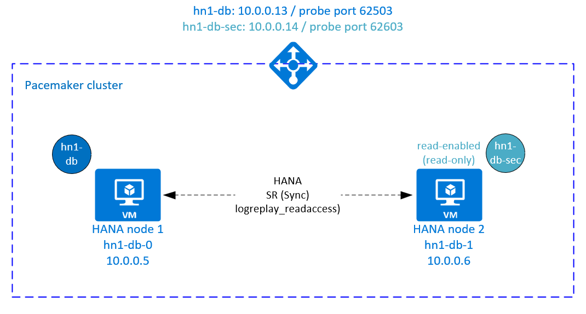

# High availability of SAP HANA on Azure VMs on Red Hat Enterprise Linux

[dbms-guide]:dbms-guide-general.md
[deployment-guide]:deployment-guide.md
[planning-guide]:planning-guide.md

[1928533]:https://launchpad.support.sap.com/#/notes/1928533
[2015553]:https://launchpad.support.sap.com/#/notes/2015553
[2178632]:https://launchpad.support.sap.com/#/notes/2178632
[2191498]:https://launchpad.support.sap.com/#/notes/2191498
[2243692]:https://launchpad.support.sap.com/#/notes/2243692
[1999351]:https://launchpad.support.sap.com/#/notes/1999351
[2388694]:https://launchpad.support.sap.com/#/notes/2388694
[2002167]:https://launchpad.support.sap.com/#/notes/2002167
[2009879]:https://launchpad.support.sap.com/#/notes/2009879
[3108302]:https://launchpad.support.sap.com/#/notes/3108302

[sap-swcenter]:https://launchpad.support.sap.com/#/softwarecenter

For on-premises development, you can use either HANA System Replication or shared storage to establish high availability (HA) for SAP HANA. On Azure Virtual Machines, HANA System Replication on Azure is currently the only supported HA function.

SAP HANA Replication consists of one primary node and at least one secondary node. Changes to the data on the primary node are replicated to the secondary node synchronously or asynchronously.

This article describes how to deploy and configure virtual machines (VMs), install the cluster framework, and install and configure SAP HANA System Replication.

In the example configurations, installation commands, instance number **03**, and HANA System ID **HN1** are used.

## Prerequisites

Read the following SAP Notes and papers first:

* SAP Note [1928533], which has:
  * The list of Azure VM sizes that are supported for the deployment of SAP software.
  * Important capacity information for Azure VM sizes.
  * The supported SAP software and operating system (OS) and database combinations.
  * The required SAP kernel version for Windows and Linux on Microsoft Azure.
* SAP Note [2015553] lists prerequisites for SAP-supported SAP software deployments in Azure.
* SAP Note [2002167] has recommended OS settings for Red Hat Enterprise Linux.
* SAP Note [2009879] has SAP HANA Guidelines for Red Hat Enterprise Linux.
* SAP Note [3108302] has SAP HANA Guidelines for Red Hat Enterprise Linux 9.x.
* SAP Note [2178632] has detailed information about all monitoring metrics reported for SAP in Azure.
* SAP Note [2191498] has the required SAP Host Agent version for Linux in Azure.
* SAP Note [2243692] has information about SAP licensing on Linux in Azure.
* SAP Note [1999351] has more troubleshooting information for the Azure Enhanced Monitoring Extension for SAP.
* [SAP Community WIKI](https://wiki.scn.sap.com/wiki/display/HOME/SAPonLinuxNotes) has all required SAP Notes for Linux.
* [Azure Virtual Machines planning and implementation for SAP on Linux][planning-guide]
* [Azure Virtual Machines deployment for SAP on Linux (this article)][deployment-guide]
* [Azure Virtual Machines DBMS deployment for SAP on Linux][dbms-guide]
* [SAP HANA System Replication in a Pacemaker cluster](https://access.redhat.com/articles/3004101)
* General RHEL documentation:
  * [High Availability Add-On Overview](https://access.redhat.com/documentation/en-us/red_hat_enterprise_linux/7/html/high_availability_add-on_overview/index)
  * [High Availability Add-On Administration](https://access.redhat.com/documentation/en-us/red_hat_enterprise_linux/7/html/high_availability_add-on_administration/index)
  * [High Availability Add-On Reference](https://access.redhat.com/documentation/en-us/red_hat_enterprise_linux/7/html/high_availability_add-on_reference/index)
  * [HANA Scale-Up System Replication with RHEL HA Add-On](https://access.redhat.com/articles/3004101)
* Azure-specific RHEL documentation:
  * [Support Policies for RHEL High Availability Clusters - Microsoft Azure Virtual Machines as Cluster Members](https://access.redhat.com/articles/3131341)
  * [Installing and Configuring a Red Hat Enterprise Linux 7.4 (and later) High-Availability Cluster on Microsoft Azure](https://access.redhat.com/articles/3252491)
  * [Install SAP HANA on Red Hat Enterprise Linux for Use in Microsoft Azure](https://access.redhat.com/solutions/3193782)

## Overview

To achieve HA, SAP HANA is installed on two VMs. The data is replicated by using HANA System Replication.



The SAP HANA System Replication setup uses a dedicated virtual hostname and virtual IP addresses. On Azure, a load balancer is required to use a virtual IP address. The presented configuration shows a load balancer with:

* Front-end IP address: 10.0.0.13 for hn1-db
* Probe port: 62503

## Deploy for Linux

Azure Marketplace contains images qualified for SAP HANA with the High Availability add-on, which you can use to deploy new VMs by using various versions of Red Hat.

### Deploy Linux VMs manually via the Azure portal

This document assumes that you've already deployed a resource group, an [Azure virtual network](../../virtual-network/virtual-networks-overview.md), and a subnet.

Deploy VMs for SAP HANA. Choose a suitable RHEL image that's supported for the HANA system. You can deploy a VM in any one of the availability options: scale set, availability zone, or availability set.

> [!IMPORTANT]
>
> Make sure that the OS you select is SAP certified for SAP HANA on the specific VM types that you plan to use in your deployment. You can look up SAP HANA-certified VM types and their OS releases in [SAP HANA Certified IaaS Platforms](https://www.sap.com/dmc/exp/2014-09-02-hana-hardware/enEN/#/solutions?filters=v:deCertified;ve:24;iaas;v:125;v:105;v:99;v:120). Make sure that you look at the details of the VM type to get the complete list of SAP HANA-supported OS releases for the specific VM type.

During VM configuration, you can create or select an existing load balancer in the networking section. If you're creating a new load balancer, follow these steps:

   1. Create a front-end IP pool:

      1. Open the load balancer, select **frontend IP pool**, and select **Add**.
      1. Enter the name of the new front-end IP pool (for example, **hana-frontend**).
      1. Set **Assignment** to **Static** and enter the IP address (for example, **10.0.0.13**).
      1. Select **OK**.
      1. After the new front-end IP pool is created, note the pool IP address.

   1. Create a single back-end pool:

      1. Open the load balancer, select **Backend pools**, and then select **Add**.
      1. Enter the name of the new back-end pool (for example, **hana-backend**).
      1. Select **NIC** for **Backend Pool Configuration**.
      1. Select **Add a virtual machine**.
      1. Select the VMs of the HANA cluster.
      1. Select **Add**.
      1. Select **Save**.

   1. Create a health probe:

      1. Open the load balancer, select **health probes**, and select **Add**.
      1. Enter the name of the new health probe (for example, **hana-hp**).
      1. Select **TCP** as the protocol and port 625**03**. Keep the **Interval** value set to **5**.
      1. Select **OK**.

   1. Create the load-balancing rules:

      1. Open the load balancer, select **load balancing rules**, and select **Add**.
      1. Enter the name of the new load balancer rule (for example, **hana-lb**).
      1. Select the front-end IP address, the back-end pool, and the health probe that you created earlier (for example, **hana-frontend**, **hana-backend**, and **hana-hp**).
      1. Increase the idle timeout to **30 minutes**.
      1. Select **HA Ports**.
      1. Increase the idle timeout to **30 minutes**.
      1. Make sure to enable **Floating IP**.
      1. Select **OK**.

For more information about the required ports for SAP HANA, read the chapter [Connections to Tenant Databases](https://help.sap.com/viewer/78209c1d3a9b41cd8624338e42a12bf6/latest/en-US/7a9343c9f2a2436faa3cfdb5ca00c052.html) in the [SAP HANA Tenant Databases](https://help.sap.com/viewer/78209c1d3a9b41cd8624338e42a12bf6) guide or SAP Note [2388694][2388694].

> [!IMPORTANT]
> Floating IP isn't supported on a NIC secondary IP configuration in load-balancing scenarios. For more information, see [Azure Load Balancer limitations](../../load-balancer/load-balancer-multivip-overview.md#limitations). If you need another IP address for the VM, deploy a second NIC.

> [!NOTE]
> When VMs without public IP addresses are placed in the back-end pool of an internal (no public IP address) instance of Standard Azure Load Balancer, there's no outbound internet connectivity unless more configuration is performed to allow routing to public endpoints. For more information on how to achieve outbound connectivity, see [Public endpoint connectivity for VMs using Azure Standard Load Balancer in SAP high-availability scenarios](./high-availability-guide-standard-load-balancer-outbound-connections.md).

> [!IMPORTANT]
> Don't enable TCP timestamps on Azure VMs placed behind Azure Load Balancer. Enabling TCP timestamps could cause the health probes to fail. Set the parameter **net.ipv4.tcp_timestamps** to **0**. For more information, see [Load Balancer health probes](../../load-balancer/load-balancer-custom-probe-overview.md).
> See also SAP Note [2382421](https://launchpad.support.sap.com/#/notes/2382421).

## Install SAP HANA

The steps in this section use the following prefixes:

* **[A]**: The step applies to all nodes.
* **[1]**: The step applies to node 1 only.
* **[2]**: The step applies to node 2 of the Pacemaker cluster only.

1. **[A]** Set up the disk layout: **Logical Volume Manager (LVM)**.

   We recommend that you use LVM for volumes that store data and log files. The following example assumes that the VMs have four data disks attached that are used to create two volumes.

   List all the available disks:

   ```bash
   ls /dev/disk/azure/scsi1/lun*
   ```

   Example output:

   ```output
   /dev/disk/azure/scsi1/lun0  /dev/disk/azure/scsi1/lun1  /dev/disk/azure/scsi1/lun2  /dev/disk/azure/scsi1/lun3
   ```

   Create physical volumes for all the disks that you want to use:

   ```bash
   sudo pvcreate /dev/disk/azure/scsi1/lun0
   sudo pvcreate /dev/disk/azure/scsi1/lun1
   sudo pvcreate /dev/disk/azure/scsi1/lun2
   sudo pvcreate /dev/disk/azure/scsi1/lun3
   ```

   Create a volume group for the data files. Use one volume group for the log files and one for the shared directory of SAP HANA:

   ```bash
   sudo vgcreate vg_hana_data_HN1 /dev/disk/azure/scsi1/lun0 /dev/disk/azure/scsi1/lun1
   sudo vgcreate vg_hana_log_HN1 /dev/disk/azure/scsi1/lun2
   sudo vgcreate vg_hana_shared_HN1 /dev/disk/azure/scsi1/lun3
   ```

   Create the logical volumes. A linear volume is created when you use `lvcreate` without the `-i` switch. We suggest that you create a striped volume for better I/O performance. Align the stripe sizes to the values documented in [SAP HANA VM storage configurations](./hana-vm-operations-storage.md). The `-i` argument should be the number of the underlying physical volumes, and the `-I` argument is the stripe size.

   In this document, two physical volumes are used for the data volume, so the `-i` switch argument is set to **2**. The stripe size for the data volume is **256KiB**. One physical volume is used for the log volume, so no `-i` or `-I` switches are explicitly used for the log volume commands.

   > [!IMPORTANT]
   > Use the `-i` switch and set it to the number of the underlying physical volume when you use more than one physical volume for each data, log, or shared volumes. Use the `-I` switch to specify the stripe size when you're creating a striped volume.
   > See [SAP HANA VM storage configurations](./hana-vm-operations-storage.md) for recommended storage configurations, including stripe sizes and number of disks. The following layout examples don't necessarily meet the performance guidelines for a particular system size. They're for illustration only.

   ```bash
   sudo lvcreate -i 2 -I 256 -l 100%FREE -n hana_data vg_hana_data_HN1
   sudo lvcreate -l 100%FREE -n hana_log vg_hana_log_HN1
   sudo lvcreate -l 100%FREE -n hana_shared vg_hana_shared_HN1
   sudo mkfs.xfs /dev/vg_hana_data_HN1/hana_data
   sudo mkfs.xfs /dev/vg_hana_log_HN1/hana_log
   sudo mkfs.xfs /dev/vg_hana_shared_HN1/hana_shared
   ```

   Don't mount the directories by issuing mount commands. Instead, enter the configurations into the `fstab` and issue a final `mount -a` to validate the syntax. Start by creating the mount directories for each volume:

   ```bash
   sudo mkdir -p /hana/data
   sudo mkdir -p /hana/log
   sudo mkdir -p /hana/shared
   ```

   Next, create `fstab` entries for the three logical volumes by inserting the following lines in the `/etc/fstab` file:

   /dev/mapper/vg_hana_data_HN1-hana_data    /hana/data    xfs  defaults,nofail  0  2
   /dev/mapper/vg_hana_log_HN1-hana_log    /hana/log    xfs  defaults,nofail  0  2
   /dev/mapper/vg_hana_shared_HN1-hana_shared    /hana/shared    xfs  defaults,nofail  0  2

   Finally, mount the new volumes all at once:

   ```bash
   sudo mount -a
   ```

1. **[A]** Set up hostname resolution for all hosts.

   You can either use a DNS server or modify the `/etc/hosts` file on all nodes by creating entries for all nodes like this in `/etc/hosts`:

   10.0.0.5 hn1-db-0
   10.0.0.6 hn1-db-1

1. **[A]** Perform RHEL for HANA configuration.

   Configure RHEL as described in the following notes:
   * [2447641 - Additional packages required for installing SAP HANA SPS 12 on RHEL 7.X](https://access.redhat.com/solutions/2447641)
   * [2292690 - SAP HANA DB: Recommended OS settings for RHEL 7](https://launchpad.support.sap.com/#/notes/2292690)
   * [2777782 - SAP HANA DB: Recommended OS Settings for RHEL 8](https://launchpad.support.sap.com/#/notes/2777782)
   * [2455582 - Linux: Running SAP applications compiled with GCC 6.x](https://launchpad.support.sap.com/#/notes/2455582)
   * [2593824 - Linux: Running SAP applications compiled with GCC 7.x](https://launchpad.support.sap.com/#/notes/2593824)
   * [2886607 - Linux: Running SAP applications compiled with GCC 9.x](https://launchpad.support.sap.com/#/notes/2886607)

1. **[A]** Install the SAP HANA.

   To install SAP HANA System Replication, see [Automating SAP HANA Scale-Up System Replication using the RHEL HA Add-On](https://access.redhat.com/articles/3004101).

   Run the **hdblcm** program from the HANA DVD. Enter the following values at the prompt:
   1. Choose installation: Enter **1**.
   1. Select additional components for installation: Enter **1**.
   1. Enter **Installation Path** [/hana/shared]: Select Enter.
   1. Enter **Local Host Name [..]**: Select Enter.
   1. **Do you want to add additional hosts to the system? (y/n)** [n]: Select Enter.
   1. Enter **SAP HANA System ID**: Enter the SID of HANA, for example: **HN1**.
   1. Enter **Instance Number** [00]: Enter the HANA Instance number. Enter **03** if you used the Azure template or followed the manual deployment section of this article.
   1. Select **Database Mode / Enter Index** [1]: Select Enter.
   1. Select **System Usage / Enter Index** [4]: Select the system usage value.
   1. Enter **Location of Data Volumes** [/hana/data]: Select Enter.
   1. Enter **Location of Log Volumes** [/hana/log]: Select Enter.
   1. **Restrict maximum memory allocation?** [n]: Select Enter.
   1. Enter **Certificate Host Name For Host '...'** [...]: Select Enter.
   1. Enter **SAP Host Agent User (sapadm) Password**: Enter the host agent user password.
   1. Confirm **SAP Host Agent User (sapadm) Password**: Enter the host agent user password again to confirm.
   1. Enter **System Administrator (hdbadm) Password**: Enter the system administrator password.
   1. Confirm **System Administrator (hdbadm) Password**: Enter the system administrator password again to confirm.
   1. Enter **System Administrator Home Directory** [/usr/sap/HN1/home]: Select Enter.
   1. Enter **System Administrator Login Shell** [/bin/sh]: Select Enter.
   1. Enter **System Administrator User ID** [1001]: Select Enter.
   1. Enter **ID of User Group (sapsys)** [79]: Select Enter.
   1. Enter **Database User (SYSTEM) Password**: Enter the database user password.
   1. Confirm **Database User (SYSTEM) Password**: Enter the database user password again to confirm.
   1. **Restart system after machine reboot?** [n]: Select Enter.
   1. **Do you want to continue? (y/n)**: Validate the summary. Enter **y** to continue.

1. **[A]** Upgrade the SAP Host Agent.

   Download the latest SAP Host Agent archive from the [SAP Software Center][sap-swcenter] and run the following command to upgrade the agent. Replace the path to the archive to point to the file that you downloaded:

   ```bash
   sudo /usr/sap/hostctrl/exe/saphostexec -upgrade -archive <path to SAP Host Agent>;
   ```

1. **[A]** Configure the firewall.

   Create the firewall rule for the Azure Load Balancer probe port.

   ```bash
   sudo firewall-cmd --zone=public --add-port=62503/tcp
   sudo firewall-cmd --zone=public --add-port=62503/tcp --permanent
   ```

## Configure SAP HANA 2.0 System Replication

The steps in this section use the following prefixes:

* **[A]**: The step applies to all nodes.
* **[1]**: The step applies to node 1 only.
* **[2]**: The step applies to node 2 of the Pacemaker cluster only.

1. **[A]** Configure the firewall.

   Create firewall rules to allow HANA System Replication and client traffic. The required ports are listed on [TCP/IP Ports of All SAP Products](https://help.sap.com/viewer/ports). The following commands are just an example to allow HANA 2.0 System Replication and client traffic to database SYSTEMDB, HN1, and NW1.

   ```bash
   sudo firewall-cmd --zone=public --add-port=40302/tcp --permanent
   sudo firewall-cmd --zone=public --add-port=40302/tcp
   sudo firewall-cmd --zone=public --add-port=40301/tcp --permanent
   sudo firewall-cmd --zone=public --add-port=40301/tcp
   sudo firewall-cmd --zone=public --add-port=40307/tcp --permanent
   sudo firewall-cmd --zone=public --add-port=40307/tcp
   sudo firewall-cmd --zone=public --add-port=40303/tcp --permanent
   sudo firewall-cmd --zone=public --add-port=40303/tcp
   sudo firewall-cmd --zone=public --add-port=40340/tcp --permanent
   sudo firewall-cmd --zone=public --add-port=40340/tcp
   sudo firewall-cmd --zone=public --add-port=30340/tcp --permanent
   sudo firewall-cmd --zone=public --add-port=30340/tcp
   sudo firewall-cmd --zone=public --add-port=30341/tcp --permanent
   sudo firewall-cmd --zone=public --add-port=30341/tcp
   sudo firewall-cmd --zone=public --add-port=30342/tcp --permanent
   sudo firewall-cmd --zone=public --add-port=30342/tcp
   ```

1. **[1]** Create the tenant database.

   If you're using SAP HANA 2.0 or MDC, create a tenant database for your SAP NetWeaver system. Replace **NW1** with the SID of your SAP system.

   Run the following command as <hanasid\>adm:

   ```bash
   hdbsql -u SYSTEM -p "[passwd]" -i 03 -d SYSTEMDB 'CREATE DATABASE NW1 SYSTEM USER PASSWORD "<passwd>"'
   ```

1. **[1]** Configure system replication on the first node.

   Back up the databases as <hanasid\>adm:

   ```bash
   hdbsql -d SYSTEMDB -u SYSTEM -p "<passwd>" -i 03 "BACKUP DATA USING FILE ('initialbackupSYS')"
   hdbsql -d HN1 -u SYSTEM -p "<passwd>" -i 03 "BACKUP DATA USING FILE ('initialbackupHN1')"
   hdbsql -d NW1 -u SYSTEM -p "<passwd>" -i 03 "BACKUP DATA USING FILE ('initialbackupNW1')"
   ```

   Copy the system PKI files to the secondary site:

   ```bash
   scp /usr/sap/HN1/SYS/global/security/rsecssfs/data/SSFS_HN1.DAT   hn1-db-1:/usr/sap/HN1/SYS/global/security/rsecssfs/data/
   scp /usr/sap/HN1/SYS/global/security/rsecssfs/key/SSFS_HN1.KEY  hn1-db-1:/usr/sap/HN1/SYS/global/security/rsecssfs/key/
   ```

   Create the primary site:

   ```bash
   hdbnsutil -sr_enable --name=SITE1
   ```

1. **[2]** Configure system replication on the second node.

   Register the second node to start the system replication. Run the following command as <hanasid\>adm:

   ```bash
   sapcontrol -nr 03 -function StopWait 600 10
   hdbnsutil -sr_register --remoteHost=hn1-db-0 --remoteInstance=03 --replicationMode=sync --name=SITE2
   ```

1. **[1]** Check replication status.

   Check the replication status and wait until all databases are in sync. If the status remains UNKNOWN, check your firewall settings.

   ```bash
   sudo su - hn1adm -c "python /usr/sap/HN1/HDB03/exe/python_support/systemReplicationStatus.py"
   # | Database | Host     | Port  | Service Name | Volume ID | Site ID | Site Name | Secondary | Secondary | Secondary | Secondary | Secondary     | Replication | Replication | Replication    |
   # |          |          |       |              |           |         |           | Host      | Port      | Site ID   | Site Name | Active Status | Mode        | Status      | Status Details |
   # | -------- | -------- | ----- | ------------ | --------- | ------- | --------- | --------- | --------- | --------- | --------- | ------------- | ----------- | ----------- | -------------- |
   # | SYSTEMDB | hn1-db-0 | 30301 | nameserver   |         1 |       1 | SITE1     | hn1-db-1  |     30301 |         2 | SITE2     | YES           | SYNC        | ACTIVE      |                |
   # | HN1      | hn1-db-0 | 30307 | xsengine     |         2 |       1 | SITE1     | hn1-db-1  |     30307 |         2 | SITE2     | YES           | SYNC        | ACTIVE      |                |
   # | NW1      | hn1-db-0 | 30340 | indexserver  |         2 |       1 | SITE1     | hn1-db-1  |     30340 |         2 | SITE2     | YES           | SYNC        | ACTIVE      |                |
   # | HN1      | hn1-db-0 | 30303 | indexserver  |         3 |       1 | SITE1     | hn1-db-1  |     30303 |         2 | SITE2     | YES           | SYNC        | ACTIVE      |                |
   #
   # status system replication site "2": ACTIVE
   # overall system replication status: ACTIVE
   #
   # Local System Replication State
   # ~~~~~~~~~~~~~~~~~~~~~~~~~~~~~~
   #
   # mode: PRIMARY
   # site id: 1
   # site name: SITE1
   ```

## Configure SAP HANA 1.0 System Replication

The steps in this section use the following prefixes:

* **[A]**: The step applies to all nodes.
* **[1]**: The step applies to node 1 only.
* **[2]**: The step applies to node 2 of the Pacemaker cluster only.

1. **[A]** Configure the firewall.

   Create firewall rules to allow HANA System Replication and client traffic. The required ports are listed on [TCP/IP Ports of All SAP Products](https://help.sap.com/viewer/ports). The following commands are just an example to allow HANA 2.0 System Replication. Adapt it to your SAP HANA 1.0 installation.

   ```bash
   sudo firewall-cmd --zone=public --add-port=40302/tcp --permanent
   sudo firewall-cmd --zone=public --add-port=40302/tcp
   ```

1. **[1]** Create the required users.

   Run the following command as root. Make sure to replace the values for HANA System ID (for example, **HN1**), instance number (**03**), and any usernames, with the values of your SAP HANA installation:

   ```bash
   PATH="$PATH:/usr/sap/HN1/HDB03/exe"
   hdbsql -u system -i 03 'CREATE USER hdbhasync PASSWORD "passwd"'
   hdbsql -u system -i 03 'GRANT DATA ADMIN TO hdbhasync'
   hdbsql -u system -i 03 'ALTER USER hdbhasync DISABLE PASSWORD LIFETIME'
   ```

1. **[A]** Create the keystore entry.

   Run the following command as root to create a new keystore entry:

   ```bash
   PATH="$PATH:/usr/sap/HN1/HDB03/exe"
   hdbuserstore SET hdbhaloc localhost:30315 hdbhasync passwd
   ```

1. **[1]** Back up the database.

   Back up the databases as root:

   ```bash
   PATH="$PATH:/usr/sap/HN1/HDB03/exe"
   hdbsql -d SYSTEMDB -u system -i 03 "BACKUP DATA USING FILE ('initialbackup')"
   ```

   If you use a multitenant installation, also back up the tenant database:

   ```bash
   hdbsql -d HN1 -u system -i 03 "BACKUP DATA USING FILE ('initialbackup')"
   ```

1. **[1]** Configure system replication on the first node.

   Create the primary site as <hanasid\>adm:

   ```bash
   su - hdbadm
   hdbnsutil -sr_enable –-name=SITE1
   ```

1. **[2]** Configure system replication on the secondary node.

   Register the secondary site as <hanasid\>adm:

   ```bash
   HDB stop
   hdbnsutil -sr_register --remoteHost=hn1-db-0 --remoteInstance=03 --replicationMode=sync --name=SITE2
   HDB start
   ```

## Create a Pacemaker cluster

Follow the steps in [Setting up Pacemaker on Red Hat Enterprise Linux in Azure](high-availability-guide-rhel-pacemaker.md) to create a basic Pacemaker cluster for this HANA server.

> [I!IMPORTANT]
> With the systemd based SAP Startup Framework, SAP HANA instances can now be managed by systemd. The minimum required Red Hat Enterprise Linux (RHEL) version is RHEL 8 for SAP. As outlined in SAP Note [3189534](https://me.sap.com/notes/3189534), any new installations of SAP HANA SPS07 revision 70 or above, or updates to HANA systems to HANA 2.0 SPS07 revision 70 or above, SAP Startup framework will be automatically registered with systemd.
>
> When using HA solutions to manage SAP HANA system replication in combination with systemd-enabled SAP HANA instances (refer to SAP Note [3189534](https://me.sap.com/notes/3189534)), additional steps are necessary to ensure that the HA cluster can manage the SAP instance without systemd interference. So, for SAP HANA system integrated with systemd, additional steps outlined in [Red Hat KBA 7029705](https://access.redhat.com/solutions/7029705) must be followed on all cluster nodes.

## Implement the Python system replication hook SAPHanaSR

This important step optimizes the integration with the cluster and improves the detection when a cluster failover is needed. We highly recommend that you configure the SAPHanaSR Python hook.

1. **[A]** Install the SAP HANA resource agents on **all nodes**. Make sure to enable a repository that contains the package. You don't need to enable more repositories, if you're using an RHEL 8.x HA-enabled image.

   ```bash
   # Enable repository that contains SAP HANA resource agents
   sudo subscription-manager repos --enable="rhel-sap-hana-for-rhel-7-server-rpms"
   
   sudo yum install -y resource-agents-sap-hana
   ```

1. **[A]** Install the HANA `system replication hook`. The hook needs to be installed on both HANA DB nodes.

   > [!TIP]
   > The Python hook can only be implemented for HANA 2.0.

   1. Prepare the hook as `root`.

       ```bash
        mkdir -p /hana/shared/myHooks
        cp /usr/share/SAPHanaSR/srHook/SAPHanaSR.py /hana/shared/myHooks
        chown -R hn1adm:sapsys /hana/shared/myHooks
       ```

   1. Stop HANA on both nodes. Run as <sid\>adm.

       ```bash
       sapcontrol -nr 03 -function StopSystem
       ```

   1. Adjust `global.ini` on each cluster node.

       ```output
       [ha_dr_provider_SAPHanaSR]
       provider = SAPHanaSR
       path = /hana/shared/myHooks
       execution_order = 1
        
       [trace]
       ha_dr_saphanasr = info
       ```

1. **[A]** The cluster requires `sudoers` configuration on each cluster node for <sid\>adm. In this example, that's achieved by creating a new file. Use the `visudo` command to edit the `20-saphana` drop-in file as `root`.

    ```bash
    sudo visudo -f /etc/sudoers.d/20-saphana
    ```

    Insert the following lines and then save:

    ```output
    Cmnd_Alias SITE1_SOK   = /usr/sbin/crm_attribute -n hana_hn1_site_srHook_SITE1 -v SOK -t crm_config -s SAPHanaSR
    Cmnd_Alias SITE1_SFAIL = /usr/sbin/crm_attribute -n hana_hn1_site_srHook_SITE1 -v SFAIL -t crm_config -s SAPHanaSR
    Cmnd_Alias SITE2_SOK   = /usr/sbin/crm_attribute -n hana_hn1_site_srHook_SITE2 -v SOK -t crm_config -s SAPHanaSR
    Cmnd_Alias SITE2_SFAIL = /usr/sbin/crm_attribute -n hana_hn1_site_srHook_SITE2 -v SFAIL -t crm_config -s SAPHanaSR
    hn1adm ALL=(ALL) NOPASSWD: SITE1_SOK, SITE1_SFAIL, SITE2_SOK, SITE2_SFAIL
    Defaults!SITE1_SOK, SITE1_SFAIL, SITE2_SOK, SITE2_SFAIL !requiretty
    ```

1. **[A]** Start SAP HANA on both nodes. Run as <sid\>adm.

    ```bash
    sapcontrol -nr 03 -function StartSystem 
    ```

1. **[1]** Verify the hook installation. Run as <sid\>adm on the active HANA system replication site.

    ```bash
     cdtrace
     awk '/ha_dr_SAPHanaSR.*crm_attribute/ \
     { printf "%s %s %s %s\n",$2,$3,$5,$16 }' nameserver_*
    ```

    ```output
     # 2021-04-12 21:36:16.911343 ha_dr_SAPHanaSR SFAIL
     # 2021-04-12 21:36:29.147808 ha_dr_SAPHanaSR SFAIL
     # 2021-04-12 21:37:04.898680 ha_dr_SAPHanaSR SOK
    ```

For more information on the implementation of the SAP HANA System Replication hook, see [Enable the SAP HA/DR provider hook](https://access.redhat.com/articles/3004101#enable-srhook).

## Create SAP HANA cluster resources

Create the HANA topology. Run the following commands on one of the Pacemaker cluster nodes. Throughout these instructions, be sure to substitute your instance number, HANA system ID, IP addresses, and system names, where appropriate.

   ```bash
sudo pcs property set maintenance-mode=true

sudo pcs resource create SAPHanaTopology_HN1_03 SAPHanaTopology SID=HN1 InstanceNumber=03 \
 op start timeout=600 op stop timeout=300 op monitor interval=10 timeout=600 \
 clone clone-max=2 clone-node-max=1 interleave=true
   ```

Next, create the HANA resources.

> [!NOTE]
> This article contains references to a term that Microsoft no longer uses. When the term is removed from the software, we'll remove it from this article.

If you're building a cluster on **RHEL 7.x**, use the following commands:

```bash
sudo pcs resource create SAPHana_HN1_03 SAPHana SID=HN1 InstanceNumber=03 PREFER_SITE_TAKEOVER=true DUPLICATE_PRIMARY_TIMEOUT=7200 AUTOMATED_REGISTER=false \
  op start timeout=3600 op stop timeout=3600 \
  op monitor interval=61 role="Slave" timeout=700 \
  op monitor interval=59 role="Master" timeout=700 \
  op promote timeout=3600 op demote timeout=3600 \
  master notify=true clone-max=2 clone-node-max=1 interleave=true

sudo pcs resource create vip_HN1_03 IPaddr2 ip="10.0.0.13"
sudo pcs resource create nc_HN1_03 azure-lb port=62503
sudo pcs resource group add g_ip_HN1_03 nc_HN1_03 vip_HN1_03

sudo pcs constraint order SAPHanaTopology_HN1_03-clone then SAPHana_HN1_03-master symmetrical=false
sudo pcs constraint colocation add g_ip_HN1_03 with master SAPHana_HN1_03-master 4000

sudo pcs resource defaults resource-stickiness=1000
sudo pcs resource defaults migration-threshold=5000

sudo pcs property set maintenance-mode=false
```

If you're building a cluster on **RHEL 8.x/9.x**, use the following commands:

```bash
sudo pcs resource create SAPHana_HN1_03 SAPHana SID=HN1 InstanceNumber=03 PREFER_SITE_TAKEOVER=true DUPLICATE_PRIMARY_TIMEOUT=7200 AUTOMATED_REGISTER=false \
  op start timeout=3600 op stop timeout=3600 \
  op monitor interval=61 role="Slave" timeout=700 \
  op monitor interval=59 role="Master" timeout=700 \
  op promote timeout=3600 op demote timeout=3600 \
  promotable notify=true clone-max=2 clone-node-max=1 interleave=true

sudo pcs resource create vip_HN1_03 IPaddr2 ip="10.0.0.13"
sudo pcs resource create nc_HN1_03 azure-lb port=62503
sudo pcs resource group add g_ip_HN1_03 nc_HN1_03 vip_HN1_03

sudo pcs constraint order SAPHanaTopology_HN1_03-clone then SAPHana_HN1_03-clone symmetrical=false
sudo pcs constraint colocation add g_ip_HN1_03 with master SAPHana_HN1_03-clone 4000

sudo pcs resource defaults update resource-stickiness=1000
sudo pcs resource defaults update migration-threshold=5000

sudo pcs property set maintenance-mode=false
```

To configure `priority-fencing-delay` for SAP HANA (applicable only as of pacemaker-2.0.4-6.el8 or higher), the following commands need to be executed.

> [!NOTE]
> If you have a two-node cluster, you can configure the `priority-fencing-delay` cluster property. This property introduces a delay in fencing a node that has higher total resource priority when a split-brain scenario occurs. For more information, see [Can Pacemaker fence the cluster node with the fewest running resources?](https://access.redhat.com/solutions/5110521).
>
> The property `priority-fencing-delay` is applicable for pacemaker-2.0.4-6.el8 version or higher. If you're setting up `priority-fencing-delay` on an existing cluster, make sure to unset the `pcmk_delay_max` option in the fencing device.

```bash
sudo pcs property set maintenance-mode=true

sudo pcs resource defaults update priority=1
sudo pcs resource update SAPHana_HN1_03-clone meta priority=10

sudo pcs property set priority-fencing-delay=15s

sudo pcs property set maintenance-mode=false
```

> [!IMPORTANT]
> It's a good idea to set `AUTOMATED_REGISTER` to `false`, while you're performing failover tests, to prevent a failed primary instance to automatically register as secondary. After testing, as a best practice, set `AUTOMATED_REGISTER` to `true` so that after takeover, system replication can resume automatically.

Make sure that the cluster status is okay and that all of the resources are started. Which node the resources are running on isn't important.

> [!NOTE]
> The timeouts in the preceding configuration are only examples and might need to be adapted to the specific HANA setup. For instance, you might need to increase the start timeout, if it takes longer to start the SAP HANA database.

Use the command `sudo pcs status` to check the state of the cluster resources created:

```output
# Online: [ hn1-db-0 hn1-db-1 ]
#
# Full list of resources:
#
# azure_fence     (stonith:fence_azure_arm):      Started hn1-db-0
#  Clone Set: SAPHanaTopology_HN1_03-clone [SAPHanaTopology_HN1_03]
#      Started: [ hn1-db-0 hn1-db-1 ]
#  Master/Slave Set: SAPHana_HN1_03-master [SAPHana_HN1_03]
#      Masters: [ hn1-db-0 ]
#      Slaves: [ hn1-db-1 ]
#  Resource Group: g_ip_HN1_03
#      nc_HN1_03  (ocf::heartbeat:azure-lb):      Started hn1-db-0
#      vip_HN1_03 (ocf::heartbeat:IPaddr2):       Started hn1-db-0
```

## Configure HANA active/read-enabled system replication in Pacemaker cluster

Starting with SAP HANA 2.0 SPS 01, SAP allows active/read-enabled setups for SAP HANA System Replication, where the secondary systems of SAP HANA System Replication can be used actively for read-intense workloads.

To support such a setup in a cluster, a second virtual IP address is required, which allows clients to access the secondary read-enabled SAP HANA database. To ensure that the secondary replication site can still be accessed after a takeover has occurred, the cluster needs to move the virtual IP address around with the secondary SAPHana resource.

This section describes the other steps that are required to manage HANA active/read-enabled system replication in a Red Hat HA cluster with a second virtual IP.

Before you proceed further, make sure that you've fully configured the Red Hat HA cluster managing an SAP HANA database, as described in preceding segments of the documentation.



### Additional setup in Azure Load Balancer for active/read-enabled setup

To proceed with more steps on provisioning a second virtual IP, make sure that you've configured Azure Load Balancer as described in the [Deploy Linux VMs manually via Azure portal](#deploy-linux-vms-manually-via-the-azure-portal) section.

1. For a **standard** load balancer, follow these steps on the same load balancer that you created in an earlier section.

   a. Create a second front-end IP pool:

   * Open the load balancer, select **frontend IP pool**, and select **Add**.
   * Enter the name of the second front-end IP pool (for example, **hana-secondaryIP**).
   * Set **Assignment** to **Static** and enter the IP address (for example, **10.0.0.14**).
   * Select **OK**.
   * After the new front-end IP pool is created, note the pool IP address.

   b. Create a health probe:

   * Open the load balancer, select **health probes**, and select **Add**.
   * Enter the name of the new health probe (for example, **hana-secondaryhp**).
   * Select **TCP** as the protocol and port **62603**. Keep the **Interval** value set to **5** and the **Unhealthy threshold** value set to **2**.
   * Select **OK**.

   c. Create the load-balancing rules:

   * Open the load balancer, select **load balancing rules**, and select **Add**.
   * Enter the name of the new load balancer rule (for example, **hana-secondarylb**).
   * Select the front-end IP address, the back-end pool, and the health probe that you created earlier (for example, **hana-secondaryIP**, **hana-backend**, and **hana-secondaryhp**).
   * Select **HA Ports**.
   * Make sure to enable **Floating IP**.
   * Select **OK**.

### Configure HANA active/read-enabled system replication

The steps to configure HANA System Replication are described in the [Configure SAP HANA 2.0 System Replication](#configure-sap-hana-20-system-replication) section. If you're deploying a read-enabled secondary scenario while you're configuring system replication on the second node, run the following command as **hanasid**adm:

```bash
sapcontrol -nr 03 -function StopWait 600 10 

hdbnsutil -sr_register --remoteHost=hn1-db-0 --remoteInstance=03 --replicationMode=sync --name=SITE2 --operationMode=logreplay_readaccess 
```

### Add a secondary virtual IP address resource for an active/read-enabled setup

The second virtual IP and the appropriate colocation constraint can be configured with the following commands:

```bash
pcs property set maintenance-mode=true

pcs resource create secvip_HN1_03 ocf:heartbeat:IPaddr2 ip="10.40.0.16"

pcs resource create secnc_HN1_03 ocf:heartbeat:azure-lb port=62603

pcs resource group add g_secip_HN1_03 secnc_HN1_03 secvip_HN1_03

pcs constraint location g_secip_HN1_03 rule score=INFINITY hana_hn1_sync_state eq SOK and hana_hn1_roles eq 4:S:master1:master:worker:master

pcs constraint location g_secip_HN1_03 rule score=4000 hana_hn1_sync_state eq PRIM and hana_hn1_roles eq 4:P:master1:master:worker:master

pcs property set maintenance-mode=false
```

Make sure that the cluster status is okay and that all the resources are started. The second virtual IP runs on the secondary site along with the SAPHana secondary resource.

```output
sudo pcs status

# Online: [ hn1-db-0 hn1-db-1 ]
#
# Full List of Resources:
#   rsc_hdb_azr_agt     (stonith:fence_azure_arm):      Started hn1-db-0
#   Clone Set: SAPHanaTopology_HN1_03-clone [SAPHanaTopology_HN1_03]:
#     Started: [ hn1-db-0 hn1-db-1 ]
#   Clone Set: SAPHana_HN1_03-clone [SAPHana_HN1_03] (promotable):
#     Masters: [ hn1-db-0 ]
#     Slaves: [ hn1-db-1 ]
#   Resource Group: g_ip_HN1_03:
#     nc_HN1_03         (ocf::heartbeat:azure-lb):      Started hn1-db-0
#     vip_HN1_03        (ocf::heartbeat:IPaddr2):       Started hn1-db-0
#   Resource Group: g_secip_HN1_03:
#     secnc_HN1_03      (ocf::heartbeat:azure-lb):      Started hn1-db-1
#     secvip_HN1_03     (ocf::heartbeat:IPaddr2):       Started hn1-db-1
```

In the next section, you can find the typical set of failover tests to run.

Be aware of the second virtual IP behavior while you're testing a HANA cluster configured with read-enabled secondary:

1. When you migrate the **SAPHana_HN1_03** cluster resource to the secondary site **hn1-db-1**, the second virtual IP continues to run on the same site **hn1-db-1**. If you've set `AUTOMATED_REGISTER="true"` for the resource and HANA system replication is registered automatically on **hn1-db-0**, your second virtual IP also moves to **hn1-db-0**.

1. On testing a server crash, the second virtual IP resources (**secvip_HN1_03**) and the Azure Load Balancer port resource (**secnc_HN1_03**) run on the primary server alongside the primary virtual IP resources. So, until the time that the secondary server is down, applications that are connected to the read-enabled HANA database connect to the primary HANA database. The behavior is expected because you don't want applications that are connected to the read-enabled HANA database to be inaccessible until the time the secondary server is unavailable.

1. During failover and fallback of the second virtual IP address, the existing connections on applications that use the second virtual IP to connect to the HANA database might get interrupted.

The setup maximizes the time that the second virtual IP resource is assigned to a node where a healthy SAP HANA instance is running.

## Test the cluster setup

This section describes how you can test your setup. Before you start a test, make sure that Pacemaker doesn't have any failed action (via pcs status), there are no unexpected location constraints (for example, leftovers of a migration test), and that HANA is in sync state, for example, with `systemReplicationStatus`.

```bash
sudo su - hn1adm -c "python /usr/sap/HN1/HDB03/exe/python_support/systemReplicationStatus.py"
```

### Test the migration

Resource state before starting the test:

```output
Clone Set: SAPHanaTopology_HN1_03-clone [SAPHanaTopology_HN1_03]
    Started: [ hn1-db-0 hn1-db-1 ]
Master/Slave Set: SAPHana_HN1_03-master [SAPHana_HN1_03]
    Masters: [ hn1-db-0 ]
    Slaves: [ hn1-db-1 ]
Resource Group: g_ip_HN1_03
    nc_HN1_03  (ocf::heartbeat:azure-lb):      Started hn1-db-0
    vip_HN1_03 (ocf::heartbeat:IPaddr2):       Started hn1-db-0
```

You can migrate the SAP HANA master node by running the following command as root:

```bash
# On RHEL 7.x
pcs resource move SAPHana_HN1_03-master
# On RHEL 8.x
pcs resource move SAPHana_HN1_03-clone --master
```

If you set `AUTOMATED_REGISTER="false"`, this command should migrate the SAP HANA master node and the group that contains the virtual IP address to `hn1-db-1`.

After the migration is done, the `sudo pcs status` output looks like:

```output
Clone Set: SAPHanaTopology_HN1_03-clone [SAPHanaTopology_HN1_03]
    Started: [ hn1-db-0 hn1-db-1 ]
Master/Slave Set: SAPHana_HN1_03-master [SAPHana_HN1_03]
    Masters: [ hn1-db-1 ]
    Stopped: [ hn1-db-0 ]
Resource Group: g_ip_HN1_03
    nc_HN1_03  (ocf::heartbeat:azure-lb):      Started hn1-db-1
    vip_HN1_03 (ocf::heartbeat:IPaddr2):       Started hn1-db-1
```

The SAP HANA resource on `hn1-db-0` is stopped. In this case, configure the HANA instance as secondary by running these commands, as **hn1adm**:

```bash
sapcontrol -nr 03 -function StopWait 600 10
hdbnsutil -sr_register --remoteHost=hn1-db-1 --remoteInstance=03 --replicationMode=sync --name=SITE1
```

The migration creates location constraints that need to be deleted again. Run the following command as root, or via `sudo`:

```bash
pcs resource clear SAPHana_HN1_03-master
```

Monitor the state of the HANA resource by using `pcs status`. After HANA is started on `hn1-db-0`, the output should look like:

```output
Clone Set: SAPHanaTopology_HN1_03-clone [SAPHanaTopology_HN1_03]
    Started: [ hn1-db-0 hn1-db-1 ]
Master/Slave Set: SAPHana_HN1_03-master [SAPHana_HN1_03]
    Masters: [ hn1-db-1 ]
    Slaves: [ hn1-db-0 ]
Resource Group: g_ip_HN1_03
    nc_HN1_03  (ocf::heartbeat:azure-lb):      Started hn1-db-1
    vip_HN1_03 (ocf::heartbeat:IPaddr2):       Started hn1-db-1
```

### Block network communication

Resource state before starting the test:

```output
Clone Set: SAPHanaTopology_HN1_03-clone [SAPHanaTopology_HN1_03]
    Started: [ hn1-db-0 hn1-db-1 ]
Master/Slave Set: SAPHana_HN1_03-master [SAPHana_HN1_03]
    Masters: [ hn1-db-1 ]
    Slaves: [ hn1-db-0 ]
Resource Group: g_ip_HN1_03
    nc_HN1_03  (ocf::heartbeat:azure-lb):      Started hn1-db-1
    vip_HN1_03 (ocf::heartbeat:IPaddr2):       Started hn1-db-1
```

Run the firewall rule to block the communication on one of the nodes.

```bash
# Execute iptable rule on hn1-db-1 (10.0.0.6) to block the incoming and outgoing traffic to hn1-db-0 (10.0.0.5)
iptables -A INPUT -s 10.0.0.5 -j DROP; iptables -A OUTPUT -d 10.0.0.5 -j DROP
```

When cluster nodes can't communicate with each other, there's a risk of a split-brain scenario. In such situations, cluster nodes try to simultaneously fence each other, resulting in a fence race. To avoid such a situation, we recommend that you set the [priority-fencing-delay](#create-sap-hana-cluster-resources) property in cluster configuration (applicable only for [pacemaker-2.0.4-6.el8](https://access.redhat.com/errata/RHEA-2020:4804) or higher).

By enabling the `priority-fencing-delay` property, the cluster introduces a delay in the fencing action specifically on the node hosting the HANA master resource, allowing the node to win the fence race.

Run the following command to delete the firewall rule:

```bash
# If the iptables rule set on the server gets reset after a reboot, the rules will be cleared out. In case they have not been reset, please proceed to remove the iptables rule using the following command.
iptables -D INPUT -s 10.0.0.5 -j DROP; iptables -D OUTPUT -d 10.0.0.5 -j DROP
```

### Test the Azure fencing agent

> [!NOTE]
> This article contains references to a term that Microsoft no longer uses. When the term is removed from the software, we'll remove it from this article.

Resource state before starting the test:

```output
Clone Set: SAPHanaTopology_HN1_03-clone [SAPHanaTopology_HN1_03]
    Started: [ hn1-db-0 hn1-db-1 ]
Master/Slave Set: SAPHana_HN1_03-master [SAPHana_HN1_03]
    Masters: [ hn1-db-1 ]
    Slaves: [ hn1-db-0 ]
Resource Group: g_ip_HN1_03
    nc_HN1_03  (ocf::heartbeat:azure-lb):      Started hn1-db-1
    vip_HN1_03 (ocf::heartbeat:IPaddr2):       Started hn1-db-1
```

You can test the setup of the Azure fencing agent by disabling the network interface on the node where SAP HANA is running as Master. For a description on how to simulate a network failure, see [Red Hat Knowledge Base article 79523](https://access.redhat.com/solutions/79523).

In this example, we use the `net_breaker` script as root to block all access to the network:

```bash
sh ./net_breaker.sh BreakCommCmd 10.0.0.6
```

The VM should now restart or stop depending on your cluster configuration.
If you set the `stonith-action` setting to `off`, the VM is stopped and the resources are migrated to the running VM.

After you start the VM again, the SAP HANA resource fails to start as secondary if you set `AUTOMATED_REGISTER="false"`. In this case, configure the HANA instance as secondary by running this command as the **hn1adm** user:

```bash
sapcontrol -nr 03 -function StopWait 600 10
hdbnsutil -sr_register --remoteHost=hn1-db-0 --remoteInstance=03 --replicationMode=sync --name=SITE2
```

Switch back to root and clean up the failed state:

```bash
# On RHEL 7.x
pcs resource cleanup SAPHana_HN1_03-master
# On RHEL 8.x
pcs resource cleanup SAPHana_HN1_03 node=<hostname on which the resource needs to be cleaned>
```

Resource state after the test:

```output
Clone Set: SAPHanaTopology_HN1_03-clone [SAPHanaTopology_HN1_03]
    Started: [ hn1-db-0 hn1-db-1 ]
Master/Slave Set: SAPHana_HN1_03-master [SAPHana_HN1_03]
    Masters: [ hn1-db-0 ]
    Slaves: [ hn1-db-1 ]
Resource Group: g_ip_HN1_03
    nc_HN1_03  (ocf::heartbeat:azure-lb):      Started hn1-db-0
    vip_HN1_03 (ocf::heartbeat:IPaddr2):       Started hn1-db-0
```

### Test a manual failover

Resource state before starting the test:

```output
Clone Set: SAPHanaTopology_HN1_03-clone [SAPHanaTopology_HN1_03]
    Started: [ hn1-db-0 hn1-db-1 ]
Master/Slave Set: SAPHana_HN1_03-master [SAPHana_HN1_03]
    Masters: [ hn1-db-0 ]
    Slaves: [ hn1-db-1 ]
Resource Group: g_ip_HN1_03
    nc_HN1_03  (ocf::heartbeat:azure-lb):      Started hn1-db-0
    vip_HN1_03 (ocf::heartbeat:IPaddr2):       Started hn1-db-0
```

You can test a manual failover by stopping the cluster on the `hn1-db-0` node, as root:

```bash
pcs cluster stop
```

After the failover, you can start the cluster again. If you set `AUTOMATED_REGISTER="false"`, the SAP HANA resource on the `hn1-db-0` node fails to start as secondary. In this case, configure the HANA instance as secondary by running this command as root:

```bash
pcs cluster start
```

Run the following as **hn1adm**:

```bash
sapcontrol -nr 03 -function StopWait 600 10
hdbnsutil -sr_register --remoteHost=hn1-db-1 --remoteInstance=03 --replicationMode=sync --name=SITE1
```

Then as root:

```bash
# On RHEL 7.x
pcs resource cleanup SAPHana_HN1_03-master
# On RHEL 8.x
pcs resource cleanup SAPHana_HN1_03 node=<hostname on which the resource needs to be cleaned>
```

Resource state after the test:

```output
Clone Set: SAPHanaTopology_HN1_03-clone [SAPHanaTopology_HN1_03]
    Started: [ hn1-db-0 hn1-db-1 ]
Master/Slave Set: SAPHana_HN1_03-master [SAPHana_HN1_03]
    Masters: [ hn1-db-1 ]
     Slaves: [ hn1-db-0 ]
Resource Group: g_ip_HN1_03
    nc_HN1_03  (ocf::heartbeat:azure-lb):      Started hn1-db-1
    vip_HN1_03 (ocf::heartbeat:IPaddr2):       Started hn1-db-1
```

## Next steps

* [Azure Virtual Machines planning and implementation for SAP][planning-guide]
* [Azure Virtual Machines deployment for SAP][deployment-guide]
* [Azure Virtual Machines DBMS deployment for SAP][dbms-guide]
* [SAP HANA VM storage configurations](./hana-vm-operations-storage.md)
