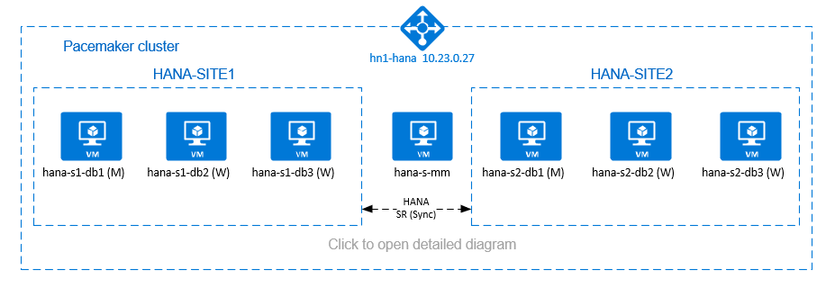

# High availability for SAP HANA scale-out system with HSR on SUSE Linux Enterprise Server

[dbms-guide]:dbms-guide-general.md
[deployment-guide]:deployment-guide.md
[planning-guide]:planning-guide.md

[anf-azure-doc]:../../azure-netapp-files/index.yml

[2205917]:https://launchpad.support.sap.com/#/notes/2205917
[1944799]:https://launchpad.support.sap.com/#/notes/1944799
[1928533]:https://launchpad.support.sap.com/#/notes/1928533
[2015553]:https://launchpad.support.sap.com/#/notes/2015553
[2178632]:https://launchpad.support.sap.com/#/notes/2178632
[2191498]:https://launchpad.support.sap.com/#/notes/2191498
[2243692]:https://launchpad.support.sap.com/#/notes/2243692
[1984787]:https://launchpad.support.sap.com/#/notes/1984787
[1999351]:https://launchpad.support.sap.com/#/notes/1999351
[1900823]:https://launchpad.support.sap.com/#/notes/1900823

[suse-ha-guide]:https://www.suse.com/products/sles-for-sap/resource-library/sap-best-practices/

[sap-hana-ha]:sap-hana-high-availability.md

This article describes how to deploy a highly available SAP HANA system in a scale-out configuration with HANA system replication (HSR) and Pacemaker on Azure SUSE Linux Enterprise Server virtual machines (VMs). The shared file systems in the presented architecture are NFS mounted and are provided by [Azure NetApp Files](../../azure-netapp-files/azure-netapp-files-introduction.md) or [NFS share on Azure Files](../../storage/files/files-nfs-protocol.md).  

In the example configurations, installation commands, and so on, the HANA instance is **03** and the HANA system ID is **HN1**.

Before you begin, refer to the following SAP notes and papers:

* [Azure NetApp Files documentation][anf-azure-doc]
* [Azure Files documentation](../../storage/files/storage-files-introduction.md)  
* SAP Note [1928533] includes:  
  * A list of Azure VM sizes that are supported for the deployment of SAP software
  * Important capacity information for Azure VM sizes
  * Supported SAP software, and operating system (OS) and database combinations
  * The required SAP kernel version for Windows and Linux on Microsoft Azure
* SAP Note [2015553]: Lists prerequisites for SAP-supported SAP software deployments in Azure
* SAP Note [2205917]: Contains recommended OS settings for SUSE Linux Enterprise Server for SAP Applications
* SAP Note [1944799]: Contains SAP Guidelines for SUSE Linux Enterprise Server for SAP Applications
* SAP Note [2178632]: Contains detailed information about all monitoring metrics reported for SAP in Azure
* SAP Note [2191498]: Contains the required SAP Host Agent version for Linux in Azure
* SAP Note [2243692]: Contains information about SAP licensing on Linux in Azure
* SAP Note [1984787]: Contains general information about SUSE Linux Enterprise Server 12
* SAP Note [1999351]: Contains additional troubleshooting information for the Azure Enhanced Monitoring Extension for SAP
* SAP Note [1900823]: Contains information about SAP HANA storage requirements
* [SAP Community Wiki](https://wiki.scn.sap.com/wiki/display/HOME/SAPonLinuxNotes): Contains all required SAP notes for Linux
* [Azure Virtual Machines planning and implementation for SAP on Linux][planning-guide]
* [Azure Virtual Machines deployment for SAP on Linux][deployment-guide]
* [Azure Virtual Machines DBMS deployment for SAP on Linux][dbms-guide]
* [SUSE SAP HA Best Practice Guides][suse-ha-guide]: Contains all required information to set up NetWeaver High Availability and SAP HANA System Replication on-premises (to be used as a general baseline; they provide much more detailed information)
* [SUSE High Availability Extension 12 SP5 Release Notes](https://www.suse.com/releasenotes/x86_64/SLE-HA/12-SP5/)
* [Handling failed NFS share in SUSE HA cluster for HANA system replication](https://www.suse.com/support/kb/doc/?id=000019904)
* [NFS v4.1 volumes on Azure NetApp Files for SAP HANA](./hana-vm-operations-netapp.md)

## Overview

One method to achieve HANA high availability for HANA scale-out installations, is to configure HANA system replication and protect the solution with Pacemaker cluster to allow automatic failover. When an active node fails, the cluster fails over the HANA resources to the other site.  
The presented configuration shows three HANA nodes on each site, plus majority maker node to prevent split-brain scenario. The instructions can be adapted, to include more VMs as HANA DB nodes.  

The HANA shared file system `/hana/shared` in the presented architecture can be provided by [Azure NetApp Files](../../azure-netapp-files/azure-netapp-files-introduction.md) or [NFS share on Azure Files](../../storage/files/files-nfs-protocol.md). The HANA shared file system is NFS mounted on each HANA node in the same HANA system replication site. File systems `/hana/data` and `/hana/log` are local file systems and aren't shared between the HANA DB nodes. SAP HANA will be installed in non-shared mode.  
  
For recommended SAP HANA storage configurations, see [SAP HANA Azure VMs storage configurations](./hana-vm-operations-storage.md). 

> [!IMPORTANT]
> If deploying all HANA file systems on Azure NetApp Files, for production systems, where performance is a key, we recommend to evaluate and consider using [Azure NetApp Files application volume group for SAP HANA](hana-vm-operations-netapp.md#deployment-through-azure-netapp-files-application-volume-group-for-sap-hana-avg).  

> [!WARNING]
> Deploying `/hana/data` and `/hana/log` on NFS on Azure Files is not supported.  

[](./media/sap-hana-high-availability/sap-hana-high-availability-scale-out-hsr-suse-detail.png#lightbox)

In the preceding diagram, three subnets are represented within one Azure virtual network, following the SAP HANA network recommendations:

* for client communication - `client` 10.23.0.0/24  
* for internal HANA inter-node communication - `inter` 10.23.1.128/26  
* for HANA system replication - `hsr` 10.23.1.192/26  

As `/hana/data` and `/hana/log` are deployed on local disks, it isn't necessary to deploy separate subnet and separate virtual network cards for communication to the storage.  

If you're using Azure NetApp Files, the NFS volumes for `/hana/shared`, are deployed in a separate subnet, [delegated to Azure NetApp Files](../../azure-netapp-files/azure-netapp-files-delegate-subnet.md): `anf` 10.23.1.0/26.

## Set up the infrastructure

In the instructions that follow, we assume that you've already created the resource group, the Azure virtual network with three Azure network subnets: `client`, `inter` and `hsr`.

### Deploy Linux virtual machines via the Azure portal

1. Deploy the Azure VMs.

   For the configuration presented in this document, deploy seven virtual machines:

   * three virtual machines to serve as HANA DB nodes for HANA replication site 1: **hana-s1-db1**, **hana-s1-db2** and **hana-s1-db3**  
   * three virtual machines to serve as HANA DB nodes for HANA replication site 2: **hana-s2-db1**, **hana-s2-db2** and **hana-s2-db3**  
   * a small virtual machine to serve as *majority maker*: **hana-s-mm**

   The VMs, deployed as SAP DB HANA nodes should be certified by SAP for HANA as published in the [SAP HANA Hardware directory](https://www.sap.com/dmc/exp/2014-09-02-hana-hardware/enEN/#/solutions?filters=v:deCertified;ve:24;iaas;v:125;v:105;v:99;v:120). When deploying the HANA DB nodes, make sure that [Accelerated Network](../../virtual-network/create-vm-accelerated-networking-cli.md) is selected.  
  
   For the majority maker node, you can deploy a small VM, as this VM doesn't run any of the SAP HANA resources. The majority maker VM is used in the cluster configuration to achieve odd number of cluster nodes in a split-brain scenario. The majority maker VM only needs one virtual network interface in the `client` subnet in this example.

   Deploy local managed disks for `/hana/data` and `/hana/log`. The minimum recommended storage configuration for `/hana/data` and `/hana/log` is described in [SAP HANA Azure VMs storage configurations](./hana-vm-operations-storage.md).

   Deploy the primary network interface for each VM in the `client` virtual network subnet.  
   When the VM is deployed via Azure portal, the network interface name is automatically generated. In these instructions for simplicity we'll refer to the automatically generated, primary network interfaces, which are attached to the `client` Azure virtual network subnet as **hana-s1-db1-client**, **hana-s1-db2-client**, **hana-s1-db3-client**, and so on.  

   > [!IMPORTANT]
   > Make sure that the OS you select is SAP-certified for SAP HANA on the specific VM types you're using. For a list of SAP HANA certified VM types and OS releases for those types, go to the [SAP HANA certified IaaS platforms](https://www.sap.com/dmc/exp/2014-09-02-hana-hardware/enEN/#/solutions?filters=v:deCertified;ve:24;iaas;v:125;v:105;v:99;v:120) site. Click into the details of the listed VM type to get the complete list of SAP HANA-supported OS releases for that type.
   > If you choose to deploy `/hana/shared` on NFS on Azure Files, we recommend to deploy on SLES15 SP2 and above.
  
2. Create six network interfaces, one for each HANA DB virtual machine, in the `inter` virtual network subnet (in this example, **hana-s1-db1-inter**, **hana-s1-db2-inter**, **hana-s1-db3-inter**, **hana-s2-db1-inter**, **hana-s2-db2-inter**, and **hana-s2-db3-inter**).  

3. Create six network interfaces, one for each HANA DB virtual machine, in the `hsr` virtual network subnet (in this example, **hana-s1-db1-hsr**, **hana-s1-db2-hsr**, **hana-s1-db3-hsr**, **hana-s2-db1-hsr**, **hana-s2-db2-hsr**, and **hana-s2-db3-hsr**).  

4. Attach the newly created virtual network interfaces to the corresponding virtual machines:

   1. Go to the virtual machine in the [Azure portal](https://portal.azure.com/#home).  
   2. In the left pane, select **Virtual Machines**. Filter on the virtual machine name (for example, **hana-s1-db1**), and then select the virtual machine.
   3. In the **Overview** pane, select **Stop** to deallocate the virtual machine.  
   4. Select **Networking**, and then attach the network interface. In the **Attach network interface** drop-down list, select the already created network interfaces for the `inter` and `hsr` subnets.
   5. Select **Save**.
   6. Repeat steps b through e for the remaining virtual machines (in our example,  **hana-s1-db2**, **hana-s1-db3**, **hana-s2-db1**, **hana-s2-db2** and **hana-s2-db3**).
   7. Leave the virtual machines in stopped state for now. Next, we'll enable [accelerated networking](../../virtual-network/create-vm-accelerated-networking-cli.md) for all newly attached network interfaces.  

5. Enable accelerated networking for the additional network interfaces for the `inter` and `hsr` subnets by doing the following steps:

   1. Open [Azure Cloud Shell](https://azure.microsoft.com/features/cloud-shell/) in the [Azure portal](https://portal.azure.com/#home).
   2. Execute the following commands to enable accelerated networking for the additional network interfaces, which are attached to the `inter` and `hsr` subnets.

      ```bash
      az network nic update --id /subscriptions/your subscription/resourceGroups/your resource group/providers/Microsoft.Network/networkInterfaces/hana-s1-db1-inter --accelerated-networking true
      az network nic update --id /subscriptions/your subscription/resourceGroups/your resource group/providers/Microsoft.Network/networkInterfaces/hana-s1-db2-inter --accelerated-networking true
      az network nic update --id /subscriptions/your subscription/resourceGroups/your resource group/providers/Microsoft.Network/networkInterfaces/hana-s1-db3-inter --accelerated-networking true
      az network nic update --id /subscriptions/your subscription/resourceGroups/your resource group/providers/Microsoft.Network/networkInterfaces/hana-s2-db1-inter --accelerated-networking true
      az network nic update --id /subscriptions/your subscription/resourceGroups/your resource group/providers/Microsoft.Network/networkInterfaces/hana-s2-db2-inter --accelerated-networking true
      az network nic update --id /subscriptions/your subscription/resourceGroups/your resource group/providers/Microsoft.Network/networkInterfaces/hana-s2-db3-inter --accelerated-networking true
      
      az network nic update --id /subscriptions/your subscription/resourceGroups/your resource group/providers/Microsoft.Network/networkInterfaces/hana-s1-db1-hsr --accelerated-networking true
      az network nic update --id /subscriptions/your subscription/resourceGroups/your resource group/providers/Microsoft.Network/networkInterfaces/hana-s1-db2-hsr --accelerated-networking true
      az network nic update --id /subscriptions/your subscription/resourceGroups/your resource group/providers/Microsoft.Network/networkInterfaces/hana-s1-db3-hsr --accelerated-networking true
      az network nic update --id /subscriptions/your subscription/resourceGroups/your resource group/providers/Microsoft.Network/networkInterfaces/hana-s2-db1-hsr --accelerated-networking true
      az network nic update --id /subscriptions/your subscription/resourceGroups/your resource group/providers/Microsoft.Network/networkInterfaces/hana-s2-db2-hsr --accelerated-networking true
      az network nic update --id /subscriptions/your subscription/resourceGroups/your resource group/providers/Microsoft.Network/networkInterfaces/hana-s2-db3-hsr --accelerated-networking true
      ```

6. Start the HANA DB virtual machines

### Deploy Azure Load Balancer

1. We recommend using standard load balancer. Follow these configuration steps to deploy standard load balancer:

   1. First, create a front-end IP pool:

      1. Open the load balancer, select **frontend IP pool**, and select **Add**.
      2. Enter the name of the new front-end IP pool (for example, **hana-frontend**).
      3. Set the **Assignment** to **Static** and enter the IP address (for example, **10.23.0.27**).
      4. Select **OK**.
      5. After the new front-end IP pool is created, note the pool IP address.

   2. Create a single back-end pool:

      1. Open the load balancer, select **Backend pools**, and then select **Add**.
      2. Enter the name of the new back-end pool (for example, **hana-backend**).
      3. Select **NIC** for Backend Pool Configuration.
      4. Select **Add a virtual machine**.
      5. Select the virtual machines of the HANA cluster (the NICs for the `client` subnet).
      6. Select **Add**.
      7. Select **Save**.

   3. Next, create a health probe:

      1. Open the load balancer, select **health probes**, and select **Add**.
      2. Enter the name of the new health probe (for example, **hana-hp**).
      3. Select **TCP** as the protocol and port 625**03**. Keep the **Interval** value set to 5.
      4. Select **OK**.

   4. Next, create the load-balancing rules:

      1. Open the load balancer, select **load balancing rules**, and select **Add**.
      2. Enter the name of the new load balancer rule (for example, **hana-lb**).
      3. Select the front-end IP address, the back-end pool, and the health probe that you created earlier (for example, **hana-frontend**, **hana-backend** and **hana-hp**).
      4. Increase idle timeout to 30 minutes.
      5. Select **HA Ports**.
      6. Make sure to **enable Floating IP**.
      7. Select **OK**.

   > [!IMPORTANT]
   > Floating IP is not supported on a NIC secondary IP configuration in load-balancing scenarios. For details see [Azure Load balancer Limitations](../../load-balancer/load-balancer-multivip-overview.md#limitations). If you need additional IP address for the VM, deploy a second NIC.

   > [!NOTE]
   > When VMs without public IP addresses are placed in the backend pool of internal (no public IP address) Standard Azure load balancer, there will be no outbound internet connectivity, unless additional configuration is performed to allow routing to public end points. For details on how to achieve outbound connectivity see [Public endpoint connectivity for Virtual Machines using Azure Standard Load Balancer in SAP high-availability scenarios](./high-availability-guide-standard-load-balancer-outbound-connections.md).  

   > [!IMPORTANT]
   > Do not enable TCP timestamps on Azure VMs placed behind Azure Load Balancer. Enabling TCP timestamps will cause the health probes to fail. Set parameter **net.ipv4.tcp_timestamps** to **0**. For details see [Load Balancer health probes](../../load-balancer/load-balancer-custom-probe-overview.md).
   > See also SAP note [2382421](https://launchpad.support.sap.com/#/notes/2382421).  

### Deploy NFS

There are two options for deploying Azure native NFS for `/hana/shared`. You can deploy NFS volume on [Azure NetApp Files](../../azure-netapp-files/azure-netapp-files-introduction.md) or [NFS share on Azure Files](../../storage/files/files-nfs-protocol.md). Azure files support NFSv4.1 protocol, NFS on Azure NetApp files supports both NFSv4.1 and NFSv3.

The next sections describe the steps to deploy NFS - you'll need to select only *one* of the options.

> [!TIP]
> You chose to deploy `/hana/shared` on [NFS share on Azure Files](../../storage/files/files-nfs-protocol.md) or [NFS volume on Azure NetApp Files](../../azure-netapp-files/azure-netapp-files-introduction.md).  

#### Deploy the Azure NetApp Files infrastructure

Deploy ANF volumes for the `/hana/shared` file system. You'll need a separate `/hana/shared` volume for each HANA system replication site. For more information, see [Set up the Azure NetApp Files infrastructure](./sap-hana-scale-out-standby-netapp-files-suse.md#set-up-the-azure-netapp-files-infrastructure).

In this example, the following Azure NetApp Files volumes were used:

* volume **HN1**-shared-s1 (nfs://10.23.1.7/**HN1**-shared-s1)
* volume **HN1**-shared-s2 (nfs://10.23.1.7/**HN1**-shared-s2)

#### Deploy the NFS on Azure Files infrastructure

Deploy Azure Files NFS shares for the `/hana/shared` file system. You'll need a separate `/hana/shared` Azure Files NFS share for each HANA system replication site. For more information, see [How to create an NFS share](../../storage/files/storage-files-how-to-create-nfs-shares.md?tabs=azure-portal).

In this example, the following Azure Files NFS shares were used:

* share **hn1**-shared-s1 (sapnfsafs.file.core.windows.net:/sapnfsafs/hn1-shared-s1)
* share **hn1**-shared-s2 (sapnfsafs.file.core.windows.net:/sapnfsafs/hn1-shared-s2)

## Operating system configuration and preparation

The instructions in the next sections are prefixed with one of the following abbreviations:

* **[A]**: Applicable to all nodes, including majority maker
* **[AH]**: Applicable to all HANA DB nodes
* **[M]**: Applicable to the majority maker node only
* **[AH1]**: Applicable to all HANA DB nodes on SITE 1
* **[AH2]**: Applicable to all HANA DB nodes on SITE 2
* **[1]**: Applicable only to HANA DB node 1, SITE 1
* **[2]**: Applicable only to HANA DB node 1, SITE 2

Configure and prepare your OS by doing the following steps:

1. **[A]** Maintain the host files on the virtual machines. Include entries for all subnets. The following entries were added to `/etc/hosts` for this example.  

    ```bash
    # Client subnet
    10.23.0.19      hana-s1-db1
    10.23.0.20      hana-s1-db2
    10.23.0.21      hana-s1-db3
    10.23.0.22      hana-s2-db1
    10.23.0.23      hana-s2-db2
    10.23.0.24      hana-s2-db3
    10.23.0.25      hana-s-mm    
    
    # Internode subnet
    10.23.1.132     hana-s1-db1-inter
    10.23.1.133     hana-s1-db2-inter
    10.23.1.134     hana-s1-db3-inter
    10.23.1.135     hana-s2-db1-inter
    10.23.1.136     hana-s2-db2-inter
    10.23.1.137     hana-s2-db3-inter
    
    # HSR subnet
    10.23.1.196     hana-s1-db1-hsr
    10.23.1.197     hana-s1-db2-hsr
    10.23.1.198     hana-s1-db3-hsr
    10.23.1.199     hana-s2-db1-hsr
    10.23.1.200     hana-s2-db2-hsr
    10.23.1.201     hana-s2-db3-hsr
    ```

2. **[A]** Create configuration file */etc/sysctl.d/ms-az.conf* with Microsoft for Azure configuration settings.  

    ```bash
    vi /etc/sysctl.d/ms-az.conf
    
    # Add the following entries in the configuration file
    net.ipv6.conf.all.disable_ipv6 = 1
    net.ipv4.tcp_max_syn_backlog = 16348
    net.ipv4.conf.all.rp_filter = 0
    sunrpc.tcp_slot_table_entries = 128
    vm.swappiness=10
    ```

    > [!TIP]
    > Avoid setting net.ipv4.ip_local_port_range and net.ipv4.ip_local_reserved_ports explicitly in the sysctl configuration files to allow SAP Host Agent to manage the port ranges. For more information, see SAP note [2382421](https://launchpad.support.sap.com/#/notes/2382421).  

3. **[A]** SUSE delivers special resource agents for SAP HANA and by default agents for SAP HANA scale-up are installed. Uninstall the packages for scale-up, if installed and install the packages for scenario SAP HANA scale-out. The step needs to be performed on all cluster VMs, including the majority maker.

   > [!NOTE]
   > SAPHanaSR-ScaleOut version 0.181 or higher must be installed.

    ```bash
    # Uninstall scale-up packages and patterns
    sudo zypper remove patterns-sap-hana
    sudo zypper remove SAPHanaSR SAPHanaSR-doc yast2-sap-ha
    
    # Install the scale-out packages and patterns
    sudo zypper in SAPHanaSR-ScaleOut SAPHanaSR-ScaleOut-doc 
    sudo zypper in -t pattern ha_sles
    ```

4. **[AH]** Prepare the VMs - apply the recommended settings per SAP note [2205917] for SUSE Linux Enterprise Server for SAP Applications.  

## Prepare the file systems

You chose to deploy the SAP shared directories on [NFS share on Azure Files](../../storage/files/files-nfs-protocol.md) or [NFS volume on Azure NetApp Files](../../azure-netapp-files/azure-netapp-files-introduction.md).

### Mount the shared file systems (Azure NetApp Files NFS)

In this example, the shared HANA file systems are deployed on Azure NetApp Files and mounted over NFSv4.1. Follow the steps in this section, only if you're using NFS on Azure NetApp Files.

1. **[AH]** Prepare the OS for running SAP HANA on NetApp Systems with NFS, as described in SAP note [3024346 - Linux Kernel Settings for NetApp NFS](https://launchpad.support.sap.com/#/notes/3024346). Create configuration file */etc/sysctl.d/91-NetApp-HANA.conf* for the NetApp configuration settings.  

    ```bash
    vi /etc/sysctl.d/91-NetApp-HANA.conf
     
    # Add the following entries in the configuration file
    net.core.rmem_max = 16777216
    net.core.wmem_max = 16777216
    net.ipv4.tcp_rmem = 4096 131072 16777216
    net.ipv4.tcp_wmem = 4096 16384 16777216
    net.core.netdev_max_backlog = 300000
    net.ipv4.tcp_slow_start_after_idle=0
    net.ipv4.tcp_no_metrics_save = 1
    net.ipv4.tcp_moderate_rcvbuf = 1
    net.ipv4.tcp_window_scaling = 1
    net.ipv4.tcp_sack = 1
    ```

2. **[AH]** Adjust the sunrpc settings, as recommended in SAP note [3024346 - Linux Kernel Settings for NetApp NFS](https://launchpad.support.sap.com/#/notes/3024346).  

    ```bash
    vi /etc/modprobe.d/sunrpc.conf
     
    # Insert the following line
    options sunrpc tcp_max_slot_table_entries=128
    ```

3. **[AH]** Create mount points for the HANA database volumes.  

    ```bash
    mkdir -p /hana/shared
    ```

4. **[AH]** Verify the NFS domain setting. Make sure that the domain is configured as the default Azure NetApp Files domain, that is, **`defaultv4iddomain.com`** and the mapping is set to **nobody**.  
   This step is only needed, if using Azure NetAppFiles NFSv4.1.  

    > [!IMPORTANT]
    > Make sure to set the NFS domain in `/etc/idmapd.conf` on the VM to match the default domain configuration on Azure NetApp Files: **`defaultv4iddomain.com`**. If there's a mismatch between the domain configuration on the NFS client (i.e. the VM) and the NFS server, i.e. the Azure NetApp configuration, then the permissions for files on Azure NetApp volumes that are mounted on the VMs will be displayed as `nobody`.  

    ```bash
    sudo cat /etc/idmapd.conf
    # Example
    [General]
    Domain = defaultv4iddomain.com
    [Mapping]
    Nobody-User = nobody
    Nobody-Group = nobody
    ```

5. **[AH]** Verify `nfs4_disable_idmapping`. It should be set to **Y**. To create the directory structure where `nfs4_disable_idmapping` is located, execute the mount command. You won't be able to manually create the directory under /sys/modules, because access is reserved for the kernel / drivers.  
   This step is only needed, if using Azure NetAppFiles NFSv4.1.  

    ```bash
    # Check nfs4_disable_idmapping 
    cat /sys/module/nfs/parameters/nfs4_disable_idmapping
    # If you need to set nfs4_disable_idmapping to Y
    mkdir /mnt/tmp
    mount 10.23.1.7:/HN1-share-s1 /mnt/tmp
    umount  /mnt/tmp
    echo "Y" > /sys/module/nfs/parameters/nfs4_disable_idmapping
    # Make the configuration permanent
    echo "options nfs nfs4_disable_idmapping=Y" >> /etc/modprobe.d/nfs.conf
    ```

6. **[AH1]** Mount the shared Azure NetApp Files volumes on the SITE1 HANA DB VMs.  

    ```bash
    sudo vi /etc/fstab
    # Add the following entry
    10.23.1.7:/HN1-shared-s1 /hana/shared nfs rw,nfsvers=4.1,hard,timeo=600,rsize=262144,wsize=262144,noatime,lock,_netdev,sec=sys  0  0
    # Mount all volumes
    sudo mount -a 
    ```

7. **[AH2]** Mount the shared Azure NetApp Files volumes on the SITE2 HANA DB VMs.  

    ```bash
    sudo vi /etc/fstab
    # Add the following entry
    10.23.1.7:/HN1-shared-s2 /hana/shared nfs rw,nfsvers=4.1,hard,timeo=600,rsize=262144,wsize=262144,noatime,lock,_netdev,sec=sys  0  0
    # Mount the volume
    sudo mount -a 
    ```

8. **[AH]** Verify that the corresponding `/hana/shared/` file systems are mounted on all HANA DB VMs with NFS protocol version **NFSv4.1**.  

    ```bash
    sudo nfsstat -m
    # Verify that flag vers is set to 4.1 
    # Example from SITE 1, hana-s1-db1
    /hana/shared from 10.23.1.7:/HN1-shared-s1
     Flags: rw,noatime,vers=4.1,rsize=262144,wsize=262144,namlen=255,hard,proto=tcp,timeo=600,retrans=2,sec=sys,clientaddr=10.23.0.19,local_lock=none,addr=10.23.1.7
    # Example from SITE 2, hana-s2-db1
    /hana/shared from 10.23.1.7:/HN1-shared-s2
     Flags: rw,noatime,vers=4.1,rsize=262144,wsize=262144,namlen=255,hard,proto=tcp,timeo=600,retrans=2,sec=sys,clientaddr=10.23.0.22,local_lock=none,addr=10.23.1.7
    ```

### Mount the shared file systems (Azure Files NFS)

In this example, the shared HANA file systems are deployed on NFS on Azure Files. Follow the steps in this section, only if you're using NFS on Azure Files.  

1. **[AH]** Create mount points for the HANA database volumes.  

    ```bash
    mkdir -p /hana/shared
    ```

2. **[AH1]** Mount the shared Azure NetApp Files volumes on the SITE1 HANA DB VMs.  

    ```bash
    sudo vi /etc/fstab
    # Add the following entry
    sapnfsafs.file.core.windows.net:/sapnfsafs/hn1-shared-s1 /hana/shared  nfs nfsvers=4.1,sec=sys  0  0
    # Mount all volumes
    sudo mount -a 
    ```

3. **[AH2]** Mount the shared Azure NetApp Files volumes on the SITE2 HANA DB VMs.  

    ```bash
    sudo vi /etc/fstab
    # Add the following entries
    sapnfsafs.file.core.windows.net:/sapnfsafs/hn1-shared-s2 /hana/shared  nfs nfsvers=4.1,sec=sys  0  0
    # Mount the volume
    sudo mount -a 
    ```

4. **[AH]** Verify that the corresponding `/hana/shared/` file systems are mounted on all HANA DB VMs with NFS protocol version **NFSv4.1**.  

    ```bash
    sudo nfsstat -m
    # Example from SITE 1, hana-s1-db1
    sapnfsafs.file.core.windows.net:/sapnfsafs/hn1-shared-s1
     Flags: rw,relatime,vers=4.1,rsize=1048576,wsize=1048576,namlen=255,hard,proto=tcp,timeo=600,retrans=2,sec=sys,clientaddr=10.23.0.19,local_lock=none,addr=10.23.0.35
    # Example from SITE 2, hana-s2-db1
    sapnfsafs.file.core.windows.net:/sapnfsafs/hn1-shared-s2
     Flags: rw,relatime,vers=4.1,rsize=1048576,wsize=1048576,namlen=255,hard,proto=tcp,timeo=600,retrans=2,sec=sys,clientaddr=10.23.0.22,local_lock=none,addr=10.23.0.35
    ```

### Prepare the data and log local file systems

In the presented configuration, file systems `/hana/data` and `/hana/log` are deployed on managed disk and are locally attached to each HANA DB VM.
You'll need to execute the steps to create the local data and log volumes on each HANA DB virtual machine.

Set up the disk layout with  **Logical Volume Manager (LVM)**. The following example assumes that each HANA virtual machine has three data disks attached, that are used to create two volumes.

1. **[AH]** List all of the available disks:

    ```bash
    ls /dev/disk/azure/scsi1/lun*
    ```

   Example output:

    ```bash
    /dev/disk/azure/scsi1/lun0  /dev/disk/azure/scsi1/lun1  /dev/disk/azure/scsi1/lun2 
    ```

2. **[AH]** Create physical volumes for all of the disks that you want to use:

    ```bash
    sudo pvcreate /dev/disk/azure/scsi1/lun0
    sudo pvcreate /dev/disk/azure/scsi1/lun1
    sudo pvcreate /dev/disk/azure/scsi1/lun2
    ```

3. **[AH]** Create a volume group for the data files. Use one volume group for the log files and one for the shared directory of SAP HANA:\

    ```bash
    sudo vgcreate vg_hana_data_HN1 /dev/disk/azure/scsi1/lun0 /dev/disk/azure/scsi1/lun1
    sudo vgcreate vg_hana_log_HN1 /dev/disk/azure/scsi1/lun2
    ```

4. **[AH]** Create the logical volumes.

   A linear volume is created when you use `lvcreate` without the `-i` switch. We suggest that you create a striped volume for better I/O performance, and align the stripe sizes to the values documented in [SAP HANA VM storage configurations](./hana-vm-operations-storage.md). The `-i` argument should be the number of the underlying physical volumes and the `-I` argument is the stripe size. In this document, two physical volumes are used for the data volume, so the `-i` switch argument is set to **2**. The stripe size for the data volume is **256 KiB**. One physical volume is used for the log volume, so no `-i` or `-I` switches are explicitly used for the log volume commands.  

   > [!IMPORTANT]
   > Use the `-i` switch and set it to the number of the underlying physical volume when you use more than one physical volume for each data or log volumes. Use the `-I` switch to specify the stripe size, when creating a striped volume.  
   > See [SAP HANA VM storage configurations](./hana-vm-operations-storage.md) for recommended storage configurations, including stripe sizes and number of disks.  

    ```bash
    sudo lvcreate -i 2 -I 256 -l 100%FREE -n hana_data vg_hana_data_HN1
    sudo lvcreate -l 100%FREE -n hana_log vg_hana_log_HN1
    sudo mkfs.xfs /dev/vg_hana_data_HN1/hana_data
    sudo mkfs.xfs /dev/vg_hana_log_HN1/hana_log
    ```

5. **[AH]** Create the mount directories and copy the UUID of all of the logical volumes:

    ```bash
    sudo mkdir -p /hana/data/HN1
    sudo mkdir -p /hana/log/HN1
    # Write down the ID of /dev/vg_hana_data_HN1/hana_data and /dev/vg_hana_log_HN1/hana_log
    sudo blkid
    ```

6. **[AH]** Create `fstab` entries for the logical volumes and mount:

    ```bash
    sudo vi /etc/fstab
    ```

   Insert the following line in the `/etc/fstab` file:

    ```bash
    /dev/disk/by-uuid/UUID of /dev/mapper/vg_hana_data_HN1-hana_data /hana/data/HN1 xfs  defaults,nofail  0  2
    /dev/disk/by-uuid/UUID of /dev/mapper/vg_hana_log_HN1-hana_log /hana/log/HN1 xfs  defaults,nofail  0  2
    ```

   Mount the new volumes:

    ```bash
    sudo mount -a
    ```

## Create a Pacemaker cluster

Follow the steps in [Setting up Pacemaker on SUSE Linux Enterprise Server in Azure](high-availability-guide-suse-pacemaker.md) to create a basic Pacemaker cluster for this HANA server.
Include all virtual machines, including the majority maker in the cluster.  

> [!IMPORTANT]
> Don't set `quorum expected-votes` to 2, as this is not a two node cluster.  
> Make sure that cluster property `concurrent-fencing`  is enabled, so that node fencing is deserialized.

## Installation  

In this example for deploying SAP HANA in scale-out configuration with HSR on Azure VMs, we've used HANA 2.0 SP5.  

### Prepare for HANA installation

1. **[AH]** Before the HANA installation, set the root password. You can disable the root password after the installation has been completed. Execute as `root` command `passwd`.  

2. **[1,2]** Change the permissions on `/hana/shared`

    ```bash
    chmod 775 /hana/shared
    ```

3. **[1]** Verify that you can log in via SSH to the HANA DB VMs in this site **hana-s1-db2** and **hana-s1-db3**, without being prompted for a password. If that isn't the case, exchange  ssh keys as described in [Enable SSH Access via Public Key](https://documentation.suse.com/sbp/all/html/SLES4SAP-hana-scaleOut-PerfOpt-12/index.html#_enable_ssh_access_via_public_key_optional).

    ```bash
    ssh root@hana-s1-db2
    ssh root@hana-s1-db3
    ```

4. **[2]** Verify that you can log in via SSH to the HANA DB VMs in this site **hana-s2-db2** and **hana-s2-db3**, without being prompted for a password.  
   If that isn't the case, exchange  ssh keys.

    ```bash
    ssh root@hana-s2-db2
    ssh root@hana-s2-db3
    ```

5. **[AH]** Install additional packages, which are required for HANA 2.0 SP4 and above. For more information, see SAP Note [2593824](https://launchpad.support.sap.com/#/notes/2593824) for your SLES version.

    ```bash
    # In this example, using SLES12 SP5
    sudo zypper install libgcc_s1 libstdc++6 libatomic1
    ```

### HANA installation on the first node on each site

1. **[1]** Install SAP HANA by following the instructions in the [SAP HANA 2.0 Installation and Update guide](https://help.sap.com/docs/SAP_HANA_PLATFORM/2c1988d620e04368aa4103bf26f17727/7eb0167eb35e4e2885415205b8383584.html?version=2.0.05). In the instructions that follow, we show the SAP HANA installation on the first node on SITE 1.

   a. Start the **hdblcm** program as `root` from the HANA installation software directory. Use the `internal_network` parameter and pass the address space for subnet, which is used for the internal HANA inter-node communication.  

    ```bash
    ./hdblcm --internal_network=10.23.1.128/26
    ```

   b. At the prompt, enter the following values:

     * For **Choose an action**: enter **1** (for install)
     * For **Additional components for installation**: enter **2, 3**
     * For installation path: press Enter (defaults to /hana/shared)
     * For **Local Host Name**: press Enter to accept the default
     * For **Do you want to add hosts to the system?**: enter **n**
     * For **SAP HANA System ID**: enter **HN1**
     * For **Instance number** [00]: enter **03**
     * For **Local Host Worker Group** [default]: press Enter to accept the default
     * For **Select System Usage / Enter index [4]**: enter **4** (for custom)
     * For **Location of Data Volumes** [/hana/data/HN1]: press Enter to accept the default
     * For **Location of Log Volumes** [/hana/log/HN1]: press Enter to accept the default
     * For **Restrict maximum memory allocation?** [n]: enter **n**
     * For **Certificate Host Name For Host hana-s1-db1** [hana-s1-db1]: press Enter to accept the default
     * For **SAP Host Agent User (sapadm) Password**: enter the password
     * For **Confirm SAP Host Agent User (sapadm) Password**: enter the password
     * For **System Administrator (hn1adm) Password**: enter the password
     * For **System Administrator Home Directory** [/usr/sap/HN1/home]: press Enter to accept the default
     * For **System Administrator Login Shell** [/bin/sh]: press Enter to accept the default
     * For **System Administrator User ID** [1001]: press Enter to accept the default
     * For **Enter ID of User Group (sapsys)** [79]: press Enter to accept the default
     * For **System Database User (system) Password**: enter the system's password
     * For **Confirm System Database User (system) Password**: enter system's password
     * For **Restart system after machine reboot?** [n]: enter **n**
     * For **Do you want to continue (y/n)**: validate the summary and if everything looks good, enter **y**

2. **[2]** Repeat the preceding step to install SAP HANA on the first node on SITE 2.

3. **[1,2]** Verify global.ini  

   Display global.ini, and ensure that the configuration for the internal SAP HANA inter-node communication is in place. Verify the **communication** section. It should have the address space for the `inter` subnet, and `listeninterface` should be set to `.internal`. Verify the **internal_hostname_resolution** section. It should have the IP addresses for the HANA virtual machines that belong to the `inter` subnet.  

   ```bash
     sudo cat /usr/sap/HN1/SYS/global/hdb/custom/config/global.ini
     # Example from SITE1 
     [communication]
     internal_network = 10.23.1.128/26
     listeninterface = .internal
     [internal_hostname_resolution]
     10.23.1.132 = hana-s1-db1
     10.23.1.133 = hana-s1-db2
     10.23.1.134 = hana-s1-db3
   ```

4. **[1,2]** Prepare `global.ini` for installation in non-shared environment, as described in SAP note [2080991](https://launchpad.support.sap.com/#/notes/0002080991).  

   ```bash
    sudo vi /usr/sap/HN1/SYS/global/hdb/custom/config/global.ini
    [persistence]
    basepath_shared = no
   ```

5. **[1,2]** Restart SAP HANA to activate the changes.  

   ```bash
    sudo -u hn1adm /usr/sap/hostctrl/exe/sapcontrol -nr 03 -function StopSystem
    sudo -u hn1adm /usr/sap/hostctrl/exe/sapcontrol -nr 03 -function StartSystem
   ```

6. **[1,2]** Verify that the client interface will be using the IP addresses from the `client` subnet for communication.  

    ```bash
    # Execute as hn1adm
    /usr/sap/HN1/HDB03/exe/hdbsql -u SYSTEM -p "password" -i 03 -d SYSTEMDB 'select * from SYS.M_HOST_INFORMATION'|grep net_publicname
    # Expected result - example from SITE 2
    "hana-s2-db1","net_publicname","10.23.0.22"
   ```

   For information about how to verify the configuration, see SAP Note [2183363 - Configuration of SAP HANA internal network](https://launchpad.support.sap.com/#/notes/2183363).  

7. **[AH]** Change permissions on the data and log directories to avoid HANA installation error.  

   ```bash
    sudo chmod o+w -R /hana/data /hana/log
   ```

8. **[1]** Install the secondary HANA nodes. The example instructions in this step are for SITE 1.

   a. Start the resident **hdblcm** program as `root`.

    ```bash
     cd /hana/shared/HN1/hdblcm
     ./hdblcm 
    ```

   b. At the prompt, enter the following values:

     * For **Choose an action**: enter **2** (for add hosts)
     * For **Enter comma separated host names to add**: hana-s1-db2, hana-s1-db3
     * For **Additional components for installation**: enter **2, 3**
     * For **Enter Root User Name [root]**: press Enter to accept the default
     * For **Select roles for host 'hana-s1-db2' [1]**: 1 (for worker)
     * For **Enter Host Failover Group for host 'hana-s1-db2' [default]**: press Enter to accept the default
     * For **Enter Storage Partition Number for host 'hana-s1-db2' [\<\<assign automatically\>\>]**: press Enter to accept the default
     * For **Enter Worker Group for host 'hana-s1-db2' [default]**: press Enter to accept the default
     * For **Select roles for host 'hana-s1-db3' [1]**: 1 (for worker)
     * For **Enter Host Failover Group for host 'hana-s1-db3' [default]**: press Enter to accept the default
     * For **Enter Storage Partition Number for host 'hana-s1-db3' [\<\<assign automatically\>\>]**: press Enter to accept the default
     * For **Enter Worker Group for host 'hana-s1-db3' [default]**: press Enter to accept the default
     * For **System Administrator (hn1adm) Password**: enter the password
     * For **Enter SAP Host Agent User (sapadm) Password**: enter the password
     * For **Confirm SAP Host Agent User (sapadm) Password**: enter the password
     * For **Certificate Host Name For Host hana-s1-db2** [hana-s1-db2]: press Enter to accept the default
     * For **Certificate Host Name For Host hana-s1-db3** [hana-s1-db3]: press Enter to accept the default
     * For **Do you want to continue (y/n)**: validate the summary and if everything looks good, enter **y**

9. **[2]** Repeat the preceding step to install the secondary SAP HANA nodes on SITE 2.

## Configure SAP HANA 2.0 System Replication

1. **[1]** Configure System Replication on SITE 1:

   Back up the databases as **hn1**adm:

    ```bash
    hdbsql -d SYSTEMDB -u SYSTEM -p "passwd" -i 03 "BACKUP DATA USING FILE ('initialbackupSYS')"
    hdbsql -d HN1 -u SYSTEM -p "passwd" -i 03 "BACKUP DATA USING FILE ('initialbackupHN1')"
    ```

   Copy the system PKI files to the secondary site:

    ```bash
    scp /usr/sap/HN1/SYS/global/security/rsecssfs/data/SSFS_HN1.DAT hana-s2-db1:/usr/sap/HN1/SYS/global/security/rsecssfs/data/
    scp /usr/sap/HN1/SYS/global/security/rsecssfs/key/SSFS_HN1.KEY  hana-s2-db1:/usr/sap/HN1/SYS/global/security/rsecssfs/key/
    ```

   Create the primary site:

    ```bash
    hdbnsutil -sr_enable --name=HANA_S1
    ```

2. **[2]** Configure System Replication on SITE 2:

   Register the second site to start the system replication. Run the following command as <hanasid\>adm:

    ```bash
    sapcontrol -nr 03 -function StopWait 600 10
    hdbnsutil -sr_register --remoteHost=hana-s1-db1 --remoteInstance=03 --replicationMode=sync --name=HANA_S2
    sapcontrol -nr 03 -function StartSystem
    ```

3. **[1]** Check replication status

   Check the replication status and wait until all databases are in sync.

    ```bash
   sudo su - hn1adm -c "python /usr/sap/HN1/HDB03/exe/python_support/systemReplicationStatus.py"
   
   # | Database | Host          | Port  | Service Name | Volume ID | Site ID | Site Name | Secondary     | Secondary | Secondary | Secondary | Secondary     | Replication | Replication | Replication    |
   # |          |               |       |              |           |         |           | Host          | Port      | Site ID   | Site Name | Active Status | Mode        | Status      | Status Details |
   # | -------- | ------------- | ----- | ------------ | --------- | ------- | --------- | ------------- | --------- | --------- | --------- | ------------- | ----------- | ----------- | -------------- |
   # | HN1      | hana-s1-db3   | 30303 | indexserver  |         5 |       1 | HANA_S1   | hana-s2-db3   |     30303 |         2 | HANA_S2   | YES           | SYNC        | ACTIVE      |                |
   # | SYSTEMDB | hana-s1-db1   | 30301 | nameserver   |         1 |       1 | HANA_S1   | hana-s2-db1   |     30301 |         2 | HANA_S2   | YES           | SYNC        | ACTIVE      |                |
   # | HN1      | hana-s1-db1   | 30307 | xsengine     |         2 |       1 | HANA_S1   | hana-s2-db1   |     30307 |         2 | HANA_S2   | YES           | SYNC        | ACTIVE      |                |
   # | HN1      | hana-s1-db1   | 30303 | indexserver  |         3 |       1 | HANA_S1   | hana-s2-db1   |     30303 |         2 | HANA_S2   | YES           | SYNC        | ACTIVE      |                |
   # | HN1      | hana-s1-db2   | 30303 | indexserver  |         4 |       1 | HANA_S1   | hana-s2-db2   |     30303 |         2 | HANA_S2   | YES           | SYNC        | ACTIVE      |                |
   #
   # status system replication site "2": ACTIVE
   # overall system replication status: ACTIVE
   #
   # Local System Replication State
   #
   # mode: PRIMARY
   # site id: 1
   # site name: HANA_S1
    ```

4. **[1,2]** Change the HANA configuration so that communication for HANA system replication is directed through the HANA system replication virtual network interfaces.

   * Stop HANA on both sites

     ```bash
     sudo -u hn1adm /usr/sap/hostctrl/exe/sapcontrol -nr 03 -function StopSystem HDB
     ```

   * Edit global.ini to add the host mapping for HANA system replication: use the IP addresses from the `hsr` subnet.
  
     ```bash
     sudo vi /usr/sap/HN1/SYS/global/hdb/custom/config/global.ini
     #Add the section
     [system_replication_hostname_resolution]
     10.23.1.196 = hana-s1-db1
     10.23.1.197 = hana-s1-db2
     10.23.1.198 = hana-s1-db3
     10.23.1.199 = hana-s2-db1
     10.23.1.200 = hana-s2-db2
     10.23.1.201 = hana-s2-db3
     ```

   * Start HANA on both sites

     ```bash
     sudo -u hn1adm /usr/sap/hostctrl/exe/sapcontrol -nr 03 -function StartSystem HDB
     ```

   For more information, see [Host Name resolution for System Replication](https://help.sap.com/docs/SAP_HANA_PLATFORM/6b94445c94ae495c83a19646e7c3fd56/c0cba1cb2ba34ec89f45b48b2157ec7b.html?version=2.0.05).  

## Create file system resources

Create a dummy file system cluster resource, which will monitor and report failures, in case there's a problem accessing the NFS-mounted file system `/hana/shared`. That allows the cluster to trigger failover, in case there's a problem accessing `/hana/shared`. For more information, see [Handling failed NFS share in SUSE HA cluster for HANA system replication](https://www.suse.com/support/kb/doc/?id=000019904)

1. **[1]** Place pacemaker in maintenance mode, in preparation for the creation of the HANA cluster resources.

    ```bash
    crm configure property maintenance-mode=true
    ```

2. **[1,2]** Create the directory on the NFS mounted file system /hana/shared, which will be used in the special file system monitoring resource. The directories need to be created on both sites.

    ```bash
    mkdir -p /hana/shared/HN1/check
    ```

3. **[AH]** Create the directory, which will be used to mount the special file system monitoring resource. The directory needs to be created on all HANA cluster nodes.

    ```bash
    mkdir -p /hana/check
    ```

4. **[1]** Create the file system cluster resources.

    ```bash
    crm configure primitive fs_HN1_HDB03_fscheck Filesystem \
      params device="/hana/shared/HN1/check" \
      directory="/hana/check" fstype=nfs4 \
      options="bind,defaults,rw,hard,proto=tcp,noatime,nfsvers=4.1,lock" \
      op monitor interval=120 timeout=120 on-fail=fence \
      op_params OCF_CHECK_LEVEL=20 \
      op start interval=0 timeout=120 op stop interval=0 timeout=120
   
    crm configure clone cln_fs_HN1_HDB03_fscheck fs_HN1_HDB03_fscheck \
      meta clone-node-max=1 interleave=true
   
    crm configure location loc_cln_fs_HN1_HDB03_fscheck_not_on_mm \
      cln_fs_HN1_HDB03_fscheck -inf: hana-s-mm    
    ```

   `OCF_CHECK_LEVEL=20` attribute is added to the monitor operation, so that monitor operations perform a read/write test on the file system. Without this attribute, the monitor operation only verifies that the file system is mounted. This can be a problem because when connectivity is lost, the file system may remain mounted, despite being inaccessible.  

   `on-fail=fence` attribute is also added to the monitor operation. With this option, if the monitor operation fails on a node, that node is immediately fenced.

## Implement HANA HA hooks SAPHanaSrMultiTarget and susChkSrv

This important step is to optimize the integration with the cluster and detection when a cluster failover is possible. It's highly recommended to configure SAPHanaSrMultiTarget Python hook. For HANA 2.0 SP5 and higher, implementing both SAPHanaSrMultiTarget and susChkSrv hooks is recommended.

> [!NOTE]
> SAPHanaSrMultiTarget HA provider replaces SAPHanaSR for HANA scale-out. SAPHanaSR was described in earlier version of this document.  
> See [SUSE blog post](https://www.suse.com/c/sap-hana-scale-out-multi-target-upgrade/) about changes with the new HANA HA hook.  

Provided steps for SAPHanaSrMultiTarget hook are for a new installation. Upgrading an existing environment from SAPHanaSR to SAPHanaSrMultiTarget provider requires several changes and are *NOT* described in this document. If the existing environment uses no third site for disaster recovery and [HANA multi-target system replication](https://help.sap.com/docs/SAP_HANA_PLATFORM/4e9b18c116aa42fc84c7dbfd02111aba/ba457510958241889a459e606bbcf3d3.html) isn't used, SAPHanaSR HA provider can remain in use.

SusChkSrv extends the functionality of the main SAPHanaSrMultiTarget HA provider. It acts in the situation when HANA process hdbindexserver crashes. If a single process crashes typically HANA tries to restart it. Restarting the indexserver process can take a long time, during which the HANA database isn't responsive. With susChkSrv implemented, an immediate and configurable action is executed, instead of waiting on hdbindexserver process to restart on the same node. In HANA scale-out susChkSrv acts for every HANA VM independently. The configured action will kill HANA or fence the affected VM, which triggers a failover in the configured timeout period.

SUSE SLES 15 SP1 or higher is required for operation of both HANA HA hooks. Following table shows other dependencies.  

|SAP  HANA HA hook     | HANA version required   | SAPHanaSR-ScaleOut required |
|----------------------| ----------------------- | --------------------------- |
| SAPHanaSrMultiTarget | HANA 2.0 SPS4 or higher | 0.180 or higher             |
| susChkSrv            | HANA 2.0 SPS5 or higher | 0.184.1 or higher           |

Steps to implement both hooks:

1. **[1,2]** Stop HANA on both system replication sites. Execute as <sid\>adm:

   ```bash
   sapcontrol -nr 03 -function StopSystem
   ```

2. **[1,2]** Adjust `global.ini` on each cluster site. If the prerequisites for susChkSrv hook aren't met, entire block `[ha_dr_provider_suschksrv]` shouldn't be configured.  
You can adjust the behavior of susChkSrv with parameter action_on_lost. Valid values are `[ ignore | stop | kill | fence ]`.

    ```bash
    # add to global.ini on both sites. Do not copy global.ini between sites.
    [ha_dr_provider_saphanasrmultitarget]
    provider = SAPHanaSrMultiTarget
    path = /usr/share/SAPHanaSR-ScaleOut
    execution_order = 1
    
    [ha_dr_provider_suschksrv]
    provider = susChkSrv
    path = /usr/share/SAPHanaSR-ScaleOut
    execution_order = 3
    action_on_lost = kill
    
    [trace]
    ha_dr_saphanasrmultitarget = info
    ```

   Default location of the HA hooks as delivered by SUSE is /usr/share/SAPHanaSR-ScaleOut. Using the standard location brings a benefit, that the python hook code is automatically updated through OS or package updates and gets used by HANA at next restart. With an optional own path, such as /hana/shared/myHooks you can decouple OS updates from the used hook version.

3. **[AH]** The cluster requires sudoers configuration on the cluster nodes for <sid\>adm. In this example that is achieved by creating a new file. Execute the commands as `root` adapt the values of hn1 with correct lowercase SID.  

    ```bash
    cat << EOF > /etc/sudoers.d/20-saphana
    # SAPHanaSR-ScaleOut needs for HA/DR hook scripts
    so1adm ALL=(ALL) NOPASSWD: /usr/sbin/crm_attribute -n hana_hn1_site_srHook_*
    so1adm ALL=(ALL) NOPASSWD: /usr/sbin/crm_attribute -n hana_hn1_gsh *
    so1adm ALL=(ALL) NOPASSWD: /usr/sbin/SAPHanaSR-hookHelper --sid=hn1 *
    EOF
    ```

4. **[1,2]** Start SAP HANA on both replication sites. Execute as <sid\>adm.  

    ```bash
    sapcontrol -nr 03 -function StartSystem 
    ```

5. **[A]** Verify the hook installation is active on all cluster nodes. Execute as <sid\>adm.

    ```bash
    cdtrace
    grep HADR.*load.*SAPHanaSrMultiTarget nameserver_*.trc | tail -3
    # Example output
    # nameserver_hana-s1-db1.31001.000.trc:[14162]{-1}[-1/-1] 2023-01-26 12:53:55.728027 i ha_dr_provider   HADRProviderManager.cpp(00083) : loading HA/DR Provider 'SAPHanaSrMultiTarget' from /usr/share/SAPHanaSR-ScaleOut/
    grep SAPHanaSr.*init nameserver_*.trc | tail -3
    # Example output
    # nameserver_hana-s1-db1.31001.000.trc:[17636]{-1}[-1/-1] 2023-01-26 16:30:19.256705 i ha_dr_SAPHanaSrM SAPHanaSrMultiTarget.py(00080) : SAPHanaSrMultiTarget.init() CALLING CRM: <sudo /usr/sbin/crm_attribute -n hana_hn1_gsh -v 2.2  -l reboot> rc=0
    # nameserver_hana-s1-db1.31001.000.trc:[17636]{-1}[-1/-1] 2023-01-26 16:30:19.256739 i ha_dr_SAPHanaSrM SAPHanaSrMultiTarget.py(00081) : SAPHanaSrMultiTarget.init() Running srHookGeneration 2.2, see attribute hana_hn1_gsh too
    ```

   Verify the susChkSrv hook installation. Execute as <sid\>adm.

    ```bash
    cdtrace
    egrep '(LOST:|STOP:|START:|DOWN:|init|load|fail)' nameserver_suschksrv.trc
    # Example output
    # 2023-01-19 08:23:10.581529  [1674116590-10005] susChkSrv.init() version 0.7.7, parameter info: action_on_lost=fence stop_timeout=20 kill_signal=9
    # 2023-01-19 08:23:31.553566  [1674116611-14022] START: indexserver event looks like graceful tenant start
    # 2023-01-19 08:23:52.834813  [1674116632-15235] START: indexserver event looks like graceful tenant start (indexserver started)
    ```

## Create SAP HANA cluster resources

1. **[1]** Create the HANA cluster resources. Execute the following commands as `root`.

   1. Make sure the cluster is already maintenance mode.  

   2. Next, create the HANA Topology resource.

      ```bash
      sudo crm configure primitive rsc_SAPHanaTopology_HN1_HDB03 ocf:suse:SAPHanaTopology \
        op monitor interval="10" timeout="600" \
        op start interval="0" timeout="600" \
        op stop interval="0" timeout="300" \
        params SID="HN1" InstanceNumber="03"
      
      sudo crm configure clone cln_SAPHanaTopology_HN1_HDB03 rsc_SAPHanaTopology_HN1_HDB03 \
       meta clone-node-max="1" target-role="Started" interleave="true"
      ```

   3. Next, create the HANA instance resource.

      > [!NOTE]
      > This article contains references to terms that Microsoft no longer uses. When these terms are removed from the software, we'll remove them from this article.

      ```bash
      sudo crm configure primitive rsc_SAPHana_HN1_HDB03 ocf:suse:SAPHanaController \
        op start interval="0" timeout="3600" \
        op stop interval="0" timeout="3600" \
        op promote interval="0" timeout="3600" \
        op monitor interval="60" role="Master" timeout="700" \
        op monitor interval="61" role="Slave" timeout="700" \
        params SID="HN1" InstanceNumber="03" PREFER_SITE_TAKEOVER="true" \
        DUPLICATE_PRIMARY_TIMEOUT="7200" AUTOMATED_REGISTER="false"
      
      sudo crm configure ms msl_SAPHana_HN1_HDB03 rsc_SAPHana_HN1_HDB03 \
        meta clone-node-max="1" master-max="1" interleave="true"
      ```

      > [!IMPORTANT]
      > We recommend as a best practice that you only set AUTOMATED_REGISTER to **no**, while performing thorough fail-over tests, to prevent failed primary instance to automatically register as secondary. Once the fail-over tests have completed successfully, set AUTOMATED_REGISTER to **yes**, so that after takeover system replication can resume automatically.

   4. Create Virtual IP and associated resources.

      ```bash
      sudo crm configure primitive rsc_ip_HN1_HDB03 ocf:heartbeat:IPaddr2 \
        op monitor interval="10s" timeout="20s" \
        params ip="10.23.0.27"
      
      sudo crm configure primitive rsc_nc_HN1_HDB03 azure-lb port=62503 \
        op monitor timeout=20s interval=10 \
        meta resource-stickiness=0
      
      sudo crm configure group g_ip_HN1_HDB03 rsc_ip_HN1_HDB03 rsc_nc_HN1_HDB03
      ```

   5. Create the cluster constraints

      ```bash
      # Colocate the IP with HANA master
      sudo crm configure colocation col_saphana_ip_HN1_HDB03 4000: g_ip_HN1_HDB03:Started \
        msl_SAPHana_HN1_HDB03:Master  
      
      # Start HANA Topology before HANA  instance
      sudo crm configure order ord_SAPHana_HN1_HDB03 Optional: cln_SAPHanaTopology_HN1_HDB03 \
        msl_SAPHana_HN1_HDB03
      
      # HANA resources don't run on the majority maker node
      sudo crm configure location loc_SAPHanaCon_not_on_majority_maker msl_SAPHana_HN1_HDB03 -inf: hana-s-mm
      sudo crm configure location loc_SAPHanaTop_not_on_majority_maker cln_SAPHanaTopology_HN1_HDB03 -inf: hana-s-mm
      ```

2. **[1]** Configure additional cluster properties

    ```bash
    sudo crm configure rsc_defaults resource-stickiness=1000
    sudo crm configure rsc_defaults migration-threshold=50
    ```

3. **[1]** Place the cluster out of maintenance mode. Make sure that the cluster status is ok and that all of the resources are started.

    ```bash
    # Cleanup any failed resources - the following command is example 
    crm resource cleanup rsc_SAPHana_HN1_HDB03
    
    # Place the cluster out of maintenance mode
    sudo crm configure property maintenance-mode=false
    ```

4. **[1]** Verify the communication between the HANA HA hook and the cluster, showing status SOK for SID and both replication sites with status P(rimary) or S(econdary).

    ```bash
    sudo /usr/sbin/SAPHanaSR-showAttr
    # Expected result
    # Global cib-time                 maintenance prim  sec sync_state upd
    # ---------------------------------------------------------------------
    # HN1    Fri Jan 27 10:38:46 2023 false       HANA_S1 -   SOK        ok
    # 
    # Sites     lpt        lss mns        srHook srr
    # -----------------------------------------------
    # HANA_S1     1674815869 4   hana-s1-db1 PRIM   P
    # HANA_S2     30         4   hana-s2-db1 SWAIT  S
    ```
  
   > [!NOTE]
   > The timeouts in the above configuration are just examples and may need to be adapted to the specific HANA setup. For instance, you may need to increase the start timeout, if it takes longer to start the SAP HANA database.

## Test SAP HANA failover

> [!NOTE]
> This article contains references to terms that Microsoft no longer uses. When these terms are removed from the software, we’ll remove them from this article.

1. Before you start a test, check the cluster and SAP HANA system replication status.

   a. Verify that there are no failed cluster actions

     ```bash
     #Verify that there are no failed cluster actions
     crm status
     # Example 
     #7 nodes configured
     #24 resource instances configured
     #
     #Online: [ hana-s-mm hana-s1-db1 hana-s1-db2 hana-s1-db3 hana-s2-db1 hana-s2-db2 hana-s2-db3 ]
     #
     #Full list of resources:
     #
     # stonith-sbd    (stonith:external/sbd): Started hana-s-mm
     # Clone Set: cln_fs_HN1_HDB03_fscheck [fs_HN1_HDB03_fscheck]
     #     Started: [ hana-s1-db1 hana-s1-db2 hana-s1-db3 hana-s2-db1 hana-s2-db2 hana-s2-db3 ]
     #     Stopped: [ hana-s-mm ]
     # Clone Set: cln_SAPHanaTopology_HN1_HDB03 [rsc_SAPHanaTopology_HN1_HDB03]
     #     Started: [ hana-s1-db1 hana-s1-db2 hana-s1-db3 hana-s2-db1 hana-s2-db2 hana-s2-db3 ]
     #     Stopped: [ hana-s-mm ]
     # Master/Slave Set: msl_SAPHana_HN1_HDB03 [rsc_SAPHana_HN1_HDB03]
     #     Masters: [ hana-s1-db1 ]
     #     Slaves: [ hana-s1-db2 hana-s1-db3 hana-s2-db1 hana-s2-db2 hana-s2-db3 ]
     #     Stopped: [ hana-s-mm ]
     # Resource Group: g_ip_HN1_HDB03
     #     rsc_ip_HN1_HDB03   (ocf::heartbeat:IPaddr2):       Started hana-s1-db1
     #     rsc_nc_HN1_HDB03   (ocf::heartbeat:azure-lb):      Started hana-s1-db1
     ```

   b. Verify that SAP HANA system replication is in sync

     ```bash
     # Verify HANA HSR is in sync
     sudo su - hn1adm -c "python /usr/sap/HN1/HDB03/exe/python_support/systemReplicationStatus.py"
     #| Database | Host         | Port  | Service Name | Volume ID | Site ID | Site Name | Secondary    | Secondary | Secondary | Secondary | Secondary     | Replication | Replication | Replication    |
     #|          |              |       |              |           |         |           | Host         | Port      | Site ID   | Site Name | Active Status | Mode        | Status      | Status Details |
     #| -------- | ------------ | ----- | ------------ | --------- | ------- | --------- | ------------ | --------- | --------- | --------- | ------------- | ----------- | ----------- | -------------- |
     #| SYSTEMDB | hana-s1-db1  | 30301 | nameserver   |         1 |       1 | HANA_S1   | hana-s2-db1  |     30301 |         2 | HANA_S2   | YES           | SYNC        | ACTIVE      |                |
     #| HN1      | hana-s1-db1  | 30307 | xsengine     |         2 |       1 | HANA_S1   | hana-s2-db1  |     30307 |         2 | HANA_S2   | YES           | SYNC        | ACTIVE      |                |
     #| HN1      | hana-s1-db1  | 30303 | indexserver  |         3 |       1 | HANA_S1   | hana-s2-db1  |     30303 |         2 | HANA_S2   | YES           | SYNC        | ACTIVE      |                |
     #| HN1      | hana-s1-db3  | 30303 | indexserver  |         4 |       1 | HANA_S1   | hana-s2-db3  |     30303 |         2 | HANA_S2   | YES           | SYNC        | ACTIVE      |                |
     #| HN1      | hana-s1-db2  | 30303 | indexserver  |         5 |       1 | HANA_S1   | hana-s2-db2  |     30303 |         2 | HANA_S2   | YES           | SYNC        | ACTIVE      |                |
     #
     #status system replication site "1": ACTIVE
     #overall system replication status: ACTIVE
     #
     #Local System Replication State
     #~~~~~~~~~~~~~~~~~~~~~~~~~~~~~~
     #
     #mode: PRIMARY
     #site id: 1
     #site name: HANA_S1
     ```

2. We recommend to thoroughly validate the SAP HANA cluster configuration, by performing the tests, documented in [HA for SAP HANA on Azure VMs on SLES](./sap-hana-high-availability.md#test-the-cluster-setup) and in [SLES Replication scale-out Performance Optimized Scenario](https://documentation.suse.com/sbp/all/html/SLES4SAP-hana-scaleOut-PerfOpt-12/index.html#_testing_the_cluster).

3. Verify the cluster configuration for a failure scenario, when a node loses access to the NFS share (`/hana/shared`).  

   The SAP HANA resource agents depend on binaries, stored on `/hana/shared` to perform operations during failover. File system `/hana/shared` is mounted over NFS in the presented configuration. A test that can be performed, is to create a temporary firewall rule to block access to the `/hana/shared` NFS mounted file system on one of the primary site VMs. This approach validates that the cluster will fail over, if access to `/hana/shared` is lost on the active system replication site.  

   **Expected result**: When you block the access to the `/hana/shared` NFS mounted file system on one of the primary site VMs, the monitoring operation that performs read/write operation on file system, will fail, as it is not able to access the file system and will trigger HANA resource failover. The same result is expected when your HANA node loses access to the NFS share.  

   You can check the state of the cluster resources by executing `crm_mon` or `crm status`. Resource state before starting the test:

     ```bash
     # Output of crm_mon
     #7 nodes configured
     #24 resource instances configured
     #
     #Online: [ hana-s-mm hana-s1-db1 hana-s1-db2 hana-s1-db3 hana-s2-db1 hana-s2-db2 hana-s2-db3 ]
     #
     #Active resources:
     #
     #stonith-sbd     (stonith:external/sbd): Started hana-s-mm
     # Clone Set: cln_fs_HN1_HDB03_fscheck [fs_HN1_HDB03_fscheck]
     #     Started: [ hana-s1-db1 hana-s1-db2 hana-s1-db3 hana-s2-db1 hana-s2-db2 hana-s2-db3 ]
     # Clone Set: cln_SAPHanaTopology_HN1_HDB03 [rsc_SAPHanaTopology_HN1_HDB03]
     #     Started: [ hana-s1-db1 hana-s1-db2 hana-s1-db3 hana-s2-db1 hana-s2-db2 hana-s2-db3 ]
     # Master/Slave Set: msl_SAPHana_HN1_HDB03 [rsc_SAPHana_HN1_HDB03]
     #     Masters: [ hana-s1-db1 ]
     #     Slaves: [ hana-s1-db2 hana-s1-db3 hana-s2-db1 hana-s2-db2 hana-s2-db3 ]
     # Resource Group: g_ip_HN1_HDB03
     #     rsc_ip_HN1_HDB03   (ocf::heartbeat:IPaddr2):       Started hana-s2-db1
     #     rsc_nc_HN1_HDB03   (ocf::heartbeat:azure-lb):      Started hana-s2-db1     
     ```

   To simulate failure for `/hana/shared`:

   * If using NFS on ANF, first confirm the IP address for the `/hana/shared` ANF volume on the primary site. You can do that by running `df -kh|grep /hana/shared`.
   * If using NFS on Azure Files, first determine the IP address of the private end point for your storage account.

   Then, set up a temporary firewall rule to block access to the IP address of the `/hana/shared` NFS file system by executing the following command on one of the primary HANA system replication site VMs.

   In this example, the command was executed on hana-s1-db1 for ANF volume `/hana/shared`.

     ```bash
     iptables -A INPUT -s 10.23.1.7 -j DROP; iptables -A OUTPUT -d 10.23.1.7 -j DROP
     ```

   The cluster resources will be migrated to the other HANA system replication site.

   If you set AUTOMATED_REGISTER="false", you'll need to configure SAP HANA system replication on secondary site. In this case, you can execute these commands to reconfigure SAP HANA as secondary.

     ```bash
     # Execute on the secondary 
     su - hn1adm
     # Make sure HANA is not running on the secondary site. If it is started, stop HANA
     sapcontrol -nr 03 -function StopWait 600 10
     # Register the HANA secondary site
     hdbnsutil -sr_register --name=HANA_S1 --remoteHost=hana-s2-db1 --remoteInstance=03 --replicationMode=sync
     # Switch back to root and cleanup failed resources
     crm resource cleanup SAPHana_HN1_HDB03
     ```

   The state of the resources, after the test:

     ```bash
     # Output of crm_mon
     #7 nodes configured
     #24 resource instances configured
     #
     #Online: [ hana-s-mm hana-s1-db1 hana-s1-db2 hana-s1-db3 hana-s2-db1 hana-s2-db2 hana-s2-db3 ]
     #
     #Active resources:
     #
     #stonith-sbd     (stonith:external/sbd): Started hana-s-mm
     # Clone Set: cln_fs_HN1_HDB03_fscheck [fs_HN1_HDB03_fscheck]
     #     Started: [ hana-s1-db1 hana-s1-db2 hana-s1-db3 hana-s2-db1 hana-s2-db2 hana-s2-db3 ]
     # Clone Set: cln_SAPHanaTopology_HN1_HDB03 [rsc_SAPHanaTopology_HN1_HDB03]
     #     Started: [ hana-s1-db1 hana-s1-db2 hana-s1-db3 hana-s2-db1 hana-s2-db2 hana-s2-db3 ]
     # Master/Slave Set: msl_SAPHana_HN1_HDB03 [rsc_SAPHana_HN1_HDB03]
     #     Masters: [ hana-s2-db1 ]
     #     Slaves: [ hana-s1-db1 hana-s1-db2 hana-s1-db3 hana-s2-db2 hana-s2-db3 ]
     # Resource Group: g_ip_HN1_HDB03
     #     rsc_ip_HN1_HDB03   (ocf::heartbeat:IPaddr2):       Started hana-s2-db1
     #     rsc_nc_HN1_HDB03   (ocf::heartbeat:azure-lb):      Started hana-s2-db1
     ```

## Next steps

* [Azure Virtual Machines planning and implementation for SAP][planning-guide]
* [Azure Virtual Machines deployment for SAP][deployment-guide]
* [Azure Virtual Machines DBMS deployment for SAP][dbms-guide]
* [NFS v4.1 volumes on Azure NetApp Files for SAP HANA](./hana-vm-operations-netapp.md)
* To learn how to establish high availability and plan for disaster recovery of SAP HANA on Azure VMs, see [High Availability of SAP HANA on Azure Virtual Machines (VMs)][sap-hana-ha].
