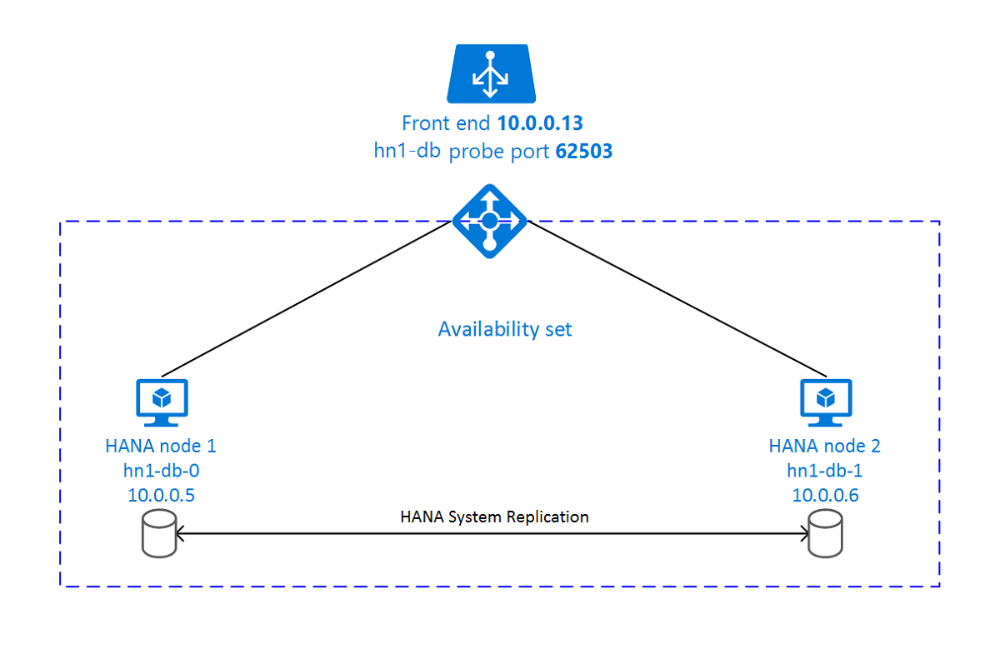

# High availability of SAP HANA on Azure VMs on SUSE Linux Enterprise Server

[dbms-guide]:dbms-guide-general.md
[deployment-guide]:deployment-guide.md
[planning-guide]:planning-guide.md

[2205917]:https://launchpad.support.sap.com/#/notes/2205917
[1944799]:https://launchpad.support.sap.com/#/notes/1944799
[1928533]:https://launchpad.support.sap.com/#/notes/1928533
[2015553]:https://launchpad.support.sap.com/#/notes/2015553
[2178632]:https://launchpad.support.sap.com/#/notes/2178632
[2191498]:https://launchpad.support.sap.com/#/notes/2191498
[2243692]:https://launchpad.support.sap.com/#/notes/2243692
[1984787]:https://launchpad.support.sap.com/#/notes/1984787
[1999351]:https://launchpad.support.sap.com/#/notes/1999351
[2388694]:https://launchpad.support.sap.com/#/notes/2388694
[401162]:https://launchpad.support.sap.com/#/notes/401162

[hana-ha-guide-replication]:sap-hana-high-availability.md#14c19f65-b5aa-4856-9594-b81c7e4df73d
[hana-ha-guide-shared-storage]:sap-hana-high-availability.md#498de331-fa04-490b-997c-b078de457c9d
[sles-for-sap-bp]:https://www.suse.com/documentation/sles-for-sap-12/

[suse-hana-ha-guide]:https://www.suse.com/docrep/documents/ir8w88iwu7/suse_linux_enterprise_server_for_sap_applications_12_sp1.pdf
[sap-swcenter]:https://launchpad.support.sap.com/#/softwarecenter
[template-multisid-db]:https://portal.azure.com/#create/Microsoft.Template/uri/https%3A%2F%2Fraw.githubusercontent.com%2FAzure%2Fazure-quickstart-templates%2Fmaster%2Fapplication-workloads%2Fsap%2Fsap-3-tier-marketplace-image-multi-sid-db-md%2Fazuredeploy.json
[template-converged]:https://portal.azure.com/#create/Microsoft.Template/uri/https%3A%2F%2Fraw.githubusercontent.com%2FAzure%2Fazure-quickstart-templates%2Fmaster%2Fapplication-workloads%2Fsap%2Fsap-3-tier-marketplace-image-converged-md%2Fazuredeploy.json

For on-premises development, you can use either HANA System Replication or use shared storage to establish high availability for SAP HANA.
On Azure virtual machines (VMs), HANA System Replication on Azure is currently the only supported high availability function. 
SAP HANA Replication consists of one primary node and at least one secondary node. Changes to the data on the primary node are replicated to the secondary node synchronously or asynchronously.

This article describes how to deploy and configure the virtual machines, install the cluster framework, and install and configure SAP HANA System Replication.
In the example configurations, installation commands, instance number **03**, and HANA System ID **HN1** are used.

Read the following SAP Notes and papers first:

* SAP Note [1928533], which has:
  * The list of Azure VM sizes that are supported for the deployment of SAP software.
  * Important capacity information for Azure VM sizes.
  * The supported SAP software, and operating system (OS) and database combinations.
  * The required SAP kernel version for Windows and Linux on Microsoft Azure.
* SAP Note [2015553] lists the prerequisites for SAP-supported SAP software deployments in Azure.
* SAP Note [2205917] has recommended OS settings for SUSE Linux Enterprise Server for SAP Applications.
* SAP Note [1944799] has SAP HANA Guidelines for SUSE Linux Enterprise Server for SAP Applications.
* SAP Note [2178632] has detailed information about all of the monitoring metrics that are reported for SAP in Azure.
* SAP Note [2191498] has the required SAP Host Agent version for Linux in Azure.
* SAP Note [2243692] has information about SAP licensing on Linux in Azure.
* SAP Note [1984787] has general information about SUSE Linux Enterprise Server 12.
* SAP Note [1999351] has additional troubleshooting information for the Azure Enhanced Monitoring Extension for SAP.
* SAP Note [401162] has information on how to avoid "address already in use" when setting up HANA System Replication.
* [SAP Community WIKI](https://wiki.scn.sap.com/wiki/display/HOME/SAPonLinuxNotes) has all of the required SAP Notes for Linux.
* [SAP HANA Certified IaaS Platforms](https://www.sap.com/dmc/exp/2014-09-02-hana-hardware/enEN/#/solutions?filters=v:deCertified;ve:24;iaas;v:125;v:105;v:99;v:120)
* [Azure Virtual Machines planning and implementation for SAP on Linux][planning-guide] guide.
* [Azure Virtual Machines deployment for SAP on Linux][deployment-guide] (this article).
* [Azure Virtual Machines DBMS deployment for SAP on Linux][dbms-guide] guide.
* [SUSE Linux Enterprise Server for SAP Applications 12 SP3 best practices guides][sles-for-sap-bp]
  * Setting up an SAP HANA SR Performance Optimized Infrastructure (SLES for SAP Applications 12 SP1). The guide contains all of the required information to set up SAP HANA System Replication for on-premises development. Use this guide as a baseline.
  * Setting up an SAP HANA SR Cost Optimized Infrastructure (SLES for SAP Applications 12 SP1)

## Overview

To achieve high availability, SAP HANA is installed on two virtual machines. The data is replicated by using HANA System Replication.



SAP HANA System Replication setup uses a dedicated virtual hostname and virtual IP addresses. On Azure, a load balancer is required to use a virtual IP address. The  presented configuration shows a load balancer with:

* Front-end IP address: 10.0.0.13 for hn1-db
* Probe Port: 62503

## Deploy for Linux

The resource agent for SAP HANA is included in SUSE Linux Enterprise Server for SAP Applications.
The Azure Marketplace contains an image for SUSE Linux Enterprise Server for SAP Applications 12 that you can use to deploy new virtual machines.

### Deploy with a template

You can use one of the quickstart templates that are on GitHub to deploy all the required resources. The template deploys the virtual machines, the load balancer, the availability set, and so on.
To deploy the template, follow these steps:

1. Open the [database template][template-multisid-db] or the [converged template][template-converged] on the Azure portal. 
    The database template creates the load-balancing rules for a database only. The converged template also creates the load-balancing rules for an ASCS/SCS and ERS (Linux only) instance. If you plan to install an SAP NetWeaver-based system and you want to install the ASCS/SCS instance on the same machines, use the [converged template][template-converged].

1. Enter the following parameters:
    - **Sap System ID**: Enter the SAP system ID of the SAP system you want to install. The ID is used as a prefix for the resources that are deployed.
    - **Stack Type**: (This parameter is applicable only if you use the converged template.) Select the SAP NetWeaver stack type.
    - **Os Type**: Select one of the Linux distributions. For this example, select **SLES 12**.
    - **Db Type**: Select **HANA**.
    - **Sap System Size**: Enter the number of SAPS that the new system is going to provide. If you're not sure how many SAPS the system requires, ask your SAP Technology Partner or System Integrator.
    - **System Availability**: Select **HA**.
    - **Admin Username and Admin Password**: A new user is created that can be used to sign in to the machine.
    - **New Or Existing Subnet**: Determines whether a new virtual network and subnet should be created or an existing subnet used. If you already have a virtual network that's connected to your on-premises network, select **Existing**.
    - **Subnet ID**: If you want to deploy the VM into an existing VNet where you have a subnet defined the VM should be assigned to, name the ID of that specific subnet. The ID usually looks like **/subscriptions/\<subscription ID>/resourceGroups/\<resource group name>/providers/Microsoft.Network/virtualNetworks/\<virtual network name>/subnets/\<subnet name>**.

### Manual deployment

> [!IMPORTANT]
> Make sure that the OS you select is SAP certified for SAP HANA on the specific VM types you are using. The list  of SAP HANA certified VM types and OS releases for those can be looked up in [SAP HANA Certified IaaS Platforms](https://www.sap.com/dmc/exp/2014-09-02-hana-hardware/enEN/#/solutions?filters=v:deCertified;ve:24;iaas;v:125;v:105;v:99;v:120). Make sure to click into the details of the VM type listed to get the complete list of SAP HANA supported OS releases for the specific VM type  

1. Create a resource group.
1. Create a virtual network.
1. Create an availability set.
   - Set the max update domain.
1. Create a load balancer (internal). We recommend [standard load balancer](../../load-balancer/load-balancer-overview.md). Select the virtual network created in step 2.
1. Create virtual machine 1.
   - Use a SLES4SAP image in the Azure gallery that is supported for SAP HANA on the VM type you selected.
   - Select the availability set created in step 3.
1. Create virtual machine 2.
   - Use a SLES4SAP image in the Azure gallery that is supported for SAP HANA on the VM type you selected.
   - Select the availability set created in step 3. 
1. Add data disks.

   > [!IMPORTANT]
   > Floating IP is not supported on a NIC secondary IP configuration in load-balancing scenarios. For details see [Azure Load balancer Limitations](../../load-balancer/load-balancer-multivip-overview.md#limitations). If you need additional IP address for the VM, deploy a second NIC.   

   > [!Note]
   > When VMs without public IP addresses are placed in the backend pool of internal (no public IP address) Standard Azure load balancer, there will be no outbound internet connectivity, unless additional configuration is performed to allow routing to public end points. For details on how to achieve outbound connectivity see [Public endpoint connectivity for Virtual Machines using Azure Standard Load Balancer in SAP high-availability scenarios](./high-availability-guide-standard-load-balancer-outbound-connections.md).  

1. To set up standard load balancer, follow these configuration steps:
   1. First, create a front-end IP pool:
   
      1. Open the load balancer, select **frontend IP pool**, and select **Add**.
      1. Enter the name of the new front-end IP pool (for example, **hana-frontend**).
      1. Set the **Assignment** to **Static** and enter the IP address (for example, **10.0.0.13**).
      1. Select **OK**.
      1. After the new front-end IP pool is created, note the pool IP address.
   
   1. Create a single back-end pool: 
 
      1. Open the load balancer, select **Backend pools**, and then select **Add**.
      1. Enter the name of the new back-end pool (for example, **hana-backend**).
      2. Select **NIC** for Backend Pool Configuration. 
      1. Select **Add a virtual machine**.
      1. Select the virtual machines of the HANA cluster.
      1. Select **Add**.     
      2. Select **Save**.
   
   1. Next, create a health probe:
   
      1. Open the load balancer, select **health probes**, and select **Add**.
      1. Enter the name of the new health probe (for example, **hana-hp**).
      1. Select **TCP** as the protocol and port 625**03**. Keep the **Interval** value set to 5.
      1. Select **OK**.
   
   1. Next, create the load-balancing rules:
   
      1. Open the load balancer, select **load balancing rules**, and select **Add**.
      1. Enter the name of the new load balancer rule (for example, **hana-lb**).
      1. Select the front-end IP address, the back-end pool, and the health probe that you created earlier (for example, **hana-frontend**, **hana-backend** and **hana-hp**).
      2. Increase idle timeout to 30 minutes
      1. Select **HA Ports**.
      1. Make sure to **enable Floating IP**.
      1. Select **OK**.

   For more information about the required ports for SAP HANA, read the chapter [Connections to Tenant Databases](https://help.sap.com/viewer/78209c1d3a9b41cd8624338e42a12bf6/latest/en-US/7a9343c9f2a2436faa3cfdb5ca00c052.html) in the [SAP HANA Tenant Databases](https://help.sap.com/viewer/78209c1d3a9b41cd8624338e42a12bf6) guide or [SAP Note 2388694][2388694].

> [!IMPORTANT]
> Do not enable TCP timestamps on Azure VMs placed behind Azure Load Balancer. Enabling TCP timestamps will cause the health probes to fail. Set parameter **net.ipv4.tcp_timestamps** to **0**. For details see [Load Balancer health probes](../../load-balancer/load-balancer-custom-probe-overview.md).
> See also SAP note [2382421](https://launchpad.support.sap.com/#/notes/2382421). 

## Create a Pacemaker cluster

Follow the steps in [Setting up Pacemaker on SUSE Linux Enterprise Server in Azure](high-availability-guide-suse-pacemaker.md) to create a basic Pacemaker cluster for this HANA server. You can use the same Pacemaker cluster for SAP HANA and SAP NetWeaver (A)SCS.

## Install SAP HANA

The steps in this section use the following prefixes:
- **[A]**: The step applies to all nodes.
- **[1]**: The step applies to node 1 only.
- **[2]**: The step applies to node 2 of the Pacemaker cluster only.

1. **[A]** Set up the disk layout: **Logical Volume Manager (LVM)**.

   We recommend that you use LVM for volumes that store data and log files. The following example assumes that the virtual machines have four data disks attached that are used to create two volumes.

   List all of the available disks:

   <pre><code>ls /dev/disk/azure/scsi1/lun*
   </code></pre>

   Example output:

   <pre><code>
   /dev/disk/azure/scsi1/lun0  /dev/disk/azure/scsi1/lun1  /dev/disk/azure/scsi1/lun2  /dev/disk/azure/scsi1/lun3
   </code></pre>

   Create physical volumes for all of the disks that you want to use:

   <pre><code>sudo pvcreate /dev/disk/azure/scsi1/lun0
   sudo pvcreate /dev/disk/azure/scsi1/lun1
   sudo pvcreate /dev/disk/azure/scsi1/lun2
   sudo pvcreate /dev/disk/azure/scsi1/lun3
   </code></pre>

   Create a volume group for the data files. Use one volume group for the log files and one for the shared directory of SAP HANA:

   <pre><code>sudo vgcreate vg_hana_data_<b>HN1</b> /dev/disk/azure/scsi1/lun0 /dev/disk/azure/scsi1/lun1
   sudo vgcreate vg_hana_log_<b>HN1</b> /dev/disk/azure/scsi1/lun2
   sudo vgcreate vg_hana_shared_<b>HN1</b> /dev/disk/azure/scsi1/lun3
   </code></pre>

   Create the logical volumes. A linear volume is created when you use `lvcreate` without the `-i` switch. We suggest that you create a striped volume for better I/O performance, and align the stripe sizes to the values documented in [SAP HANA VM storage configurations](./hana-vm-operations-storage.md). The `-i` argument should be the number of the underlying physical volumes and the `-I` argument is the stripe size. In this document, two physical volumes are used for the data volume, so the `-i` switch argument is set to **2**. The stripe size for the data volume is **256KiB**. One physical volume is used for the log volume, so no `-i` or `-I` switches are explicitly used for the log volume commands.  

   > [!IMPORTANT]
   > Use the `-i` switch and set it to the number of the underlying physical volume when you use more than one physical volume for each data, log, or shared volumes. Use the `-I` switch to specify the stripe size, when creating a striped volume.  
   > See [SAP HANA VM storage configurations](./hana-vm-operations-storage.md) for recommended storage configurations, including stripe sizes and number of disks.  

   <pre><code>sudo lvcreate <b>-i 2</b> <b>-I 256</b> -l 100%FREE -n hana_data vg_hana_data_<b>HN1</b>
   sudo lvcreate -l 100%FREE -n hana_log vg_hana_log_<b>HN1</b>
   sudo lvcreate -l 100%FREE -n hana_shared vg_hana_shared_<b>HN1</b>
   sudo mkfs.xfs /dev/vg_hana_data_<b>HN1</b>/hana_data
   sudo mkfs.xfs /dev/vg_hana_log_<b>HN1</b>/hana_log
   sudo mkfs.xfs /dev/vg_hana_shared_<b>HN1</b>/hana_shared
   </code></pre>
  
   Create the mount directories and copy the UUID of all of the logical volumes:

   <pre><code>sudo mkdir -p /hana/data/<b>HN1</b>
   sudo mkdir -p /hana/log/<b>HN1</b>
   sudo mkdir -p /hana/shared/<b>HN1</b>
   # Write down the ID of /dev/vg_hana_data_<b>HN1</b>/hana_data, /dev/vg_hana_log_<b>HN1</b>/hana_log, and /dev/vg_hana_shared_<b>HN1</b>/hana_shared
   sudo blkid
   </code></pre>

   Create `fstab` entries for the three logical volumes:       

   <pre><code>sudo vi /etc/fstab
   </code></pre>

   Insert the following line in the `/etc/fstab` file:      

   <pre><code>/dev/disk/by-uuid/<b>&lt;UUID of /dev/mapper/vg_hana_data_<b>HN1</b>-hana_data&gt;</b> /hana/data/<b>HN1</b> xfs  defaults,nofail  0  2
   /dev/disk/by-uuid/<b>&lt;UUID of /dev/mapper/vg_hana_log_<b>HN1</b>-hana_log&gt;</b> /hana/log/<b>HN1</b> xfs  defaults,nofail  0  2
   /dev/disk/by-uuid/<b>&lt;UUID of /dev/mapper/vg_hana_shared_<b>HN1</b>-hana_shared&gt;</b> /hana/shared/<b>HN1</b> xfs  defaults,nofail  0  2
   </code></pre>

   Mount the new volumes:

   <pre><code>sudo mount -a
   </code></pre>

1. **[A]** Set up the disk layout: **Plain Disks**.

   For demo systems, you can place your HANA data and log files on one disk. Create a partition on /dev/disk/azure/scsi1/lun0 and format it with xfs:

   <pre><code>sudo sh -c 'echo -e "n\n\n\n\n\nw\n" | fdisk /dev/disk/azure/scsi1/lun0'
   sudo mkfs.xfs /dev/disk/azure/scsi1/lun0-part1
   
   # Write down the ID of /dev/disk/azure/scsi1/lun0-part1
   sudo /sbin/blkid
   sudo vi /etc/fstab
   </code></pre>

   Insert this line in the /etc/fstab file:

   <pre><code>/dev/disk/by-uuid/<b>&lt;UUID&gt;</b> /hana xfs  defaults,nofail  0  2
   </code></pre>

   Create the target directory and mount the disk:

   <pre><code>sudo mkdir /hana
   sudo mount -a
   </code></pre>

1. **[A]** Set up host name resolution for all hosts.

   You can either use a DNS server or modify the /etc/hosts file on all nodes. This example shows you how to use the /etc/hosts file.
   Replace the IP address and the hostname in the following commands:

   <pre><code>sudo vi /etc/hosts
   </code></pre>

   Insert the following lines in the /etc/hosts file. Change the IP address and hostname to match your environment:

   <pre><code><b>10.0.0.5 hn1-db-0</b>
   <b>10.0.0.6 hn1-db-1</b>
   </code></pre>

1. **[A]** Install the SAP HANA high availability packages:

   <pre><code>sudo zypper install SAPHanaSR
   </code></pre>

To install SAP HANA System Replication, follow chapter 4 of the [SAP HANA SR Performance Optimized Scenario guide](https://www.suse.com/products/sles-for-sap/resource-library/sap-best-practices/).

1. **[A]** Run the **hdblcm** program from the HANA DVD. Enter the following values at the prompt:
   * Choose installation: Enter **1**.
   * Select additional components for installation: Enter **1**.
   * Enter Installation Path [/hana/shared]: Select Enter.
   * Enter Local Host Name [..]: Select Enter.
   * Do you want to add additional hosts to the system? (y/n) [n]: Select Enter.
   * Enter SAP HANA System ID: Enter the SID of HANA, for example: **HN1**.
   * Enter Instance Number [00]: Enter the HANA Instance number. Enter **03** if you used the Azure template or followed the manual deployment section of this article.
   * Select Database Mode / Enter Index [1]: Select Enter.
   * Select System Usage / Enter Index [4]: Select the system usage value.
   * Enter Location of Data Volumes [/hana/data/HN1]: Select Enter.
   * Enter Location of Log Volumes [/hana/log/HN1]: Select Enter.
   * Restrict maximum memory allocation? [n]: Select Enter.
   * Enter Certificate Host Name For Host '...' [...]: Select Enter.
   * Enter SAP Host Agent User (sapadm) Password: Enter the host agent user password.
   * Confirm SAP Host Agent User (sapadm) Password: Enter the host agent user password again to confirm.
   * Enter System Administrator (hdbadm) Password: Enter the system administrator password.
   * Confirm System Administrator (hdbadm) Password: Enter the system administrator password again to confirm.
   * Enter System Administrator Home Directory [/usr/sap/HN1/home]: Select Enter.
   * Enter System Administrator Login Shell [/bin/sh]: Select Enter.
   * Enter System Administrator User ID [1001]: Select Enter.
   * Enter ID of User Group (sapsys) [79]: Select Enter.
   * Enter Database User (SYSTEM) Password: Enter the database user password.
   * Confirm Database User (SYSTEM) Password: Enter the database user password again to confirm.
   * Restart system after machine reboot? [n]: Select Enter.
   * Do you want to continue? (y/n): Validate the summary. Enter **y** to continue.

1. **[A]** Upgrade the SAP Host Agent.

   Download the latest SAP Host Agent archive from the [SAP Software Center][sap-swcenter] and run the following command to upgrade the agent. Replace the path to the archive to point to the file that you downloaded:

   <pre><code>sudo /usr/sap/hostctrl/exe/saphostexec -upgrade -archive &lt;path to SAP Host Agent SAR&gt;
   </code></pre>

## Configure SAP HANA 2.0 System Replication

The steps in this section use the following prefixes:

* **[A]**: The step applies to all nodes.
* **[1]**: The step applies to node 1 only.
* **[2]**: The step applies to node 2 of the Pacemaker cluster only.

1. **[1]** Create the tenant database.

   If you're using SAP HANA 2.0 or MDC, create a tenant database for your SAP NetWeaver system. Replace **NW1** with the SID of your SAP system.

   Execute the following command as <hanasid\>adm :

   <pre><code>hdbsql -u SYSTEM -p "<b>passwd</b>" -i <b>03</b> -d SYSTEMDB 'CREATE DATABASE <b>NW1</b> SYSTEM USER PASSWORD "<b>passwd</b>"'
   </code></pre>

1. **[1]** Configure System Replication on the first node:

   Back up the databases as <hanasid\>adm:

   <pre><code>hdbsql -d SYSTEMDB -u SYSTEM -p "<b>passwd</b>" -i <b>03</b> "BACKUP DATA USING FILE ('<b>initialbackupSYS</b>')"
   hdbsql -d <b>HN1</b> -u SYSTEM -p "<b>passwd</b>" -i <b>03</b> "BACKUP DATA USING FILE ('<b>initialbackupHN1</b>')"
   hdbsql -d <b>NW1</b> -u SYSTEM -p "<b>passwd</b>" -i <b>03</b> "BACKUP DATA USING FILE ('<b>initialbackupNW1</b>')"
   </code></pre>

   Copy the system PKI files to the secondary site:

   <pre><code>scp /usr/sap/<b>HN1</b>/SYS/global/security/rsecssfs/data/SSFS_<b>HN1</b>.DAT   <b>hn1-db-1</b>:/usr/sap/<b>HN1</b>/SYS/global/security/rsecssfs/data/
   scp /usr/sap/<b>HN1</b>/SYS/global/security/rsecssfs/key/SSFS_<b>HN1</b>.KEY  <b>hn1-db-1</b>:/usr/sap/<b>HN1</b>/SYS/global/security/rsecssfs/key/
   </code></pre>

   Create the primary site:

   <pre><code>hdbnsutil -sr_enable --name=<b>SITE1</b>
   </code></pre>

1. **[2]** Configure System Replication on the second node:
    
   Register the second node to start the system replication. Run the following command as <hanasid\>adm :

   <pre><code>sapcontrol -nr <b>03</b> -function StopWait 600 10
   hdbnsutil -sr_register --remoteHost=<b>hn1-db-0</b> --remoteInstance=<b>03</b> --replicationMode=sync --name=<b>SITE2</b> 
   </code></pre>

## Configure SAP HANA 1.0 System Replication

The steps in this section use the following prefixes:

* **[A]**: The step applies to all nodes.
* **[1]**: The step applies to node 1 only.
* **[2]**: The step applies to node 2 of the Pacemaker cluster only.

1. **[1]** Create the required users.

   Run the following command as root. Make sure to replace bold strings (HANA System ID **HN1** and instance number **03**) with the values of your SAP HANA installation:

   <pre><code>PATH="$PATH:/usr/sap/<b>HN1</b>/HDB<b>03</b>/exe"
   hdbsql -u system -i <b>03</b> 'CREATE USER <b>hdb</b>hasync PASSWORD "<b>passwd</b>"'
   hdbsql -u system -i <b>03</b> 'GRANT DATA ADMIN TO <b>hdb</b>hasync'
   hdbsql -u system -i <b>03</b> 'ALTER USER <b>hdb</b>hasync DISABLE PASSWORD LIFETIME'
   </code></pre>

1. **[A]** Create the keystore entry.

   Run the following command as root to create a new keystore entry:

   <pre><code>PATH="$PATH:/usr/sap/<b>HN1</b>/HDB<b>03</b>/exe"
   hdbuserstore SET <b>hdb</b>haloc localhost:3<b>03</b>15 <b>hdb</b>hasync <b>passwd</b>
   </code></pre>

1. **[1]** Back up the database.

   Back up the databases as root:

   <pre><code>PATH="$PATH:/usr/sap/<b>HN1</b>/HDB<b>03</b>/exe"
   hdbsql -d SYSTEMDB -u system -i <b>03</b> "BACKUP DATA USING FILE ('<b>initialbackup</b>')"
   </code></pre>

   If you use a multi-tenant installation, also back up the tenant database:

   <pre><code>hdbsql -d <b>HN1</b> -u system -i <b>03</b> "BACKUP DATA USING FILE ('<b>initialbackup</b>')"
   </code></pre>

1. **[1]** Configure System Replication on the first node.

   Create the primary site as <hanasid\>adm :

   <pre><code>su - <b>hdb</b>adm
   hdbnsutil -sr_enable –-name=<b>SITE1</b>
   </code></pre>

1. **[2]** Configure System Replication on the secondary node.

   Register the secondary site as <hanasid\>adm:

   <pre><code>sapcontrol -nr <b>03</b> -function StopWait 600 10
   hdbnsutil -sr_register --remoteHost=<b>hn1-db-0</b> --remoteInstance=<b>03</b> --replicationMode=sync --name=<b>SITE2</b> 
   </code></pre>

## Implement HANA hooks SAPHanaSR and susChkSrv

This is important step to optimize the integration with the cluster and improve the detection when a cluster failover is needed. It is highly recommended to configure the SAPHanaSR Python hook.  For HANA 2.0 SP5 and above,  implementing SAPHanaSR, along with susChkSrv hook is recommended.  

SusChkSrv extends the functionality of  the main SAPHanaSR HA provider. It acts in the situation when HANA process hdbindexserver crashes. If a single process crashes typically HANA tries to restart it. Restarting the indexserver process can take a long time, during which the HANA database is not responsive.

With susChkSrv implemented, an immediate and configurable action is executed, which triggers a failover in the configured timeout period,  instead of waiting on hdbindexserver process to restart on the same node. 

1. **[A]** Install the HANA "system replication hook". The hook needs to be installed on both HANA DB nodes.           

   > [!TIP]
   > SAPHanaSR Python hook can only be implemented for HANA 2.0. Package SAPHanaSR must be at least version 0.153.   
   > susChkSrv Python hook  requires SAP HANA 2.0 SP5 and SAPHanaSR version 0.161.1_BF or higher must be installed.  

   1. Stop HANA on both nodes. Execute as <sid\>adm:  
   
    ```bash
    sapcontrol -nr 03 -function StopSystem
    ```

   2. Adjust `global.ini` on each cluster node. If the requirements for susChkSrv hook are not met, remove the entire block [ha_dr_provider_suschksrv] from below parameters.  
   You can adjust the behavior of susChkSrv with parameter action_on_lost.  
   Valid values are [ ignore | stop | kill | fence ].
 
    ```bash
    # add to global.ini
    [ha_dr_provider_SAPHanaSR]
    provider = SAPHanaSR
    path = /usr/share/SAPHanaSR
    execution_order = 1
    
    [ha_dr_provider_suschksrv]
    provider = susChkSrv
    path = /usr/share/SAPHanaSR
    execution_order = 3
    action_on_lost = fence

    [trace]
    ha_dr_saphanasr = info
    ```      

Configuration pointing to the standard location /usr/share/SAPHanaSR, brings a benefit, that the python hook code is automatically updated through OS or package updates and it gets used by HANA at next restart. With an optional, own path, such as /hana/shared/myHooks you can decouple OS updates with the used hook version.

2. **[A]** The cluster requires sudoers configuration on each cluster node for <sid\>adm. In this example that is achieved by creating a new file. Execute the command as `root` and adapt the values of hn1/HN1 with correct SID.    

    ```bash
    cat << EOF > /etc/sudoers.d/20-saphana
    # Needed for SAPHanaSR and susChkSrv Python hooks
    hn1adm ALL=(ALL) NOPASSWD: /usr/sbin/crm_attribute -n hana_hn1_site_srHook_*
    hn1adm ALL=(ALL) NOPASSWD: /usr/sbin/SAPHanaSR-hookHelper --sid=HN1 --case=fenceMe
    EOF
    ```
For more details on the implementation of the SAP HANA system replication hook see [Set up HANA HA/DR providers](https://documentation.suse.com/sbp/all/html/SLES4SAP-hana-sr-guide-PerfOpt-15/index.html#_set_up_sap_hana_hadr_providers). 

3. **[A]** Start SAP HANA on both nodes. Execute as <sid\>adm.  

    ```bash
    sapcontrol -nr 03 -function StartSystem 
    ```

4. **[1]** Verify the hook installation. Execute as <sid\>adm on the active HANA system replication site.   

    ```bash
     cdtrace
     awk '/ha_dr_SAPHanaSR.*crm_attribute/ \
     { printf "%s %s %s %s\n",$2,$3,$5,$16 }' nameserver_*
     # Example output
     # 2021-04-08 22:18:15.877583 ha_dr_SAPHanaSR SFAIL
     # 2021-04-08 22:18:46.531564 ha_dr_SAPHanaSR SFAIL
     # 2021-04-08 22:21:26.816573 ha_dr_SAPHanaSR SOK
    ```
   
   Verify the susChkSrv hook installation. Execute as <sid\>adm on all HANA VMs
    ```bash
     cdtrace
     egrep '(LOST:|STOP:|START:|DOWN:|init|load|fail)' nameserver_suschksrv.trc
     # Example output
     # 2022-11-03 18:06:21.116728  susChkSrv.init() version 0.7.7, parameter info: action_on_lost=fence stop_timeout=20 kill_signal=9
     # 2022-11-03 18:06:27.613588  START: indexserver event looks like graceful tenant start
     # 2022-11-03 18:07:56.143766  START: indexserver event looks like graceful tenant start (indexserver started)
    ```

## Create SAP HANA cluster resources

First, create the HANA topology. Run the following commands on one of the Pacemaker cluster nodes:

<pre><code>sudo crm configure property maintenance-mode=true

# Replace the bold string with your instance number and HANA system ID

sudo crm configure primitive rsc_SAPHanaTopology_<b>HN1</b>_HDB<b>03</b> ocf:suse:SAPHanaTopology \
  operations \$id="rsc_sap2_<b>HN1</b>_HDB<b>03</b>-operations" \
  op monitor interval="10" timeout="600" \
  op start interval="0" timeout="600" \
  op stop interval="0" timeout="300" \
  params SID="<b>HN1</b>" InstanceNumber="<b>03</b>"

sudo crm configure clone cln_SAPHanaTopology_<b>HN1</b>_HDB<b>03</b> rsc_SAPHanaTopology_<b>HN1</b>_HDB<b>03</b> \
  meta clone-node-max="1" target-role="Started" interleave="true"
</code></pre>

Next, create the HANA resources:

> [!IMPORTANT]
> Recent testing revealed situations, where netcat stops responding to requests due to backlog and its limitation of handling only one connection. The netcat resource stops listening to the Azure Load balancer requests and the floating IP becomes unavailable.  
> For existing Pacemaker clusters, we recommended in the past replacing netcat with socat. Currently we recommend using azure-lb resource agent, which is part of package resource-agents, with the following package version requirements:
> - For SLES 12 SP4/SP5, the version must be at least resource-agents-4.3.018.a7fb5035-3.30.1.  
> - For SLES 15/15 SP1, the version must be at least resource-agents-4.3.0184.6ee15eb2-4.13.1.  
>
> Note that the change will require brief downtime.  
> For existing Pacemaker clusters, if the configuration was already changed to use socat as described in [Azure Load-Balancer Detection Hardening](https://www.suse.com/support/kb/doc/?id=7024128), there is no requirement to switch immediately to azure-lb resource agent.


> [!NOTE]
> This article contains references to the terms *master* and *slave*, terms that Microsoft no longer uses. When these terms are removed from the software, we'll remove them from this article.

<pre><code># Replace the bold string with your instance number, HANA system ID, and the front-end IP address of the Azure load balancer. 

sudo crm configure primitive rsc_SAPHana_<b>HN1</b>_HDB<b>03</b> ocf:suse:SAPHana \
  operations \$id="rsc_sap_<b>HN1</b>_HDB<b>03</b>-operations" \
  op start interval="0" timeout="3600" \
  op stop interval="0" timeout="3600" \
  op promote interval="0" timeout="3600" \
  op monitor interval="60" role="Master" timeout="700" \
  op monitor interval="61" role="Slave" timeout="700" \
  params SID="<b>HN1</b>" InstanceNumber="<b>03</b>" PREFER_SITE_TAKEOVER="true" \
  DUPLICATE_PRIMARY_TIMEOUT="7200" AUTOMATED_REGISTER="false"

sudo crm configure ms msl_SAPHana_<b>HN1</b>_HDB<b>03</b> rsc_SAPHana_<b>HN1</b>_HDB<b>03</b> \
  meta notify="true" clone-max="2" clone-node-max="1" \
  target-role="Started" interleave="true"

sudo crm configure primitive rsc_ip_<b>HN1</b>_HDB<b>03</b> ocf:heartbeat:IPaddr2 \
  meta target-role="Started" \
  operations \$id="rsc_ip_<b>HN1</b>_HDB<b>03</b>-operations" \
  op monitor interval="10s" timeout="20s" \
  params ip="<b>10.0.0.13</b>"

sudo crm configure primitive rsc_nc_<b>HN1</b>_HDB<b>03</b> azure-lb port=625<b>03</b> \
  op monitor timeout=20s interval=10 \
  meta resource-stickiness=0

sudo crm configure group g_ip_<b>HN1</b>_HDB<b>03</b> rsc_ip_<b>HN1</b>_HDB<b>03</b> rsc_nc_<b>HN1</b>_HDB<b>03</b>

sudo crm configure colocation col_saphana_ip_<b>HN1</b>_HDB<b>03</b> 4000: g_ip_<b>HN1</b>_HDB<b>03</b>:Started \
  msl_SAPHana_<b>HN1</b>_HDB<b>03</b>:Master  

sudo crm configure order ord_SAPHana_<b>HN1</b>_HDB<b>03</b> Optional: cln_SAPHanaTopology_<b>HN1</b>_HDB<b>03</b> \
  msl_SAPHana_<b>HN1</b>_HDB<b>03</b>

# Clean up the HANA resources. The HANA resources might have failed because of a known issue.
sudo crm resource cleanup rsc_SAPHana_<b>HN1</b>_HDB<b>03</b>

sudo crm configure property maintenance-mode=false
sudo crm configure rsc_defaults resource-stickiness=1000
sudo crm configure rsc_defaults migration-threshold=5000
</code></pre>

> [!IMPORTANT]
> We recommend as a best practice that you only set AUTOMATED_REGISTER to **no**, while performing thorough fail-over tests, to prevent failed primary instance to automatically register as secondary. Once the fail-over tests have completed successfully, set AUTOMATED_REGISTER to **yes**, so that after takeover system replication can resume automatically.

Make sure that the cluster status is ok and that all of the resources are started. It's not important on which node the resources are running.

<pre><code>sudo crm_mon -r

# Online: [ hn1-db-0 hn1-db-1 ]
#
# Full list of resources:
#
# stonith-sbd     (stonith:external/sbd): Started hn1-db-0
# Clone Set: cln_SAPHanaTopology_HN1_HDB03 [rsc_SAPHanaTopology_HN1_HDB03]
#     Started: [ hn1-db-0 hn1-db-1 ]
# Master/Slave Set: msl_SAPHana_HN1_HDB03 [rsc_SAPHana_HN1_HDB03]
#     Masters: [ hn1-db-0 ]
#     Slaves: [ hn1-db-1 ]
# Resource Group: g_ip_HN1_HDB03
#     rsc_ip_HN1_HDB03   (ocf::heartbeat:IPaddr2):       Started hn1-db-0
#     rsc_nc_HN1_HDB03   (ocf::heartbeat:azure-lb):      Started hn1-db-0
</code></pre>

## Configure HANA active/read enabled system replication in Pacemaker cluster

Starting with SAP HANA 2.0 SPS 01 SAP allows Active/Read-Enabled setup for SAP HANA System Replication, where the secondary systems of SAP HANA system replication can be used actively for read-intense workloads. To support such setup in a cluster a second virtual IP address is required which allows clients to access the secondary read-enabled SAP HANA database. To ensure that the secondary replication site can still be accessed after a takeover has occurred the cluster needs to move the virtual IP address around with the secondary of the SAPHana resource.

This section describes the additional steps that are required to manage HANA Active/Read enabled system replication in a SUSE high availability cluster with second virtual IP.    
Before proceeding further, make sure you have fully configured SUSE High Availability Cluster managing SAP HANA database as described in the above segments of the documentation.  


### Additional setup in Azure load balancer for active/read-enabled setup

To proceed with additional steps on provisioning second virtual IP, make sure you have configured Azure Load Balancer as described in [Manual Deployment](#manual-deployment) section.

1. For **standard** load balancer, follow the additional steps below on the same load balancer that you had created in earlier section.

   a. Create a second front-end IP pool: 

   - Open the load balancer, select **frontend IP pool**, and select **Add**.
   - Enter the name of the second front-end IP pool (for example, **hana-secondaryIP**).
   - Set the **Assignment** to **Static** and enter the IP address (for example, **10.0.0.14**).
   - Select **OK**.
   - After the new front-end IP pool is created, note the frontend IP address.

   b. Next, create a health probe:

   - Open the load balancer, select **health probes**, and select **Add**.
   - Enter the name of the new health probe (for example, **hana-secondaryhp**).
   - Select **TCP** as the protocol and port **62603**. Keep the **Interval** value set to 5, and the **Unhealthy threshold** value set to 2.
   - Select **OK**.

   c. Next, create the load-balancing rules:

   - Open the load balancer, select **load balancing rules**, and select **Add**.
   - Enter the name of the new load balancer rule (for example, **hana-secondarylb**).
   - Select the front-end IP address , the back-end pool, and the health probe that you created earlier (for example, **hana-secondaryIP**, **hana-backend** and **hana-secondaryhp**).
   - Select **HA Ports**.
   - Increase the **idle timeout** to 30 minutes.
   - Make sure to **enable Floating IP**.
   - Select **OK**.

### Configure HANA active/read enabled system replication

The steps to configure HANA system replication are described in [Configure SAP HANA 2.0 System Replication](#configure-sap-hana-20-system-replication) section. If you are deploying read-enabled secondary scenario, while configuring system replication on the second node, execute following command as **hanasid**adm:

```
sapcontrol -nr 03 -function StopWait 600 10 

hdbnsutil -sr_register --remoteHost=hn1-db-0 --remoteInstance=03 --replicationMode=sync --name=SITE2 --operationMode=logreplay_readaccess 
```

### Adding a secondary virtual IP address resource for an active/read-enabled setup

The second virtual IP and the appropriate colocation constraint can be configured with the following commands:

```
crm configure property maintenance-mode=true

crm configure primitive rsc_secip_HN1_HDB03 ocf:heartbeat:IPaddr2 \
 meta target-role="Started" \
 operations \$id="rsc_secip_HN1_HDB03-operations" \
 op monitor interval="10s" timeout="20s" \
 params ip="10.0.0.14"

crm configure primitive rsc_secnc_HN1_HDB03 azure-lb port=62603 \
 op monitor timeout=20s interval=10 \
 meta resource-stickiness=0

crm configure group g_secip_HN1_HDB03 rsc_secip_HN1_HDB03 rsc_secnc_HN1_HDB03

crm configure colocation col_saphana_secip_HN1_HDB03 4000: g_secip_HN1_HDB03:Started \
 msl_SAPHana_HN1_HDB03:Slave 

crm configure property maintenance-mode=false
```
Make sure that the cluster status is ok and that all of the resources are started. The second virtual IP will run on the secondary site along with SAPHana secondary resource.

```
sudo crm_mon -r

# Online: [ hn1-db-0 hn1-db-1 ]
#
# Full list of resources:
#
# stonith-sbd     (stonith:external/sbd): Started hn1-db-0
# Clone Set: cln_SAPHanaTopology_HN1_HDB03 [rsc_SAPHanaTopology_HN1_HDB03]
#     Started: [ hn1-db-0 hn1-db-1 ]
# Master/Slave Set: msl_SAPHana_HN1_HDB03 [rsc_SAPHana_HN1_HDB03]
#     Masters: [ hn1-db-0 ]
#     Slaves: [ hn1-db-1 ]
# Resource Group: g_ip_HN1_HDB03
#     rsc_ip_HN1_HDB03   (ocf::heartbeat:IPaddr2):       Started hn1-db-0
#     rsc_nc_HN1_HDB03   (ocf::heartbeat:azure-lb):      Started hn1-db-0
# Resource Group: g_secip_HN1_HDB03:
#     rsc_secip_HN1_HDB03       (ocf::heartbeat:IPaddr2):        Started hn1-db-1
#     rsc_secnc_HN1_HDB03       (ocf::heartbeat:azure-lb):       Started hn1-db-1

```

In next section, you can find the typical set of failover tests to execute.

Be aware of the second virtual IP behavior, while testing a HANA cluster configured with read-enabled secondary:

1. When you migrate **SAPHana_HN1_HDB03** cluster resource to **hn1-db-1**, the second virtual IP will move to the other server **hn1-db-0**. If you have configured AUTOMATED_REGISTER="false" and HANA system replication is not registered automatically, then the second virtual IP will run on **hn1-db-0,** as the server is available and cluster services are online.  

2. When testing a server crash, the second virtual IP resources (**rsc_secip_HN1_HDB03**) and Azure load balancer port resource (**rsc_secnc_HN1_HDB03**) will run on primary server alongside the primary virtual IP resources. While the secondary server is down, the applications that are connected to read-enabled HANA database will connect to the primary HANA database. The behavior is expected as you do not want applications that are connected to read-enabled HANA database to be inaccessible while the secondary server is unavailable.
  
3. When the secondary server is available and the cluster services are online, the second virtual IP and port resources will automatically move to the secondary server, even though HANA system replication may not be registered as secondary. You need to make sure that you register the secondary HANA database as read enabled before you start cluster services on that server. You can configure the HANA instance cluster resource to automatically register the secondary by setting parameter AUTOMATED_REGISTER=true.       

4. During failover and fallback, the existing connections for applications, using the second virtual IP to connect to the HANA database may be interrupted.  

## Test the cluster setup

This section describes how you can test your setup. Every test assumes that you are root and the SAP HANA master is running on the **hn1-db-0** virtual machine.

### Test the migration

Before you start the test, make sure that Pacemaker does not have any failed action (via crm_mon -r), there are no unexpected location constraints (for example leftovers of a migration test) and that HANA is sync state, for example with SAPHanaSR-showAttr:

<pre><code>hn1-db-0:~ # SAPHanaSR-showAttr
Sites    srHook
----------------
SITE2    SOK

Global cib-time
--------------------------------
global Mon Aug 13 11:26:04 2018

Hosts    clone_state lpa_hn1_lpt node_state op_mode   remoteHost    roles                            score site  srmode sync_state version                vhost
-----------------------------------------------------------------------------------------------------------------------------------------------------------------------------
hn1-db-0 PROMOTED    1534159564  online     logreplay nws-hana-vm-1 4:P:master1:master:worker:master 150   SITE1 sync   PRIM       2.00.030.00.1522209842 nws-hana-vm-0
hn1-db-1 DEMOTED     30          online     logreplay nws-hana-vm-0 4:S:master1:master:worker:master 100   SITE2 sync   SOK        2.00.030.00.1522209842 nws-hana-vm-1
</code></pre>

You can migrate the SAP HANA master node by executing the following command:

<pre><code>crm resource move msl_SAPHana_<b>HN1</b>_HDB<b>03</b> <b>hn1-db-1</b> force
</code></pre>

If you set `AUTOMATED_REGISTER="false"`, this sequence of commands should migrate the SAP HANA master node and the group that contains the virtual IP address to hn1-db-1.

Once the migration is done, the crm_mon -r output looks like this

<pre><code>Online: [ hn1-db-0 hn1-db-1 ]

Full list of resources:

stonith-sbd     (stonith:external/sbd): Started hn1-db-1
 Clone Set: cln_SAPHanaTopology_HN1_HDB03 [rsc_SAPHanaTopology_HN1_HDB03]
     Started: [ hn1-db-0 hn1-db-1 ]
 Master/Slave Set: msl_SAPHana_HN1_HDB03 [rsc_SAPHana_HN1_HDB03]
     Masters: [ hn1-db-1 ]
     Stopped: [ hn1-db-0 ]
 Resource Group: g_ip_HN1_HDB03
     rsc_ip_HN1_HDB03   (ocf::heartbeat:IPaddr2):       Started hn1-db-1
     rsc_nc_HN1_HDB03   (ocf::heartbeat:azure-lb):      Started hn1-db-1

Failed Actions:
* rsc_SAPHana_HN1_HDB03_start_0 on hn1-db-0 'not running' (7): call=84, status=complete, exitreason='none',
    last-rc-change='Mon Aug 13 11:31:37 2018', queued=0ms, exec=2095ms
</code></pre>

The SAP HANA resource on hn1-db-0 fails to start as secondary. In this case, configure the HANA instance as secondary by executing this command:

<pre><code>su - <b>hn1</b>adm

# Stop the HANA instance just in case it is running
hn1adm@hn1-db-0:/usr/sap/HN1/HDB03> sapcontrol -nr <b>03</b> -function StopWait 600 10
hn1adm@hn1-db-0:/usr/sap/HN1/HDB03> hdbnsutil -sr_register --remoteHost=<b>hn1-db-1</b> --remoteInstance=<b>03</b> --replicationMode=sync --name=<b>SITE1</b>
</code></pre>

The migration creates location constraints that need to be deleted again:

<pre><code># Switch back to root and clean up the failed state
exit
hn1-db-0:~ # crm resource clear msl_SAPHana_<b>HN1</b>_HDB<b>03</b>
</code></pre>

You also need to clean up the state of the secondary node resource:

<pre><code>hn1-db-0:~ # crm resource cleanup msl_SAPHana_<b>HN1</b>_HDB<b>03</b> <b>hn1-db-0</b>
</code></pre>

Monitor the state of the HANA resource using crm_mon -r. Once HANA is started on hn1-db-0, the output should look like this

<pre><code>Online: [ hn1-db-0 hn1-db-1 ]

Full list of resources:

stonith-sbd     (stonith:external/sbd): Started hn1-db-1
 Clone Set: cln_SAPHanaTopology_HN1_HDB03 [rsc_SAPHanaTopology_HN1_HDB03]
     Started: [ hn1-db-0 hn1-db-1 ]
 Master/Slave Set: msl_SAPHana_HN1_HDB03 [rsc_SAPHana_HN1_HDB03]
     Masters: [ hn1-db-1 ]
     Slaves: [ hn1-db-0 ]
 Resource Group: g_ip_HN1_HDB03
     rsc_ip_HN1_HDB03   (ocf::heartbeat:IPaddr2):       Started hn1-db-1
     rsc_nc_HN1_HDB03   (ocf::heartbeat:azure-lb):      Started hn1-db-1
</code></pre>

### Test the Azure fencing agent (not SBD)

You can test the setup of the Azure fencing agent by disabling the network interface on the hn1-db-0 node:

<pre><code>sudo ifdown eth0
</code></pre>

The virtual machine should now restart or stop depending on your cluster configuration.
If you set the `stonith-action` setting to off, the virtual machine is stopped and the resources are migrated to the running virtual machine.

After you start the virtual machine again, the SAP HANA resource fails to start as secondary if you set `AUTOMATED_REGISTER="false"`. In this case, configure the HANA instance as secondary by executing this command:

<pre><code>su - <b>hn1</b>adm

# Stop the HANA instance just in case it is running
sapcontrol -nr <b>03</b> -function StopWait 600 10
hdbnsutil -sr_register --remoteHost=<b>hn1-db-1</b> --remoteInstance=<b>03</b> --replicationMode=sync --name=<b>SITE1</b>

# Switch back to root and clean up the failed state
exit
crm resource cleanup msl_SAPHana_<b>HN1</b>_HDB<b>03</b> <b>hn1-db-0</b>
</code></pre>

### Test SBD fencing

You can test the setup of SBD by killing the inquisitor process.

<pre><code>hn1-db-0:~ # ps aux | grep sbd
root       1912  0.0  0.0  85420 11740 ?        SL   12:25   0:00 sbd: inquisitor
root       1929  0.0  0.0  85456 11776 ?        SL   12:25   0:00 sbd: watcher: /dev/disk/by-id/scsi-360014056f268462316e4681b704a9f73 - slot: 0 - uuid: 7b862dba-e7f7-4800-92ed-f76a4e3978c8
root       1930  0.0  0.0  85456 11776 ?        SL   12:25   0:00 sbd: watcher: /dev/disk/by-id/scsi-360014059bc9ea4e4bac4b18808299aaf - slot: 0 - uuid: 5813ee04-b75c-482e-805e-3b1e22ba16cd
root       1931  0.0  0.0  85456 11776 ?        SL   12:25   0:00 sbd: watcher: /dev/disk/by-id/scsi-36001405b8dddd44eb3647908def6621c - slot: 0 - uuid: 986ed8f8-947d-4396-8aec-b933b75e904c
root       1932  0.0  0.0  90524 16656 ?        SL   12:25   0:00 sbd: watcher: Pacemaker
root       1933  0.0  0.0 102708 28260 ?        SL   12:25   0:00 sbd: watcher: Cluster
root      13877  0.0  0.0   9292  1572 pts/0    S+   12:27   0:00 grep sbd

hn1-db-0:~ # kill -9 1912
</code></pre>

Cluster node hn1-db-0 should be rebooted. The Pacemaker service might not get started afterwards. Make sure to start it again.

### Test a manual failover

You can test a manual failover by stopping the `pacemaker` service on the hn1-db-0 node:

<pre><code>service pacemaker stop
</code></pre>

After the failover, you can start the service again. If you set `AUTOMATED_REGISTER="false"`, the SAP HANA resource on the hn1-db-0 node fails to start as secondary. In this case, configure the HANA instance as secondary by executing this command:

<pre><code>service pacemaker start
su - <b>hn1</b>adm

# Stop the HANA instance just in case it is running
sapcontrol -nr <b>03</b> -function StopWait 600 10
hdbnsutil -sr_register --remoteHost=<b>hn1-db-1</b> --remoteInstance=<b>03</b> --replicationMode=sync --name=<b>SITE1</b> 

# Switch back to root and clean up the failed state
exit
crm resource cleanup msl_SAPHana_<b>HN1</b>_HDB<b>03</b> <b>hn1-db-0</b>
</code></pre>

### SUSE tests

> [!IMPORTANT]
> Make sure that the OS you select is SAP certified for SAP HANA on the specific VM types you are using. The list  of SAP HANA certified VM types and OS releases for those can be looked up in [SAP HANA Certified IaaS Platforms](https://www.sap.com/dmc/exp/2014-09-02-hana-hardware/enEN/#/solutions?filters=v:deCertified;ve:24;iaas;v:125;v:105;v:99;v:120). Make sure to click into the details of the VM type listed to get the complete list of SAP HANA supported OS releases for the specific VM type

Run all test cases that are listed in the SAP HANA SR Performance Optimized Scenario or SAP HANA SR Cost Optimized Scenario guide, depending on your use case. You can find the guides on the [SLES for SAP best practices page][sles-for-sap-bp].

The following tests are a copy of the test descriptions of the SAP HANA SR Performance Optimized Scenario SUSE Linux Enterprise Server for SAP Applications 12 SP1 guide. For an up-to-date version, always also read the guide itself. Always make sure that HANA is in sync before starting the test and also make sure that the Pacemaker configuration is correct.

In the following test descriptions we assume PREFER_SITE_TAKEOVER="true" and AUTOMATED_REGISTER="false".
NOTE: The following tests are designed to be run in sequence and depend on the exit state of the preceding tests.

1. TEST 1: STOP PRIMARY DATABASE ON NODE 1

   Resource state before starting the test:

   <pre><code>Clone Set: cln_SAPHanaTopology_HN1_HDB03 [rsc_SAPHanaTopology_HN1_HDB03]
      Started: [ hn1-db-0 hn1-db-1 ]
   Master/Slave Set: msl_SAPHana_HN1_HDB03 [rsc_SAPHana_HN1_HDB03]
      Masters: [ hn1-db-0 ]
      Slaves: [ hn1-db-1 ]
   Resource Group: g_ip_HN1_HDB03
      rsc_ip_HN1_HDB03   (ocf::heartbeat:IPaddr2):       Started hn1-db-0
      rsc_nc_HN1_HDB03   (ocf::heartbeat:azure-lb):      Started hn1-db-0
   </code></pre>

   Run the following commands as <hanasid\>adm on node hn1-db-0:

   <pre><code>hn1adm@hn1-db-0:/usr/sap/HN1/HDB03> HDB stop
   </code></pre>

   Pacemaker should detect the stopped HANA instance and failover to the other node. Once the failover is done, the HANA instance on node hn1-db-0 is stopped because Pacemaker does not automatically register the node as HANA secondary.

   Run the following commands to register node hn1-db-0 as secondary and cleanup the failed resource.

   <pre><code>hn1adm@hn1-db-0:/usr/sap/HN1/HDB03> hdbnsutil -sr_register --remoteHost=hn1-db-1 --remoteInstance=03 --replicationMode=sync --name=SITE1
   
   # run as root
   hn1-db-0:~ # crm resource cleanup msl_SAPHana_HN1_HDB03 hn1-db-0
   </code></pre>

   Resource state after the test:

   <pre><code>Clone Set: cln_SAPHanaTopology_HN1_HDB03 [rsc_SAPHanaTopology_HN1_HDB03]
      Started: [ hn1-db-0 hn1-db-1 ]
   Master/Slave Set: msl_SAPHana_HN1_HDB03 [rsc_SAPHana_HN1_HDB03]
      Masters: [ hn1-db-1 ]
      Slaves: [ hn1-db-0 ]
   Resource Group: g_ip_HN1_HDB03
      rsc_ip_HN1_HDB03   (ocf::heartbeat:IPaddr2):       Started hn1-db-1
      rsc_nc_HN1_HDB03   (ocf::heartbeat:azure-lb):      Started hn1-db-1
   </code></pre>

1. TEST 2: STOP PRIMARY DATABASE ON NODE 2

   Resource state before starting the test:

   <pre><code>Clone Set: cln_SAPHanaTopology_HN1_HDB03 [rsc_SAPHanaTopology_HN1_HDB03]
      Started: [ hn1-db-0 hn1-db-1 ]
   Master/Slave Set: msl_SAPHana_HN1_HDB03 [rsc_SAPHana_HN1_HDB03]
      Masters: [ hn1-db-1 ]
      Slaves: [ hn1-db-0 ]
   Resource Group: g_ip_HN1_HDB03
      rsc_ip_HN1_HDB03   (ocf::heartbeat:IPaddr2):       Started hn1-db-1
      rsc_nc_HN1_HDB03   (ocf::heartbeat:azure-lb):      Started hn1-db-1
   </code></pre>

   Run the following commands as <hanasid\>adm on node hn1-db-1:

   <pre><code>hn1adm@hn1-db-1:/usr/sap/HN1/HDB03> HDB stop
   </code></pre>

   Pacemaker should detect the stopped HANA instance and failover to the other node. Once the failover is done, the HANA instance on node hn1-db-1 is stopped because Pacemaker does not automatically register the node as HANA secondary.

   Run the following commands to register node hn1-db-1 as secondary and cleanup the failed resource.

   <pre><code>hn1adm@hn1-db-1:/usr/sap/HN1/HDB03> hdbnsutil -sr_register --remoteHost=hn1-db-0 --remoteInstance=03 --replicationMode=sync --name=SITE2
   
   # run as root
   hn1-db-1:~ # crm resource cleanup msl_SAPHana_HN1_HDB03 hn1-db-1
   </code></pre>

   Resource state after the test:

   <pre><code>Clone Set: cln_SAPHanaTopology_HN1_HDB03 [rsc_SAPHanaTopology_HN1_HDB03]
      Started: [ hn1-db-0 hn1-db-1 ]
   Master/Slave Set: msl_SAPHana_HN1_HDB03 [rsc_SAPHana_HN1_HDB03]
      Masters: [ hn1-db-0 ]
      Slaves: [ hn1-db-1 ]
   Resource Group: g_ip_HN1_HDB03
      rsc_ip_HN1_HDB03   (ocf::heartbeat:IPaddr2):       Started hn1-db-0
      rsc_nc_HN1_HDB03   (ocf::heartbeat:azure-lb):      Started hn1-db-0
   </code></pre>

1. TEST 3: CRASH PRIMARY DATABASE ON NODE

   Resource state before starting the test:

   <pre><code>Clone Set: cln_SAPHanaTopology_HN1_HDB03 [rsc_SAPHanaTopology_HN1_HDB03]
      Started: [ hn1-db-0 hn1-db-1 ]
   Master/Slave Set: msl_SAPHana_HN1_HDB03 [rsc_SAPHana_HN1_HDB03]
      Masters: [ hn1-db-0 ]
      Slaves: [ hn1-db-1 ]
   Resource Group: g_ip_HN1_HDB03
      rsc_ip_HN1_HDB03   (ocf::heartbeat:IPaddr2):       Started hn1-db-0
      rsc_nc_HN1_HDB03   (ocf::heartbeat:azure-lb):      Started hn1-db-0
   </code></pre>

   Run the following commands as <hanasid\>adm on node hn1-db-0:

   <pre><code>hn1adm@hn1-db-0:/usr/sap/HN1/HDB03> HDB kill-9
   </code></pre>
   
   Pacemaker should detect the killed HANA instance and failover to the other node. Once the failover is done, the HANA instance on node hn1-db-0 is stopped because Pacemaker does not automatically register the node as HANA secondary.

   Run the following commands to register node hn1-db-0 as secondary and cleanup the failed resource.

   <pre><code>hn1adm@hn1-db-0:/usr/sap/HN1/HDB03> hdbnsutil -sr_register --remoteHost=hn1-db-1 --remoteInstance=03 --replicationMode=sync --name=SITE1
   
   # run as root
   hn1-db-0:~ # crm resource cleanup msl_SAPHana_HN1_HDB03 hn1-db-0
   </code></pre>

   Resource state after the test:

   <pre><code>Clone Set: cln_SAPHanaTopology_HN1_HDB03 [rsc_SAPHanaTopology_HN1_HDB03]
      Started: [ hn1-db-0 hn1-db-1 ]
   Master/Slave Set: msl_SAPHana_HN1_HDB03 [rsc_SAPHana_HN1_HDB03]
      Masters: [ hn1-db-1 ]
      Slaves: [ hn1-db-0 ]
   Resource Group: g_ip_HN1_HDB03
      rsc_ip_HN1_HDB03   (ocf::heartbeat:IPaddr2):       Started hn1-db-1
      rsc_nc_HN1_HDB03   (ocf::heartbeat:azure-lb):      Started hn1-db-1
   </code></pre>

1. TEST 4: CRASH PRIMARY DATABASE ON NODE 2

   Resource state before starting the test:

   <pre><code>Clone Set: cln_SAPHanaTopology_HN1_HDB03 [rsc_SAPHanaTopology_HN1_HDB03]
      Started: [ hn1-db-0 hn1-db-1 ]
   Master/Slave Set: msl_SAPHana_HN1_HDB03 [rsc_SAPHana_HN1_HDB03]
      Masters: [ hn1-db-1 ]
      Slaves: [ hn1-db-0 ]
   Resource Group: g_ip_HN1_HDB03
      rsc_ip_HN1_HDB03   (ocf::heartbeat:IPaddr2):       Started hn1-db-1
      rsc_nc_HN1_HDB03   (ocf::heartbeat:azure-lb):      Started hn1-db-1
   </code></pre>

   Run the following commands as <hanasid\>adm on node hn1-db-1:

   <pre><code>hn1adm@hn1-db-1:/usr/sap/HN1/HDB03> HDB kill-9
   </code></pre>

   Pacemaker should detect the killed HANA instance and failover to the other node. Once the failover is done, the HANA instance on node hn1-db-1 is stopped because Pacemaker does not automatically register the node as HANA secondary.

   Run the following commands to register node hn1-db-1 as secondary and cleanup the failed resource.

   <pre><code>hn1adm@hn1-db-1:/usr/sap/HN1/HDB03> hdbnsutil -sr_register --remoteHost=hn1-db-0 --remoteInstance=03 --replicationMode=sync --name=SITE2
   
   # run as root
   hn1-db-1:~ # crm resource cleanup msl_SAPHana_HN1_HDB03 hn1-db-1
   </code></pre>

   Resource state after the test:

   <pre><code>Clone Set: cln_SAPHanaTopology_HN1_HDB03 [rsc_SAPHanaTopology_HN1_HDB03]
      Started: [ hn1-db-0 hn1-db-1 ]
   Master/Slave Set: msl_SAPHana_HN1_HDB03 [rsc_SAPHana_HN1_HDB03]
      Masters: [ hn1-db-0 ]
      Slaves: [ hn1-db-1 ]
   Resource Group: g_ip_HN1_HDB03
      rsc_ip_HN1_HDB03   (ocf::heartbeat:IPaddr2):       Started hn1-db-0
      rsc_nc_HN1_HDB03   (ocf::heartbeat:azure-lb):      Started hn1-db-0
   </code></pre>

1. TEST 5: CRASH PRIMARY SITE NODE (NODE 1)

   Resource state before starting the test:

   <pre><code>Clone Set: cln_SAPHanaTopology_HN1_HDB03 [rsc_SAPHanaTopology_HN1_HDB03]
      Started: [ hn1-db-0 hn1-db-1 ]
   Master/Slave Set: msl_SAPHana_HN1_HDB03 [rsc_SAPHana_HN1_HDB03]
      Masters: [ hn1-db-0 ]
      Slaves: [ hn1-db-1 ]
   Resource Group: g_ip_HN1_HDB03
      rsc_ip_HN1_HDB03   (ocf::heartbeat:IPaddr2):       Started hn1-db-0
      rsc_nc_HN1_HDB03   (ocf::heartbeat:azure-lb):      Started hn1-db-0
   </code></pre>

   Run the following commands as root on node hn1-db-0:

   <pre><code>hn1-db-0:~ #  echo 'b' > /proc/sysrq-trigger
   </code></pre>

   Pacemaker should detect the killed cluster node and fence the node. Once the node is fenced, Pacemaker will trigger a takeover of the HANA instance. When the fenced node is rebooted, Pacemaker will not start automatically.

   Run the following commands to start Pacemaker, clean the SBD messages for node hn1-db-0, register node hn1-db-0 as secondary, and cleanup the failed resource.

   <pre><code># run as root
   # list the SBD device(s)
   hn1-db-0:~ # cat /etc/sysconfig/sbd | grep SBD_DEVICE=
   # SBD_DEVICE="/dev/disk/by-id/scsi-36001405772fe8401e6240c985857e116;/dev/disk/by-id/scsi-36001405034a84428af24ddd8c3a3e9e1;/dev/disk/by-id/scsi-36001405cdd5ac8d40e548449318510c3"
   
   hn1-db-0:~ # sbd -d /dev/disk/by-id/scsi-36001405772fe8401e6240c985857e116 -d /dev/disk/by-id/scsi-36001405034a84428af24ddd8c3a3e9e1 -d /dev/disk/by-id/scsi-36001405cdd5ac8d40e548449318510c3 message hn1-db-0 clear
   
   hn1-db-0:~ # systemctl start pacemaker
   
   # run as &lt;hanasid&gt;adm
   hn1adm@hn1-db-0:/usr/sap/HN1/HDB03> hdbnsutil -sr_register --remoteHost=hn1-db-1 --remoteInstance=03 --replicationMode=sync --name=SITE1
   
   # run as root
   hn1-db-0:~ # crm resource cleanup msl_SAPHana_HN1_HDB03 hn1-db-0
   </code></pre>

   Resource state after the test:

   <pre><code>Clone Set: cln_SAPHanaTopology_HN1_HDB03 [rsc_SAPHanaTopology_HN1_HDB03]
      Started: [ hn1-db-0 hn1-db-1 ]
   Master/Slave Set: msl_SAPHana_HN1_HDB03 [rsc_SAPHana_HN1_HDB03]
      Masters: [ hn1-db-1 ]
      Slaves: [ hn1-db-0 ]
   Resource Group: g_ip_HN1_HDB03
      rsc_ip_HN1_HDB03   (ocf::heartbeat:IPaddr2):       Started hn1-db-1
      rsc_nc_HN1_HDB03   (ocf::heartbeat:azure-lb):      Started hn1-db-1
   </code></pre>

1. TEST 6: CRASH SECONDARY SITE NODE (NODE 2)

   Resource state before starting the test:

   <pre><code>Clone Set: cln_SAPHanaTopology_HN1_HDB03 [rsc_SAPHanaTopology_HN1_HDB03]
      Started: [ hn1-db-0 hn1-db-1 ]
   Master/Slave Set: msl_SAPHana_HN1_HDB03 [rsc_SAPHana_HN1_HDB03]
      Masters: [ hn1-db-1 ]
      Slaves: [ hn1-db-0 ]
   Resource Group: g_ip_HN1_HDB03
      rsc_ip_HN1_HDB03   (ocf::heartbeat:IPaddr2):       Started hn1-db-1
      rsc_nc_HN1_HDB03   (ocf::heartbeat:azure-lb):      Started hn1-db-1
   </code></pre>

   Run the following commands as root on node hn1-db-1:

   <pre><code>hn1-db-1:~ #  echo 'b' > /proc/sysrq-trigger
   </code></pre>

   Pacemaker should detect the killed cluster node and fence the node. Once the node is fenced, Pacemaker will trigger a takeover of the HANA instance. When the fenced node is rebooted, Pacemaker will not start automatically.

   Run the following commands to start Pacemaker, clean the SBD messages for node hn1-db-1, register node hn1-db-1 as secondary, and cleanup the failed resource.

   <pre><code># run as root
   # list the SBD device(s)
   hn1-db-1:~ # cat /etc/sysconfig/sbd | grep SBD_DEVICE=
   # SBD_DEVICE="/dev/disk/by-id/scsi-36001405772fe8401e6240c985857e116;/dev/disk/by-id/scsi-36001405034a84428af24ddd8c3a3e9e1;/dev/disk/by-id/scsi-36001405cdd5ac8d40e548449318510c3"
   
   hn1-db-1:~ # sbd -d /dev/disk/by-id/scsi-36001405772fe8401e6240c985857e116 -d /dev/disk/by-id/scsi-36001405034a84428af24ddd8c3a3e9e1 -d /dev/disk/by-id/scsi-36001405cdd5ac8d40e548449318510c3 message hn1-db-1 clear
   
   hn1-db-1:~ # systemctl start pacemaker
   
   # run as &lt;hanasid&gt;adm
   hn1adm@hn1-db-1:/usr/sap/HN1/HDB03> hdbnsutil -sr_register --remoteHost=hn1-db-0 --remoteInstance=03 --replicationMode=sync --name=SITE2
   
   # run as root
   hn1-db-1:~ # crm resource cleanup msl_SAPHana_HN1_HDB03 hn1-db-1
   </code></pre>

   Resource state after the test:

   <pre><code>Clone Set: cln_SAPHanaTopology_HN1_HDB03 [rsc_SAPHanaTopology_HN1_HDB03]
      Started: [ hn1-db-0 hn1-db-1 ]
   Master/Slave Set: msl_SAPHana_HN1_HDB03 [rsc_SAPHana_HN1_HDB03]
      Masters: [ hn1-db-0 ]
      Slaves: [ hn1-db-1 ]
   Resource Group: g_ip_HN1_HDB03
      rsc_ip_HN1_HDB03   (ocf::heartbeat:IPaddr2):       Started hn1-db-0
      rsc_nc_HN1_HDB03   (ocf::heartbeat:azure-lb):      Started hn1-db-0
   </code></pre>

1. TEST 7: STOP THE SECONDARY DATABASE ON NODE 2

   Resource state before starting the test:

   <pre><code>Clone Set: cln_SAPHanaTopology_HN1_HDB03 [rsc_SAPHanaTopology_HN1_HDB03]
      Started: [ hn1-db-0 hn1-db-1 ]
   Master/Slave Set: msl_SAPHana_HN1_HDB03 [rsc_SAPHana_HN1_HDB03]
      Masters: [ hn1-db-0 ]
      Slaves: [ hn1-db-1 ]
   Resource Group: g_ip_HN1_HDB03
      rsc_ip_HN1_HDB03   (ocf::heartbeat:IPaddr2):       Started hn1-db-0
      rsc_nc_HN1_HDB03   (ocf::heartbeat:azure-lb):      Started hn1-db-0
   </code></pre>

   Run the following commands as <hanasid\>adm on node hn1-db-1:

   <pre><code>hn1adm@hn1-db-1:/usr/sap/HN1/HDB03> HDB stop
   </code></pre>

   Pacemaker will detect the stopped HANA instance and mark the resource as failed on node hn1-db-1. Pacemaker should automatically restart the HANA instance. Run the following command to clean up the failed state.

   <pre><code># run as root
   hn1-db-1:~ # crm resource cleanup msl_SAPHana_HN1_HDB03 hn1-db-1
   </code></pre>

   Resource state after the test:

   <pre><code>Clone Set: cln_SAPHanaTopology_HN1_HDB03 [rsc_SAPHanaTopology_HN1_HDB03]
      Started: [ hn1-db-0 hn1-db-1 ]
   Master/Slave Set: msl_SAPHana_HN1_HDB03 [rsc_SAPHana_HN1_HDB03]
      Masters: [ hn1-db-0 ]
      Slaves: [ hn1-db-1 ]
   Resource Group: g_ip_HN1_HDB03
      rsc_ip_HN1_HDB03   (ocf::heartbeat:IPaddr2):       Started hn1-db-0
      rsc_nc_HN1_HDB03   (ocf::heartbeat:azure-lb):      Started hn1-db-0
   </code></pre>

1. TEST 8: CRASH THE SECONDARY DATABASE ON NODE 2

   Resource state before starting the test:

   <pre><code>Clone Set: cln_SAPHanaTopology_HN1_HDB03 [rsc_SAPHanaTopology_HN1_HDB03]
      Started: [ hn1-db-0 hn1-db-1 ]
   Master/Slave Set: msl_SAPHana_HN1_HDB03 [rsc_SAPHana_HN1_HDB03]
      Masters: [ hn1-db-0 ]
      Slaves: [ hn1-db-1 ]
   Resource Group: g_ip_HN1_HDB03
      rsc_ip_HN1_HDB03   (ocf::heartbeat:IPaddr2):       Started hn1-db-0
      rsc_nc_HN1_HDB03   (ocf::heartbeat:azure-lb):      Started hn1-db-0
   </code></pre>

   Run the following commands as <hanasid\>adm on node hn1-db-1:

   <pre><code>hn1adm@hn1-db-1:/usr/sap/HN1/HDB03> HDB kill-9
   </code></pre>

   Pacemaker will detect the killed HANA instance and mark the resource as failed on node hn1-db-1. Run the following command to clean up the failed state. Pacemaker should then automatically restart the HANA instance.

   <pre><code># run as root
   hn1-db-1:~ # crm resource cleanup msl_SAPHana_HN1_HDB03 hn1-db-1
   </code></pre>

   Resource state after the test:

   <pre><code>Clone Set: cln_SAPHanaTopology_HN1_HDB03 [rsc_SAPHanaTopology_HN1_HDB03]
      Started: [ hn1-db-0 hn1-db-1 ]
   Master/Slave Set: msl_SAPHana_HN1_HDB03 [rsc_SAPHana_HN1_HDB03]
      Masters: [ hn1-db-0 ]
      Slaves: [ hn1-db-1 ]
   Resource Group: g_ip_HN1_HDB03
      rsc_ip_HN1_HDB03   (ocf::heartbeat:IPaddr2):       Started hn1-db-0
      rsc_nc_HN1_HDB03   (ocf::heartbeat:azure-lb):      Started hn1-db-0
   </code></pre>

1. TEST 9: CRASH SECONDARY SITE NODE (NODE 2) RUNNING SECONDARY HANA DATABASE

   Resource state before starting the test:

   <pre><code>Clone Set: cln_SAPHanaTopology_HN1_HDB03 [rsc_SAPHanaTopology_HN1_HDB03]
      Started: [ hn1-db-0 hn1-db-1 ]
   Master/Slave Set: msl_SAPHana_HN1_HDB03 [rsc_SAPHana_HN1_HDB03]
      Masters: [ hn1-db-0 ]
      Slaves: [ hn1-db-1 ]
   Resource Group: g_ip_HN1_HDB03
      rsc_ip_HN1_HDB03   (ocf::heartbeat:IPaddr2):       Started hn1-db-0
      rsc_nc_HN1_HDB03   (ocf::heartbeat:azure-lb):      Started hn1-db-0
   </code></pre>

   Run the following commands as root on node hn1-db-1:

   <pre><code>hn1-db-1:~ # echo b > /proc/sysrq-trigger
   </code></pre>

   Pacemaker should detect the killed cluster node and fence the node. When the fenced node is rebooted, Pacemaker will not start automatically.

   Run the following commands to start Pacemaker, clean the SBD messages for node hn1-db-1, and cleanup the failed resource.

   <pre><code># run as root
   # list the SBD device(s)
   hn1-db-1:~ # cat /etc/sysconfig/sbd | grep SBD_DEVICE=
   # SBD_DEVICE="/dev/disk/by-id/scsi-36001405772fe8401e6240c985857e116;/dev/disk/by-id/scsi-36001405034a84428af24ddd8c3a3e9e1;/dev/disk/by-id/scsi-36001405cdd5ac8d40e548449318510c3"
   
   hn1-db-1:~ # sbd -d /dev/disk/by-id/scsi-36001405772fe8401e6240c985857e116 -d /dev/disk/by-id/scsi-36001405034a84428af24ddd8c3a3e9e1 -d /dev/disk/by-id/scsi-36001405cdd5ac8d40e548449318510c3 message hn1-db-1 clear
   
   hn1-db-1:~ # systemctl start pacemaker  
   
   hn1-db-1:~ # crm resource cleanup msl_SAPHana_HN1_HDB03 hn1-db-1
   </code></pre>

   Resource state after the test:

   <pre><code>Clone Set: cln_SAPHanaTopology_HN1_HDB03 [rsc_SAPHanaTopology_HN1_HDB03]
      Started: [ hn1-db-0 hn1-db-1 ]
   Master/Slave Set: msl_SAPHana_HN1_HDB03 [rsc_SAPHana_HN1_HDB03]
      Masters: [ hn1-db-0 ]
      Slaves: [ hn1-db-1 ]
   Resource Group: g_ip_HN1_HDB03
      rsc_ip_HN1_HDB03   (ocf::heartbeat:IPaddr2):       Started hn1-db-0
      rsc_nc_HN1_HDB03   (ocf::heartbeat:azure-lb):      Started hn1-db-0
   </code></pre>

## Next steps

* [Azure Virtual Machines planning and implementation for SAP][planning-guide]
* [Azure Virtual Machines deployment for SAP][deployment-guide]
* [Azure Virtual Machines DBMS deployment for SAP][dbms-guide]
